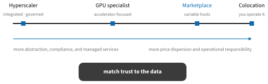
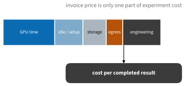
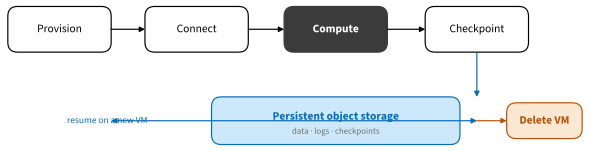

# Renting Cloud Accelerators
:label:`sec_cloud_instances`

Renting a machine is useful when a workload is too large, too slow, or too
bursty for local hardware. The difficult part is rarely clicking **Create
instance**. It is choosing a resource that fits, controlling its trust
boundary, preserving results, and stopping every billable component when the
experiment ends.

## Choosing a Provider

### Provider Categories

Cloud offerings lie on a spectrum rather than in two neat groups.


:label:`fig_tools_cloud_spectrum`

* **Hyperscalers** such as AWS, Google Cloud, and Microsoft Azure offer broad
  regional coverage, identity and networking controls, managed storage, and
  many adjacent services.
* **GPU specialists** focus on accelerators, cluster fabrics, and machine
  learning images. Examples include CoreWeave, Lambda, Crusoe, and RunPod.
* **Marketplaces** such as Vast.ai aggregate independently operated hosts. They
  can expose consumer GPUs at attractive prices, with more variation in host
  reliability, storage, networking, and trust.
* **Colocation or dedicated hosts** provide control for sustained use but move
  hardware operation back to you.

These are categories, not quality rankings. Sensitive or regulated data may
require a provider, region, contract, and isolation model that a public
marketplace cannot offer. A public benchmark or synthetic dataset may not.

### Start With the Workload

Specify the constraint before browsing instance names:

1. Peak accelerator memory, including weights, optimizer state, activations,
   temporary workspaces, and a safety margin.
1. Compute type and throughput: tensor-core precision, memory bandwidth, or
   latency may matter more than nominal FLOP/s.
1. Number of accelerators and their interconnect. PCIe-connected devices do not
   behave like a high-bandwidth fabric for communication-heavy training.
1. Host RAM, CPU preprocessing, local scratch capacity, and storage speed.
1. Ingress, egress, and checkpoint bandwidth.
1. Expected wall time and tolerance for interruption.

If the model does not fit, a faster GPU does not solve the problem. If data
loading starves the accelerator, paying for another accelerator can make
utilization worse.

### Compute the Complete Cost

Hourly accelerator price is only the most visible term.


:label:`fig_tools_cloud_cost_stack`

The following small model is more informative than comparing hourly prices.
Change its assumptions before choosing an instance.

```{.python .input #cloud-instances-cost-model}
import numpy as np

hours = np.array([8.0, 8.0, 8.0])
gpu_per_hour = np.array([1.20, 2.10, 3.40])
relative_speed = np.array([1.0, 1.8, 3.1])
setup_hours = np.array([1.0, 0.5, 0.5])
engineer_per_hour = 60.0
storage_and_egress = np.array([4.0, 6.0, 8.0])

wall_hours = hours / relative_speed
invoice = (wall_hours + setup_hours) * gpu_per_hour + storage_and_egress
complete_cost = invoice + setup_hours * engineer_per_hour
list(zip(np.round(wall_hours, 2), np.round(invoice, 2),
         np.round(complete_cost, 2)))
```

This is not an argument for assigning a monetary value to every minute in all
contexts. It is a reminder that an unreliable cheap host can be expensive when
experiments repeatedly fail, and that a reproducible image can pay for itself.

Spot or interruptible capacity can reduce the invoice when the job checkpoints
and resumes correctly. It is usually a poor discount for an interactive
session or an uncheckpointed run. Treat eviction as a normal event and test
recovery before committing a long experiment.

## Operating Disposable Compute

### A Disposable-Compute Workflow

Separate the lifetime of computation from the lifetime of valuable state.


:label:`fig_tools_cloud_lifecycle`

A vendor-neutral workflow is:

1. Create a project, budget, and billing alert. Set quotas low enough that a
   credential mistake cannot allocate a fleet.
1. Choose a current provider image with drivers and container support. Avoid a
   hand-written CUDA installation unless driver work is the experiment.
1. Attach the smallest necessary identity. Do not place long-lived cloud keys
   on the instance.
1. Restrict inbound networking to SSH, a VPN, or the provider's session
   manager. Do not expose Jupyter directly to the public internet.
1. Restore code, data, and a checkpoint from versioned durable storage.
1. Run a short smoke test, then the measured workload.
1. Sync checkpoints, logs, and final artifacts away from the VM.
1. Delete the instance and inspect disks, snapshots, reserved addresses, and
   object storage that may continue to incur charges.

### Secure Connection and Remote Jupyter

Prefer an SSH configuration entry over repeatedly copying long commands:

```text
Host d2l-gpu
    HostName 203.0.113.10
    User ubuntu
    IdentityFile ~/.ssh/d2l_ed25519
    IdentitiesOnly yes
```

Then forward a local port to a JupyterLab server bound only to the remote
loopback interface:

```bash
# Remote machine
uv run jupyter lab --no-browser --ip 127.0.0.1 --port 8888
```

```bash
# Local machine
ssh -N -L 8888:127.0.0.1:8888 d2l-gpu
```

Open the tokenized `http://127.0.0.1:8888/` URL locally. Keep Jupyter's token
enabled. VS Code Remote SSH provides another route: the editor stays local
while its server and Python kernel run on the instance.

### Images and Containers

A machine image defines the host operating system and driver. A container
defines most user-space libraries. The host driver must be compatible with the
container's CUDA runtime. Record all three identities: image, container digest,
and source revision.

Use an image from the provider or framework vendor when possible, then pin a
container by digest for important runs. `latest` is a convenient experiment,
not a reproducible dependency. Mount data read-only when the job does not need
to modify it, and write checkpoints to a deliberate output location.

### Capacity and Failure Checks

Before a long run, verify:

```bash
nvidia-smi
df -h
ulimit -n
```

Also run a framework allocation and one training step. A GPU name in a console
does not verify that the driver works, collectives can communicate, the disk
has space, or the dataset can be read fast enough. Monitor accelerator
utilization, host memory, I/O wait, network traffic, and checkpoint duration.

## Ownership Economics

Rent when demand is bursty, the required device changes frequently, or a short
job needs more memory than you can sensibly own. Buy when a well-understood
workload uses one system steadily, privacy favors local execution, and power,
noise, cooling, maintenance, and opportunity cost are acceptable. Hybrid use
is common: develop locally, reproduce on one rented GPU, then scale only the
measured bottleneck.

## Summary

* Choose from workload constraints, not provider instance names.
* Include idle time, storage, egress, reliability, and setup in cost.
* Match the provider's trust boundary to the data.
* Make compute disposable and checkpoints durable.
* Restrict network access, pin environments, test recovery, and delete every
  billable resource after use.

## Exercises

1. Compare three currently available instances using cost per completed run,
   not cost per hour. State the date and all assumptions.
1. Draw the trust boundary for a marketplace host processing public data and
   for a hyperscaler processing confidential data.
1. Write a teardown checklist that includes resources other than the VM.
