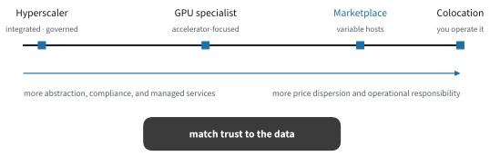
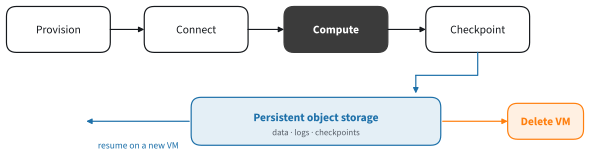

# Cloud Computing
:label:`sec_cloud_instances`

A workload may exceed the hosted-notebook limits described in
:numref:`sec_hosted_notebooks` because preprocessing takes
many hours, the model requires 80 GB of accelerator memory, or an experiment
needs several GPUs. Renting provides access to larger configurations without
purchasing them. The dated mid-2026 examples below show substantial price
variation across providers; current prices must be checked before use. The
book's notebooks stay below 8 GB of GPU memory, so a 16 GB rentable GPU has
adequate capacity. Full fine-tuning, long-context serving, and pretraining
increase both memory requirements and cost.

Effective cloud use requires matching a machine to the workload and treating
the instance as disposable. Results must be copied to durable storage before
the instance is deleted.

## The Rental Market

### Three Tiers of Provider


:label:`fig_tools_cloud_spectrum`

* **Hyperscalers** — AWS, Google Cloud, Microsoft Azure — sell GPUs
  embedded in a full cloud: identity management, virtual networks, managed
  storage, and every adjacent service. You pay for that integration; their
  on-demand GPU prices are consistently the highest, and the largest
  instances often require quota requests or sales contact. They are often
  appropriate when data already resides in that cloud, when
  compliance requirements apply, or when training is part of a larger
  managed system. Google
  additionally rents TPUs (a v5e chip for about \$1.20 per hour in this
  snapshot), which can run the JAX code in this book.
* **GPU specialists** — Lambda, CoreWeave, Crusoe, Nebius, Voltage Park,
  Together, and others — do one thing: accelerators with fast interconnect
  and ML-ready images. Self-serve H100s run \$2–4.30 per hour (July 2026);
  Lambda and Nebius are fully self-serve, while CoreWeave publishes prices
  but onboards through sales. This tier suits substantial training runs that do not require a
  hyperscaler's surrounding services.
* **Marketplaces** — Vast.ai, RunPod, TensorDock, Prime Intellect, and the
  auction-style SF Compute — aggregate machines from many independent
  operators, including consumer GPUs that the large clouds do not carry.
  These marketplaces often list the lowest hourly prices: an RTX 4090 for
  \$0.30–0.60 per hour, an
  H100 from about \$1.50. The catch is variance: host reliability, disk
  speed, and network quality differ per listing, and your code runs on a
  stranger's machine — fine for coursework and public data, inappropriate
  for anything sensitive unless the platform's vetted tier is used.

### A Dated Price Snapshot

Prices change quickly and vary by region, availability, commitment, and host.
Treat the following July 2026 snapshot as an illustration rather than a
catalog, and obtain current quotes before making a purchasing decision:

:GPU rental snapshot, on-demand (July 2026)
:label:`tab_cloud_prices`

| Provider (tier) | Cheap GPU option | ≈ \$/hr | 1× H100 80 GB ≈ \$/hr |
|---|---|---|---|
| Vast.ai (marketplace) | RTX 4090 24 GB | 0.35 | 1.50–1.90 |
| RunPod (marketplace) | RTX 4090 24 GB | 0.35–0.70 | 2.90 (vetted hosts) |
| Prime Intellect (marketplace) | RTX 4090 24 GB | 0.32 | 1.49 |
| Lambda (specialist) | A100 40 GB | 1.99 | 3.99–4.29 |
| Nebius (specialist) | RTX PRO 6000 48 GB | 1.80 | 3.85 |
| Voltage Park (specialist) | H100 (only SKU) | 1.99 | 1.99 |
| AWS (hyperscaler) | L4 24 GB (g6) | 0.80 | 6.88 (p5) |
| Azure (hyperscaler) | A10 24 GB | 1.43 | 6.98 |
| Google Cloud (hyperscaler) | L4 24 GB | 0.70 | ≈ 11 (A3) |

Three qualifications matter. First, providers may offer account-, student-,
or startup-specific credits. Eligibility and amounts change, so verify them
on the provider's official program page rather than budgeting from this
snapshot. Second, multi-GPU nodes price linearly per GPU
on most providers, but the interconnect does not: an 8×H100 machine with
NVLink is a qualitatively different tool from eight PCIe cards, and
communication-heavy training (:numref:`sec_training_systems`) will feel the
difference. Third, newer is not always cheaper per unit of work: B200-class
instances (\$6–14 per GPU-hour) only pay off when you exploit their memory
and FP8/FP4 throughput.

### Cost per Result, Not per Hour

The hourly price is the most visible term of a larger sum: setup time,
idle time while you debug, storage that keeps billing after the run, data
egress, and engineering time. A faster, more expensive GPU can reduce the
cost per *completed* experiment.
The model below compares an inexpensive marketplace card with two datacenter
GPUs for the same eight-hour job on the slowest card. Rerun it with
workload-specific assumptions:

```{.python .input #cloud-instances-cost-model}
import numpy as np

gpu = ["RTX 4090", "A100 80GB", "H100"]
gpu_per_hour = np.array([0.40, 1.50, 2.50])   # marketplace, July 2026
relative_speed = np.array([1.0, 1.6, 3.0])    # measure for your workload!
setup_hours = np.array([0.5, 0.5, 0.5])
storage_and_egress = np.array([2.0, 2.0, 2.0])
engineer_per_hour = 60.0

wall_hours = 8.0 / relative_speed
invoice = (wall_hours + setup_hours) * gpu_per_hour + storage_and_egress
complete = invoice + setup_hours * engineer_per_hour
for row in zip(gpu, np.round(wall_hours, 1), np.round(invoice, 2),
               np.round(complete, 2)):
    print(row)
```

The hourly invoice favors the inexpensive card, but including engineering
time makes the totals similar. If slower iteration adds another debugging
round, the faster card can cost less overall. Reliability therefore belongs
in the cost model. As an order-of-magnitude example, a LoRA fine-tune of a 7B model may take
hours on one consumer GPU, whereas pretraining a small language model can
require thousands of GPU-hours. Estimate the workload before comparing small
differences in hourly price.

Two cost traps deserve their own warnings:

* **Spot and interruptible capacity** may be substantially discounted and can
  suit jobs that checkpoint and resume cleanly
  (:numref:`sec_training_systems`). It is the wrong discount for an
  interactive session or an uncheckpointed run — eviction notice can be as
  short as a few seconds on marketplace spot tiers. Test recovery *before*
  the long run, not during it.
* **Egress fees.** Hyperscalers charge roughly \$0.09–0.12 per GB to move
  data out. Re-downloading a 140 GB checkpoint daily costs more per month
  than many GPUs. Keep data and compute in the same region, and prefer
  providers with free egress (most marketplaces) when your workflow moves
  big artifacts around.

## Working on a Rented Machine

### Boot, Connect, Verify

Start from the provider's current deep-learning image, with drivers, CUDA,
and the container runtime preinstalled. A bare OS image requires additional
setup that must also be reproduced later.
Connect with the SSH-tunnel pattern of :numref:`sec_interactive_development`
(the same two commands work on every provider), or use VS Code Remote SSH.
Run long jobs under `tmux` so an SSH disconnect does not kill training, and
verify the machine before trusting it with a long run:

```bash
nvidia-smi                 # driver ok? expected GPU? memory free?
df -h                      # scratch disk has room for data + checkpoints?
python -c "import torch; print(torch.cuda.get_device_name(0))"
```

A short smoke test—one batch through the model and one checkpoint written
and read back—can detect problems that instance-health indicators omit:
broken drivers, full disks, read-only mounts, and datasets that
stream too slowly to keep the GPU busy.

### Compute Is Disposable, Results Are Not


:label:`fig_tools_cloud_lifecycle`

The workflow in :numref:`fig_tools_cloud_lifecycle` separates the lifetime
of the machine from the lifetime of your work. Code is stored in Git and
cloned onto the instance; data and checkpoints sync to durable object
storage (S3, GCS, or the provider's volume product) on a schedule the job
controls; the instance itself can then be preempted, crashed, or deleted
without losing more than the last checkpoint interval. This is not merely a
safety practice — it enables recovery from preemption or host failure.

When the experiment ends, tear down *everything that bills*: the instance,
its disks and snapshots, reserved IP addresses, and stale buckets. Set a
billing alert on day one; a forgotten idle GPU costs the same as a busy
one, and quota limits are the only thing standing between a leaked
credential and a very large invoice.

## Summary

* Every notebook in this book fits in 8 GB of GPU memory, so the cheapest
  rentable GPUs suffice; LLM-scale work is what climbs the price ladder.
* The market has three tiers — hyperscalers, GPU specialists, and
  marketplaces — with a substantial price spread for the same GPU and different levels of
  integration, reliability, and operational trust.
* Compare cost per completed result, not per hour: include setup, idle
  time, storage, egress, and your own time.
* Spot capacity can reduce the cost of checkpointed, restartable jobs but is
  unsuitable for some interactive or uncheckpointed work; egress fees can
  make repeated artifact transfers expensive.
* Treat instances as disposable: provider image, SSH tunnel, `tmux`,
  checkpoints to durable storage, then delete every billable resource.

## Exercises

1. Price a fine-tuning job you care about on three providers from
   :numref:`tab_cloud_prices` using cost per completed run. State the date
   and your speed assumptions, then check how prices have moved since this
   table was written.
1. Take whichever training notebook of this book you ran most recently and
   measure its actual GPU memory high-water mark. Which entries of
   :numref:`tab_cloud_prices` could run it?
1. Simulate an interruption: start a checkpointed training run, kill the
   process mid-epoch, and resume on a fresh machine from object storage.
   Time the recovery and identify what you forgot to save.
1. Draw the trust boundary for (a) a marketplace host processing a public
   dataset and (b) a hyperscaler processing medical records. What changes?
