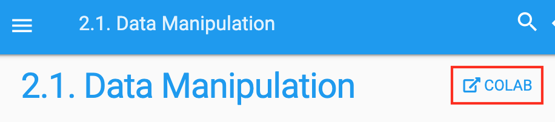

# Using Google Colab {#sec-colab}

We introduced how to run this book on AWS in @sec-sagemaker and @sec-aws. Another option is running this book on [Google Colab](https://colab.research.google.com/)
if you have a Google account.

To run the code of a section on Colab, simply click the `Colab` button as shown in @fig-colab. 

{#fig-colab width="300px"}

If it is your first time to run a code cell,
you will receive a warning message as shown in @fig-colab2.
Just click "RUN ANYWAY" to ignore it.

{#fig-colab2 width="300px"}

Next, Colab will connect you to an instance to run the code of this section.
Specifically, if a GPU is needed, 
Colab will be automatically requested 
for connecting to a GPU instance.

## Summary

* You can use Google Colab to run each section's code in this book.
* Colab will be requested to connect to a GPU instance if a GPU is needed in any section of this book.

## Exercises

1. Open any section of this book using Google Colab.
1. Edit and run any section that requires a GPU using Google Colab.

[Discussions](https://discuss.d2l.ai/t/424)
