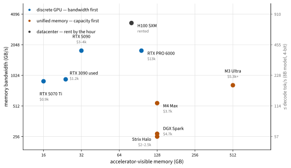

# Hardware
:label:`sec_hardware_buyers`

At some point most practitioners ask: should I buy a machine? This section
is a buyers guide. Concrete hardware advice ages quickly — we quote prices
as of July 2026 and expect them to be wrong in a year (indeed, 2026's
memory shortage has GPUs *appreciating*, an anomaly worth remembering when
you read anyone's price table, including ours). What does not age is the
reasoning: figure out whether your workload is bound by memory capacity,
memory bandwidth, or compute, and buy the binding constraint. The specific
machines below are reference points for that reasoning as much as
recommendations.

Two physical facts organize everything that follows. First, **capacity
gates what runs at all**: training state is several times model size
(:numref:`sec_training_systems`), and an LLM that does not fit in memory
does not run slowly — it does not run. Second, **bandwidth gates
generation speed**: producing one token requires streaming essentially all
active weights through the compute units, so

$$
\textrm{decode tokens/s} \lesssim
\frac{\textrm{memory bandwidth}}{\textrm{bytes of active weights}},
$$

while *prompt processing* (prefill) and *training* are parallel across
tokens and lean on compute instead. Machines differ by an order of
magnitude on each axis, in different directions — which is why "what
should I buy?" has no single answer, but always the same analysis.

## What Are You Buying For?

Before comparing cards, estimate both sides of the constraint. For
training, peak memory (:numref:`fig_tools_memory_fit`):


:label:`fig_tools_memory_fit`

```{.python .input #hardware-memory-estimate}
def training_memory_gib(parameters_billion, weight_bytes=2,
                        gradient_bytes=2, optimizer_bytes=8,
                        activation_gib=6, workspace_gib=2):
    parameters = parameters_billion * 1e9
    state = parameters * (weight_bytes + gradient_bytes + optimizer_bytes)
    return state / 2**30 + activation_gib + workspace_gib

for b in [0.1, 1, 7]:
    print(f"{b:>4}B params: {training_memory_gib(b):6.1f} GiB")
```

A 7B full fine-tune wants ~90 GiB — no consumer card holds it — while
LoRA (freeze the weights, train small adapters, quantize the base to
4 bits) collapses the same job to under 8 GiB. That single technique is
why a 16 GB card is a genuine training machine in 2026. For inference,
apply the decode bound:

```{.python .input #hardware-decode-bound}
bandwidth_gbs = {"RTX 5070 Ti": 896, "RTX 3090 (used)": 936,
                 "RTX 5090": 1792, "RTX PRO 6000": 1792,
                 "DGX Spark": 273, "Strix Halo": 256,
                 "M4 Max": 546, "M3 Ultra": 819, "H100 SXM": 3350}
active_gb = 4.5   # 8B model at 4-bit, including cache traffic
for device, bw in sorted(bandwidth_gbs.items(), key=lambda kv: -kv[1]):
    print(f"{device:>16s}: <= {bw / active_gb:5.0f} tok/s")
```

Realized speed is typically 50–80% of this bound, but the *ordering* it
predicts matches measurement remarkably well — and it explains oddities
like a \$4,700 DGX Spark decoding no faster than a MacBook: both stream
weights at roughly 273 GB/s.


:label:`fig_tools_hardware_menu`

:numref:`fig_tools_hardware_menu` plots the July 2026 menu on those two
axes. The machines split into two families — discrete GPUs (fast, small)
and unified-memory systems (capacious, slow) — with the workstation-class
RTX PRO 6000 bridging them at a price. Everything below walks this figure.

## Training Boxes: Discrete NVIDIA GPUs

For training and fine-tuning, a discrete NVIDIA card remains the default:
highest bandwidth per dollar, mature software (every framework in this
book, FlashAttention, quantization kernels) and the same CUDA stack you
will meet on rented cloud machines.

### RTX 5070 Ti: the Smallest Serious Trainer

The RTX 5070 Ti (16 GB GDDR7 at 896 GB/s, 300 W, ~\$900 in July 2026
against a \$749 list) is about the smallest card we would recommend for
*training* rather than only inference. Sixteen gigabytes runs every
notebook in this book with plenty of headroom, LoRA/QLoRA fine-tunes of
7–8B models comfortably, and diffusion fine-tuning at 1024² — while a
12 GB card starts excluding exactly the experiments you will want to try
next. A complete quiet desktop around it (any 8-core CPU, 64 GB RAM, 1 TB
NVMe, 850 W supply) lands near \$2,000–2,500. Its natural competitor is
the used RTX 3090 (24 GB at 936 GB/s, ~\$1,000–1,400 used in July 2026):
more memory and similar bandwidth, but 350 W, no FP8/FP4 tensor cores, no
warranty, and — a 2026 curiosity — a price that has been rising.

### RTX 5090: the Enthusiast Box

The RTX 5090 (32 GB GDDR7 at 1.79 TB/s, 575 W, \$3,000–4,300 street in
July 2026 against a \$1,999 list) is the fastest thing you can put in a
desktop: datacenter-class bandwidth, Blackwell FP8/FP4 tensor cores, and
enough memory for full fine-tunes of small models and LoRA on anything up
to ~30B. It is also a *system-design problem*: budget a 1200 W power
supply with a native 16-pin connector (measured transients approach
660 W), a full tower with real airflow, the noise tolerance of a small
space heater, and — on a 120 V circuit — awareness that the whole box
under load approaches what the wall socket provides. A balanced build
(:numref:`fig_tools_workstation`) pairs it with a current 16-core CPU,
64–128 GB of RAM, and fast NVMe scratch for datasets; in the 2026 memory
market that totals \$6,500–10,000 depending mostly on the RAM.


:label:`fig_tools_workstation`

Two cards? Multi-GPU consumer rigs (classically 2–4 used 3090s) remain a
beloved r/LocalLLaMA pattern for cheap VRAM aggregation, and data
parallelism over PCIe works fine. Know what you are signing up for:
consumer boards offer one full-bandwidth slot, so you want used
Threadripper/EPYC platforms for lanes; power adds up (dual supplies are
common); and no consumer card since the 3090 has NVLink, so
communication-heavy tensor parallelism scales poorly. Renting an 8×GPU
node for a day (:numref:`sec_cloud_instances`) is the cheap way to learn
whether your workload cares.

## Local Inference: the Unified-Memory Class


:label:`fig_tools_memory_path`

A second family of machines answers a different question: not "how fast
can I train?" but "how large a model can I *run* at home?" These systems
give the GPU direct access to a large pool of ordinary (LPDDR5X) memory —
lots of capacity at a fraction of GDDR7/HBM bandwidth
(:numref:`fig_tools_memory_path`). The decode bound tells you exactly what
to expect: big models run, none of them run fast, and mixture-of-experts
models — which activate only a few billion parameters per token — are the
loophole that makes the class shine. The July 2026 menu:

:Unified-memory machines for local inference (July 2026)
:label:`tab_unified_memory`

| Machine | Memory | Bandwidth | ≈ Price | Notes |
|---|---|---|---|---|
| AMD Strix Halo mini-PC | 128 GB | 256 GB/s | \$2,000–2,500 | Framework, Beelink, HP et al.; ROCm still maturing, Vulkan works |
| NVIDIA DGX Spark (GB10) | 128 GB | 273 GB/s | \$3,500–4,700 | CUDA-native Blackwell; strong prefill; two units pair to 256 GB |
| Mac Studio M4 Max | up to 128 GB | 546 GB/s | from \$2,500 | MLX ecosystem; quiet, efficient |
| Mac Studio M3 Ultra | up to 96 GB new | 819 GB/s | from \$5,300 | 256/512 GB configs discontinued 2026; used units carry a premium |
| MacBook Pro M5 Max | up to 128 GB | 614 GB/s | from ~\$3,500 | the same class, portable |

Measured reality (community `llama-bench` figures, mid-2026) matches the
bandwidth ordering: the 120B-parameter MoE `gpt-oss` (~5B active per
token) generates ~71 tok/s on an M3 Ultra, ~35 on a DGX Spark, ~40 on
Strix Halo; a *dense* 70B at 4-bit limps at 5–12 tok/s on all of them.
Where they differ sharply is prefill: the Spark's Blackwell tensor cores
chew through long prompts several times faster than Strix Halo or Apple's
GPU at the same decode speed — the compute-versus-bandwidth split of our
opening formula, embodied in retail products. Choose by stack: CUDA
development in miniature → DGX Spark; cheapest 128 GB and Linux → Strix
Halo; the fastest local decode and a polished laptop-to-desktop path →
Apple with MLX.

## The Top End: Workstation Blackwell

The RTX PRO 6000 Blackwell packs 96 GB of GDDR7 at the 5090's 1.79 TB/s —
the upper-right bridge in :numref:`fig_tools_hardware_menu` — for about
\$13,000 list in July 2026 (it launched at \$8,565; the memory crisis did
the rest). A 300 W Max-Q variant with identical memory exists precisely so
that four of them fit in one chassis: a 2× build (~\$30–35k) runs
unquantized 70B inference and full 70B fine-tunes; a 4× Threadripper PRO
workstation (~\$60k turnkey) holds 384 GB — DeepSeek-class MoE territory
at 4-bit. One caveat defines the class: no NVLink (dropped from
workstation cards after Ampere), so inter-card traffic rides PCIe 5.0 at
~64 GB/s per direction — nearly thirty times slower than each card's local
memory. Data- and pipeline-parallel workloads shrug; tensor parallelism
pays. Against this budget, always price the alternative: \$60k rents
roughly 20,000 H100-hours (:numref:`tab_cloud_prices`), and the break-even
needs sustained, private, or interactive use to clear:

```{.python .input #hardware-break-even}
purchase_and_operation = 4200.0     # e.g. a 5090 box + 3y power
rental_per_productive_hour = 2.50   # H100-class marketplace rate
print(f"{purchase_and_operation / rental_per_productive_hour:.0f} "
      "productive hours to break even")
```

The relevant inputs are *productive* hours (a home box idles more than you
think) — against which weigh privacy, zero queue time, and the real
pedagogical value of hardware you can take apart.

## Keeping Current

Everything above will drift; the sources below stay good. For build
advice and street prices, [r/LocalLLaMA](https://www.reddit.com/r/LocalLLaMA/)
(hardware megathreads) and the
[Level1Techs forum](https://forum.level1techs.com/) (multi-GPU build
logs); for reviews of exactly this niche — Strix Halo boxes, DGX Spark,
used servers — [ServeTheHome](https://www.servethehome.com/); for
apples-to-apples numbers, the community benchmark threads in
[llama.cpp discussions](https://github.com/ggml-org/llama.cpp/discussions)
and [llm-tracker.info](https://llm-tracker.info/); and for the durable
*reasoning* about GPU choice, Tim Dettmers' classic guide (frozen in 2023,
still right about everything except the part numbers). One warning: GPU
search results are now thick with machine-generated pages quoting invented
benchmarks — trust datasheets, named reviewers, and numbers that pass the
decode-bound sanity check above.

## Summary

* Buy the binding constraint: capacity gates what runs, bandwidth gates
  decode speed, compute gates training and prefill — and the decode bound
  (bandwidth ÷ active bytes) predicts generation speed to within a factor
  of two.
* Reference points, July 2026: RTX 5070 Ti (~\$900, 16 GB) is the smallest
  serious trainer; RTX 5090 (~\$3–4k, 32 GB) is the enthusiast ceiling and
  a system-design exercise; used 3090s remain the budget VRAM play.
* Unified-memory machines (Strix Halo, DGX Spark, Apple silicon) trade
  bandwidth for capacity: large MoE models run well, dense 70B crawls,
  and prefill speed separates otherwise similar boxes.
* The RTX PRO 6000 class (96 GB at full bandwidth, no NVLink) bridges the
  two families for five figures; before spending it, price the rented
  equivalent.
* Date-stamp every price you rely on, and get current numbers from the
  community sources above rather than from search-engine filler.

## Exercises

1. Compute the decode bound for a 30B-A3B mixture-of-experts model (3B
   active parameters, 4-bit) on every machine in
   :numref:`tab_unified_memory`. Which become interactive (>20 tok/s)?
1. Estimate LoRA fine-tuning memory for an 8B model on a 16 GB card:
   4-bit frozen base, BF16 adapters at 1% of parameters, Adam. Does it
   fit, and what dominates?
1. Spec a complete RTX 5070 Ti build at current local prices, then
   compute its break-even in hours against a rented 4090 from
   :numref:`tab_cloud_prices`.
1. Find this month's used 3090 price and recompute its \$/GB against the
   current 5070 Ti. Has the 2026 anomaly (used cards appreciating)
   persisted?
