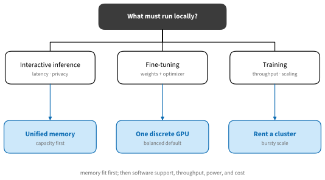
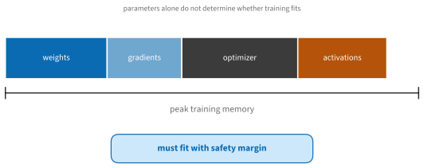
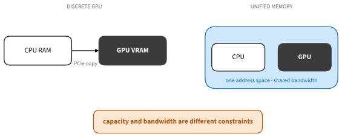
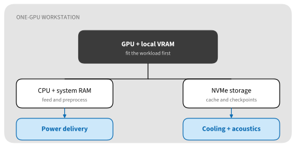

# Choosing Hardware for Deep Learning
:label:`sec_hardware`

Hardware advice ages quickly; resource reasoning does not. Begin with the
workload, establish whether it fits, and then compare throughput, software
support, power, noise, and total cost. A long table of today's GPUs is less
useful than a calculation you can repeat for tomorrow's devices.

## Workload and Memory

### Training and Inference Ask Different Questions


:label:`fig_tools_hardware_decision`

Interactive inference values latency, quiet operation, privacy, and enough
memory for model weights plus the key--value (KV) cache. Fine-tuning adds
gradients, optimizer state, and activations. Training from scratch values
throughput and often communication across devices. A system ideal for one can
be wasteful for another.

Cloud rental remains part of the hardware choice. If the ambitious run happens
twice a year, local hardware should serve daily work rather than the largest
conceivable model.

### Estimate Memory Before Comparing Speed

For inference, a first estimate is

$$
M_{\textrm{inference}} \approx NP/8 + M_{\textrm{KV}} + M_{\textrm{workspace}},
$$

where $N$ is the parameter count and $P$ the stored bits per parameter. File
size is not always resident memory: quantization metadata, runtime buffers,
mixture-of-experts routing, and multiple concurrent sequences add overhead.

Training has more terms.


:label:`fig_tools_memory_fit`

The simple calculator below makes each assumption visible. It is an estimate,
not a substitute for profiling a real step.

```{.python .input #hardware-memory-estimate}
def training_memory_gib(parameters_billion, weight_bytes=2,
                        gradient_bytes=2, optimizer_bytes=8,
                        activation_gib=6, workspace_gib=2):
    parameters = parameters_billion * 1e9
    state = parameters * (weight_bytes + gradient_bytes + optimizer_bytes)
    return state / 2**30 + activation_gib + workspace_gib

training_memory_gib(7)
```

Activation memory depends on batch size, sequence or image dimensions, layer
shapes, precision, and checkpointing. Optimizer memory depends on the optimizer
and implementation. Sharding can divide some terms across accelerators but
adds communication and temporary buffers. Reserve a margin rather than
designing for an estimate that exactly equals advertised capacity.

## System Architecture

### Compute, Bandwidth, and Utilization

Peak FLOP/s describes a favorable dense operation at a particular precision.
It does not predict an end-to-end notebook. Small kernels, data movement,
Python overhead, unsupported precision, preprocessing, and communication can
leave much of that peak unused.

Arithmetic intensity connects computation to memory traffic. Operations with
few arithmetic instructions per byte tend to be bandwidth-bound; large matrix
multiplications can be compute-bound once shapes are large enough. Autoregressive
decode often stresses memory bandwidth, while prompt prefill and training can
use tensor compute more effectively.

Benchmark the intended model, precision, batch or sequence shape, and software
stack. Warm up compiled kernels, synchronize device timing, and report median
and tail behavior rather than the best iteration.

### Discrete VRAM and Unified Memory


:label:`fig_tools_memory_path`

A discrete GPU couples high-bandwidth local memory with a transfer link to the
CPU. It is often the strongest choice for training performance and broad CUDA
software support, but the working set must fit its VRAM or pay for sharding and
offload.

Unified-memory systems, including Apple silicon and AMD Strix Halo-class
machines, can expose a large fraction of system memory to the GPU. This is
attractive for local inference on models larger than consumer VRAM. Shared
capacity does not turn all memory into high-bandwidth VRAM, and framework,
kernel, quantization, and distributed-training support differ. Verify the exact
model and runtime.

### Representative Personal Systems

The following categories are deliberately durable. Concrete products and
prices should be recorded with a date.

* A recent **single consumer NVIDIA GPU** offers the widest CUDA compatibility
  and strong training throughput. A GeForce RTX 5090-class card also demands a
  suitable case, power supply, cooling path, circuit, and tolerance for noise.
* A **unified-memory workstation or compact system** trades peak training
  throughput for model capacity, efficiency, and local inference convenience.
  Apple silicon and Strix Halo are important examples, with different software
  ecosystems.
* A **small edge device** is valuable for deployment constraints, sensors, and
  power-aware inference, not as a miniature training server.
* A **used datacenter GPU** may offer memory capacity, but check cooling format,
  power connectors, display outputs, driver support, condition, and whether it
  expects server airflow.

Do not infer performance from model names across vendors. Compare measurements
from the same workload and software version.

### Anatomy of a One-GPU Workstation


:label:`fig_tools_workstation`

The accelerator is only one component:

* **CPU and RAM:** enough cores and memory to decode, augment, tokenize, compile,
  and keep workers fed. More workers are not always faster; measure contention.
* **PCIe lanes:** ensure the main slot has the intended electrical width and is
  not silently reduced by storage or another card.
* **Storage:** use NVMe scratch for active datasets and caches, plus a separate
  backup strategy. Capacity without sustained I/O can starve training.
* **Power:** size for sustained load and transients, use the correct cable and
  connector guidance, and confirm the wall circuit.
* **Cooling and noise:** check card dimensions, radiator or heatsink clearance,
  intake area, exhaust path, ambient temperature, and the noise level you can
  tolerate for hours.
* **Networking:** local dataset storage may be enough for one machine; shared
  training and remote storage require measured bandwidth and latency.

### Multiple GPUs

Two cards do not automatically provide twice the usable memory or speed. Data
parallelism replicates the model. Sharded training divides selected state but
communicates it. Tensor and pipeline parallelism impose different traffic and
latency. Consumer cards connected only through PCIe can be effective for
independent jobs and some data parallel workloads, but communication-heavy
sharding may scale poorly.

Before building a multi-GPU workstation, verify motherboard slot spacing,
electrical lanes, peer-to-peer support, IOMMU behavior, power, cooling, and the
framework collective backend. Renting the intended topology for one day is a
cheap way to test the scaling assumption.

## Ownership Economics

Let $C_b$ be purchase plus expected power, maintenance, and resale loss;
$C_r$ the effective rental cost per productive hour; and $U$ productive local
hours. A crude break-even is $U=C_b/C_r$. The important word is *productive*:
include utilization, not the hours the machine is merely switched on.

```{.python .input #hardware-break-even}
purchase_and_operation = 4200.0
rental_per_productive_hour = 2.40
productive_hours_to_break_even = purchase_and_operation / rental_per_productive_hour
productive_hours_to_break_even
```

Adjust for the value of immediate access, privacy, setup time, hardware aging,
cloud egress, and the option to rent a much larger machine briefly. The result
is a decision aid, not a universal threshold.

## Summary

* Separate inference, fine-tuning, and training requirements.
* Establish peak memory fit before comparing nominal compute.
* Distinguish compute throughput, memory bandwidth, capacity, and utilization.
* Build a balanced one-GPU system before considering multiple GPUs.
* Date volatile product comparisons and benchmark the actual workload.
* Treat renting as an alternative component in a personal hardware plan.

## Exercises

1. Estimate inference and training memory for a model you use. List every term
   omitted by the estimate.
1. Compare a discrete-GPU system and a unified-memory system for one local
   inference workload. Separate capacity, bandwidth, latency, and software.
1. Compute a buy--rent break-even under three utilization assumptions and
   identify which assumption dominates the result.
