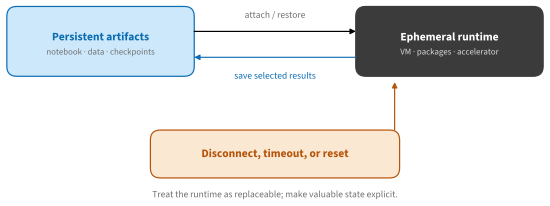
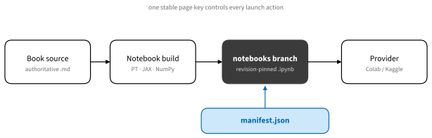

# Hosted Notebooks: Colab and Kaggle
:label:`sec_hosted_notebooks`

A hosted notebook exchanges control for convenience. You keep the notebook and
selected artifacts, while the provider creates a temporary machine with a
browser editor, a Python environment, and sometimes an accelerator. This is an
excellent way to begin an experiment or share a small reproduction. It is a
poor place to leave the only copy of a result.


:label:`fig_tools_hosted_lifecycle`

The distinction in :numref:`fig_tools_hosted_lifecycle` explains most surprises
in hosted notebooks. A runtime may stop after inactivity, reach a session
limit, or be replaced by a different software image. Files written only to its
local disk disappear with it. Conversely, reinstalling packages or rerunning a
setup cell is cheap when the notebook records everything needed to reconstruct
the runtime.

## A Portable Hosted Workflow

### Opening a Book Notebook

Each code-bearing page can have one or more generated notebooks. **Run
notebook** on the right of the web page follows the active framework tab:

* framework-independent pages use one NumPy notebook;
* framework-specific pages prefer PyTorch and offer JAX where the source has a
  JAX implementation;
* **Colab** opens the generated notebook, while **Download** saves the same
  provider-neutral file;
* **Kaggle** is enabled only for a tested, published Kaggle copy.

The public notebook is generated from the book source and records its exact Git
revision. Editing it does not change the book source.


:label:`fig_tools_notebook_pipeline`

This design, shown in :numref:`fig_tools_notebook_pipeline`, matters for trust.
The launch button is not uploading an arbitrary local file. It refers to a
readable notebook at a stable path on GitHub. Before running a notebook from
any site, inspect its setup cell and repository origin.

### A Portable Setup Cell

A useful setup cell is short, idempotent, and explicit. It should pin the
artifact revision, install only missing dependencies, and avoid secrets. The
following framework-independent pattern demonstrates the checks without
modifying the environment.

```{.python .input #hosted-notebooks-portable-setup}
import importlib.util
import platform

required = ["numpy", "matplotlib"]
missing = [name for name in required
           if importlib.util.find_spec(name) is None]
{
    "python": platform.python_version(),
    "missing": missing,
    "reconstructible": not missing,
}
```

For a real project, record exact model and dataset revisions as well as Python
packages. A provider image can change even when the notebook has not. Printing
the small environment fingerprint below makes bug reports far more useful.

```{.python .input #hosted-notebooks-environment-fingerprint}
import json
import numpy as np

fingerprint = {
    "python": platform.python_version(),
    "numpy": np.__version__,
    "machine": platform.machine(),
}
print(json.dumps(fingerprint, indent=2))
```

Avoid an unconditional `pip install --upgrade ...` near the top of a teaching
notebook. It discards a tested provider environment, increases startup time,
and makes yesterday's notebook resolve different packages today. Install a
missing package or a deliberate pinned version instead. Restart the kernel
when an installed binary package requires it.

## Provider Workflows

### Colab

[Google Colab](https://colab.research.google.com/) is closely integrated with
Google Drive and GitHub. A notebook opened from GitHub is not automatically
saved back to that repository. Use **File → Save a copy in Drive**, download an
`.ipynb`, or commit through a repository workflow you understand.

Choose an accelerator from the runtime settings when the experiment benefits
from it. Then verify the resource in code rather than inferring it from the
menu. Availability, quotas, session duration, and the exact device can vary by
account and over time.

```{.python .input #hosted-notebooks-resource-check}
import os

resource = {
    "cpu_count_visible": os.cpu_count(),
    "colab": "COLAB_RELEASE_TAG" in os.environ,
    "kaggle": "KAGGLE_KERNEL_RUN_TYPE" in os.environ,
}
resource
```

For PyTorch, check `torch.cuda.is_available()` and inspect
`torch.cuda.get_device_properties(0)`. For JAX, inspect `jax.devices()`. A
reported accelerator is not a guarantee that the workload fits its memory.

Colab also supports a local runtime. This lets the browser UI control a kernel
on hardware you operate, but it changes the security boundary: notebook code
can access that machine with the permissions of the Jupyter process. Bind the
server narrowly, authenticate it, and connect only notebooks you trust.

### Kaggle

[Kaggle Notebooks](https://www.kaggle.com/code) combine a notebook runtime with
versioned datasets, models, and saved outputs. A useful mental model is:

* **inputs** are attached read-only resources;
* the working directory is temporary scratch space;
* a saved notebook version can preserve selected outputs;
* internet access and accelerators are notebook settings and may be restricted
  for some competitions or workloads.

Put reusable data in a dataset or model artifact rather than downloading it on
every run. Save a version before leaving a long computation, and verify that
the checkpoint appears in the version output. The
[official Kaggle CLI](https://github.com/Kaggle/kaggle-cli) can create, update,
run, and download notebook outputs; keep its token in the provider's secret
store or a local credential file, never in a notebook cell.

Kaggle does not document a stable public URL that imports any arbitrary GitHub
notebook directly into an editable session. For that reason this book links
only to canonical Kaggle copies that have been published and tested. The
download action remains available for importing the `.ipynb` manually.

### Colab or Kaggle?

:Hosted notebook trade-offs
:label:`tab_hosted_notebook_tradeoffs`

| Need | Colab | Kaggle |
|---|---|---|
| Open a GitHub notebook directly | Strong | Import or published copy |
| Persistent personal files | Drive integration | Versioned outputs and datasets |
| Reusable public datasets/models | Possible, external | Integrated resources |
| Competition workflow | External | Integrated |
| Temporary CPU/GPU runtime | Yes | Yes |
| Exact device or uninterrupted duration | Not guaranteed | Not guaranteed |
| Best escape hatch | Download `.ipynb` | Download `.ipynb` and outputs |

The right choice is often the service where the data already lives. For a
small book example, Colab's direct GitHub opening is convenient. For a
dataset-centered, shareable experiment, Kaggle's versioned inputs and outputs
can be more natural. For long training runs, sensitive data, unusual drivers,
or strict availability, use a machine you control or a cloud instance.

## Portability and Secrets

Portable notebooks avoid assumptions about `/content`, `/kaggle/working`, a
particular GPU, or credentials in environment variables. Keep provider-specific
paths in one small adapter and use `pathlib` elsewhere.

```{.python .input #hosted-notebooks-work-directory}
from pathlib import Path

if Path("/kaggle/working").exists():
    work = Path("/kaggle/working")
elif Path("/content").exists():
    work = Path("/content")
else:
    work = Path.cwd()
work
```

Use the provider's secret manager for API tokens. Do not print a secret, store
it in notebook output, include it in an exception, or commit it into a saved
copy. Treat a public notebook as executable publication: remove credentials,
personal paths, private data samples, and hidden output before sharing.

## Summary

* A hosted runtime is replaceable; save durable artifacts explicitly.
* Generated notebooks record a source revision and remain downloadable without
  depending on a provider.
* Verify the actual accelerator and environment, and make setup idempotent.
* Colab excels at direct GitHub opening; Kaggle integrates versioned datasets,
  notebook versions, and outputs.
* Secrets belong in a secret store, not in source code or cell output.

## Exercises

1. Open this notebook in a hosted service. Restart the runtime and determine
   which files and installed packages survive.
1. Extend the environment fingerprint with the selected framework version and
   accelerator name, without failing on a CPU-only runtime.
1. Design a three-cell notebook that downloads a revision-pinned small dataset,
   computes a result, and saves that result to persistent storage.
