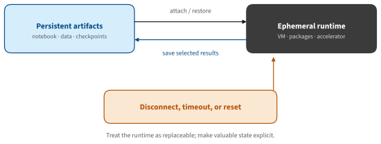
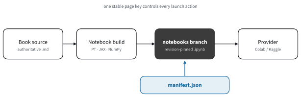

# Colab and Kaggle
:label:`sec_hosted_notebooks`

[Google Colab](https://colab.research.google.com/) and
[Kaggle](https://www.kaggle.com/code) provide browser-based notebooks on
temporary virtual machines, with limited free access to accelerators when
available. They allow readers to run the book without a local installation,
including from devices on which installing development software is
impractical. Availability and usage limits vary, so resource requirements
must still be checked for each notebook.

The provider controls the runtime. It creates a temporary machine with a
browser editor, a Python environment, and possibly an accelerator. When the
session ends because of an idle or usage limit, the machine and files written
only to its local disk disappear. Your notebook and any
artifacts you explicitly saved survive; nothing else does.


:label:`fig_tools_hosted_lifecycle`

The lifecycle in :numref:`fig_tools_hosted_lifecycle` explains the principal
failure modes of hosted notebooks. A runtime may stop after inactivity, hit a session
limit, or come back with a different software image. Conversely, rerunning a
setup cell has little overhead when the notebook records everything needed to
reconstruct the runtime — which is exactly how the notebooks in this book
are written.

## Launching a Book Notebook

Every code-bearing page of the book has a **Run notebook** control that
follows the active framework tab: framework-specific pages offer PyTorch,
TensorFlow, or JAX; framework-independent pages use a single NumPy notebook.
The generated notebooks live at a stable path on a public GitHub branch and
record the exact source revision they were built from.


:label:`fig_tools_notebook_pipeline`

The launch buttons use different persistence models:

* **Colab opens a pointer to GitHub.** The URL has the form
  `colab.research.google.com/github/<org>/<repo>/blob/<branch>/<path>.ipynb`,
  and Colab fetches the notebook from GitHub each time it is opened. You
  see the current published version — but your edits are
  *not* written back. To keep changes, use **File → Save a copy in Drive**
  (or download the `.ipynb`).
* **Kaggle imports a copy.** The book passes the notebook's raw URL to
  Kaggle's importer (`kaggle.com/kernels/welcome?src=...`), which creates a
  new private scratchpad *in your Kaggle account* containing that notebook.
  You can inspect it without signing in; editing and running require an
  account. Your copy is now independent of the book — it will not update
  when the book does, and keeping your changes means saving a version on
  Kaggle.

In short: Colab launches a live view of the repository, Kaggle clones a
snapshot into your workspace. Either way, the launch button never uploads an
arbitrary local file — it refers to a readable notebook at a stable public
path, which you can and should inspect before running. Treat that as a habit
for *any* "open in Colab" badge on the internet: check the repository origin
and the setup cell before executing someone else's code on your account.

## Colab

### Free-Tier Resources

Colab's free tier provides access to GPUs and TPUs, but its
[official FAQ](https://research.google.com/colaboratory/faq.html) does not
guarantee particular hardware, memory, or session duration. These
limits vary with demand, usage history, and product policy; a T4 with 16 GB
has been a common allocation, but it is not a service guarantee. Verify the
assigned hardware at runtime. Colab also integrates an assistant for writing
and debugging notebook code.

Do not infer the hardware from the menu — verify it in code:

```{.python .input #hosted-notebooks-resource-check}
import os

resource = {
    "cpu_count_visible": os.cpu_count(),
    "colab": "COLAB_RELEASE_TAG" in os.environ,
    "kaggle": "KAGGLE_KERNEL_RUN_TYPE" in os.environ,
}
resource
```

For PyTorch, check `torch.cuda.is_available()` and
`torch.cuda.get_device_properties(0)`; for TensorFlow,
`tf.config.list_physical_devices("GPU")`; for JAX, `jax.devices()`. A
reported accelerator is still not a guarantee that your workload fits its
memory.

When the free tier is insufficient, Colab offers paid plans and
pay-as-you-go *compute units*. Unit prices, accelerator consumption rates,
and plan features change, so consult the purchase dialog and current FAQ
before estimating cost. A compute-unit balance increases access but does not
guarantee a particular accelerator.

Two additional features affect reproducibility and automation. *Pinned runtime versions* let a
notebook request a dated environment image, taming the "worked yesterday,
broke today" package drift that plagues hosted runtimes. And the *Colab
CLI* (`colab exec`, `colab repl`) drives the same runtimes from a terminal
or a coding agent, which makes Colab usable as a scriptable free GPU rather
than only an interactive page.

### Saving Work

Colab is Drive-centric: **Save a copy in Drive** is the persistence story,
and Google Drive mounts (`drive.mount`) are the common way to keep datasets
and checkpoints across sessions. A notebook opened from GitHub is never
saved back automatically. Colab can also attach to a *local runtime* — the
browser UI controlling a Jupyter server on your own machine — which changes
the security boundary completely: the notebook then executes with the
permissions of your local Jupyter process. Connect only notebooks you trust.

## Kaggle

### A Data-Centric Model

Where Colab orbits Drive, Kaggle orbits *datasets and competitions*, and its
notebook product reflects that. Three directories define the mental model:

* `/kaggle/input/` holds attached datasets and models, mounted **read-only**
  and versioned. Attaching an existing dataset is instant and costs no
  download time or quota.
* `/kaggle/working/` is your writable output directory (about 20 GB); its
  contents persist only into *saved versions* of the notebook.
* everything else is scratch that disappears with the session.

The second defining feature is versioning. **Save & Run All** executes the
whole notebook top to bottom in a fresh session and stores the result as an
immutable, named version — inputs, code, outputs, and logs. This is restart
and run all (:numref:`sec_interactive_development`) elevated to a platform
primitive, and it is why Kaggle notebooks attached to competitions are
reproducible in a way ad-hoc notebooks rarely are.

### Quotas and Hardware

Kaggle displays accelerator quotas and session limits in the notebook
interface. In the mid-2026 snapshot used for this chapter, accounts received
roughly **30 GPU-hours per week** on a P100 or a 2×T4 machine, about 20
TPU-hours per week, sessions of up to 12 hours, and around 30 GB of RAM.
These values are account- and policy-dependent and must be checked before
planning a run. Phone verification may be required to enable accelerators or
internet access.
Internet access is a per-notebook setting and is disabled in some
competitions, so a well-behaved notebook attaches data as inputs rather
than downloading it mid-run. The
[Kaggle CLI](https://github.com/Kaggle/kaggle-cli) can push, run, and pull
notebooks and datasets from your terminal; keep its token in the provider's
secret store, never in a cell.

## Choosing and Working Portably

### Colab or Kaggle?

:Hosted notebook trade-offs (mid-2026)
:label:`tab_hosted_notebook_tradeoffs`

| Need | Colab | Kaggle |
|---|---|---|
| Open a GitHub notebook directly | Yes — live fetch per open | Import creates your own copy |
| Free GPU | T4; limits opaque, demand-driven | P100 or 2×T4; ~30 h/week published |
| Predictable quota | No | Yes |
| Persistent files | Google Drive | Versioned datasets and outputs |
| Reproducible runs | Manual restart-and-run-all | Save & Run All versions |
| Competition workflow | External | Native |
| Paid upgrade path | Compute units, Pro/Pro+ | None needed — quota is fixed |

Data location is an important selection criterion. For running a
book section, Colab's direct GitHub opening is the shortest path. For a
dataset-centered experiment you want to share or rerun reproducibly,
Kaggle's versioned inputs and outputs are more natural. For long training
runs, private data, or guaranteed hardware, use a machine you control — the
subject of :numref:`sec_cloud_instances`.

### Setup Cells That Survive

Because the runtime is replaceable, the notebook must carry its own setup.
A good setup cell is short, idempotent, and explicit: it pins revisions,
installs only what is missing, and contains no secrets.

```{.python .input #hosted-notebooks-portable-setup}
import importlib.util
import platform

required = ["numpy", "matplotlib"]
missing = [name for name in required
           if importlib.util.find_spec(name) is None]
{
    "python": platform.python_version(),
    "missing": missing,
    "reconstructible": not missing,
}
```

Avoid an unconditional `pip install --upgrade ...` at the top of a notebook:
it discards a tested provider environment, slows every start, and makes
yesterday's notebook resolve different packages today. Install the specific
missing package at a pinned version instead. Since a provider image can
change under an unmodified notebook, printing a small environment
fingerprint makes results interpretable and bug reports useful:

```{.python .input #hosted-notebooks-environment-fingerprint}
import json
import numpy as np

fingerprint = {
    "python": platform.python_version(),
    "numpy": np.__version__,
    "machine": platform.machine(),
}
print(json.dumps(fingerprint, indent=2))
```

Portable notebooks also avoid hard-coding provider paths. Isolate
provider-specific paths in a small adapter and use `pathlib` for the
remaining file operations:

```{.python .input #hosted-notebooks-work-directory}
from pathlib import Path

if Path("/kaggle/working").exists():
    work = Path("/kaggle/working")
elif Path("/content").exists():
    work = Path("/content")
else:
    work = Path.cwd()
work
```

Finally, secrets: both providers offer a secret manager for API tokens. Use
it. Never print a token, store it in an output, or commit it in a saved
copy — a public notebook is an executable publication, and its outputs are
part of what you publish.

## Summary

* Colab and Kaggle provide limited free notebook runtimes; accelerator
  availability is not guaranteed, so inspect the assigned runtime before use.
* The launch buttons differ: Colab opens a live pointer to the notebook on
  GitHub (edits are not saved back); Kaggle imports a snapshot into your
  own account.
* Colab's limits are dynamic and demand-driven, with paid compute units for
  additional access; Kaggle displays a weekly quota and
  makes reproducible versioned runs a platform primitive.
* A hosted runtime is replaceable: idempotent setup cells, explicit saving
  of artifacts, and secrets kept in the secret manager make notebooks
  portable across providers and time.

## Exercises

1. Open this section on both Colab and Kaggle via the **Run notebook**
   control. Where does your edited copy live in each case, and what happens
   to it when the session ends?
1. Extend the environment fingerprint with the framework version and
   accelerator name, without failing on a CPU-only runtime.
1. On Kaggle, produce two versions of a notebook with **Save & Run All**
   and compare them. What exactly does Kaggle store per version?
1. Estimate how long a free weekly Kaggle GPU quota would take to fine-tune
   the BERT model of :numref:`sec_bert-pretraining`, using the timings
   reported there.
