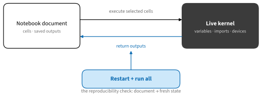
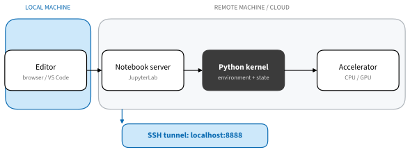

# Interactive Development with JupyterLab and VS Code
:label:`sec_interactive_development`

A notebook is both a document and an interface to a live Python process. The
document stores cells and selected outputs. The kernel stores imports,
variables, random-number state, open files, compiled programs, and accelerator
allocations. Confusing these two kinds of state is the source of many notebook
failures.


:label:`fig_tools_kernel_state`

If cell 12 works only because cell 19 ran earlier, the displayed order does not
describe the computation. **Restart kernel and run all** is therefore the most
important notebook reproducibility check. It catches hidden state, missing
setup, and order dependencies before another reader does.

## Reproducible Notebook State

### Start in the Book Environment

Download the notebook archive described in :ref:`chap_installation`, or clone
the current sources from [GitHub](https://github.com/smolix/d2l-neu). The
archive includes CPU and GPU `uv` environment files. From the extracted
directory, create the environment once and launch JupyterLab through it:

```bash
uv sync --locked
uv run jupyter lab
```

Use the GPU lock on a compatible NVIDIA system when the examples require it.
The environment selected by the notebook kernel must be the same environment
in which the packages were installed. A Jupyter server can see many kernels;
its own Python process does not determine which one executes a notebook.

Before changing code, record a compact identity check:

```{.python .input #interactive-development-identity}
import os
import platform
import sys

{
    "python": sys.executable,
    "version": platform.python_version(),
    "working_directory": os.getcwd(),
}
```

This catches two common mistakes: selecting the wrong environment and opening
the notebook from a directory where relative data paths no longer resolve.

## Local Editors

### Work Effectively in JupyterLab

[JupyterLab](https://jupyterlab.readthedocs.io/) combines a file browser,
notebook editor, terminals, text editor, debugger support, and running-kernel
view. The essentials are stable even as the interface evolves:

* Use the file browser to open an `.ipynb`; use a terminal for `uv`, Git, and
  inspecting files.
* Select the intended kernel by environment name, then verify `sys.executable`.
* Run a cell with `Shift+Enter`; use **Run All Above** only when the dependency
  order is already clear.
* Interrupt a long computation before restarting. Restart releases Python
  state and normally releases accelerator allocations owned by that process.
* Use **Restart Kernel and Run All Cells** before saving a result for others.
* Inspect the **Running** panel and stop kernels you no longer use. Closing a
  browser tab does not necessarily stop its kernel.

Cell execution counters are historical clues, not a dependency graph. A lower
cell can have an earlier counter after out-of-order execution. Prefer small
cells with explicit inputs and outputs, keep function definitions separate
from experiments, and avoid silently mutating global objects across many
cells.

The following example demonstrates hidden state. It succeeds only after the
first cell has run:

```{.python .input #interactive-development-hidden-state-a}
import numpy as np
rng = np.random.default_rng(7)
samples = rng.normal(size=5)
```

```{.python .input #interactive-development-hidden-state-b}
float(samples.mean())
```

That dependency is reasonable because the document orders the cells. A cell
that depends on an assignment below it is not. For important computations,
move reusable logic into functions and pass data explicitly.

### Debugging and Timing

Use a notebook debugger when supported by the selected kernel, or place a
small failing call in a module and use the Python debugger in a terminal. A
traceback should retain the original exception; broad `try/except` blocks that
print “failed” discard the location and type needed for diagnosis.

IPython already provides timing tools:

```{.python .input #interactive-development-timing}
values = np.arange(100_000, dtype=np.float64)
%timeit values @ values
```

Accelerator operations are often asynchronous. A host timer may measure only
dispatch unless the framework synchronizes. Use the framework's benchmarking
utilities or an explicit synchronization, warm up compilation and kernels, and
state the shapes, precision, device, and software version.

### Work in VS Code

[Visual Studio Code's Jupyter support](https://code.visualstudio.com/docs/datascience/jupyter-notebooks)
edits and runs `.ipynb` files, selects kernels, inspects variables, debugs
cells, and compares notebook changes. Open the extracted repository as a
folder, choose the interpreter created by `uv`, and then select that interpreter
as the notebook kernel.

VS Code also works well when a notebook calls ordinary Python modules:
the same editor navigates definitions, runs tests, formats code, and reviews
Git diffs. Keep source code that deserves tests in `.py` files and use the
notebook for the explanatory path and experiment record.

The D2L Tools extension in this repository understands the book's authoring
workflow. It can open generated framework views, navigate between generated
notebooks and authoritative Markdown, capture reviewed outputs, run content
checks, and preview slides. Generated `.ipynb` and `.qmd` files remain build
artifacts; edit the source `.md` notebook and regenerate them.

## Remote Compute

An editor, notebook server, kernel, and accelerator may run in different
places.


:label:`fig_tools_remote_layers`

For JupyterLab, bind the remote server to loopback and forward it over SSH:

```bash
# Remote machine
uv run jupyter lab --no-browser --ip 127.0.0.1 --port 8888
```

```bash
# Local machine
ssh -N -L 8888:127.0.0.1:8888 myserver
```

Open the tokenized local URL. Do not bind an unauthenticated Jupyter server to
all network interfaces. The SSH connection provides encryption and access
control; Jupyter's token remains a useful second boundary.

VS Code Remote SSH instead installs a small VS Code server remotely. The UI
runs locally, while extensions, terminals, file access, and kernels associated
with the remote window run on the server. Confirm the status bar says **SSH**
before selecting the remote Python environment; a local kernel cannot use the
remote GPU.

Remote files may be valuable even when compute is disposable. Commit code and
copy checkpoints or results to durable storage before terminating a cloud
machine.

### Notebook Hygiene

Before sharing or committing a notebook:

1. Restart the kernel and run all cells in order.
1. Check that setup does not rely on personal paths, unrecorded downloads, or
   environment variables.
1. Remove secrets and outputs containing private data.
1. Keep outputs that teach or verify something; remove noisy progress logs and
   transient widget state.
1. Confirm random behavior is controlled where the lesson requires a stable
   result, while avoiding claims of universal determinism.
1. Save the environment, data/model revisions, and hardware facts needed to
   interpret measurements.

For this book, edit Markdown sources and let the build create `.ipynb`. This
keeps reviewable prose and multi-framework code in one authoritative file.

## Summary

* The document and live kernel hold different state.
* Restart and run all is the basic test that execution order is reproducible.
* Launch JupyterLab or select a VS Code kernel from the book's `uv` environment.
* JupyterLab integrates notebooks, terminals, kernels, and debugging; VS Code
  integrates notebooks with modules, tests, diffs, and remote development.
* Use SSH tunneling or Remote SSH instead of exposing a notebook server.
* Edit the book's source Markdown, not generated notebook or Quarto files.

## Exercises

1. Create an intentional out-of-order dependency, detect it with restart and
   run all, and refactor it into explicit cell order.
1. Compare `sys.executable` in a terminal, JupyterLab kernel, and VS Code
   kernel. Explain any difference.
1. Connect to a remote CPU machine through an SSH tunnel and identify where the
   editor, server, kernel, and file system run.
