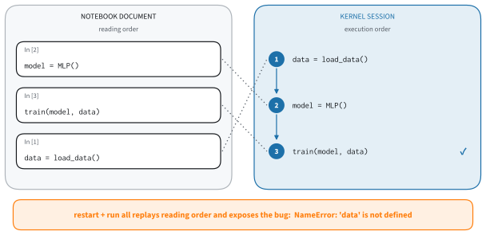
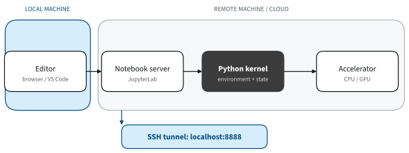

# Notebooks
:label:`sec_interactive_development`

Every section of this book is an executable notebook in which prose,
mathematics, code, and output share one document. This format supports the
empirical study of deep learning: readers can train a model, vary the learning
rate, layer width, or amount of data, and inspect the result beside the
explanation. Notebooks are also widely used for data inspection and research
prototypes.

The notebooks are designed to be edited and rerun, including with variants
mentioned only in the text. This section explains local execution and
effective notebook use, especially *restart and run all*, which detects hidden
state and order-dependent results. If you
would rather not install anything, :numref:`sec_hosted_notebooks` shows how
to run the same notebooks free of charge on Colab or Kaggle; if you need more
hardware than your laptop offers, see :numref:`sec_cloud_instances`.

## Why Notebooks?

A plain Python script re-runs from the top every time, so a slow step — say,
loading and preprocessing a dataset — repeats on every experiment. A notebook
keeps a live Python process (the *kernel*) between executions: load the data
once, then iterate on the model as often as you like while the data stays in
memory. Inline plots and interleaved explanations make this execution model useful
for both teaching and research.

This convenience introduces persistent *state*, whose location and lifetime
must be understood.

### The Document and the Kernel

A notebook is really two things. The *document* stores cells and saved
outputs — it is what you read, share, and commit. The *kernel* holds the live
state: imported modules, variables, random-number generators, open files,
compiled programs, and accelerator memory. The document orders cells top to
bottom; the kernel only knows the order in which you *executed* them.
Confusing these two orders causes many notebook bugs.


:label:`fig_tools_kernel_state`

:numref:`fig_tools_kernel_state` shows the classic failure. During an
editing session you executed a data-loading cell first, then wrote a
model-definition cell *above* it, and everything worked because the kernel
already held `data`. The document now tells a story that never happened. A
reader who runs the cells in the order shown — or you, tomorrow, after a
restart — hits a `NameError`.

The execution counters (`In [3]`, `In [1]`, …) are historical clues, not a
dependency graph. The following pair of cells demonstrates benign,
document-ordered state: the second cell works only because the first ran.

```{.python .input #interactive-development-hidden-state-a}
import numpy as np

rng = np.random.default_rng(7)
samples = rng.normal(size=5)
```

```{.python .input #interactive-development-hidden-state-b}
float(samples.mean())
```

That dependency is fine, because it follows the reading order. A cell that
depends on an assignment *below* it, or on a cell you have since deleted, is
not. Keep cells small, keep function definitions separate from experiments,
and pass data explicitly rather than mutating globals across many cells.

### Restart and Run All

**Restart kernel and run all cells** discards the kernel's accumulated state
and replays the document from a blank slate, in reading order. It catches
hidden state, missing setup, and order dependencies before a notebook is
shared. Run it before saving, sharing, or committing a notebook.
Every notebook in this book is built and tested with this procedure — the
outputs you see on the website are produced by a clean top-to-bottom run.

## Running the Book Locally

### Setting Up

Download the notebook archive described in :ref:`chap_installation`, or
clone the current sources from [GitHub](https://github.com/smolix/d2l-neu).
The archive includes CPU and GPU `uv` environment files. From the extracted
directory, create the environment once and launch JupyterLab through it:

```bash
uv sync --locked
uv run jupyter lab
```

Use the GPU lock file on a compatible NVIDIA system when the examples require
it. The *kernel* selected inside a
notebook must belong to the environment where the packages were installed. A
Jupyter server can see many kernels; its own Python process does not
determine which one executes your notebook.

### A Quick Sanity Check

Before changing code, record a compact identity check:

```{.python .input #interactive-development-identity}
import os
import platform
import sys

{
    "python": sys.executable.replace(os.path.expanduser("~"), "~"),
    "version": platform.python_version(),
    "working_directory": os.path.basename(os.getcwd()),
}
```

This catches the two most common setup mistakes in one cell: a kernel from
the wrong environment (`sys.executable` points somewhere unexpected) and a
notebook opened from a directory where relative data paths no longer resolve.

## Working in an Editor

### JupyterLab

[JupyterLab](https://jupyterlab.readthedocs.io/) combines a file browser,
notebook editor, terminals, a text editor, debugger support, and a view of
running kernels. The essentials are stable even as the interface evolves:

* Run a cell with `Shift+Enter`; use a terminal tab for `uv`, Git, and
  inspecting files.
* Select the kernel by environment name, then verify `sys.executable`.
* Interrupt a long computation before restarting. Restarting releases Python
  state and, normally, the accelerator memory owned by that process.
* Use **Restart Kernel and Run All Cells** before saving a result for others.
* Inspect the **Running** panel and stop kernels you no longer use — closing
  a browser tab does not necessarily stop its kernel, and an orphaned kernel
  can hold gigabytes of GPU memory.

### VS Code

[Visual Studio Code](https://code.visualstudio.com/docs/datascience/jupyter-notebooks)
edits and runs `.ipynb` files with kernel selection, a variable inspector,
cell-level debugging, and notebook-aware diffs. Open the repository as a
folder, choose the interpreter created by `uv`, and select that interpreter
as the notebook kernel.

When a notebook grows into a project, VS Code can navigate definitions, run
tests, format code, and review Git diffs. Keep testable logic in `.py` modules
and use the notebook for explanation and experiment records. This
repository also includes a VS Code extension for the book's
authoring workflow — switching framework views, previewing slides, syncing
edits back to the source — described in :numref:`sec_developers_guide`.

### Debugging and Timing

Use the notebook debugger when the kernel supports it, or move a small
failing call into a module and debug it in a terminal. Resist broad
`try/except` blocks that print "failed": they discard the exception type and
location that diagnosis needs. For quick measurements, IPython's magics are
built in:

```{.python .input #interactive-development-timing}
values = np.arange(100_000, dtype=np.float64)
%timeit values @ values
```

One caveat when timing accelerators: GPU operations are asynchronous, so a
host-side timer may measure only the dispatch of work, not its completion.
Synchronize explicitly (or use the framework's benchmarking utilities), warm
up compiled kernels first, and record the shapes, precision, device, and
library versions alongside the number.

## Remote Machines

Your editor, the notebook server, the kernel, and the accelerator need not
be on the same machine. A common setup runs JupyterLab next to the GPU while
you edit from a laptop.


:label:`fig_tools_remote_layers`

Bind the remote server to loopback and forward it over SSH:

```bash
# Remote machine
uv run jupyter lab --no-browser --ip 127.0.0.1 --port 8888
```

```bash
# Local machine
ssh -N -L 8888:127.0.0.1:8888 myserver
```

Then open the tokenized `http://127.0.0.1:8888/...` URL locally. Never bind
an unauthenticated Jupyter server to all network interfaces: anyone who can
reach the port can execute code as you. The SSH tunnel provides encryption
and access control; Jupyter's token remains a useful second boundary.

VS Code's Remote SSH installs a small server-side
component so the editor UI runs locally while terminals, extensions, files,
and kernels all live on the remote machine. Confirm the status bar shows
**SSH** before selecting the Python environment — a local kernel cannot use
the remote GPU. In either setup, treat remote compute as disposable: commit code and copy
checkpoints to durable storage before
it is rebooted, preempted, or deleted (:numref:`sec_cloud_instances`).

Before sharing or committing a notebook, perform a final reproducibility and
privacy check:
restart and run all; check that setup does not rely on personal paths or
unrecorded downloads; remove secrets and private data from outputs; keep the
outputs that teach or verify something and delete noisy progress logs; and
note the environment and hardware needed to interpret any measurement.

## Summary

* Notebooks interleave prose, code, and results, and retain expensive state
  between experiments. Run and edit them rather than treating them as static
  documents.
* The document and the kernel hold different state in different orders;
  restart and run all is the test that they agree.
* Launch JupyterLab from the book's `uv` environment, and verify the kernel
  with `sys.executable` before trusting any result.
* JupyterLab integrates notebooks, terminals, and kernels; VS Code adds
  modules, tests, diffs, and first-class remote development.
* Use SSH tunneling or VS Code Remote SSH instead of exposing a notebook
  server to the network.

## Exercises

1. Create an intentional out-of-order dependency like the one in
   :numref:`fig_tools_kernel_state`, confirm that it works interactively,
   and then detect it with restart and run all.
1. Compare `sys.executable` in a terminal, a JupyterLab kernel, and a VS
   Code kernel on your machine. Explain any difference.
1. Time a matrix product with `%timeit` on CPU and, if available, on a GPU
   with and without synchronization. Explain the discrepancy.
1. Connect to a remote machine through an SSH tunnel and identify where the
   editor, server, kernel, and file system each run.
