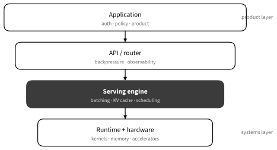

# Model Serving
:label:`sec_model_serving`

Model serving turns a trained artifact into a reliable computation used by
other programs. The right solution depends on whether the workload is an
offline batch, one person's local assistant, a single application API, or a
multi-user service with latency and availability objectives.

## Choose the Serving Boundary

### Separate the Layers


:label:`fig_tools_serving_stack`

An application owns authentication, product policy, and user-visible behavior.
An API or router manages admission, cancellation, rate limits, and traffic. The
serving engine schedules model work and KV-cache memory. A runtime supplies
kernels and hardware execution. Products from different vendors may span
several layers; naming the layers prevents us from comparing an application
with a kernel library.

### Workload Classes

:Serving workload choices
:label:`tab_serving_workloads`

| Workload | Main objective | Sensible starting point |
|---|---|---|
| Offline batch | throughput and completion cost | framework batch job or serving engine |
| Local interactive | privacy, simplicity, latency | Ollama, llama.cpp, or MLX runtime |
| One application API | correctness and operations | one engine behind a small authenticated API |
| Multi-user service | goodput under an SLO | vLLM or SGLang with routing and observability |
| NVIDIA-optimized production | tuned latency/throughput | TensorRT-LLM engine, often with Triton/NIM/Dynamo layers |

Start with the smallest system that measures the real workload. A desktop
assistant does not need a distributed control plane. A public multi-tenant API
needs more than a command that happens to open a port.

## Scheduling and Capacity

### Latency and Throughput

For autoregressive models, separate **time to first token** (TTFT) from **time
per output token** (TPOT) and end-to-end latency. Throughput counts completed
requests or tokens per second. **Goodput** counts only work that satisfies the
latency objective; overload can raise raw throughput while destroying goodput.


:label:`fig_tools_prefill_decode`

Prompt length, output length, batch concurrency, quantization, and prefix reuse
all change performance. Report distributions such as median and p95 instead of only
an average. Measure with realistic arrival patterns; a closed-loop benchmark
that sends the next request only after the previous response hides queueing.

### Capacity: Weights and KV Cache

The model weights are only the baseline. Each active sequence consumes KV-cache
memory that grows with context length and model geometry. Runtime workspaces,
CUDA graphs, adapters, and fragmentation consume more. Estimate capacity, then
load-test until admission control rejects safely rather than causing an
out-of-memory failure.

Quantization can reduce weight or KV memory and improve bandwidth-limited
decode. Accuracy, supported kernels, calibration, and conversion quality
matter. A smaller file does not guarantee a faster runtime if the target engine
must dequantize through an inefficient path.

### Continuous Batching and Paged KV

Static batches wait for every sequence to finish. Continuous batching inserts
new requests and removes completed ones between decode steps.


:label:`fig_tools_continuous_batching`

Paged KV-cache management allocates non-contiguous blocks as sequences grow,
reducing large contiguous reservations and fragmentation. Scheduling still
balances TTFT, decode latency, throughput, and fairness. A very large batch can
maximize tokens per second while making one interactive user wait too long.

The following event model illustrates why admission must respect capacity. It
is deliberately small enough to inspect.

```{.python .input #model-serving-scheduler}
from collections import deque

requests = deque([5, 2, 7, 3])  # output tokens requested
capacity = 2
active = []
timeline = []
while requests or active:
    while requests and len(active) < capacity:
        active.append(requests.popleft())
    timeline.append(tuple(active))
    active = [remaining - 1 for remaining in active if remaining > 1]

timeline
```

Extend this toy with arrival times and a maximum KV budget to see how a policy
affects queueing and utilization.

### Prefix Caching and Speculation


:label:`fig_tools_prefix_cache`

Prefix caching helps repeated system prompts, shared documents, and tree-like
workloads. Cache keys must include every input that changes the computed KV
state: model and adapter revision, tokenizer behavior, tokens, and relevant
runtime options. Caching sensitive prompts also creates a retention and
isolation responsibility.

Speculative decoding uses a draft mechanism to propose tokens and the target
model to verify them. It helps when accepted proposals cost less than target
decode, but draft overhead and low acceptance can erase the gain. Measure on
the actual prompt and sampling distribution.

## Operating a Service

### Engines and Product Boundaries

* **llama.cpp** and Apple **MLX** runtimes emphasize efficient local inference
  with quantized artifacts and consumer hardware.
* **Ollama** packages local model management and a convenient service UX around
  local engines.
* **vLLM** provides high-throughput serving with continuous batching, paged KV
  management, distributed execution, and an OpenAI-compatible API.
* **SGLang** combines a serving runtime with structured generation and a
  programming model for compound LLM workloads.
* **TensorRT-LLM** builds NVIDIA-optimized LLM engines. **Triton Inference
  Server** serves model backends; **NIM** packages supported models and APIs;
  **NVIDIA Dynamo** addresses distributed inference orchestration. They are
  related pieces, not synonyms.

Capabilities and supported models change rapidly. Consult the current official
documentation and pin the engine and model revision used in a benchmark.

### One Client Contract

Many engines expose an OpenAI-compatible HTTP API. This is useful for swapping
servers, but “compatible” does not imply identical tokenization, sampling,
structured output, error codes, streaming, or usage accounting.

```text
from openai import OpenAI

client = OpenAI(base_url="http://127.0.0.1:8000/v1", api_key="local")
response = client.chat.completions.create(
    model="pinned-model-name",
    messages=[{"role": "user", "content": "Explain KV caching briefly."}],
    temperature=0,
)
print(response.choices[0].message.content)
```

Keep conformance tests for streaming termination, cancellation, structured
output, tool calls, token counts, and error behavior before changing engines.

### Production Operations

Do not expose a raw engine port to the internet. Put authentication, TLS,
request-size limits, rate limits, and timeouts at a controlled boundary. Define
health separately from readiness: a process can be alive while weights are
still loading or every accelerator is unhealthy.

Admission control should reject or queue before memory is exhausted. Propagate
client cancellation so abandoned generations stop consuming compute. Bound
queues; infinite queues convert overload into unbounded latency and memory.

Observe request rate, queue time, TTFT, TPOT, end-to-end latency, input/output
tokens, cache hit rate, batch size, KV occupancy, accelerator utilization,
errors, cancellations, and rejected work. Avoid logging raw prompts by default;
they may contain personal or proprietary data.

Pin model, tokenizer, adapter, quantization, engine, and container revisions.
Roll out gradually and keep a fast rollback. Validate task quality and safety as
well as system metrics: a faster server that changes answers is a different
system.

## Summary

* Choose a serving stack from the workload and operational boundary.
* Measure TTFT, TPOT, tail latency, throughput, and goodput separately.
* Capacity includes KV cache and runtime memory in addition to weights.
* Continuous batching, paged KV, prefix reuse, and speculation trade latency,
  memory, and throughput in different ways.
* A compatible API still needs conformance tests.
* Production serving requires admission, cancellation, observability, privacy,
  revision pinning, and rollback.

## Exercises

1. Add arrival times, a KV budget, and rejection to the scheduler simulation.
   Compare first-come and shortest-remaining-work policies.
1. Design a benchmark matrix that varies prompt length, output length, and
   concurrency while reporting TTFT and TPOT percentiles.
1. Specify a cache key and privacy policy for a service that reuses a long
   system prompt across users.
