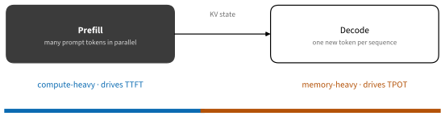
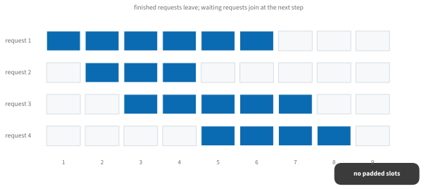
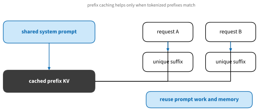

# Model Serving
:label:`sec_model_serving`

Training produces weights; serving turns them into something other people
(or programs) can call. The engineering here is different in kind from
training: latency distributions instead of loss curves, memory that scales
with *users* instead of parameters, and a software landscape that
consolidated, in the span of two years, around a handful of engines you
should simply know by name. This section maps the landscape practically —
what to run on a laptop, what to run behind an API, and the small set of
ideas (KV-cache management, continuous batching, prefix reuse,
quantization) that explain why those engines are fast.

## Know Your Workload

Two numbers govern interactive serving of autoregressive models: **time to
first token** (TTFT), dominated by *prefill* — processing the prompt, a
parallel, compute-bound pass — and **time per output token** (TPOT),
dominated by *decode* — one token at a time, bandwidth-bound, as
:numref:`sec_hardware_buyers` quantified. Throughput (tokens per second
across all users) trades against both.


:label:`fig_tools_prefill_decode`

Which numbers matter depends on the workload, and the workload picks the
tool:

:Serving workloads and sensible starting points (mid-2026)
:label:`tab_serving_workloads`

| Workload | Optimize for | Start with |
|---|---|---|
| Personal assistant on your machine | simplicity, privacy | Ollama / LM Studio (llama.cpp), MLX on Macs |
| Offline batch scoring | throughput per dollar | vLLM offline mode |
| One application's API | operability | vLLM behind a small authenticated proxy |
| Multi-user / agentic service | goodput under an SLO | vLLM or SGLang, then NVIDIA Dynamo at scale |
| Max throughput on fixed NVIDIA fleet | compiled kernels | TensorRT-LLM |

"Goodput" — completed requests that also met their latency target — is the
production metric; overload can raise raw throughput while goodput
collapses.

## Serving on Your Own Machine

The local stack standardized around **llama.cpp** and its **GGUF** file
format, which now accounts for the majority of quantized models published
on Hugging Face — community quantizers upload GGUF conversions within
hours of any release. You rarely invoke llama.cpp directly:

* **Ollama** wraps it (plus an Apple-MLX backend) in a one-command
  experience — `ollama run qwen3:8b` downloads, caches, and serves a model
  with an OpenAI-compatible local API. The default for "I just want a
  model on my machine."
* **LM Studio** offers the same engines behind a GUI, with per-layer GPU
  offload control — the friendliest on-ramp for non-terminal users.
* **MLX** is Apple's array framework; on M-series Macs `mlx-lm` is
  typically the fastest option for models under ~14B, with thousands of
  pre-converted models on the Hub.

GGUF's quantization ladder is a vocabulary worth learning: `Q4_K_M`
(~4.5 bits/weight) is the community default — roughly a quarter of the
FP16 footprint at a few percent quality cost; `Q5_K_M` buys measurable
stability for reasoning tasks; `Q8_0` is near-lossless at half of FP16.
The rule of thumb follows the decode bound of
:numref:`sec_hardware_buyers`: pick the largest model whose chosen quant
fits your memory with room for the KV cache, then take the highest quant
that still fits.

## Serving as a Service

### vLLM and SGLang

For a GPU server exposed to real traffic, the open-source default is
**vLLM**: continuous batching, paged KV-cache management, prefix caching,
tensor parallelism, quantized-model support, and an OpenAI-compatible
server in one command:

```bash
vllm serve Qwen/Qwen3-8B --max-model-len 32768
```

**SGLang** is its closest peer, distinguished by *RadixAttention* — a
radix-tree KV cache shared across requests, which shines when many
requests share long prefixes (chat with a system prompt, RAG over the
same documents, agent trees). High-volume shops, notably the DeepSeek
ecosystem, favor it for exactly those workloads. Both projects are now
community-governed, move monthly, and support NVIDIA plus (increasingly)
AMD hardware; benchmarking *your* prompt mix on both is a one-afternoon
exercise and the only comparison that matters.

The NVIDIA-proprietary tier trades flexibility for peak numbers:
**TensorRT-LLM** compiles a model into optimized engines (fastest steady-
state serving of a fixed model, at real setup cost), while **Dynamo**
orchestrates disaggregated prefill/decode and KV-aware routing across a
fleet, wrapping vLLM, SGLang, or TensorRT-LLM as backends. These matter
at datacenter scale; below it, they are complexity you do not need.

### One Client Contract

Nearly everything above speaks the OpenAI chat-completions API, which has
become the de-facto client contract — the same application code targets a
local Ollama, your vLLM server, or a commercial provider by changing one
URL:

```text
from openai import OpenAI

client = OpenAI(base_url="http://127.0.0.1:8000/v1", api_key="local")
response = client.chat.completions.create(
    model="Qwen/Qwen3-8B",
    messages=[{"role": "user", "content": "Explain KV caching briefly."}],
    temperature=0,
)
print(response.choices[0].message.content)
```

"Compatible" is not "identical": tokenization, sampling defaults,
structured-output support, streaming behavior, and token accounting all
vary. Keep a small conformance test and rerun it before swapping engines.

## Why These Engines Are Fast

Four ideas, composable and worth knowing even if you never implement
them:

**Continuous batching.** A static batch waits for its slowest member.
Continuous batching admits new requests and retires finished ones between
decode steps, keeping the GPU full:


:label:`fig_tools_continuous_batching`

The toy scheduler below captures the idea in ten lines; extend it with
arrival times and a memory budget and you have reinvented the core of a
serving engine:

```{.python .input #model-serving-scheduler}
from collections import deque

requests = deque([5, 2, 7, 3])  # output tokens requested
capacity = 2
active, timeline = [], []
while requests or active:
    while requests and len(active) < capacity:
        active.append(requests.popleft())
    timeline.append(tuple(active))
    active = [remaining - 1 for remaining in active if remaining > 1]

timeline
```

**Paged KV cache.** Each active sequence's key–value cache grows with its
length; vLLM's PagedAttention allocates it in fixed-size blocks, like
virtual memory, eliminating the fragmentation that once capped batch
sizes. Capacity planning follows: GPU memory must hold weights *plus* KV
for every concurrent sequence — the reason a 7B model on a 24 GB card can
still refuse the fifty-first user.

**Prefix caching.** When two requests share a tokenized prefix (the same
system prompt, the same document), its KV state can be computed once and
reused:


:label:`fig_tools_prefix_cache`

This is also why commercial APIs price "cached input tokens" at ~10% of
regular ones — structure your prompts (shared prefix first, variable
suffix last) and the discount is automatic.

**Speculative decoding and quantization.** A small draft model proposes
several tokens; the target model verifies them in one parallel pass —
2–3× decode speedups when acceptance is high, with provably unchanged
output distribution. Quantization attacks the decode bound directly:
fewer bytes per weight, more tokens per second. On datacenter GPUs the
current ladder is FP8 (native since Hopper) and NVFP4 (Blackwell), with
AWQ the workhorse for 4-bit weights in vLLM/SGLang deployments; GGUF
quants play the same role locally.

## Operating Notes

A model behind a port is not yet a service. The short version of the
production checklist: put authentication, TLS, and rate limits at a proxy
in front of the engine (never expose the raw port); make admission
control reject or queue *before* memory exhausts rather than OOM after;
propagate client cancellations so abandoned generations stop burning
compute; measure TTFT, TPOT, and end-to-end latency as p50/p95
distributions under realistic arrival patterns, not averages under a
closed loop; avoid logging raw prompts by default; and pin model,
tokenizer, quantization, and engine versions together — a faster server
that answers differently is a different system, so gate rollouts on task
quality as well as latency.

## Summary

* Separate prefill (compute-bound, sets TTFT) from decode
  (bandwidth-bound, sets TPOT), and pick tools by workload: Ollama/LM
  Studio/MLX locally, vLLM or SGLang for services, TensorRT-LLM and
  Dynamo at NVIDIA-fleet scale.
* GGUF and its quant ladder rule local serving; AWQ/FP8/NVFP4 rule
  servers; in both cases quantization converts bytes saved into tokens
  per second.
* Continuous batching, paged KV, prefix caching, and speculative decoding
  are the four ideas behind every fast engine — and prefix structure is
  something *you* control from the prompt side.
* The OpenAI-compatible API is the portable client contract; verify
  compatibility with your own conformance tests.
* Capacity is weights plus per-user KV; production means admission
  control, cancellation, percentile latencies, and pinned revisions.

## Exercises

1. Extend the toy scheduler with Poisson arrivals, a KV-memory budget,
   and rejection. Compare first-come-first-served against
   shortest-remaining-work on p95 TTFT.
1. Serve the same 8B model through Ollama (Q4_K_M) and vLLM (AWQ) on
   whatever hardware you have, and measure TTFT and TPOT at concurrency
   1, 4, and 16. Which engine wins where, and why?
1. Estimate KV-cache bytes per token for a model whose config you know
   (layers × 2 × kv-heads × head-dim × bytes), then compute how many
   8K-context users fit beside the weights on a 24 GB card.
1. Design the cache-key policy for a service that reuses a long system
   prompt across users. What must be in the key, and what is the privacy
   obligation of caching at all?
