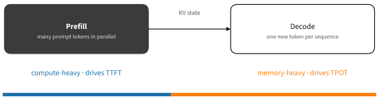
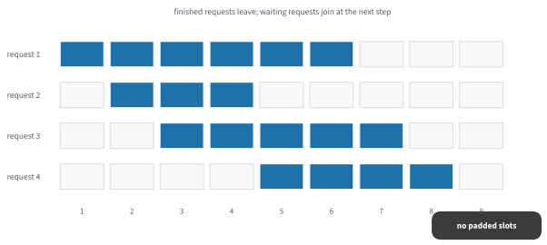
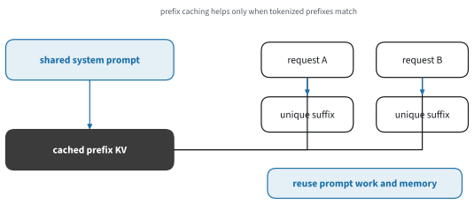

# Model Serving
:label:`sec_model_serving`

Training produces model parameters; serving exposes model inference to
people or programs. Serving emphasizes latency distributions, concurrent
request state, capacity planning, and operational controls. This section
compares representative local and server engines as of mid-2026 and explains
four recurring techniques: KV-cache management, continuous batching, prefix
reuse, and quantization.

## Know Your Workload

Two numbers govern interactive serving of autoregressive models: **time to
first token** (TTFT), dominated by *prefill* — processing the prompt, a
parallel, compute-bound pass — and **time per output token** (TPOT),
dominated by *decode* — one token at a time, bandwidth-bound, as
:numref:`sec_hardware_buyers` quantified. Throughput (tokens per second
across all users) trades against both.


:label:`fig_tools_prefill_decode`

Which numbers matter depends on the workload, and the workload picks the
tool:

:Serving workloads and example starting points (mid-2026)
:label:`tab_serving_workloads`

| Workload | Optimize for | Start with |
|---|---|---|
| Personal assistant on your machine | simplicity, privacy | Ollama / LM Studio (llama.cpp), MLX on Macs |
| Offline batch scoring | throughput per dollar | vLLM offline mode |
| One application's API | operability | vLLM behind a small authenticated proxy |
| Multi-user / agentic service | goodput under an SLO | vLLM or SGLang, then NVIDIA Dynamo at scale |
| Max throughput on fixed NVIDIA fleet | compiled kernels | TensorRT-LLM |

"Goodput" — completed requests that also met their latency target — is the
production metric; overload can raise raw throughput while goodput
collapses.

## Serving on Your Own Machine

Many local inference tools use **llama.cpp** and its **GGUF** file format.
Community repositories commonly publish GGUF conversions of open-weight
models. Users often access llama.cpp through a wrapper:

* **Ollama** wraps it (plus an Apple-MLX backend) in a one-command
  experience — `ollama run qwen3:8b` downloads, caches, and serves a model
  with an OpenAI-compatible local API. It provides a low-configuration
  starting point for local use.
* **LM Studio** offers the same engines behind a GUI, with per-layer GPU
  offload control — a graphical interface for users who prefer not to work in a terminal.
* **MLX** is Apple's array framework; on M-series Macs, `mlx-lm` is
  optimized for Apple silicon and has many pre-converted models on the Hub.
  Performance depends on the model and conversion.

Common GGUF quantizations include `Q4_K_M` (~4.5 bits/weight),
`Q5_K_M`, and `Q8_0`. Higher-bit formats require more memory and usually
retain model quality better, but the effect is model- and task-dependent and
should be measured on the target workload.
The rule of thumb follows the decode bound of
:numref:`sec_hardware_buyers`: pick the largest model whose chosen quant
fits your memory with room for the KV cache, then take the highest quant
that still fits.

## Serving as a Service

### vLLM and SGLang

For an open-source GPU server, **vLLM** provides continuous batching, paged
KV-cache management, prefix caching,
tensor parallelism, quantized-model support, and an OpenAI-compatible
server in one command:

```bash
vllm serve Qwen/Qwen3-8B --max-model-len 32768
```

**SGLang** is its closest peer, distinguished by *RadixAttention* — a
radix-tree KV cache shared across requests, which can improve reuse when many
requests share long prefixes (chat with a system prompt, RAG over the
same documents, agent trees). The DeepSeek ecosystem has used it for such
workloads. Both projects evolve
quickly and support multiple accelerator backends. Benchmark both with the
target prompt-length and concurrency distributions before selecting one.

NVIDIA-specific tools trade portability for compiled optimizations.
**TensorRT-LLM** compiles a model into optimized engines, which can improve
steady-state serving at the cost of additional setup, while **Dynamo**
orchestrates disaggregated prefill/decode and KV-aware routing across a
fleet, wrapping vLLM, SGLang, or TensorRT-LLM as backends. These matter
at datacenter scale; below it, they are complexity you do not need.

### One Client Contract

Many of these tools implement the OpenAI chat-completions API, which serves
as a common client contract — the same application code targets a
local Ollama, your vLLM server, or a commercial provider by changing one
URL:

```text
from openai import OpenAI

client = OpenAI(base_url="http://127.0.0.1:8000/v1", api_key="local")
response = client.chat.completions.create(
    model="Qwen/Qwen3-8B",
    messages=[{"role": "user", "content": "Explain KV caching briefly."}],
    temperature=0,
)
print(response.choices[0].message.content)
```

"Compatible" is not "identical": tokenization, sampling defaults,
structured-output support, streaming behavior, and token accounting all
vary. Keep a small conformance test and rerun it before swapping engines.

## Why These Engines Are Fast

Four composable techniques explain much of serving-engine performance:

**Continuous batching.** A static batch waits for its slowest member.
Continuous batching admits new requests and retires finished ones between
decode steps, keeping the GPU full:


:label:`fig_tools_continuous_batching`

The toy scheduler below captures the idea in ten lines. The exercises extend
it with arrival times and a memory budget:

```{.python .input #model-serving-scheduler}
from collections import deque

requests = deque([5, 2, 7, 3])  # output tokens requested
capacity = 2
active, timeline = [], []
while requests or active:
    while requests and len(active) < capacity:
        active.append(requests.popleft())
    timeline.append(tuple(active))
    active = [remaining - 1 for remaining in active if remaining > 1]

timeline
```

**Paged KV cache.** Each active sequence's key–value cache grows with its
length; vLLM's PagedAttention allocates it in fixed-size blocks, like
virtual memory, eliminating the fragmentation that once capped batch
sizes. Capacity planning follows: GPU memory must hold weights *plus* KV
for every concurrent sequence. A model that fits for one request may therefore
exceed memory under high concurrency.

**Prefix caching.** When two requests share a tokenized prefix (the same
system prompt, the same document), its KV state can be computed once and
reused:


:label:`fig_tools_prefix_cache`

Some commercial APIs charge less for cached input tokens. Place shared,
stable content before variable suffixes when the provider's documented cache
semantics support prefix reuse; prices and eligibility vary by provider.

**Speculative decoding and quantization.** A small draft model proposes
several tokens; the target model verifies them in one parallel pass —
potential decode speedups when acceptance is high, while preserving the
target distribution under the algorithm's sampling assumptions.
Quantization reduces the bytes transferred during decode:
fewer bytes per weight, more tokens per second. On recent datacenter GPUs,
supported formats include FP8 on Hopper and NVFP4 on Blackwell, while vLLM
and SGLang support AWQ for 4-bit weights; GGUF
quants play the same role locally.

## Operating Notes

A model behind a port is not yet a service. The short version of the
production checklist: put authentication, TLS, and rate limits at a proxy
in front of the engine (never expose the raw port); make admission
control reject or queue *before* memory exhausts rather than OOM after;
propagate client cancellations so abandoned generations stop burning
compute; measure TTFT, TPOT, and end-to-end latency as p50/p95
distributions under realistic arrival patterns, not averages under a
closed loop; avoid logging raw prompts by default; and pin model,
tokenizer, quantization, and engine versions together — a faster server
that answers differently is a different system, so gate rollouts on task
quality as well as latency.

## Summary

* Separate prefill (compute-bound, sets TTFT) from decode
  (bandwidth-bound, sets TPOT), and pick tools by workload: Ollama/LM
  Studio/MLX locally, vLLM or SGLang for services, TensorRT-LLM and
  Dynamo at NVIDIA-fleet scale.
* GGUF quantizations are common in local serving, while server engines support
  formats such as AWQ, FP8, and NVFP4; in both cases quantization converts bytes saved into tokens
  per second.
* Continuous batching, paged KV, prefix caching, and speculative decoding
  are four recurring serving optimizations — and prefix structure is
  something *you* control from the prompt side.
* The OpenAI-compatible API is the portable client contract; verify
  compatibility with your own conformance tests.
* Capacity is weights plus per-user KV; production means admission
  control, cancellation, percentile latencies, and pinned revisions.

## Exercises

1. Extend the toy scheduler with Poisson arrivals, a KV-memory budget,
   and rejection. Compare first-come-first-served against
   shortest-remaining-work on p95 TTFT.
1. Serve the same 8B model through Ollama (Q4_K_M) and vLLM (AWQ) on
   whatever hardware you have, and measure TTFT and TPOT at concurrency
   1, 4, and 16. Which engine performs better for each workload, and why?
1. Estimate KV-cache bytes per token for a model whose config you know
   (layers × 2 × kv-heads × head-dim × bytes), then compute how many
   8K-context users fit beside the weights on a 24 GB card.
1. Design the cache-key policy for a service that reuses a long system
   prompt across users. What must be in the key, and what is the privacy
   obligation of caching at all?
