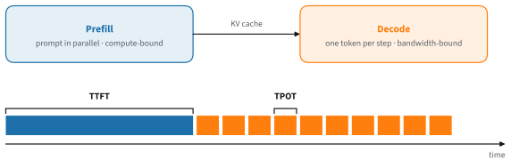
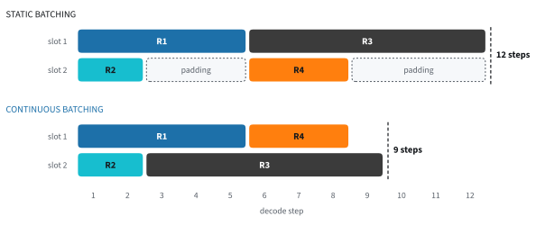
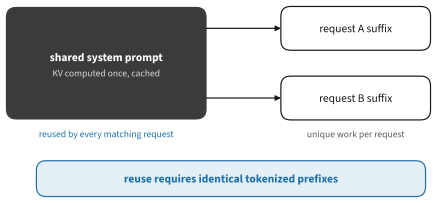

# Model Serving
:label:`sec_model_serving`

The language models in this book generated text in a notebook, one prompt
at a time, for the person who ran the cell. Suppose instead that a hundred
colleagues send requests to the same language model whenever they like. If
the GPU answers them one after another at two seconds each, the last
colleague waits more than three minutes. What has to change between calling
a model and serving it?

Serving makes one accelerator work on many requests at once. Generating a
token reads the weights and the key--value cache from memory
(:numref:`sec_hardware_buyers`). All requests share the weights, so an
engine that advances many requests in the same step reads the weights once
for all of them, provided memory holds the cache of every active request. We
start with the latency numbers that users notice, survey local and server
engines as of November 2026, and explain the techniques that make the
engines fast.

## Workloads and Latency Metrics

A user of a chat assistant notices two delays: the wait before the first
word appears, and the pace of the words that follow. The first is the
**time to first token** (TTFT), counted from the arrival of the request. On
an idle server it is dominated by *prefill*, which processes all prompt
tokens in parallel and is bound by compute. The second is the **time per
output token** (TPOT), dominated by *decode*, which produces one token per
sequence and step and is bound by memory bandwidth. Throughput, the tokens
per second summed over all users, trades against both.


:label:`fig_tools_prefill_decode`

Which numbers matter depends on the workload, and the workload picks the
tool:

:Serving workloads and example starting points (as of November 2026)
:label:`tab_serving_workloads`

| Workload | Optimize for | Start with |
|---|---|---|
| Personal assistant on your machine | simplicity, privacy | Ollama / LM Studio (llama.cpp), MLX on Macs |
| Offline batch scoring | throughput per dollar | vLLM offline mode |
| One application's API | operability | vLLM behind a small authenticated proxy |
| Multi-user / agentic service | goodput under an SLO | vLLM or SGLang, then NVIDIA Dynamo at scale |
| Max throughput on fixed NVIDIA fleet | throughput per GPU | TensorRT-LLM |

A service level objective (SLO) sets a latency target, such as a TTFT below
1 s. *Goodput*, the rate of completed requests that also met their target,
is the production metric. Overload can raise raw throughput while goodput
collapses, because requests queue until they miss their targets.

## Local Serving
:label:`subsec_model-serving-local`

On a laptop or a workstation with one user, the questions are whether a
model fits and how fast it answers. Many local inference tools use
**llama.cpp** and its **GGUF** file format, and community repositories
commonly publish GGUF conversions of open-weight models. Users often reach
llama.cpp through a wrapper:

* **Ollama** builds on llama.cpp and, on Apple silicon, also on MLX.
  `ollama run qwen3:8b` downloads, caches, and serves a model, with an
  OpenAI-compatible API at `http://localhost:11434/v1`.
* **LM Studio** offers the same engines behind a graphical interface, with
  control over how much of the model is offloaded to the GPU.
* **MLX** is Apple's array framework. Its package `mlx-lm` runs and
  fine-tunes models on Apple silicon, and the `mlx-community` organization
  on Hugging Face publishes thousands of converted models.

Common GGUF quantizations include `Q4_K_M` (about 4.9 bits per weight),
`Q5_K_M` (about 5.7), and `Q8_0` (about 8.5). For the 8.2 billion
parameters of Qwen3-8B, `Q4_K_M` gives $8.2 \times 10^9 \times 4.9 / 8
\approx 5.0$ GB, close to the 5.2 GB of Ollama's `qwen3:8b` download. The
4.9 bits were measured on Llama 3.1 8B, and `Q4_K_M` keeps a
model-dependent share of tensors at higher precision. The cache of a full
32,768-token context in bf16 adds almost as much again. Higher-bit formats
usually retain quality better; measure the effect on your own task. Decode
speed is at most the memory bandwidth divided by the bytes read per token,
so every extra bit costs speed as well as memory. A common rule is to pick
the largest model whose quantized weights fit in memory with room for the
cache, then the highest-bit format that still fits.

## Server Engines

### Open-Source and NVIDIA Engines

A shared server needs an engine that schedules requests together. For an
open-source GPU server, **vLLM** provides continuous batching, paged
KV-cache management, prefix caching, tensor parallelism, quantized-model
support, and an OpenAI-compatible server in one command:

```bash
vllm serve Qwen/Qwen3-8B --max-model-len 32768
```

**SGLang** is its closest peer. Its *RadixAttention*
:cite:`Zheng.Yin.Xie.ea.2024` keeps cached keys and values in a radix tree
shared across requests, which helps when many requests share long prefixes:
chat with a system prompt, retrieval over the same documents, or trees of
agent calls. Both projects evolve quickly and support several accelerator
backends; benchmark both on your distributions of prompt length and
concurrency before selecting one.

NVIDIA's tools trade portability for hardware-specific optimization.
**TensorRT-LLM** runs models on PyTorch with NVIDIA-tuned kernels, which can
improve steady-state throughput at the cost of more setup. **Dynamo**
coordinates many GPUs and nodes, with vLLM, SGLang, or TensorRT-LLM as
backends. It runs prefill and decode on separate pools of GPUs and routes
each request by worker load and by how much of its prefix a worker already
caches. These tools matter at datacenter scale; on a few GPUs, vLLM or
SGLang alone is simpler.

### A Common Client API
:label:`subsec_model-serving-contract`

An application should not need rewriting when it moves from a laptop to a
server. Many of these tools implement the OpenAI chat-completions API, so
the same client code targets a local Ollama, your vLLM server, or a
commercial provider after a change of the base URL and the model name:

```text
from openai import OpenAI

client = OpenAI(base_url="http://127.0.0.1:8000/v1", api_key="local")
response = client.chat.completions.create(
    model="Qwen/Qwen3-8B",
    messages=[{"role": "user", "content": "Explain KV caching briefly."}],
    temperature=0,
)
print(response.choices[0].message.content)
```

Servers that accept the same requests can still answer them differently:
tokenization, sampling defaults, structured-output support, streaming
behavior, and token accounting all vary. Keep a small conformance test and
rerun it before swapping engines.

## Engine Techniques

Four composable techniques explain much of the speed of these engines.

**Continuous batching.** A static batch waits for its slowest member.
Continuous batching admits new requests and retires finished ones between
decode steps, keeping the batch nearly full:


:label:`fig_tools_continuous_batching`

The toy scheduler below captures the idea in a few lines.
Exercise :exref:`ex_model-serving-arrivals` extends it with arrival times and
a memory budget:

```{.python .input #model-serving-scheduler}
from collections import deque

requests = deque([5, 2, 7, 3])  # output tokens requested
capacity = 2
active, timeline = [], []
while requests or active:
    while requests and len(active) < capacity:
        active.append(requests.popleft())
    timeline.append(tuple(active))
    active = [remaining - 1 for remaining in active if remaining > 1]

timeline
```

**Paged KV cache.** Each active sequence's key--value cache grows with its
length. vLLM's PagedAttention :cite:`Kwon.Li.Zhuang.ea.2023` allocates it in
fixed-size blocks, like virtual memory, and so nearly eliminates the
fragmentation that once capped batch sizes. Capacity planning follows: GPU
memory must hold the weights *plus* the cache of every concurrent sequence.
A model that fits for one request may therefore exceed memory under high
concurrency.

**Prefix caching.** When two requests share a tokenized prefix (the same
system prompt, the same document), its cached keys and values can be
computed once and reused:


:label:`fig_tools_prefix_cache`

Some commercial APIs charge less for cached input tokens, under rules that
differ by provider. Placing shared, stable content before the variable part
of a prompt then saves money as well as prefill time.

**Speculative decoding and quantization.** A small draft model proposes
several tokens, and the target model verifies them in one parallel pass.
This speeds up decoding when most proposals are accepted and preserves the
target distribution. Quantization reduces the bytes read during decode:
fewer bytes per weight give more tokens per second, until quality degrades
at the lowest bit widths. Recent NVIDIA tensor cores support FP8 (from the
Hopper and Ada generations on) and NVFP4 (from Blackwell on), and vLLM and
SGLang also load 4-bit AWQ weights. GGUF formats play the same role
locally.

## Operations

An engine listening on a port still lacks the controls that a shared
service needs. Put authentication, TLS, and rate limits in a proxy in front
of the engine, and do not expose the engine's own port. Admission control should reject or queue
requests *before* memory runs out, not after an out-of-memory error.
Propagate client cancellations so that abandoned generations stop consuming
compute. Measure TTFT, TPOT, and end-to-end latency as p50 and p95 under
realistic arrival patterns, not as averages under a closed loop of clients.
Avoid logging raw prompts by default. Pin the model, tokenizer,
quantization, and engine versions together: a faster server that answers
differently is a different system, so gate rollouts on task quality as well
as on latency.

You can now estimate whether a model and the caches of its users fit on a
card, and which engine to try first. How a server should admit and order
requests under load remains open; the simulators of the exercises explore
it.

## Summary

* Prefill is bound by compute and sets the TTFT; decode is bound by memory
  bandwidth and sets the TPOT. Pick tools by workload: Ollama, LM Studio, or
  MLX locally, vLLM or SGLang for services, TensorRT-LLM and Dynamo for
  NVIDIA fleets.
* Quantization, in GGUF formats locally and AWQ, FP8, or NVFP4 on servers,
  converts bytes saved into tokens per second, up to a limit at the lowest
  bit widths.
* Continuous batching, paged caches, prefix caching, and speculative
  decoding are four recurring optimizations, and the client controls the
  prefix structure of its prompts.
* The OpenAI-compatible API is the portable client contract; verify
  compatibility with your own conformance tests.
* Capacity is the weights plus the cache of every user; production also
  needs admission control, cancellation, percentile latencies, and pinned
  versions.

## Exercises

1. **Batch size limits.** The command `vllm serve Qwen/Qwen3-8B` serves a
   model with $L = 36$ layers and $H_\textrm{kv} = 8$ key--value heads of
   dimension $d_h = 128$, whose bf16 weights occupy $B_w = 16.4$ GB. Its
   cache is stored in bf16 as well. Serve it on an H100 SXM, whose memory bandwidth is $\beta = 3.35$ TB/s and whose dense
   bf16 rate is 989 TFLOP/s (:numref:`tab_gpu_specs`).
   A decode step reads the weights once for the whole batch and the cache
   of every active sequence. For $b$ sequences that each hold $n$ cached
   tokens, the step, and hence the time per output token of every
   sequence, takes about

   $$t(b) = \frac{B_w + b\, n\, B_\textrm{kv}}{\beta},$$

   where $B_\textrm{kv}$ is the cache size per token.
    1. Every layer stores one key and one value vector per key--value head
       and token, so $B_\textrm{kv} = 2 \cdot L \cdot H_\textrm{kv} \cdot
       d_h \cdot (\textrm{bytes per element})$ (:numref:`sec_kv-cache`).
       Compute $B_\textrm{kv}$. Evaluate the TPOT and the throughput
       $b / t(b)$ at $n = 2048$ for
       $b \in \{1, 8, 64, 256\}$. Which value does the throughput approach
       as $b$ grows, and which term of $t(b)$ sets it? Count 2 FLOPs per
       parameter and token for the 8.2 billion parameters, and check with
       the bf16 rate that the step at $b = 256$ is still bound by memory
       traffic.
    1. An interactive service promises a TPOT of at most 20 ms. What is
       the largest batch it can run? Which batch would an offline scoring
       job of :numref:`tab_serving_workloads` choose instead, and why?
    1. Let the engine use 72 GB of the card for weights and cache, and let
       the sequences hold 2,048 tokens on average. Before paged caches,
       servers reserved one contiguous region per request for its maximum
       length. How many sequences fit when each one reserves the
       `--max-model-len` of 32,768 tokens? What fraction of the reserved
       cache then holds token states? :citet:`Kwon.Li.Zhuang.ea.2023`
       measured 20.4% to 38.2% in such systems. Why is your fraction lower?
       How many sequences fit when the cache is allocated in blocks of 16
       tokens? Bound the memory that partly filled blocks waste.
    1. Which limit sets the batch of the interactive service under each of
       the two allocation schemes: memory or the TPOT target?
   :exlabel:`ex_model-serving-batch-limits`

1. [code] **Conformance test.** :numref:`subsec_model-serving-contract`
   recommends a small conformance test before swapping engines.
    1. Write a function `conformance(base_url, model)` with the `openai`
       client of :numref:`subsec_model-serving-contract` that runs four
       checks and reports which of them pass. Every check also requires a
       nonempty `content`. First, two identical requests
       at temperature 0 return the same text. Second, a request with
       `max_tokens=8` ends with `finish_reason` equal to `"length"` and
       reports at most 8 completion tokens in `usage`. Third, a request that
       asks the model to count from 1 to 20 with `stop=["7"]` returns text
       without the digit 7. Fourth, a streamed request at temperature 0 with
       `stream_options={"include_usage": True}` yields chunks whose
       concatenated content and final `usage` equal those of the same
       request without streaming. Run the test against Ollama with a small
       model such as `qwen3:0.6b`, which runs on a CPU, and against a second
       OpenAI-compatible server of your choice. Which checks fail, and why?
    1. On a vLLM server, the first check passes while the server is idle
       and fails occasionally while other clients send requests to it. No
       sampling takes place at temperature 0. Explain the failure.
    1. Both servers load the same model with the same tokenizer and
       receive the same messages, yet they report values of
       `usage.prompt_tokens` that differ by a few tokens. Name two possible
       causes. Why does such a difference matter to a client beyond
       billing?

1. [code] **Static versus continuous batching.** The cell that builds
   `timeline` admits a waiting request whenever a slot is free.
    1. Change the cell into a static batcher, which admits new requests
       only when every slot is empty. Compare the number of steps that both
       versions take for the four requests of the cell, and the fraction of
       slot-steps that produce a token. What is the smallest number of steps
       that any scheduler with `capacity = 2` needs for these requests?
    1. Draw 1,000 output lengths with a mean of about 100 tokens from three
       distributions: a constant, a uniform distribution on 1 to 199, and a
       geometric distribution. Schedule them with `capacity = 32`, and
       compare the steps of both schedulers with the lower bound of the
       first sub-problem. How does the gain from continuous batching depend
       on the spread of the output lengths?
    1. Even continuous batching misses the lower bound in the second
       sub-problem. Where in its timeline does it lose steps?

1. [code] **Prefix cache for an agent.** A coding agent calls a model 30
   times. The first prompt holds a system prompt and repository context of
   20,000 tokens. Every later prompt repeats the previous prompt and
   appends 1,000 tokens: the model's previous answer and a tool result.
    1. How many prompt tokens must the engine prefill over the 30 calls
       without prefix caching, and how many with a cache that keeps every
       earlier prompt? A provider charges a tenth of its input price for
       cached tokens. What fraction of the uncached input bill remains?
    1. vLLM caches only full blocks, and it keys each block by a hash of
       the key of the preceding block and of the block's own token ids.
       Implement this scheme with blocks of 16 tokens as a function
       `prefill_tokens(cache, tokens)` that returns the number of tokens to
       compute and adds the new full blocks to the set `cache`. Simulate the
       agent with random token ids, and compare the result with your count
       from the first sub-problem. Why does the key of a block include the
       key of the preceding block?
    1. The agent framework writes the current time, to the second, into
       the first line of the system prompt. Rerun the simulation. Where
       should the timestamp go instead?
    1. A retrieval application places three of 50 documents after a shared
       system prompt, in order of relevance. Two requests retrieve the same
       three documents in different orders. Which blocks does the second
       request reuse? Propose an ordering that raises reuse, and state what
       it gives up.

1. **Closed and open loops.** A load generator runs $C = 16$ clients in a
   closed loop: each client sends its next request as soon as its previous
   request completes. Little's law :cite:`Little.1961` relates the mean
   number $L$ of requests in a system, their arrival rate $\lambda$, and
   their mean time $W$ in the system by $L = \lambda W$.
    1. The mean latency of the server is 4 s. At which rate does the
       generator send requests? An engine change doubles the mean latency.
       What happens to the rate? Why can the generator never build up a
       queue of more than $C$ requests?
    1. The benchmark reports a p95 time to first token of 300 ms. In
       production, requests arrive as a Poisson process at the rate of the
       first sub-problem, independently of how fast the server answers. Why
       does the benchmark predict the production tail latency poorly?
    1. `vllm bench serve` accepts a `--request-rate` and a
       `--max-concurrency`. The rate defaults to `inf`, and a finite rate
       draws Poisson arrivals at that rate. Which settings reproduce the
       closed loop? What does a run measure that sets both?
   :exlabel:`ex_model-serving-loops`

1. [code] **Arrivals and a memory budget.** ● Extend the cell that builds
   `timeline` into a simulator in which time advances in decode steps.
   Request $i$ arrives at step $a_i$, has a prompt of $P_i$ tokens, and
   generates $T_i$ tokens, one per step from the step of its admission on.
   The server runs at most 64 sequences and holds at most 32,768 tokens of
   cache, and a sequence holds its prompt plus the tokens generated so far.
   Draw the arrivals from a Poisson process with $\lambda$ requests per
   step, draw $P_i$ uniformly from 100 to 1,000, and let $T_i$ be one plus
   an exponential variable with mean 200, rounded down and capped at
   `max_tokens = 1024`. Measure the time to first token in steps, from the
   arrival to the first generated token.
    1. Admit requests first come, first served when the cache can hold the
       prompt plus `max_tokens`, the most that a request can ever need.
       Reject an arriving request when 50 requests already wait. For
       $\lambda \in \{0.05, 0.1, 0.15, 0.2\}$, report the tokens generated
       per step, the p50 and p95 TTFT, and the rejected fraction.
    1. Admit a request instead whenever the cache can hold its prompt plus
       one token. When the active sequences outgrow the cache, preempt the
       most recently admitted one, free its cache, and put it back at the
       head of the queue, so that it recomputes its cache on readmission.
       Repeat the measurements. The simulator charges no time for prefill.
       Which resource does recomputation spend on a real server, and which
       would swapping the cache to CPU memory spend instead? How would
       charging for prefill change your comparison with the first
       sub-problem?
    1. Order the queue by the number of remaining tokens, shortest first,
       and run both admission rules at $\lambda = 0.2$. Compare this order
       with first come, first served on the p95 TTFT of all requests and on
       that of the 5% of requests with the longest outputs.
    1. A server knows `max_tokens` but not $T_i$. What could it order the
       queue by instead, and how much of the gain of the third sub-problem
       would you expect it to keep?
   :exlabel:`ex_model-serving-arrivals`

1. **Speculative sampling.** ● In the speculative decoding of
   :citet:`Leviathan.Kalman.Matias.2023`, a draft model with next-token
   distribution $q$ proposes a token $x \sim q$, and the target model,
   with next-token distribution $p$, accepts it with probability
   $\min(1, p(x) / q(x))$. After a rejection, the token is drawn instead
   from the residual distribution

   $$p'(x) = \frac{\max(0, p(x) - q(x))}{\sum_{x'} \max(0, p(x') - q(x'))}.$$

    1. Show that the emitted token is distributed according to $p$, and
       that the probability of acceptance is
       $\beta = \sum_x \min(p(x), q(x))$.
    1. In every round, the draft proposes $\gamma$ tokens one after
       another, and one pass of the target scores all of them. The target
       emits the accepted tokens up to the first rejection and then one
       token of its own, drawn from $p'$ after a rejection or from $p$ when
       all $\gamma$ tokens were accepted. Let $\alpha$ be the mean of the
       acceptance probability $\beta$ of the first sub-problem over the
       positions of a sequence, and assume that every draft token is
       accepted independently with probability $\alpha$. Show that a round
       emits $(1 - \alpha^{\gamma + 1}) / (1 - \alpha)$ tokens in
       expectation. A draft step takes a fraction $c$ of the time of a
       target step, and the scoring pass takes one target step. Derive the
       expected speedup over plain decoding, and find the best $\gamma$ for
       $c = 0.05$ and $\alpha \in \{0.6, 0.8, 0.9\}$.
    1. The scoring pass takes one target step only while it is bound by
       memory traffic. A server decodes $b$ sequences together, and each
       sequence scores $\gamma + 1$ positions per round. Ignore the cache,
       store the weights in bf16, and count 2 FLOPs per parameter and token.
       Above which $b$ does the pass become compute-bound on the H100 of
       exercise :exref:`ex_model-serving-batch-limits` for $\gamma = 4$? What does this imply for
       speculative decoding on a busy server compared with a single user?

1. [extended] **Goodput under load.** ●● Turn your simulator of exercise
   :exref:`ex_model-serving-arrivals` into one whose clock runs in seconds
   instead of decode steps, for
   Qwen3-8B on the H100 of exercise :exref:`ex_model-serving-batch-limits`
   with 72 GB for weights and a paged cache. A step processes $p$ prompt
   tokens and one token for each of $b$ decoding sequences, which together
   hold $K$ cached tokens. With $N$ parameters, the dense bf16 rate $F$,
   and the notation of exercise :exref:`ex_model-serving-batch-limits`,
   the step takes

   $$t_\textrm{step} = \max\left(\frac{2N(p + b)}{F}, \frac{B_w + K B_\textrm{kv}}{\beta}\right),$$

   which ignores the FLOPs of the attention scores. Requests arrive as a
   Poisson process at $\lambda$ requests per second, with prompts uniform
   between 500 and 4,000 tokens, and output lengths of one plus an
   exponential variable with mean 250, rounded down and capped at 2,048. A
   request counts toward goodput when its TTFT is at most 1 s and its
   TPOT, the mean time between its output tokens, is at most 50 ms.
    1. Prefill every admitted prompt in full within one step. Estimate the
       saturation rate from $t_\textrm{step}$ before you simulate. Then
       sweep $\lambda$ from light load to well beyond saturation, and plot
       the throughput and the goodput in requests per second. At which rate
       does goodput peak, and how does it compare with your estimate?
    1. A full prefill of a long prompt delays the next token of every
       decoding sequence. Implement chunked prefill
       :cite:`Agrawal.Kedia.Panwar.ea.2024`, which caps the tokens of a
       step, decode tokens included, at a budget and spreads a prompt over
       several steps. Repeat the sweep for budgets of 512, 2,048, and 8,192
       tokens. Which budget maximizes goodput? How does the answer depend
       on the two SLOs?
    1. Add admission control that rejects a request as soon as its TTFT
       target can no longer be met. How does it change goodput beyond
       saturation? Explain why goodput collapses without it while
       throughput stays high.
    1. Let every client abandon its request after 10 s and send it once
       more. Compare goodput when the server keeps generating abandoned
       requests and when it cancels them.
    1. State the largest request rate at which at least 90% of all
       arriving requests meet both SLOs, counting rejected requests as
       misses, and the configuration that achieves it.

[Discussions](https://d2l.discourse.group/t/36847)
