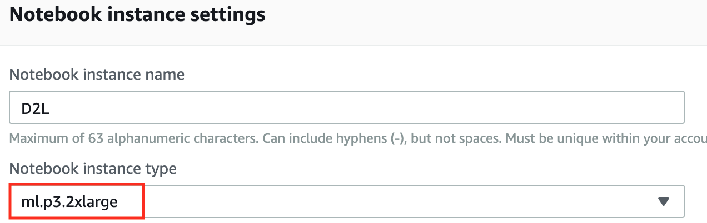
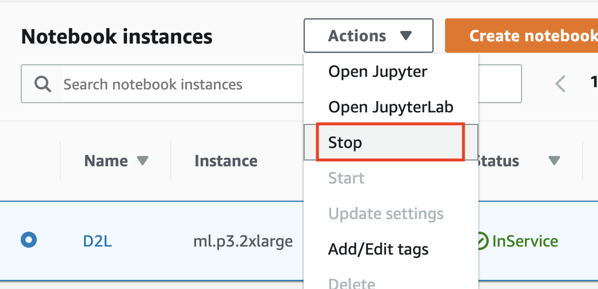

# Using Amazon SageMaker {#sec-sagemaker}

Deep learning applications
may demand so much computational resource
that easily goes beyond
what your local machine can offer.
Cloud computing services
allow you to 
run GPU-intensive code of this book
more easily
using more powerful computers.
This section will introduce 
how to use Amazon SageMaker
to run the code of this book.

## Signing Up

First, we need to sign up an account at https://aws.amazon.com/.
For additional security,
using two-factor authentication 
is encouraged.
It is also a good idea to
set up detailed billing and spending alerts to
avoid any surprise,
e.g., 
when forgetting to stop running instances.
After logging into your AWS account, 
go to your [console](http://console.aws.amazon.com/) and search for "Amazon SageMaker" (see @fig-sagemaker), 
then click it to open the SageMaker panel.

{#fig-sagemaker width="300px"}

## Creating a SageMaker Instance

Next, let's create a notebook instance as described in @fig-sagemaker-create.

{#fig-sagemaker-create width="400px"}

SageMaker provides multiple [instance types](https://aws.amazon.com/sagemaker/pricing/instance-types/) with varying computational power and prices.
When creating a notebook instance,
we can specify its name and type.
In @fig-sagemaker-create-2, we choose `ml.p3.2xlarge`: with one Tesla V100 GPU and an 8-core CPU, this instance is powerful enough for most of the book.

{#fig-sagemaker-create-2 width="400px"}

::: {.panel-tabset group="framework"}

## PyTorch

The entire book in the ipynb format for running with SageMaker is available at https://github.com/d2l-ai/d2l-pytorch-sagemaker. We can specify this GitHub repository URL (@fig-sagemaker-create-3) to allow SageMaker to clone it when creating the instance.

## TensorFlow

The entire book in the ipynb format for running with SageMaker is available at https://github.com/d2l-ai/d2l-tensorflow-sagemaker. We can specify this GitHub repository URL (@fig-sagemaker-create-3) to allow SageMaker to clone it when creating the instance.

## MXNet

The entire book in the ipynb format for running with SageMaker is available at https://github.com/d2l-ai/d2l-en-sagemaker. We can specify this GitHub repository URL (@fig-sagemaker-create-3) to allow SageMaker to clone it when creating the instance.

:::


{#fig-sagemaker-create-3 width="400px"}

## Running and Stopping an Instance

Creating an instance
may take a few minutes.
When it is ready,
click on the "Open Jupyter" link next to it (@fig-sagemaker-open) so you can
edit and run all the Jupyter notebooks
of this book on this instance
(similar to steps in @sec-jupyter).

{#fig-sagemaker-open width="400px"}


After finishing your work,
do not forget to stop the instance to avoid 
being charged further (@fig-sagemaker-stop).

{#fig-sagemaker-stop width="300px"}

## Updating Notebooks

::: {.panel-tabset group="framework"}

## PyTorch

Notebooks of this open-source book will be regularly updated in the [d2l-ai/d2l-pytorch-sagemaker](https://github.com/d2l-ai/d2l-pytorch-sagemaker) repository
on GitHub.
To update to the latest version,
you may open a terminal on the SageMaker instance (@fig-sagemaker-terminal).

## TensorFlow

Notebooks of this open-source book will be regularly updated in the [d2l-ai/d2l-tensorflow-sagemaker](https://github.com/d2l-ai/d2l-tensorflow-sagemaker) repository
on GitHub.
To update to the latest version,
you may open a terminal on the SageMaker instance (@fig-sagemaker-terminal).

## MXNet

Notebooks of this open-source book will be regularly updated in the [d2l-ai/d2l-en-sagemaker](https://github.com/d2l-ai/d2l-en-sagemaker) repository
on GitHub.
To update to the latest version,
you may open a terminal on the SageMaker instance (@fig-sagemaker-terminal).

:::


{#fig-sagemaker-terminal width="300px"}

You may wish to commit your local changes before pulling updates from the remote repository. 
Otherwise, simply discard all your local changes
with the following commands in the terminal:

::: {.panel-tabset group="framework"}

## PyTorch


```bash
cd SageMaker/d2l-pytorch-sagemaker/
git reset --hard
git pull
```


## TensorFlow


```bash
cd SageMaker/d2l-tensorflow-sagemaker/
git reset --hard
git pull
```


## MXNet


```bash
cd SageMaker/d2l-en-sagemaker/
git reset --hard
git pull
```


:::


## Summary

* We can create a notebook instance using Amazon SageMaker to run GPU-intensive code of this book.
* We can update notebooks via the terminal on the Amazon SageMaker instance.


## Exercises


1. Edit and run any section that requires a GPU using Amazon SageMaker.
1. Open a terminal to access the local directory that hosts all the notebooks of this book.


[Discussions](https://discuss.d2l.ai/t/422)
