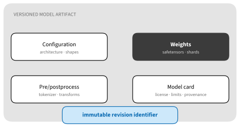
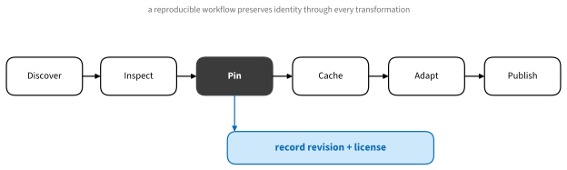

# Models, Datasets, and the ML Software Ecosystem
:label:`sec_software_ecosystem`

Modern machine learning rarely begins with an empty directory. We discover a
model or dataset, inspect its documentation and license, pin a revision, cache
the files, adapt and evaluate it, and publish a new artifact. Libraries make
each step convenient; a reliable workflow preserves identity and provenance
across all of them.

## Artifact Identity

### A Model Is More Than Its Weights


:label:`fig_tools_model_artifact`

Weights without the matching architecture may be uninterpretable. A language
model also needs tokenizer rules and special tokens; a vision model needs its
resize and normalization policy. Generation defaults, label mappings, license,
training provenance, evaluation limits, and the exact revision affect whether
we can reproduce or deploy the result.

Model and data cards are part of the artifact, not marketing attached after the
fact. Read the stated training data, intended use, limitations, evaluation
conditions, license, and access restrictions before downloading gigabytes or
building a product assumption around it.

### The Artifact Lifecycle


:label:`fig_tools_artifact_lifecycle`

A practical sequence is:

1. **Discover** candidates using task, language, license, size, and measured
   evaluations.
1. **Inspect** the card, repository tree, configuration, custom code, and file
   formats.
1. **Pin** an immutable commit or version rather than a moving branch.
1. **Download and cache** through a documented client; record where the cache
   lives and how large it may grow.
1. **Load** with known library versions and explicit preprocessing.
1. **Adapt** with a full fine-tune, an adapter, prompting, or conversion.
1. **Evaluate** on the actual use case, including failure modes and resource
   behavior.
1. **Publish** a new revision with its relationship to the parent artifact.
1. **Deploy** the pinned, evaluated artifact, rather than whatever the repository serves
   under `main` later.

The following compact manifest is a useful local companion to a model cache.

```{.python .input #software-ecosystem-manifest}
from dataclasses import asdict, dataclass
import json

@dataclass(frozen=True)
class Artifact:
    repository: str
    revision: str
    task: str
    license: str
    parent: str | None = None

artifact = Artifact(
    repository="organization/model-name",
    revision="0123456789abcdef",
    task="text-generation",
    license="check-model-card",
)
print(json.dumps(asdict(artifact), indent=2))
```

In production, include file hashes, preprocessing revision, framework and
library versions, evaluation record, and approval status.

## Working with Repositories

### Hugging Face as a Running Example

The [Hugging Face Hub](https://huggingface.co/docs/hub/) hosts versioned models,
datasets, and application demos. Its surrounding libraries separate useful
concerns:

* **Transformers** supplies architectures, pretrained model interfaces,
  generation, and training utilities.
* **Datasets** loads, transforms, streams, and caches datasets, commonly through
  Apache Arrow.
* **Tokenizers** provides fast, serializable tokenization pipelines.
* **Accelerate** configures device placement and launches distributed jobs.
* **PEFT** implements parameter-efficient adaptation such as low-rank adapters.
* **TRL** focuses on post-training objectives and preference optimization.
* **Diffusers** supplies modular diffusion pipelines.
* **safetensors** stores tensors without executable pickle payloads and supports
  efficient metadata and slicing.

These libraries are related but optional. Use the narrowest layer that solves
the problem. A simple image classifier does not need an LLM post-training
stack, and a serving engine need not import the library used to train a model.

A revision-pinned download should make the identity explicit:

```text
from huggingface_hub import snapshot_download

path = snapshot_download(
    repo_id="organization/model-name",
    revision="0123456789abcdef",
    allow_patterns=["*.json", "*.safetensors"],
)
```

The placeholder revision above is illustrative. Use a real immutable commit.
`allow_patterns` can avoid downloading unrelated framework formats, but ensure
the selected files form a complete artifact.

### Formats and Transformations

Formats encode different contracts:

* **safetensors** is a tensor container, not an architecture or serving API.
* **Adapter weights** encode a transformation relative to a named base model.
  Publishing the adapter without the base revision is incomplete.
* **ONNX** represents a computation graph for interoperable runtimes. Export can
  specialize shapes or omit behavior that existed in Python.
* **GGUF** packages quantized models and metadata for llama.cpp-family local
  runtimes.
* Framework checkpoints may contain only tensors or arbitrary serialized Python
  objects, depending on how they were saved.

Conversion is a new artifact. Record the converter version, command, source
revision, quantization calibration, target precision, and an evaluation against
the source. Matching file names do not imply matching numerical behavior.

### Trust, Access, and Licensing

Treat model repositories as software supply-chain inputs.

* Prefer non-executable tensor formats. Loading an untrusted pickle-based
  checkpoint can execute code.
* `trust_remote_code=True` deliberately executes repository code. Read and pin
  that code, isolate it, and use the flag only when the architecture requires
  it.
* Gated assets may require accepting terms. An access token proves identity; it
  does not grant permission to redistribute the files.
* A model, its training data, and its application may have different legal and
  policy constraints. Record the actual license text and version.
* Use read-scoped tokens in a secret manager. Never commit or print them.

Check file hashes after transfers, especially when an artifact is mirrored.
For a small file, the mechanism is straightforward:

```{.python .input #software-ecosystem-hash}
import hashlib
from pathlib import Path

def sha256(path, block_size=1 << 20):
    digest = hashlib.sha256()
    with Path(path).open("rb") as handle:
        for block in iter(lambda: handle.read(block_size), b""):
            digest.update(block)
    return digest.hexdigest()
```

### Caches and Storage

Shared caches save time and bandwidth but can silently consume a workstation's
disk. Know the cache root, inspect it, and prune through the library rather than
deleting files while another job uses them. On a cluster, decide whether each
node has a local cache or all nodes contend for network storage. A common
pattern stages immutable weights locally and writes only checkpoints and logs
to shared durable storage.

Offline and air-gapped environments need more than copied weights. Mirror the
complete pinned artifact, required packages or containers, licenses, and
checksums; test with network access disabled.

## Lineage and Publication

### Beyond One Hub

The Hub is a useful example, not the whole ecosystem. Kaggle hosts datasets,
models, and notebook outputs; ModelScope serves a broad international model
community; `timm` and PyTorch Hub distribute model implementations and
weights; OpenMMLab provides task-specific toolboxes; and GGUF and MLX
communities distribute artifacts optimized for local runtimes. Enterprise
registries add approval, access, and lineage controls.

Avoid building a logo catalog. Ask the same questions of every source: What is
the immutable identity? What files and executable code are involved? What is
the license? How is the artifact evaluated, cached, transformed, and retired?

### Experiments and Lineage

Experiment trackers such as MLflow, Weights & Biases, and framework-specific
loggers connect configurations, metrics, code revisions, and artifacts. They
do not create reproducibility automatically. Log the source and data revision,
environment, seed policy, hardware, parent model, and output hashes. Keep a
plain export path so results remain inspectable outside one service.

## Summary

* A complete artifact includes preprocessing, configuration, documentation,
  license, and revision in addition to weights.
* Pin before downloading and preserve identity through every transformation.
* Loading remote code and pickle-based checkpoints changes the trust boundary.
* A conversion or adapter is a new artifact with a recorded parent.
* Caching, access control, licensing, and lineage are part of the workflow.

## Exercises

1. Inspect a model repository and list every file needed for offline inference.
1. Design a manifest for an adapter that unambiguously identifies its base
   model, training data, code, and evaluation.
1. Convert a small model between two formats and define numerical and task-level
   checks that would detect an unacceptable conversion.
