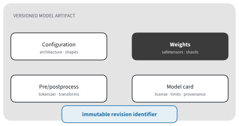

# Ecosystem
:label:`sec_software_ecosystem`

Modern machine learning projects commonly begin with pretrained checkpoints,
datasets, released code, and benchmark results. Using these artifacts requires
knowing where to find them, how to evaluate their relevance, and how to record
their provenance. This section surveys prominent sources as of 2026, explains
how to interpret leaderboards, and presents practices for managing external
artifacts safely.

## Where to Find Things

### Models

The [Hugging Face Hub](https://huggingface.co/models) listed more than two
million public models in spring 2026 and provides Git-style versioning, model
cards, and integrations with the libraries used in this book. Because
popularity does not establish suitability, search by task, inspect recency and
download signals, and read the model card before selecting a repository. Complementary sources include:

* [ModelScope](https://modelscope.cn/), Alibaba's hub, hosts a large part
  of the Chinese open-model ecosystem (Qwen and friends, 170,000+ models) —
  and frequently publishes new open-weight releases.
* [Kaggle Models](https://www.kaggle.com/models) hosts curated weights
  wired into Kaggle's competition and notebook infrastructure
  (:numref:`sec_hosted_notebooks`).
* The [Ollama library](https://ollama.com/library) is a short, curated
  menu of local-runtime models — less a discovery surface than a
  convenience layer (:numref:`sec_model_serving`).
* [`timm`](https://huggingface.co/timm) provides a broad collection of vision
  backbones; [Civitai](https://civitai.com/) hosts community image-generation
  checkpoints and LoRAs.

### Datasets

[Hugging Face Datasets](https://huggingface.co/datasets) (half a million
public datasets) and [Kaggle](https://www.kaggle.com/datasets) cover most
supervised needs. For pretraining-scale text, the lineage runs from raw
[Common Crawl](https://commoncrawl.org/) through filtered derivatives —
[FineWeb](https://huggingface.co/datasets/HuggingFaceFW/fineweb) (~15
trillion tokens, plus a 1,000-language successor) provides a widely used open
baseline, analogous to C4 in the period when
BERT was developed. For
vision–language pairs, DataComp provides an alternative to LAION with an emphasis on controlled
dataset construction and evaluation. Older and very large corpora are sometimes available only through
[Academic Torrents](https://academictorrents.com/). Whatever the source:
datasets, like models, have versions, licenses, and documented failure modes.
Review a dataset's documentation before adopting it.

### Papers and Code

New work appears on [arXiv](https://arxiv.org/list/cs.LG/recent) first;
the community's curated front page for ML is [Hugging Face
Papers](https://huggingface.co/papers), which absorbed that role when
Papers with Code—for years an index from papers to code and benchmarks—closed
in mid-2025. Its historical leaderboard data survives as a static archive,
illustrating why project inputs should not depend on one external index. [Semantic Scholar](https://www.semanticscholar.org/)
and [alphaXiv](https://alphaxiv.org/) help with search and discussion, and
Released implementations commonly reside on GitHub. Issue history, recent
commits, and documented reproduction results provide evidence beyond the
paper's abstract.

## Choosing a Model: Benchmarks and Leaderboards

Model rankings change as models, evaluation sets, and optimization methods
evolve. Static benchmark suites can also enter training data. The Open LLM
Leaderboard was retired in 2025 after contamination reduced its usefulness.
Model selection should therefore combine several sources of evidence:

* [LMArena](https://lmarena.ai/) (now Arena) — blind human pairwise
  preference; it measures aggregate user preferences, which may differ from
  the target task.
* [LiveBench](https://livebench.ai/) — contamination-resistant by rotating
  fresh questions monthly.
* [SWE-bench Verified](https://www.swebench.com/) — an evaluation for
  coding agents on real GitHub issues; it exemplifies the
  benchmark-per-capability pattern (math, long context, safety all have
  their own).
* [Artificial Analysis](https://artificialanalysis.ai/) — the
  quality/price/latency triangulation across hundreds of models and
  providers; useful when cost and latency are selection criteria.
* [OpenRouter rankings](https://openrouter.ai/rankings) — revealed
  preference by real token volume rather than scores; instructive
  precisely where it disagrees with the quality leaderboards.

After forming a shortlist, build a small evaluation set from the target task
and run each candidate on it. The
gap between leaderboard rank and performance on your distribution is
routinely larger than the gap between adjacent leaderboard entries. The
evaluation discipline this book has practiced throughout — held-out data,
meaningful baselines, error analysis — applies to *choosing* models exactly
as it does to training them.

## Staying Current

A small, deliberate set of information sources is easier to evaluate than a
continuous stream of announcements.
A workable minimal set, as of 2026:

* [r/LocalLLaMA](https://www.reddit.com/r/LocalLLaMA/) — a community source
  for open-weight releases, quantizations, hardware reports, and reproduction
  attempts.
* [Hugging Face Papers](https://huggingface.co/papers) daily — a curated
  dozen papers instead of arXiv's daily hundreds.
* One good newsletter — Andrew Ng's *The Batch*, Jack Clark's *Import AI*,
  or Sebastian Raschka's *Ahead of AI* — for the weekly synthesis.
* For systems depth, the [GPU MODE](https://github.com/gpu-mode/lectures)
  lecture series and community, and the
  [EleutherAI Discord](https://www.eleuther.ai/community) for open
  research.

X/Twitter remains where labs announce and researchers argue; treat it as a
discovery feed, not an archive. And the chapter-end
resources of this book (:numref:`chap_appendix_tools`) collect the
durable long-form references.

## Using What You Found

### Pin the Identity


:label:`fig_tools_model_artifact`

A model is more than its weights: the tokenizer, preprocessing,
configuration, license, and revision all determine whether you can
reproduce a result (:numref:`fig_tools_model_artifact`). Repositories are
Git repositories — `main` moves. Pin the commit:

```text
from huggingface_hub import snapshot_download

path = snapshot_download(
    repo_id="organization/model-name",
    revision="0123456789abcdef",          # an immutable commit, not main
    allow_patterns=["*.json", "*.safetensors"],
)
```

A small manifest records the model identity explicitly. In production, add
file hashes, library versions, and an evaluation record:

```{.python .input #software-ecosystem-manifest}
from dataclasses import asdict, dataclass
import json

@dataclass(frozen=True)
class Artifact:
    repository: str
    revision: str
    task: str
    license: str
    parent: str | None = None

artifact = Artifact(repository="organization/model-name",
                    revision="0123456789abcdef",
                    task="text-generation", license="apache-2.0")
print(json.dumps(asdict(artifact), indent=2))
```

The same pinning discipline applies to *derived* artifacts: a LoRA adapter
without its base-model revision is incomplete, and a quantized conversion
(GGUF, AWQ, ONNX — see :numref:`sec_model_serving`) is a new artifact
whose numerical fidelity someone should have checked against the source.

### Trust and Licenses

Downloaded models are software supply-chain inputs with security and licensing
implications:

* Prefer **safetensors** — a pure tensor container. Legacy pickle-based
  checkpoints can execute arbitrary code on load, and the Hub's scanners
  are a mitigation, not a guarantee.
* `trust_remote_code=True` runs Python from the repository on your
  machine. Read and pin that code; use the flag only when the architecture
  genuinely requires it.
* "Open" spans a wide range of licenses: permissive Apache/MIT weights,
  acceptable-use licenses with commercial thresholds, research-only
  releases, and gated models whose terms you accept per account. Record the
  license associated with the pinned repository revision, since repositories
  can relicense between revisions.
* Every hub client caches aggressively (tens to hundreds of gigabytes in
  `~/.cache/huggingface` is routine). Learn the cache tool's `scan` and
  `delete` commands and monitor disk use.

## Summary

* Discovery is a skill: Hugging Face is the center for models and
  datasets, with ModelScope, Kaggle, Ollama's library, and Civitai as the
  complements that matter; FineWeb-class corpora are the open pretraining
  baseline.
* Papers with Code closed in 2025; arXiv and Hugging Face Papers provide paper
  discovery, while repository activity and reproduction reports help assess
  released code.
* No leaderboard is trusted alone: triangulate Arena, LiveBench,
  task-specific benchmarks, and price/latency data — then decide on a
  small evaluation you built from your own task.
* Use a small set of complementary sources, such as a community, a curated
  paper feed, and a newsletter.
* Pin revisions, prefer safetensors, read licenses, treat remote code as
  code review, and manage your caches — treat external artifacts as supply-chain dependencies.

## Exercises

1. Pick a task you care about and shortlist three models using at least
   two leaderboards plus Artificial Analysis. Where do the rankings
   disagree, and why might that be?
1. Inspect a model repository of your choice and list every file needed
   for offline inference. Which of them could execute code on your
   machine?
1. Build a 25-example evaluation set for a task you know well and run
   your shortlist from Exercise 1 on it. Does your ranking match the
   leaderboards'?
1. Find the license of a popular open-weight model and determine: may you
   deploy it commercially, fine-tune it, and redistribute the fine-tune?
