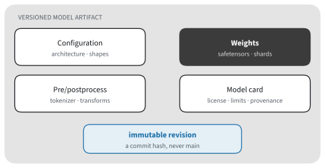

# Ecosystem
:label:`sec_software_ecosystem`

Most models in this book were trained from scratch, on Fashion-MNIST or on
*The Time Machine*, so that every step stayed visible. A real project rarely
starts that way. It starts from someone else's work: a pretrained checkpoint,
a public dataset, the code released with a paper. Suppose you want a model
that sorts the support tickets of a small company. A search of the Hugging
Face Hub for text classifiers returns more than a hundred thousand
candidates, each with a download count and many with a model card and a
benchmark score. Which one should you try first? Will its reported score
hold on your tickets? And will the model you load next year be the one you
evaluated today?

These are questions about evidence and identity rather than about training.
Answering them means treating external artifacts the way a software engineer
treats dependencies: find them where the community keeps them, judge them by
measurements on your own task and not by rankings alone, and record which
version you used and under which license. Without that record a result
cannot be reproduced. A checkpoint downloaded in good faith can also run
code on your machine unless its file format is checked first. This section
follows the hardware sections because the choice of a model and the choice
of a machine constrain each other. We look first at where models, datasets
and papers are found, then at how to read benchmarks and leaderboards, at a
few sources that keep a practitioner informed, and finally at how to pin, check and license what we download.

## Sources of Models, Data, and Papers

### Models

The [Hugging Face Hub](https://huggingface.co/models) listed more than three
million public models as of November 2026. Each model lives in a Git
repository, with a model card and integrations with the libraries used in
this book. Popularity does not establish suitability, so search by task,
check recency and download counts, and read the model card. Several other sources complement the Hub:

* [ModelScope](https://modelscope.cn/), Alibaba's hub, hosts a large part of
  the Chinese open-model ecosystem, with more than 280,000 models as of
  November 2026.
* [Kaggle Models](https://www.kaggle.com/models) hosts curated weights wired
  into Kaggle's competition and notebook infrastructure
  (:numref:`sec_hosted_notebooks`).
* The [Ollama library](https://ollama.com/library) is a short, curated list
  of models packaged for a local runtime (:numref:`sec_model_serving`).
* [`timm`](https://huggingface.co/timm) provides a broad collection of
  vision backbones, and [Civitai](https://civitai.com/) hosts community
  image-generation checkpoints and LoRA adapters.

### Datasets

[Hugging Face Datasets](https://huggingface.co/datasets) (more than a
million public datasets as of November 2026) and
[Kaggle](https://www.kaggle.com/datasets) cover most supervised needs. For
pretraining-scale text, the lineage runs from raw
[Common Crawl](https://commoncrawl.org/) through filtered derivatives.
[FineWeb](https://huggingface.co/datasets/HuggingFaceFW/fineweb) held 15
trillion tokens at its 2024 release and more than 18.5 trillion after later
versions added newer crawls, and the multilingual FineWeb2 applies the
same pipeline to more than 1,000 languages. FineWeb is now a common open
baseline for pretraining, the role that C4 played after its release with T5
in 2019. For image–text pairs,
[DataComp](https://www.datacomp.ai/) provides an alternative to LAION with
an emphasis on controlled dataset construction and evaluation. Older and
very large corpora are sometimes available only through
[Academic Torrents](https://academictorrents.com/). Whatever the source,
datasets have versions, licenses and documented failure modes, just as
models do. Read a dataset's documentation before adopting it.

### Papers and Code

New work appears first on [arXiv](https://arxiv.org/list/cs.LG/recent).
[Hugging Face Papers](https://huggingface.co/papers) curates a daily front
page and links papers to their code. It took over that role when Papers with
Code, for years the index from papers to code and benchmarks, closed in July
2025; its address now redirects there, and its historical data survives
as a frozen [archive](https://github.com/paperswithcode/paperswithcode-data).
The episode is a reason not to make a project depend on one external index.
[Semantic Scholar](https://www.semanticscholar.org/) and
[alphaXiv](https://www.alphaxiv.org/) help with search and discussion.
Released code usually lives on GitHub, where issue history, recent commits
and reported reproductions are evidence beyond the paper itself.

## Benchmarks and Leaderboards

A leaderboard ranks models by one measurement, and a project needs a model
that does well on another, its own task. A static benchmark also ages:
models saturate it, or its questions leak into training data. Two
retirements show both. The Open LLM Leaderboard, which ran fixed benchmarks
on more than ten thousand open models, replaced its benchmarks in 2024 after
models saturated them and was retired in 2025.
In February 2026 OpenAI stopped reporting SWE-bench Verified, a set of real
GitHub issues for coding agents, citing contamination and tests that reject
correct fixes, and recommended the harder
[SWE-bench Pro](https://labs.scale.com/leaderboard/swe_bench_pro) instead. Model
selection therefore combines several kinds of evidence:

* [Arena](https://arena.ai/), formerly LMArena and Chatbot Arena, ranks
  models by blind pairwise human preference. It measures what users of the
  site prefer on average, which may differ from what the target task needs.
* [LiveBench](https://livebench.ai/) limits contamination by releasing new
  questions regularly and withholding the newest ones.
* Capability benchmarks such as [SWE-bench](https://www.swebench.com/) for
  coding agents follow a benchmark-per-capability pattern; mathematics, long
  context and safety have their own.
* [Artificial Analysis](https://artificialanalysis.ai/) measures quality,
  price and latency across models and providers.
* [OpenRouter rankings](https://openrouter.ai/rankings) order models by the
  number of tokens customers send them, a revealed preference that is most
  instructive where it disagrees with the quality leaderboards.

After forming a shortlist, build a small evaluation set from the target task
and run each candidate on it. On the target task, models that sit next to
each other on a leaderboard often differ by much more than their leaderboard
scores do, and not always in the same order. The evaluation discipline used throughout this book
(held-out data, meaningful baselines, error analysis) applies to *choosing*
models just as it does to training them.

## Information Sources

New models, papers and tools appear daily, and nobody can read every
announcement. A small, deliberate set of sources is easier to judge than a
continuous stream. One workable set, as of November 2026:

* [r/LocalLLaMA](https://www.reddit.com/r/LocalLLaMA/), a community that
  reports open-weight releases, quantizations, hardware measurements and
  reproduction attempts.
* The daily selection of Hugging Face Papers instead of the hundreds of
  papers that arXiv receives each day.
* One newsletter, such as Andrew Ng's
  [*The Batch*](https://www.deeplearning.ai/the-batch/), Jack Clark's
  [*Import AI*](https://importai.substack.com/), or Sebastian Raschka's
  [*Ahead of AI*](https://magazine.sebastianraschka.com/).
* The [GPU MODE](https://github.com/gpu-mode/lectures) lectures and
  community for systems, and the
  [EleutherAI community](https://www.eleuther.ai/community) for open research.

Social media is where labs announce results. Use it to discover them, and
cite the paper or the model card instead. The introduction of this chapter (:numref:`chap_appendix_tools`)
lists long-form references.

## Managing External Artifacts

### Pinned Revisions

A model is more than its weights. The tokenizer, preprocessing,
configuration, license and revision all determine whether a result can be
reproduced (:numref:`fig_tools_model_artifact`).


:label:`fig_tools_model_artifact`

Hub repositories are Git repositories, and the branch `main` moves when the
owner pushes a commit. To load the same files tomorrow, download a specific
commit:

```text
from huggingface_hub import snapshot_download

path = snapshot_download(
    repo_id="organization/model-name",
    revision="0123456789abcdef",          # an immutable commit, not main
    allow_patterns=["*.json", "*.safetensors"],
)
```

A small manifest records the model identity explicitly. In production, add
file hashes, library versions and an evaluation record:

```{.python .input #software-ecosystem-manifest}
from dataclasses import asdict, dataclass
import json

@dataclass(frozen=True)
class Artifact:
    repository: str
    revision: str
    task: str
    license: str
    parent: str | None = None

artifact = Artifact(repository="organization/model-name",
                    revision="0123456789abcdef",
                    task="text-generation", license="apache-2.0")
print(json.dumps(asdict(artifact), indent=2))
```

The same pinning applies to *derived* artifacts. A LoRA adapter without the
revision of its base model is incomplete, and a quantized conversion (GGUF
or AWQ, see :numref:`sec_model_serving`) is a new artifact whose numerical
fidelity to the source must be checked. The field `parent`
of `Artifact` records the artifact that a derived one was made from.

### Security and Licenses

A downloaded model is an input to your software supply chain, with the same
security and licensing questions as any third-party library:

* Prefer **safetensors**, a container that holds only tensors. Legacy
  pickle-based checkpoints can execute arbitrary code when loaded. The Hub
  scans such files for known malicious patterns, which reduces the risk but
  does not remove it.
* `trust_remote_code=True` runs Python from the repository on your machine.
  Read and pin that code, and use the flag only when the architecture
  requires it.
* "Open" spans a wide range of licenses: permissive Apache or MIT weights,
  acceptable-use licenses with commercial thresholds, research-only releases,
  and gated models whose terms you accept per account. Record the license of
  the pinned revision, since a repository can change its license between
  revisions.
* Hub clients cache every file they download, and tens to hundreds of
  gigabytes in `~/.cache/huggingface` are common. `hf cache ls` lists the
  cache, `hf cache rm` deletes a repository or revision, and `hf cache prune`
  removes revisions that no branch or tag points to any longer, along with
  incomplete downloads.

With these habits, a model found on a hub becomes a dependency you can
justify, reproduce and audit. What they do not settle is whether the model
is good enough for your task; only an evaluation on your own data answers
that, and the exercises below show how large such an evaluation must be to
separate two models.

## Summary

Pretrained models, datasets and papers are found mostly on the Hugging Face
Hub and its complements, and on arXiv. Preference rankings,
contamination-resistant benchmarks, capability benchmarks and
price-and-latency data each measure something different, and benchmarks are
retired as models saturate or memorize them, so no single leaderboard
settles a choice. The choice of a
model rests on a small evaluation built from your own task, with error bars.
Every external artifact is a supply-chain dependency: pin its revision,
prefer safetensors, review remote code, and record its license and parent.

## Exercises

1. **Rating gaps on the Arena.** Arena (formerly LMArena) fits the Bradley-Terry model
   :eqref:`eq_bradley_terry` of :numref:`sec_regularized` to pairwise votes
   :cite:`Chiang.Zheng.Sheng.ea.2024` and reports the scores on the Elo
   scale. Ignoring ties, model A then beats model B with probability
   $$P(A \succ B) = \frac{1}{1 + 10^{-(R_A - R_B)/400}},$$
   where $R_A$ and $R_B$ are the reported scores.
    1. Compute this probability for score gaps $R_A - R_B$ of 10, 20, 50,
       and 100 points.
    1. Linearize $P(A \succ B)$ around $R_A = R_B$, and show that a gap
       $R_A - R_B$ estimated from $v$ independent votes between two models
       of similar strength has a standard error of about $347/\sqrt{v}$
       points. How many votes are needed before a 20-point gap lies two
       standard errors from zero?
    1. Model A leads model B by 20 points over all votes. On the 10% of the
       votes cast on prompts that resemble your task, B wins 60%. What is
       A's win rate on the remaining votes? What does the result imply for
       choosing between A and B?
   :exlabel:`ex_software-ecosystem-rating-gaps`

1. **What a revision pins.** A Hugging Face repository can be addressed
   by the branch `main`, by a tag such as `v1.0`, by a pull-request ref
   such as `refs/pr/3`, or by a 40-character commit hash.
    1. Which of these identifiers always refer to the same files, and
       which can refer to different files tomorrow? Who can move each of
       them? Dataset repositories are addressed the same way, and
       `HuggingFaceFW/fineweb` keeps each earlier version in a branch named
       after it, such as `v1.3.0`. Which identifier of that dataset should a
       training manifest record?
    1. A pinned commit of a repository contains a `config.json` whose
       `auto_map` entry reads
       `"AutoModelForCausalLM": "other-org/shared-code--modeling.MyModel"`.
       With `trust_remote_code=True`, `transformers` then imports
       `modeling.py` from the repository `other-org/shared-code`. Read
       `get_class_from_dynamic_module` in
       `transformers/dynamic_module_utils.py`. Which revision of
       `modeling.py` runs when you pass only `revision` with your commit,
       and what must the manifest therefore record?
    1. Name three inputs that lie outside all the repositories involved
       and still change the outputs of the loaded model when every
       repository is pinned to a commit.

1. [code] **Code on load.** Python's `pickle` rebuilds an object by
   calling whatever callable the object's `__reduce__` method returns,
   with the arguments it returns.
    1. Write a class whose `__reduce__` returns
       `(print, ("code ran during load",))`. Save an instance with
       `torch.save` inside a dictionary that also holds a tensor, and load
       the file with `torch.load` twice: with the default arguments and
       with `weights_only=False`. What happens in each case? Which file of
       the repository `openai-community/gpt2`, which also holds
       `model.safetensors`, `tf_model.h5`, and `flax_model.msgpack`, is read
       by the same unpickling machinery?
    1. With `weights_only=True`, `torch.load` still interprets the pickle
       opcode stream but admits only an allowlist of classes and
       functions. In PyTorch 2.5.1 and earlier this restriction could be
       bypassed, so that loading a crafted file ran arbitrary code
       (CVE-2025-32434). Why does a safetensors loader need no such
       allowlist? Which risks remain when you load a safetensors model
       from a repository you do not trust?

1. [extended] **Task-specific model selection.** ● Choose a task you know
   well, such as answering support questions in your field or extracting
   fields from documents you handle.
    1. Shortlist three models using Arena or LiveBench, one benchmark
       for the capability your task needs, and Artificial Analysis. Where
       do the rankings disagree? Explain each disagreement by what the
       disagreeing leaderboards measure.
    1. Build an evaluation set from your task. Choose its size with the
       paired-comparison standard-error analysis of
       :numref:`subsec_mdl-paired-comparisons` for
       the smallest difference in accuracy that would change your choice.
       Add a random baseline and a simple heuristic baseline, such as the
       most frequent answer or keyword matching.
    1. Run the shortlist and the baselines on the set. Report each score
       with its standard error and each difference between two models
       with its paired standard error. Which differences are resolved, and
       does your ranking agree with the leaderboards?

    *Adapted from Chip Huyen,
    [Machine Learning Systems Design](https://huyenchip.com/machine-learning-systems-design/design-a-machine-learning-system.html),
    "Model selection".*
   :exlabel:`ex_software-ecosystem-pick-task-you-care`

1. [code] **A tensor container from scratch.** ● A safetensors file
   consists of an 8-byte unsigned little-endian integer $N$, an $N$-byte
   UTF-8 JSON header, and a byte buffer. The header maps each tensor
   name to its `dtype` (such as `"F32"` or `"I64"`), its `shape`, and its
   `data_offsets`, a pair `[begin, end)` of byte positions relative to
   the start of the buffer. An optional key `__metadata__` maps strings
   to strings. Tensors are stored in little-endian byte order and
   row-major layout.
    1. Write `save_tensors(path, tensors, metadata)` and
       `load_tensors(path)` for dictionaries of NumPy arrays, using only
       `json`, `struct`, and `numpy`. Check that a round trip reproduces
       the arrays. If the `safetensors` package is installed, also check
       that `safetensors.numpy.load_file` reads your files.
    1. Add an argument to `load_tensors` that loads one named tensor
       through `np.memmap` without reading the rest of the buffer.
    1. Read only the header of `model.safetensors` from revision
       `607a30d783dfa663caf39e06633721c8d4cfcd7e` of `openai-community/gpt2`,
       using two HTTP range requests, and count the stored values from the
       shapes.
       Why does the count exceed the 124 million parameters of GPT-2
       small?
    1. List the checks that a loader must perform before it trusts a
       header from an unknown source. Build one malformed file that
       violates each check, and confirm that your loader rejects all of
       them.

[Discussions](https://d2l.discourse.group/t/36845)

<!-- slides -->

::: {.slide}
::: {.cover}
[Dive into Deep Learning · §39.5]{.kicker}

Ecosystem: Pretrained Models, Datasets, Leaderboards, and Supply-Chain Safety<br>**model hubs · FineWeb & DataComp · benchmark contamination · Arena Elo · commit pinning · safetensors vs. pickle · licensing**
:::
:::

::: {.slide title="External Artifacts Are Supply-Chain Dependencies"}
[Motivation]{.kicker}

While textbook chapters train models from scratch to keep every line of math visible, production and research projects almost always build on external artifacts:

::: {.cols}
::: {.col}
- **Three questions every practitioner faces:**
  1. **Discovery & selection:** Out of 100,000+ candidate checkpoints on a public hub, which one should you try first, and will its leaderboard score hold on your domain data?
  2. **Identity & reproducibility:** Will the checkpoint or dataset you load six months from now be bitwise identical to the one you evaluated today?
:::

::: {.col}
  3. **Security & legal compliance:** Can loading a downloaded weight file execute arbitrary code on your machine, and does its license permit commercial deployment?
- **The engineering mindset:** Treat pretrained weights, tokenizers, and datasets with the same version-pinning, checksum, and security discipline as third-party software libraries.
:::
:::
:::

::: {.slide title="Where the Community Hosts Models and Weights"}
[Model Repositories]{.kicker}

Open-weight checkpoints live across general hubs and specialized domain collections (snapshot as of November 2026):

| Repository / Hub | Scale & Focus | Key Engineering Characteristics |
| :--- | :--- | :--- |
| **Hugging Face Hub** | $3{,}000{,}000+$ public models | Git-backed repos, model cards, `transformers` / `safetensors` integration |
| **ModelScope** | $280{,}000+$ models | Alibaba's hub; primary home for much of the Chinese open-model ecosystem |
| **Kaggle Models** | Curated competition & foundation weights | Mounted directly at `/kaggle/input` inside Kaggle notebooks without download |
| **Ollama Library** | Curated local-inference catalog | Quantized GGUF bundles packaged with chat templates for one-command local runs |
| **`timm` & Civitai** | Vision backbones & diffusion adapters | Standardized PyTorch image backbones (`timm`) and community image LoRAs (Civitai) |
:::

::: {.slide title="Open Datasets and Web-Scale Pretraining Lineage"}
[Data Repositories]{.kicker}

Public datasets span supervised task collections and multi-trillion-token pretraining corpora:

::: {.cols}
::: {.col}
- **Supervised & task datasets:**
  - **Hugging Face Datasets ($1{,}000{,}000+$ datasets)** and **Kaggle Datasets** provide standardized streaming, Arrow caching, and split definitions.
- **Multimodal & archival distributions:**
  - **DataComp** curates controlled image–text filtering benchmarks as an auditable alternative to raw LAION crawls.
  - **Academic Torrents** distributes legacy and multi-terabyte research corpora peer-to-peer.
:::

::: {.col}
- **Web-scale text pretraining lineage:**
  - Raw **Common Crawl** WARC archives $\to$ filtered **C4** (released with T5 in 2019) $\to$ **FineWeb** ($15\text{T}$ tokens in 2024, expanding past $18.5\text{T}$ tokens across newer crawls) and **FineWeb2** ($1{,}000+$ languages).
  - Always inspect dataset cards for deduplication rules, PII/toxicity filtering, licensing, and known domain biases before training.
:::
:::
:::

::: {.slide title="Tracking Papers, Code, and Replications"}
[Research Discovery]{.kicker}

A paper's claims are only the starting point; released code, issue trackers, and independent replications provide the real evidence:

::: {.cols}
::: {.col}
- **Where new work appears:**
  - **arXiv (`cs.LG`, `cs.CL`, `cs.CV`):** Primary preprint server.
  - **Hugging Face Papers:** Daily curated front page linking preprints directly to models, datasets, and GitHub repositories.
  - **Semantic Scholar & alphaXiv:** Citation graphs and inline community discussion threads.
:::

::: {.col}
- **The lesson of Papers with Code (closed July 2025):**
  - For years, Papers with Code was the central index mapping papers to benchmarks; its URL now redirects to Hugging Face Papers, with historical tables preserved only as a frozen GitHub archive.
  - **Resilience rule:** Never make your project's build or evaluation pipeline depend on a single external index staying online.
:::
:::
:::

::: {.slide title="Why Static Leaderboards Age and Saturate"}
[Benchmark Decay]{.kicker}

A static public benchmark loses discriminative power over time through Goodhart's law—once a metric becomes a target, training pipelines optimize for it directly:

::: {.cols}
::: {.col}
- **Three mechanisms of benchmark decay:**
  1. **Data contamination:** Test prompts or close paraphrases leak into web-scraped pretraining or post-training sets.
  2. **Overfitting via model selection:** Evaluating thousands of checkpoint blends against a fixed public test set selects for test-set quirks.
  3. **Ceiling saturation & flawed grading tests:** Top models cluster near the ceiling where noisy or overly rigid unit tests dominate differences.
:::

::: {.col}
- **Two landmark benchmark retirements:**
  - **Open LLM Leaderboard (retired 2025):** After evaluating $10{,}000+$ open models, fixed tasks saturated in 2024 and the leaderboard was retired in 2025.
  - **SWE-bench Verified $\to$ SWE-bench Pro (Feb 2026):** OpenAI stopped reporting SWE-bench Verified after documenting benchmark contamination and overly narrow unit tests that rejected valid patches.
:::
:::
:::

::: {.slide title="Five Complementary Types of Model Evidence"}
[Evaluating Candidates]{.kicker}

Because no single leaderboard captures task fitness, model shortlisting combines five distinct measurement paradigms:

| Evaluation Source | What It Measures | Strength | Blind Spot |
| :--- | :--- | :--- | :--- |
| **Arena** (`arena.ai`) | Blind pairwise human preference (Bradley-Terry Elo) | Reflects live, open-ended human judgment | Skewed toward general chat style over domain accuracy |
| **LiveBench** (`livebench.ai`) | Objective tasks with regularly rotated, withheld questions | Strongly resists pretraining contamination | Covers general reasoning rather than your private schema |
| **Capability Benchmarks** | Domain suites (e.g., SWE-bench Pro, math, long context) | Tests specific agentic or structural skills | Narrow scope; eventually saturates as labs target it |
| **Artificial Analysis** | Quality vs. throughput (tok/s), TTFT, and $\$/\text{M}$ tokens | Essential Pareto frontier for deployment economics | Aggregate quality index still averages across generic tasks |
| **OpenRouter Rankings** | Real production token volume routed by paying customers | **Revealed preference** under real cost/latency constraints | Lags brand-new releases; reflects popular consumer apps |
:::

::: {.slide title="Statistical Resolution of Pairwise Arena Ratings"}
[Bradley-Terry Elo Math]{.kicker}

Arena fits the Bradley-Terry model on pairwise human votes and reports scores on the Elo scale, where model $A$ beats model $B$ (ignoring ties) with probability:

$$P(A \succ B) = \frac{1}{1 + 10^{-(R_A - R_B)/400}}$$

::: {.cols}
::: {.col}
- **How large is an Elo gap?**
  - $\Delta R = 10\text{ pts}$ $\implies$ $P(A \succ B) \approx 51.4\%$
  - $\Delta R = 20\text{ pts}$ $\implies$ $P(A \succ B) \approx 52.9\%$
  - $\Delta R = 50\text{ pts}$ $\implies$ $P(A \succ B) \approx 57.1\%$
  - $\Delta R = 100\text{ pts}$ $\implies$ $P(A \succ B) \approx 64.0\%$
- **Standard error near $R_A \approx R_B$:** Linearizing around $\Delta R = 0$ over $v$ independent votes gives:
  $$\text{SE}(\hat{R}_A - \hat{R}_B) \approx \frac{347}{\sqrt{v}}$$
  Resolving a $20$-point gap at $2\,\text{SE}$ ($\text{SE} \le 10$) requires **$v \ge (347/10)^2 \approx 1{,}204$ head-to-head votes**!
:::

::: {.col}
- **Why aggregate Elo can invert on your task:**
  - Suppose model $A$ leads model $B$ by $+20$ Elo overall ($52.9\%$ aggregate win rate).
  - On the **$10\%$ of prompts matching your domain**, $B$ actually beats $A$ **$60\%$ of the time** (while $A$ wins $54.3\%$ on the remaining $90\%$ of generic chat prompts).
  - Relying on the global leaderboard picks the worse model for your application!
:::
:::
:::

::: {.slide title="Task-Specific Evaluation Discipline"}
[Selecting for Your Domain]{.kicker}

Use public leaderboards only to form a **shortlist of 3–4 candidates**, then run your own paired evaluation:

::: {.cols}
::: {.col}
- **1. Build a representative domain eval set:**
  - Sample real inputs from your target workflow (e.g., support tickets, extraction schemas, repository diffs).
  - Size the test set ($n$ examples) using paired-comparison standard errors ($\text{SE} = \sqrt{(p_{10} + p_{01})/n}$) to resolve the smallest accuracy difference $\Delta$ that would change your decision.
:::

::: {.col}
- **2. Anchor against non-LLM baselines:**
  - Always include a trivial baseline (majority class / random) and a fast heuristic or small-model baseline (regex, BM25, or previous production model).
- **3. Inspect discordant pairs:**
  - Examine the specific examples where Candidate A succeeds and Candidate B fails—error analysis reveals formatting brittle points and latency outliers that averages hide.
:::
:::
:::

::: {.slide title="Anatomy of a Reproducible Model Artifact"}
[Artifact Identity]{.kicker}

A "model" is never just a weight tensor file—reproducing its predictions requires locking five coupled components at an immutable revision:

::: {.cols .vc}
::: {.col}
- **1. Configuration (`config.json`, `generation_config.json`):** Architecture hyperparameters, RoPE scaling, and default sampling/stop tokens.
- **2. Weights (`*.safetensors`):** Tensor parameters in an exact numerical dtype or quantization format.
- **3. Preprocessing & Tokenizer (`tokenizer.json`, chat template):** Vocabulary merges, special-token IDs, and system/user role formatting.
- **4. Documentation & License (`README.md`, `LICENSE`):** Intended use, evaluation results, and legal terms at that revision.
- **5. Immutable Revision (40-char Git SHA):** Locks all four components at one point in time.
:::

::: {.col .fig}
{.nostretch width=100%}
:::
:::
:::

::: {.slide title="Pinning Immutable Revisions and Recording a Manifest"}
[Dependency Locking]{.kicker}

Hub repositories are Git repositories: the `main` branch, a version tag (`v1.0`), or a pull-request ref (`refs/pr/3`) can all be moved or force-pushed by the repository owner tomorrow!

::: {.cols .vc}
::: {.col}
- **Pin the 40-character commit SHA:**
  ```python
  path = snapshot_download(
      repo_id="organization/model-name",
      revision="0123456789abcdef...", # 40-char SHA
      allow_patterns=["*.json", "*.safetensors"],
  )
  ```
- **Track lineage with `parent`:** A LoRA adapter or a quantized GGUF/AWQ export is incomplete without recording the exact `parent` commit SHA of the base model it was derived from.
:::

::: {.col .fig}
@software-ecosystem-manifest
:::
:::
:::

::: {.slide title="Checkpoint Security: Pickle Exploits vs. Safetensors"}
[Safe Deserialization]{.kicker}

Why did the deep learning ecosystem migrate from legacy `pytorch_model.bin` (`.pt` / `.pkl`) files to **`model.safetensors`**?

::: {.cols}
::: {.col}
- **How `pickle` executes code on load:**
  - Python's `pickle` reconstructs objects by invoking whatever callable an object's `__reduce__` method specifies.
  - Loading a malicious pickle with `torch.load(..., weights_only=False)` can run `os.system(...)` before returning a single tensor!
  - Even `weights_only=True` still parses the pickle opcode stream against an allowlist—which suffered arbitrary-code-execution bypasses in PyTorch $\le 2.5.1$ (**CVE-2025-32434**).
:::

::: {.col}
- **Why `safetensors` is secure by construction:**
  - Simple binary layout: **8-byte little-endian header length $N$** $\to$ **$N$-byte UTF-8 JSON header** (mapping tensor names to `dtype`, `shape`, and `[begin, end)` byte offsets) $\to$ **flat contiguous byte buffer**.
  - **No opcode interpreter or callable execution exists** in the format, and tensors can be zero-copy memory-mapped (`mmap`) directly from disk!
  - A loader only needs to validate header bounds (non-overlapping offsets matching $\prod \text{shape}_i \times \text{itemsize}$ within file length).
:::
:::
:::

::: {.slide title="Auditing Remote Code, Licenses, and Local Cache Bloat"}
[Supply-Chain Operations]{.kicker}

Even with `safetensors` weights, three operational hazards require explicit engineering controls:

::: {.cols}
::: {.col}
- **1. `trust_remote_code=True` executes repo Python:**
  - Custom architectures often load Python files listed in `config.json`'s `auto_map`.
  - If `auto_map` references an external repo (`"other-org/shared-code--modeling.MyModel"`), pinning only the main model's `revision` leaves the external code repo floating on `main` unless pinned explicitly!
- **2. "Open weight" $\neq$ open-source license:**
  - Distinguishing **Apache-2.0 / MIT** from acceptable-use licenses (MAU caps, output restrictions), **research-only** CC-BY-NC weights, and **gated** agreements. Record the license of the *pinned commit*, as licenses can change across commits.
:::

::: {.col}
- **3. Managing `~/.cache/huggingface` disk bloat:**
  - Hub clients cache every downloaded revision in full; active workstations routinely accumulate $100\text{--}500\text{ GB}$ of stale blobs.
  - Use the Hugging Face CLI cache tools regularly:
    - `hf cache ls` — inspect cached repos and sizes
    - `hf cache rm` — remove a specific repo or revision
    - `hf cache prune` — purge detached revisions and partial downloads
:::
:::
:::

::: {.slide title="Curating a High-Signal Information Diet"}
[Staying Current]{.kicker}

With hundreds of preprints and model uploads every day, replace continuous social-media scrolling with a small, verifiable set of primary sources:

::: {.cols}
::: {.col}
- **Daily & weekly research curation:**
  - **Hugging Face Papers:** Daily community-curated preprints linked directly to code and weights.
  - **One technical newsletter:** e.g., Sebastian Raschka's *Ahead of AI*, Jack Clark's *Import AI*, or Andrew Ng's *The Batch*.
:::

::: {.col}
- **Systems, kernels, and empirical verification:**
  - **`r/LocalLLaMA` & `llama.cpp` discussions:** Real-world quantization tests, throughput numbers, and reproduction reports.
  - **GPU MODE & EleutherAI:** Deep-dive kernel lectures, distributed training post-mortems, and open pretraining research.
- **Citation rule:** Use announcements for discovery, but always verify and cite the primary paper, datasheet, or model card.
:::
:::
:::

::: {.slide title="Concept Check: Leaderboards, Pinning, and Safety"}
[Check Your Understanding]{.kicker}

Test your supply-chain and evaluation judgment on these three questions:

1. Two models sit $15$ Elo points apart on the Arena leaderboard after $v = 400$ head-to-head votes. Is this difference statistically significant?
2. Every repository in your pipeline is pinned to a 40-character commit SHA and loads `model.safetensors`. Name three factors *outside* the Hub repositories that can still change the model's outputs across machines.
3. You inspect the `safetensors` header of `openai-community/gpt2` (GPT-2 small, $124\text{M}$ parameters) and sum the tensor shapes in the file, getting $\sim 163\text{M}$ values. Why does the file header sum exceed $124\text{M}$?

::: {.d2l-note .fragment .fade-up}
**Answers:**

1. **No!** With $v = 400$ votes, the standard error is $\text{SE} \approx 347 / \sqrt{400} = 17.35$ Elo points. A $15$-point gap is less than $1\,\text{SE}$ from zero (well within sampling noise).
2. (i) **Inference engine / kernel versions & hardware float associativity** (CUDA/cuBLAS/vLLM version, GPU architecture, batch size changing reduction order); (ii) **system prompt / chat-template wrapper or runtime clock/tool outputs**; (iii) **unseeded or hardware-dependent PRNG sampling** (`temperature > 0`).
3. Legacy checkpoints of GPT-2 store non-parameter buffers (such as causal attention bias masks `attn.bias` of shape $1 \times 1 \times 1024 \times 1024$ across layers) or duplicated tied embedding weights inside the tensor file.
:::
:::

::: {.slide title="Summary: Navigating the Open-Source Ecosystem"}
[Key Takeaways]{.kicker}

| Ecosystem Layer | Common Failure Mode | Engineering Best Practice |
| :--- | :--- | :--- |
| **Model & dataset discovery** | Picking by total download count or social-media hype | Filter by task, license, recency, and architecture fit; read the model and dataset cards |
| **Leaderboard interpretation** | Treating a single static leaderboard as ground truth | Triangulate Arena, LiveBench, capability suites, Artificial Analysis, and OpenRouter volume |
| **Model selection** | Deploying a leaderboard winner without domain testing | Build a task-specific eval set sized via paired standard errors and compare against simple baselines |
| **Version reproducibility** | Loading `revision="main"` or floating version tags | Pin immutable 40-character Git commit SHAs and record `parent` lineage in a frozen manifest |
| **Checkpoint security** | Loading untrusted pickle `.bin` / `.pt` files or uninspected remote code | Require `safetensors`, audit and pin any `trust_remote_code=True` modules across all referenced repos |
| **Licensing & disk hygiene** | Assuming "open weights" means Apache-2.0; filling disks with cached blobs | Record the license of the exact pinned commit and prune `~/.cache/huggingface` with `hf cache prune` |
:::
