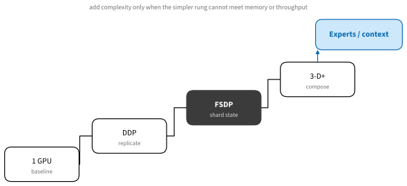
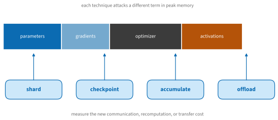

# Model Training
:label:`sec_training_systems`

Throughout this book we trained on a single device, occasionally two. Real
budgets are larger: a LoRA fine-tune fits on one consumer GPU, a full
fine-tune of a 7B model wants a node of them, and pretraining anything
competitive occupies hundreds to hundreds of thousands of accelerators for
weeks. This section is a practical map of that territory: the parallelism
concepts you need in order to read any framework's documentation, the
actual libraries people use in 2026, and which tool fits which scale.
Distributed training is not a switch that makes a program faster — it
divides model state and work, adds communication, and changes failure
recovery — so the golden rule is to start from a measured single-GPU
baseline and add the *simplest* technique that removes a demonstrated
constraint.

## From One GPU to Many

### The Scaling Ladder


:label:`fig_tools_training_ladder`

1. **One accelerator** establishes the reference: loss curve, tokens or
   examples per second, peak memory, and a checkpoint you can trust.
1. **Data parallelism (DDP)** replicates the model on every GPU, feeds each
   a different slice of the batch, and averages gradients after every
   backward pass. It is the entry point whenever model, gradients, and
   optimizer state fit on one device.
1. **Fully sharded data parallelism (FSDP)** shards parameters, gradients,
   and optimizer state across GPUs and gathers each layer only while it is
   being used. Same idea as DeepSpeed's ZeRO stage 3; it buys roughly a
   world-size reduction in state memory at the price of all-gather traffic.
1. **Tensor, pipeline, context, and expert parallelism** split individual
   layers, layer groups, the sequence dimension, and mixture-of-experts
   experts, respectively. Large systems compose several of these because no
   single axis suffices at scale.

In PyTorch, the first two rungs are a launcher and a wrapper:

```bash
torchrun --standalone --nproc-per-node=4 train.py
```

Inside `train.py`, DDP wraps the model
(`DistributedDataParallel(model)`), while FSDP's current API applies
`fully_shard(model)` — the rewritten "FSDP2", which shards each parameter
as a `DTensor` and has displaced the original FSDP wrapper in PyTorch's
documentation and in downstream libraries. JAX expresses the same ideas
through sharded arrays and named meshes: `jax.jit` with sharding
specifications compiles the collectives for you, which is why the JAX code
in this book has barely mentioned devices at all.

One bookkeeping identity matters on every rung. The batch size that
optimization sees is

$$
B_{\textrm{global}} = B_{\textrm{device}} \cdot N_{\textrm{ranks}} \cdot N_{\textrm{accumulation}},
$$

so changing the number of GPUs without adjusting per-device batch size or
learning rate silently changes the optimization problem. Distributed
samplers must not duplicate examples, and evaluation must aggregate
metrics with the right denominators — the two classic sources of
"multi-GPU accuracy is different" bugs.

### Where the Memory Goes


:label:`fig_tools_training_memory`

Peak training memory is the sum of parameters, gradients, optimizer state,
activations, communication buffers, and allocator overhead — for a 7B-
parameter model trained in BF16 with Adam, roughly 14 + 14 + 56 GB of
state before a single activation is stored. The toy model below is crude
but sorts strategies correctly, and needs no GPU to run:

```{.python .input #training-systems-memory-model}
terms_gib = {"parameters": 14.0, "gradients": 14.0, "optimizer": 56.0,
             "activations": 18.0, "temporary": 5.0}

def per_device_gib(world_size=1, shard_state=False, ckpt_activations=False):
    divisor = world_size if shard_state else 1
    state = sum(terms_gib[k] / divisor
                for k in ("parameters", "gradients", "optimizer"))
    activations = terms_gib["activations"] * (0.35 if ckpt_activations else 1)
    return state + activations + terms_gib["temporary"]

for label, cfg in [("1 GPU, plain", (1, False, False)),
                   ("8 GPU DDP + ckpt", (8, False, True)),
                   ("8 GPU FSDP + ckpt", (8, True, True))]:
    print(f"{label:>20s}: {per_device_gib(*cfg):6.1f} GiB/device")
```

Plain training does not fit any single GPU; DDP does not help, because it
replicates state; FSDP brings the same model under 25 GiB per device. Each
standard memory technique attacks one term and charges a different price:
**mixed precision** (BF16 compute, FP8 on recent hardware) halves compute
bytes; **gradient accumulation** shrinks activation memory but not state;
**activation checkpointing** trades ~30% recomputation for most of the
activation term; **CPU/NVMe offload** (DeepSpeed's ZeRO-Offload and
descendants) trades transfer latency for capacity; **LoRA and QLoRA**
sidestep the problem by making the optimizer state tiny — which is why a
7B fine-tune fits on a 16 GB card. Combine techniques deliberately: four
individually sensible optimizations can interfere with compilation,
overlap, or numerics.

Two topology rules from the Hugging Face *Ultra-Scale Playbook* (a free,
experiment-backed guide distilled from 4,000+ runs on up to 512 GPUs, and
the best single thing to read after this section) compress a lot of
practice: keep tensor parallelism *inside* a node, where NVLink can carry
its dense traffic — letting TP cross nodes loses several times as much
throughput as letting pipeline parallelism cross — and map the
highest-volume collectives to the fastest links available.

## The Library Landscape

What should you actually type? As of mid-2026 the ecosystem has settled
into layers.

**PyTorch built-ins.** `torchrun` + DDP for replication; `fully_shard`
(FSDP2) for sharding; `DTensor` underneath as the common abstraction for
sharded tensors; tensor-, context-, and pipeline-parallel APIs exist but
are still marked experimental. These primitives are what most higher-level
tools now generate.

**Hugging Face stack.** `accelerate` launches the same script on DDP,
FSDP2, or DeepSpeed with a config file rather than code changes;
`transformers.Trainer` sits on top of it; `peft` implements LoRA/QLoRA;
and `trl` provides post-training — supervised fine-tuning, DPO, and the
GRPO family of reinforcement-learning trainers that took off when
DeepSeek-R1 showed pure RL could buy reasoning. For models up to roughly
30B parameters on a handful of nodes, this stack is the default answer.

**DeepSpeed.** ZeRO stages 1–3 (optimizer, gradient, parameter sharding)
plus CPU/NVMe offload. It pioneered the sharding ideas that FSDP absorbed
and remains actively maintained, but for new PyTorch projects it has
ceded the default slot to FSDP2; reach for it when you need its offload
machinery to squeeze a large model onto scarce memory, or because a tool
you use (notably several RLHF frameworks) builds on it.

**Megatron-Core and TorchTitan.** The serious pretraining tier. NVIDIA's
Megatron-Core implements tensor/pipeline/sequence/expert parallelism with
FP8 support and powers many industrial labs (and NVIDIA's own NeMo
framework and Nemotron models). TorchTitan is the PyTorch-native
equivalent: a clean reference stack composing FSDP, tensor, pipeline, and
context parallelism plus expert parallelism for MoE, demonstrated at
1,000-GPU scale on models from Llama 3 405B to DeepSeek-V3. Choose this
tier only when you are genuinely pretraining — the configuration surface
is proportional to its power.

**Fine-tuning frontends.** Unsloth owns the single-GPU niche with fused
kernels and quantized training (roughly 2× speed and large memory savings
for LoRA/QLoRA work). Axolotl drives full and parameter-efficient
fine-tunes across a node or several from one YAML file, with FSDP2 and
DeepSpeed backends. LLaMA-Factory covers a similar space with a GUI and
very broad model support. (Its former peer `torchtune` wound down in 2025
— check a library's pulse before adopting it; this landscape churns.)

**JAX.** MaxText is the reference for TPU (and GPU) pretraining and now
post-training; Levanter/Marin demonstrated fully reproducible open
pretraining. On TPUs the XLA compiler handles the parallelism that the
PyTorch world configures by hand — the trade is less knob-turning for
less low-level control.

**RL post-training at scale.** Beyond TRL's single-node comfort zone, veRL
is the most widely adopted open framework (FSDP or Megatron for training,
vLLM or SGLang for rollouts), with OpenRLHF as a leaner Ray+DeepSpeed
alternative. This corner moves fastest of all; expect its details to age
first.

### What to Use at Which Scale

:Training tools by scale (mid-2026)
:label:`tab_training_tools`

| Scale | Typical job | Reach for |
|---|---|---|
| 1 GPU, ≥ 8 GB | LoRA/QLoRA fine-tune ≤ 8B | Unsloth, or PEFT + Trainer |
| 1 node, 2–8 GPUs | full fine-tune ≤ 70B, DDP/FSDP2 | Accelerate or Axolotl |
| few nodes | large fine-tune, small pretrain | FSDP2 + torchrun, DeepSpeed |
| many nodes | serious pretraining, MoE | Megatron-Core, TorchTitan, MaxText |
| RL post-training | GRPO/DPO pipelines | TRL (small), veRL/OpenRLHF (large) |

The table is a starting point, not a verdict — but note its shape: you buy
generality with configuration burden as you move down, and most projects
live in the first two rows. If a workload fits a simpler row, use the
simpler row.

## Keeping a Long Run Alive

Everything above buys throughput; what turns throughput into results is
operational discipline, because at scale *something* fails every few
hours.

* **Checkpoint completely and atomically.** A resumable checkpoint holds
  model and optimizer state, the learning-rate schedule and step count,
  data-loader position, and RNG state. Write to a temporary path and
  rename on completion, so a crash mid-write cannot destroy the previous
  checkpoint; keep more than one until restore has been tested. Sharded
  (per-rank) checkpoints avoid gathering a model larger than any single
  host's memory.
* **Drill the recovery.** Kill the job deliberately, restore on fresh
  workers, and check that loss, step count, and data position continue as
  if nothing happened. Untested recovery is a rumor, and spot-priced
  training (:numref:`sec_cloud_instances`) is only cheap if recovery
  actually works.
* **Feed the accelerators.** Profile data loading separately from compute:
  storage reads, decoding and augmentation, tokenization, and host-to-
  device transfer. A starved GPU shows high nominal utilization and low
  throughput; adding more GPUs to a data-bound job makes it *worse*.
* **Watch convergence, not just speed.** Tokens per second without a loss
  curve rewards fast wrong runs. Log both, plus time spent in collectives
  and checkpoint duration; debug distributed failures by reproducing on
  one process, then one node, then many, with rank and host on every log
  line.

## Summary

* Scale in order — DDP while state fits, FSDP2/ZeRO when it does not,
  tensor/pipeline/expert parallelism only for genuine pretraining — from a
  measured single-GPU baseline.
* Peak memory is a sum of terms; each technique (sharding, checkpointing,
  accumulation, offload, LoRA) removes one term at a known price.
* In 2026 the default stacks are: Unsloth/PEFT on one GPU, Accelerate or
  Axolotl with FSDP2 on a node, Megatron-Core/TorchTitan/MaxText for
  pretraining, TRL then veRL for RL post-training.
* Keep tensor parallelism inside a node; map heavy collectives to fast
  links.
* Long runs survive on atomic checkpoints, tested recovery, a fed input
  pipeline, and convergence metrics — not on optimism.

## Exercises

1. Extend the memory model with a communication-buffer term and a LoRA
   configuration (frozen base weights, small trainable adapter). At what
   world size does FSDP stop paying for a 7B model?
1. For a fixed global batch of 4M tokens, enumerate three combinations of
   device batch, world size, and accumulation steps, and reason about
   their relative throughput and optimizer behavior.
1. Take a training notebook of roughly the scale of
   :numref:`sec_bert-pretraining` and run it once with
   `torchrun --nproc-per-node=2`. Measure the actual speedup over one GPU
   and explain the gap from 2×.
1. Design (on paper) the checkpoint contents and restore protocol for a
   sharded training job that must resume with a *different* number of
   workers. Which parts of the state are per-rank, and which are global?
