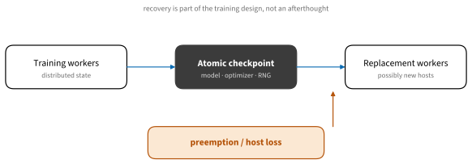

# Training Systems
:label:`sec_training_systems`

Distributed training is not a switch that makes a program faster. It divides
model state or work, introduces communication, and changes failure recovery.
Begin with a measured single-accelerator baseline. Add the simplest technique
that solves a demonstrated memory or throughput constraint.

## Parallelism and Memory

### The Scaling Ladder


:label:`fig_tools_training_ladder`

1. **One accelerator** gives the reference loss, numerical behavior, memory,
   tokens or examples per second, and checkpoint.
1. **Data parallelism** replicates the model, processes different minibatches,
   and reduces gradients. PyTorch DistributedDataParallel (DDP) and JAX data
   sharding are common entry points.
1. **Fully sharded data parallelism** divides parameters, gradients, and
   optimizer state, materializing what each computation needs. PyTorch FSDP2
   and JAX sharding APIs expose this more explicitly than a replicated model.
1. **Tensor, pipeline, context, and expert parallelism** divide computation
   along different axes. Large systems compose them because no single axis is
   sufficient.

More axes create more topology constraints, schedules, and failure modes. They
are justified by model scale, not by the prestige of a complex configuration.

### Account for Peak Memory


:label:`fig_tools_training_memory`

Peak training memory contains parameters, gradients, optimizer state,
activations, communication buffers, compiler workspaces, and allocator
fragmentation. The largest point may occur during optimizer update or
checkpoint save rather than forward propagation.

This NumPy model lets us compare strategies without requiring multiple GPUs.

```{.python .input #training-systems-memory-model}
import numpy as np

terms_gib = {
    "parameters": 14.0,
    "gradients": 14.0,
    "optimizer": 56.0,
    "activations": 18.0,
    "temporary": 5.0,
}

def estimated_per_device(world_size=1, shard_state=False,
                         checkpoint_activations=False):
    divisor = world_size if shard_state else 1
    state = sum(terms_gib[k] / divisor
                for k in ("parameters", "gradients", "optimizer"))
    activations = terms_gib["activations"] * (0.35 if checkpoint_activations else 1)
    return state + activations + terms_gib["temporary"]

for strategy in [(1, False, False), (8, False, True), (8, True, True)]:
    print(strategy, round(estimated_per_device(*strategy), 1), "GiB")
```

The constants are illustrative. Measure framework allocator peaks and validate
that checkpointing's recomputation or offload's transfer time is acceptable.

### Data Parallelism

DDP gives each rank one model replica and a shard of each global batch. After
backpropagation it averages gradients across ranks. Effective batch size is

$$
B_{\textrm{global}}=B_{\textrm{device}}N_{\textrm{ranks}}N_{\textrm{accumulation}}.
$$

Changing world size without adjusting this quantity can change optimization.
Distributed samplers must avoid unintended duplicate examples, and evaluation
must aggregate metrics with correct denominators.

A minimal PyTorch launch commonly starts with:

```bash
torchrun --standalone --nproc-per-node=4 train.py
```

The script initializes a process group, selects the local device, wraps the
model, and saves only from designated ranks. JAX represents device placement
through arrays and named meshes; `jax.jit` with sharding specifications can
compile the required communication. In both systems, inspect placement rather
than assuming a model uses every visible accelerator.

### Sharded and Composed Parallelism

FSDP reduces replicated state but adds all-gather and reduce-scatter traffic.
Wrapping or sharding policy affects peak materialization and overlap. Save a
distributed checkpoint that can be restored without gathering a model larger
than one host's memory.

Tensor parallelism divides matrix operations and communicates within layers.
Pipeline parallelism places layer groups on stages and schedules microbatches,
trading bubbles against memory. Context or sequence parallelism divides long
sequence work. Expert parallelism routes tokens among sparse experts and is
sensitive to load imbalance and all-to-all communication.

Map frequent, high-volume collectives to the fastest links. Device count alone
does not describe topology: intra-node NVLink or fabric, PCIe, and inter-node
network links have different bandwidth and latency.

## Building a Training Run

### Precision and Memory Techniques

* **Mixed precision** stores or computes selected values in FP16, BF16, FP8, or
  lower formats while retaining sufficient accumulation and sensitive state.
  Verify loss scaling and numerical stability.
* **Gradient accumulation** reduces per-step activation memory but does not
  shrink model state. It changes optimizer-step frequency relative to examples.
* **Activation checkpointing** discards selected activations and recomputes
  them during backpropagation.
* **CPU or NVMe offload** exchanges accelerator memory for transfer latency and
  host capacity.
* **Quantized optimizer or model state** saves bytes with algorithmic and
  implementation constraints.

Combine techniques deliberately. Four individually sensible optimizations can
interfere with compilation, overlap, or numerical behavior.

### Launchers and Frameworks

Framework-native tools should be the baseline. Higher-level systems solve
different problems:

* Hugging Face **Accelerate**, PyTorch Lightning/Fabric, and **DeepSpeed** offer
  launch and strategy abstractions.
* **Ray Train** coordinates distributed workers in a larger cluster scheduler.
* **Megatron-Core**, NVIDIA NeMo, and Nanotron provide large-model parallelism
  patterns and optimized training components.

Choose by the needed parallel axes, checkpoint format, observability,
framework compatibility, and ability to escape the abstraction when debugging.
Do not add an orchestrator merely to launch four stable local processes.

### Keep the Input Pipeline Fed

Profile host preprocessing, storage reads, tokenization, collation, transfer,
and accelerator computation separately. Use bounded prefetching; an unlimited
queue converts a throughput problem into a memory problem. Shard data
deterministically across ranks and workers, and define behavior when a worker
count changes after recovery.

Useful rates include examples or tokens per second, accelerator utilization,
model FLOP utilization where meaningful, time spent in collectives, data wait,
and checkpoint duration. Throughput without validation loss or convergence can
reward a fast incorrect run.

## Recovery and Reproducibility

### Checkpointing and Preemption


:label:`fig_tools_checkpoint_recovery`

A complete training checkpoint may include model and optimizer state, learning
rate schedule, gradient scaler, step and data position, random-number state,
and distributed metadata. Write to a temporary location and publish atomically
when complete. Keep more than the latest checkpoint until restore is tested.

Run a recovery drill: interrupt workers, create replacements, restore, and
compare the next steps with an uninterrupted control. Exact bitwise equality
may be unrealistic for some distributed kernels, but loss, samples consumed,
and schedule position must behave as designed.

### Reproducibility and Debugging

Record source, configuration, environment or container digest, data revision,
topology, seed policy, and collective settings. First reproduce on one process,
then one node, then multiple nodes. Distributed logs need rank, host, and time;
otherwise four interleaved stack traces conceal the first failure.

Use tiny synthetic data to test process startup and collectives. Then run one
real batch, a checkpoint round trip, and only then a long job. Timeouts should
fail with diagnostics rather than leave expensive workers idle indefinitely.

## Summary

* Scale from a measured one-accelerator reference.
* DDP replicates state; FSDP and other axes shard selected work and state.
* Each memory technique reduces a particular term and adds a particular cost.
* Topology, input feeding, convergence, and checkpoint recovery determine useful
  throughput.
* Test failure recovery before relying on interruptible or multi-node training.

## Exercises

1. Extend the memory model with communication buffers and allocator margin.
   Identify which estimates can be measured automatically.
1. For a global batch target, enumerate three combinations of device batch,
   world size, and accumulation. Explain their throughput differences.
1. Specify the contents and atomic publication protocol for a sharded
   checkpoint that can resume with a different number of workers.
