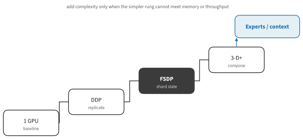
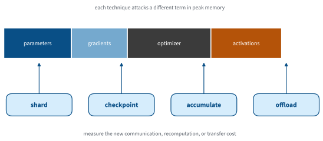

# Distributed Model Training
:label:`sec_training_systems`

Most examples in this book train on one device. Larger workloads may require
several devices because model state does not fit on one accelerator or
because a single-device run would take too long. This section introduces the
main forms of parallelism, the software layers available in mid-2026, and the
scale at which each becomes relevant. Distributed training partitions or
replicates state and work, adds communication, and complicates recovery.
Begin with a measured single-device baseline, then add the simplest technique
that removes an observed memory or throughput constraint.

## From One GPU to Many

### The Scaling Ladder


:label:`fig_tools_training_ladder`

1. **One accelerator** establishes the reference: loss curve, tokens or
   examples per second, peak memory, and a checkpoint you can trust.
1. **Data parallelism (DDP)** replicates the model on every GPU, feeds each
   a different slice of the batch, and averages gradients after every
   backward pass. It is the entry point whenever model, gradients, and
   optimizer state fit on one device.
1. **Fully sharded data parallelism (FSDP)** shards parameters, gradients,
   and optimizer state across GPUs and gathers each layer only while it is
   being used. It is related to DeepSpeed's ZeRO stage 3 and can reduce per-device state
   memory approximately in proportion to world size, while adding all-gather
   traffic.
1. **Tensor, pipeline, context, and expert parallelism** split individual
   layers, layer groups, the sequence dimension, and mixture-of-experts
   experts, respectively. Large systems compose several of these because no
   single axis suffices at scale.

In PyTorch, the first two rungs are a launcher and a wrapper:

```bash
torchrun --standalone --nproc-per-node=4 train.py
```

Inside `train.py`, DDP wraps the model
(`DistributedDataParallel(model)`), while FSDP's current API applies
`fully_shard(model)` — the rewritten "FSDP2", which shards each parameter
as a `DTensor` and has displaced the original FSDP wrapper in PyTorch's
documentation and in downstream libraries. JAX expresses the same ideas
through sharded arrays and named meshes: `jax.jit` with sharding
specifications compiles the collectives for you, which is why the JAX code
in this book has barely mentioned devices at all.

One bookkeeping identity matters on every rung. The batch size that
optimization sees is

$$
B_{\textrm{global}} = B_{\textrm{device}} \cdot N_{\textrm{ranks}} \cdot N_{\textrm{accumulation}},
$$

so changing the number of GPUs without adjusting per-device batch size or
learning rate silently changes the optimization problem. Distributed
samplers must not duplicate examples, and evaluation must aggregate
metrics with the right denominators — the two classic sources of
"multi-GPU accuracy is different" bugs.

### Where the Memory Goes


:label:`fig_tools_training_memory`

Peak training memory is the sum of parameters, gradients, optimizer state,
activations, communication buffers, and allocator overhead — for a 7B-
parameter model trained in BF16 with Adam, roughly 14 + 14 + 56 GB of
state before a single activation is stored. The toy model below is crude
but sorts strategies correctly, and needs no GPU to run:

```{.python .input #training-systems-memory-model}
terms_gib = {"parameters": 14.0, "gradients": 14.0, "optimizer": 56.0,
             "activations": 18.0, "temporary": 5.0}

def per_device_gib(world_size=1, shard_state=False, ckpt_activations=False):
    divisor = world_size if shard_state else 1
    state = sum(terms_gib[k] / divisor
                for k in ("parameters", "gradients", "optimizer"))
    activations = terms_gib["activations"] * (0.35 if ckpt_activations else 1)
    return state + activations + terms_gib["temporary"]

for label, cfg in [("1 GPU, plain", (1, False, False)),
                   ("8 GPU DDP + ckpt", (8, False, True)),
                   ("8 GPU FSDP + ckpt", (8, True, True))]:
    print(f"{label:>20s}: {per_device_gib(*cfg):6.1f} GiB/device")
```

Plain training does not fit any single GPU; DDP does not help, because it
replicates state; FSDP brings the same model under 25 GiB per device. Each
standard memory technique changes a different term and introduces a
different cost. **Mixed precision** reduces the bytes used by selected tensors
and operations. **Gradient accumulation** permits a smaller per-step
microbatch while preserving a larger effective batch, reducing activation
memory but not model state. **Activation checkpointing** recomputes selected
activations during backpropagation; its memory savings and compute overhead
depend on the partition. **CPU/NVMe offload** (including DeepSpeed's
ZeRO-Offload) exchanges transfer latency for device capacity. **LoRA and
QLoRA** reduce trainable parameters and optimizer state; with compatible
quantization and sequence settings, a 7B fine-tune can fit on a 16 GB card.
Combine techniques deliberately: four
individually sensible optimizations can interfere with compilation,
overlap, or numerics.

Two topology guidelines from the Hugging Face *Ultra-Scale Playbook*, based
on more than 4,000 runs on up to 512 GPUs, summarize its measurements: keep
tensor parallelism *inside* a node, where NVLink can carry
its dense traffic — letting TP cross nodes loses several times as much
throughput as letting pipeline parallelism cross — and map the
highest-volume collectives to the fastest links available.

## The Library Landscape

As of mid-2026, the software ecosystem can be organized into several
layers. These assignments are dated because APIs and project activity change
quickly.

**PyTorch built-ins.** `torchrun` + DDP for replication; `fully_shard`
(FSDP2) for sharding; `DTensor` underneath as the common abstraction for
sharded tensors; tensor-, context-, and pipeline-parallel APIs exist but
are still marked experimental. These primitives are what most higher-level
tools now generate.

**Hugging Face stack.** `accelerate` launches the same script on DDP,
FSDP2, or DeepSpeed with a config file rather than code changes;
`transformers.Trainer` sits on top of it; `peft` implements LoRA/QLoRA;
and `trl` provides supervised fine-tuning, DPO, and GRPO-family
reinforcement-learning trainers. DeepSeek-R1-Zero demonstrated that
reinforcement learning alone could elicit some reasoning behaviors, while
the released DeepSeek-R1 training pipeline also included supervised stages.
This stack supports many fine-tuning jobs on one node or a small cluster.

**DeepSpeed.** ZeRO stages 1–3 (optimizer, gradient, parameter sharding)
plus CPU/NVMe offload. It introduced sharding techniques related to those in FSDP and remains
maintained. FSDP2 provides a native PyTorch alternative. DeepSpeed remains
relevant when CPU or NVMe offload is required, or when another framework
depends on it.

**Megatron-Core and TorchTitan.** Frameworks for large-scale pretraining. NVIDIA's
Megatron-Core implements tensor/pipeline/sequence/expert parallelism with
FP8 support and powers many industrial labs (and NVIDIA's own NeMo
framework and Nemotron models). TorchTitan is the PyTorch-native
equivalent: a clean reference stack composing FSDP, tensor, pipeline, and
context parallelism plus expert parallelism for MoE, demonstrated at
1,000-GPU scale on models from Llama 3 405B to DeepSeek-V3. These systems
expose many configuration choices and are most appropriate when
model scale requires several forms of parallelism.

**Fine-tuning frontends.** Unsloth targets single-GPU LoRA and QLoRA with
fused kernels and quantized training; its speed and memory gains depend on
model, sequence length, and hardware. Axolotl drives full and parameter-efficient
fine-tunes across a node or several from one YAML file, with FSDP2 and
DeepSpeed backends. LLaMA-Factory covers a similar space with a GUI and
very broad model support. (Its former peer `torchtune` wound down in 2025
— check a library's pulse before adopting it; this landscape churns.)

**JAX.** MaxText is the reference for TPU (and GPU) pretraining and now
post-training; Levanter/Marin demonstrated fully reproducible open
pretraining. On TPUs, XLA compiles array-sharding specifications into communication
operations. This moves some parallelism decisions from framework wrappers
into array layouts and compiler configuration.

**RL post-training at scale.** veRL combines FSDP or Megatron training with
vLLM or SGLang rollouts; OpenRLHF provides a Ray and DeepSpeed alternative.
Project adoption and APIs in this area change rapidly, so verify current
documentation before selecting a stack.

### What to Use at Which Scale

:Training tools by scale (mid-2026)
:label:`tab_training_tools`

| Scale | Typical job | Reach for |
|---|---|---|
| 1 GPU, ≥ 8 GB | LoRA/QLoRA fine-tune ≤ 8B | Unsloth, or PEFT + Trainer |
| 1 node, 2–8 GPUs | full fine-tune ≤ 70B, DDP/FSDP2 | Accelerate or Axolotl |
| few nodes | large fine-tune, small pretrain | FSDP2 + torchrun, DeepSpeed |
| many nodes | serious pretraining, MoE | Megatron-Core, TorchTitan, MaxText |
| RL post-training | GRPO/DPO pipelines | TRL (small), veRL/OpenRLHF (large) |

The table is a starting point rather than a prescription. Tools lower in the
table support more forms of parallelism but require more configuration. Use
the least complex row that satisfies the measured constraints.

## Keeping a Long Run Alive

Throughput alone does not complete a long run. As worker count and duration
increase, hardware, network, and software failures become more likely, so
recovery must be designed and tested.

* **Checkpoint completely and atomically.** A resumable checkpoint holds
  model and optimizer state, the learning-rate schedule and step count,
  data-loader position, and RNG state. Write to a temporary path and
  rename on completion, so a crash mid-write cannot destroy the previous
  checkpoint; keep more than one until restore has been tested. Sharded
  (per-rank) checkpoints avoid gathering a model larger than any single
  host's memory.
* **Drill the recovery.** Kill the job deliberately, restore on fresh
  workers, and check that loss, step count, and data position continue as
  if nothing happened. Test recovery before relying on spot-priced training
  (:numref:`sec_cloud_instances`), whose savings depend on successful
  resumption after interruption.
* **Feed the accelerators.** Profile data loading separately from compute:
  storage reads, decoding and augmentation, tokenization, and host-to-
  device transfer. A starved GPU spends time waiting for input and delivers low throughput;
  adding more GPUs can increase contention without improving a data-bound
  job.
* **Watch convergence, not just speed.** Tokens per second without a loss
  curve rewards fast wrong runs. Log both, plus time spent in collectives
  and checkpoint duration; debug distributed failures by reproducing on
  one process, then one node, then many, with rank and host on every log
  line.

## Summary

* Scale in order — DDP while state fits, FSDP2/ZeRO when it does not,
  tensor, pipeline, or expert parallelism only when model scale requires it — from a
  measured single-GPU baseline.
* Peak memory is a sum of terms; each technique (sharding, checkpointing,
  accumulation, offload, LoRA) removes one term at a known price.
* The mid-2026 examples are Unsloth or PEFT on one GPU, Accelerate or Axolotl
  with FSDP2 on a node, Megatron-Core, TorchTitan, or MaxText for pretraining,
  and TRL or veRL for RL post-training; verify current project status.
* Keep tensor parallelism inside a node; map heavy collectives to fast
  links.
* Long runs survive on atomic checkpoints, tested recovery, a fed input
  pipeline, and convergence metrics — and explicit convergence monitoring.

## Exercises

1. Extend the memory model with a communication-buffer term and a LoRA
   configuration (frozen base weights, small trainable adapter). At what
   world size does FSDP stop paying for a 7B model?
1. For a fixed global batch of 4M tokens, enumerate three combinations of
   device batch, world size, and accumulation steps, and reason about
   their relative throughput and optimizer behavior.
1. Take a training notebook of roughly the scale of
   :numref:`sec_bert-pretraining` and run it once with
   `torchrun --nproc-per-node=2`. Measure the actual speedup over one GPU
   and explain the gap from 2×.
1. Design (on paper) the checkpoint contents and restore protocol for a
   sharded training job that must resume with a *different* number of
   workers. Which parts of the state are per-rank, and which are global?
