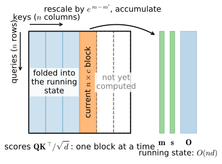

# The Cost of Attention
:label:`sec_attention-at-scale`

Attention earned its place in this chapter by connecting everything to
everything: every query scores every key, so information travels between any
two positions in a single step. This section is about the bill for that
convenience. The score matrix has $n^2$ entries for a sequence of $n$ tokens,
and both the arithmetic and the memory of an attention layer grow
quadratically while every other part of the network grows linearly. At the
context lengths of modern language models—hundreds of thousands of
tokens—the quadratic term is not a constant-factor nuisance; it decides what
is feasible.

We first place self-attention next to the convolutional and recurrent layers
of earlier chapters and make the comparison quantitative, then verify the
quadratic cost of one attention layer against the actual allocator of a GPU.
The rest of the section develops the three ways out that survived a decade
of research. Exact attention can be computed *without ever holding the
$n \times n$ matrix*, a trick of bookkeeping that underlies FlashAttention
and the fused kernels that frameworks now ship. Attention can be
*restricted* to a sliding window, betting on depth to restore long-range
communication. Or the softmax can be dropped altogether, which turns
attention into—of all things—a recurrent network, and builds the bridge to
the state space models of :numref:`sec_ssm`.

```{.python .input #attention-at-scale-the-cost-of-attention}
%%tab pytorch
%matplotlib inline
from d2l import torch as d2l
import math
import time
import torch
from torch.nn import functional as F
from torch.nn.attention import SDPBackend, sdpa_kernel
```

```{.python .input #attention-at-scale-the-cost-of-attention}
%%tab jax
%matplotlib inline
from d2l import jax as d2l
import jax
from jax import numpy as jnp
import math
import time
```

## CNNs, RNNs, and Self-Attention

Before counting FLOPs in earnest, it is worth seeing why attention is worth
paying for. Consider the standing problem of this part of the book: map a
sequence of $n$ tokens, each a $d$-dimensional vector, to another sequence
of the same shape. Three architectures we now know can do it: a
one-dimensional CNN (:numref:`chap_cnn`), an RNN (:numref:`sec_rnn`), and
self-attention (:numref:`sec_multihead-attention`).
:numref:`fig_cnn-rnn-self-attention` draws all three as graphs over the
sequence. Two properties of these graphs matter beyond raw arithmetic. The
number of *sequential* operations bounds how much of the work can run in
parallel on modern hardware. And the *maximum path length*—how many layers
information must traverse to travel between two arbitrary positions—governs
how easily long-range dependencies can be learned; long multiplicative
chains between distant positions are precisely the gradient pathology of
:cite:`Hochreiter.Bengio.Frasconi.ea.2001`.


:label:`fig_cnn-rnn-self-attention`

A convolutional layer with kernel size $k$ and $d$ channels in and out costs
$\mathcal{O}(knd^2)$ operations: each of the $n$ positions mixes $k$
neighbors through a $d \times d$ map. All positions are computed at once, so
there are $\mathcal{O}(1)$ sequential steps, but the receptive field grows
by only $k-1$ positions per layer: connecting a pair of tokens $n$ apart
takes a stack of depth $\mathcal{O}(n/k)$. An RNN pays
$\mathcal{O}(nd^2)$ for the sequence—one $d \times d$ state update per
token—but the updates are inherently ordered: $\mathcal{O}(n)$ sequential
steps, and a signal from the first token reaches the last only through
$\mathcal{O}(n)$ applications of the cell. Self-attention computes an
$n \times d$ by $d \times n$ product and then an $n \times n$ by
$n \times d$ product, $\mathcal{O}(n^2 d)$ in total; everything is one
batch of matrix multiplications, $\mathcal{O}(1)$ sequential steps, and any
token attends to any other directly, path length $\mathcal{O}(1)$.
:numref:`tab_cnn-rnn-attn` collects the accounting.

:Per-layer cost of mapping $n$ tokens of dimension $d$ to $n$ tokens of dimension $d$.
:label:`tab_cnn-rnn-attn`

| layer type | complexity | sequential operations | maximum path length |
|:--|:--|:--|:--|
| convolution (kernel $k$) | $\mathcal{O}(knd^2)$ | $\mathcal{O}(1)$ | $\mathcal{O}(n/k)$ |
| recurrence | $\mathcal{O}(nd^2)$ | $\mathcal{O}(n)$ | $\mathcal{O}(n)$ |
| self-attention | $\mathcal{O}(n^2 d)$ (mixing only) | $\mathcal{O}(1)$ | $\mathcal{O}(1)$ |

Read as a bargain, the table says: self-attention buys full parallelism
*and* constant path length, and the price is the only entry in the table
that is quadratic in $n$. Two of these rows fold a per-token $d \times d$
channel map into the figure shown — a convolution or a recurrence has no
separate projection step — while the self-attention row counts the *mixing*
only; the surrounding query/key/value/output projections add a further
$\mathcal{O}(nd^2)$, linear in $n$ like the others' work and accounted for at
the crossover below. For short sequences the bargain is excellent—with
$n$ in the hundreds and $d$ comparable, $n^2 d$ and $nd^2$ are the same
size—which is the regime in which the Transformer conquered machine
translation. The regime of a million-token context is another matter, and
the rest of this section is about living with, or getting rid of, the
$n^2$.

## The Quadratic Bill

### Counting FLOPs

Let's replace the $\mathcal{O}$ by numbers we can check. One attention layer
receives $n$ queries, keys, and values of dimension $d$ and computes
:eqref:`eq_softmax_QK_V`: the score matrix $\mathbf{Q}\mathbf{K}^\top$
costs $2n^2 d$ floating-point operations (each of the $n^2$ entries is a
length-$d$ dot product, counting one multiply–add as two FLOPs), the softmax
a few operations per entry, $\mathcal{O}(n^2)$, and the value mixing
$\mathrm{softmax}(\cdot)\mathbf{V}$ another $2n^2 d$. In total

$$
\underbrace{4 n^2 d}_{\textrm{scores and mixing}} + \; \mathcal{O}(n^2)
\quad \textrm{FLOPs}.
$$
:eqlabel:`eq_attn-layer-flops`

Recall from :eqref:`eq_multihead-flops` that the projections wrapped around
attention in a multi-head layer cost $8nd^2$—linear in $n$—and that the head
count drops out of both terms. Setting $4n^2d = 8nd^2$ locates the
crossover: the quadratic part dominates the layer as soon as $n > 2d$.
Working the ratio for a production-sized configuration, $d = 4096$ and
$n = 131{,}072$ give $n/2d = 16$: an attention layer at that context does
sixteen times as much score-and-mix work as projection work, and the
longest-context configurations sit one to two orders of magnitude past the
crossover.

### Counting Memory

Arithmetic is only half the bill, and at inference time it is the less
important half. The layer *materializes* the score matrix and its softmax:
two $n \times n$ buffers of activations, $8n^2$ bytes in single precision,
per head and per sequence in the batch; during training the attention
weights are also saved for the backward pass. The projections, by contrast,
keep only $\mathcal{O}(nd)$ activations. To feel the asymmetry: at
$n = 8192$ and a head dimension of $d_h = 64$ — the setting of the
experiments below — the inputs $\mathbf{Q}, \mathbf{K}, \mathbf{V}$
occupy 6 MB together, while the two score buffers occupy 512 MB. At a
context of $n = 131{,}072$ tokens a *single* attention map in fp32 would be
$n^2 \times 4$ bytes $\approx 69$ GB (per head, per sequence), which is why
no system at that scale ever stores one.

:begin_tab:`pytorch`
PyTorch's caching allocator reports exactly what a computation allocated, so
we can hold the formula against reality. `reset_peak_memory_stats` clears
the high-water mark and `max_memory_allocated` reads it back; we measure the
`d2l.DotProductAttention` layer from
:numref:`sec_attention-scoring-functions` on a single head. The prediction
is the two $n \times n$ float buffers, $8n^2$ bytes.
:end_tab:

:begin_tab:`jax`
Measuring per-op memory at runtime is awkward in JAX, for two reasons. XLA
*preallocates* a large fraction of GPU memory as an arena at startup (this
book's runs cap it at 40%), so device-side counters describe the arena, not
the op. More fundamentally, the compiler fuses and rematerializes freely,
so *what gets materialized at all is a compilation decision*, not a
property of your Python code. The authoritative answer therefore comes from
the compiler itself: lowering a jitted function and compiling it yields a
`memory_analysis()` report of exactly how much temporary buffer space the
executable reserves. We compare it against the two $n \times n$ float
buffers, $8n^2$ bytes.
:end_tab:

```{.python .input #attention-at-scale-counting-memory-1}
%%tab pytorch
attention = d2l.DotProductAttention(dropout=0).to(d2l.try_gpu())
attention.eval()

def peak_memory(f, *args):
    """Extra peak memory allocated by f, in bytes."""
    torch.cuda.synchronize()
    torch.cuda.reset_peak_memory_stats()
    base = torch.cuda.memory_allocated()
    f(*args)
    torch.cuda.synchronize()
    return torch.cuda.max_memory_allocated() - base

d_h = 64
for n in [2048, 4096, 8192, 16384]:
    Q = torch.randn(1, n, d_h, device=d2l.try_gpu())
    with torch.no_grad():
        measured = peak_memory(attention, Q, Q, Q)
    print(f'n = {n:5d}: measured {measured/2**20:7.1f} MiB, '
          f'predicted 8n^2 B = {8*n*n/2**20:7.1f} MiB')
```

```{.python .input #attention-at-scale-counting-memory-1}
%%tab jax
def attention_layer(Q, K, V):
    scores = Q @ K.T / math.sqrt(Q.shape[-1])
    return jax.nn.softmax(scores, axis=-1) @ V

d_h = 64
for n in [2048, 4096, 8192, 16384]:
    Q = jax.random.normal(jax.random.key(0), (n, d_h))
    stats = jax.jit(attention_layer).lower(Q, Q, Q).compile()
    temp = stats.memory_analysis().temp_size_in_bytes
    print(f'n = {n:5d}: XLA temp {temp/2**20:7.1f} MiB, '
          f'predicted 8n^2 B = {8*n*n/2**20:7.1f} MiB')
```

The formula matches the measurement exactly from $n = 4096$ up — and the
XLA compiler's report matches it at every size — while the allocator's
smallest run ($n = 2048$) shows a few MiB of workspace overhead on top of
the two score buffers. Doubling $n$ quadruples the footprint, and at
$n = 16{,}384$ a single fp32 head already needs 2 GB of scratch. Time tells
the same story. We time the forward pass as $n$ doubles (after a warm-up
call, and synchronizing before reading the clock—on an accelerator, kernel
launches return before the work is done):

```{.python .input #attention-at-scale-counting-memory-2}
%%tab pytorch
def wall_clock(f, *args, reps=10):
    f(*args)  # Warm up
    torch.cuda.synchronize()
    start = time.time()
    for _ in range(reps):
        f(*args)
    torch.cuda.synchronize()
    return (time.time() - start) / reps

for n in [2048, 4096, 8192, 16384]:
    Q = torch.randn(1, n, d_h, device=d2l.try_gpu())
    with torch.no_grad():
        t = wall_clock(attention, Q, Q, Q)
    print(f'n = {n:5d}: {t*1e3:6.2f} ms')
```

```{.python .input #attention-at-scale-counting-memory-2}
%%tab jax
def wall_clock(f, *args, reps=10):
    f(*args).block_until_ready()  # Warm up (and compile)
    start = time.time()
    for _ in range(reps):
        f(*args).block_until_ready()
    return (time.time() - start) / reps

layer = jax.jit(attention_layer)
for n in [2048, 4096, 8192, 16384]:
    Q = jax.random.normal(jax.random.key(0), (n, d_h))
    print(f'n = {n:5d}: {wall_clock(layer, Q, Q, Q)*1e3:6.2f} ms')
```

At small $n$ the timings barely move—the GPU is not yet saturated and we are
measuring launch overhead—but from a few thousand tokens on, each doubling
of $n$ roughly quadruples the time, as $4n^2d$ arithmetic says it must.
(Accounting at the level of a whole *model*, where FLOPs per token buy
parameters and data, is the subject of the scaling-laws discussion in the
next chapter; here we stay inside one layer.)

## Exact Attention Without the Matrix

### Softmax, One Block at a Time

Here is the surprising fact: the $n \times n$ matrix whose cost we just
measured never needs to exist. The obstacle to computing attention piecewise
seems to be the softmax, since each weight
$\exp(a_j)/\sum_{j'}\exp(a_{j'})$ depends on *all* scores of its row
through the normalizer—and, for numerical safety, through the row maximum
subtracted before exponentiation. But both the maximum and the normalizer
can be maintained *online*, the way one computes a running mean
:cite:`Milakov.Gimelshein.2018`. Process the keys in blocks and keep, per
query, three running statistics: the maximum $m$ seen so far, the sum $s$ of
exponentials rescaled to that maximum, and the output accumulator
$\mathbf{o}$. A new block of scores $\{a_j\}$ with values
$\{\mathbf{v}_j\}$ updates them as

$$
m' = \max\big(m, \max_j a_j\big), \qquad
s' = s\, e^{m - m'} + \sum\nolimits_j e^{a_j - m'}, \qquad
\mathbf{o}' = \mathbf{o}\, e^{m - m'} + \sum\nolimits_j e^{a_j - m'}\, \mathbf{v}_j,
$$
:eqlabel:`eq_online-softmax`

and after the last block, $\mathbf{o}/s$ is *exactly*
$\mathrm{softmax}(\mathbf{a})\mathbf{V}$: whenever a new block raises the
maximum, the factor $e^{m - m'}$ retroactively rescales everything
accumulated under the old one. No approximation is made at any step.
:numref:`fig_online-softmax` shows the resulting schedule: one
$n \times c$ stripe of the score matrix in memory at a time, against a
running state of size $\mathcal{O}(nd)$
:cite:`Rabe.Staats.2021`.


:label:`fig_online-softmax`

### A Chunked Implementation

From here on we work in the causal setting of a language model, masking with
the dtype-safe idiom of :numref:`sec_attention-scoring-functions`. First the
naive reference, then the chunked version—about twenty lines that carry
:eqref:`eq_online-softmax` over all queries at once, one key block per
iteration.

```{.python .input #attention-at-scale-a-chunked-implementation-1}
%%tab pytorch
def causal_attention(Q, K, V):
    """Reference: causal attention with the full score matrix."""
    d = Q.shape[-1]
    i = torch.arange(Q.shape[0], device=Q.device)
    scores = Q @ K.T / math.sqrt(d)
    scores.masked_fill_(i[None, :] > i[:, None], torch.finfo(Q.dtype).min)
    return torch.softmax(scores, dim=-1) @ V

def chunked_attention(Q, K, V, chunk_size=512):
    """Exact causal attention, one n-by-chunk_size block at a time."""
    d, n = Q.shape[-1], Q.shape[0]
    m = torch.full((n, 1), torch.finfo(Q.dtype).min, device=Q.device)
    s = torch.zeros(n, 1, device=Q.device)
    O = torch.zeros(n, V.shape[-1], device=Q.device)
    pos_q = torch.arange(n, device=Q.device)[:, None]
    for start in range(0, n, chunk_size):
        Kc, Vc = K[start:start + chunk_size], V[start:start + chunk_size]
        pos_k = torch.arange(start, start + Kc.shape[0], device=Q.device)
        scores = Q @ Kc.T / math.sqrt(d)
        scores.masked_fill_(pos_k[None, :] > pos_q, torch.finfo(Q.dtype).min)
        m_new = torch.maximum(m, scores.max(dim=-1, keepdim=True).values)
        scale = torch.exp(m - m_new)                  # Rescale the past
        P = torch.exp(scores - m_new)
        s = s * scale + P.sum(dim=-1, keepdim=True)
        O = O * scale + P @ Vc
        m = m_new
    return O / s
```

```{.python .input #attention-at-scale-a-chunked-implementation-1}
%%tab jax
def causal_attention(Q, K, V):
    """Reference: causal attention with the full score matrix."""
    d = Q.shape[-1]
    i = jnp.arange(Q.shape[0])
    scores = Q @ K.T / math.sqrt(d)
    scores = jnp.where(i[None, :] > i[:, None],
                       jnp.finfo(scores.dtype).min, scores)
    return jax.nn.softmax(scores, axis=-1) @ V

def chunked_attention(Q, K, V, chunk_size=512):
    """Exact causal attention, one n-by-chunk_size block at a time."""
    d, n = Q.shape[-1], Q.shape[0]
    pos_q = jnp.arange(n)[:, None]
    def block(carry, chunk):
        m, s, O, start = carry
        Kc, Vc = chunk
        pos_k = start + jnp.arange(Kc.shape[0])
        scores = Q @ Kc.T / math.sqrt(d)
        scores = jnp.where(pos_k[None, :] > pos_q,
                           jnp.finfo(scores.dtype).min, scores)
        m_new = jnp.maximum(m, scores.max(axis=-1, keepdims=True))
        scale = jnp.exp(m - m_new)                    # Rescale the past
        P = jnp.exp(scores - m_new)
        s = s * scale + P.sum(axis=-1, keepdims=True)
        O = O * scale + P @ Vc
        return (m_new, s, O, start + Kc.shape[0]), None
    init = (jnp.full((n, 1), jnp.finfo(Q.dtype).min), jnp.zeros((n, 1)),
            jnp.zeros((n, V.shape[-1])), 0)
    # The scan needs equal-sized blocks (the PyTorch loop handles a tail)
    assert n % chunk_size == 0, 'n must be a multiple of chunk_size'
    chunks = (K.reshape(-1, chunk_size, d),
              V.reshape(-1, chunk_size, V.shape[-1]))
    (m, s, O, _), _ = jax.lax.scan(block, init, chunks)
    return O / s
```

Exactness is the entire point, so we check it. (In JAX we pin matrix
multiplications to full fp32 for the comparison; by default they run in
TF32 on this hardware, which perturbs the two computations differently at
the $10^{-4}$ level.)

```{.python .input #attention-at-scale-a-chunked-implementation-2}
%%tab pytorch
torch.manual_seed(0)
n, d_h = 2048, 64
Q, K, V = (torch.randn(n, d_h, device=d2l.try_gpu()) for _ in range(3))
err = (chunked_attention(Q, K, V) - causal_attention(Q, K, V)).abs().max()
print(f'maximum deviation: {float(err):.2e}')
```

```{.python .input #attention-at-scale-a-chunked-implementation-2}
%%tab jax
n, d_h = 2048, 64
Q, K, V = (jax.random.normal(k, (n, d_h))
           for k in jax.random.split(jax.random.key(0), 3))
with jax.default_matmul_precision('highest'):
    err = jnp.abs(chunked_attention(Q, K, V)
                  - causal_attention(Q, K, V)).max()
print(f'maximum deviation: {float(err):.2e}')
```

The two computations agree to floating-point rounding, around $10^{-7}$ in
fp32—this is the same answer, not an approximation of it. Now the payoff.
The chunked version touches $n \times c$ scores at a time instead of
$n \times n$, so its footprint should grow linearly in $n$ rather than
quadratically:

```{.python .input #attention-at-scale-a-chunked-implementation-3}
%%tab pytorch
lengths, mems = [2048, 4096, 8192, 16384], [[], []]
for n in lengths:
    Q = torch.randn(n, d_h, device=d2l.try_gpu())
    mems[0].append(peak_memory(causal_attention, Q, Q, Q) / 2**20)
    mems[1].append(peak_memory(chunked_attention, Q, Q, Q) / 2**20)
d2l.plot(lengths, mems, 'sequence length n', 'peak memory (MiB)',
         legend=['full matrix', 'chunked'], xscale='log', yscale='log')
```

```{.python .input #attention-at-scale-a-chunked-implementation-3}
%%tab jax
lengths, mems = [2048, 4096, 8192, 16384], [[], []]
for n in lengths:
    Q = jax.random.normal(jax.random.key(0), (n, d_h))
    for i, f in enumerate([causal_attention, chunked_attention]):
        stats = jax.jit(f).lower(Q, Q, Q).compile()
        mems[i].append(stats.memory_analysis().temp_size_in_bytes / 2**20)
d2l.plot(lengths, mems, 'sequence length n', 'XLA temp memory (MiB)',
         legend=['full matrix', 'chunked'], xscale='log', yscale='log')
```

At $n = 16{,}384$ the full-matrix implementation needs about 2 GB of
scratch; the chunked one is more than an order of magnitude smaller, and
the gap doubles with every further doubling of $n$. Nothing was given up
for it: same answer, same $4n^2d$ FLOPs, just a different order of
summation.

### The Bottleneck is Memory Traffic

If chunking merely traded memory capacity for extra passes over the data,
it would be a niche trick. It is much more than that, because on a modern
GPU *moving bytes, not multiplying them, is the scarce resource*: an
accelerator can execute hundreds of arithmetic operations in the time it
takes to fetch one float from off-chip memory. Naive attention writes the
$n^2$ score matrix to slow memory and reads it back for the softmax and
again for the value mixing. The chunked schedule keeps each stripe in
fast on-chip memory, finishes all work on it, and never writes it out.
FlashAttention :cite:`Dao.Fu.Ermon.ea.2022` is this algorithm engineered to
the hardware: tile sizes matched to on-chip SRAM, softmax statistics kept in
registers, and—during training—the backward pass *recomputing* the stripes
instead of storing weights, since recomputation is cheaper than the memory
traffic it avoids. The result is exact attention that is faster *and*
asymptotically smaller, and it ships in every framework as a fused kernel:
`torch.nn.functional.scaled_dot_product_attention` in PyTorch,
`jax.nn.dot_product_attention` in JAX. Let's measure it against our naive
implementation in a realistic configuration (8 heads of dimension 64, half
precision, $n = 8192$):

```{.python .input #attention-at-scale-the-bottleneck-is-memory-traffic}
%%tab pytorch
B, H, n = 2, 8, 8192
X = torch.randn(B, H, n, d_h, device=d2l.try_gpu(), dtype=torch.float16)

def naive_heads(X):
    i = torch.arange(X.shape[-2], device=X.device)
    scores = X @ X.transpose(-1, -2) / math.sqrt(X.shape[-1])
    scores.masked_fill_(i[None, :] > i[:, None], torch.finfo(X.dtype).min)
    return torch.softmax(scores, dim=-1) @ X

def fused_heads(X):
    with sdpa_kernel(SDPBackend.FLASH_ATTENTION):
        return F.scaled_dot_product_attention(X, X, X, is_causal=True)

for name, f in [('naive', naive_heads), ('fused', fused_heads)]:
    t, mem = wall_clock(f, X), peak_memory(f, X)
    print(f'{name}: {t*1e3:6.2f} ms, peak memory {mem/2**20:7.1f} MiB')
```

```{.python .input #attention-at-scale-the-bottleneck-is-memory-traffic}
%%tab jax
B, H, n = 2, 8, 8192
X = jax.random.normal(jax.random.key(0), (B, n, H, d_h), dtype=jnp.float16)

def naive_heads(X):
    Xt = X.transpose(0, 2, 1, 3)
    i = jnp.arange(X.shape[1])
    scores = Xt @ Xt.swapaxes(-1, -2) / math.sqrt(X.shape[-1])
    scores = jnp.where(i[None, :] > i[:, None],
                       jnp.finfo(scores.dtype).min, scores)
    return (jax.nn.softmax(scores, axis=-1) @ Xt).transpose(0, 2, 1, 3)

def fused_heads(X):
    return jax.nn.dot_product_attention(X, X, X, is_causal=True,
                                        implementation='cudnn')

for name, f in [('naive', naive_heads), ('fused', fused_heads)]:
    jitted = jax.jit(f)
    temp = jitted.lower(X).compile().memory_analysis().temp_size_in_bytes
    print(f'{name}: {wall_clock(jitted, X)*1e3:6.2f} ms, '
          f'XLA temp {temp/2**20:7.1f} MiB')
```

:begin_tab:`pytorch`
In our runs — one GPU, half precision, the FlashAttention backend — the fused
kernel is more than ten times faster than the naive implementation and its
footprint is hundreds of times smaller—megabytes
where the naive version allocates gigabytes. Both effects come from the
same place: the score matrix never travels to off-chip memory. There is no
trade-off to weigh here; for dense attention on sequences beyond a few
hundred tokens, the fused kernel is simply the right way to compute it,
which is why production stacks route through it.
:end_tab:

:begin_tab:`jax`
In our runs — one GPU, half precision, the cuDNN backend — the fused cuDNN
kernel is several times faster than the naive implementation, and the
compiler's memory report makes the structural
difference stark: the naive version reserves gigabytes of temporary buffer
for its score matrices, the fused kernel essentially none—the scores never
exist outside on-chip memory. For dense attention on sequences beyond a
few hundred tokens the fused kernel is simply the right way to compute it,
which is why production stacks route through it.
:end_tab:

## Windowed and Sparse Attention

### Attention Through a Window

FlashAttention removes the $n^2$ *memory*, but every query still scores
every key: the arithmetic remains quadratic. To cut that too, we must
decide that some query–key pairs are not worth scoring, and the simplest
useful decision is locality: let each query attend only to the $w$ most
recent positions. In the masking framework of
:numref:`sec_attention-scoring-functions` this costs one line—the causal
mask becomes a band:

```{.python .input #attention-at-scale-attention-through-a-window}
%%tab pytorch
n, w = 12, 4
i = torch.arange(n)
band = (i[None, :] <= i[:, None]) & (i[:, None] - i[None, :] < w)
torch.manual_seed(0)
scores = torch.randn(n, n).masked_fill(~band, torch.finfo(torch.float32).min)
d2l.show_heatmaps(torch.softmax(scores, -1)[None, None],
                  xlabel='Keys', ylabel='Queries')
```

```{.python .input #attention-at-scale-attention-through-a-window}
%%tab jax
n, w = 12, 4
i = jnp.arange(n)
band = (i[None, :] <= i[:, None]) & (i[:, None] - i[None, :] < w)
scores = jax.random.normal(jax.random.key(0), (n, n))
scores = jnp.where(band, scores, jnp.finfo(scores.dtype).min)
d2l.show_heatmaps(jax.nn.softmax(scores, axis=-1)[None, None],
                  xlabel='Keys', ylabel='Queries')
```

### Depth Restores the Reach

A window of $w$ looks like a drastic amputation—what about dependencies
longer than $w$ tokens? The answer is the same one CNNs gave in
:numref:`chap_cnn`: *depth compounds locality*. A query in layer 2 attends
to keys that are themselves layer-1 outputs, each of which already
summarizes its own window; information therefore hops up to $w-1$
positions per layer, and after $L$ layers a token's receptive field spans
$1 + L(w-1)$ positions. We can compute this rather than assert it: the
band mask, read as an adjacency matrix, composes across layers by boolean
matrix multiplication, and the $L$-th power says who can influence whom
through $L$ layers.

```{.python .input #attention-at-scale-depth-restores-the-reach}
%%tab pytorch
n, w, depths = 64, 8, [1, 2, 4]
i = torch.arange(n)
band = ((i[None, :] <= i[:, None])
        & (i[:, None] - i[None, :] < w)).float()
reach, maps = torch.eye(n), []
for L in range(1, max(depths) + 1):
    reach = ((reach @ band) > 0).float()
    if L in depths:
        maps.append(reach)
        print(f'depth {L}: last query reaches {int(reach[-1].sum())} '
              f'positions (formula: {min(n, 1 + L * (w - 1))})')
d2l.show_heatmaps(torch.stack(maps)[None], xlabel='Influencing position',
                  ylabel='Position', titles=[f'depth {L}' for L in depths],
                  figsize=(9, 3))
```

```{.python .input #attention-at-scale-depth-restores-the-reach}
%%tab jax
n, w, depths = 64, 8, [1, 2, 4]
i = jnp.arange(n)
band = ((i[None, :] <= i[:, None])
        & (i[:, None] - i[None, :] < w)).astype(jnp.float32)
reach, maps = jnp.eye(n), []
for L in range(1, max(depths) + 1):
    reach = ((reach @ band) > 0).astype(jnp.float32)
    if L in depths:
        maps.append(reach)
        print(f'depth {L}: last query reaches {int(reach[-1].sum())} '
              f'positions (formula: {min(n, 1 + L * (w - 1))})')
d2l.show_heatmaps(jnp.stack(maps)[None], xlabel='Influencing position',
                  ylabel='Position', titles=[f'depth {L}' for L in depths],
                  figsize=(9, 3))
```

The count matches the formula exactly, and the heatmaps show the band
widening layer by layer. This is precisely the bet made by deployed
sliding-window models: Mistral 7B attends through a window of 4096 across
32 layers, for a theoretical reach beyond a hundred thousand tokens
:cite:`Jiang.Sablayrolles.Mensch.ea.2023`, and Longformer combined a local
window with a handful of global tokens to process whole documents
:cite:`beltagy2020longformer`, following the strided-and-local patterns of
:citet:`child2019generating`. The trade is the table of
:numref:`tab_cnn-rnn-attn` in miniature: windowed attention gives up the
$\mathcal{O}(1)$ path length that made attention attractive, keeping
$\mathcal{O}(n/w)$ instead—betting that with $w$ in the thousands, few
dependencies need more than a couple of hops.

### A Linear-Cost Implementation

As with online softmax, the mask defines the semantics but not the savings:
`masked_softmax` over a band still scores all $n^2$ pairs and then discards
most of them. The efficient implementation processes the sequence in blocks
of $w$ queries; a query in block $b$ can only attend to keys in blocks
$b-1$ and $b$, so each block scores a $w \times 2w$ tile and the total work
is $2nw$ scores instead of $n^2$—linear in $n$ at fixed window.

```{.python .input #attention-at-scale-a-linear-cost-implementation-1}
%%tab pytorch
def windowed_attention(Q, K, V, w):
    """Causal sliding-window attention in O(nw) time and memory."""
    d, n = Q.shape[-1], Q.shape[0]
    assert n % w == 0, 'blocks must tile the sequence exactly'
    Qb = Q.reshape(-1, w, d)                       # (n/w, w, d) query blocks
    KV = torch.cat([torch.zeros(w, 2 * d, device=Q.device, dtype=K.dtype),
                    torch.cat([K, V], dim=-1)])   # Zero-pad one block
    idx = (torch.arange(n // w, device=Q.device)[:, None] * w
           + torch.arange(2 * w, device=Q.device)[None, :])
    KVb = KV[idx]                                  # (n/w, 2w, 2d) key blocks
    Kb, Vb = KVb[..., :d], KVb[..., d:]
    scores = Qb @ Kb.transpose(-1, -2) / math.sqrt(d)
    i = torch.arange(w, device=Q.device)[:, None]         # Query in block
    j = torch.arange(2 * w, device=Q.device)[None, :] - w  # Key offset
    block = torch.arange(n // w, device=Q.device)[:, None, None]
    valid = (j <= i) & (i - j < w) & (block * w + j >= 0)
    scores = scores.masked_fill(~valid, torch.finfo(Q.dtype).min)
    return (torch.softmax(scores, dim=-1) @ Vb).reshape(n, d)
```

```{.python .input #attention-at-scale-a-linear-cost-implementation-1}
%%tab jax
def windowed_attention(Q, K, V, w):
    """Causal sliding-window attention in O(nw) time and memory."""
    d, n = Q.shape[-1], Q.shape[0]
    assert n % w == 0, 'blocks must tile the sequence exactly'
    Qb = Q.reshape(-1, w, d)                       # (n/w, w, d) query blocks
    KV = jnp.concatenate([jnp.zeros((w, 2 * d), dtype=K.dtype),
                          jnp.concatenate([K, V], axis=-1)])  # Zero-pad
    idx = jnp.arange(n // w)[:, None] * w + jnp.arange(2 * w)[None, :]
    KVb = KV[idx]                                  # (n/w, 2w, 2d) key blocks
    Kb, Vb = KVb[..., :d], KVb[..., d:]
    scores = Qb @ Kb.swapaxes(-1, -2) / math.sqrt(d)
    i = jnp.arange(w)[:, None]                            # Query in block
    j = jnp.arange(2 * w)[None, :] - w                    # Key offset
    block = jnp.arange(n // w)[:, None, None]
    valid = (j <= i) & (i - j < w) & (block * w + j >= 0)
    scores = jnp.where(valid, scores, jnp.finfo(scores.dtype).min)
    return (jax.nn.softmax(scores, axis=-1) @ Vb).reshape(n, d)
```

The blocked version must agree with the mask-based definition—same
semantics, cheaper schedule:

```{.python .input #attention-at-scale-a-linear-cost-implementation-2}
%%tab pytorch
n, w = 2048, 128
torch.manual_seed(0)
Q, K, V = (torch.randn(n, d_h, device=d2l.try_gpu()) for _ in range(3))
scores = Q @ K.T / math.sqrt(d_h)
i = torch.arange(n, device=d2l.try_gpu())
band = (i[None, :] <= i[:, None]) & (i[:, None] - i[None, :] < w)
scores.masked_fill_(~band, torch.finfo(Q.dtype).min)
reference = torch.softmax(scores, dim=-1) @ V
err = (windowed_attention(Q, K, V, w) - reference).abs().max()
print(f'maximum deviation: {float(err):.2e}')
```

```{.python .input #attention-at-scale-a-linear-cost-implementation-2}
%%tab jax
n, w = 2048, 128
Q, K, V = (jax.random.normal(k, (n, d_h))
           for k in jax.random.split(jax.random.key(0), 3))
with jax.default_matmul_precision('highest'):
    i = jnp.arange(n)
    band = (i[None, :] <= i[:, None]) & (i[:, None] - i[None, :] < w)
    scores = jnp.where(band, Q @ K.T / math.sqrt(d_h),
                       jnp.finfo(jnp.float32).min)
    reference = jax.nn.softmax(scores, axis=-1) @ V
    err = jnp.abs(windowed_attention(Q, K, V, w) - reference).max()
print(f'maximum deviation: {float(err):.2e}')
```

Fixed windows are the crudest possible sparsity pattern: position decides
what may be attended, before the content is seen. The current frontier
makes the sparsity pattern itself *trainable*—DeepSeek's natively sparse
attention learns which blocks each query should visit, under the same
hardware-aligned block structure used here
:cite:`Yuan.Gao.Dai.ea.2025`.

## Linear Attention is a Recurrent Network

### Kernelizing the Score

The third escape route attacks the softmax itself. Recall from
:numref:`sec_queries-keys-values` that attention began life as kernel
regression, with weights proportional to a similarity kernel; the
exponentiated dot product $\exp(\mathbf{q}^\top\mathbf{k}/\sqrt{d})$ is one
kernel among many. Suppose we choose instead a kernel that *factorizes*,
$k(\mathbf{q}, \mathbf{k}) = \phi(\mathbf{q})^\top \phi(\mathbf{k})$ for
some elementwise feature map $\phi$. Causal attention with this kernel is

$$
\mathbf{o}_t
= \frac{\sum_{s \leq t} \phi(\mathbf{q}_t)^\top \phi(\mathbf{k}_s)\,
        \mathbf{v}_s}
       {\sum_{s \leq t} \phi(\mathbf{q}_t)^\top \phi(\mathbf{k}_s)}
= \frac{\phi(\mathbf{q}_t)^\top \mathbf{S}_t}
       {\phi(\mathbf{q}_t)^\top \mathbf{z}_t},
\qquad
\mathbf{S}_t = \sum_{s \leq t} \phi(\mathbf{k}_s) \mathbf{v}_s^\top,
\quad
\mathbf{z}_t = \sum_{s \leq t} \phi(\mathbf{k}_s).
$$
:eqlabel:`eq_linear-attn`

The step in the middle is the whole trick: because the query enters
*linearly* (no exponential wraps the dot product), it factors out of the
sum, and what remains—$\mathbf{S}_t$ and $\mathbf{z}_t$—does not depend on
the query at all. The pairwise interaction has been rearranged away, and
with it the quadratic cost: instead of $t$ scores per query, one
matrix-vector product against a running summary
:cite:`Katharopoulos.Vyas.Pappas.ea.2020`. Following that paper, we take
$\phi(x) = \mathrm{elu}(x) + 1$, which keeps features positive so that the
normalizer cannot vanish.

Now look at what $\mathbf{S}_t$ is. The sums in :eqref:`eq_linear-attn`
satisfy

$$
\mathbf{S}_t = \mathbf{S}_{t-1} + \phi(\mathbf{k}_t)\, \mathbf{v}_t^\top,
\qquad
\mathbf{z}_t = \mathbf{z}_{t-1} + \phi(\mathbf{k}_t),
$$
:eqlabel:`eq_linear-attn-recurrence`

a *recurrence*: a fixed-size state of $d \times d$ numbers, updated by an
outer-product write as each token arrives, then read by the query. Linear
attention is a recurrent network—one whose hidden state is a matrix acting
as an associative memory, with $\phi(\mathbf{k}_t)$ the address and
$\mathbf{v}_t$ the content, an idea that reaches back to the fast weight
programmers of the early 1990s :cite:`Schlag.Irie.Schmidhuber.2021`. The
same computation therefore has two implementations: a *parallel* form for
training, which computes all states at once with cumulative sums, and a
*recurrent* form for generation, which carries $(\mathbf{S}, \mathbf{z})$
forward one token at a time, in constant memory, like every RNN in
:numref:`chap_rnn`.

```{.python .input #attention-at-scale-kernelizing-the-score-1}
%%tab pytorch
def phi(X):
    return F.elu(X) + 1

def linear_attention_parallel(Q, K, V):
    """Training form: all outputs at once via cumulative sums."""
    Qp, Kp = phi(Q), phi(K)
    S = torch.cumsum(Kp[:, :, None] * V[:, None, :], dim=0)  # (n, d, d_v)
    z = torch.cumsum(Kp, dim=0)                              # (n, d)
    return (Qp[:, :, None] * S).sum(1) / (Qp * z).sum(-1, keepdim=True)

def linear_attention_recurrent(Q, K, V):
    """Generation form: a (d, d_v) state, updated token by token."""
    Qp, Kp = phi(Q), phi(K)
    S = torch.zeros(Q.shape[-1], V.shape[-1], device=Q.device)
    z = torch.zeros(Q.shape[-1], device=Q.device)
    outputs = []
    for t in range(Q.shape[0]):
        S = S + Kp[t][:, None] * V[t][None, :]   # Outer-product write
        z = z + Kp[t]
        outputs.append(Qp[t] @ S / (Qp[t] @ z))  # Query the memory
    return torch.stack(outputs)
```

```{.python .input #attention-at-scale-kernelizing-the-score-1}
%%tab jax
def phi(X):
    return jax.nn.elu(X) + 1

def linear_attention_parallel(Q, K, V):
    """Training form: all outputs at once via cumulative sums."""
    Qp, Kp = phi(Q), phi(K)
    S = jnp.cumsum(Kp[:, :, None] * V[:, None, :], axis=0)  # (n, d, d_v)
    z = jnp.cumsum(Kp, axis=0)                              # (n, d)
    return (Qp[:, :, None] * S).sum(1) / (Qp * z).sum(-1, keepdims=True)

def linear_attention_recurrent(Q, K, V):
    """Generation form: a (d, d_v) state, updated token by token."""
    Qp, Kp = phi(Q), phi(K)
    def step(carry, qkv):
        S, z = carry
        q, k, v = qkv
        S = S + k[:, None] * v[None, :]          # Outer-product write
        z = z + k
        return (S, z), q @ S / (q @ z)           # Query the memory
    init = (jnp.zeros((Q.shape[-1], V.shape[-1])), jnp.zeros(Q.shape[-1]))
    _, outputs = jax.lax.scan(step, init, (Qp, Kp, V))
    return outputs
```

The two forms must agree—:eqref:`eq_linear-attn-recurrence` is just
:eqref:`eq_linear-attn` summed in a different order—and they do, to
floating-point rounding:

```{.python .input #attention-at-scale-kernelizing-the-score-2}
%%tab pytorch
torch.manual_seed(0)
n = 512
Q, K, V = (torch.randn(n, d_h, device=d2l.try_gpu()) for _ in range(3))
err = (linear_attention_parallel(Q, K, V)
       - linear_attention_recurrent(Q, K, V)).abs().max()
print(f'maximum deviation: {float(err):.2e}')
print(f'recurrent state: {d_h}x{d_h} + {d_h} floats '
      f'= {(d_h * d_h + d_h) * 4 / 1024:.0f} KiB at any sequence length')
```

```{.python .input #attention-at-scale-kernelizing-the-score-2}
%%tab jax
n = 512
Q, K, V = (jax.random.normal(k, (n, d_h))
           for k in jax.random.split(jax.random.key(0), 3))
err = jnp.abs(linear_attention_parallel(Q, K, V)
              - linear_attention_recurrent(Q, K, V)).max()
print(f'maximum deviation: {float(err):.2e}')
print(f'recurrent state: {d_h}x{d_h} + {d_h} floats '
      f'= {(d_h * d_h + d_h) * 4 / 1024:.0f} KiB at any sequence length')
```

The number printed last is the point: at generation time this layer carries
16 KiB of state *regardless of context length*, where softmax attention
must keep every past key and value—about 4 MiB per head at
$n = 8192$ in fp32 and growing linearly forever. Constant-memory inference
is exactly the property we prized in RNNs, and here it re-emerges from
attention itself, by removing one exponential.

There is no free lunch, of course: $\mathbf{S}_t$ is a *lossy* summary. All
past values are crammed into $d \times d$ numbers, so retrieving one
specific token from a long context—the thing exact attention is best
at—degrades as the context grows, and softmax's sharp, winner-take-all
weighting is replaced by a milder polynomial kernel. Where the quality
gap matters and where it does not is an active empirical question, and
production systems increasingly hedge by interleaving a few full-attention
layers into a mostly-linear stack.

### The Price of Attention, Measured

We close with the section's accounting in one picture: time and peak memory
per forward pass for the three mechanisms—dense (exact, quadratic),
windowed (sparse, linear at fixed $w$), and linear attention's parallel
form—as the sequence grows from 512 to 16,384 tokens. These wall-clock and
memory figures come from a single GPU in fp32 and shift with hardware, dtype,
and kernel; what carries across machines is the *shape* of each curve, not the
milliseconds.

```{.python .input #attention-at-scale-the-price-of-attention-measured}
%%tab pytorch
mechanisms = {'dense': causal_attention,
              'windowed (w=128)': lambda q, k, v: windowed_attention(
                  q, k, v, 128),
              'linear': linear_attention_parallel}
lengths = [512, 1024, 2048, 4096, 8192, 16384]
times = {name: [] for name in mechanisms}
mems = {name: [] for name in mechanisms}
for n in lengths:
    Q = torch.randn(n, d_h, device=d2l.try_gpu())
    for name, f in mechanisms.items():
        times[name].append(wall_clock(f, Q, Q, Q) * 1e3)
        mems[name].append(peak_memory(f, Q, Q, Q) / 2**20)

fig, axes = d2l.plt.subplots(1, 2, figsize=(9, 3.2))
for ax, data, ylabel in zip(axes, [times, mems],
                            ['time (ms)', 'peak memory (MiB)']):
    for name in mechanisms:
        ax.loglog(lengths, data[name], marker='o', label=name)
    ax.set_xlabel('sequence length n')
    ax.set_ylabel(ylabel)
    ax.grid(linestyle='--', alpha=0.4)
axes[0].legend();
```

```{.python .input #attention-at-scale-the-price-of-attention-measured}
%%tab jax
mechanisms = {'dense': jax.jit(causal_attention),
              'windowed (w=128)': jax.jit(
                  lambda q, k, v: windowed_attention(q, k, v, 128)),
              'linear': jax.jit(linear_attention_parallel)}
lengths = [512, 1024, 2048, 4096, 8192, 16384]
times = {name: [] for name in mechanisms}
mems = {name: [] for name in mechanisms}
for n in lengths:
    Q = jax.random.normal(jax.random.key(0), (n, d_h))
    for name, f in mechanisms.items():
        times[name].append(wall_clock(f, Q, Q, Q) * 1e3)
        stats = f.lower(Q, Q, Q).compile().memory_analysis()
        mems[name].append(stats.temp_size_in_bytes / 2**20)

fig, axes = d2l.plt.subplots(1, 2, figsize=(9, 3.2))
for ax, data, ylabel in zip(axes, [times, mems],
                            ['time (ms)', 'XLA temp memory (MiB)']):
    for name in mechanisms:
        ax.loglog(lengths, data[name], marker='o', label=name)
    ax.set_xlabel('sequence length n')
    ax.set_ylabel(ylabel)
    ax.grid(linestyle='--', alpha=0.4)
axes[0].legend();
```

:begin_tab:`pytorch`
The picture rewards a careful read. Dense attention's curves bend to slope
two on the log-log axes (quadratic, as derived), while the windowed
mechanism's cost is so small at these sizes that it stays pinned near the
launch-overhead floor throughout. Linear attention is the instructive
case. Its memory grows linearly but with the large constant $nd_h^2$—the
parallel form materializes the running matrix state for every position—so
it undercuts dense attention only once $n$ clearly exceeds $d_h^2$. Its
wall clock is *worse* than dense attention's at moderate lengths: a
cumulative sum of outer products is bandwidth-bound, while dense attention
rides highly optimized matrix-multiply units, and asymptotics only pull
the two level at the longest length we measure, with every further
doubling tilting the balance. The decisive advantage of the linear form
is the constant-memory *recurrent* mode at generation time, not raw
training speed at moderate lengths. Production
linear-attention kernels close the training gap with the same blocking
tricks as FlashAttention, processing the sequence in chunks with the
recurrence carried between them.
:end_tab:

:begin_tab:`jax`
The picture rewards a careful read. Dense attention's curves bend to slope
two on the log-log axes—quadratic, as derived—while the windowed
mechanism's cost stays near the launch-overhead floor at these sizes.
Linear attention fares better under XLA than a bandwidth-bound cumulative
sum of outer products might suggest: the compiler fuses the scan, and from
$n$ around eight thousand the linear form runs several times faster than
dense attention in our measurements. Its memory column holds a small
compiler lesson: at moderate lengths the reported temporaries track the
parallel form's $nd_h^2$ state materialization, then *drop* at the largest
sizes. XLA stops materializing the stacked outer products and streams them
instead. Under a fusing compiler, what exists in memory is a scheduling
decision. Both panels aside, the decisive advantage of the linear form is
the constant-memory *recurrent* mode at generation time; production
linear-attention kernels speed up training further with the same blocking
tricks as FlashAttention, processing the sequence in chunks with the
recurrence carried between them.
:end_tab:

A word on the road not taken. Between 2019 and 2021 a whole zoo of
*approximate* attention mechanisms flourished: Performer approximated the
softmax kernel itself with random features
:cite:`Choromanski.Likhosherstov.Dohan.ea.2021`, Linformer projected keys
and values to a low-rank subspace :cite:`Wang.Li.Khabsa.ea.2020`, Reformer
hashed similar queries and keys into shared buckets
:cite:`Kitaev.Kaiser.Levskaya.2020`, and surveys catalogued dozens more
:cite:`Tay.Dehghani.Bahri.ea.2020`. Almost none of it is deployed today.
What survived is instructive: *exact* attention computed intelligently
(FlashAttention), *restricted* attention with a fixed, local sparsity pattern (windows),
and the *linear* family reborn as recurrence. Approximating the softmax
turned out to be the wrong margin; reorganizing the computation was the
right one.

### The Bridge to State Space Models

Look once more at :eqref:`eq_linear-attn-recurrence`. A fixed-size state,
updated linearly at every step, trained in parallel, run recurrently at
inference: this is precisely the *linear state-space recurrence* of
:numref:`sec_ssm`, with the identity as its decay. The efficient way to
train it at scale is the associative parallel scan of
:numref:`subsec_parallel-scans`; give the state a learned, input-dependent
decay and you have the selective models of :numref:`sec_mamba`. That
convergence is no coincidence: Mamba-2's *state space duality* makes the
correspondence between selective state space models and masked attention
exact :cite:`Dao.Gu.2024`. Attention with everything remembered, and
recurrence with everything compressed, are two ends of one design space,
and the mechanisms of this section—windows, chunks, matrix-state
recurrences—are the intermediate points that production systems actually
occupy.

## Summary

An attention layer costs $4n^2d$ FLOPs and two $n \times n$ activation
buffers. We verified both against the GPU allocator (and, in JAX, against
the XLA compiler's own memory report), and the quadratic term dominates the
layer beyond $n = 2d$. The $n \times n$ matrix, however, is an artifact of
the naive schedule, not of the mathematics: online softmax maintains a
running maximum, normalizer, and output per query, computes exact attention
one key block at a time, and never materializes the matrix. FlashAttention
is this algorithm engineered to the memory hierarchy, and the fused kernels
in both frameworks deliver its answer far faster and smaller than the naive
schedule, because the true bottleneck of attention on modern hardware is
memory traffic, not arithmetic. Beyond exact attention, sliding windows cut
the arithmetic to $\mathcal{O}(nw)$ and rely on depth to restore reach: the
receptive field grows as $1 + L(w-1)$, a bet deployed in production models.
Dropping the softmax for a factorizing kernel goes further: the query
factors out of the attention sum, leaving a $d \times d$ matrix-valued
state updated by outer products—a recurrent network hiding inside
attention, with parallel training and constant-memory generation, at the
price of a lossy summary of the past. That recurrence is the doorway to
the state space models of :numref:`sec_ssm`, where its decay becomes
principled and, eventually, input-dependent.

## Exercises

1. A full multi-head attention layer costs $8nd^2 + 4n^2d$ FLOPs
   (:eqref:`eq_multihead-flops`, :eqref:`eq_attn-layer-flops`). Derive the
   sequence length at which the quadratic term accounts for 90% of the
   layer's FLOPs, as a function of $d$. Now replace dense attention by a
   sliding window of width $w$: show that the attention term becomes
   $\mathcal{O}(nwd)$ and derive the ratio of dense to windowed layer
   FLOPs as $n \to \infty$. For $d = 128$ and $w = 4096$, at what $n$ does
   the windowed layer do half the work of the dense one?
1. Derive the peak-memory formula for `chunked_attention` as a function of
   $n$, the chunk size $c$, and $d$: which tensors are alive
   simultaneously? For $n = 65{,}536$ and $d = 64$, what is the largest
   $c$ that keeps the peak under 100 MB in fp32? What goes wrong with very
   small $c$—which resource does the loop then waste?
1. Remove the running maximum from `chunked_attention` (accumulate plain
   sums of $e^{a_j}$), and run it in float16 on scores scaled up by a
   factor of 10. What happens, and at which operation? Explain why
   carrying $m$ makes the computation safe at any score magnitude, and
   connect this to the dtype-safe masking idiom of
   :numref:`sec_attention-scoring-functions`.
1. Longformer combines its sliding window with *dilation*: a layer may
   attend to every $r$-th position within a wider span. Implement a dilated
   band mask, and recompute the receptive-field growth of the
   depth experiment for a stack that alternates a plain window ($w = 8$)
   with a dilated one ($w = 8$, $r = 4$). How much faster does the reach
   grow, and what is the analogue in dilated convolutions
   (:numref:`chap_cnn`)?
1. The feature map $\phi(x) = \mathrm{elu}(x) + 1$ is one choice among
   many. Compare it against $\phi(x) = \mathrm{relu}(x)$ and
   $\phi(x) = \exp(x)$ on random queries and keys: for each, compute the
   linear-attention weight matrix
   $\phi(\mathbf{q}_t)^\top\phi(\mathbf{k}_s) / \sum_s \phi(\mathbf{q}_t)^\top\phi(\mathbf{k}_s)$
   and measure how far it sits from the softmax attention weights (e.g.,
   maximum absolute difference, and the entropy of each row). Which
   properties of $\phi$ are essential for the weights to be well defined,
   and which merely change their sharpness?
1. Give the state of :eqref:`eq_linear-attn-recurrence` a scalar decay,
   $\mathbf{S}_t = \gamma\, \mathbf{S}_{t-1} + \phi(\mathbf{k}_t)\mathbf{v}_t^\top$
   with $\gamma \in (0, 1)$. Show that the parallel form now weights past
   values by $\gamma^{t-s}$, implement it with cumulative sums (rescale by
   powers of $\gamma$, or reuse the associative scan of
   :numref:`subsec_parallel-scans`), and verify parallel–recurrent
   agreement as above. What memory horizon does $\gamma$ set, and why is a
   *learned, input-dependent* decay the natural next step
   (:numref:`sec_mamba`)?

<!-- slides -->

::: {.slide}
::: {.cover}
[Dive into Deep Learning · §10.5]{.kicker}

The cost of attention<br>
**the quadratic bill, measured · online softmax and FlashAttention · sliding windows · linear attention is an RNN**
:::
:::

::: {.slide title="The bargain and the bill"}
Map $n$ tokens of dimension $d$ to $n$ tokens of dimension $d$:

| layer | complexity | sequential ops | max path length |
|:--|:--|:--|:--|
| convolution ($k$) | $\mathcal{O}(knd^2)$ | $\mathcal{O}(1)$ | $\mathcal{O}(n/k)$ |
| recurrence | $\mathcal{O}(nd^2)$ | $\mathcal{O}(n)$ | $\mathcal{O}(n)$ |
| self-attention | $\mathcal{O}(n^2d)$ (mixing) | $\mathcal{O}(1)$ | $\mathcal{O}(1)$ |

{width=62%}

Full parallelism **and** constant path length — paid for by the one
quadratic entry.
:::

::: {.slide title="The quadratic bill, measured"}
One layer: $4n^2d$ FLOPs, two $n \times n$ score buffers = $8n^2$ bytes
(fp32), per head, per sequence. Dominates the layer as soon as $n > 2d$.

@!attention-at-scale-counting-memory-1

- Exact from $n = 4096$ up (the smallest run adds a few MiB of allocator
  overhead); doubling $n$ quadruples the bill.
- At $n = 131{,}072$: one fp32 attention map $\approx$ 69 GB. Nobody stores
  it.
:::

::: {.slide title="Time tells the same story"}
@attention-at-scale-counting-memory-2

- Launch-bound while the GPU is idle; from a few thousand tokens on, each
  doubling of $n$ roughly quadruples the time — $4n^2d$ in action.
:::

::: {.slide title="Online softmax: the matrix never needs to exist"}
Per query, carry a running max, normalizer, and output; process keys in
blocks:

$$m' = \max(m, \max_j a_j), \quad s' = s\,e^{m-m'} + \sum_j e^{a_j - m'}, \quad \mathbf{o}' = \mathbf{o}\,e^{m-m'} + \sum_j e^{a_j-m'}\mathbf{v}_j$$

$\mathbf{o}/s$ is **exactly** $\mathrm{softmax}(\mathbf{a})\mathbf{V}$ —
raising the max retroactively rescales the past.

{width=72%}
:::

::: {.slide title="Chunked attention: exact, in linear memory"}
Twenty lines carry the update over all queries, one key block at a time:

@attention-at-scale-a-chunked-implementation-2

. . .

@!attention-at-scale-a-chunked-implementation-3

- Same answer, same FLOPs; the $n^2$ footprint is gone.
:::

::: {.slide title="The bottleneck is memory traffic, not FLOPs"}
GPUs multiply hundreds of times faster than they fetch. Naive attention
writes $n^2$ scores to slow memory and reads them back twice.
**FlashAttention** (Dao et al., 2022): tiles in on-chip SRAM, softmax stats
in registers, backward pass *recomputes* instead of storing.

@attention-at-scale-the-bottleneck-is-memory-traffic

- Exact attention, an order of magnitude faster, quadratic buffer gone —
  ship it: `scaled_dot_product_attention` / `jax.nn.dot_product_attention`.
:::

::: {.slide title="Attention through a window"}
Let each query attend to the $w$ most recent positions — the causal mask
becomes a band:

@!attention-at-scale-attention-through-a-window

- $\mathcal{O}(nw)$ work instead of $\mathcal{O}(n^2)$.
- Deployed: Mistral 7B ($w = 4096$, 32 layers); Longformer adds global
  tokens; NSA learns the sparsity pattern itself.
:::

::: {.slide title="Depth restores the reach"}
Information hops $w-1$ positions per layer: receptive field
$1 + L(w-1)$ after $L$ layers — computed, not asserted:

@!attention-at-scale-depth-restores-the-reach

- The CNN bet (ch. 7), re-made: locality compounds through depth.
:::

::: {.slide title="Linear attention: kernelize the score"}
Choose a factorizing kernel $\phi(\mathbf{q})^\top\phi(\mathbf{k})$ instead
of $\exp(\mathbf{q}^\top\mathbf{k}/\sqrt{d})$. The query factors out of the
attention sum:

$$\mathbf{o}_t = \frac{\phi(\mathbf{q}_t)^\top \mathbf{S}_t}{\phi(\mathbf{q}_t)^\top \mathbf{z}_t}, \qquad \mathbf{S}_t = \mathbf{S}_{t-1} + \phi(\mathbf{k}_t)\,\mathbf{v}_t^\top$$

. . .

A **recurrent network**: fixed $d \times d$ matrix state, outer-product
writes, queried like an associative memory (Katharopoulos et al., 2020;
fast weight programmers, 1991).
:::

::: {.slide title="Two forms, one answer"}
Parallel form (cumulative sums) for training; recurrent form (carry
$\mathbf{S}, \mathbf{z}$) for generation:

@attention-at-scale-kernelizing-the-score-2

- 16 KiB of state at **any** context length, vs. a KV cache that grows
  forever. The price: $\mathbf{S}_t$ is a lossy summary of the past.
:::

::: {.slide title="The price of attention, measured"}
@!attention-at-scale-the-price-of-attention-measured

- Dense bends to slope 2; windowed hugs the launch floor; linear pays
  $nd_h^2$ memory and bandwidth-bound cumsums — its decisive win is the
  constant-memory recurrent mode.
- The approximation zoo (Performer, Linformer, Reformer) is history: what
  survived is exact-but-clever, windowed, and linear-as-recurrence.
:::

::: {.slide title="Recap: three ways out"}
- **Reorganize**: online softmax → FlashAttention. Exact, linear memory;
  the bottleneck was traffic, not FLOPs.
- **Restrict**: sliding windows; depth restores reach as $1 + L(w-1)$.
- **Kernelize**: linear attention = linear recurrence with matrix state:

$$\mathbf{S}_t = \mathbf{S}_{t-1} + \phi(\mathbf{k}_t)\,\mathbf{v}_t^\top$$

. . .

That recurrence **is** the state-space recurrence of ch. 12 with
identity decay; train it with the parallel scan, gate it and you get Mamba —
attention and recurrence are two ends of one design space (SSD, 2024).
:::
