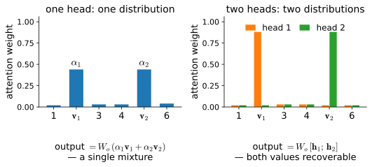
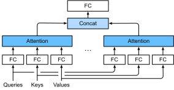

# Multi-Head and Cross-Attention
:label:`sec_multihead-attention`

Scaled dot product attention, as built in :numref:`sec_attention-scoring-functions`,
gives each query exactly one probability distribution over the keys, and
returns the correspondingly weighted average of the values. One distribution
per query is a real restriction: a token in a sentence participates in several
relations at once — it agrees with a verb, refers back to an entity, sits
inside a phrase — and a single weighted average must blend all of them into
one vector. This section first makes the restriction precise: we construct a
task on which a single attention head provably loses half of what it is asked
to report, however it allocates its weights, and we verify the bound
numerically. *Multi-head attention* :cite:`Vaswani.Shazeer.Parmar.ea.2017`
removes the restriction at essentially no extra cost, and we implement it
with one batched matrix multiplication for all heads — a common
implementation strategy (fused attention kernels keep an explicit head axis
instead). Finally we separate what is often conflated: the attention
*function* is one piece of code, and *self-attention* and *cross-attention*
are merely two ways of wiring its inputs.

```{.python .input #multihead-attention-multi-head-and-cross-attention}
%%tab pytorch
%matplotlib inline
from d2l import torch as d2l
import torch
from torch import nn
```

```{.python .input #multihead-attention-multi-head-and-cross-attention}
%%tab jax
%matplotlib inline
from d2l import jax as d2l
from flax import nnx
import jax
from jax import numpy as jnp
```

## One Head Must Average

Here is the smallest task that defeats a single head. Two source positions
hold value vectors $\mathbf{v}_1, \mathbf{v}_2 \in \mathbb{R}^d$, drawn
independently at random for every example; their keys mark only the
*positions*, not the content. A query must report **both** values: the target
is the concatenation $\mathbf{t} = [\mathbf{v}_1; \mathbf{v}_2] \in
\mathbb{R}^{2d}$. Think of a pronoun that must simultaneously retrieve its
antecedent and its governing verb.

A single head can only produce, for this query, softmax weights
$(\alpha_1, \alpha_2)$ with $\alpha_1 + \alpha_2 = 1$, the mixture
$\mathbf{m} = \alpha_1 \mathbf{v}_1 + \alpha_2 \mathbf{v}_2$, and then a
linear readout $\mathbf{W}_o \mathbf{m}$. Since the keys are fixed position
markers, the weights cannot depend on the values: whatever the head learns,
it applies the *same* mixture to every example. How well can it do?

**Proposition.** For independent isotropic Gaussian values, the best
achievable relative squared error of a single head on the copy-both task is
$1/2$ — for *every* choice of $(\alpha_1, \alpha_2)$.

**Proof.** Given the mixture $\mathbf{m} = \alpha_1 \mathbf{v}_1 + \alpha_2
\mathbf{v}_2$, the best estimate of $\mathbf{v}_1$ is the conditional mean
$\mathbb{E}[\mathbf{v}_1 \mid \mathbf{m}] = \tfrac{\alpha_1}{\alpha_1^2 +
\alpha_2^2}\, \mathbf{m}$, which is linear, so a linear readout attains it.
Its per-dimension error variance is $1 - \tfrac{\alpha_1^2}{\alpha_1^2 +
\alpha_2^2} = \tfrac{\alpha_2^2}{\alpha_1^2 + \alpha_2^2}$; the error for
$\mathbf{v}_2$ is $\tfrac{\alpha_1^2}{\alpha_1^2 + \alpha_2^2}$. The two
add to exactly $1$ per dimension, against the target's total of $2$: half
the variance is gone, no matter how the head splits its attention.
$\blacksquare$

The knob that softmax controls — where to put the weight — cannot help,
because the failure is structural: one head hands the readout a *single*
mixture of the values, and the task needs two. Let's watch the bound hold.

```{.python .input #multihead-attention-one-head-must-average-1}
%%tab pytorch
torch.manual_seed(0)
N, d = 10000, 16
V1, V2 = torch.randn(N, d), torch.randn(N, d)
target = torch.cat([V1, V2], dim=1)

def readout_error(M, target):
    """Best linear readout of target from M, relative error."""
    W = torch.linalg.lstsq(M, target).solution
    return ((M @ W - target).norm() / target.norm()).item()

for a in (0.5, 0.7, 0.9, 1.0):
    M = a * V1 + (1 - a) * V2
    print(f'single head, weights ({a:.1f}, {1 - a:.1f}): '
          f'relative error {readout_error(M, target):.3f}')
print(f'theory: sqrt(1/2) = {0.5 ** 0.5:.3f}')
```

```{.python .input #multihead-attention-one-head-must-average-1}
%%tab jax
N, d = 10000, 16
key1, key2 = jax.random.split(jax.random.key(0))
V1, V2 = jax.random.normal(key1, (N, d)), jax.random.normal(key2, (N, d))
target = jnp.concatenate([V1, V2], axis=1)

def readout_error(M, target):
    """Best linear readout of target from M, relative error."""
    W = jnp.linalg.lstsq(M, target)[0]
    return float(jnp.linalg.norm(M @ W - target) / jnp.linalg.norm(target))

for a in (0.5, 0.7, 0.9, 1.0):
    M = a * V1 + (1 - a) * V2
    print(f'single head, weights ({a:.1f}, {1 - a:.1f}): '
          f'relative error {readout_error(M, target):.3f}')
print(f'theory: sqrt(1/2) = {0.5 ** 0.5:.3f}')
```

The error sits at $\sqrt{1/2} \approx 0.707$ across the whole range, exactly
as computed. Now give the model a second head: two sets of attention weights,
their outputs concatenated before the readout.

```{.python .input #multihead-attention-one-head-must-average-2}
%%tab pytorch
for a in (1.0, 0.88):
    M2 = torch.cat([a * V1 + (1 - a) * V2,
                    (1 - a) * V1 + a * V2], dim=1)
    print(f'two heads, weights ({a:.2f}, {1 - a:.2f}) and '
          f'({1 - a:.2f}, {a:.2f}): '
          f'relative error {readout_error(M2, target):.1e}')
```

```{.python .input #multihead-attention-one-head-must-average-2}
%%tab jax
for a in (1.0, 0.88):
    M2 = jnp.concatenate([a * V1 + (1 - a) * V2,
                          (1 - a) * V1 + a * V2], axis=1)
    print(f'two heads, weights ({a:.2f}, {1 - a:.2f}) and '
          f'({1 - a:.2f}, {a:.2f}): '
          f'relative error {readout_error(M2, target):.1e}')
```

Two heads collapse the error by orders of magnitude, down to the
least-squares solver's floating-point noise — and note that the second row
does it with *soft* attention, weights $(0.88, 0.12)$. Sharpness is not
the point. The two heads supply two different mixtures, the readout inverts
the $2 \times 2$ mixing matrix, and both values come out exactly (the
inversion is well conditioned as long as the heads differ appreciably; the
exercises probe what happens as they collapse toward each other).
:numref:`fig_one-head-averages` summarizes the geometry.


:label:`fig_one-head-averages`

The bound is a fact about this deliberately restricted interface — one layer,
with value-blind keys that mark position only — not a universal law: a one-head
model with content-dependent keys, more depth, or a residual connection is not
bound by it, and the copy-both separation from two heads narrows accordingly.

This is the design brief for multi-head attention: give each query several
independently parametrized attention distributions — several *views* of the
same key–value set — and let a learned output projection recombine them.

## Multi-Head Attention

### From One Head to $h$ Heads

Rather than hand-designing the heads as above, we learn them. Given a query
$\mathbf{q} \in \mathbb{R}^{d}$, keys $\mathbf{k} \in \mathbb{R}^{d}$, and
values $\mathbf{v} \in \mathbb{R}^{d}$, head $i$ ($i = 1, \ldots, h$) first
projects them into its own subspace and then runs ordinary scaled dot product
attention $f$ from :numref:`sec_attention-scoring-functions`:

$$
\mathbf{h}_i = f\big(\mathbf W_i^{(q)}\mathbf q,\; \mathbf W_i^{(k)}\mathbf k,\; \mathbf W_i^{(v)}\mathbf v\big) \in \mathbb R^{p},
$$
:eqlabel:`eq_multihead-head`

with learnable $\mathbf W_i^{(q)}, \mathbf W_i^{(k)}, \mathbf W_i^{(v)} \in
\mathbb R^{p \times d}$. Because each head scores with its own projected
queries and keys, each head attends according to its own notion of relevance,
and each moves its own projection of the values — the two independent
mixtures of the construction above, now learned and generalized to $h$. The
output is a learned linear recombination of the concatenated heads:

$$
\mathbf W_o \begin{bmatrix}\mathbf h_1\\\vdots\\\mathbf h_h\end{bmatrix} \in \mathbb{R}^{d}, \qquad \mathbf W_o \in \mathbb R^{d \times hp}.
$$
:eqlabel:`eq_multihead-output`

:numref:`fig_multi-head-attention` shows the layout.


:label:`fig_multi-head-attention`

### Same FLOPs, More Views

The standard dimension choice makes the heads collectively no more expensive
than one big head: set the per-head width to $p = d/h$, so the $h$ heads
together produce $hp = d$ numbers per token, exactly what a single head of
width $d$ would. For a sequence of $n$ tokens the cost is then

$$
\underbrace{8nd^2}_{\textrm{projections}} \;+\; \underbrace{4n^2 d}_{\textrm{scores and mixing}} \quad \textrm{FLOPs,} \qquad 4d^2 \ \textrm{parameters,}
$$
:eqlabel:`eq_multihead-flops`

*independent of $h$*: the four projection matrices are $d \times d$
regardless of how their outputs are sliced into heads, and each head's score
and mixing matmuls shrink by the factor $h$ that their count grows by
(counting one multiply–add as two FLOPs). In this arithmetic the number of
heads is a free dial that buys representational diversity, not extra
compute — realized cost is not quite as flat, since more heads mean more,
smaller matmuls and softmaxes for the kernels to keep efficient. What *does*
change with $h$ is the shape of the attention map — $h$ distributions of $n$
weights per query instead of one.

### Implementation

The per-head dimension choice also yields a standard implementation trick:
compute *one* query projection of width $d$, then
*reshape* it into $h$ heads of width $d/h$, and fold the head axis into the
batch axis. The attention code from :numref:`sec_attention-scoring-functions`
then runs all heads of all sequences as one big batched matrix
multiplication, with no loop over heads. Within the forward pass, `valid_lens`
is repeated $h$ times so that each head of a sequence sees that sequence's
mask.

```{.python .input #multihead-attention-implementation-1}
%%tab pytorch
class MultiHeadAttention(d2l.Module):  #@save
    """Multi-head attention."""
    def __init__(self, num_hiddens, num_heads, dropout, bias=False, **kwargs):
        super().__init__()
        assert num_hiddens % num_heads == 0, 'heads must divide num_hiddens'
        self.num_heads = num_heads
        self.attention = d2l.DotProductAttention(dropout)
        self.W_q = nn.LazyLinear(num_hiddens, bias=bias)
        self.W_k = nn.LazyLinear(num_hiddens, bias=bias)
        self.W_v = nn.LazyLinear(num_hiddens, bias=bias)
        self.W_o = nn.LazyLinear(num_hiddens, bias=bias)

    def forward(self, queries, keys, values, valid_lens):
        # Shape of queries, keys, or values:
        # (batch_size, no. of queries or key-value pairs, num_hiddens)
        # Shape of valid_lens: (batch_size,) or (batch_size, no. of queries)
        queries = self.transpose_qkv(self.W_q(queries))
        keys = self.transpose_qkv(self.W_k(keys))
        values = self.transpose_qkv(self.W_v(values))

        if valid_lens is not None:
            # On axis 0, copy the first item (scalar or vector) for num_heads
            # times, then copy the next item, and so on
            valid_lens = torch.repeat_interleave(
                valid_lens, repeats=self.num_heads, dim=0)

        # Shape of output: (batch_size * num_heads, no. of queries,
        # num_hiddens / num_heads)
        output = self.attention(queries, keys, values, valid_lens)
        # Shape of output_concat: (batch_size, no. of queries, num_hiddens)
        output_concat = self.transpose_output(output)
        return self.W_o(output_concat)
```

```{.python .input #multihead-attention-implementation-1}
%%tab jax
class MultiHeadAttention(nnx.Module):  #@save
    """Multi-head attention."""
    def __init__(self, num_hiddens, num_heads, dropout, bias=False, rngs=None):
        assert num_hiddens % num_heads == 0, 'heads must divide num_hiddens'
        rngs = nnx.Rngs(params=0, dropout=1) if rngs is None else rngs
        self.num_hiddens, self.num_heads = num_hiddens, num_heads
        self.attention = d2l.DotProductAttention(dropout, rngs=rngs)
        self.W_q = nnx.Linear(num_hiddens, num_hiddens, use_bias=bias,
                              rngs=rngs)
        self.W_k = nnx.Linear(num_hiddens, num_hiddens, use_bias=bias,
                              rngs=rngs)
        self.W_v = nnx.Linear(num_hiddens, num_hiddens, use_bias=bias,
                              rngs=rngs)
        self.W_o = nnx.Linear(num_hiddens, num_hiddens, use_bias=bias,
                              rngs=rngs)

    def __call__(self, queries, keys, values, valid_lens):
        # Shape of queries, keys, or values:
        # (batch_size, no. of queries or key-value pairs, num_hiddens)
        # Shape of valid_lens: (batch_size,) or (batch_size, no. of queries)
        queries = self.transpose_qkv(self.W_q(queries))
        keys = self.transpose_qkv(self.W_k(keys))
        values = self.transpose_qkv(self.W_v(values))

        if valid_lens is not None:
            # On axis 0, copy the first item (scalar or vector) for num_heads
            # times, then copy the next item, and so on
            valid_lens = jnp.repeat(valid_lens, self.num_heads, axis=0)

        # Shape of output: (batch_size * num_heads, no. of queries,
        # num_hiddens / num_heads)
        output, attention_weights = self.attention(
            queries, keys, values, valid_lens)
        # Shape of output_concat: (batch_size, no. of queries, num_hiddens)
        output_concat = self.transpose_output(output)
        # NNX idiom: return (output, weights); PyTorch returns output only
        return self.W_o(output_concat), attention_weights
```

The two transpositions do the head bookkeeping: `transpose_qkv` moves from
`(batch, length, num_hiddens)` to `(batch * num_heads, length,
num_hiddens / num_heads)`, and `transpose_output` reverses it after the
attention call.

```{.python .input #multihead-attention-implementation-2}
%%tab pytorch
@d2l.add_to_class(MultiHeadAttention)  #@save
def transpose_qkv(self, X):
    """Transposition for parallel computation of multiple attention heads."""
    # Shape of input X: (batch_size, no. of queries or key-value pairs,
    # num_hiddens). Shape of output X: (batch_size, no. of queries or
    # key-value pairs, num_heads, num_hiddens / num_heads)
    X = X.reshape(X.shape[0], X.shape[1], self.num_heads, -1)
    # Shape of output X: (batch_size, num_heads, no. of queries or key-value
    # pairs, num_hiddens / num_heads)
    X = X.permute(0, 2, 1, 3)
    # Shape of output: (batch_size * num_heads, no. of queries or key-value
    # pairs, num_hiddens / num_heads)
    return X.reshape(-1, X.shape[2], X.shape[3])

@d2l.add_to_class(MultiHeadAttention)  #@save
def transpose_output(self, X):
    """Reverse the operation of transpose_qkv."""
    X = X.reshape(-1, self.num_heads, X.shape[1], X.shape[2])
    X = X.permute(0, 2, 1, 3)
    return X.reshape(X.shape[0], X.shape[1], -1)
```

```{.python .input #multihead-attention-implementation-2}
%%tab jax
@d2l.add_to_class(MultiHeadAttention)  #@save
def transpose_qkv(self, X):
    """Transposition for parallel computation of multiple attention heads."""
    # Shape of input X: (batch_size, no. of queries or key-value pairs,
    # num_hiddens). Shape of output X: (batch_size, no. of queries or
    # key-value pairs, num_heads, num_hiddens / num_heads)
    X = X.reshape((X.shape[0], X.shape[1], self.num_heads, -1))
    # Shape of output X: (batch_size, num_heads, no. of queries or key-value
    # pairs, num_hiddens / num_heads)
    X = jnp.transpose(X, (0, 2, 1, 3))
    # Shape of output: (batch_size * num_heads, no. of queries or key-value
    # pairs, num_hiddens / num_heads)
    return X.reshape((-1, X.shape[2], X.shape[3]))

@d2l.add_to_class(MultiHeadAttention)  #@save
def transpose_output(self, X):
    """Reverse the operation of transpose_qkv."""
    X = X.reshape((-1, self.num_heads, X.shape[1], X.shape[2]))
    X = jnp.transpose(X, (0, 2, 1, 3))
    return X.reshape((X.shape[0], X.shape[1], -1))
```

A shape check: with 5 heads and 100 hidden units, batches of 2 sequences with
4 queries against 6 key–value pairs come back as
(`batch_size`, `num_queries`, `num_hiddens`), and the per-sequence
`valid_lens` masking flows through unchanged.

```{.python .input #multihead-attention-implementation-3}
%%tab pytorch
num_hiddens, num_heads = 100, 5
attention = MultiHeadAttention(num_hiddens, num_heads, 0.5)
batch_size, num_queries, num_kvpairs = 2, 4, 6
valid_lens = d2l.tensor([3, 2])
X = d2l.ones((batch_size, num_queries, num_hiddens))
Y = d2l.ones((batch_size, num_kvpairs, num_hiddens))
d2l.check_shape(attention(X, Y, Y, valid_lens),
                (batch_size, num_queries, num_hiddens))
```

```{.python .input #multihead-attention-implementation-3}
%%tab jax
num_hiddens, num_heads = 100, 5
attention = MultiHeadAttention(num_hiddens, num_heads, 0.5)
batch_size, num_queries, num_kvpairs = 2, 4, 6
valid_lens = d2l.tensor([3, 2])
X = d2l.ones((batch_size, num_queries, num_hiddens))
Y = d2l.ones((batch_size, num_kvpairs, num_hiddens))
d2l.check_shape(nnx.view(attention, deterministic=True)(
                    X, Y, Y, valid_lens)[0],
                (batch_size, num_queries, num_hiddens))
```

And the accounting of :eqref:`eq_multihead-flops` in the flesh: the parameter
count does not move as the head count sweeps from 1 to 8.

```{.python .input #multihead-attention-implementation-4}
%%tab pytorch
X = d2l.ones((2, 10, 256))
for num_heads in (1, 2, 4, 8):
    attention = MultiHeadAttention(num_hiddens=256, num_heads=num_heads,
                                   dropout=0)
    attention(X, X, X, None)  # Materialize the lazily initialized layers
    print(f'{num_heads} heads: '
          f'{sum(p.numel() for p in attention.parameters())} parameters')
```

```{.python .input #multihead-attention-implementation-4}
%%tab jax
for num_heads in (1, 2, 4, 8):
    attention = MultiHeadAttention(num_hiddens=256, num_heads=num_heads,
                                   dropout=0)
    num_params = sum(p.size for p in jax.tree.leaves(
        nnx.state(attention, nnx.Param)))
    print(f'{num_heads} heads: {num_params} parameters')
```

## Self-Attention and Cross-Attention

`MultiHeadAttention` takes three sequence arguments — queries, keys, values —
and nothing in its code cares where they come from. The two wirings that
dominate practice differ only in what we pass.

### One Sequence Querying Itself

In *self-attention* :cite:`Lin.Feng.Santos.ea.2017,Vaswani.Shazeer.Parmar.ea.2017`,
one sequence supplies all three arguments: every token emits a query against
every token's key, and each output position is a value mixture from the same
sequence. Given inputs $\mathbf{x}_1, \ldots, \mathbf{x}_n \in \mathbb{R}^d$,
the layer returns an equally long sequence $\mathbf{y}_1, \ldots,
\mathbf{y}_n$ with

$$
\mathbf{y}_i = f\big(\mathbf{x}_i,\; (\mathbf{x}_1, \mathbf{x}_1), \ldots, (\mathbf{x}_n, \mathbf{x}_n)\big) \in \mathbb{R}^d,
$$
:eqlabel:`eq_self-attention`

where $f$ is multi-head attention pooling. Each token's new representation is
assembled from the whole sequence in a single step — this is the layer that
transformers stack, and its output shape equals its input shape, which is
what makes stacking possible.

```{.python .input #multihead-attention-one-sequence-querying-itself}
%%tab pytorch
num_hiddens, num_heads = 100, 5
attention = MultiHeadAttention(num_hiddens, num_heads, 0.5)
batch_size, num_queries, valid_lens = 2, 4, d2l.tensor([3, 2])
X = d2l.ones((batch_size, num_queries, num_hiddens))
d2l.check_shape(attention(X, X, X, valid_lens),
                (batch_size, num_queries, num_hiddens))
```

```{.python .input #multihead-attention-one-sequence-querying-itself}
%%tab jax
num_hiddens, num_heads = 100, 5
attention = MultiHeadAttention(num_hiddens, num_heads, 0.5)
batch_size, num_queries, valid_lens = 2, 4, d2l.tensor([3, 2])
X = d2l.ones((batch_size, num_queries, num_hiddens))
d2l.check_shape(nnx.view(attention, deterministic=True)(
                    X, X, X, valid_lens)[0],
                (batch_size, num_queries, num_hiddens))
```

### One Sequence Querying Another

In *cross-attention*, one sequence asks and another answers: the queries come
from sequence $\mathbf{A}$, while keys and values come from sequence
$\mathbf{B}$. The output has the length of $\mathbf{A}$ (one answer per
question) and the information of $\mathbf{B}$. This is the wiring of the
original encoder–decoder transformer, where each target-language position
queries the source sentence; of a vision–language model, where text tokens
query image patches; and of the historical alignment models that attention
grew out of (:numref:`sec_attention-scoring-functions`). Same function, one
changed argument:

```{.python .input #multihead-attention-one-sequence-querying-another}
%%tab pytorch
A = d2l.ones((batch_size, 4, num_hiddens))
B = d2l.ones((batch_size, 9, num_hiddens))
d2l.check_shape(attention(A, B, B, None),
                (batch_size, 4, num_hiddens))
```

```{.python .input #multihead-attention-one-sequence-querying-another}
%%tab jax
A = d2l.ones((batch_size, 4, num_hiddens))
B = d2l.ones((batch_size, 9, num_hiddens))
d2l.check_shape(nnx.view(attention, deterministic=True)(
                    A, B, B, None)[0],
                (batch_size, 4, num_hiddens))
```

### An Alignment You Can Read

To see cross-attention *doing* something rather than merely reshaping, we
strip it to its core. Assign every letter of the alphabet a random embedding,
and let the letters of one word query the letters of another through plain
scaled dot product attention — no learned projections. Matching letters
share an embedding, so their score concentrates near $\sqrt{d}$ after
scaling, while unrelated pairs score near zero; softmax turns this gap into
a readable alignment.

```{.python .input #multihead-attention-an-alignment-you-can-read}
%%tab pytorch
words = 'attention', 'translation'
letters = sorted(set(''.join(words)))
torch.manual_seed(0)
emb = torch.randn(len(letters), 32)
queries, keys = (emb[[letters.index(c) for c in w]][None] for w in words)
attention = d2l.DotProductAttention(dropout=0)
attention(queries, keys, keys, None)
d2l.show_heatmaps(attention.attention_weights[None],
                  xlabel='keys:  t  r  a  n  s  l  a  t  i  o  n',
                  ylabel='queries:  a  t  t  e  n  t  i  o  n',
                  figsize=(4, 3.5), cmap='Blues')
```

```{.python .input #multihead-attention-an-alignment-you-can-read}
%%tab jax
words = 'attention', 'translation'
letters = sorted(set(''.join(words)))
emb = jax.random.normal(jax.random.key(0), (len(letters), 32))
queries, keys = (emb[jnp.array([letters.index(c) for c in w])][None]
                 for w in words)
attention = d2l.DotProductAttention(dropout=0)
output, attention_weights = attention(queries, keys, keys, None)
d2l.show_heatmaps(attention_weights[None],
                  xlabel='keys:  t  r  a  n  s  l  a  t  i  o  n',
                  ylabel='queries:  a  t  t  e  n  t  i  o  n',
                  figsize=(4, 3.5), cmap='Blues')
```

Read the map row by row (queries are the letters of "attention", keys the
letters of "translation"). Three regimes appear. The `i` and `o` queries find
their unique partners and attend sharply. The `a`, `t`, and `n` queries find
*two* copies each and split their weight: a single head cannot choose
between identical keys, the averaging of the first section in miniature.
And the `e` query, whose letter does not occur in "translation" at all,
spreads its weight diffusely: softmax must hand out probability mass
somewhere even when nothing matches. Trained models show all three regimes
too, which is one reason reading attention maps as explanations requires
care — a diffuse row may mean "nothing relevant", not "everything relevant".

## Summary

A single attention head gives each query one softmax distribution over the
keys and hence one convex mixture of the values; on a task that asks one
query to report two values through position-only keys — so the weights
cannot adapt to the values — any single head loses half the target
variance, however it allocates its weights — a limit of that value-blind,
single-layer interface, not of one-head attention in general. Multi-head
attention fixes this by running
$h$ independently projected attention heads and linearly recombining their
concatenated outputs. With the per-head width set to $d/h$, parameters and
FLOPs are independent of $h$ — heads buy diversity of views, not extra
compute — and the implementation folds the head axis into the batch axis so
that all heads run as one batched matmul. The attention function is
indifferent to where its arguments come from: self-attention feeds one
sequence as queries, keys, and values alike (output length = input length,
the stackable case), while cross-attention lets one sequence query another
(output length = query length), which is the encoder–decoder and
multimodal wiring.

## Exercises

1. In the copy-both construction, the best *linear* readout loses half the
   variance. Does a nonlinear readout help? For Gaussian values the
   conditional mean is linear, so it cannot; check this numerically by
   training a small MLP readout on $\mathbf{m}$ with weights $(0.5, 0.5)$.
   Then repeat with values drawn uniformly from $\{-1, +1\}^d$ — explain
   what changes and why.
2. Two heads with weights $(0.5 + \epsilon, 0.5 - \epsilon)$ and
   $(0.5 - \epsilon, 0.5 + \epsilon)$ still invert exactly in theory. Add
   Gaussian noise of standard deviation $0.01$ to the mixtures and measure
   the readout error as $\epsilon \to 0$. Relate what you see to the
   condition number of the $2 \times 2$ mixing matrix.
3. Feed the letter-alignment example through a freshly initialized
   `MultiHeadAttention` with 4 heads instead of plain dot product attention,
   and plot each head's attention map. Are the maps still readable? What
   does this suggest about interpreting the attention maps of a network
   whose projections you have not inspected?
4. Derive :eqref:`eq_multihead-flops` by counting the matrix
   multiplications in `MultiHeadAttention`. For $d = 512$, at which sequence
   length $n$ does the quadratic score-and-mix term overtake the projection
   term? Later sections of this chapter take this crossover as their
   starting point.
5. Multi-query attention shares a single key and value head across all $h$
   query heads, and grouped-query attention shares them within groups. How
   do the parameter count and the FLOPs count of
   :eqref:`eq_multihead-flops` change under each scheme? Why is the saving
   most valuable during autoregressive generation?
6. Suppose you want to prune the least important heads of a trained
   multi-head attention layer to speed up inference. Design an experiment to
   measure how much each head matters. How would you guard against two
   heads that are individually prunable but not jointly?

<!-- slides -->

::: {.slide}
::: {.cover}
[Dive into Deep Learning · §10.3]{.kicker}

Multi-head and cross-attention<br>
**why one head must average · heads for free · self- vs. cross-attention**
:::
:::

::: {.slide title="One head, one mixture"}
[The smallest task that defeats a single head]{.kicker}

Two positions hold random values $\mathbf{v}_1, \mathbf{v}_2$; keys mark
positions only. One query must report **both**:
$\mathbf{t} = [\mathbf{v}_1; \mathbf{v}_2]$.

A head can only output $\mathbf{W}_o(\alpha_1 \mathbf{v}_1 + \alpha_2 \mathbf{v}_2)$
— one convex mixture per query.

. . .

**Proposition.** Best achievable relative squared error $= 1/2$,
for *every* choice of $(\alpha_1, \alpha_2)$.

The knob softmax controls — where the weight goes — cannot help. The failure
is structural: one mixture, two requests.
:::

::: {.slide title="The bound, numerically"}
@!multihead-attention-one-head-must-average-1

- Best linear readout via least squares, attention split swept from
  $(0.5, 0.5)$ to $(1, 0)$.
- Error pinned at $\sqrt{1/2} \approx 0.707$ across the whole range.
:::

::: {.slide title="Two heads suffice"}
@!multihead-attention-one-head-must-average-2

- Error collapses to solver noise, orders of magnitude down.
- Second row: *soft* heads, weights $(0.88, 0.12)$ — sharpness is not the
  point. Two **different** mixtures let the readout invert the
  $2 \times 2$ mixing matrix.

@fig:mdl-attention-one-head-averages
:::

::: {.slide title="Multi-head attention"}
Learn the heads: each gets its own projections, then ordinary scaled
dot product attention

$$\mathbf{h}_i = f\big(\mathbf W_i^{(q)}\mathbf q, \mathbf W_i^{(k)}\mathbf k, \mathbf W_i^{(v)}\mathbf v\big), \qquad \textrm{output} = \mathbf W_o [\mathbf h_1; \ldots; \mathbf h_h].$$

@fig:multi-head-attention
:::

::: {.slide title="Heads are free"}
Per-head width $p = d/h$ ⇒ for $n$ tokens:

$$\underbrace{8nd^2}_{\textrm{projections}} + \underbrace{4n^2 d}_{\textrm{scores, mixing}} \ \textrm{FLOPs}, \qquad 4d^2 \ \textrm{parameters}$$

— **independent of $h$**. Heads buy diversity of views, not FLOPs or
parameters (realized kernel efficiency does vary with head count).

::: {.d2l-note}
What does change with $h$: the attention map — $h$ distributions per query
instead of one.
:::
:::

::: {.slide title="Implementation"}
One $d \times d$ projection each for Q, K, V; *reshape* into $h$ heads;
fold the head axis into the batch axis:

@multihead-attention-implementation-1
:::

::: {.slide title="The reshape trick"}
`(batch, len, d)` → `(batch, len, h, d/h)` → `(batch·h, len, d/h)`:
the attention code sees heads as extra batch entries — no loop over heads.

@multihead-attention-implementation-2
:::

::: {.slide title="Shape and cost checks"}
@multihead-attention-implementation-3

. . .

@!multihead-attention-implementation-4
:::

::: {.slide title="Self- vs. cross-attention: two wirings"}
The function never asks where its arguments come from.

- **Self-attention**: `attention(X, X, X)` — one sequence queries itself;
  output shape = input shape (the stackable case).
- **Cross-attention**: `attention(A, B, B)` — sequence A asks, sequence B
  answers; output length = query length.

@multihead-attention-one-sequence-querying-another
:::

::: {.slide title="An alignment you can read"}
Letters of "attention" query letters of "translation" through raw
dot product attention on shared random embeddings:

@!multihead-attention-an-alignment-you-can-read
:::

::: {.slide title="Three regimes in one map"}
- `i`, `o`: unique partner → **sharp** attention.
- `a`, `t`, `n`: two copies → weight **splits** — the averaging of the
  construction, in miniature.
- `e`: no partner → **diffuse** row; softmax must spend its mass somewhere.

::: {.d2l-note}
A diffuse row may mean "nothing relevant", not "everything relevant" —
one reason attention maps are tricky as explanations.
:::
:::

::: {.slide title="Recap"}
- One head = one softmax distribution per query = one value mixture; the
  copy-both task loses half its variance, whatever the split.
- Multi-head: $h$ independently projected heads, concatenated, recombined
  by $\mathbf{W}_o$ — with $p = d/h$, same parameters and FLOPs as one head.
- Implementation folds heads into the batch axis: one batched matmul.
- Self-attention and cross-attention are the same code with different
  arguments; only the wiring differs.
:::
