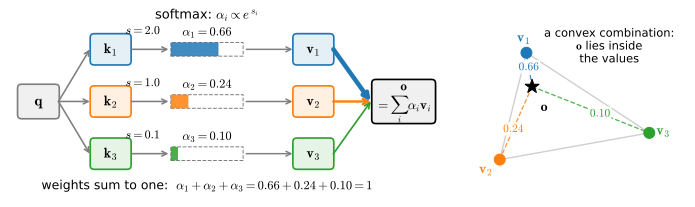
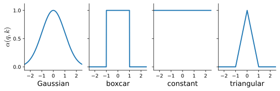

# Queries, Keys, and Values
:label:`sec_queries-keys-values`

Every network we have built so far assumes an input of fixed, known size. The
images of ImageNet arrive as $224 \times 224$ pixel grids, and our CNNs are
tuned to exactly that shape. The RNNs of :numref:`sec_rnn` handle variable
length by consuming one token at a time, but they squeeze whatever they have
read into a state vector of fixed dimension; specially designed convolutions
:cite:`Kalchbrenner.Grefenstette.Blunsom.2014` face the same constraint. For
long sequences this becomes a real limitation: a fixed-size state must act as
a summary of everything read so far, and even explicit tracking heuristics
such as those of :citet:`yang2016neural` help only up to a point. What we
want is an operation whose capacity to *access* information grows with the
input, while the machinery doing the accessing stays small.

Databases have exactly this property. In their simplest form they are
collections of keys ($k$) and values ($v$). For instance, our database
$\mathcal{D}$ might consist of tuples \{("Zhang", "Aston"), ("Lipton",
"Zachary"), ("Li", "Mu"), ("Smola", "Alex"), ("Hu", "Rachel"), ("Werness",
"Brent")\} with the last name being the key and the first name being the
value. We can operate on $\mathcal{D}$, for instance with the exact query
($q$) for "Li", which would return the value "Mu". If ("Li", "Mu") was not a
record in $\mathcal{D}$, there would be no valid answer. If we also allowed
for approximate matches, we would retrieve ("Lipton", "Zachary") instead.
This quite simple example teaches us a number of useful things:

* We can design queries $q$ that operate on ($k$,$v$) pairs in such a manner
  as to be valid regardless of the database size.
* The same query can receive different answers, according to the contents of
  the database.
* The "code" being executed for operating on a large state space (the
  database) can be quite simple (e.g., exact match, approximate match,
  top-$k$).
* There is no need to compress or simplify the database to make the
  operations effective.

The *attention mechanism* :cite:`Bahdanau.Cho.Bengio.2014` is the
differentiable version of this lookup, and this chapter is about what
happens when a neural network is built around it. In this section we define
the operation and get a feel for it in a setting where nothing is learned at
all: classical kernel regression, where the attention weights are hand-picked
rather than trained.

```{.python .input #queries-keys-values-queries-keys-and-values}
%%tab pytorch
%matplotlib inline
from d2l import torch as d2l
import torch
```

```{.python .input #queries-keys-values-queries-keys-and-values}
%%tab jax
%matplotlib inline
from d2l import jax as d2l
import jax
from jax import numpy as jnp
```

## Attention as Soft Database Lookup

Denote by $\mathcal{D} \stackrel{\textrm{def}}{=} \{(\mathbf{k}_1,
\mathbf{v}_1), \ldots, (\mathbf{k}_m, \mathbf{v}_m)\}$ a database of $m$
tuples of *keys* and *values*, and by $\mathbf{q}$ a *query*. Then we define
the *attention* over $\mathcal{D}$ as

$$\textrm{Attention}(\mathbf{q}, \mathcal{D}) \stackrel{\textrm{def}}{=} \sum_{i=1}^m \alpha(\mathbf{q}, \mathbf{k}_i) \mathbf{v}_i,$$
:eqlabel:`eq_attention_pooling`

where $\alpha(\mathbf{q}, \mathbf{k}_i) \in \mathbb{R}$ ($i = 1, \ldots, m$)
are scalar attention weights. The operation itself is typically referred to
as *attention pooling*. The name derives from the fact that the operation
pays particular attention to the terms for which the weight $\alpha$ is
large. The output is a linear combination of the values in the database, and
the exact-lookup example above is the special case where all but one weight
is zero. Several regimes of :eqref:`eq_attention_pooling` are worth naming:

* The weights $\alpha(\mathbf{q}, \mathbf{k}_i)$ are nonnegative. In this
  case the output of the attention mechanism is contained in the convex cone
  spanned by the values $\mathbf{v}_i$.
* The weights form a convex combination, i.e., $\sum_i \alpha(\mathbf{q},
  \mathbf{k}_i) = 1$ and $\alpha(\mathbf{q}, \mathbf{k}_i) \geq 0$ for all
  $i$. This is the most common setting in deep learning.
* Exactly one of the weights is $1$ and all others are $0$. This is the
  traditional database query.
* All weights are equal, $\alpha(\mathbf{q}, \mathbf{k}_i) = \frac{1}{m}$.
  This amounts to averaging across the entire database, also called average
  pooling.

A common strategy for ensuring that the weights sum up to $1$ is to start
from any scoring function $a(\mathbf{q}, \mathbf{k})$ and normalize. To make
the weights nonnegative as well, we exponentiate first. This means we can
pick *any* function $a(\mathbf{q}, \mathbf{k})$ and apply the softmax
operation known from multinomial models:

$$\alpha(\mathbf{q}, \mathbf{k}_i) = \frac{\exp(a(\mathbf{q}, \mathbf{k}_i))}{\sum_j \exp(a(\mathbf{q}, \mathbf{k}_j))}.$$
:eqlabel:`eq_softmax_attention`

This operation is available in all deep learning frameworks, it is
differentiable, and its Jacobian is never the zero matrix, so gradients keep
flowing. Attention
mechanisms that are not differentiable exist, e.g., trained with
reinforcement learning methods :cite:`Mnih.Heess.Graves.ea.2014`, but they
are much harder to optimize. The bulk of modern attention research follows
the framework of :numref:`fig_qkv`, and so will we.


:label:`fig_qkv`

Note what :eqref:`eq_attention_pooling` buys us. The "code" executed against
the set of keys and values, namely the query, can be concise even when the
space it operates on is large, so the layer does not need many parameters.
And attention pooling works on a database of any size without changing the
operation, which is precisely the fixed-size-state limitation we set out to
remove.

## Visualizing Attention Weights

When the weights are nonnegative and sum to $1$, we may *interpret* large
weights as the model selecting the components that matter for the query at
hand. This is a useful intuition, though only an intuition—we return to how
much attention weights actually explain at the end of the chapter. Either
way, plotting the weight matrix over (query, key) pairs is the standard
diagnostic, and we will use it throughout the chapter via the
`d2l.show_heatmaps` helper. It accepts a tensor of shape (number of rows for
display, number of columns for display, number of queries, number of keys),
so a whole grid of weight matrices can be compared side by side.

As a sanity check, we visualize the identity matrix, which represents the
exact-lookup case: the attention weight is $1$ exactly when query and key
agree.

```{.python .input #queries-keys-values-visualizing-attention-weights}
%%tab pytorch
attention_weights = torch.eye(10).reshape((1, 1, 10, 10))
d2l.show_heatmaps(attention_weights, xlabel='Keys', ylabel='Queries')
```

```{.python .input #queries-keys-values-visualizing-attention-weights}
%%tab jax
attention_weights = jnp.eye(10).reshape((1, 1, 10, 10))
d2l.show_heatmaps(attention_weights, xlabel='Keys', ylabel='Queries')
```

## Attention Pooling with Fixed Kernels
:label:`sec_attention-pooling`

Nothing in :eqref:`eq_attention_pooling` requires learning. Long before deep
learning, statisticians used exactly this operation with *hand-picked*
weights: Nadaraya--Watson kernel regression
:cite:`Nadaraya.1964,Watson.1964`. Seeing attention work in that classical
setting is worth a short stop, both because it lets us watch the weights do
their job on a problem we can plot, and because its limitation is what
motivates the rest of the chapter.

### Similarity Kernels

A *kernel* $\alpha(\mathbf{q}, \mathbf{k})$ measures the similarity between
a query and a key, typically as a decreasing function of their distance.
Common choices include

$$
\begin{aligned}
\alpha(\mathbf{q}, \mathbf{k}) & = \exp\left(-\tfrac{1}{2} \|\mathbf{q} - \mathbf{k}\|^2 \right) && \textrm{Gaussian;} \\
\alpha(\mathbf{q}, \mathbf{k}) & = 1 \textrm{ if } \|\mathbf{q} - \mathbf{k}\| \leq 1 && \textrm{boxcar;} \\
\alpha(\mathbf{q}, \mathbf{k}) & = \mathop{\mathrm{max}}\left(0, 1 - \|\mathbf{q} - \mathbf{k}\|\right) && \textrm{triangular,}
\end{aligned}
$$

plus the degenerate constant kernel $\alpha(\mathbf{q}, \mathbf{k}) = 1$
that ignores the query entirely. :numref:`fig_attention_kernels` shows their
shapes; many more exist, and the choice of kernel connects to kernel density
estimation, also known as *Parzen windows* :cite:`parzen1957consistent`.


:label:`fig_attention_kernels`

Normalizing any such kernel over the keys, as in :eqref:`eq_softmax_attention`
but without the exponentiation (the kernels are already nonnegative), yields
the *Nadaraya--Watson estimator*

$$f(\mathbf{q}) = \sum_i \mathbf{v}_i \frac{\alpha(\mathbf{q}, \mathbf{k}_i)}{\sum_j \alpha(\mathbf{q}, \mathbf{k}_j)}.$$
:eqlabel:`eq_nadaraya-watson`

For scalar regression with observations $(x_i, y_i)$, the keys are the
training inputs $x_i$, the values are the labels $y_i$, and the query is the
location where we want an estimate. Equation :eqref:`eq_nadaraya-watson` is
attention pooling, term for term. The estimator needs no training at all,
and if the kernel is narrowed at a suitable rate as data accumulates, it
converges to the statistically optimal predictor :cite:`mack1982weak`.

### Nadaraya--Watson Regression in Action

Let's watch the estimator work. We draw $40$ noisy training examples from
$y = 2\sin(x) + x + \epsilon$ with standard Gaussian noise $\epsilon$ and
evaluate on a grid.

```{.python .input #queries-keys-values-nadaraya-watson-regression-in-action-1}
%%tab pytorch
torch.manual_seed(0)
n = 40
x_train, _ = torch.sort(torch.rand(n) * 5)
y_train = 2 * torch.sin(x_train) + x_train + torch.randn(n)
x_val = torch.arange(0, 5, 0.1)
y_val = 2 * torch.sin(x_val) + x_val
```

```{.python .input #queries-keys-values-nadaraya-watson-regression-in-action-1}
%%tab jax
key1, key2 = jax.random.split(jax.random.key(0))
n = 40
x_train = jnp.sort(jax.random.uniform(key1, (n,)) * 5)
y_train = 2 * jnp.sin(x_train) + x_train + jax.random.normal(key2, (n,))
x_val = jnp.arange(0, 5, 0.1)
y_val = 2 * jnp.sin(x_val) + x_val
```

The estimator itself is four lines: compute all query--key distances, apply
a Gaussian kernel with bandwidth $\sigma$, normalize over the keys, and take
the weighted sum of the values. The normalized kernel matrix *is* the
attention weight matrix, so we return it too. The old rule of thumb that the
kernel's precise shape matters far less than its bandwidth holds here as
well, so we vary $\sigma$ and keep the kernel Gaussian.

```{.python .input #queries-keys-values-nadaraya-watson-regression-in-action-2}
%%tab pytorch
def nadaraya_watson(x_train, y_train, x_val, sigma):
    dists = x_train[:, None] - x_val[None, :]
    k = torch.exp(-dists**2 / (2 * sigma**2))
    attention_w = k / k.sum(0)  # Normalize over keys for each query
    return y_train @ attention_w, attention_w

sigmas = (0.1, 0.5, 2.0)
estimates = [nadaraya_watson(x_train, y_train, x_val, s)[0] for s in sigmas]
d2l.plot(x_val, estimates + [y_val], 'x', 'y',
         legend=[f'sigma = {s:g}' for s in sigmas] + ['truth'])
d2l.plt.plot(x_train, y_train, 'o', alpha=0.4);
```

```{.python .input #queries-keys-values-nadaraya-watson-regression-in-action-2}
%%tab jax
def nadaraya_watson(x_train, y_train, x_val, sigma):
    dists = x_train[:, None] - x_val[None, :]
    k = jnp.exp(-dists**2 / (2 * sigma**2))
    attention_w = k / k.sum(0)  # Normalize over keys for each query
    return y_train @ attention_w, attention_w

sigmas = (0.1, 0.5, 2.0)
estimates = [nadaraya_watson(x_train, y_train, x_val, s)[0] for s in sigmas]
d2l.plot(x_val, estimates + [y_val], 'x', 'y',
         legend=[f'sigma = {s:g}' for s in sigmas] + ['truth'])
d2l.plt.plot(x_train, y_train, 'o', alpha=0.4);
```

All three bandwidths produce workable estimates. The narrow kernel chases
individual noisy observations; the wide one oversmooths toward a global
average; $\sigma = 0.5$ tracks the underlying function well. The attention
weights say why:

```{.python .input #queries-keys-values-nadaraya-watson-regression-in-action-3}
%%tab pytorch
_, w_narrow = nadaraya_watson(x_train, y_train, x_val, 0.1)
_, w_wide = nadaraya_watson(x_train, y_train, x_val, 2.0)
d2l.show_heatmaps(torch.stack([w_narrow.T, w_wide.T])[None],
                  xlabel='Training inputs (keys)',
                  ylabel='Test inputs (queries)',
                  titles=['sigma = 0.1', 'sigma = 2'], figsize=(7, 3))
```

```{.python .input #queries-keys-values-nadaraya-watson-regression-in-action-3}
%%tab jax
_, w_narrow = nadaraya_watson(x_train, y_train, x_val, 0.1)
_, w_wide = nadaraya_watson(x_train, y_train, x_val, 2.0)
d2l.show_heatmaps(jnp.stack([w_narrow.T, w_wide.T])[None],
                  xlabel='Training inputs (keys)',
                  ylabel='Test inputs (queries)',
                  titles=['sigma = 0.1', 'sigma = 2'], figsize=(7, 3))
```

The narrow kernel concentrates each query's weight on a handful of nearby
keys—sharp, local, and noisy—while the wide kernel spreads it across much of
the dataset. Picking one global $\sigma$ is itself a compromise;
:citet:`Silverman86` proposed bandwidths that adapt to the local data
density, and similar nearest-neighbor interpolation ideas resurface in
modern cross-modal representation learning :cite:`norelli2022asif`.

This is also where the classical story ends and ours begins. The kernel—its
shape, its bandwidth, the space in which distances are measured—is chosen by
the modeler, and every query is served by the same fixed notion of
similarity. The alternative is to *learn* the mechanism: to learn
representations of queries and keys such that the induced attention weights
serve the task. Designing that learnable scoring function is the subject of
the next section, and everything that follows in this chapter builds on it.

## Summary

Attention pooling :eqref:`eq_attention_pooling` aggregates a database of
(key, value) pairs into a single output, weighted by the compatibility
between a query and each key. The operation is differentiable, needs few
parameters, and applies to databases of any size—exact lookup, averaging,
and everything in between arise as special weight patterns, with the softmax
of an arbitrary scoring function :eqref:`eq_softmax_attention` as the
standard recipe for valid weights. Nadaraya--Watson kernel regression is
attention pooling with hand-picked weights: it already works without any
training, but its fixed kernel treats every query alike. Learning the
queries and keys, rather than fixing them, is what turns this pooling
operation into the attention mechanism of modern deep learning.

## Exercises

1. Suppose that you wanted to reimplement approximate (key, query) matches
   as used in classical databases, which attention function would you pick?
1. Suppose that the attention function is given by $a(\mathbf{q},
   \mathbf{k}_i) = \mathbf{q}^\top \mathbf{k}_i$ and that $\mathbf{k}_i =
   \mathbf{v}_i$ for $i = 1, \ldots, m$. Denote by $p(\mathbf{k}_i;
   \mathbf{q})$ the probability distribution over keys when using the
   softmax normalization in :eqref:`eq_softmax_attention`. Prove that
   $\nabla_{\mathbf{q}} \mathop{\textrm{Attention}}(\mathbf{q}, \mathcal{D})
   = \textrm{Cov}_{p(\mathbf{k}_i; \mathbf{q})}[\mathbf{k}_i]$.
1. Design a differentiable search engine using the attention mechanism.
1. Review the design of the Squeeze and Excitation Networks
   :cite:`Hu.Shen.Sun.2018` and interpret them through the lens of the
   attention mechanism.
1. Assume that all keys and queries lie on the unit sphere, i.e., $\|\mathbf{x}\| = 1$.
   Simplify the $\|\mathbf{q} - \mathbf{k}\|^2$ term in the exponential of the
   Gaussian kernel. What does the resulting similarity measure look like?
   Keep your answer in mind for the next section.
1. Use stochastic gradient descent to learn a good bandwidth for
   Nadaraya--Watson regression on the data above. What happens if you
   minimize the training error $(f(x_i) - y_i)^2$ directly, given that $y_i$
   enters the computation of $f(x_i)$? Exclude $(x_i, y_i)$ from the
   estimate at $x_i$ and try again.

<!-- slides -->

::: {.slide}
::: {.cover}
[Dive into Deep Learning · §10.1]{.kicker}

Queries, keys, and values<br>
**attention as soft lookup · softmax weights · Nadaraya–Watson pooling · why learn the kernel**
:::
:::

::: {.slide title="The fixed-size bottleneck"}
Every network so far assumes inputs of fixed, known size — $224 \times 224$
images, or a sequence squeezed through a fixed-dimensional RNN state.

. . .

Databases don't have this problem. A database is a set of
$(\text{key}, \text{value})$ pairs; a query retrieves the matching value.

- The query stays simple no matter how large the database is.
- The same query gets different answers from different databases.
- No need to compress the database to make lookup work.

We want a *differentiable* layer with these properties.
:::

::: {.slide title="Attention as soft database lookup"}
Over a database $\mathcal{D} = \{(\mathbf{k}_1, \mathbf{v}_1), \ldots, (\mathbf{k}_m, \mathbf{v}_m)\}$:

$$\textrm{Attention}(\mathbf{q}, \mathcal{D}) = \sum_{i=1}^m \alpha(\mathbf{q}, \mathbf{k}_i)\, \mathbf{v}_i.$$

One-hot $\alpha$ → exact lookup; uniform $\alpha$ → average pooling.
Everything in between is attention.

{width=64%}
:::

::: {.slide title="Softmax makes any score a weight"}
Pick *any* scoring function $a(\mathbf{q}, \mathbf{k})$, exponentiate,
normalize:

$$\alpha(\mathbf{q}, \mathbf{k}_i) = \frac{\exp(a(\mathbf{q}, \mathbf{k}_i))}{\sum_j \exp(a(\mathbf{q}, \mathbf{k}_j))}.$$

- Nonnegative, sums to one — a convex combination of the values.
- Differentiable; available in every framework.
- The rest of the chapter is about the choice of $a$ and where
  $\mathbf{q}, \mathbf{k}, \mathbf{v}$ come from.
:::

::: {.slide title="Visualizing attention weights"}
The (queries × keys) heatmap is the standard diagnostic — here the
identity, i.e. exact lookup:

@queries-keys-values-visualizing-attention-weights
:::

::: {.slide title="A 1964 attention mechanism"}
Nadaraya–Watson regression is attention pooling with a *hand-picked*
similarity kernel:

$$f(\mathbf{q}) = \sum_i \mathbf{v}_i \frac{\alpha(\mathbf{q}, \mathbf{k}_i)}{\sum_j \alpha(\mathbf{q}, \mathbf{k}_j)}.$$

Keys = training inputs, values = labels, query = where to predict.
No training at all — and consistent, if the kernel narrows with more data.

{width=88%}
:::

::: {.slide title="Nadaraya–Watson in action"}
$y = 2\sin(x) + x + \epsilon$, 40 noisy points. Four lines of code:
distances → kernel → normalize over keys → weighted sum of labels.

@queries-keys-values-nadaraya-watson-regression-in-action-2

- The kernel's shape barely matters; the bandwidth $\sigma$ decides
  everything.
:::

::: {.slide title="The weights explain the fits"}
@!queries-keys-values-nadaraya-watson-regression-in-action-3

- Narrow kernel: sharp, local, noisy — weight on a handful of keys.
- Wide kernel: smooth, global — weight spread across the dataset.
- Either way the kernel is *chosen*, not learned, and every query gets
  the same notion of similarity.
:::

::: {.slide title="Recap"}
- Attention = differentiable soft database lookup:
  $\sum_i \alpha(\mathbf{q}, \mathbf{k}_i)\, \mathbf{v}_i$.
- Softmax of any scoring function gives valid weights; exact lookup and
  average pooling are the extreme weight patterns.
- Works on databases of any size with a small, fixed amount of machinery.
- Nadaraya–Watson: attention with fixed kernels already works — learning
  the queries and keys is what the rest of the chapter adds.
:::
