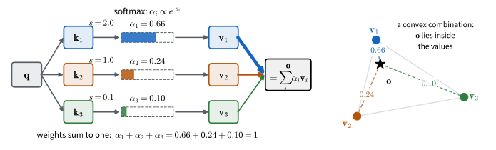
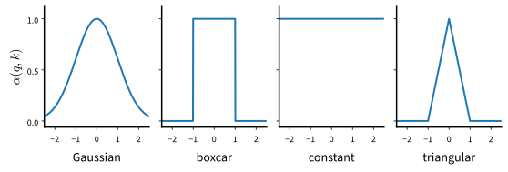

# Queries, Keys, and Values
:label:`sec_queries-keys-values`

Many neural networks either assume a fixed input size or compress a
variable-length input into a fixed-dimensional state. RNNs
(:numref:`sec_rnn`) and specialized convolutions
:cite:`Kalchbrenner.Grefenstette.Blunsom.2014` can process variable-length
sequences, but their fixed-size summaries may lose information in long
sequences. We seek an operation that can access any input representation while
using a fixed set of parameters.

Databases have this property because a query is evaluated against stored
key--value pairs. Consider the scalar database
$\mathcal{D}=\{(2,10),(5,20)\}$. An exact query $q=5$ returns the value 20.
A soft query first defines a score, for example
$a(q,k)=-(q-k)^2$, and normalizes the two scores. For $q=4$, key 5 receives
the larger weight, but both values contribute to the result. The same rule
works for any database size, and its output changes when the stored pairs
change; the query does not require compressing the database into one fixed
vector first.

The *attention mechanism* :cite:`Bahdanau.Cho.Bengio.2014` is a differentiable
version of this lookup. This section defines the operation and illustrates it
with classical kernel regression, where the attention weights are specified by
a kernel rather than learned.

```{.python .input #queries-keys-values-queries-keys-and-values}
%%tab pytorch
%matplotlib inline
from d2l import torch as d2l
import torch
```

```{.python .input #queries-keys-values-queries-keys-and-values}
%%tab jax
%matplotlib inline
from d2l import jax as d2l
import jax
from jax import numpy as jnp
```

## Attention as Differentiable Lookup

Let $\mathbf{q},\mathbf{k}_i \in \mathbb{R}^{d_k}$ and
$\mathbf{v}_i \in \mathbb{R}^{d_v}$. Denote by $\mathcal{D}
\stackrel{\textrm{def}}{=} \{(\mathbf{k}_1, \mathbf{v}_1), \ldots,
(\mathbf{k}_m, \mathbf{v}_m)\}$ a database of $m$ key--value pairs. We
define the attention output in $\mathbb{R}^{d_v}$ by

$$\textrm{Attention}(\mathbf{q}, \mathcal{D}) \stackrel{\textrm{def}}{=} \sum_{i=1}^m \alpha(\mathbf{q}, \mathbf{k}_i) \mathbf{v}_i,$$
:eqlabel:`eq_attention_pooling`

where the scalar weights $\alpha(\mathbf{q},\mathbf{k}_i)$ determine each
value's contribution. In the layers used below, the weights are nonnegative
and sum to one, so the output is a convex combination of the values. Exact
lookup is the limiting one-hot case, and uniform weights give average pooling.
Signed or unnormalized variants exist, but they are not the default operation
in this chapter.

A common strategy for ensuring that the weights sum up to $1$ is to start
from any scoring function $a(\mathbf{q}, \mathbf{k})$ and normalize. To make
the weights nonnegative as well, we exponentiate first. This means we can
pick *any* function $a(\mathbf{q}, \mathbf{k})$ and apply the softmax
operation known from multinomial models:

$$\alpha(\mathbf{q}, \mathbf{k}_i) = \frac{\exp(a(\mathbf{q}, \mathbf{k}_i))}{\sum_j \exp(a(\mathbf{q}, \mathbf{k}_j))}.$$
:eqlabel:`eq_softmax_attention`

This operation is available in all deep learning frameworks and is
differentiable. For at least two entries and finite scores, its Jacobian is
not the zero matrix, although its entries can become very small when the
distribution saturates. Nondifferentiable attention mechanisms also exist
and may be trained with reinforcement learning
:cite:`Mnih.Heess.Graves.ea.2014`, but they are harder to optimize. This
chapter uses the differentiable framework in :numref:`fig_qkv`.


:label:`fig_qkv`

The query and compatibility function use a fixed number of parameters even
when the number of key--value pairs changes. Attention pooling can therefore
operate on inputs of different lengths without first compressing them to a
fixed-size state.

## Visualizing Attention Weights

When the weights are nonnegative and sum to $1$, we may *interpret* large
weights as the model selecting the components that matter for the query at
hand. This is a useful intuition, though only an intuition—we return to how
much attention weights actually explain at the end of the chapter. Either
way, plotting the weight matrix over (query, key) pairs is the standard
diagnostic, and we will use it throughout the chapter via the
`d2l.show_heatmaps` helper. It accepts a tensor of shape (number of rows for
display, number of columns for display, number of queries, number of keys),
so a whole grid of weight matrices can be compared side by side.

As a sanity check, we visualize the identity matrix, which represents the
exact-lookup case: the attention weight is $1$ exactly when query and key
agree.

```{.python .input #queries-keys-values-visualizing-attention-weights}
%%tab pytorch
attention_weights = torch.eye(10).reshape((1, 1, 10, 10))
d2l.show_heatmaps(attention_weights, xlabel='Keys', ylabel='Queries')
```

```{.python .input #queries-keys-values-visualizing-attention-weights}
%%tab jax
attention_weights = jnp.eye(10).reshape((1, 1, 10, 10))
d2l.show_heatmaps(attention_weights, xlabel='Keys', ylabel='Queries')
```

## Attention Pooling with Fixed Kernels
:label:`sec_attention-pooling`

Equation :eqref:`eq_attention_pooling` does not require learned weights. Long
before deep learning, statisticians used this operation with specified
weights: Nadaraya--Watson kernel regression
:cite:`Nadaraya.1964,Watson.1964`. This classical setting makes the effect of the weights visible on a problem
we can plot. Its fixed similarity function also motivates the learned
scoring rules developed in the rest of the chapter.

### Similarity Kernels

A *kernel* $\alpha(\mathbf{q}, \mathbf{k})$ measures the similarity between
a query and a key, typically as a decreasing function of their distance.
Common choices include

$$
\begin{aligned}
\alpha(\mathbf{q}, \mathbf{k}) & = \exp\left(-\tfrac{1}{2} \|\mathbf{q} - \mathbf{k}\|^2 \right) && \textrm{Gaussian;} \\
\alpha(\mathbf{q}, \mathbf{k}) & = 1 \textrm{ if } \|\mathbf{q} - \mathbf{k}\| \leq 1 && \textrm{boxcar;} \\
\alpha(\mathbf{q}, \mathbf{k}) & = \mathop{\mathrm{max}}\left(0, 1 - \|\mathbf{q} - \mathbf{k}\|\right) && \textrm{triangular,}
\end{aligned}
$$

plus the degenerate constant kernel $\alpha(\mathbf{q}, \mathbf{k}) = 1$
that ignores the query entirely. :numref:`fig_attention_kernels` shows their
shapes; many more exist, and the choice of kernel connects to kernel density
estimation, also known as *Parzen windows* :cite:`parzen1957consistent`.


:label:`fig_attention_kernels`

Normalizing any such kernel over the keys, as in :eqref:`eq_softmax_attention`
but without the exponentiation (the kernels are already nonnegative), yields
the *Nadaraya--Watson estimator*

$$f(\mathbf{q}) = \sum_i \mathbf{v}_i \frac{\alpha(\mathbf{q}, \mathbf{k}_i)}{\sum_j \alpha(\mathbf{q}, \mathbf{k}_j)}.$$
:eqlabel:`eq_nadaraya-watson`

For scalar regression with observations $(x_i, y_i)$, the keys are the
training inputs $x_i$, the values are the labels $y_i$, and the query is the
location where we want an estimate. Equation :eqref:`eq_nadaraya-watson` is
attention pooling, term for term. The estimator needs no training at all,
and if the kernel is narrowed at a suitable rate as data accumulates, it
converges to the statistically optimal predictor :cite:`mack1982weak`.

### Nadaraya--Watson Regression in Action

To examine the estimator, we draw $40$ noisy training examples from
$y = 2\sin(x) + x + \epsilon$ with standard Gaussian noise $\epsilon$ and
evaluate on a grid.

```{.python .input #queries-keys-values-nadaraya-watson-regression-in-action-1}
%%tab pytorch
torch.manual_seed(0)
n = 40
x_train, _ = torch.sort(torch.rand(n) * 5)
y_train = 2 * torch.sin(x_train) + x_train + torch.randn(n)
x_val = torch.arange(0, 5, 0.1)
y_val = 2 * torch.sin(x_val) + x_val
```

```{.python .input #queries-keys-values-nadaraya-watson-regression-in-action-1}
%%tab jax
key1, key2 = jax.random.split(jax.random.key(0))
n = 40
x_train = jnp.sort(jax.random.uniform(key1, (n,)) * 5)
y_train = 2 * jnp.sin(x_train) + x_train + jax.random.normal(key2, (n,))
x_val = jnp.arange(0, 5, 0.1)
y_val = 2 * jnp.sin(x_val) + x_val
```

The estimator itself is four lines: compute all query--key distances, apply
a Gaussian kernel with bandwidth $\sigma$, normalize over the keys, and take
the weighted sum of the values. The normalized kernel matrix *is* the
attention weight matrix, so we return it too. For these data, the bandwidth affects the estimate more than the choice
among the displayed kernel shapes. We therefore vary $\sigma$ and keep the
kernel Gaussian.

```{.python .input #queries-keys-values-nadaraya-watson-regression-in-action-2}
%%tab pytorch
def nadaraya_watson(x_train, y_train, x_val, sigma):
    dists = x_train[:, None] - x_val[None, :]
    k = torch.exp(-dists**2 / (2 * sigma**2))
    attention_w = k / k.sum(0)  # Normalize over keys for each query
    return y_train @ attention_w, attention_w

sigmas = (0.1, 0.5, 2.0)
estimates = [nadaraya_watson(x_train, y_train, x_val, s)[0] for s in sigmas]
d2l.plot(x_val, estimates + [y_val], 'x', 'y',
         legend=[f'sigma = {s:g}' for s in sigmas] + ['truth'])
d2l.plt.plot(x_train, y_train, 'o', alpha=0.4);
```

```{.python .input #queries-keys-values-nadaraya-watson-regression-in-action-2}
%%tab jax
def nadaraya_watson(x_train, y_train, x_val, sigma):
    dists = x_train[:, None] - x_val[None, :]
    k = jnp.exp(-dists**2 / (2 * sigma**2))
    attention_w = k / k.sum(0)  # Normalize over keys for each query
    return y_train @ attention_w, attention_w

sigmas = (0.1, 0.5, 2.0)
estimates = [nadaraya_watson(x_train, y_train, x_val, s)[0] for s in sigmas]
d2l.plot(x_val, estimates + [y_val], 'x', 'y',
         legend=[f'sigma = {s:g}' for s in sigmas] + ['truth'])
d2l.plt.plot(x_train, y_train, 'o', alpha=0.4);
```

All three bandwidths produce workable estimates. The narrow kernel chases
individual noisy observations; the wide one oversmooths toward a global
average; $\sigma = 0.5$ tracks the underlying function well. The attention
weights show how the bandwidth produces these differences:

```{.python .input #queries-keys-values-nadaraya-watson-regression-in-action-3}
%%tab pytorch
_, w_narrow = nadaraya_watson(x_train, y_train, x_val, 0.1)
_, w_wide = nadaraya_watson(x_train, y_train, x_val, 2.0)
d2l.show_heatmaps(torch.stack([w_narrow.T, w_wide.T])[None],
                  xlabel='Training inputs (keys)',
                  ylabel='Test inputs (queries)',
                  titles=['sigma = 0.1', 'sigma = 2'], figsize=(7, 3))
```

```{.python .input #queries-keys-values-nadaraya-watson-regression-in-action-3}
%%tab jax
_, w_narrow = nadaraya_watson(x_train, y_train, x_val, 0.1)
_, w_wide = nadaraya_watson(x_train, y_train, x_val, 2.0)
d2l.show_heatmaps(jnp.stack([w_narrow.T, w_wide.T])[None],
                  xlabel='Training inputs (keys)',
                  ylabel='Test inputs (queries)',
                  titles=['sigma = 0.1', 'sigma = 2'], figsize=(7, 3))
```

The narrow kernel concentrates each query's weight on a handful of nearby
keys—sharp, local, and noisy—while the wide kernel spreads it across much of
the dataset. Picking one global $\sigma$ is itself a compromise;
:citet:`Silverman86` proposed bandwidths that adapt to the local data
density, and similar nearest-neighbor interpolation ideas resurface in
modern cross-modal representation learning :cite:`norelli2022asif`.

Nadaraya--Watson regression fixes the kernel shape, bandwidth, and space in
which distances are measured. Every query therefore uses the same prescribed
notion of similarity. A learned attention mechanism instead learns query and
key representations whose induced weights serve the task. The next section develops a learnable scoring function.

## Summary

Attention pooling :eqref:`eq_attention_pooling` forms a weighted sum of values,
where each weight depends on compatibility between a query and a key. Softmax
applied to a scoring function produces nonnegative weights that sum to one.
Exact lookup and average pooling are special cases. Nadaraya--Watson regression
uses a fixed similarity kernel; modern attention instead learns
representations of queries and keys.

## Exercises

1. Suppose that you wanted to reimplement approximate (key, query) matches
   as used in classical databases, which attention function would you pick?
1. Suppose that the attention function is given by $a(\mathbf{q},
   \mathbf{k}_i) = \mathbf{q}^\top \mathbf{k}_i$ and that $\mathbf{k}_i =
   \mathbf{v}_i$ for $i = 1, \ldots, m$. Denote by $p(\mathbf{k}_i;
   \mathbf{q})$ the probability distribution over keys when using the
   softmax normalization in :eqref:`eq_softmax_attention`. Prove that
   $\nabla_{\mathbf{q}} \mathop{\textrm{Attention}}(\mathbf{q}, \mathcal{D})
   = \textrm{Cov}_{p(\mathbf{k}_i; \mathbf{q})}[\mathbf{k}_i]$.
1. Design a differentiable search engine using the attention mechanism.
1. Review the design of the Squeeze and Excitation Networks
   :cite:`Hu.Shen.Sun.2018` and interpret them through the lens of the
   attention mechanism.
1. Assume that all keys and queries lie on the unit sphere, i.e., $\|\mathbf{x}\| = 1$.
   Simplify the $\|\mathbf{q} - \mathbf{k}\|^2$ term in the exponential of the
   Gaussian kernel. What does the resulting similarity measure look like?
   Keep your answer in mind for the next section.
1. Use stochastic gradient descent to learn a good bandwidth for
   Nadaraya--Watson regression on the data above. What happens if you
   minimize the training error $(f(x_i) - y_i)^2$ directly, given that $y_i$
   enters the computation of $f(x_i)$? Exclude $(x_i, y_i)$ from the
   estimate at $x_i$ and try again.

<!-- slides -->

::: {.slide}
::: {.cover}
[Dive into Deep Learning · §10.1]{.kicker}

Queries, keys, and values<br>
**attention as soft lookup · softmax weights · Nadaraya–Watson pooling · why learn the kernel**
:::
:::

::: {.slide title="The fixed-size bottleneck"}
Many networks either assume a fixed input size, such as $224 \times 224$
images, or compress a variable-length sequence into a fixed-dimensional RNN
state.

. . .

A database need not compress its records into one fixed-size state. A database is a set of
$(\text{key}, \text{value})$ pairs; a query retrieves the matching value.

- The query stays simple no matter how large the database is.
- The same query gets different answers from different databases.
- Lookup does not require compressing the database first.

We want a *differentiable* layer with these properties.
:::

::: {.slide title="Attention as differentiable lookup"}
Over a database $\mathcal{D} = \{(\mathbf{k}_1, \mathbf{v}_1), \ldots, (\mathbf{k}_m, \mathbf{v}_m)\}$:

$$\textrm{Attention}(\mathbf{q}, \mathcal{D}) = \sum_{i=1}^m \alpha(\mathbf{q}, \mathbf{k}_i)\, \mathbf{v}_i.$$

One-hot $\alpha$ gives exact lookup; uniform $\alpha$ gives average pooling;
other distributions interpolate between them.

{width=64%}
:::

::: {.slide title="Softmax makes any score a weight"}
Given a scoring function $a(\mathbf{q}, \mathbf{k})$, exponentiate and
normalize its scores:

$$\alpha(\mathbf{q}, \mathbf{k}_i) = \frac{\exp(a(\mathbf{q}, \mathbf{k}_i))}{\sum_j \exp(a(\mathbf{q}, \mathbf{k}_j))}.$$

- Nonnegative, sums to one — a convex combination of the values.
- Differentiable; available in every framework.
- The rest of the chapter is about the choice of $a$ and where
  $\mathbf{q}, \mathbf{k}, \mathbf{v}$ come from.
:::

::: {.slide title="Visualizing attention weights"}
A queries-by-keys heatmap displays the weights. The identity matrix below
represents exact lookup:

@queries-keys-values-visualizing-attention-weights
:::

::: {.slide title="A 1964 attention mechanism"}
Nadaraya–Watson regression is attention pooling with a *hand-picked*
similarity kernel:

$$f(\mathbf{q}) = \sum_i \mathbf{v}_i \frac{\alpha(\mathbf{q}, \mathbf{k}_i)}{\sum_j \alpha(\mathbf{q}, \mathbf{k}_j)}.$$

Keys = training inputs, values = labels, query = where to predict.
The estimator requires no parameter training and is consistent if the kernel
narrows at a suitable rate as data accumulate.

{width=88%}
:::

::: {.slide title="Nadaraya–Watson in action"}
$y = 2\sin(x) + x + \epsilon$, 40 noisy points. Four lines of code:
distances → kernel → normalize over keys → weighted sum of labels.

@queries-keys-values-nadaraya-watson-regression-in-action-2

- In this example, the bandwidth $\sigma$ has more effect than the choice
  among the displayed kernel shapes.
:::

::: {.slide title="The weights explain the fits"}
@!queries-keys-values-nadaraya-watson-regression-in-action-3

- Narrow kernel: sharp, local, noisy — weight on a handful of keys.
- Wide kernel: smooth, global — weight spread across the dataset.
- Either way the kernel is *chosen*, not learned, and every query gets
  the same notion of similarity.
:::

::: {.slide title="Recap"}
- Attention = differentiable soft database lookup:
  $\sum_i \alpha(\mathbf{q}, \mathbf{k}_i)\, \mathbf{v}_i$.
- Softmax of any scoring function gives valid weights; exact lookup and
  average pooling are the extreme weight patterns.
- A fixed set of parameters can operate on databases of different sizes.
- Nadaraya–Watson uses fixed kernels; the rest of the chapter learns query
  and key representations instead.
:::
