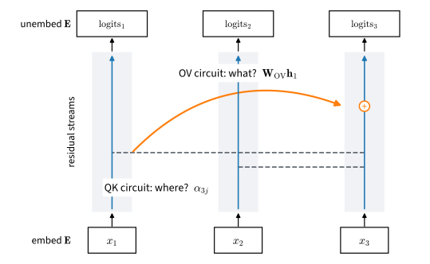

# What Attention Computes
:label:`sec_what-attention-computes`

Attention weights indicate how strongly each query weights each key, but do not
by themselves determine the effect on the output. This section analyzes both
the attention pattern and the transformed values. In an attention-only
Transformer, each head factors into a QK circuit that determines attention
scores and an OV circuit that transforms the attended representation. These
matrices can be read directly from a checkpoint, and paths through multiple
layers can be expanded algebraically. We apply this analysis to the
`TinyCharLM` of :numref:`sec_positional-information` and identify a two-layer
*induction-head* circuit on repeated random sequences
:cite:`Elhage.Nanda.Olsson.ea.2021`. The circuit is related to mechanisms
observed in larger language models :cite:`Olsson.Elhage.Nanda.ea.2022`.

```{.python .input #what-attention-computes}
%%tab pytorch
%matplotlib inline
from d2l import torch as d2l
import torch
from torch.nn import functional as F
```

```{.python .input #what-attention-computes}
%%tab jax
%matplotlib inline
from d2l import jax as d2l
from flax import nnx
import jax
from jax import numpy as jnp
import optax
```

## The Residual Stream

### Residual Representations Across Layers

Write $\mathbf{e}_{x_i} \in \mathbb{R}^d$ for the embedding of token $x_i$
and set $\mathbf{h}_i^{(0)} = \mathbf{e}_{x_i}$. Unrolling `TinyCharLM`'s
forward pass, block $\ell$ of $L$ computes, for every position $i$,

$$
\mathbf{h}_i^{(\ell)} = \mathbf{h}_i^{(\ell-1)} + \sum_{h=1}^{H} \sum_{j \leq i} \alpha_{ij}^{\ell h}\, \mathbf{W}_{\mathrm{OV}}^{\ell h}\, \mathbf{h}_j^{(\ell-1)},
$$
:eqlabel:`eq_stream-update`

and the tied output head scores the final vector against every embedding,
$\mathbf{z}_i = \mathbf{E}\, \mathbf{h}_i^{(L)}$. The sequence of vectors
$\mathbf{h}_i^{(0)}, \ldots, \mathbf{h}_i^{(L)}$ is the *residual stream* of
position $i$. It begins with the token embedding and ends with the vector
read by the output head (:numref:`fig_residual-stream`). Each layer adds to
this vector rather than replacing it. An attention head reads the residual
streams at earlier positions, applies a linear transformation, and adds the
result to the stream at the current position. Consequently, information
written by one layer remains available to every later layer and to the
output head.


:label:`fig_residual-stream`

Once the attention patterns $\alpha$ are fixed, the map from embeddings to
logits in :eqref:`eq_stream-update` is linear: expanding the recursion writes
it as a sum of matrix products along paths through the network. This
decomposition supplies testable hypotheses about how an attention-only model
computes; it does not make the learned circuit self-evident. The exact
framework of :citet:`Elhage.Nanda.Olsson.ea.2021` assumes attention-only
transformers without feed-forward layers or normalization. We use the same
restriction in `TinyCharLM`, then compare weight-level hypotheses with
behavioral and intervention evidence. Real transformers contain additional
nonlinear components, so the conclusions below do not transfer without new
tests.

### QK and OV Circuits

Each head's term in :eqref:`eq_stream-update` splits into two independent
pieces. The attention weights come from softmax over scores that depend on
the query and key projections only through their product, and the payload
depends only on the value and output projections:

$$
s_{ij} = \frac{\mathbf{h}_i^\top \mathbf{W}_{\mathrm{QK}}\, \mathbf{h}_j}{\sqrt{d_h}}, \qquad \mathbf{W}_{\mathrm{QK}} = \mathbf{W}_q^\top \mathbf{W}_k, \qquad \mathbf{W}_{\mathrm{OV}} = \mathbf{W}_o \mathbf{W}_v.
$$
:eqlabel:`eq_qkov`

These equations use column vectors: $\mathbf{W}_q$ and $\mathbf{W}_v$ map
from the residual stream into a head, while $\mathbf{W}_o$ maps back. The
code below forms the same bilinear and input--output maps in each framework's
native weight orientation; PyTorch stores linear weights transposed relative
to JAX.

The *QK circuit* $\mathbf{W}_{\mathrm{QK}} \in \mathbb{R}^{d \times d}$ is a
bilinear form on the stream that determines the attention scores. The *OV
circuit* $\mathbf{W}_{\mathrm{OV}} \in \mathbb{R}^{d \times d}$ determines
how an attended representation contributes to the destination. This
factorization matters because the individual
projections $\mathbf{W}_q, \mathbf{W}_k, \mathbf{W}_v, \mathbf{W}_o$ are not
identifiable (replacing $\mathbf{W}_q$ by $\mathbf{R}\mathbf{W}_q$ and
$\mathbf{W}_k$ by $\mathbf{R}^{-\top}\mathbf{W}_k$ changes nothing the model
computes), while the two products are the head itself. Both are
$d \times d$ but of rank at most $d_h = d/H$: a head can test and move only a
$d_h$-dimensional slice of the stream. With $d = 128$ and four heads, each
head works through a rank-32 bottleneck. In `TinyCharLM` the four
projections live in two fused layers: `qkv` stacks the query, key, and
value maps, and `proj` holds the per-head output maps side by side. Neither
layer carries a bias, so the circuits of each head can be obtained by
slicing these two matrices:

```{.python .input #what-attention-computes-where-and-what-the-qk-and-ov-circuits}
%%tab pytorch
torch.manual_seed(0)
model = d2l.TinyCharLM(vocab_size=64, pos='rope')
D = model.token_emb.weight.shape[1]
d_h = D // model.num_heads
W = model.blks[0]['qkv'].weight        # Rows stack W_q, W_k, W_v
W_q, W_k, W_v = W[:D], W[D:2 * D], W[2 * D:]
W_o = model.blks[0]['proj'].weight     # Columns split by head
h = 0
W_QK = W_q[h * d_h:(h + 1) * d_h].T @ W_k[h * d_h:(h + 1) * d_h]
W_OV = W_o[:, h * d_h:(h + 1) * d_h] @ W_v[h * d_h:(h + 1) * d_h]
for name, M in (('W_QK', W_QK), ('W_OV', W_OV)):
    print(f'{name}: shape {tuple(M.shape)}, '
          f'rank {torch.linalg.matrix_rank(M).item()}')
```

```{.python .input #what-attention-computes-where-and-what-the-qk-and-ov-circuits}
%%tab jax
model = d2l.TinyCharLM(vocab_size=64, pos='rope', rngs=nnx.Rngs(0))
D = model.token_emb.embedding[...].shape[1]
d_h = D // model.num_heads
W = model.blks[0]['qkv'].kernel[...]   # Columns stack W_q, W_k, W_v
W_q, W_k, W_v = W[:, :D], W[:, D:2 * D], W[:, 2 * D:]
W_o = model.blks[0]['proj'].kernel[...]  # Rows split by head
h = 0
W_QK = W_q[:, h * d_h:(h + 1) * d_h] @ W_k[:, h * d_h:(h + 1) * d_h].T
W_OV = W_v[:, h * d_h:(h + 1) * d_h] @ W_o[h * d_h:(h + 1) * d_h]
for name, M in (('W_QK', W_QK), ('W_OV', W_OV)):
    print(f'{name}: shape {tuple(M.shape)}, '
          f'rank {jnp.linalg.matrix_rank(M)}')
```

RoPE introduces positional information into the QK circuit by rotating
queries and keys before their inner product. Thus $s_{ij}$ contains the
relative rotation $\mathbf{R}_{j-i}$ from :eqref:`eq_rope-goal`, whereas
the values remain unrotated. Position can therefore affect the attention
scores without directly changing the value transformation. We use
`pos='rope'` below because it is the principal method studied in
:numref:`sec_positional-information` and is used by the later models in
this chapter.

### Bigrams, Skip-Trigrams, and the Limits of One Layer

The path expansion shows how the class of representable functions changes
with depth. With
*zero* blocks, $\mathbf{z}_i = \mathbf{E}\,\mathbf{e}_{x_i}$: the logits
are a function of the current token only — a bigram model, and a
constrained one. Because the output head is tied to the embedding, the
logit of token $b$ after token $a$ is $\mathbf{e}_b^\top \mathbf{e}_a$,
the Gram matrix of the embeddings: symmetric and of rank at most $d$, not
an arbitrary $|\mathcal{V}| \times |\mathcal{V}|$ lookup table. Training
on text fills it with as much of the bigram statistics as that form can
hold. With *one* block,

$$
\mathbf{z}_i = \mathbf{E}\,\mathbf{e}_{x_i} + \sum_{h=1}^{H} \sum_{j \leq i} \alpha_{ij}^{h}\; \mathbf{E}\,\mathbf{W}_{\mathrm{OV}}^{h}\,\mathbf{e}_{x_j}.
$$
:eqlabel:`eq_one-layer-paths`

Each new term reads: *if* the QK circuit sends attention from the current
token to some earlier token $x_j$, *then* the OV circuit adds
$\mathbf{E}\,\mathbf{W}_{\mathrm{OV}}\,\mathbf{e}_{x_j}$ to the logits.
Statements of this shape are called *skip-trigrams* — "when $[\mathrm{A}]$
appears somewhere before $[\mathrm{B}]$, boost token $[\mathrm{C}]$" — and
they are all a one-layer model has beyond bigrams. A useful special case is
*copying*: attend to earlier occurrences of the current token and boost
that same token's logit, so text that repeats a word becomes more likely to
repeat it again.

Now consider the task that will occupy the rest of this section: the
sequence contains $[\mathrm{A}][\mathrm{B}] \ldots [\mathrm{A}]$, and at the
second $[\mathrm{A}]$ the model should predict $[\mathrm{B}]$, continuing the
pattern by finding what followed last time. No skip-trigram expresses this.
The head would need to attend from the second $[\mathrm{A}]$ to the token
*after* the earlier $[\mathrm{A}]$, but in :eqref:`eq_one-layer-paths` the
score $\alpha_{ij}$ sees only $\mathbf{e}_{x_i}$, $\mathbf{e}_{x_j}$, and
the offset: the key at position $j$ carries no trace of its neighbor at
$j - 1$. Predicting $[\mathrm{B}]$ through content requires a key that
*announces its predecessor*, and that is precisely what a second layer
provides. A head in layer 1 attends to the previous token and writes its
identity into the stream; a head in layer 2 can then match the query "I am
$[\mathrm{A}]$" against keys enriched with "I follow $[\mathrm{A}]$", land
on position $j$, and let its OV circuit copy $x_j = [\mathrm{B}]$ upward
(:numref:`fig_induction-circuit`). This two-hop circuit is the induction
head: a previous-token head composing with a match-and-copy head through
the residual stream. Note what the argument establishes: two layers *can*
express it, one layer cannot (except through position alone, a loophole we
will meet shortly). Whether gradient descent actually finds the circuit is
an empirical question, and the rest of the section answers it by
experiment.


:label:`fig_induction-circuit`

## Copying and Induction

### A Repeated-Sequence Task

To catch a mechanism in the act, pose a task that only this mechanism
solves. We train on sequences of *repeated random tokens*: sample a pattern
of tokens uniformly from a vocabulary of 64, then tile it until the
sequence is full. Within one sequence the pattern repeats; across
sequences, nothing does. There are no corpus statistics to absorb — every
bigram is equally likely on average — so the first pass over a pattern is
unpredictable by design, and every later pass is perfectly predictable *for
a model that can look things up in its own context*. The gap between a
model's loss on the first copy and on later copies therefore measures
exactly one ability, in-context retrieval, with none of the confounds of
real text.

```{.python .input #what-attention-computes-repetition-as-a-task-1}
%%tab pytorch
device = d2l.try_gpu()

def repeated_batch(batch_size, num_steps, vocab, Lmin, Lmax):
    """Random patterns of length Lmin..Lmax, tiled to num_steps tokens."""
    L = torch.randint(Lmin, Lmax + 1, (batch_size,), device=device)
    s = torch.randint(0, vocab, (batch_size, num_steps), device=device)
    pos = torch.arange(num_steps, device=device)
    return torch.gather(s, 1, pos[None, :] % L[:, None]), L

torch.manual_seed(0)
x, L = repeated_batch(batch_size=2, num_steps=16, vocab=10, Lmin=5, Lmax=8)
print(f'pattern lengths: {L.tolist()}')
print(x.cpu())
```

```{.python .input #what-attention-computes-repetition-as-a-task-1}
%%tab jax
def repeated_batch(key, batch_size, num_steps, vocab, Lmin, Lmax):
    """Random patterns of length Lmin..Lmax, tiled to num_steps tokens."""
    key_L, key_s = jax.random.split(key)
    L = jax.random.randint(key_L, (batch_size,), Lmin, Lmax + 1)
    s = jax.random.randint(key_s, (batch_size, num_steps), 0, vocab)
    pos = jnp.arange(num_steps)
    return jnp.take_along_axis(s, pos[None, :] % L[:, None], axis=1), L

x, L = repeated_batch(jax.random.key(0), batch_size=2, num_steps=16,
                      vocab=10, Lmin=5, Lmax=8)
print(f'pattern lengths: {L.tolist()}')
print(x)
```

The training loop is the fixed-step loop of :numref:`sec_adam` with one
change: we log the loss separately on the first copy (target positions
before the pattern length) and on the rest of the sequence, because the
split *is* the measurement. Sequences are 64 tokens long and every batch is
freshly sampled — the model never sees the same pattern twice.

```{.python .input #what-attention-computes-repetition-as-a-task-2}
%%tab pytorch
def split_losses(logits, Y, L):
    """Cross-entropy on the first copy, on later copies, and overall."""
    ce = F.cross_entropy(logits.reshape(-1, logits.shape[-1]),
                         Y.reshape(-1), reduction='none').reshape(Y.shape)
    rep = torch.arange(1, Y.shape[1] + 1, device=device) >= L[:, None]
    return ce[~rep].mean(), ce[rep].mean(), ce.mean()

def train_repeat(model, num_steps, Lmin, Lmax, batch_size=128, vocab=64):
    model.to(device)
    optimizer = torch.optim.AdamW(model.parameters(), lr=1e-3,
                                  weight_decay=0.0)
    history = []
    for step in range(num_steps):
        x, L = repeated_batch(batch_size, 64, vocab, Lmin, Lmax)
        first, rep, loss = split_losses(model(x[:, :-1]), x[:, 1:], L)
        optimizer.zero_grad()
        loss.backward()
        optimizer.step()
        history.append((first.item(), rep.item()))
    return history

@torch.no_grad()
def eval_copy(model, Lmin, Lmax, batch_size=256, vocab=64):
    x, L = repeated_batch(batch_size, 64, vocab, Lmin, Lmax)
    logits = model(x[:, :-1])
    first, rep, _ = split_losses(logits, x[:, 1:], L)
    mask = torch.arange(1, 64, device=device) >= L[:, None]
    acc = (logits.argmax(-1) == x[:, 1:])[mask].float().mean()
    return first.item(), rep.item(), acc.item()
```

```{.python .input #what-attention-computes-repetition-as-a-task-2}
%%tab jax
def split_losses(logits, Y, L):
    """Cross-entropy on the first copy, on later copies, and overall."""
    ce = optax.softmax_cross_entropy_with_integer_labels(
        logits.reshape(-1, logits.shape[-1]), Y.reshape(-1)).reshape(Y.shape)
    rep = jnp.arange(1, Y.shape[1] + 1)[None, :] >= L[:, None]
    first = (ce * ~rep).sum() / (~rep).sum()
    return first, (ce * rep).sum() / rep.sum(), ce.mean()

def train_repeat(model, num_steps, Lmin, Lmax, batch_size=128, vocab=64):
    optimizer = nnx.Optimizer(model, optax.adamw(1e-3, weight_decay=0.0),
                              wrt=nnx.Param)
    @nnx.jit
    def step_fn(model, optimizer, X, Y, L):
        def loss_fn(model):
            first, rep, loss = split_losses(model(X), Y, L)
            return loss, (first, rep)
        (_, (first, rep)), grads = nnx.value_and_grad(
            loss_fn, has_aux=True)(model)
        optimizer.update(model, grads)
        return first, rep
    key, history = jax.random.key(0), []
    for step in range(num_steps):
        key, sub = jax.random.split(key)
        x, L = repeated_batch(sub, batch_size, 64, vocab, Lmin, Lmax)
        first, rep = step_fn(model, optimizer, x[:, :-1], x[:, 1:], L)
        history.append((float(first), float(rep)))
    return history

def eval_copy(model, Lmin, Lmax, batch_size=256, vocab=64):
    x, L = repeated_batch(jax.random.key(7), batch_size, 64, vocab,
                          Lmin, Lmax)
    logits = model(x[:, :-1])
    first, rep, _ = split_losses(logits, x[:, 1:], L)
    mask = jnp.arange(1, 64)[None, :] >= L[:, None]
    acc = ((logits.argmax(-1) == x[:, 1:]) * mask).sum() / mask.sum()
    return float(first), float(rep), float(acc)
```

### A Fixed-Offset Solution

We first concatenate each length-32 pattern with itself to obtain a
64-token sequence. Although the preceding analysis rules out a one-layer
content-based solution, a one-block model performs well on this fixed-period
task. For this experiment alone, we enable projection biases with
`bias=True`; their role becomes clear below.

```{.python .input #what-attention-computes-the-positional-shortcut-1}
%%tab pytorch
torch.manual_seed(0)
model_shortcut = d2l.TinyCharLM(vocab_size=64, num_blks=1, pos='rope',
                                bias=True)
train_repeat(model_shortcut, 800, Lmin=32, Lmax=32)
first, rep, acc = eval_copy(model_shortcut, 32, 32)
print(f'first copy {first:.2f} nats, second copy {rep:.2f} nats, '
      f'second-copy accuracy {acc:.2f}')
```

```{.python .input #what-attention-computes-the-positional-shortcut-1}
%%tab jax
model_shortcut = d2l.TinyCharLM(vocab_size=64, num_blks=1, pos='rope',
                                bias=True, rngs=nnx.Rngs(0))
train_repeat(model_shortcut, 800, Lmin=32, Lmax=32)
first, rep, acc = eval_copy(model_shortcut, 32, 32)
print(f'first copy {first:.2f} nats, second copy {rep:.2f} nats, '
      f'second-copy accuracy {acc:.2f}')
```

The one-block model predicts the second copy almost perfectly, but it does
not implement the proposed content-based circuit. When the pattern length
is always 32, the correct source for each prediction lies exactly 31
positions earlier. A RoPE head can attend to this fixed relative offset
without comparing token content (:numref:`sec_positional-information`). The
following probe evaluates the same model on patterns of length 24 and
measures its attention mass by relative offset:

```{.python .input #what-attention-computes-the-positional-shortcut-2}
%%tab pytorch
first, rep, acc = eval_copy(model_shortcut, 24, 24)
torch.manual_seed(1)
x, L = repeated_batch(256, 64, 64, 24, 24)
m = model_shortcut.attention_weights(x[:, :-1])[0]
print(f'patterns of length 24: second-copy accuracy {acc:.2f}')
print(f'attention mass at offset 31: '
      f'{m.diagonal(-31, dim1=2, dim2=3).mean():.2f}')
print(f'attention mass at offset 23: '
      f'{m.diagonal(-23, dim1=2, dim2=3).mean():.2f}')
```

```{.python .input #what-attention-computes-the-positional-shortcut-2}
%%tab jax
first, rep, acc = eval_copy(model_shortcut, 24, 24)
x, L = repeated_batch(jax.random.key(1), 256, 64, 64, 24, 24)
m = model_shortcut.attention_weights(x[:, :-1])[0]
print(f'patterns of length 24: second-copy accuracy {acc:.2f}')
print(f'attention mass at offset 31: '
      f'{jnp.diagonal(m, -31, axis1=2, axis2=3).mean():.2f}')
print(f'attention mass at offset 23: '
      f'{jnp.diagonal(m, -23, axis1=2, axis2=3).mean():.2f}')
```

Accuracy falls to roughly chance because nearly all attention mass remains
at offset 31 rather than moving to the offset required by the new patterns.
The model has learned a fixed-offset rule rather than induction. The `qkv`
bias facilitates this solution by providing a constant query--key pair whose
RoPE-rotated score depends only on the offset, peaking at a fixed
distance. With biases disabled the shortcut only half-forms (second-copy
accuracy roughly 0.5–0.7 in our probe runs), which is why this demo
re-enables them — while every model we *analyze* keeps biases off, so the
QK/OV algebra above stays exact. More generally, a synthetic benchmark may
admit a simpler solution than the mechanism it was intended to test. We
therefore sample the pattern length uniformly from 16 to 32. No fixed offset
then suffices, and prediction requires content-based matching to a previous
occurrence.

### A Two-Block Induction Circuit

With variable pattern lengths, we train the two-block model — the smallest
one our analysis says can express induction — and the one-block model as
its control, both for 2,000 steps:

```{.python .input #what-attention-computes-two-blocks-learn-to-look-things-up-1}
%%tab pytorch
torch.manual_seed(0)
model_two = d2l.TinyCharLM(vocab_size=64, num_blks=2, pos='rope')
hist_two = train_repeat(model_two, 2000, Lmin=16, Lmax=32)
torch.manual_seed(0)
model_one = d2l.TinyCharLM(vocab_size=64, num_blks=1, pos='rope')
hist_one = train_repeat(model_one, 2000, Lmin=16, Lmax=32)
for name, model in (('2 blocks', model_two), ('1 block', model_one)):
    first, rep, acc = eval_copy(model, 16, 32)
    print(f'{name}: first copy {first:.2f}, later copies {rep:.2f}, '
          f'accuracy {acc:.2f}')
```

```{.python .input #what-attention-computes-two-blocks-learn-to-look-things-up-1}
%%tab jax
model_two = d2l.TinyCharLM(vocab_size=64, num_blks=2, pos='rope',
                           rngs=nnx.Rngs(0))
hist_two = train_repeat(model_two, 2000, Lmin=16, Lmax=32)
model_one = d2l.TinyCharLM(vocab_size=64, num_blks=1, pos='rope',
                           rngs=nnx.Rngs(0))
hist_one = train_repeat(model_one, 2000, Lmin=16, Lmax=32)
for name, model in (('2 blocks', model_two), ('1 block', model_one)):
    first, rep, acc = eval_copy(model, 16, 32)
    print(f'{name}: first copy {first:.2f}, later copies {rep:.2f}, '
          f'accuracy {acc:.2f}')
```

Now the composition argument holds up. The two-block model drives its loss
on later copies below half a nat and predicts roughly nine out of ten
repeated tokens; the one-block model is stuck above three nats and fewer
than one token in five — better than chance, because copying-style heads
can at least concentrate probability on tokens present in the context, but
nowhere near retrieval. Both models remain near the chance loss of $\ln 64$,
approximately 4.2 nats, on the first copy. A slightly higher value can arise
because probability assigned to repetitions is penalized when a newly
sampled pattern does not repeat. The training curves also show when the
performance gap develops:

```{.python .input #what-attention-computes-two-blocks-learn-to-look-things-up-2}
def smooth(vals, k=25):
    return [sum(vals[i:i + k]) / k for i in range(0, len(vals) - k + 1, k)]

d2l.plot(list(range(0, 2000, 25)),
         [smooth([h[1] for h in hist_two]),
          smooth([h[1] for h in hist_one]),
          smooth([h[0] for h in hist_two])],
         'step', 'loss (nats)',
         legend=['later copies, 2 blocks', 'later copies, 1 block',
                 'first copy, 2 blocks'], figsize=(5, 3))
```

For several hundred steps, the two-block curve remains close to the
one-block curve. It then falls by several nats within roughly one or two
hundred steps, indicating an abrupt change in the learned computation. We
observed this transition in both frameworks, although its timing varies by
hundreds of steps across seeds and frameworks. A related feature appears in
the training-loss derivative of larger language models and has been
associated with the formation of induction heads
:cite:`Olsson.Elhage.Nanda.ea.2022`.

### Inspecting the Learned Heads

`TinyCharLM.attention_weights` returns every head's attention map. We feed
one evaluation sequence with pattern length 24 and look at all eight heads:

```{.python .input #what-attention-computes-the-heads-caught-in-the-act-1}
%%tab pytorch
torch.manual_seed(2)
x, L = repeated_batch(1, 64, 64, 24, 24)
maps = torch.stack(model_two.attention_weights(x[:, :-1]))
d2l.show_heatmaps(maps[:, 0], xlabel='key position',
                  ylabel='query position',
                  titles=[f'head {h}' for h in range(4)],
                  figsize=(9, 4.5), cmap='Blues')
```

```{.python .input #what-attention-computes-the-heads-caught-in-the-act-1}
%%tab jax
x, L = repeated_batch(jax.random.key(2), 1, 64, 64, 24, 24)
maps = jnp.stack(model_two.attention_weights(x[:, :-1]))
d2l.show_heatmaps(maps[:, 0], xlabel='key position',
                  ylabel='query position',
                  titles=[f'head {h}' for h in range(4)],
                  figsize=(9, 4.5), cmap='Blues')
```

The top row is block 1, the bottom row block 2, and the two halves of the
predicted circuit are both visible. In block 1, at least one head shows a
sharp line one step below the diagonal — a previous-token head. In block 2,
heads show a line displaced 23 steps below the diagonal, beginning where
the second copy begins: attention from each query to the token *after* the
query's previous occurrence, which for period-24 patterns is exactly offset
23. That is the induction stripe. To quantify what the eye sees, we measure
each head's average mass on the previous token and on the induction target
$j = i + 1 - L$:

```{.python .input #what-attention-computes-the-heads-caught-in-the-act-2}
%%tab pytorch
def head_scores(model, x, L):
    maps, T = model.attention_weights(x[:, :-1]), x.shape[1] - 1
    tgt = torch.arange(T, device=device)[None, :] + 1 - L[:, None]
    valid = tgt >= 0
    for b, m in enumerate(maps):
        B, H = m.shape[:2]
        prev = m.diagonal(-1, dim1=2, dim2=3).mean((0, 2))
        mass = m.gather(3, tgt.clamp(min=0)[:, None, :, None]
                        .expand(B, H, T, 1)).squeeze(-1)
        ind = (mass * valid[:, None]).sum((0, 2)) / valid.sum()
        print(f'block {b + 1}: previous token '
              + ' '.join(f'{v:.2f}' for v in prev) + ' | induction target '
              + ' '.join(f'{v:.2f}' for v in ind))

torch.manual_seed(3)
x, L = repeated_batch(256, 64, 64, 16, 32)
head_scores(model_two, x, L)
```

```{.python .input #what-attention-computes-the-heads-caught-in-the-act-2}
%%tab jax
def head_scores(model, x, L):
    maps, T = model.attention_weights(x[:, :-1]), x.shape[1] - 1
    tgt = jnp.arange(T)[None, :] + 1 - L[:, None]
    valid = tgt >= 0
    for b, m in enumerate(maps):
        B, H = m.shape[:2]
        prev = jnp.diagonal(m, -1, axis1=2, axis2=3).mean((0, 2))
        mass = jnp.take_along_axis(
            m, jnp.broadcast_to(jnp.clip(tgt, 0)[:, None, :, None],
                                (B, H, T, 1)), axis=3).squeeze(-1)
        ind = (mass * valid[:, None]).sum((0, 2)) / valid.sum()
        print(f'block {b + 1}: previous token '
              + ' '.join(f'{v:.2f}' for v in prev) + ' | induction target '
              + ' '.join(f'{v:.2f}' for v in ind))

x, L = repeated_batch(jax.random.key(3), 256, 64, 64, 16, 32)
head_scores(model_two, x, L)
```

In the displayed run, block 1 contains at
least one head that spends well over half of its attention on the
previous token and essentially none on the induction target; block 2's
heads do the reverse, with the strongest putting well over half of its mass
on the single position the algorithm calls for, out of up to 63
candidates. Several block-2 heads share that pattern rather than one head
carrying it alone. This fixed-seed result supports the proposed two-stage
mechanism, but does not estimate how reliably either the head allocation or
the loss transition recurs across training runs.

## In-Context Learning as Pattern Completion

### Generalization to Unseen Patterns

Step back and consider what the trained model does at evaluation time.
Every test sequence is freshly sampled: the pattern it completes, and every
adjacent pair inside that pattern, has never occurred in training. There is
no association between tokens for the weights to have stored. What they
store is an *algorithm*, match-and-copy, that binds tokens to their
successors at inference time, inside the context window. That is in-context
learning, in miniature: the model "learns" each new pattern from a single
exposure, without a gradient step. Plotting accuracy per position for
period-24 patterns shows the single-exposure character directly:

```{.python .input #what-attention-computes-completing-patterns-it-has-never-seen}
%%tab pytorch
torch.manual_seed(4)
x, L = repeated_batch(512, 64, 64, 24, 24)
with torch.no_grad():
    acc = (model_two(x[:, :-1]).argmax(-1) == x[:, 1:]).float().mean(0)
d2l.plot(torch.arange(1, 64), [acc.cpu()], 'target position', 'accuracy')
```

```{.python .input #what-attention-computes-completing-patterns-it-has-never-seen}
%%tab jax
x, L = repeated_batch(jax.random.key(4), 512, 64, 64, 24, 24)
acc = (model_two(x[:, :-1]).argmax(-1) == x[:, 1:]).mean(0)
d2l.plot(jnp.arange(1, 64), [acc], 'target position', 'accuracy')
```

Accuracy is near zero across the whole first copy, stays low at position 24
itself — nothing in the context yet announces that repetition has begun, so
the pattern's restart is unpredictable in principle — and then jumps within
a couple of positions to near-perfect for the rest of the sequence. One
exposure to a pattern suffices; the second exposure is already being
completed from memory. The residual imperfection has an instructive cause:
when a token happens to occur twice inside one pattern with different
successors, a single-token match is ambiguous, and our two-layer circuit
matches on exactly one preceding token. Disambiguating would require
matching on a longer prefix: deeper composition, more layers.

### Verifying the Circuit in the Weights

The attention maps show *where* the heads look; the QK/OV factorization
lets us check *what* they do — from the weights alone, no forward pass. If
block 2's heads implement copying, then attending to token $a$ should raise
the logit of token $a$ itself. The claim is about

$$
C_{ab} = \mathbf{e}_b^\top \mathbf{W}_{\mathrm{OV}}\, \mathbf{e}_a,
$$
:eqlabel:`eq_copy-matrix`

the boost that attending to token $a$ gives to the logit of token $b$ under
a head's OV circuit: copying means each row of the $64 \times 64$ matrix
$\mathbf{C}$ is largest on its diagonal. We sum the OV circuits of block
2's heads (they share the copying work) and test exactly that:

```{.python .input #what-attention-computes-the-circuit-is-in-the-weights}
%%tab pytorch
E, D = model_two.token_emb.weight, 128
qkv, proj = model_two.blks[1]['qkv'], model_two.blks[1]['proj']
OV = sum(proj.weight[:, h * 32:(h + 1) * 32]
         @ qkv.weight[2 * D + h * 32:2 * D + (h + 1) * 32]
         for h in range(4))
C = (E @ OV.T @ E.T).detach()
frac = (C.argmax(-1) == torch.arange(64, device=device)).float().mean()
print(f'rows whose largest entry is the diagonal: {frac:.2f} '
      f'(chance 1/64)')
d2l.show_heatmaps(C[None, None].cpu(), xlabel='logit boosted',
                  ylabel='token attended to', figsize=(3.6, 3.6),
                  cmap='Blues')
```

```{.python .input #what-attention-computes-the-circuit-is-in-the-weights}
%%tab jax
E, D = model_two.token_emb.embedding[...], 128
qkv = model_two.blks[1]['qkv'].kernel[...]
proj = model_two.blks[1]['proj'].kernel[...]
OV = sum(qkv[:, 2 * D + h * 32:2 * D + (h + 1) * 32]
         @ proj[h * 32:(h + 1) * 32] for h in range(4))
C = E @ OV @ E.T
frac = (C.argmax(-1) == jnp.arange(64)).mean()
print(f'rows whose largest entry is the diagonal: {frac:.2f} '
      f'(chance 1/64)')
d2l.show_heatmaps(C[None, None], xlabel='logit boosted',
                  ylabel='token attended to', figsize=(3.6, 3.6),
                  cmap='Blues')
```

A diagonal emerges from weights that were never told about copying: for
most tokens — in some runs all of them — the logit most boosted by
attending to a token is that token itself, where chance would manage one
row in 64. This check is deliberately partial: it feeds the OV circuit raw
embeddings, ignoring what block 1 added to the stream, and it says nothing
about the QK side of the match (the exercises take the analysis further,
composing block 1's OV circuit into block 2's QK circuit). Despite this
limitation, the attention pattern supplies evidence for matching and the OV
matrix supplies evidence for copying. Together they support the proposed
induction algorithm.

### Induction Heads in Larger Models

The same type of circuit has also been observed beyond this 64-token model.
:citet:`Olsson.Elhage.Nanda.ea.2022` found induction heads in
transformer language models across sizes, using a probe nearly identical to
our lab: score each head by its attention from the current token to the
token after that token's previous occurrence, on repeated random sequences.
Three of their observations map directly onto what we just built. First,
induction heads form abruptly early in training, and the formation
coincides with the visible bump in the loss curve, our phase change at
scale. Second, models gain most of their in-context learning ability in that
same window, measured as the gap between loss late and early in the
context; ablating induction heads after training removes a large part of
that gap. Third, the heads generalize off-distribution: heads identified on
repeated random tokens also complete structured patterns, translate
copied text fragments, and support few-shot-like completion. Prefix
matching is a general algorithm rather than a mechanism restricted to exact
repetition. In larger models, feed-forward layers and normalization occur
between attention operations, so the analysis is approximate and the
attribution of behavior to individual components is less direct. Even so,
the circuit identified in `TinyCharLM` provides a small, explicit model of
how information introduced earlier in a context can affect later
predictions.

## What Attention Weights Do and Do Not Tell You

Attention weights are often inspected as explanations of model behavior.
Their interpretation, however, requires the transformations applied to the
attended representations.

An attention map specifies *where* a head attends but not *what* it
computes. It fixes the mixture
$\alpha_{ij}$, but the head's effect runs through its OV circuit: a head
attending sharply to a token might move its identity, some feature of it,
or, if the OV circuit annihilates the relevant directions, nothing at
all. Conversely a diffuse map can implement precise computation
(:numref:`sec_multihead-attention`'s averaging construction did). The
observation is not hypothetical: :citet:`Jain.Wallace.2019` showed that on
many tasks one can find quite different attention distributions that leave
a model's predictions unchanged, and the rejoinder of
:citet:`Wiegreffe.Pinter.2019` — that adversarially chosen alternatives do
not refute every explanatory use — sharpened rather than settled the
debate. "The attention weights mean something" is, as an unqualified
claim, false; qualified versions must say what the weights feed into.

Three observations support the induction-head interpretation, with different
strengths. The lower second-copy loss in the deeper model is *behavioral*
evidence that depth enables the task, but it does not identify a component.
The copying structure of an OV circuit and the associated attention pattern
are *weight-level* evidence for a candidate mechanism, but compatible weights
need not be necessary for the prediction. Changing the input period tests for
a positional shortcut; only a targeted head or path ablation, followed by the
predicted loss change, provides a causal intervention on the proposed circuit.
Attention maps therefore locate candidates rather than establish their role.

| check in this section | evidence level | supported conclusion | remaining limitation |
|:--|:--|:--|:--|
| second-copy loss | behavioral | the deeper model fits the repeated-token task | does not identify a head |
| attention pattern | activation | a head attends with the predicted offset pattern | attention alone omits the value transformation |
| OV diagonal | weight-level | the candidate head contains a copy-compatible map | compatibility does not show necessity |
| input-period change | input intervention | separates content matching from a fixed-offset shortcut | changes the task as well as the input |
| targeted head/path ablation | component intervention | would test whether the proposed component is necessary | left as Exercise 2 rather than established here |

These checks are comparatively direct in the attention-only model because
the residual update becomes linear after fixing the patterns. Feed-forward
layers and normalization remove that simplification, and features in larger
models may share directions. The same claims would then require separate
behavioral tests, component-level interventions, and weight analysis.

## Summary

In an attention-only transformer, each position carries a $d$-dimensional
residual-stream vector from the embedding to the output logits. Every head
factors into a QK circuit
$\mathbf{W}_q^\top \mathbf{W}_k$ that decides where to attend and an OV
circuit $\mathbf{W}_o \mathbf{W}_v$ that decides what the attended stream
contributes. Both rank-$d_h$ matrices can be read from the checkpoint. The
representable functions change with depth: zero layers store bigram statistics
in the low-rank Gram form the tied head allows, one layer adds
skip-trigrams (including copying), and two layers can
compose a previous-token head with a match-and-copy head into an induction
head that finds the previous occurrence of the current token and predicts
what followed it. Trained on repeated random tokens with variable period,
`TinyCharLM` learns this circuit after an abrupt reduction in second-copy
loss, while a one-block control cannot. A
fixed-period version of the task is solved by a positional shortcut
instead (one that a projection bias, restored for that demo alone, makes
cheap to express). This comparison illustrates how synthetic benchmarks can
admit unintended solutions. The trained model completes patterns it has
never seen, a small instance of in-context learning, and the mechanism matches the
induction heads implicated in in-context learning in large language
models. Establishing this interpretation requires behavioral results, causal
probes, and weight-level checks in addition to attention maps.

## Exercises

1. Build a copying head by hand — the skip-trigram
   "$[\mathrm{A}] \ldots [\mathrm{A}] \to [\mathrm{A}]$" — with no training
   at all. Instantiate `TinyCharLM(64, num_blks=1, pos='none')`, pick head
   0, and overwrite its slices of the fused `qkv` weight: set the query and
   key maps to the *same* random $d_h \times d$ matrix scaled by a large
   constant (so that the score $\mathbf{e}_a^\top \mathbf{W}_{\mathrm{QK}}
   \mathbf{e}_b$ is large precisely when $a = b$), set the value map to
   another random matrix and the head's output columns to its transpose,
   and zero the output columns of the remaining heads. Verify on random
   sequences that the tokens with the most-boosted logits are those present
   in the context. Why does a *random* projection preserve the matching
   structure? (Recall the near-orthogonality of random high-dimensional
   vectors, :numref:`sec_mdl-geometry-linear-algebraic-ops`.) Explain why
   this construction, whatever the constants, cannot beat the one-block
   plateau of the variable-period experiment.
2. Ablate the circuit. Zero out each block-2 head of `model_two` in turn
   (its columns of `proj` suffice — why?) and measure the second-copy loss;
   then ablate the two strongest heads together. How much of the ability
   survives single-head ablation, and what does that say about
   redundancy? Compare with ablating block-1 heads.
3. Retrain the variable-period experiment with `pos='none'` and
   `pos='alibi'`. Which schemes still develop induction heads, and how does
   the phase change move? Before running, predict: the circuit needs a
   previous-token head in block 1 — which positional schemes make attending
   to a fixed offset of $-1$ easy, and what does ALiBi's recency bias do to
   the long-range match in block 2?
4. Complete the weight-level analysis with *K-composition*. The induction
   head's match works because block 2's QK circuit reads what block 1's OV
   circuit wrote: for candidate head pairs, compute the $64 \times 64$
   matrix $\mathbf{E} \mathbf{W}_{q}^\top \mathbf{W}_{k}
   \mathbf{W}_{\mathrm{OV}}^{(1)} \mathbf{E}^\top$ (block-2 query/key maps,
   block-1 OV circuit) and compare its diagonal concentration against the
   direct path $\mathbf{E} \mathbf{W}_{q}^\top \mathbf{W}_{k}
   \mathbf{E}^\top$. Which pairs of heads carry the match, and do they
   agree with the attention-based scores of `head_scores`?
5. Evaluate `model_two` on sequences that repeat a length-21 pattern three
   times. Is the third copy predicted better than the second? Connect your
   answer to the ambiguity discussed under pattern completion: what does a
   second previous occurrence do to a single-token match?
6. Retrain `model_two` drawing training patterns only from tokens 0–47,
   then evaluate on patterns drawn from tokens 48–63. Completion fails
   badly. Explain why, tracing the failure through
   :eqref:`eq_qkov` and :eqref:`eq_copy-matrix`: which matrices in the
   matching and copying paths involve embeddings that never received a
   gradient? Large models' induction heads generalize to arbitrary tokens —
   what do their inputs pass through before reaching the heads that our
   model lacks?

<!-- slides -->

::: {.slide}
::: {.cover}
[Dive into Deep Learning · §10.6]{.kicker}

What attention computes<br>
**the residual stream · QK and OV circuits · induction heads · in-context learning in miniature**
:::
:::

::: {.slide title="The residual stream"}
[Attention patterns and value transformations]{.kicker}

Each position carries a $d$-dimensional vector from embedding to logits.
Layers never overwrite it; heads only **add**:

$$\mathbf{h}_i^{(\ell)} = \mathbf{h}_i^{(\ell-1)} + \sum_{h=1}^{H} \sum_{j \leq i} \alpha_{ij}^{\ell h}\, \mathbf{W}_{\mathrm{OV}}^{\ell h}\, \mathbf{h}_j^{(\ell-1)}$$

@fig:mdl-attention-residual-stream

::: {.d2l-note}
Attention-only, no FFN, no LayerNorm (Elhage et al., 2021): with the
patterns fixed, embeddings → logits is *linear* — fully analyzable.
`TinyCharLM` was built for exactly this.
:::
:::

::: {.slide title="Where and what: the QK and OV circuits"}
Each head is described by two matrices that can be read from the checkpoint:

$$s_{ij} = \frac{\mathbf{h}_i^\top \mathbf{W}_{\mathrm{QK}} \mathbf{h}_j}{\sqrt{d_h}}, \qquad \mathbf{W}_{\mathrm{QK}} = \mathbf{W}_q^\top \mathbf{W}_k, \qquad \mathbf{W}_{\mathrm{OV}} = \mathbf{W}_o \mathbf{W}_v$$

- **QK circuit**: determines the attention scores.
- **OV circuit**: transforms the attended residual stream.
- Both $d \times d$, rank $\leq d_h$: a head moves a 32-dimensional slice.

@!what-attention-computes-where-and-what-the-qk-and-ov-circuits
:::

::: {.slide title="What depth can express"}
With attention patterns as if–then rules, the one-layer logits expand into
paths:

$$\mathbf{z}_i = \underbrace{\mathbf{E}\,\mathbf{e}_{x_i}}_{\textrm{low-rank bigram}} + \sum_{h}\sum_{j \leq i} \alpha_{ij}^{h}\; \underbrace{\mathbf{E}\,\mathbf{W}_{\mathrm{OV}}^{h}\,\mathbf{e}_{x_j}}_{\textrm{skip-trigram}}$$

- Zero layers: bigram statistics — constrained to the tied head's
  low-rank Gram form $\mathbf{e}_b^\top\mathbf{e}_a$. One layer:
  skip-trigrams ("$[\mathrm{A}]$ before $[\mathrm{B}]$ → boost
  $[\mathrm{C}]$"), incl. copying.
- **Not expressible in one layer**: attend to the token *after* the previous
  $[\mathrm{A}]$ — the key at $j$ knows nothing about position $j-1$.
:::

::: {.slide title="The induction circuit needs two layers"}
@fig:mdl-attention-induction-circuit

Layer 1 writes each token's predecessor into its stream; layer 2 matches
"I am $[\mathrm{A}]$" against "follows $[\mathrm{A}]$" and copies. Whether
gradient descent *finds* this circuit is an empirical question.
:::

::: {.slide title="A repeated-sequence task"}
Random patterns, tiled; fresh every batch. No corpus statistics — the only
way to predict later copies is retrieval from context:

@!what-attention-computes-repetition-as-a-task-1
:::

::: {.slide title="A fixed-period result"}
With a fixed pattern length of 32, a one-block model obtains nearly perfect
accuracy. This experiment uses `bias=True`:

@!what-attention-computes-the-positional-shortcut-1
:::

::: {.slide title="The learned fixed-offset rule"}
We probe the same model with patterns of length 24.

@!what-attention-computes-the-positional-shortcut-2

- It learned *look back exactly 31 positions* — a RoPE offset head, no
  content, no matching.
- The `qkv` bias makes that head cheap: a constant, content-free query.
  Biases off — as in every model we analyze — the shortcut only
  half-forms.

::: {.d2l-note}
A synthetic benchmark rewards the cheapest circuit it admits, not the
mechanism its designer had in mind. Fix: make the period unpredictable.
:::
:::

::: {.slide title="Two blocks learn to look things up"}
Pattern length now uniform in 16–32; no fixed offset works.

@!what-attention-computes-two-blocks-learn-to-look-things-up-1

- Two blocks: later copies below half a nat, ~9 of 10 tokens right.
- One block: stuck above three nats — copying-style heads only.
:::

::: {.slide title="An abrupt transition during training"}
@!what-attention-computes-two-blocks-learn-to-look-things-up-2

- The curve remains close to the one-block curve for hundreds of steps,
  then falls by several nats within one or two hundred steps.
- The displayed fixed-seed run establishes neither the frequency nor the
  timing of this transition. Olsson et al. (2022) report a related induction
  transition in larger language models.
:::

::: {.slide title="Learned attention patterns"}
@!what-attention-computes-the-heads-caught-in-the-act-1

Block 1: a sharp line one step below the diagonal — a previous-token head.
Block 2: a stripe at offset $L-1$, starting where the second copy starts —
the induction stripe.
:::

::: {.slide title="Scoring every head"}
Average mass on the previous token vs. on the induction target
$j = i + 1 - L$:

@!what-attention-computes-the-heads-caught-in-the-act-2

- In this run, previous-token attention is concentrated in block 1 and
  induction-target attention in block 2.
:::

::: {.slide title="Pattern completion is in-context learning"}
Every evaluation pattern is newly sampled, so the result is consistent with
a content-based copying rule rather than memorized training sequences:

@!what-attention-computes-completing-patterns-it-has-never-seen

One exposure suffices for the displayed examples; restart locations are
sampled independently of the token values.
:::

::: {.slide title="Verifying copying in the weights"}
If block 2 copies, attending to token $a$ should boost logit $a$:
$C_{ab} = \mathbf{e}_b^\top \mathbf{W}_{\mathrm{OV}} \mathbf{e}_a$ should be
diagonal-dominant — checkable without a forward pass:

@!what-attention-computes-the-circuit-is-in-the-weights
:::

::: {.slide title="What attention weights do not tell you"}
- Weights specify **where** a head attends, but its effect also depends on
  the OV circuit. A sharp head can have little effect, while a diffuse head
  can implement a precise computation.
- Different weights, same predictions (Jain & Wallace, 2019); the rebuttal
  (Wiegreffe & Pinter, 2019) sharpened, not settled, the debate.
- Our identification used **behavior** (the loss split), **causal probes**
  (period shift, ablation), and **weight-level checks** (the OV diagonal) —
  the stripes only said where to look.

::: {.d2l-note}
In full transformers (FFN, LayerNorm, superposition) each step becomes a
research problem: mechanistic interpretability. A handful of circuits —
induction heads first — are understood at this level. Most are not.
:::
:::

::: {.slide title="Summary"}
- Residual stream: embeddings in, logits out, heads only add — this
  section's vocabulary returns when we assemble full transformer blocks.
- Every head = QK circuit (where) × OV circuit (what), both rank $d_h$.
- Depth ladder: bigrams → skip-trigrams → induction (needs composition).
- Trained on repetition, `TinyCharLM` learns the induction circuit after an
  abrupt loss reduction; a fixed-period task is solved by a positional shortcut
  instead.
- Pattern completion over never-seen tokens = in-context learning in
  miniature — the mechanism implicated in LLM in-context learning.
:::
