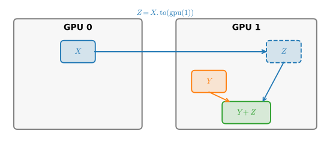
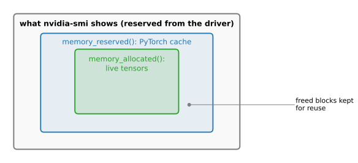
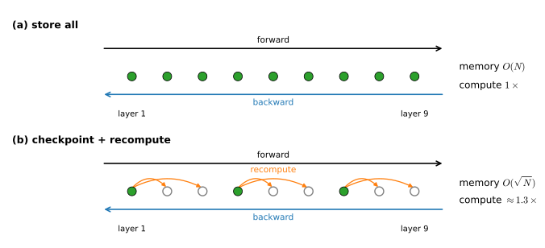
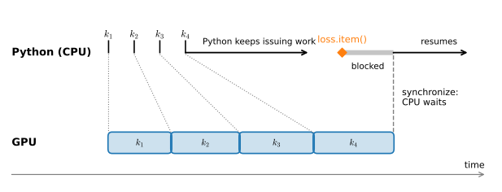

```{.python .input}
%load_ext d2lbook.tab
tab.interact_select('mxnet', 'pytorch', 'tensorflow', 'jax')
```

# GPUs, Devices, and Memory
:label:`sec_use_gpu_v2`

So far every tensor in this book has lived in main memory and every computation
has run on the CPU. Training at any interesting scale runs on an accelerator,
almost always a CUDA GPU, and that changes two things at once. First, every
tensor and every parameter now has a *home*, a device, and operations only
combine tensors that live on the same one; placing data well is your job.
Second, the GPU's memory is small compared with main memory, typically tens of
gigabytes, and it is the resource you will exhaust first: the daily question of
a single-GPU builder is not "is my model correct?" but "does it fit?". This
section covers both skills: naming devices and placing tensors and models on
them, then measuring what actually fills GPU memory during training, trading
compute for memory when it does not fit, and keeping the device busy once it
does. None of the code requires a GPU to run; the helpers we define fall back
to the CPU, and the memory measurements simply report more interesting numbers
when a GPU is present.

```{.python .input #gpus-devices-memory-gpus-devices-and-memory}
%%tab pytorch
import time
import torch
from torch import nn
from torch.nn import functional as F
from torch.utils.checkpoint import checkpoint
from d2l import torch as d2l
```

```{.python .input #gpus-devices-memory-gpus-devices-and-memory}
%%tab jax
import time
import jax
from jax import numpy as jnp
from flax import linen as nn
import optax
from d2l import jax as d2l
```

## Devices

:begin_tab:`pytorch`
In PyTorch every tensor carries a device. The CPU is `torch.device('cpu')` and
it stands for *all* physical CPU cores and all of main memory. A CUDA device
such as `torch.device('cuda:0')` is one specific card and its own memory; on a
machine with several GPUs, `cuda:1` is the second card, and plain `'cuda'` is
shorthand for `cuda:0`. To see what your machine has, run `nvidia-smi` in a
shell: it lists every card, its memory, and what is currently running on it.
We wrap device construction in two helpers that the rest of the book uses.
:end_tab:

:begin_tab:`jax`
In JAX every array lives on a device, and `jax.devices(backend)` returns the
device handles of a backend. `jax.devices('cpu')[0]` is the CPU, and it stands
for *all* physical CPU cores and all of main memory; `jax.devices('gpu')[i]`
is one specific CUDA card and its own memory. To see what your machine has,
run `nvidia-smi` in a shell: it lists every card, its memory, and what is
currently running on it. We wrap device lookup in two helpers that the rest
of the book uses.
:end_tab:

```{.python .input #gpus-devices-memory-devices-1}
%%tab pytorch
def cpu():  #@save
    """Get the CPU device."""
    return torch.device('cpu')

def gpu(i=0):  #@save
    """Get a GPU device."""
    return torch.device(f'cuda:{i}')

cpu(), gpu(), gpu(1)
```

```{.python .input #gpus-devices-memory-devices-1}
%%tab jax
def cpu():  #@save
    """Get the CPU device."""
    return jax.devices('cpu')[0]

def gpu(i=0):  #@save
    """Get a GPU device."""
    return jax.devices('gpu')[i]

cpu()
```

:begin_tab:`pytorch`
Note that constructing a device object is free and always succeeds, whether or
not the hardware exists; the check happens only when you try to put data on it.
:end_tab:

:begin_tab:`jax`
Note that a JAX device object is a handle to hardware that actually exists:
`jax.devices('gpu')` raises a `RuntimeError` when no GPU backend is present,
rather than returning a placeholder (which is why the demo above calls only
`cpu()`). Our next helper therefore counts GPUs through a `try`/`except`.
:end_tab:

We can query how many GPUs are actually available.

```{.python .input #gpus-devices-memory-devices-2}
%%tab pytorch
def num_gpus():  #@save
    """Get the number of available GPUs."""
    return torch.cuda.device_count()

num_gpus()
```

```{.python .input #gpus-devices-memory-devices-2}
%%tab jax
def num_gpus():  #@save
    """Get the number of available GPUs."""
    try:
        return jax.device_count('gpu')
    except:
        return 0  # No GPU backend found

num_gpus()
```

Now we define two convenient functions that allow us
to run code even if the requested GPUs do not exist.

```{.python .input #gpus-devices-memory-devices-3}
def try_gpu(i=0):  #@save
    """Return gpu(i) if exists, otherwise return cpu()."""
    if num_gpus() >= i + 1:
        return gpu(i)
    return cpu()

def try_all_gpus():  #@save
    """Return all available GPUs, or [cpu(),] if no GPU exists."""
    return [gpu(i) for i in range(num_gpus())]

try_gpu(), try_gpu(10), try_all_gpus()
```

:begin_tab:`pytorch`
CUDA is not the only accelerator string PyTorch understands. Apple-silicon
Macs expose their GPU as `mps`, Intel GPUs appear as `xpu`, and TPUs are
reachable through JAX; PyTorch now bundles the whole family behind the
`torch.accelerator` namespace, whose `device_count()` and
`current_accelerator()` do generically what our helpers do for CUDA. We keep
our own helpers anyway: they give all four of the book's implementations one
vocabulary, and they degrade to the CPU instead of failing, which is exactly
what lets this book's code run unchanged on a laptop. The book standardizes on
CPU plus CUDA; everything below transfers to the other accelerator types with
little more than a renamed device string.
:end_tab:

:begin_tab:`jax`
CUDA is not the only backend JAX understands: the same program runs on CPU,
GPU, or TPU, and plain `jax.devices()` lists the devices of the *default*
backend, which is the best accelerator present. We keep our own helpers
anyway: they give all four of the book's implementations one vocabulary, and
they degrade to the CPU instead of failing, which is exactly what lets this
book's code run unchanged on a laptop. The book standardizes on CPU plus
CUDA; everything below transfers to TPUs with no change beyond the backend
name.
:end_tab:

## Tensors, Models, and Devices

:begin_tab:`pytorch`
By default, tensors are created on the CPU. We can query where a tensor lives.
:end_tab:

:begin_tab:`jax`
By default, arrays are created on the *default device*, the first accelerator
when one exists and the CPU otherwise. We can query where an array lives.
:end_tab:

```{.python .input #gpus-devices-memory-tensors-models-and-devices-1}
%%tab pytorch
x = torch.tensor([1, 2, 3])
x.device
```

```{.python .input #gpus-devices-memory-tensors-models-and-devices-1}
%%tab jax
x = jnp.array([1, 2, 3])
x.device
```

:begin_tab:`pytorch`
To create a tensor somewhere else, pass a `device` argument. Creating data
directly on the target device is better than creating it on the CPU and moving
it: the tensor then never occupies main memory or crosses the bus at all.
:end_tab:

:begin_tab:`jax`
To place an array somewhere specific, `jax.device_put(x, device)` copies it
there, and the result is *committed* to that device: JAX will keep it and
every computation on it exactly where you said. Arrays created without an
explicit placement, like `x` above, are *uncommitted*; they sit on the default
device but JAX may treat them as movable when they meet committed data.
:end_tab:

```{.python .input #gpus-devices-memory-tensors-models-and-devices-2}
%%tab pytorch
X = torch.ones(2, 3, device=try_gpu())
X
```

```{.python .input #gpus-devices-memory-tensors-models-and-devices-2}
%%tab jax
X = jax.device_put(jnp.ones((2, 3)), try_gpu())
X
```

On a machine with two GPUs we can put a second tensor on the second card
(on your machine, `try_gpu(1)` substitutes whatever is available).

```{.python .input #gpus-devices-memory-tensors-models-and-devices-3}
%%tab pytorch
Y = torch.rand(2, 3, device=try_gpu(1))
Y
```

```{.python .input #gpus-devices-memory-tensors-models-and-devices-3}
%%tab jax
Y = jax.device_put(jax.random.uniform(jax.random.PRNGKey(0), (2, 3)),
                   try_gpu(1))
Y
```

### Copying Between Devices

:begin_tab:`pytorch`
Whenever we operate on multiple tensors, they need to be on the same device.
If `X` sits on the first GPU and `Y` on the second, `X + Y` raises
`RuntimeError: Expected all tensors to be on the same device`, which is
probably the single most common error message of a beginner's GPU life.
PyTorch refuses to guess: an implicit copy would hide a slow bus transfer
inside an innocent-looking `+`, and you would never find it. Instead we copy
explicitly, as in :numref:`fig_copyto`, and then add.
:end_tab:

:begin_tab:`jax`
Whenever we operate on multiple arrays, they need to be on the same device.
Uncommitted arrays are flexible: JAX decides where the result lives. But `X`
is committed to the first GPU and `Y` to the second, and adding them raises an
error about arrays on different devices, probably the most common error
message of a beginner's GPU life. JAX refuses to guess between two explicit
placements: an implicit copy would hide a slow bus transfer inside an
innocent-looking `+`, and you would never find it. Instead we copy
explicitly, as in :numref:`fig_copyto`, and then add.
:end_tab:


:label:`fig_copyto`

```{.python .input #gpus-devices-memory-copying-between-devices-1}
%%tab pytorch
Z = X.to(try_gpu(1))
print(X)
print(Z)
```

```{.python .input #gpus-devices-memory-copying-between-devices-1}
%%tab jax
Z = jax.device_put(X, try_gpu(1))
print(X)
print(Z)
```

Now that `Z` and `Y` live on the same device, we can add them.

```{.python .input #gpus-devices-memory-copying-between-devices-2}
%%tab pytorch
Y + Z
```

```{.python .input #gpus-devices-memory-copying-between-devices-2}
%%tab jax
Y + Z
```

:begin_tab:`pytorch`
What if `Z` already lives on the target device? Then `.to` returns `Z` itself
rather than making a copy, so calling it defensively costs nothing.
:end_tab:

:begin_tab:`jax`
What if `Z` already lives on the target device? Then `device_put` skips the
transfer: the array it returns shares `Z`'s buffer, so calling it defensively
costs nothing. Comparing the buffer addresses confirms that no copy was made.
:end_tab:

```{.python .input #gpus-devices-memory-copying-between-devices-3}
%%tab pytorch
Z.to(try_gpu(1)) is Z
```

```{.python .input #gpus-devices-memory-copying-between-devices-3}
%%tab jax
Z2 = jax.device_put(Z, try_gpu(1))
Z2.unsafe_buffer_pointer() == Z.unsafe_buffer_pointer()
```

The reason the framework makes you spell out every copy is the cost model. A
modern GPU multiplies matrices hundreds of times faster than it can receive
data over the PCIe bus, so a transfer in the wrong place can erase the
speedup you bought the GPU for. The discipline that follows is simple: move data to the device
once, at the boundary of the computation, and keep everything inside the
training loop on one device. Many small transfers are worse than one big one,
and a transfer hidden in an inner loop is worst of all.

### Models on a Device

:begin_tab:`pytorch`
A model is a tree of parameter tensors, and `net.to(device)` moves the whole
tree in one call.
:end_tab:

:begin_tab:`jax`
A model's parameters are literally a tree of arrays, the pytree that `init`
returns, and `jax.device_put` accepts a pytree: one call places every leaf.
:end_tab:

```{.python .input #gpus-devices-memory-models-on-a-device-1}
%%tab pytorch
net = nn.Sequential(nn.LazyLinear(1))
net = net.to(device=try_gpu())
net(X)
```

```{.python .input #gpus-devices-memory-models-on-a-device-1}
%%tab jax
net = nn.Sequential([nn.Dense(1)])
params = net.init(d2l.get_key(), X)
params = jax.device_put(params, try_gpu())
net.apply(params, X)
```

The input arrived on the device, the parameters live on the device, so the
output is computed and stored there too. Let's confirm where the parameters
ended up.

```{.python .input #gpus-devices-memory-models-on-a-device-2}
%%tab pytorch
net[0].weight.device
```

```{.python .input #gpus-devices-memory-models-on-a-device-2}
%%tab jax
jax.tree_util.tree_map(lambda p: p.device, params)
```

:begin_tab:`pytorch`
Two rules keep models device-clean. Move the model *before* constructing the
optimizer, so that the optimizer's state is created alongside the parameters
it updates. And when `forward` needs a fresh tensor, create it on the input's
device (`torch.zeros(n, device=X.device)`) rather than on the default CPU;
non-parameter state that should follow the model belongs in a buffer
(:numref:`sec_parameters_v2`), which `.to(device)` moves along with everything
else.
:end_tab:

:begin_tab:`jax`
Device hygiene is short in JAX because all state is explicit. The optimizer's
state is built from the parameter pytree (`optax`'s `init(params)`), so it is
born wherever the parameters live; and inside a compiled function you never
place anything, since the computation runs where its inputs are. Keep the
parameters and each batch on one device and everything downstream follows.
:end_tab:

## GPU Memory

:begin_tab:`pytorch`
Here is a puzzle that every PyTorch user hits in their first week. You delete
your tensors, yet `nvidia-smi` still shows gigabytes in use; is that a leak?
It is not, and the explanation is the right mental model for everything else
in this section. Requesting memory from the CUDA driver is slow, so PyTorch
uses a *caching allocator*: when a tensor dies, its block is not returned to
the driver but kept in a per-process cache for the next tensor of a similar
size. PyTorch therefore reports two numbers. `torch.cuda.memory_allocated()`
counts bytes held by live tensors; `torch.cuda.memory_reserved()` counts
those bytes plus the cache. `nvidia-smi` sees the process from the outside,
so it reports roughly the reserved figure, which grows to the high-water mark
of your program and stays there. :numref:`fig_bg_allocator` shows how the
three views nest inside one another.
:end_tab:

:begin_tab:`jax`
Here is a puzzle that every JAX user hits in their first week. You create one
small array, yet `nvidia-smi` shows the card nearly full; is that a leak? It
is not, and the explanation is the right mental model for everything else in
this section. Requesting memory from the CUDA driver is slow, so on first use
XLA *preallocates* about 75% of the GPU's memory as one block and hands out
pieces of it from its own allocator (the fraction is controlled by the
`XLA_PYTHON_CLIENT_PREALLOCATE` and `XLA_PYTHON_CLIENT_MEM_FRACTION`
environment variables). `nvidia-smi` sees the process from the outside, so it
reports the whole preallocated block no matter how little of it your arrays
occupy. The real accounting lives inside: `device.memory_stats()` returns a
dictionary whose `bytes_in_use` entry counts live buffers and whose
`peak_bytes_in_use` entry is their high-water mark, the same nesting of views
that :numref:`fig_bg_allocator` sketches. On the CPU backend there is no such
allocator and the call returns `None`.
:end_tab:


:label:`fig_bg_allocator`

```{.python .input #gpus-devices-memory-gpu-memory}
%%tab pytorch
if torch.cuda.is_available():
    def report(tag):
        print(f'{tag}: {torch.cuda.memory_allocated() / 2**20:7.1f} MiB '
              f'allocated, {torch.cuda.memory_reserved() / 2**20:7.1f} MiB '
              'reserved')
    big = torch.zeros(256, 1024, 1024, device=gpu())  # 1 GiB of float32
    report('after creating big')
    del big
    report('after deleting it ')
else:
    print('No CUDA device: both counters read 0 on the CPU.')
```

```{.python .input #gpus-devices-memory-gpu-memory}
%%tab jax
if num_gpus() > 0:
    def report(tag):
        s = gpu().memory_stats()
        print(f'{tag}: {s["bytes_in_use"] / 2**20:7.1f} MiB in use, '
              f'{s["peak_bytes_in_use"] / 2**20:7.1f} MiB peak')
    big = jnp.zeros((256, 1024, 1024))  # 1 GiB of float32
    big.block_until_ready()
    report('after creating big')
    del big
    report('after deleting it ')
else:
    print('No GPU: memory_stats() returns None on the CPU backend.')
```

:begin_tab:`pytorch`
After the deletion, `memory_allocated()` falls by a gibibyte while
`memory_reserved()` does not move: the block went back to the cache, ready for
reuse, and `nvidia-smi` keeps showing it. `torch.cuda.empty_cache()` returns
the cached blocks to the driver, which is occasionally useful when another
process needs the card, but do not call it inside a training loop: it forces
the allocator to make slow driver requests all over again.
:end_tab:

:begin_tab:`jax`
On a GPU, `bytes_in_use` falls by a gibibyte the moment the buffer's last
reference dies, while `nvidia-smi` does not move at all: the block returns to
XLA's preallocated pool, not to the driver. If another process must share the
card, set `XLA_PYTHON_CLIENT_PREALLOCATE=false` in the environment before the
first computation; allocations then go to the driver on demand, visibly to
`nvidia-smi` but more slowly.
:end_tab:

### What Fills Memory During Training

In :numref:`sec_parameters_v2` we did the bookkeeping on paper: a model with
$N$ parameters costs $4N$ bytes for float32 weights, another $4N$ for their
gradients, and $8N$ for Adam's two moment estimates, roughly $16N$ before any
data arrives. The remaining term, the *activations*, is different in kind:
backpropagation must remember the intermediate results of the forward pass in
order to compute gradients, and their size scales with the batch size and with
the width of every layer, while the $16N$ does not.

:begin_tab:`pytorch`
We can watch each term arrive by reading `memory_allocated()` at four points
of a single training step.
:end_tab:

:begin_tab:`jax`
We can watch the terms arrive by reading `bytes_in_use` around the pieces of
a training step. The activations are the exception: they exist only while the
gradient computation runs, so they leave their trace in `peak_bytes_in_use`
rather than in a reading you can take afterwards.
:end_tab:

```{.python .input #gpus-devices-memory-what-fills-memory-during-training}
%%tab pytorch
if torch.cuda.is_available():
    def allocated():
        return f'{torch.cuda.memory_allocated() / 2**20:7.1f} MiB'
    net = nn.Sequential(nn.Linear(1024, 4096), nn.ReLU(),
                        nn.Linear(4096, 4096), nn.ReLU(),
                        nn.Linear(4096, 4096), nn.ReLU(),
                        nn.Linear(4096, 10)).to(gpu())
    opt = torch.optim.Adam(net.parameters())
    X = torch.randn(4096, 1024, device=gpu())
    y = torch.randint(0, 10, (4096,), device=gpu())
    print('weights           ', allocated())
    loss = F.cross_entropy(net(X), y)
    print('+ activations     ', allocated())
    loss.backward()
    print('+ gradients       ', allocated())
    opt.step()
    print('+ optimizer state ', allocated())
else:
    print('No CUDA device: run this cell on a GPU to see the four plateaus.')
```

```{.python .input #gpus-devices-memory-what-fills-memory-during-training}
%%tab jax
if num_gpus() > 0:
    def in_use():
        s = gpu().memory_stats()
        return f'{s["bytes_in_use"] / 2**20:7.1f} MiB'
    net = nn.Sequential([nn.Dense(4096), nn.relu, nn.Dense(4096), nn.relu,
                         nn.Dense(4096), nn.relu, nn.Dense(10)])
    key1, key2 = jax.random.split(d2l.get_key())
    X = jax.random.normal(key1, (4096, 1024))
    y = jax.random.randint(key2, (4096,), 0, 10)
    def loss(params):
        logits = net.apply(params, X)
        return optax.softmax_cross_entropy_with_integer_labels(
            logits, y).mean()
    params = jax.block_until_ready(net.init(d2l.get_key(), X))
    print('weights              ', in_use())
    grads = jax.block_until_ready(jax.grad(loss)(params))
    print('+ gradients          ', in_use())
    opt_state = jax.block_until_ready(optax.adam(1e-3).init(params))
    print('+ optimizer state    ', in_use())
    peak = gpu().memory_stats()['peak_bytes_in_use'] / 2**20
    print(f'peak with activations {peak:7.1f} MiB')
else:
    print('No GPU: run this cell on a GPU to see the terms arrive.')
```

:begin_tab:`pytorch`
The four readings map onto the accounting. The first is the weights alone
(about $4N$ bytes, plus the input batch). The second jumps by the size of the
stored activations, here several times the weights, because the batch is
large. The third *falls* back: `backward` frees the activations as it consumes
them and leaves behind gradients exactly the size of the weights. The fourth
adds $8N$ at the first `opt.step()`, when Adam lazily creates its moment
buffers. From then on the loop cycles between plateaus two and three; the
weights, gradients, and optimizer state are permanent residents. The practical
consequence: when you are out of memory, the knob that works immediately is
the batch size, because it scales the one term the model architecture does not
fix. If a *growing* staircase appears across steps instead of this steady
cycle, look for tensors that keep the computation graph alive between
iterations, such as accumulating `loss` rather than `loss.item()` into a
running total.
:end_tab:

:begin_tab:`jax`
The readings map onto the accounting. The first is the weights alone (about
$4N$ bytes, plus the input batch). The second adds gradients exactly the size
of the weights: in JAX a gradient is not a field attached to a parameter but
a second pytree of the same shape, returned by `jax.grad`. The third adds
$8N$ when `optax.adam`'s `init` builds its two moment pytrees from the
parameters, placed wherever they live. The activations never appear as a
plateau: they exist only inside the `jax.grad` call, so the peak reading,
several times the weights here because the batch is large, is the only
evidence they leave. The practical consequence is the same everywhere: when
you are out of memory, the knob that works immediately is the batch size,
because it scales the one term the model architecture does not fix. If a
*growing* staircase appears across steps, look for device arrays accumulating
on the Python side, such as appending the loss array itself, rather than
`loss.item()`, to a running log.
:end_tab:

### Trading Compute for Memory: Activation Checkpointing

The activation term has a second knob. Backpropagation stores every
intermediate result only to read each one exactly once, on the way back.
*Activation checkpointing* :cite:`Chen.Xu.Zhang.ea.2016` refuses to store
them: it keeps only the inputs to selected segments of the network, and during
the backward pass reruns each segment's forward computation to regenerate the
activations it needs. The price is roughly one extra forward pass, some 30-40%
more compute per step; the reward is that activation memory drops from "every
layer" to "one segment at a time", as sketched in :numref:`fig_bg_activation_checkpoint`.
The trade pays off exactly where deep learning spends most of its time: deep
stacks of identical blocks, such as the residual stack we assembled in
:numref:`sec_model_construction_v2` and every Transformer you will meet later.
We rebuild a compact version of that block here.


:label:`fig_bg_activation_checkpoint`

```{.python .input #gpus-devices-memory-trading-compute-for-memory-activation-checkpointing-1}
%%tab pytorch
class ResidualBlock(nn.Module):  # As in :numref:`sec_model_construction_v2`
    def __init__(self, num_hiddens):
        super().__init__()
        self.body = nn.Sequential(
            nn.Linear(num_hiddens, num_hiddens), nn.ReLU(),
            nn.Linear(num_hiddens, num_hiddens), nn.ReLU())

    def forward(self, X):
        return X + self.body(X)

def run_stack(blocks, X, use_checkpoint=False):
    for blk in blocks:
        X = checkpoint(blk, X, use_reentrant=False) if use_checkpoint \
            else blk(X)
    return X
```

```{.python .input #gpus-devices-memory-trading-compute-for-memory-activation-checkpointing-1}
%%tab jax
class ResidualBlock(nn.Module):  # As in :numref:`sec_model_construction_v2`
    num_hiddens: int

    @nn.compact
    def __call__(self, X):
        Y = nn.relu(nn.Dense(self.num_hiddens)(X))
        Y = nn.relu(nn.Dense(self.num_hiddens)(Y))
        return X + Y

def run_stack(block, params_list, X, use_checkpoint=False):
    f = jax.checkpoint(block.apply) if use_checkpoint else block.apply
    for p in params_list:
        X = f(p, X)
    return X
```

:begin_tab:`pytorch`
`torch.utils.checkpoint.checkpoint(blk, X)` runs `blk(X)` without storing its
internals and remembers just enough to recompute them later. Recomputation
must reproduce the original forward pass bit for bit, so by default
`checkpoint` also stashes and restores the random-number-generator state,
which keeps segments containing dropout correct at a small extra cost
(`preserve_rng_state=False` skips it for deterministic segments).
:end_tab:

:begin_tab:`jax`
`jax.checkpoint` (also exported as `jax.remat`) is a function transformation
like `grad` and `jit`: `jax.checkpoint(f)` behaves exactly like `f` when
called, but when differentiated it saves only `f`'s inputs and recomputes the
internals during the backward pass. Randomness needs no special handling:
JAX functions receive their PRNG keys as explicit arguments, so recomputation
with the same key reproduces a segment containing dropout bit for bit by
construction.
:end_tab:

Before measuring memory, we should verify the claim that nothing about the
result changes: the gradients through a checkpointed stack must equal the
ordinary ones.

```{.python .input #gpus-devices-memory-trading-compute-for-memory-activation-checkpointing-2}
%%tab pytorch
torch.manual_seed(0)
blocks = nn.Sequential(*[ResidualBlock(64) for _ in range(4)])
X = torch.randn(32, 64)

def stack_grads(use_checkpoint):
    blocks.zero_grad(set_to_none=True)
    run_stack(blocks, X, use_checkpoint).sum().backward()
    return [p.grad.clone() for p in blocks.parameters()]

for g, g_ckpt in zip(stack_grads(False), stack_grads(True)):
    assert torch.allclose(g, g_ckpt)
print('checkpointed gradients match the ordinary ones')
```

```{.python .input #gpus-devices-memory-trading-compute-for-memory-activation-checkpointing-2}
%%tab jax
block = ResidualBlock(64)
X = jax.random.normal(jax.random.PRNGKey(1), (32, 64))
params_list = [block.init(k, X)
               for k in jax.random.split(jax.random.PRNGKey(0), 4)]

def stack_grads(use_checkpoint):
    loss = lambda ps: run_stack(block, ps, X, use_checkpoint).sum()
    return jax.tree_util.tree_leaves(jax.grad(loss)(params_list))

for g, g_ckpt in zip(stack_grads(False), stack_grads(True)):
    assert jnp.allclose(g, g_ckpt)
print('checkpointed gradients match the ordinary ones')
```

That check runs anywhere, CPU included. The memory effect needs a GPU and a
stack deep enough for the difference to be unambiguous: sixteen blocks of
width 1024 at batch size 8192.

```{.python .input #gpus-devices-memory-trading-compute-for-memory-activation-checkpointing-3}
%%tab pytorch
if torch.cuda.is_available():
    blocks = nn.Sequential(*[ResidualBlock(1024) for _ in range(16)]).to(gpu())
    X = torch.randn(8192, 1024, device=gpu())
    for use_checkpoint in (False, True):
        blocks.zero_grad(set_to_none=True)
        torch.cuda.synchronize()
        torch.cuda.reset_peak_memory_stats()
        t = time.time()
        run_stack(blocks, X, use_checkpoint).sum().backward()
        torch.cuda.synchronize()
        print(f'checkpointing={use_checkpoint!s:5}  peak '
              f'{torch.cuda.max_memory_allocated() / 2**20:6.0f} MiB, '
              f'{time.time() - t:.2f} sec')
else:
    print('No CUDA device: peak-memory comparison needs a GPU.')
```

```{.python .input #gpus-devices-memory-trading-compute-for-memory-activation-checkpointing-3}
%%tab jax
if num_gpus() > 0:
    block = ResidualBlock(1024)
    X = jax.random.normal(jax.random.PRNGKey(1), (8192, 1024))
    params_list = [block.init(k, X)
                   for k in jax.random.split(jax.random.PRNGKey(0), 16)]
    for use_checkpoint in (True, False):  # low first: the peak only grows
        grad_fn = jax.jit(jax.grad(
            lambda ps: run_stack(block, ps, X, use_checkpoint).sum()))
        jax.block_until_ready(grad_fn(params_list))  # compile outside timing
        t = time.time()
        jax.block_until_ready(grad_fn(params_list))
        peak = gpu().memory_stats()['peak_bytes_in_use'] / 2**20
        print(f'checkpointing={use_checkpoint!s:5}  peak {peak:6.0f} MiB, '
              f'{time.time() - t:.2f} sec')
else:
    print('No GPU: peak-memory comparison needs a GPU.')
```

Without checkpointing, the peak carries the activations of all sixteen blocks
at once; with it, only the block inputs plus the recomputed activations of a
single block, at the cost of a slower step. When a model almost fits, this
trade is the difference between training and not training, which is why large
Transformer training runs use it as a matter of course.

## Don't Break the Pipeline

:begin_tab:`pytorch`
The GPU runs ahead of Python. When you write `B = A @ A`, PyTorch does not
wait for the multiplication: it queues a kernel on the device and returns
immediately, and Python races on to enqueue the next operation. This
asynchrony is where much of the speed comes from, because the CPU can prepare
work while the GPU crunches. It also means that timing or logging naively
measures nothing, or worse, stalls everything. We can see the gap between
*queueing* work and the work *finishing*.
:end_tab:

:begin_tab:`jax`
The device runs ahead of Python; in JAX this *asynchronous dispatch* is the
native execution model on every backend, the CPU included. When you write
`B = A @ A`, JAX does not wait for the multiplication: it queues the
computation, returns an array that is really a promise of the result, and
Python races on to enqueue the next operation. This asynchrony is where much
of the speed comes from, because Python can prepare work while the device
crunches. It also means that timing or logging naively measures nothing, or
worse, stalls everything. The explicit synchronization point is
`block_until_ready()`; with it we can see the gap between *queueing* work and
the work *finishing*, on this machine's CPU as well as on any GPU.
:end_tab:

```{.python .input #gpus-devices-memory-don-t-break-the-pipeline-1}
%%tab pytorch
if torch.cuda.is_available():
    A = torch.randn(4096, 4096, device=gpu())
    torch.cuda.synchronize()
    t = time.time()
    for _ in range(32):
        B = A @ A
    print(f'time to queue 32 matrix products: {time.time() - t:.4f} sec')
    torch.cuda.synchronize()
    print(f'time until they all finished:     {time.time() - t:.4f} sec')
else:
    print('No CUDA device: CPU operations run synchronously.')
```

```{.python .input #gpus-devices-memory-don-t-break-the-pipeline-1}
%%tab jax
A = jax.random.normal(jax.random.PRNGKey(0), (2000, 2000)) / 45
(A @ A).block_until_ready()  # Warm up
B, t = A, time.time()
for _ in range(32):
    B = B @ A  # Chained, so the last result implies all finished
print(f'time to queue 32 matrix products: {time.time() - t:.4f} sec')
B.block_until_ready()
print(f'time until they all finished:     {time.time() - t:.4f} sec')
```

:begin_tab:`pytorch`
Python returned from the loop in about a millisecond; the products were still
running. Any operation that needs a concrete value on the host forces a
*synchronization point*: `.item()`, `.numpy()`, `print`, an `if` on a tensor's
value. Each one makes Python block until the queue drains, and the device then
sits idle until Python catches up. A `print(loss.item())` in the inner loop
can serialize the whole pipeline this way, once per step, as
:numref:`fig_bg_async_queue` lays out. The fix is not to give up monitoring
but to move it off the hot path: keep running statistics on the device and
transfer them once per epoch, or hand values to a background consumer, which
is exactly what our `ProgressBoard` from :numref:`sec_oo-design` does when the
`Trainer` plots the loss.
:end_tab:

:begin_tab:`jax`
Python returned from the loop in well under a millisecond; the products were
still running. Any operation that needs a concrete value on the host forces a
*synchronization point*: `.item()`, `np.asarray`, `print`, an `if` on an
array's value, and `block_until_ready()` itself, whose job is to make the
synchronization explicit (our timings above depend on it). Each one makes
Python block until the queued work drains, and the device then sits idle
until Python catches up. A `print(loss.item())` in the inner loop can
serialize the whole pipeline this way, once per step, as
:numref:`fig_bg_async_queue` lays out. The fix is not to give up monitoring
but to move it off the hot path: keep running statistics on the device and
transfer them once per epoch, or hand values to a background consumer, which
is exactly what our `ProgressBoard` from :numref:`sec_oo-design` does when the
`Trainer` plots the loss.
:end_tab:


:label:`fig_bg_async_queue`

:begin_tab:`pytorch`
The same overlap idea applies to getting data *onto* the device. An ordinary
host-to-device copy must first move the batch into non-pageable ("pinned")
memory that the DMA engine can read, then transfer it, and the call blocks
Python throughout. If the source already sits in pinned memory, the copy can
be issued with `non_blocking=True` and Python continues immediately, preparing
the next batch while the transfer overlaps the GPU's current work.
:end_tab:

:begin_tab:`jax`
The same overlap idea applies to getting data *onto* the device, and in JAX
it needs no per-tensor flag: `device_put` dispatches the transfer and returns
immediately, so Python prepares the next batch while the copy overlaps the
device's current work, which is exactly the effect other stacks arrange with
pinned host buffers. The full treatment of asynchrony, streams, and
multi-device parallelism is in :numref:`chap_performance`.
:end_tab:

```{.python .input #gpus-devices-memory-don-t-break-the-pipeline-2}
%%tab pytorch
if torch.cuda.is_available():
    x = torch.randn(16, 3, 224, 224)  # A typical image batch
    x_pinned = x.pin_memory()
    def copy_time(src, non_blocking=False, n=100):
        torch.cuda.synchronize()
        t = time.time()
        for _ in range(n):
            src.to(gpu(), non_blocking=non_blocking)
        torch.cuda.synchronize()
        return (time.time() - t) / n * 1e3
    print(f'pageable copy:              {copy_time(x):.3f} ms')
    print(f'pinned, non-blocking copy:  {copy_time(x_pinned, True):.3f} ms')
else:
    print('No CUDA device: host-to-device copies do not arise.')
```

:begin_tab:`pytorch`
Two caveats keep this technique honest. Pinning is itself expensive, so
pinning a tensor once just to copy it once buys nothing; the win comes from
*reusing* pinned buffers across iterations, which is what
`DataLoader(pin_memory=True)` does for you, and why that flag plus
`non_blocking=True` in your transfer is the standard pairing. And a
non-blocking copy is a promise, not a completed fact: mutating the source CPU
tensor before the transfer finishes silently corrupts the data on the device.
The full treatment of asynchrony, streams, and multi-device parallelism is in
:numref:`chap_performance`.
:end_tab:

## The Trainer, Now with Devices

:begin_tab:`pytorch`
In :numref:`sec_oo-design` the `Trainer` accepted a `num_gpus` argument and
ignored it. We can now redeem that promise with everything this section
taught: the model moves to the device *once*, before training, and every batch
streams over per step, at the boundary of the computation.
:end_tab:

:begin_tab:`jax`
In :numref:`sec_oo-design` the `Trainer` accepted a `num_gpus` argument and
ignored it. We can now redeem that promise with everything this section
taught: the parameters are created on the accelerator *once*, before training
(JAX initializes arrays on the default device, which is the accelerator
whenever one exists), and every batch streams over per step, at the boundary
of the computation.
:end_tab:

```{.python .input #gpus-devices-memory-the-trainer-now-with-devices-1}
%%tab pytorch
@d2l.add_to_class(d2l.Trainer)  #@save
def __init__(self, max_epochs, num_gpus=0, gradient_clip_val=0):
    self.save_hyperparameters()
    self.gpus = [d2l.gpu(i) for i in range(min(num_gpus, d2l.num_gpus()))]

@d2l.add_to_class(d2l.Trainer)  #@save
def prepare_batch(self, batch):
    if self.gpus:
        batch = [d2l.to(a, self.gpus[0]) for a in batch]
    return batch

@d2l.add_to_class(d2l.Trainer)  #@save
def prepare_model(self, model):
    model.trainer = self
    model.board.xlim = [0, self.max_epochs]
    if self.gpus:
        model.to(self.gpus[0])
    self.model = model
```

```{.python .input #gpus-devices-memory-the-trainer-now-with-devices-1}
%%tab jax
@d2l.add_to_class(d2l.Trainer)  #@save
def __init__(self, max_epochs, num_gpus=0, gradient_clip_val=0):
    self.save_hyperparameters()
    self.gpus = [d2l.gpu(i) for i in range(min(num_gpus, d2l.num_gpus()))]

@d2l.add_to_class(d2l.Trainer)  #@save
def prepare_batch(self, batch):
    if self.gpus:
        batch = [d2l.to(a, self.gpus[0]) for a in batch]
    return batch
```

:begin_tab:`pytorch`
The `min(num_gpus, d2l.num_gpus())` makes the request a ceiling rather than a
demand: on a machine with no GPU, `self.gpus` is empty, both hooks become
no-ops, and training proceeds on the CPU. Every `Trainer(num_gpus=1)` you see
from the next chapter onward relies on this fallback, which is how one
codebase serves both the laptop you are reading on and a GPU server. As a
capstone we train a classifier built from this chapter's residual blocks on
Fashion-MNIST; the `Trainer` places the model, moves each batch, and the
memory budget of the run is exactly the four-plateau accounting from above.
:end_tab:

:begin_tab:`jax`
The `min(num_gpus, d2l.num_gpus())` makes the request a ceiling rather than a
demand: on a machine with no GPU, `self.gpus` is empty, `prepare_batch` is a
no-op, and training proceeds on the CPU. There is no model hook to patch,
because `fit` initializes the parameters itself and JAX creates them on the
default device, the GPU whenever one is present. Every `Trainer(num_gpus=1)`
you see from the next chapter onward relies on this fallback, which is how
one codebase serves both the laptop you are reading on and a GPU server. As a
capstone we train a classifier built from this chapter's residual blocks on
Fashion-MNIST; the `Trainer` moves each batch, and the memory budget of the
run is exactly the accounting from above.
:end_tab:

```{.python .input #gpus-devices-memory-the-trainer-now-with-devices-2}
%%tab pytorch
class ResMLPClassifier(d2l.Classifier):
    def __init__(self, num_hiddens=256, num_blocks=2, lr=0.1):
        super().__init__()
        self.save_hyperparameters()
        self.net = nn.Sequential(
            nn.Flatten(), nn.LazyLinear(num_hiddens), nn.ReLU(),
            *[ResidualBlock(num_hiddens) for _ in range(num_blocks)],
            nn.LazyLinear(10))

trainer = d2l.Trainer(max_epochs=1, num_gpus=1)
trainer.fit(ResMLPClassifier(), d2l.FashionMNIST(batch_size=256))
```

```{.python .input #gpus-devices-memory-the-trainer-now-with-devices-2}
%%tab jax
class ResMLPClassifier(d2l.Classifier):
    num_hiddens: int = 256
    num_blocks: int = 2
    lr: float = 0.1

    def setup(self):
        self.net = nn.Sequential([
            lambda x: x.reshape((x.shape[0], -1)),  # Flatten
            nn.Dense(self.num_hiddens), nn.relu,
            *[ResidualBlock(self.num_hiddens) for _ in range(self.num_blocks)],
            nn.Dense(10)])

trainer = d2l.Trainer(max_epochs=1, num_gpus=1)
trainer.fit(ResMLPClassifier(), d2l.FashionMNIST(batch_size=256))
```

## Summary

:begin_tab:`pytorch`
Every tensor and every parameter lives on a device, and operations combine
only co-located tensors; copies between devices are explicit (`.to`), slow
relative to compute, and belong at the boundary of the training loop, not
inside it. GPU memory during training holds four things: weights, gradients,
optimizer state (fixed by the model and optimizer), and activations (scaling
with batch size); `memory_allocated()` tracks live tensors while `nvidia-smi`
shows the caching allocator's high-water mark, so the two disagree by design.
Activation checkpointing recomputes instead of stores, trading roughly a third
more compute for activation memory. The GPU runs asynchronously ahead of
Python: `.item()`, `.numpy()`, and `print` are synchronization points that
stall the pipeline, and pinned memory with `non_blocking=True` lets transfers
overlap compute. The `Trainer` encodes the placement discipline: model moved
once, batches moved per step, graceful CPU fallback when no GPU exists.
:end_tab:

:begin_tab:`jax`
Every array and every parameter lives on a device, and committed arrays
combine only when co-located; copies between devices are explicit
(`device_put`), slow relative to compute, and belong at the boundary of the
training loop, not inside it. GPU memory during training holds four things:
weights, gradients, optimizer state (fixed by the model and optimizer), and
activations (scaling with batch size); `device.memory_stats()` tracks live
buffers inside the block XLA preallocates, while `nvidia-smi` shows the whole
block, so the two disagree by design. Activation checkpointing
(`jax.checkpoint`) recomputes instead of stores, trading roughly a third more
compute for activation memory. Dispatch is asynchronous on every backend:
`.item()`, `np.asarray`, and `print` are synchronization points that stall
the pipeline, and `block_until_ready()` is the explicit one that honest
timings need. The `Trainer` encodes the placement discipline: parameters
created on the device once, batches moved per step, graceful CPU fallback
when no GPU exists.
:end_tab:

## Exercises

1. Using the accounting model of this section, predict the peak memory of the
   four-plateau cell at batch sizes 64, 256, and 1024, then measure with
   `torch.cuda.max_memory_allocated()`. Where does the prediction break down,
   and what did it omit?
1. Increase the batch size in the checkpointing comparison until the
   non-checkpointed run raises an out-of-memory error. How much further can
   the checkpointed run go before it does too? Explain the ratio using the
   sizes of what each variant stores.
1. Time one epoch of the capstone training run with `print(loss.item())`
   after every step, and again printing only once per epoch. Explain the
   difference in terms of synchronization points.
1. If you have two GPUs, time 1000 matrix products of two $4096 \times 4096$
   matrices executed on one GPU, then 500 on each of two GPUs issued from the
   same loop. You should see almost linear scaling; explain why Python can
   drive both cards at once. Guard the experiment with `num_gpus() >= 2`.
