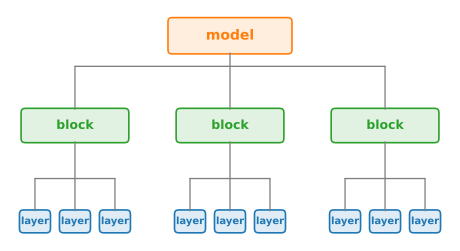

```{.python .input}
%load_ext d2lbook.tab
tab.interact_select('mxnet', 'pytorch', 'tensorflow', 'jax')
```

# Modules and Model Construction
:label:`sec_model_construction`

The networks we have trained so far were small enough to write down layer by
layer. The networks ahead are not: deep ResNets chain more than a hundred
convolutional layers :cite:`He.Zhang.Ren.ea.2016`, and a GPT-style language
model stacks dozens of identical Transformer blocks
:cite:`Radford.Wu.Child.ea.2019`. Such models are assembled from repeated
*blocks*, groups of layers treated as units of design. The abstraction that
makes blocks composable is the *module*.

A module is an object with three responsibilities: it owns *parameters*, it
owns *child modules*, and it implements a *forward computation* that maps
inputs to outputs. The definition is deliberately recursive. A fully connected
layer is a module (parameters, no children). A residual block is a module (no
direct parameters, a few child layers that own parameters). A hundred-layer
network is a module whose children are blocks whose children are layers. Most
models therefore have a tree-shaped module hierarchy, as sketched in
:numref:`fig_blocks`. Reusing one child at several sites turns that tree into
an object graph, a case we meet when tying parameters in
:numref:`sec_parameters`. Almost everything
this chapter does to a model, listing its parameters
(:numref:`sec_parameters`), moving it to a GPU (:numref:`sec_use_gpu`),
saving it to disk (:numref:`sec_read_write`), is implemented as a walk over
that tree.


:label:`fig_blocks`

```{.python .input #model-construction-modules-and-model-construction}
%%tab pytorch
from dataclasses import dataclass
from d2l import torch as d2l
import torch
from torch import nn
from torch.nn import functional as F
```

```{.python .input #model-construction-modules-and-model-construction}
%%tab jax
from dataclasses import dataclass
from d2l import jax as d2l
import jax
from jax import numpy as jnp
from flax import nnx
```

```{.python .input #model-construction-modules-and-model-construction}
%%tab tensorflow
from dataclasses import dataclass
import tensorflow as tf
```

```{.python .input #model-construction-modules-and-model-construction}
%%tab mxnet
from dataclasses import dataclass
from mxnet import init, np, npx
from mxnet.gluon import nn
npx.set_np()
```

## The Module Abstraction

:begin_tab:`pytorch`
In PyTorch the module class is `nn.Module`. We have used one of its subclasses
all along: `nn.Sequential` builds a model from a chain of layers, here the
familiar MLP with a 256-unit ReLU hidden layer and a 10-unit output layer.
:end_tab:

:begin_tab:`jax`
In JAX the module class is Flax's `nnx.Module`. We have used one of its
subclasses all along: `nnx.Sequential` builds a model from a chain of layers,
here the familiar MLP with a 256-unit ReLU hidden layer and a 10-unit output
layer. NNX modules own their initialized parameters, so construction requires
the layer widths and an RNG stream; a forward pass then uses the same direct
`net(X)` notation as the other frameworks.
:end_tab:

:begin_tab:`tensorflow`
In TensorFlow the module class is Keras's `tf.keras.Model`. We have used one
of its subclasses all along: `tf.keras.Sequential` builds a model from a list
of layers, here the familiar MLP with a 256-unit ReLU hidden layer and a
10-unit output layer. Keras attaches the activation to the `Dense` layer
itself rather than interposing a separate activation layer.
:end_tab:

:begin_tab:`mxnet`
In MXNet the module class is Gluon's `nn.Block`. We have used one of its
subclasses all along: `nn.Sequential` builds a model from a chain of layers
appended with its `add` method, here the familiar MLP with a 256-unit ReLU
hidden layer and a 10-unit output layer. Gluon attaches the activation to the
`Dense` layer itself rather than interposing a separate activation layer, and
one `initialize()` call stands between construction and the first forward
pass; what that call does, and what it defers, is where this section ends.
:end_tab:

```{.python .input #model-construction-the-module-abstraction-1}
%%tab pytorch
net = nn.Sequential(nn.LazyLinear(256), nn.ReLU(), nn.LazyLinear(10))

X = torch.rand(2, 20)
net(X).shape
```

```{.python .input #model-construction-the-module-abstraction-1}
%%tab jax
net = nnx.Sequential(nnx.Linear(20, 256, rngs=nnx.Rngs(0)), nnx.relu,
                     nnx.Linear(256, 10, rngs=nnx.Rngs(1)))

X = jax.random.uniform(d2l.get_key(), (2, 20))
net(X).shape
```

```{.python .input #model-construction-the-module-abstraction-1}
%%tab tensorflow
net = tf.keras.Sequential([tf.keras.layers.Dense(256, activation='relu'),
                           tf.keras.layers.Dense(10)])

X = tf.random.uniform((2, 20))
net(X).shape
```

```{.python .input #model-construction-the-module-abstraction-1}
%%tab mxnet
net = nn.Sequential()
net.add(nn.Dense(256, activation='relu'))
net.add(nn.Dense(10))
net.initialize()

X = np.random.uniform(size=(2, 20))
net(X).shape
```

:begin_tab:`pytorch`
`Sequential` is not a special construct. It is itself a module whose forward
computation runs its children in order, and the children are the three modules
we passed to it, stored under names in a registry:
:end_tab:

:begin_tab:`jax`
`Sequential` is not a special construct. It is itself a module whose forward
computation runs its children in order, and the children are the three modules
we passed to it. Each child owns its parameters; selecting `nnx.Param` state
gives a flat path view whose structure mirrors the module tree:
:end_tab:

:begin_tab:`tensorflow`
`Sequential` is not a special construct. It is itself a model whose forward
computation runs its children in order, and the children are the two layers
we passed to it, held in a tracked list:
:end_tab:

:begin_tab:`mxnet`
`Sequential` is not a special construct. It is itself a `Block` whose forward
computation runs its children in order, and the children are the two layers
`add` appended, stored under names in a registry that printing the model
displays:
:end_tab:

```{.python .input #model-construction-the-module-abstraction-2}
%%tab pytorch
net._modules
```

```{.python .input #model-construction-the-module-abstraction-2}
%%tab jax
[(path, value.shape)
 for path, value in nnx.state(net, nnx.Param).flat_state()]
```

```{.python .input #model-construction-the-module-abstraction-2}
%%tab tensorflow
net.layers
```

```{.python .input #model-construction-the-module-abstraction-2}
%%tab mxnet
net
```

:begin_tab:`pytorch`
This registry is what the `nn.Module` machinery traverses: `net.parameters()`
collects parameters by walking `_modules` recursively, and the same walk
underlies device movement and serialization. A module the registry does not
contain might as well not exist, a fact we will exploit for a demonstration
shortly.
:end_tab:

:begin_tab:`jax`
`nnx.state(net, nnx.Param)` selects the trainable leaves of the object graph.
Optimizer updates, device movement, and serialization traverse this state.
The parameters remain owned by their layers; filters give us a state view
without maintaining a second model representation by hand.
:end_tab:

:begin_tab:`tensorflow`
This list is what the Keras machinery traverses: `net.trainable_variables`
collects variables by walking the children recursively, and the same walk
underlies serialization. A layer the tracker does not see might as well not
exist, though as we will see shortly, Keras goes to some lengths to make
sure that cannot happen by accident.
:end_tab:

:begin_tab:`mxnet`
This registry is what the `Block` machinery traverses: `net.collect_params()`
gathers parameters by walking the children recursively and keys them by those
registry names (`0.weight`, `1.bias`, ...), and the same walk underlies
initialization, device movement, and serialization. A block the registry does
not contain might as well not exist, a fact we will exploit for a
demonstration shortly.
:end_tab:

:begin_tab:`pytorch`
`nn.Sequential` covers chains. For any other topology we subclass `nn.Module`
directly and supply the two methods that define a module: a constructor that
creates the children, and a `forward` method that uses them.
:end_tab:

:begin_tab:`jax`
`nnx.Sequential` covers chains. For any other topology we subclass
`nnx.Module` directly and supply an ordinary constructor that creates the
children and a `__call__` method that uses them.
:end_tab:

:begin_tab:`tensorflow`
`Sequential` covers chains. For any other topology we subclass
`tf.keras.Model` directly and supply the two methods that define a module: a
constructor that creates the children, and a `call` method that uses them.
:end_tab:

:begin_tab:`mxnet`
`nn.Sequential` covers chains. For any other topology we subclass `nn.Block`
directly and supply the two methods that define a module: a constructor that
creates the children, and a `forward` method that uses them.
:end_tab:

```{.python .input #model-construction-the-module-abstraction-3}
%%tab pytorch
class MLP(nn.Module):
    def __init__(self):
        super().__init__()
        self.hidden = nn.LazyLinear(256)
        self.out = nn.LazyLinear(10)

    def forward(self, X):
        return self.out(F.relu(self.hidden(X)))
```

```{.python .input #model-construction-the-module-abstraction-3}
%%tab jax
class MLP(nnx.Module):
    def __init__(self, rngs):
        self.hidden = nnx.Linear(20, 256, rngs=rngs)
        self.out = nnx.Linear(256, 10, rngs=rngs)

    def __call__(self, X):
        return self.out(nnx.relu(self.hidden(X)))
```

```{.python .input #model-construction-the-module-abstraction-3}
%%tab tensorflow
class MLP(tf.keras.Model):
    def __init__(self):
        super().__init__()
        self.hidden = tf.keras.layers.Dense(256, activation='relu')
        self.out = tf.keras.layers.Dense(10)

    def call(self, X):
        return self.out(self.hidden(X))
```

```{.python .input #model-construction-the-module-abstraction-3}
%%tab mxnet
class MLP(nn.Block):
    def __init__(self):
        super().__init__()
        self.hidden = nn.Dense(256, activation='relu')
        self.out = nn.Dense(10)

    def forward(self, X):
        return self.out(self.hidden(X))
```

```{.python .input #model-construction-the-module-abstraction-4}
%%tab pytorch
net = MLP()
net(X).shape
```

```{.python .input #model-construction-the-module-abstraction-4}
%%tab jax
net = MLP(nnx.Rngs(0))
net(X).shape
```

```{.python .input #model-construction-the-module-abstraction-4}
%%tab tensorflow
net = MLP()
net(X).shape
```

```{.python .input #model-construction-the-module-abstraction-4}
%%tab mxnet
net = MLP()
net.initialize()
net(X).shape
```

:begin_tab:`pytorch`
Two details do the work here. First, `self.hidden = nn.LazyLinear(256)` is not
an ordinary attribute assignment: `nn.Module` intercepts `__setattr__`, sees
that the value is a module, and adds it to the registry we just inspected. That
is why both layers' parameters show up in `net.parameters()` with no further
ceremony. Second, we never wrote a backward method; automatic differentiation
derives gradients from whatever `forward` computes.
:end_tab:

:begin_tab:`jax`
Two details do the work here. First, assigning `nnx.Linear` children to
`self.hidden` and `self.out` makes them part of the NNX object graph, and their
attribute names become paths in the selected parameter state. Second, we never
wrote a backward method; `nnx.grad` derives gradients from whatever `__call__`
computes. Layers are constructed once in `__init__`, keeping parameter
creation separate from the forward computation.
:end_tab:

:begin_tab:`tensorflow`
Two details do the work here. First,
`self.hidden = tf.keras.layers.Dense(...)` is not an ordinary attribute
assignment: Keras intercepts `__setattr__`, sees that the value is a layer,
and adds it to the tracked children we just inspected. That is why both
layers' variables show up in `net.trainable_variables` with no further
ceremony. Second, we never wrote a backward method; automatic differentiation
derives gradients from whatever `call` computes.
:end_tab:

:begin_tab:`mxnet`
Two details do the work here. First, `self.hidden = nn.Dense(...)` is not an
ordinary attribute assignment: `nn.Block` intercepts `__setattr__`, sees that
the value is a block, and adds it to the registry we just inspected. That is
why both layers' parameters show up in `net.collect_params()` with no further
ceremony. Second, we never wrote a backward method; automatic differentiation
derives gradients from whatever `forward` computes.
:end_tab:

:begin_tab:`pytorch`
Note also that we invoke the model as `net(X)`, never `net.forward(X)`.
Calling a module runs `nn.Module.__call__`, which calls `forward` *and* any
hooks registered on the module. That gap between call and forward is where
model-inspection tooling attaches; we use it in :numref:`sec_repro`.
:end_tab:

:begin_tab:`jax`
The model is already stateful, so `net(X)` calls `__call__` directly. NNX
transformations understand its object graph: `nnx.jit`, `nnx.grad`, and state
filters operate on the module without separately binding a parameter
dictionary.
:end_tab:

:begin_tab:`tensorflow`
Note also that we invoke the model as `net(X)`, never `net.call(X)`. Calling
a model runs Keras's `__call__`, which first *builds* the model if it has not
been built yet, allocating variables from the input shape (a mechanism we
examine at the end of this section), and then runs `call`. Keeping that gap
between `__call__` and `call` in mind explains most of what follows.
:end_tab:

:begin_tab:`mxnet`
Note also that we invoke the model as `net(X)`, never `net.forward(X)`.
Calling a block runs `Block.__call__`, which calls `forward` *and* any hooks
registered on the block. That gap between call and forward is where
model-inspection tooling attaches; we use it in :numref:`sec_repro`.
:end_tab:

## Sequential and Friends: Containers
:label:`subsec_model-construction-sequential`

:begin_tab:`pytorch`
To see that there is no magic left in `nnx.Sequential`, we can write it
ourselves. Two ingredients suffice: register each child under a name, and loop
over the children in `forward`.
:end_tab:

:begin_tab:`jax`
To see that there is no magic left in `nnx.Sequential`, we can write it
ourselves. Two ingredients suffice: declare a field that holds the list of
children, and loop over them in `__call__`.
:end_tab:

:begin_tab:`tensorflow`
To see that there is no magic left in `Sequential`, we can write it
ourselves. Two ingredients suffice: store the children in an attribute, and
loop over them in `call`.
:end_tab:

:begin_tab:`mxnet`
To see that there is no magic left in `nnx.Sequential`, we can write it
ourselves. Two ingredients suffice: register each child, and loop over the
children in `forward`. One Gluon 2.0 wrinkle: the registry holds weak
references, so our class also keeps the blocks in a plain list to keep them
alive.
:end_tab:

```{.python .input #model-construction-sequential-and-friends-containers-1}
%%tab pytorch
class MySequential(nn.Module):
    def __init__(self, *args):
        super().__init__()
        for idx, module in enumerate(args):
            self.add_module(str(idx), module)

    def forward(self, X):
        for module in self.children():
            X = module(X)
        return X
```

```{.python .input #model-construction-sequential-and-friends-containers-1}
%%tab jax
class MySequential(nnx.Module):
    def __init__(self, *modules):
        self.modules = nnx.List(modules)

    def __call__(self, X):
        for module in self.modules:
            X = module(X)
        return X
```

```{.python .input #model-construction-sequential-and-friends-containers-1}
%%tab tensorflow
class MySequential(tf.keras.Model):
    def __init__(self, *args):
        super().__init__()
        self.modules = args

    def call(self, X):
        for module in self.modules:
            X = module(X)
        return X
```

```{.python .input #model-construction-sequential-and-friends-containers-1}
%%tab mxnet
class MySequential(nn.Block):
    def __init__(self):
        super().__init__()
        # The registry holds weakrefs; this list keeps the blocks alive
        self._layers = []

    def add(self, block):
        self._layers.append(block)
        self.register_child(block)

    def forward(self, X):
        for block in self._layers:
            X = block(X)
        return X
```

:begin_tab:`pytorch`
`add_module` writes a child into the registry under a string name (that is
where the `'0'`, `'1'`, `'2'` keys above came from), and `children()` iterates
the registry in insertion order. Our version is a drop-in replacement:
:end_tab:

:begin_tab:`jax`
`nnx.List` is a graph-aware container. Both `Linear` children are tracked
(`nnx.relu` is a plain function, with nothing to track), and their parameters
appear beneath the `modules` path. Our version is a drop-in replacement:
:end_tab:

:begin_tab:`tensorflow`
`self.modules = args` looks like an ordinary assignment, and that is the
point: the `__setattr__` interception scans whatever is assigned, looking
inside lists, tuples, and dictionaries, so both `Dense` children are tracked
and appear in `net.layers`. Our version is a drop-in replacement:
:end_tab:

:begin_tab:`mxnet`
`register_child` writes a child into the registry under a string name (that
is where the `(0)` and `(1)` keys above came from; attribute assignment calls
it with the attribute name instead). Our version is a drop-in replacement:
:end_tab:

```{.python .input #model-construction-sequential-and-friends-containers-2}
%%tab pytorch
net = MySequential(nn.LazyLinear(256), nn.ReLU(), nn.LazyLinear(10))
net(X).shape
```

```{.python .input #model-construction-sequential-and-friends-containers-2}
%%tab jax
net = MySequential(nnx.Linear(20, 256, rngs=nnx.Rngs(0)), nnx.relu,
                   nnx.Linear(256, 10, rngs=nnx.Rngs(1)))
net(X).shape
```

```{.python .input #model-construction-sequential-and-friends-containers-2}
%%tab tensorflow
net = MySequential(tf.keras.layers.Dense(256, activation='relu'),
                   tf.keras.layers.Dense(10))
net(X).shape
```

```{.python .input #model-construction-sequential-and-friends-containers-2}
%%tab mxnet
net = MySequential()
net.add(nn.Dense(256, activation='relu'))
net.add(nn.Dense(10))
net.initialize()
net(X).shape
```

:begin_tab:`pytorch`
The registration step is easy to lose. The following module looks reasonable,
and its forward pass works, so nothing appears wrong:
:end_tab:

:begin_tab:`jax`
Graph-aware containers make registration explicit in NNX. `nnx.List` tracks
the child modules and still supports ordinary indexing and iteration:
:end_tab:

:begin_tab:`tensorflow`
In older imperative frameworks this registration step is famously easy to
lose: store the children in a plain Python list instead of the framework's
dedicated container, and their parameters silently vanish from the model.
Keras closes that trap. Because the attribute scan looks inside lists and
dictionaries, a plain list of layers is tracked like any other child:
:end_tab:

:begin_tab:`mxnet`
The registration step is easy to lose. The following block stores its layers
in a plain Python list, which the `__setattr__` interception ignores, so
nothing inside it is registered. Since `net.initialize()` walks the registry,
it cannot reach the hidden children either, so we initialize each layer by
hand just to get a forward pass, and the model appears to work:
:end_tab:

```{.python .input #model-construction-sequential-and-friends-containers-3}
%%tab pytorch
class PlainListMLP(nn.Module):
    def __init__(self):
        super().__init__()
        self.layers = [nn.Linear(20, 256), nn.ReLU(), nn.Linear(256, 10)]

    def forward(self, X):
        for layer in self.layers:
            X = layer(X)
        return X

net = PlainListMLP()
net(X).shape, sum(p.numel() for p in net.parameters())
```

```{.python .input #model-construction-sequential-and-friends-containers-3}
%%tab jax
class ListMLP(nnx.Module):
    def __init__(self, rngs):
        self.layers = nnx.List([nnx.Linear(20, 256, rngs=rngs),
                                nnx.Linear(256, 10, rngs=rngs)])

    def __call__(self, X):
        return self.layers[1](nnx.relu(self.layers[0](X)))

net = ListMLP(nnx.Rngs(0))
state = nnx.state(net, nnx.Param)
net(X).shape, sum(x.size for _, x in state.flat_state())
```

```{.python .input #model-construction-sequential-and-friends-containers-3}
%%tab tensorflow
class ListMLP(tf.keras.Model):
    def __init__(self):
        super().__init__()
        self.blocks = [tf.keras.layers.Dense(256, activation='relu'),
                       tf.keras.layers.Dense(10)]

    def call(self, X):
        for block in self.blocks:
            X = block(X)
        return X

net = ListMLP()
net(X).shape, sum(int(tf.size(v)) for v in net.trainable_variables)
```

```{.python .input #model-construction-sequential-and-friends-containers-3}
%%tab mxnet
class PlainListMLP(nn.Block):
    def __init__(self):
        super().__init__()
        self.layers = [nn.Dense(256, activation='relu'), nn.Dense(10)]
        for layer in self.layers:
            layer.initialize()  # By hand: net.initialize() cannot see them

    def forward(self, X):
        for layer in self.layers:
            X = layer(X)
        return X

net = PlainListMLP()
net(X).shape, len(net.collect_params())
```

:begin_tab:`pytorch`
The model computes, yet it owns zero parameters. A plain Python list is not a
module, so the `__setattr__` interception ignores it and nothing inside it is
registered. The layers still hold perfectly good tensors, which is why
`forward` runs. But `net.parameters()` is empty: hand this model to an
optimizer and training proceeds without a single error while updating nothing;
`net.to(device)` leaves every layer behind on the CPU; `net.state_dict()`
checkpoints an empty model. Because no step raises an exception, this bug is
usually diagnosed by staring at a loss curve that refuses to move.
:end_tab:

:begin_tab:`pytorch`
The registered container for a list of children is `nn.ModuleList`. Wrapping
the existing list is the entire fix:
:end_tab:

:begin_tab:`jax`
All 7946 parameters are present. NNX deliberately rejects a plain Python list
that contains graph nodes, because treating such a container as static would
silently hide its parameters. The error points directly to `nnx.List` (or
`nnx.data`) as the repair:
:end_tab:

:begin_tab:`tensorflow`
All 7946 parameters are present; there is no broken variant of this model to
show. (We named the list `blocks` only because `layers` is reserved: Keras
maintains that attribute itself, and assigning to it raises an error.) The
structural mistake Keras does guard against is different in kind and, more
usefully, in loudness. Building is a commitment: once a model's variables
exist, its set of children is locked, and attaching a new layer to a built
model fails at the assignment itself:
:end_tab:

:begin_tab:`mxnet`
The model computes, yet it owns zero parameters: hand it to a `Trainer` and
training updates nothing; `save_parameters` checkpoints an empty model. Gluon
does not let this pass in silence, though. `collect_params()` scans the
block's ordinary attributes for lists, tuples, and dictionaries holding
unregistered blocks, and the call above printed a warning naming the guilty
attribute (`"PlainListMLP.layers" is an unregistered container with
Blocks...`) along with the fix. And had we skipped the by-hand
initialization, the first forward pass would have stopped with a
`Parameter has not been initialized` error instead of running at all. Where
PyTorch's version of this bug is diagnosed by staring at a loss curve,
Gluon's announces itself.
:end_tab:

:begin_tab:`mxnet`
There is no dedicated list container to reach for, since Gluon has no analog
of `nn.ModuleList`; the warning already named the fix. Registering each
child, exactly what our `MySequential.add` did, is the entire repair:
:end_tab:

```{.python .input #model-construction-sequential-and-friends-containers-4}
%%tab pytorch
class ModuleListMLP(PlainListMLP):
    def __init__(self):
        super().__init__()
        self.layers = nn.ModuleList(self.layers)

net = ModuleListMLP()
net(X).shape, sum(p.numel() for p in net.parameters())
```

```{.python .input #model-construction-sequential-and-friends-containers-4}
%%tab jax
class PlainListSequential(nnx.Module):
    def __init__(self, *modules):
        self.modules = list(modules)  # Graph nodes cannot be static data

try:
    net = PlainListSequential(nnx.Linear(20, 10, rngs=nnx.Rngs(0)))
except ValueError as e:
    print(e)
```

```{.python .input #model-construction-sequential-and-friends-containers-4}
%%tab tensorflow
try:
    net.head = tf.keras.layers.Dense(2)  # net is built: too late
except ValueError as e:
    print(e)
```

```{.python .input #model-construction-sequential-and-friends-containers-4}
%%tab mxnet
class RegisteredListMLP(PlainListMLP):
    def __init__(self):
        super().__init__()
        for layer in self.layers:
            self.register_child(layer)

net = RegisteredListMLP()
net(X).shape, sum(p.data().size for p in net.collect_params().values())
```

:begin_tab:`pytorch`
Same forward pass, 7946 registered parameters. The division of labor among the
containers is now clear. `nn.Sequential` registers its children and supplies
the run-them-in-order `forward`. `nn.ModuleList` registers a list of children
but supplies no `forward` at all; you keep writing the loop, which is exactly
what you want when the loop body is not a plain chain (blocks that take extra
arguments, or a skip connection around each block). `nn.ModuleDict` does the
same for children indexed by name. Transformer implementations conventionally
keep their stack of blocks in an `nn.ModuleList` and their named parts
(embedding, final normalization, output head) as attributes.
:end_tab:

:begin_tab:`jax`
NNX supplies `nnx.List` and `nnx.Dict` for graph nodes. A misdeclared child
fails at construction time instead of yielding a model that runs but trains
nothing. Transformer implementations conventionally keep their stack of
blocks in an `nnx.List`, with the embedding and output head as named
attributes.
:end_tab:

:begin_tab:`tensorflow`
The error message states the rule Keras enforces: all state must be created
in `__init__` or in `build`, never after. Keras therefore ships no special
list or dict containers, because none are needed: any layer reachable from an
attribute is tracked, and a late structural edit fails at assignment time
rather than being silently ignored. Transformer implementations in Keras
conventionally keep their stack of blocks in exactly the kind of plain list
`ListMLP` used, with the named parts (embedding, final normalization, output
head) as separate attributes.
:end_tab:

:begin_tab:`mxnet`
Same forward pass, 7946 registered parameters, and no warning. Gluon ships no
`ModuleList` or `ModuleDict` equivalents: the two registered homes for
children are named attributes and `nn.Sequential`, with `register_child` as
the escape hatch for anything else, such as a list of blocks whose loop body
is not a plain chain. Transformer implementations in Gluon conventionally
keep their stack of blocks in an `nn.Sequential` (or register them one by
one) and their named parts (embedding, final normalization, output head) as
attributes.
:end_tab:

## Forward Is Just Python

:begin_tab:`pytorch`
`forward` is an ordinary Python method. Nothing restricts it to chaining
children: it can branch, loop, call any tensor function, and combine
intermediate results however it likes. The loop in `ModuleListMLP` already used
this freedom. Its most consequential one-line use is the *residual
connection*, the wiring idiom at the heart of ResNets and Transformers alike:
:end_tab:

:begin_tab:`jax`
`__call__` is an ordinary Python method. Nothing restricts it to chaining
children: it can branch, loop, call any `jnp` function, and combine
intermediate results however it likes. The loop in `MySequential` already used
this freedom. Its most consequential one-line use is the *residual
connection*, the wiring idiom at the heart of ResNets and Transformers alike.
The residual body is constructed once and then reused on every call.
:end_tab:

:begin_tab:`tensorflow`
`call` is an ordinary Python method. Nothing restricts it to chaining
children: it can branch, loop, call any TensorFlow function, and combine
intermediate results however it likes; TensorFlow executes eagerly, so all of
this runs one operation at a time, just as in NumPy. (Once a model is wrapped
in `tf.function` for speed, as the `Trainer` from :numref:`sec_oo-design`
does, AutoGraph rewrites such control flow into graph form.) The loop in
`MySequential` already used this freedom. Its most consequential one-line use
is the *residual connection*, the wiring idiom at the heart of ResNets and
Transformers alike:
:end_tab:

:begin_tab:`mxnet`
`forward` is an ordinary Python method. Nothing restricts it to chaining
children: it can branch, loop, call any `np` function, and combine
intermediate results however it likes; a Gluon `Block` executes eagerly, so
all of this runs one operation at a time, just as in NumPy. (Gluon's
`HybridBlock` can compile the forward computation into a graph for speed, at
the price of restricting it to traceable operations; we stay with `Block`
here.) The loop in `MySequential` already used this freedom. Its most
consequential one-line use is the *residual connection*, the wiring idiom at
the heart of ResNets and Transformers alike:
:end_tab:

```{.python .input #model-construction-forward-is-just-python-1}
%%tab pytorch
class ResidualBlock(nn.Module):
    def __init__(self, num_hiddens):
        super().__init__()
        self.body = nn.Sequential(
            nn.Linear(num_hiddens, num_hiddens), nn.ReLU(),
            nn.Linear(num_hiddens, num_hiddens))

    def forward(self, X):
        return X + self.body(X)
```

```{.python .input #model-construction-forward-is-just-python-1}
%%tab jax
class ResidualBlock(nnx.Module):
    def __init__(self, num_hiddens, rngs):
        self.body = nnx.Sequential(
            nnx.Linear(num_hiddens, num_hiddens, rngs=rngs), nnx.relu,
            nnx.Linear(num_hiddens, num_hiddens, rngs=rngs))

    def __call__(self, X):
        return X + self.body(X)
```

```{.python .input #model-construction-forward-is-just-python-1}
%%tab tensorflow
class ResidualBlock(tf.keras.Model):
    def __init__(self, num_hiddens):
        super().__init__()
        self.body = tf.keras.Sequential([
            tf.keras.layers.Dense(num_hiddens, activation='relu'),
            tf.keras.layers.Dense(num_hiddens)])

    def call(self, X):
        return X + self.body(X)
```

```{.python .input #model-construction-forward-is-just-python-1}
%%tab mxnet
class ResidualBlock(nn.Block):
    def __init__(self, num_hiddens):
        super().__init__()
        self.body = nn.Sequential()
        self.body.add(nn.Dense(num_hiddens, activation='relu'),
                      nn.Dense(num_hiddens))

    def forward(self, X):
        return X + self.body(X)
```


:label:`fig_bg_residual-block`

`X + body(X)` is not a layer any framework provides. It is plain arithmetic
in the forward computation, and it changes what the block *is*: the block
computes a perturbation of the identity function rather than an arbitrary
transformation. If its body is $F$, its Jacobian is $I + J_F$, so
backpropagation receives an additive identity contribution along the skip
path. This contribution can still cancel against $J_F$; it is a direct path,
not a guarantee that every gradient is preserved
:cite:`He.Zhang.Ren.ea.2016`. :numref:`fig_bg_residual-block` diagrams
exactly this wiring, and :numref:`sec_resnet` develops both points when we
build ResNet; for now we only need the mechanics. One mechanical consequence
is visible already: the addition forces the input and output shapes to
agree, so a residual block has a single width that is part of its identity.

:begin_tab:`pytorch`
That is why we gave `body` explicit `nn.Linear` layers rather than lazy ones.
:end_tab:

:begin_tab:`jax`
That is why `num_hiddens` is an explicit constructor argument rather than a
width inferred from a sample batch.
:end_tab:

:begin_tab:`tensorflow`
Keras always infers input widths at build time, so here the constraint falls
on the caller: feed the block anything other than `num_hiddens` columns and
the addition fails.
:end_tab:

:begin_tab:`mxnet`
Gluon defers input widths to the first forward pass (a mechanism we examine
at the end of this section), so here the constraint falls on the caller:
feed the block anything other than `num_hiddens` columns and the addition
fails.
:end_tab:

```{.python .input #model-construction-forward-is-just-python-2}
%%tab pytorch
block = ResidualBlock(24)
block(torch.randn(2, 24)).shape
```

```{.python .input #model-construction-forward-is-just-python-2}
%%tab jax
block = ResidualBlock(24, nnx.Rngs(0))
X24 = jax.random.normal(d2l.get_key(), (2, 24))
block(X24).shape
```

```{.python .input #model-construction-forward-is-just-python-2}
%%tab tensorflow
block = ResidualBlock(24)
block(tf.random.normal((2, 24))).shape
```

```{.python .input #model-construction-forward-is-just-python-2}
%%tab mxnet
block = ResidualBlock(24)
block.initialize()
block(np.random.normal(size=(2, 24))).shape
```

:begin_tab:`pytorch`
`forward` may also use state that is neither an input nor a parameter. Suppose
we want to damp each block's contribution by a fixed factor:
:end_tab:

:begin_tab:`jax`
`__call__` may also use state that is neither an input nor a parameter.
Suppose we want to damp each block's contribution by a fixed factor:
:end_tab:

:begin_tab:`tensorflow`
`call` may also use state that is neither an input nor a parameter. Suppose
we want to damp each block's contribution by a fixed factor:
:end_tab:

:begin_tab:`mxnet`
`forward` may also use state that is neither an input nor a parameter.
Suppose we want to damp each block's contribution by a fixed factor:
:end_tab:

```{.python .input #model-construction-forward-is-just-python-3}
%%tab pytorch
class ScaledResidual(ResidualBlock):
    def __init__(self, num_hiddens, alpha=0.5):
        super().__init__(num_hiddens)
        self.alpha = torch.tensor(alpha)  # Fixed by design, never trained

    def forward(self, X):
        return X + self.alpha * self.body(X)

block = ScaledResidual(24)
'alpha' in block.state_dict(), list(block.state_dict())[:2]
```

```{.python .input #model-construction-forward-is-just-python-3}
%%tab jax
class ScaledResidual(ResidualBlock):
    def __init__(self, num_hiddens, rngs, alpha=0.5):
        super().__init__(num_hiddens, rngs)
        self.alpha = alpha  # Fixed architecture data, never trained

    def __call__(self, X):
        return X + self.alpha * self.body(X)

block = ScaledResidual(24, nnx.Rngs(0))
block.alpha, [path for path, _ in nnx.state(block, nnx.Param).flat_state()]
```

```{.python .input #model-construction-forward-is-just-python-3}
%%tab tensorflow
class ScaledResidual(ResidualBlock):
    def __init__(self, num_hiddens, alpha=0.5):
        super().__init__(num_hiddens)
        self.alpha = tf.constant(alpha)  # Fixed by design, never trained

    def call(self, X):
        return X + self.alpha * self.body(X)

block = ScaledResidual(24)
block(tf.random.normal((2, 24)))
any('alpha' in w.path for w in block.weights), [w.path for w in block.weights][:2]
```

```{.python .input #model-construction-forward-is-just-python-3}
%%tab mxnet
class ScaledResidual(ResidualBlock):
    def __init__(self, num_hiddens, alpha=0.5):
        super().__init__(num_hiddens)
        self.alpha = np.array(alpha)  # Fixed by design, never trained

    def forward(self, X):
        return X + self.alpha * self.body(X)

block = ScaledResidual(24)
'alpha' in block.collect_params(), list(block.collect_params())[:2]
```

:begin_tab:`pytorch`
`alpha` enters the computation, but it is not a parameter: it never appears in
`named_parameters()`, so the optimizer never touches it. That much we wanted.
Storing it as a plain attribute has a cost we did not want, though: as the
output shows, it is missing from `state_dict()` as well, so it will not be
saved with the model, and `.to(device)` will not move it. Some state is not a
parameter but must still travel with the model; the registered home for such
state is a *buffer*, introduced in :numref:`sec_parameters`.
:end_tab:

:begin_tab:`jax`
`alpha` enters the computation, but it is ordinary architecture data rather
than an `nnx.Param`, so the optimizer never touches it. Constructing
`ScaledResidual(24, nnx.Rngs(0), alpha=0.5)` reproduces it. Mutable non-parameter state,
such as running statistics, instead uses another `nnx.Variable` subclass,
introduced in :numref:`sec_parameters`.
:end_tab:

:begin_tab:`tensorflow`
`alpha` enters the computation, but it is not a parameter: as the output
shows, `block.weights` contains only the `Dense` variables, so the optimizer
never touches it. That much we wanted. Storing it as a `tf.constant` has a
cost we did not want, though: not being a variable, it is invisible to weight
checkpointing as well, so it will not be saved with the model. Some state is
not a parameter but must still travel with the model; the registered home for
such state is a non-trainable `tf.Variable`, introduced in
:numref:`sec_parameters`.
:end_tab:

:begin_tab:`mxnet`
`alpha` enters the computation, but it is not a parameter: as the output
shows, it never appears in `collect_params()`, so the `Trainer` never touches
it. That much we wanted. Storing it as a plain attribute has a cost we did
not want, though: invisible to the parameter walk, it will not be saved by
`save_parameters`, and it will not move to a GPU with the rest of the block.
Some state is not a parameter but must still travel with the model; the
registered home for such state is a constant parameter (`gluon.Constant`),
introduced in :numref:`sec_parameters`.
:end_tab:

:begin_tab:`jax`
One more freedom deserves a demonstration, because JAX users are often warned
they lose it: data-dependent control flow. Outside of `jax.jit`, an NNX call
executes eagerly, one operation at a time, so a Python `while` loop
whose condition depends on the data works exactly as it would in NumPy:
:end_tab:

```{.python .input #model-construction-forward-is-just-python-4}
%%tab jax
class HalvingMLP(nnx.Module):
    def __init__(self, rngs):
        self.proj = nnx.Linear(20, 24, rngs=rngs)

    def __call__(self, X):
        X = self.proj(X)
        while jnp.abs(X).sum() > 1:  # Ordinary Python control flow
            X = X / 2
        return X.sum()

net = HalvingMLP(nnx.Rngs(0))
net(X)
```

:begin_tab:`jax`
Once a model is wrapped in `jax.jit` for speed, such data-dependent Python
control flow must be expressed with `jax.lax` primitives instead; that
constraint arrives only with the compiler, not with the module abstraction.
:end_tab:

## Lazy Initialization: Shapes from Data
:label:`sec_lazy_init`

:begin_tab:`pytorch`
We have been doing something odd since our first MLP without commenting on it:
`nn.LazyLinear(256)` names only the layer's *output* width. Its weight matrix
has shape `(256, in_features)`, and we never said what `in_features` is.
The layer cannot know it at construction time, since it depends on the data it
will receive. So it does not allocate parameters at construction time at all:
:end_tab:

:begin_tab:`jax`
NNX makes a different choice: `nnx.Linear` takes both its input and output
widths and creates its parameters in the constructor. This keeps the model
object complete: an optimizer or checkpoint can inspect every parameter
immediately, without a dummy forward pass. The widths also make a bad
connection easier to diagnose, although an ordinary builder does not validate
adjacent layers; an incompatible pair still fails when the model is called.
:end_tab:

:begin_tab:`tensorflow`
We have been doing something odd since our first MLP without commenting on
it: `Dense(256)` names only the layer's *output* width. Its kernel has shape
`(in_features, 256)`, and we never said what `in_features` is. The layer
cannot know it at construction time, since it depends on the data it will
receive. So Keras never allocates variables at construction time: every layer
has a `build(input_shape)` method that creates them, and `__call__` invokes
it the first time data arrives. Deferred building is not a special mode; it
is how every Keras layer works.
:end_tab:

:begin_tab:`mxnet`
We have been doing something odd since our first MLP without commenting on
it: `nn.Dense(256)` names only the layer's *output* width. Its weight matrix
has shape `(256, in_units)`, and we never said what `in_units` is. The layer
cannot know it at construction time, since it depends on the data it will
receive. So Gluon does not allocate parameters at construction time at all.
Deferred initialization is not a special mode or a dedicated `Lazy*` class;
it is how every Gluon layer works, and `in_units` is simply an optional
argument:
:end_tab:

```{.python .input #model-construction-lazy-initialization-shapes-from-data-1}
%%tab pytorch
net = nn.Sequential(nn.LazyLinear(256), nn.ReLU(), nn.LazyLinear(10))
net[0].weight
```

```{.python .input #model-construction-lazy-initialization-shapes-from-data-1}
%%tab tensorflow
net = tf.keras.Sequential([tf.keras.layers.Dense(256, activation='relu'),
                           tf.keras.layers.Dense(10)])
net.weights
```

```{.python .input #model-construction-lazy-initialization-shapes-from-data-1}
%%tab mxnet
net = nn.Sequential()
net.add(nn.Dense(256, activation='relu'))
net.add(nn.Dense(10))
net.collect_params()
```

:begin_tab:`pytorch`
The weight is a placeholder. The first time data flows through, the layer
reads the input width from the batch, allocates and initializes a real weight,
and replaces itself with a plain `nn.Linear`. Its output width then fixes the
input of the next lazy layer, and shapes cascade through the whole model:
:end_tab:

:begin_tab:`jax`
There is no uninitialized form to inspect. We state the two boundary widths
and the hidden width once; the resulting state is available immediately:
:end_tab:

:begin_tab:`tensorflow`
There are no variables at all yet, and accessing `net.layers[0].kernel` would
raise an error telling us to build the layer first. The first time data flows
through, each layer's `build` reads the input width from the incoming shape
and allocates and initializes a real kernel, and the layer's declared output
width fixes the input of the next layer, so shapes cascade through the whole
model:
:end_tab:

:begin_tab:`mxnet`
Each weight is a placeholder: the parameter objects exist, but the special
value -1 marks the input dimension as unknown, and reading
`net[0].weight.data()` would raise an error telling us to initialize the
network first. Even `initialize()` allocates nothing at this point; it only
records which initializer (and device) to use once the shapes are known. The
first time data flows through, each layer reads its input width from the
incoming shape, allocates and initializes a real weight, and its declared
output width fixes the input of the next layer, so shapes cascade through the
whole model:
:end_tab:

```{.python .input #model-construction-lazy-initialization-shapes-from-data-2}
%%tab pytorch
net(X)
net[0].weight.shape
```

```{.python .input #model-construction-lazy-initialization-shapes-from-data-2}
%%tab jax
net = nnx.Sequential(nnx.Linear(20, 256, rngs=nnx.Rngs(0)), nnx.relu,
                     nnx.Linear(256, 10, rngs=nnx.Rngs(1)))
[(path, value.shape)
 for path, value in nnx.state(net, nnx.Param).flat_state()]
```

```{.python .input #model-construction-lazy-initialization-shapes-from-data-2}
%%tab tensorflow
net(X)
[w.shape for w in net.weights]
```

```{.python .input #model-construction-lazy-initialization-shapes-from-data-2}
%%tab mxnet
net.initialize()
net(X)
net.collect_params()
```

Lazy layers can remove shape arithmetic from model definitions. In a
convolutional network the flattened feature-map size depends on the input
resolution and upstream strides. We usually avoid that fragile arithmetic by
using global or adaptive pooling before the first linear layer. When a width
is part of the architecture, we name it in the model config and pass it to
adjacent layers — code that stays explicit and compact without hiding
parameter creation behind a sample batch, whether or not the framework
offers a lazy mode.

:begin_tab:`pytorch`
Before the first forward pass, lazy layers contain registered
`UninitializedParameter` placeholders rather than shaped arrays. An optimizer
can be constructed over those placeholders, but reading shapes, counting
elements, or applying a shape-dependent initializer requires a *dry run* on a
representative batch. A related subtlety:
the random initialization now happens at first call rather than at
construction, so any random numbers your program draws in between shift the
generator's state, and a fixed seed can yield different weights than the
explicitly shaped version of the same model (:numref:`sec_repro` returns to
seeding). NNX has no lazy mode: its linear layers require both widths and
create parameters in the constructor. PyTorch's lazy layers instead let the
first real batch supply the missing width.
:end_tab:

:begin_tab:`jax`
Parameters are available as soon as construction returns. Initialization
randomness comes from the `nnx.Rngs` object passed to the constructors, so a
layer's random stream is explicit (:numref:`sec_repro` returns to seeding).
:end_tab:

:begin_tab:`tensorflow`
Until the first call, the variables do not exist. An optimizer object can be
constructed without them, but reading weights, counting parameters, or
building optimizer state requires the model's variable list. Keras offers two
ways to create it: a dry run on a
representative batch, or `net.build((None, 20))`, which propagates shapes
through the model without any data (`None` marks the batch dimension).
Initialization
happens at build rather than at construction, so under a fixed seed the
weights you get depend on how many random numbers the program drew before the
model was built (:numref:`sec_repro` returns to seeding). As the containers
lesson showed, building is also the moment the model's structure locks.
:end_tab:

:begin_tab:`mxnet`
Until the first forward pass, Gluon parameters have placeholder shapes and no
allocated values. A `Trainer` can be constructed over those parameter
objects, but reading a weight or counting elements requires a *dry run* on a
representative batch. A related subtlety: the random
draw now happens at first call rather than at `initialize()`, so any random
numbers your program draws in between shift the generator's state, and a
fixed seed can yield different weights than an explicitly shaped version of
the same model (:numref:`sec_repro` returns to seeding). Other libraries
retrofitted this behavior; Gluon was designed around it, which is why
`initialize()` is a separate, explicit step rather than something the
constructor does.
:end_tab:

:begin_tab:`pytorch`
The dry run is such a common preamble that we fold it into the `d2l.Module`
base class from :numref:`sec_oo-design`: run the model once to materialize
every shape, then optionally apply an initialization function.
:end_tab:

:begin_tab:`jax`
NNX needs no dry-run helper. The model constructor creates the layers with
their initializers and owns the resulting parameters.
:end_tab:

:begin_tab:`tensorflow`
There is no initialization pass to fold into `d2l.Module` for Keras, because
a non-default initializer is part of the layer's definition rather than a
step applied afterwards: each layer accepts a `kernel_initializer` argument,
and `build` invokes it when it allocates the kernel. Xavier's uniform variant
(:numref:`subsec_xavier`) is in fact the Keras default, under the name
`glorot_uniform`. A small demonstration, spelling the default out explicitly:
:end_tab:

:begin_tab:`mxnet`
There is no dry-run helper to fold into `d2l.Module` for Gluon, because
`initialize()` already plays that role: it takes the initializer as an
argument, records it against every parameter, and lets the first forward pass
apply it once the shapes arrive. Xavier's uniform variant
(:numref:`subsec_xavier`) is available as `init.Xavier()`. A small
demonstration, combining the recorded initializer with the dry run that
completes it:
:end_tab:

```{.python .input #model-construction-lazy-initialization-shapes-from-data-3}
%%tab pytorch
@d2l.add_to_class(d2l.Module)  #@save
def apply_init(self, inputs, init=None):
    self.forward(*inputs)
    if init is not None:
        self.net.apply(init)
```

:begin_tab:`pytorch`
`nn.Module.apply(fn)` calls `fn` on every module in the tree, children first.
It is the standard way to push a policy across an arbitrary model, one more
operation that is a tree walk, and from :numref:`chap_cnn` on the idiom
`model.apply_init([X], init)` opens most of our training scripts. A small
demonstration:
:end_tab:

:begin_tab:`jax`
Each `nnx.Linear` accepts a `kernel_init` function and invokes it in the
constructor. A small demonstration:
:end_tab:

```{.python .input #model-construction-lazy-initialization-shapes-from-data-4}
%%tab pytorch
class TinyMLP(d2l.Module):
    def __init__(self):
        super().__init__()
        self.net = nn.Sequential(nn.LazyLinear(256), nn.ReLU(),
                                 nn.LazyLinear(10))

def init_xavier(module):
    if type(module) == nn.Linear:
        nn.init.xavier_uniform_(module.weight)

model = TinyMLP()
model.apply_init([X], init_xavier)
model.net[0].weight.shape
```

```{.python .input #model-construction-lazy-initialization-shapes-from-data-4}
%%tab jax
class TinyMLP(d2l.Module):
    def __init__(self, rngs):
        super().__init__()
        self.net = nnx.Sequential(
            nnx.Linear(20, 256,
                       kernel_init=nnx.initializers.xavier_uniform(),
                       rngs=rngs), nnx.relu,
            nnx.Linear(256, 10, rngs=rngs))

model = TinyMLP(nnx.Rngs(0))
[(path, value.shape)
 for path, value in nnx.state(model, nnx.Param).flat_state()]
```

```{.python .input #model-construction-lazy-initialization-shapes-from-data-4}
%%tab tensorflow
net = tf.keras.Sequential([
    tf.keras.layers.Dense(
        256, activation='relu',
        kernel_initializer=tf.keras.initializers.GlorotUniform()),
    tf.keras.layers.Dense(10)])
net.build((None, 20))
net.layers[0].kernel.shape
```

```{.python .input #model-construction-lazy-initialization-shapes-from-data-4}
%%tab mxnet
net = nn.Sequential()
net.add(nn.Dense(256, activation='relu'))
net.add(nn.Dense(10))
net.initialize(init.Xavier())
net(X)
net[0].weight.data().shape
```

:begin_tab:`pytorch`
The dry run inside `apply_init` turned every lazy layer into a real one, after
which `init_xavier` could match on `nn.Linear` and rewrite its weights. Which
initializer to apply, and why Xavier's variance rule
(:numref:`subsec_xavier`) is a sensible default, is the subject of
:numref:`sec_init_param`.
:end_tab:

:begin_tab:`jax`
The constructor created every parameter and drew the first kernel from the
Xavier initializer. Which
initializer to use, and why Xavier's variance rule (:numref:`subsec_xavier`)
is a sensible default, is the subject of :numref:`sec_init_param`.
:end_tab:

:begin_tab:`tensorflow`
`build` materialized every shape and drew the first kernel's initial values
from the Xavier initializer, without a batch of data in sight. Which
initializer to use, and why Xavier's variance rule (:numref:`subsec_xavier`)
is a sensible default, is the subject of :numref:`sec_init_param`.
:end_tab:

:begin_tab:`mxnet`
The dry run materialized every shape and drew the first weight's initial
values from the Xavier initializer that `initialize` had recorded. Which
initializer to use, and why Xavier's variance rule (:numref:`subsec_xavier`)
is a sensible default, is the subject of :numref:`sec_init_param`.
:end_tab:

## Building from a Config

So far every width in this section was a literal typed into a constructor.
Real model code does not work that way. The architecture choices that vary
across experiments, such as depth, width, and output size, must be logged with
results and stored with checkpoints so that a saved model can be rebuilt. The
topology remains in code; a small configuration object records its variable
choices:

```{.python .input #model-construction-building-from-a-config-1}
%%tab pytorch
@dataclass
class MLPConfig:
    d_in: int = 784
    d_hidden: int = 256
    num_blocks: int = 4
    d_out: int = 10

def build(cfg: MLPConfig) -> nn.Module:
    blocks = [ResidualBlock(cfg.d_hidden) for _ in range(cfg.num_blocks)]
    return nn.Sequential(nn.Linear(cfg.d_in, cfg.d_hidden),
                         *blocks, nn.Linear(cfg.d_hidden, cfg.d_out))
```

```{.python .input #model-construction-building-from-a-config-1}
%%tab jax
@dataclass
class MLPConfig:
    d_in: int = 784
    d_hidden: int = 256
    num_blocks: int = 4
    d_out: int = 10

class ResidualMLP(nnx.Module):
    def __init__(self, cfg, rngs):
        self.cfg = cfg
        self.proj = nnx.Linear(cfg.d_in, cfg.d_hidden, rngs=rngs)
        self.blocks = nnx.List([
            ResidualBlock(cfg.d_hidden, rngs) for _ in range(cfg.num_blocks)])
        self.out = nnx.Linear(cfg.d_hidden, cfg.d_out, rngs=rngs)

    def __call__(self, X):
        X = self.proj(X)
        for block in self.blocks:
            X = block(X)
        return self.out(X)

def build(cfg: MLPConfig) -> nnx.Module:
    return ResidualMLP(cfg, nnx.Rngs(0))
```

```{.python .input #model-construction-building-from-a-config-1}
%%tab tensorflow
@dataclass
class MLPConfig:
    d_in: int = 784
    d_hidden: int = 256
    num_blocks: int = 4
    d_out: int = 10

def build(cfg: MLPConfig) -> tf.keras.Model:
    blocks = [ResidualBlock(cfg.d_hidden) for _ in range(cfg.num_blocks)]
    return tf.keras.Sequential([tf.keras.Input((cfg.d_in,)),
                                tf.keras.layers.Dense(cfg.d_hidden),
                                *blocks,
                                tf.keras.layers.Dense(cfg.d_out)])
```

```{.python .input #model-construction-building-from-a-config-1}
%%tab mxnet
@dataclass
class MLPConfig:
    d_in: int = 784
    d_hidden: int = 256
    num_blocks: int = 4
    d_out: int = 10

def build(cfg: MLPConfig) -> nn.Block:
    net = nn.Sequential()
    net.add(nn.Dense(cfg.d_hidden, in_units=cfg.d_in))
    for _ in range(cfg.num_blocks):
        net.add(ResidualBlock(cfg.d_hidden))
    net.add(nn.Dense(cfg.d_out, in_units=cfg.d_hidden))
    return net
```

:begin_tab:`pytorch`
One config produces one architecture: an input projection into the hidden
width, `num_blocks` identical residual blocks, and an output projection. The
list comprehension producing `blocks` is a plain Python list, which is safe
here for the reason :numref:`subsec_model-construction-sequential` taught:
unpacking it into `nn.Sequential` is what registers each block. Every layer
gets explicit widths, and this is where explicit shapes beat lazy ones: the
config already knows every width, so explicit construction yields a fully
materialized model with no dry run needed. Printing the model displays the
module tree:
:end_tab:

:begin_tab:`jax`
One config produces one architecture. The input width is explicit because
NNX creates parameters in the constructor. `nnx.List` registers the repeated
residual blocks, while the loop in `__call__` controls their execution.
Selecting parameter state displays the resulting object graph:
:end_tab:

:begin_tab:`tensorflow`
One config produces one architecture: an input projection into the hidden
width, `num_blocks` identical residual blocks, and an output projection. The
free-standing `build(cfg)` function is unrelated to the `build` method Keras
calls on layers, but the two meet here: because the config knows the input
width, we can declare it with `tf.keras.Input`, and `Sequential` then builds
the whole model at construction time, no dry run needed. This is where
explicit shapes beat inferred ones. `net.summary()` displays the module tree,
every shape and parameter count already known:
:end_tab:

:begin_tab:`mxnet`
One config produces one architecture: an input projection into the hidden
width, `num_blocks` identical residual blocks, and an output projection. This
is where explicit shapes beat deferred ones: the config already knows every
width, so the two projections take `in_units` directly and skip deferred
initialization. (The `Dense` layers inside each `ResidualBlock` were written
without `in_units`, so the model as a whole still wants one dry run before
its parameters can be counted.) Printing the model displays the module tree:
:end_tab:

```{.python .input #model-construction-building-from-a-config-2}
%%tab pytorch
net = build(MLPConfig())
net
```

```{.python .input #model-construction-building-from-a-config-2}
%%tab jax
net = build(MLPConfig())
[(path, value.shape)
 for path, value in nnx.state(net, nnx.Param).flat_state()]
```

```{.python .input #model-construction-building-from-a-config-2}
%%tab tensorflow
net = build(MLPConfig())
net.summary()
```

```{.python .input #model-construction-building-from-a-config-2}
%%tab mxnet
net = build(MLPConfig())
net.initialize()
net
```

```{.python .input #model-construction-building-from-a-config-3}
%%tab pytorch
net(torch.rand(2, 784)).shape
```

```{.python .input #model-construction-building-from-a-config-3}
%%tab jax
net(jax.random.uniform(d2l.get_key(), (2, 784))).shape
```

```{.python .input #model-construction-building-from-a-config-3}
%%tab tensorflow
net(tf.random.uniform((2, 784))).shape
```

```{.python .input #model-construction-building-from-a-config-3}
%%tab mxnet
net(np.random.uniform(size=(2, 784))).shape
```

The variable architecture choices are now data. Rescaling the model is a change to two fields, not
an edit to model code:

```{.python .input #model-construction-building-from-a-config-4}
%%tab pytorch
for cfg in (MLPConfig(), MLPConfig(d_hidden=512, num_blocks=8)):
    n = sum(p.numel() for p in build(cfg).parameters())
    print(f'd_hidden={cfg.d_hidden}, num_blocks={cfg.num_blocks}: '
          f'{n:,} parameters')
```

```{.python .input #model-construction-building-from-a-config-4}
%%tab jax
for cfg in (MLPConfig(), MLPConfig(d_hidden=512, num_blocks=8)):
    net = build(cfg)
    n = sum(x.size for _, x in nnx.state(net, nnx.Param).flat_state())
    print(f'd_hidden={cfg.d_hidden}, num_blocks={cfg.num_blocks}: '
          f'{n:,} parameters')
```

```{.python .input #model-construction-building-from-a-config-4}
%%tab tensorflow
for cfg in (MLPConfig(), MLPConfig(d_hidden=512, num_blocks=8)):
    print(f'd_hidden={cfg.d_hidden}, num_blocks={cfg.num_blocks}: '
          f'{build(cfg).count_params():,} parameters')
```

```{.python .input #model-construction-building-from-a-config-4}
%%tab mxnet
for cfg in (MLPConfig(), MLPConfig(d_hidden=512, num_blocks=8)):
    net = build(cfg)
    net.initialize()
    net(np.zeros((2, cfg.d_in)))  # Dry run: materialize the deferred shapes
    n = sum(p.data().size for p in net.collect_params().values())
    print(f'd_hidden={cfg.d_hidden}, num_blocks={cfg.num_blocks}: '
          f'{n:,} parameters')
```

:begin_tab:`pytorch`
Because `build` is deterministic in `cfg`, the config is all you need to
reconstruct the module tree later; :numref:`sec_read_write` saves it
alongside the weights so that loading a checkpoint starts by rebuilding the
exact same model. A config of widths and depths feeding a loop that stacks
identical residual blocks is a common construction pattern in the Transformer
implementations later in the book.
:end_tab:

:begin_tab:`jax`
Because `build` is deterministic in `cfg`, the config is all we need to
reconstruct the object graph later; :numref:`sec_read_write` saves it
alongside the state. Width and depth fields feeding a loop that stacks
identical residual blocks form a common construction pattern in the
Transformer models later in the book.
:end_tab:

:begin_tab:`tensorflow`
Because `build` is deterministic in `cfg`, the config is all you need to
reconstruct the module tree later; :numref:`sec_read_write` saves it
alongside the weights so that loading a checkpoint starts by rebuilding the
exact same model. Keras bakes the same idea into every layer: `get_config()`
returns the constructor arguments needed to re-create the object, and that is
what Keras model serialization records. A config of widths and depths feeding
a loop that stacks identical residual blocks is a common construction pattern
in the Transformer implementations later in the book.
:end_tab:

:begin_tab:`mxnet`
Because `build` is deterministic in `cfg`, the config is all you need to
reconstruct the module tree later; :numref:`sec_read_write` saves it
alongside the weights so that loading a checkpoint starts by rebuilding the
exact same model. A config of widths and depths feeding a loop that stacks
identical residual blocks is a common construction pattern in the Transformer
implementations later in the book.
:end_tab:

## Summary

:begin_tab:`pytorch`
A module owns parameters, child modules, and a `forward` method. Layers,
blocks, and whole models are the same kind of object, so the usual hierarchy
is tree-shaped, while shared children introduce aliases. Parameter collection,
device movement, and serialization traverse that object graph. Children are
discovered through registration: attribute
assignment and the containers `nn.Sequential`, `nn.ModuleList`, and
`nn.ModuleDict` register children, while a plain Python list hides them,
yielding a model that runs but trains nothing. `forward` is ordinary Python;
a residual connection is one line in it. Lazy layers declare output widths and
infer input widths on the first forward pass, so initialization and inspection
follow a dry run (`apply_init`). Configs turn architecture into data: a
`dataclass` of widths and depths plus a `build` function that stacks blocks.
:end_tab:

:begin_tab:`jax`
A module owns parameters, child modules, and a `__call__` method. Layers,
blocks, and whole models are the same kind of object, and state selection,
optimizer updates, and serialization traverse the NNX object graph.
`nnx.List` and `nnx.Dict` register collections of children; a plain container
holding graph nodes is rejected. `__call__` is ordinary Python, so a residual
connection is one line. NNX linear layers take both widths and create their
parameters in the constructor. A dataclass config plus a deterministic build
function records those widths and repeated-block counts.
:end_tab:

:begin_tab:`tensorflow`
A module owns variables, child layers, and a `call` method. Layers, blocks,
and whole models are the same kind of object, so the usual hierarchy is
tree-shaped, while shared children introduce aliases. Variable collection and
serialization traverse that object graph. Children are discovered through
attribute assignment: Keras scans every
assigned attribute, lists and dictionaries included, so even a plain Python
list of layers is tracked. Variables are created by `build`, not by the
constructor: every layer infers its input width when the first batch arrives
(or when `build(input_shape)` is called), after which the model's structure
is locked. `call` is ordinary Python; a residual connection is one line in
it. Configs turn architecture into data: a `dataclass` of widths and depths
plus a `build(cfg)` function that stacks blocks, with `get_config()` as the
Keras-native form of the same idea.
:end_tab:

:begin_tab:`mxnet`
A module owns parameters, child blocks, and a `forward` method. Layers,
blocks, and whole models are the same kind of object, so the usual hierarchy
is tree-shaped, while shared children introduce aliases. Parameter collection,
initialization, device movement, and serialization traverse that object graph.
Children are discovered through
registration: attribute assignment, `nn.Sequential`'s `add`, and
`register_child` register children, while a plain Python list hides them,
though `collect_params()` warns about the hidden blocks by name. `forward` is
ordinary Python; a residual connection is one line in it. Deferred
initialization is Gluon's native mode: every layer declares its output width,
`initialize()` records the initializer, and the first forward pass infers
input widths and allocates the parameters, so inspection and training follow
a dry run. Configs turn architecture into data: a `dataclass` of widths and
depths plus a `build` function that stacks blocks.
:end_tab:

## Exercises

:begin_tab:`pytorch`
1. Take `PlainListMLP` and catalog everything that breaks besides the empty
   parameter list. Check `net.state_dict()`, the effect of
   `net.to(torch.float64)` on the hidden layers' dtypes, and whether
   `net.eval()` reaches the children. Explain how each failure follows from
   the same missing registration.
1. Implement a `ParallelBlock` that takes two child modules `net1` and `net2`,
   runs both on the same input, and concatenates their outputs along the last
   dimension. What must be true of the two children's outputs for the
   concatenation to be valid?
1. Extend `MLPConfig` with an activation switch (for example,
   `act: str = 'relu'`) and make `build` honor it. Which decisions belong in a
   config and which belong in code? Where would you put a choice between
   `ResidualBlock` and a plain feed-forward block?
1. `ResidualBlock` requires its input and output widths to agree. Suppose you
   want a block whose output is wider than its input. Give two standard fixes
   and the cost of each. (:numref:`sec_resnet` uses one of them in ResNet.)
:end_tab:

:begin_tab:`mxnet`
1. Take `PlainListMLP` and catalog everything that breaks besides the empty
   parameter dictionary. Check `net.save_parameters(...)`, what
   `net.initialize()` reaches, and what happens on the first forward pass if
   you remove the by-hand initialization from the constructor. Explain how
   each failure follows from the same missing registration, and note where
   along the way the `collect_params()` warning fires.
1. Implement a `ParallelBlock` that takes two child blocks `net1` and `net2`,
   runs both on the same input, and concatenates their outputs along the last
   dimension. What must be true of the two children's outputs for the
   concatenation to be valid?
1. Extend `MLPConfig` with an activation switch (for example,
   `act: str = 'relu'`) and make `build` honor it. Which decisions belong in a
   config and which belong in code? Where would you put a choice between
   `ResidualBlock` and a plain feed-forward block?
1. `ResidualBlock` requires its input and output widths to agree. Suppose you
   want a block whose output is wider than its input. Give two standard fixes
   and the cost of each. (:numref:`sec_resnet` uses one of them in ResNet.)
:end_tab:

:begin_tab:`jax`
1. Extend `ListMLP` with an `nnx.Dict` of submodules and verify that every
   parameter appears in `nnx.state(net, nnx.Param)`. Then replace it with a
   plain dictionary holding those modules and describe how NNX reports the
   invalid graph container.
1. Implement a `ParallelBlock` that takes two child modules `net1` and `net2`
   as fields, runs both on the same input, and concatenates their outputs
   along the last dimension. What must be true of the two children's outputs
   for the concatenation to be valid?
1. Extend `MLPConfig` with an activation switch (for example,
   `act: str = 'relu'`) and make `ResidualMLP` honor it. Which decisions belong
   in the config and which belong in code? Where would you put a choice between
   `ResidualBlock` and a plain feed-forward block?
1. `ResidualBlock` requires its input and output widths to agree. Suppose you
   want a block whose output is wider than its input. Give two standard fixes
   and the cost of each. (:numref:`sec_resnet` uses one of them in ResNet.)
:end_tab:

:begin_tab:`tensorflow`
1. Keras's tracking has one blind spot left: create a `Dense` layer *inside*
   `call` rather than in the constructor. The model runs without complaint;
   check `len(net.trainable_variables)` after calling it, explain what an
   optimizer would train, and explain what happens to the layer's weights
   between two calls.
1. Implement a `ParallelBlock` that takes two child modules `net1` and `net2`,
   runs both on the same input, and concatenates their outputs along the last
   dimension. What must be true of the two children's outputs for the
   concatenation to be valid?
1. Extend `MLPConfig` with an activation switch (for example,
   `act: str = 'relu'`) and make `build` honor it. Which decisions belong in a
   config and which belong in code? Where would you put a choice between
   `ResidualBlock` and a plain feed-forward block?
1. `ResidualBlock` requires its input and output widths to agree. Suppose you
   want a block whose output is wider than its input. Give two standard fixes
   and the cost of each. (:numref:`sec_resnet` uses one of them in ResNet.)
:end_tab:
