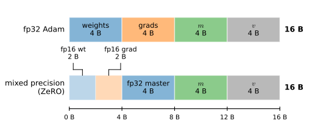
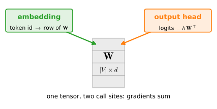

# Parameters, State, and Memory
:label:`sec_parameters`

Almost everything we do to a model other than calling it operates on its
*state*: the optimizer updates it, a checkpoint serializes it, device
placement moves it, fine-tuning trains part of it, and the answer to "will
this model fit on my GPU?" is a few lines of arithmetic over it. So far that
state has been handled for us; the layers created the tensors and the
training loop updated them. This section opens the box: how to reach any tensor in a model,
which tensors are trained and which merely travel with the model, what they
all cost in bytes, and how to share or freeze them.

```{.python .input}
%load_ext d2lbook.tab
tab.interact_select('mxnet', 'pytorch', 'tensorflow', 'jax')
```

```{.python .input #parameters-state-memory-parameters-state-and-memory}
%%tab pytorch
import torch
from torch import nn
```

```{.python .input #parameters-state-memory-parameters-state-and-memory}
%%tab jax
import jax
from jax import numpy as jnp
from flax import nnx
import optax
```

```{.python .input #parameters-state-memory-parameters-state-and-memory}
%%tab tensorflow
import os
os.environ['TF_CPP_MIN_LOG_LEVEL'] = '2'
import tensorflow as tf
```

```{.python .input #parameters-state-memory-parameters-state-and-memory}
%%tab mxnet
import os
from mxnet import autograd, gluon, np, npx
from mxnet.gluon import nn
npx.set_np()
```

## Accessing Parameters
:label:`subsec_param-access`

Our specimen is the residual MLP of :numref:`sec_model_construction`,
redefined here so this section stands on its own: an input layer, a stack of
residual blocks, and an output head.

```{.python .input #parameters-state-memory-accessing-parameters-1}
%%tab pytorch
class ResidualBlock(nn.Module):
    def __init__(self, d):
        super().__init__()
        self.body = nn.Sequential(nn.Linear(d, d), nn.ReLU(), nn.Linear(d, d))

    def forward(self, X):
        return X + self.body(X)

torch.manual_seed(42)
net = nn.Sequential(nn.Linear(20, 64), ResidualBlock(64),
                    ResidualBlock(64), nn.Linear(64, 10))
X = torch.randn(2, 20)
net(X).shape
```

```{.python .input #parameters-state-memory-accessing-parameters-1}
%%tab jax
class ResidualBlock(nnx.Module):
    def __init__(self, d, rngs):
        self.body = nnx.Sequential(
            nnx.Linear(d, d, rngs=rngs), nnx.relu,
            nnx.Linear(d, d, rngs=rngs))

    def __call__(self, X):
        return X + self.body(X)

rngs = nnx.Rngs(42)
net = nnx.Sequential(nnx.Linear(20, 64, rngs=rngs),
                     ResidualBlock(64, rngs), ResidualBlock(64, rngs),
                     nnx.Linear(64, 10, rngs=rngs))
X = jax.random.normal(jax.random.key(0), (2, 20))
net(X).shape
```

```{.python .input #parameters-state-memory-accessing-parameters-1}
%%tab tensorflow
class ResidualBlock(tf.keras.layers.Layer):
    def __init__(self, d):
        super().__init__()
        self.body = tf.keras.Sequential([
            tf.keras.layers.Dense(d), tf.keras.layers.ReLU(),
            tf.keras.layers.Dense(d)])

    def call(self, X):
        return X + self.body(X)

tf.keras.utils.set_random_seed(42)
net = tf.keras.Sequential([tf.keras.layers.Dense(64), ResidualBlock(64),
                           ResidualBlock(64), tf.keras.layers.Dense(10)])
X = tf.random.normal((2, 20))
net(X).shape
```

```{.python .input #parameters-state-memory-accessing-parameters-1}
%%tab mxnet
class ResidualBlock(nn.Block):
    def __init__(self, d):
        super().__init__()
        self.body = nn.Sequential()
        self.body.add(nn.Dense(d, activation='relu'), nn.Dense(d))

    def forward(self, X):
        return X + self.body(X)

np.random.seed(42)
net = nn.Sequential()
net.add(nn.Dense(64), ResidualBlock(64), ResidualBlock(64), nn.Dense(10))
net.initialize()
X = np.random.uniform(size=(2, 20))
net(X).shape
```

:begin_tab:`pytorch`
A model built from modules is a tree, and its parameters are the leaves. To
reach one leaf, walk the tree: indexing into a `Sequential` selects a child,
attribute access selects within it. `net[3]` is the output layer; its bias is
an `nn.Parameter`, a tensor that announces itself to the module system as
trainable.
:end_tab:

:begin_tab:`jax`
A model built from NNX modules is an object graph, and its parameters are
`nnx.Param` variables owned by the layers. To reach one, follow ordinary
attributes and container indices. `net.layers[3]` is the output layer and
its `bias` variable is marked trainable by its type.
:end_tab:

:begin_tab:`tensorflow`
A model built from layers is a tree, and its parameters are the leaves. To
reach one leaf, walk the tree: `net.layers` lists a model's children,
attribute access selects within a layer. `net.layers[3]` is the output layer;
its bias is a `Variable` the layer created through `add_weight`, announcing
itself to Keras as trainable.
:end_tab:

:begin_tab:`mxnet`
A model built from blocks is a tree, and its parameters are the leaves. To
reach one leaf, walk the tree: indexing into a `Sequential` selects a child,
attribute access selects within it. `net[3]` is the output layer; its bias is
a `Parameter`, an object that announces itself to the block system as state,
bundling the tensor with its gradient buffer; `.data()` returns the tensor,
and `.shape` reads through to it.
:end_tab:

```{.python .input #parameters-state-memory-accessing-parameters-2}
%%tab pytorch
type(net[3].bias), net[3].bias.shape
```

```{.python .input #parameters-state-memory-accessing-parameters-2}
%%tab jax
bias = net.layers[3].bias
type(bias), bias.shape
```

```{.python .input #parameters-state-memory-accessing-parameters-2}
%%tab tensorflow
type(net.layers[3].bias), net.layers[3].bias.shape
```

```{.python .input #parameters-state-memory-accessing-parameters-2}
%%tab mxnet
type(net[3].bias), net[3].bias.shape
```

The same path syntax reaches arbitrarily deep. The first linear layer inside
the first residual block sits three levels down:

```{.python .input #parameters-state-memory-accessing-parameters-3}
%%tab pytorch
net[1].body[0].weight.shape
```

```{.python .input #parameters-state-memory-accessing-parameters-3}
%%tab jax
net.layers[1].body.layers[0].kernel.shape
```

```{.python .input #parameters-state-memory-accessing-parameters-3}
%%tab tensorflow
net.layers[1].body.layers[0].kernel.shape
```

```{.python .input #parameters-state-memory-accessing-parameters-3}
%%tab mxnet
net[1].body[0].weight.shape
```

:begin_tab:`pytorch`
Each parameter also carries its gradient. We have not run backpropagation on
this model yet, so there is nothing to see:
:end_tab:

:begin_tab:`jax`
Gradients are not stored on parameters. `nnx.grad` returns a second state
tree with the same parameter paths, one gradient leaf per parameter:
:end_tab:

:begin_tab:`tensorflow`
Gradients are not stored on variables. A `tf.GradientTape` records the
forward pass, and its `gradient` method returns the gradients as a *second*
list, parallel to the variables you differentiate with respect to:
:end_tab:

:begin_tab:`mxnet`
The gradient is the second array a `Parameter` carries: `.data()` returns the
value and `.grad()` its gradient buffer. gluon allocates the buffer alongside
the data at initialization time, so before any backpropagation it simply
holds zeros:
:end_tab:

```{.python .input #parameters-state-memory-accessing-parameters-4}
%%tab pytorch
net[3].weight.grad is None
```

```{.python .input #parameters-state-memory-accessing-parameters-4}
%%tab jax
params = nnx.state(net, nnx.Param)
grads = nnx.grad(lambda model: model(X).sum())(net)
jax.tree_util.tree_structure(grads) == jax.tree_util.tree_structure(params)
```

```{.python .input #parameters-state-memory-accessing-parameters-4}
%%tab tensorflow
with tf.GradientTape() as tape:
    loss = tf.reduce_sum(net(X))
grads = tape.gradient(loss, net.trainable_weights)
len(grads) == len(net.trainable_weights)
```

```{.python .input #parameters-state-memory-accessing-parameters-4}
%%tab mxnet
net[3].bias.grad()
```

:begin_tab:`pytorch`
Reaching parameters one path at a time is right for debugging a single layer.
The optimizer, weight decay, and checkpointing instead need *every* leaf, and
`named_parameters()` provides exactly that: a traversal of the whole tree that
yields each parameter with its path as the name.
:end_tab:

:begin_tab:`jax`
Reaching parameters one path at a time is right for debugging a single layer.
The optimizer, weight decay, and checkpointing instead need *every* leaf, and
`nnx.state(net, nnx.Param)` selects them. Its flat view yields each array
together with the object-graph path that reaches it.
:end_tab:

:begin_tab:`tensorflow`
Reaching parameters one path at a time is right for debugging a single layer.
The optimizer, weight decay, and checkpointing instead need *every* leaf, and
`net.weights` provides exactly that: a traversal of the whole tree, one
variable per leaf, each carrying its path as its name.
:end_tab:

:begin_tab:`mxnet`
Reaching parameters one path at a time is right for debugging a single layer.
The optimizer, weight decay, and checkpointing instead need *every* leaf, and
`collect_params()` provides exactly that: a traversal of the whole tree that
returns a dictionary of every parameter keyed by its path.
:end_tab:

```{.python .input #parameters-state-memory-accessing-parameters-5}
%%tab pytorch
[(name, p.shape) for name, p in net.named_parameters()]
```

```{.python .input #parameters-state-memory-accessing-parameters-5}
%%tab jax
[(path, leaf.shape) for path, leaf in params.flat_state()]
```

```{.python .input #parameters-state-memory-accessing-parameters-5}
%%tab tensorflow
[(v.path, v.shape) for v in net.weights]
```

```{.python .input #parameters-state-memory-accessing-parameters-5}
%%tab mxnet
[(name, p.shape) for name, p in net.collect_params().items()]
```

:begin_tab:`pytorch`
Read one of the names closely. `1.body.0.weight` means: child
`1` of `net` (the first residual block), its submodule `body`, that module's
child `0`, and finally the leaf `weight`. Names are paths, so they survive any
amount of nesting, and they are exactly the keys of the model's `state_dict`,
the name-to-tensor mapping used for saving and loading
(:numref:`sec_read_write`):
:end_tab:

:begin_tab:`jax`
Read one of the paths closely.
`('layers', 1, 'body', 'layers', 0, 'kernel')` means: child 1 of `net`, the
first residual block, its `body`, child 0 of that sequence, and finally its
kernel. Paths survive arbitrary nesting. Filters select the kinds of state a
consumer needs, while checkpoints can save the full state
(:numref:`sec_read_write`):
:end_tab:

:begin_tab:`tensorflow`
Read one of the paths closely.
`sequential_2/residual_block/sequential/dense_1/kernel` means: inside the
outer `Sequential`, its child `residual_block` (the first residual block),
that block's `body` (a `Sequential` of its own), the first `Dense` inside it,
and finally the leaf `kernel`. The segments are layer *names*, assigned at
construction: a default derived from the class, plus a counter that keeps
names unique across the program (this is the third `Sequential` created, hence
`sequential_2`). Names are paths, so they survive any amount of nesting and
give every variable a stable identity for saving and loading
(:numref:`sec_read_write`). Keras splits the same list by trainability,
and so far the split is trivial:
:end_tab:

:begin_tab:`mxnet`
Read one of the names closely. `1.body.0.weight` means: child `1` of `net`
(the first residual block), its submodule `body`, that block's child `0`, and
finally the leaf `weight`. Names are paths, so they survive any amount of
nesting, and they are exactly the names `save_parameters` writes and
`load_parameters` expects (:numref:`sec_read_write`). Nor is there a
separate list of trainable parameters: each `Parameter` carries a `grad_req`
attribute that tells autograd whether to record a gradient for it, and so far
every entry says `'write'`:
:end_tab:

```{.python .input #parameters-state-memory-accessing-parameters-6}
%%tab pytorch
list(net.state_dict()) == [name for name, _ in net.named_parameters()]
```

```{.python .input #parameters-state-memory-accessing-parameters-6}
%%tab jax
list(params)
```

```{.python .input #parameters-state-memory-accessing-parameters-6}
%%tab tensorflow
[v.path for v in net.weights] == [v.path for v in net.trainable_weights]
```

```{.python .input #parameters-state-memory-accessing-parameters-6}
%%tab mxnet
params = net.collect_params()
[name for name, p in params.items() if p.grad_req == 'write'] == list(params)
```

:begin_tab:`pytorch`
One tree, one naming scheme, and every consumer, whether optimizer,
checkpoint, or debugger, walks it. The equality above holds for this model
because all of its state happens to be trainable. That is not always so.
:end_tab:

:begin_tab:`jax`
One tree, one naming scheme, and every consumer, whether optimizer,
checkpoint, or debugger, walks it. This model has only `nnx.Param` state.
That is not always so.
:end_tab:

:begin_tab:`tensorflow`
One tree, one naming scheme, and every consumer, whether optimizer,
checkpoint, or debugger, walks it. The equality above holds for this model
because all of its state happens to be trainable. That is not always so.
:end_tab:

:begin_tab:`mxnet`
One dictionary, one naming scheme, and every consumer, whether optimizer,
checkpoint, or debugger, walks it. The equality above holds for this model
because all of its state happens to be trainable. That is not always so.
:end_tab:

## Parameters and Buffers

Some tensors must persist inside a model and follow it from device to device,
yet should never receive a gradient. The canonical example is batch
normalization :cite:`Ioffe.Szegedy.2015`: each layer maintains a running mean
and variance of its inputs, updated during the forward pass and used at
prediction time. Those statistics must be saved with the model and must move
to the GPU with it, but the optimizer has no business touching them. Later
chapters add more examples: causal attention masks, precomputed positional
tables, and the key--value cache of a language model at generation time.

:begin_tab:`pytorch`
PyTorch calls such tensors *buffers*, registered with `register_buffer`. The
rule of thumb: make it a *parameter* if the optimizer should update it, a
*buffer* if it must persist and travel with the model, and a plain Python
attribute otherwise. Here is a module that standardizes its inputs with
statistics computed once, ahead of time, from a reference sample:
:end_tab:

:begin_tab:`jax`
NNX uses `Variable` subclasses to distinguish kinds of state. `nnx.Param`
marks trainable state, `nnx.BatchStat` marks running statistics, and a custom
subclass can mark another persistent buffer. Filters select which kinds an
optimizer or checkpoint sees. Here is a module that standardizes its inputs
with statistics computed once from a reference sample:
:end_tab:

:begin_tab:`tensorflow`
Keras calls every registered tensor a *weight* and distinguishes by a
per-variable flag: `add_weight(trainable=False)` creates a variable that is
saved with the model but never handed to the optimizer, which is how
`BatchNormalization` stores its running statistics. The rule of thumb: make
it a trainable weight if the optimizer should update it, a non-trainable
weight if it must persist and travel with the model, and a plain Python
attribute otherwise. Here is a layer that standardizes its inputs with
statistics computed once, ahead of time, from a reference sample:
:end_tab:

:begin_tab:`mxnet`
gluon needs no second mechanism for such tensors: a `Constant` *is* a
`Parameter`, one whose `grad_req` is hardwired to `'null'`. Assigning one to
an attribute registers it like any other parameter, so it appears in
`collect_params()`, is saved with the model, and moves with it across
devices; but autograd never records a gradient for it and the optimizer never
touches it. The rule of thumb: make it a `Parameter` if the optimizer should
update it, a `Constant` if it must persist and travel with the model, and a
plain Python attribute otherwise. Here is a block that standardizes its
inputs with statistics computed once, ahead of time, from a reference sample:
:end_tab:

```{.python .input #parameters-state-memory-parameters-and-buffers-1}
%%tab pytorch
class Whitener(nn.Module):
    def __init__(self, mean, std):
        super().__init__()
        self.register_buffer('mean', mean)
        self.register_buffer('std', std)
        self.out = nn.Linear(4, 2)

    def forward(self, X):
        return self.out((X - self.mean) / self.std)

sample = torch.randn(100, 4) * torch.arange(1., 5.)
whiten = Whitener(sample.mean(0), sample.std(0))
list(whiten.state_dict())
```

```{.python .input #parameters-state-memory-parameters-and-buffers-1}
%%tab jax
class Buffer(nnx.Variable):
    pass

class Whitener(nnx.Module):
    def __init__(self, mean, std, rngs):
        self.mean = Buffer(mean)
        self.std = Buffer(std)
        self.out = nnx.Linear(4, 2, rngs=rngs)

    def __call__(self, X):
        return self.out((X - self.mean) / self.std)

sample = jax.random.normal(jax.random.key(1), (100, 4)) * jnp.arange(1., 5.)
whiten = Whitener(sample.mean(0), sample.std(0), nnx.Rngs(2))
[(path, value.shape) for path, value in nnx.state(whiten).flat_state()]
```

```{.python .input #parameters-state-memory-parameters-and-buffers-1}
%%tab tensorflow
class Whitener(tf.keras.layers.Layer):
    def __init__(self, mean, std):
        super().__init__()
        self.mean = self.add_weight(
            shape=mean.shape, trainable=False, name='mean',
            initializer=tf.keras.initializers.Constant(mean))
        self.std = self.add_weight(
            shape=std.shape, trainable=False, name='std',
            initializer=tf.keras.initializers.Constant(std))
        self.out = tf.keras.layers.Dense(2)

    def call(self, X):
        return self.out((X - self.mean) / self.std)

sample = tf.random.normal((100, 4)) * tf.range(1., 5.)
whiten = Whitener(tf.reduce_mean(sample, 0), tf.math.reduce_std(sample, 0))
_ = whiten(sample[:2])   # build the Dense layer
[v.path for v in whiten.weights]
```

```{.python .input #parameters-state-memory-parameters-and-buffers-1}
%%tab mxnet
class Whitener(nn.Block):
    def __init__(self, mean, std):
        super().__init__()
        self.mean = gluon.Constant(mean)
        self.std = gluon.Constant(std)
        self.out = nn.Dense(2)

    def forward(self, X):
        return self.out((X - self.mean.data()) / self.std.data())

sample = np.random.normal(0, 1, (100, 4)) * np.arange(1., 5.)
whiten = Whitener(sample.mean(axis=0), sample.std(axis=0))
whiten.initialize()
whiten(sample[:2])   # build the deferred Dense layer
list(whiten.collect_params())
```

:begin_tab:`pytorch`
The buffers appear in the state dict, so they are checkpointed alongside the
weights. They do not appear among the parameters, so the optimizer never sees
them:
:end_tab:

:begin_tab:`jax`
Both kinds belong to the object graph and can be checkpointed together. The
optimizer selects `nnx.Param`, so it never sees the statistics.
:end_tab:

:begin_tab:`tensorflow`
All four variables are weights, so all four are checkpointed. The flag is
what keeps the optimizer away from the statistics: a training step
differentiates and updates `trainable_weights`, and the two constants sit in
the other half of the split:
:end_tab:

:begin_tab:`mxnet`
The constants sit in the same dictionary as the weights, so they are
checkpointed alongside them. What keeps the optimizer away is the `grad_req`
on each entry:
:end_tab:

```{.python .input #parameters-state-memory-parameters-and-buffers-2}
%%tab pytorch
[name for name, _ in whiten.named_parameters()]
```

```{.python .input #parameters-state-memory-parameters-and-buffers-2}
%%tab jax
{'params': list(nnx.state(whiten, nnx.Param)),
 'buffers': list(nnx.state(whiten, Buffer))}
```

```{.python .input #parameters-state-memory-parameters-and-buffers-2}
%%tab tensorflow
([v.path for v in whiten.trainable_weights],
 [v.path for v in whiten.non_trainable_weights])
```

```{.python .input #parameters-state-memory-parameters-and-buffers-2}
%%tab mxnet
{name: p.grad_req for name, p in whiten.collect_params().items()}
```

:begin_tab:`pytorch`
Registration is what makes the module system aware of a tensor. A tensor
stored as a plain attribute is invisible to it: not saved, and not converted
when the model moves. We can see this on the CPU by moving the module across
*dtypes*, which uses the same machinery as moving across devices. The
registered buffer converts; the plain attribute is left behind:
:end_tab:

:begin_tab:`jax`
Wrapping an array in a `Variable` makes it state. We can see the resulting
tree operation on the CPU by splitting the graph, casting every state leaf,
and merging a low-precision clone. The original model remains unchanged:
:end_tab:

:begin_tab:`tensorflow`
Registration through `add_weight` is what makes the layer aware of a tensor.
A tensor stored as a plain attribute is invisible to it: not counted, not
saved, and absent from every traversal. Attach one and the weights list does
not grow:
:end_tab:

:begin_tab:`mxnet`
Registration is what makes the block aware of a tensor, and assignment only
registers `Parameter`s (a `Constant` is one) and child blocks. A raw array
stored as a plain attribute is invisible: not saved, and not converted when
the model moves. We can see this on the CPU by moving the block across
*dtypes*, which uses the same machinery as moving across devices. The
registered constant converts; the plain attribute is left behind:
:end_tab:

```{.python .input #parameters-state-memory-parameters-and-buffers-3}
%%tab pytorch
whiten.note = torch.zeros(4)   # plain attribute: invisible to the module
whiten.to(torch.float64)
whiten.mean.dtype, whiten.note.dtype
```

```{.python .input #parameters-state-memory-parameters-and-buffers-3}
%%tab jax
graph, state = nnx.split(whiten)
low = nnx.merge(graph, jax.tree.map(lambda x: x.astype(jnp.float16), state))
low.mean.dtype, whiten.mean.dtype
```

```{.python .input #parameters-state-memory-parameters-and-buffers-3}
%%tab tensorflow
whiten.note = tf.zeros(4)   # plain attribute: invisible to the layer
[v.path.split('/')[-1] for v in whiten.weights]
```

```{.python .input #parameters-state-memory-parameters-and-buffers-3}
%%tab mxnet
whiten.note = np.zeros(4)   # plain attribute: invisible to the block
whiten.cast('float64')
whiten.mean.data().dtype, whiten.note.dtype
```

:begin_tab:`pytorch`
The device version of the same fact is the classic bug: a model works on the
CPU, then crashes after `.to('cuda')` because an unregistered tensor stayed
behind. On a machine with a GPU the following confirms that buffers move with
the module:
:end_tab:

:begin_tab:`jax`
Device placement follows the same rule: `jax.device_put` moves a whole
state tree, parameters and buffers alike. Updating the model with that tree
moves all registered state. The same lines work on any host; on a machine
with an accelerator, `jax.devices()[0]` is a GPU or TPU:
:end_tab:

:begin_tab:`tensorflow`
Device placement works differently here: a TensorFlow variable's device is
decided when the variable is *created*, not by a later move. With a GPU
visible, Keras creates variables on it by default, non-trainable weights
included, and a `tf.device` scope overrides the choice. There is no `.to()`
to forget, so the classic left-behind-tensor bug cannot arise; the price is
that relocating existing state means rebuilding it. Each variable reports its
placement:
:end_tab:

:begin_tab:`mxnet`
The device version of the same fact is the classic bug: a model works on the
CPU, then crashes after `reset_device(npx.gpu(0))` because an unregistered
tensor stayed behind. On a machine with a GPU the following confirms that
constants move with the block:
:end_tab:

```{.python .input #parameters-state-memory-parameters-and-buffers-4}
%%tab pytorch
if torch.cuda.is_available():
    print('buffer lives on', whiten.to('cuda').mean.device)
else:
    print('no GPU here; on a CUDA machine, whiten.to("cuda") '
          'moves whiten.mean along with the parameters')
```

```{.python .input #parameters-state-memory-parameters-and-buffers-4}
%%tab jax
moved = jax.device_put(nnx.state(whiten), jax.devices()[0])
nnx.update(whiten, moved)
whiten.mean.device
```

```{.python .input #parameters-state-memory-parameters-and-buffers-4}
%%tab tensorflow
whiten.mean.value.device   # decided when the variable was created
```

```{.python .input #parameters-state-memory-parameters-and-buffers-4}
%%tab mxnet
if npx.num_gpus() > 0:
    whiten.reset_device(npx.gpu(0))
    print('constant lives on', whiten.mean.data().device)
else:
    print('no GPU here; on a CUDA machine, whiten.reset_device(npx.gpu(0)) '
          'moves whiten.mean along with the parameters')
```

## Counting Parameters, Counting Bytes

Before any training job comes the question of whether the model fits in
memory, and the answer is arithmetic you can do on a napkin. Counting
parameters is one line. Counting *bytes* requires remembering everything that
training keeps per parameter: the weight itself, its gradient, and the
optimizer's state. Adam maintains two running moments per parameter, so in
fp32 the ledger reads:

| Training state       | Precision | Bytes per parameter |
|----------------------|-----------|---------------------|
| Weights              | fp32      | 4                   |
| Gradients            | fp32      | 4                   |
| Adam first moment    | fp32      | 4                   |
| Adam second moment   | fp32      | 4                   |
| Total                |           | 16                  |

```{.python .input #parameters-state-memory-counting-parameters-counting-bytes-1}
%%tab pytorch
n = sum(p.numel() for p in net.parameters())
weights, grads, adam_state = 4 * n, 4 * n, 8 * n   # bytes, all fp32
print(f'{n} parameters: {(weights + grads + adam_state) / 2**20:.2f} MiB '
      'for weights + gradients + Adam state')
```

```{.python .input #parameters-state-memory-counting-parameters-counting-bytes-1}
%%tab jax
params = nnx.state(net, nnx.Param)
leaves = jax.tree_util.tree_leaves(params)
n = sum(x.size for x in leaves)
weights = sum(x.size * x.dtype.itemsize for x in leaves)   # fp32: 4 bytes
grads, adam_state = weights, 2 * weights
print(f'{n} parameters: {(weights + grads + adam_state) / 2**20:.2f} MiB '
      'for weights + gradients + Adam state')
```

```{.python .input #parameters-state-memory-counting-parameters-counting-bytes-1}
%%tab tensorflow
n = net.count_params()
weights = sum(int(tf.size(v)) * tf.as_dtype(v.dtype).size
              for v in net.weights)   # fp32: 4 bytes
grads, adam_state = weights, 2 * weights
print(f'{n} parameters: {(weights + grads + adam_state) / 2**20:.2f} MiB '
      'for weights + gradients + Adam state')
```

```{.python .input #parameters-state-memory-counting-parameters-counting-bytes-1}
%%tab mxnet
params = net.collect_params()
n = sum(p.data().size for p in params.values())
weights = sum(p.data().size * p.data().dtype.itemsize
              for p in params.values())   # fp32: 4 bytes
grads, adam_state = weights, 2 * weights
print(f'{n} parameters: {(weights + grads + adam_state) / 2**20:.2f} MiB '
      'for weights + gradients + Adam state')
```

The optimizer state is real memory, allocated tensor by tensor. After a
single training step, Adam's two moments together hold exactly two extra
copies of the model:

```{.python .input #parameters-state-memory-counting-parameters-counting-bytes-2}
%%tab pytorch
adam = torch.optim.Adam(net.parameters())
net(X).sum().backward()
adam.step()
moments = sum(t.numel() for s in adam.state.values()
              for t in s.values() if torch.is_tensor(t) and t.ndim > 0)
moments == 2 * n
```

```{.python .input #parameters-state-memory-counting-parameters-counting-bytes-2}
%%tab jax
optimizer = nnx.Optimizer(net, optax.adam(1e-3), wrt=nnx.Param)
grads = nnx.grad(lambda model: model(X).sum())(net)
optimizer.update(net, grads)
moments = sum(x.size for x in jax.tree.leaves(optimizer.opt_state)
              if hasattr(x, 'ndim') and x.ndim > 0)
moments == 2 * n
```

```{.python .input #parameters-state-memory-counting-parameters-counting-bytes-2}
%%tab tensorflow
adam = tf.keras.optimizers.Adam()
adam.build(net.trainable_weights)   # Keras allocates the moments here, up front
with tf.GradientTape() as tape:
    loss = tf.reduce_sum(net(X))
adam.apply_gradients(zip(tape.gradient(loss, net.trainable_weights),
                         net.trainable_weights))
moments = sum(int(tf.size(v)) for v in adam.variables
              if v.ndim > 0)   # ndim 0 excludes the step count and learning rate
moments == 2 * n
```

```{.python .input #parameters-state-memory-counting-parameters-counting-bytes-2}
%%tab mxnet
trainer = gluon.Trainer(net.collect_params(), 'adam')
with autograd.record():
    loss = net(X).sum()
loss.backward()
trainer.step(batch_size=1)   # the updater allocates the moments here
trainer.save_states('adam.states')
state_bytes = os.path.getsize('adam.states')
state_bytes, 8 * n
```

:begin_tab:`mxnet`
gluon's `Trainer` owns this state and offers no public traversal of it: the
updater inside creates, at each parameter's first update, two zero arrays
shaped like the weight. What it does offer is `save_states`, which serializes
exactly that state, so up to a sliver of packaging the file is Adam's two
moments: 8 bytes per parameter, two extra copies of the model.
:end_tab:

For our little network the total is a third of a megabyte, which is why none
of this mattered until now. Scale the same arithmetic to a 1-billion-parameter
model and it dominates everything: 4 GB for the weights alone and 16 GB for
weights, gradients, and Adam state, before storing a single activation. The
memory that constrains model design is mostly this bookkeeping, and the
remaining term, the activations saved for the backward pass, depends on batch
size and is treated in :numref:`sec_use_gpu`.

Large models train in mixed precision :cite:`Micikevicius.Narang.Alben.ea.2018`,
computing in fp16 or bf16 while Adam keeps fp32 master weights, and here
published accountings disagree. One common convention counts 18 bytes per
parameter (fp32 master weights, an fp16 working copy, fp32 gradients, and the
two moments); the ZeRO paper counts 16, keeping gradients in fp16
:cite:`Rajbhandari.Rasley.Ruwase.ea.2020`. The disagreement is bookkeeping,
not physics: both include the fp32 master copy and both include the moments.
The invariant to remember is that Adam's state alone is 8 bytes per parameter
in fp32, two full extra copies of your model, under every convention.

:begin_tab:`mxnet`
In gluon the fp32 master copy is one optimizer flag away: construct the
`Trainer` with `optimizer_params={'multi_precision': True}` and, for every
fp16 weight, the updater keeps an fp32 copy next to the two moments and
applies updates to it. That is the master-weights term of the accounting
above, 4 more bytes per parameter.
:end_tab:


:label:`fig_bg_memory-ledger`

:numref:`fig_bg_memory-ledger` lays the two conventions side by side, byte for
byte: the moments (right half of each bar) line up exactly, and the only
disagreement is how the weights and gradients themselves are stored.

## Tied Parameters

One tensor can serve several roles in a model. The standard example is the
two ends of a language model. The input embedding is a $|V| \times d$ table
mapping each of $|V|$ tokens to a $d$-dimensional vector; the output
projection maps a $d$-dimensional hidden state to $|V|$ logits, and its weight
matrix has the same shape and an analogous meaning: one vector per token.
*Tying* the two, using a single tensor for both roles, saves $|V| \times d$
parameters and trains better than keeping them separate
:cite:`Press.Wolf.2017,Inan.Khosravi.Socher.2017`. The savings are large: in
GPT-2 :cite:`Radford.Wu.Child.ea.2019` the shared $50257 \times 768$ matrix is
about 38.6 million of the model's 124 million parameters, roughly 31%.


:label:`fig_bg_weight-tying`

:numref:`fig_bg_weight-tying` sketches the picture behind the two call sites.

:begin_tab:`pytorch`
A miniature version shows the mechanics. Tying is one assignment, and it is
aliasing, not copying:
:end_tab:

:begin_tab:`jax`
A miniature version shows the mechanics. `nnx.Embed` provides `attend`, which multiplies a hidden state by the
transpose of the embedding table, exactly the output projection. Calling it
reuses the module's one kernel, so the tying is visible in the state itself:
no head matrix exists.
:end_tab:

:begin_tab:`tensorflow`
A miniature version shows the mechanics. Keras has no tying flag, so we say
it in code: a small head layer that creates no variables of its own and
instead multiplies by the transpose of the embedding table it is handed. One
variable, two call sites:
:end_tab:

:begin_tab:`mxnet`
A miniature version shows the mechanics. gluon stores a `Dense` weight as
(outputs, inputs), so the head's weight has shape $(|V|, d)$: the embedding
table's shape exactly, no transpose required. Tying is `share_parameters`,
which re-points the head's `'weight'` slot at the embedding's `Parameter`,
matched by name; it is aliasing, not copying:
:end_tab:

```{.python .input #parameters-state-memory-tied-parameters-1}
%%tab pytorch
class TinyLM(nn.Module):
    def __init__(self, vocab_size, d, tied=True):
        super().__init__()
        self.emb = nn.Embedding(vocab_size, d)
        self.body = nn.Linear(d, d)
        self.head = nn.Linear(d, vocab_size, bias=False)
        if tied:
            self.head.weight = self.emb.weight   # one tensor, two roles

    def forward(self, tokens):
        return self.head(torch.relu(self.body(self.emb(tokens))))

lm = TinyLM(vocab_size=100, d=16)
lm.head.weight is lm.emb.weight
```

```{.python .input #parameters-state-memory-tied-parameters-1}
%%tab jax
class TinyLM(nnx.Module):
    def __init__(self, vocab_size, d, tied=True, rngs=None):
        rngs = nnx.Rngs(0) if rngs is None else rngs
        self.tied = tied
        self.emb = nnx.Embed(vocab_size, d, rngs=rngs)
        self.body = nnx.Linear(d, d, rngs=rngs)
        self.head = None if tied else nnx.Linear(
            d, vocab_size, use_bias=False, rngs=rngs)

    def __call__(self, tokens):
        h = nnx.relu(self.body(self.emb(tokens)))
        if self.tied:
            return self.emb.attend(h)   # the embedding table, used as the head
        return self.head(h)

lm = TinyLM(vocab_size=100, d=16)
tokens = jax.random.randint(jax.random.key(1), (2, 8), 0, 100)
[(path, value.shape)
 for path, value in nnx.state(lm, nnx.Param).flat_state()]
```

```{.python .input #parameters-state-memory-tied-parameters-1}
%%tab tensorflow
class TiedLMHead(tf.keras.layers.Layer):
    def __init__(self, emb):
        super().__init__()
        self.emb = emb   # reuse the embedding layer; create nothing

    def call(self, h):
        return tf.matmul(h, self.emb.embeddings, transpose_b=True)

class TinyLM(tf.keras.Model):
    def __init__(self, vocab_size, d, tied=True):
        super().__init__()
        self.emb = tf.keras.layers.Embedding(vocab_size, d)
        self.body = tf.keras.layers.Dense(d)
        self.head = (TiedLMHead(self.emb) if tied else
                     tf.keras.layers.Dense(vocab_size, use_bias=False))

    def call(self, tokens):
        return self.head(tf.nn.relu(self.body(self.emb(tokens))))

lm = TinyLM(vocab_size=100, d=16)
tokens = tf.random.uniform((2, 8), 0, 100, dtype=tf.int32)
_ = lm(tokens)   # build
[(v.path, tuple(v.shape)) for v in lm.weights]
```

```{.python .input #parameters-state-memory-tied-parameters-1}
%%tab mxnet
class TinyLM(nn.Block):
    def __init__(self, vocab_size, d):
        super().__init__()
        self.emb = nn.Embedding(vocab_size, d)
        self.body = nn.Dense(d, flatten=False)
        self.head = nn.Dense(vocab_size, use_bias=False, flatten=False)

    def forward(self, tokens):
        return self.head(npx.relu(self.body(self.emb(tokens))))

lm = TinyLM(vocab_size=100, d=16)
lm.initialize()
lm.head.share_parameters(lm.emb.collect_params())   # one tensor, two roles
tokens = np.random.randint(0, 100, (2, 8))
lm(tokens)
lm.head.weight is lm.emb.weight
```

:begin_tab:`pytorch`
The module system understands the aliasing. Parameter traversal reports the
shared tensor once, so the count below reflects the $|V| \times d$ saving and
the optimizer updates the tensor once per step:
:end_tab:

:begin_tab:`jax`
There is no aliasing bookkeeping to get right, because the state contains
the table once. The parameter count reflects the $|V| \times d$ saving, and
an optimizer updates the table once per step:
:end_tab:

:begin_tab:`tensorflow`
Because the head created no variable, there is no aliasing bookkeeping to get
right: the traversal reports the table once and no head matrix exists. The
parameter count reflects the $|V| \times d$ saving, and the optimizer updates
the table once per step:
:end_tab:

:begin_tab:`mxnet`
The two blocks now hold one `Parameter` between them. `collect_params()`
keeps *both* names pointing at it, so a naive sum over the dictionary would
count the table twice; deduplicating by identity shows the $|V| \times d$
saving. The `Trainer` deduplicates the same way internally and updates the
table once per step:
:end_tab:

```{.python .input #parameters-state-memory-tied-parameters-2}
%%tab pytorch
untied = TinyLM(vocab_size=100, d=16, tied=False)
(sum(p.numel() for p in lm.parameters()),
 sum(p.numel() for p in untied.parameters()))
```

```{.python .input #parameters-state-memory-tied-parameters-2}
%%tab jax
untied = TinyLM(vocab_size=100, d=16, tied=False)
(sum(x.size for x in jax.tree.leaves(nnx.state(lm, nnx.Param))),
 sum(x.size for x in jax.tree.leaves(nnx.state(untied, nnx.Param))))
```

```{.python .input #parameters-state-memory-tied-parameters-2}
%%tab tensorflow
untied = TinyLM(vocab_size=100, d=16, tied=False)
_ = untied(tokens)
(lm.count_params(), untied.count_params())
```

```{.python .input #parameters-state-memory-tied-parameters-2}
%%tab mxnet
untied = TinyLM(vocab_size=100, d=16)   # no share_parameters: separate head
untied.initialize()
untied(tokens)

def n_unique(net):
    unique = {id(p): p for p in net.collect_params().values()}
    return sum(p.data().size for p in unique.values())

(n_unique(lm), n_unique(untied))
```

:begin_tab:`pytorch`
The state dict, by contrast, keeps *both* names, `emb.weight` and
`head.weight`, pointing at the same storage. That is deliberate: a checkpoint
saved from a tied model then loads into either a tied or an untied one.
:end_tab:

:begin_tab:`jax`
A checkpoint of the tied model stores the table once, because the checkpoint
selects the model state. The flip side is that tied and untied checkpoints differ in
structure: the tied one has no head kernel, so loading it into an untied
module is a structural mismatch to resolve explicitly, not a silent aliasing
decision.
:end_tab:

:begin_tab:`tensorflow`
A checkpoint of the tied model stores the table once, because the head owns
nothing to store. The flip side is that tied and untied checkpoints differ in
structure: the untied model carries one extra kernel, so loading one into the
other is a mismatch to resolve explicitly, not a silent aliasing decision.
:end_tab:

:begin_tab:`mxnet`
Keeping both names is deliberate: `save_parameters` writes the tensor under
each name it appears under (pass `deduplicate=True` to store it once), so a
checkpoint saved from a tied model loads into either a tied or an untied one.
:end_tab:

```{.python .input #parameters-state-memory-tied-parameters-3}
%%tab pytorch
sd = lm.state_dict()
(sd['emb.weight'].data_ptr() == sd['head.weight'].data_ptr(),
 [name for name, _ in lm.named_parameters()])
```

```{.python .input #parameters-state-memory-tied-parameters-3}
%%tab mxnet
cp = lm.collect_params()
(cp['emb.weight'] is cp['head.weight'], list(cp))
```

What about gradients? During backpropagation each use of the tensor
contributes a gradient, and the contributions accumulate into the gradient of
the single shared tensor. We can verify this against the untied twin: load
the tied model's values into it, run the same backward pass through both, and
the tied gradient equals the *sum* of the untied model's two gradients.

```{.python .input #parameters-state-memory-tied-parameters-4}
%%tab pytorch
untied.load_state_dict(lm.state_dict())   # same values, separate tensors
tokens = torch.randint(0, 100, (2, 8))
lm(tokens).sum().backward()
untied(tokens).sum().backward()
torch.allclose(lm.emb.weight.grad,
               untied.emb.weight.grad + untied.head.weight.grad)
```

```{.python .input #parameters-state-memory-tied-parameters-4}
%%tab jax
untied.emb.embedding[...] = lm.emb.embedding
untied.body.kernel[...] = lm.body.kernel
untied.body.bias[...] = lm.body.bias
untied.head.kernel[...] = lm.emb.embedding.T
g_tied = nnx.grad(lambda model: model(tokens).sum())(lm)
g_untied = nnx.grad(lambda model: model(tokens).sum())(untied)
jnp.allclose(g_tied['emb']['embedding'],
             g_untied['emb']['embedding'] + g_untied['head']['kernel'].T)
```

```{.python .input #parameters-state-memory-tied-parameters-4}
%%tab tensorflow
untied.set_weights(lm.get_weights()   # tied values, head kernel materialized
                   + [tf.transpose(lm.emb.embeddings)])
with tf.GradientTape() as tape:
    loss = tf.reduce_sum(lm(tokens))
g_tied = tape.gradient(loss, lm.emb.embeddings)
with tf.GradientTape() as tape:
    loss = tf.reduce_sum(untied(tokens))
g_emb, g_head = tape.gradient(loss, [untied.emb.embeddings, untied.head.kernel])
g_emb = tf.convert_to_tensor(g_emb)   # densify the embedding-lookup gradient
bool(tf.reduce_max(tf.abs(g_tied - (g_emb + tf.transpose(g_head)))) < 1e-5)
```

```{.python .input #parameters-state-memory-tied-parameters-4}
%%tab mxnet
up = untied.collect_params()
for name, p in lm.collect_params().items():
    up[name].set_data(p.data())   # same values, separate tensors
with autograd.record():
    lm(tokens).sum().backward()
with autograd.record():
    untied(tokens).sum().backward()
bool(np.abs(lm.emb.weight.grad()
            - (untied.emb.weight.grad()
               + untied.head.weight.grad())).max() < 1e-6)
```

## Freezing Parameters

:begin_tab:`pytorch`
Every fine-tuning recipe (:numref:`sec_fine_tuning`) rests on one primitive:
setting `requires_grad = False` on a parameter excludes it from
backpropagation, so the optimizer has nothing to apply and the weight stays
put. The typical pattern freezes a pretrained backbone and trains only a new
head. On a fresh copy of our residual MLP, freezing everything but the output
layer leaves 650 of 18,634 parameters trainable:
:end_tab:

:begin_tab:`jax`
Every fine-tuning recipe (:numref:`sec_fine_tuning`) rests on one primitive,
and in NNX it lives in the optimizer: a leaf is frozen exactly when no update reaches it.
`optax.multi_transform` routes each leaf to a transformation chosen by a
label, and `optax.set_to_zero()` is the transformation that freezes, turning
every gradient it handles into a zero update. The typical pattern freezes a
pretrained backbone and trains only a new head. On a fresh copy of our
residual MLP, labeling everything but the output layer `'freeze'` leaves 650
of 18,634 parameters trainable:
:end_tab:

:begin_tab:`tensorflow`
Every fine-tuning recipe (:numref:`sec_fine_tuning`) rests on one primitive,
and in Keras it sits on the layer: setting `layer.trainable = False` moves
the layer's variables from `trainable_weights` to `non_trainable_weights`,
the split a training step consults. (One caveat for the `compile`-and-`fit`
workflow: Keras documents that a change to `trainable` takes effect at the
next `compile`. The manual steps below read the split live.) The typical
pattern freezes a pretrained backbone and trains only a new head. On a fresh
copy of our residual MLP, freezing everything but the output layer leaves 650
of 18,634 parameters trainable:
:end_tab:

:begin_tab:`mxnet`
Every fine-tuning recipe (:numref:`sec_fine_tuning`) rests on one primitive,
and in gluon it is the switch we have already met: set a parameter's
`grad_req` to `'null'` and backpropagation skips it, so the `Trainer` has
nothing to apply and the weight stays put (gluon even frees the gradient
buffer on the spot). It is the same mechanism that makes a `Constant`
constant, applied at fine-tuning time, and `Block.setattr` flips it in bulk
on any subtree. The typical pattern freezes a pretrained backbone and trains
only a new head. On a fresh copy of our residual MLP, freezing everything but
the output layer leaves 650 of 18,634 parameters trainable:
:end_tab:

```{.python .input #parameters-state-memory-freezing-parameters-1}
%%tab pytorch
finetune = nn.Sequential(nn.Linear(20, 64), ResidualBlock(64),
                         ResidualBlock(64), nn.Linear(64, 10))
for p in finetune[:-1].parameters():
    p.requires_grad = False

(sum(p.numel() for p in finetune.parameters() if p.requires_grad),
 sum(p.numel() for p in finetune.parameters()))
```

```{.python .input #parameters-state-memory-freezing-parameters-1}
%%tab jax
rngs = nnx.Rngs(3)
finetune = nnx.Sequential(nnx.Linear(20, 64, rngs=rngs),
                          ResidualBlock(64, rngs),
                          ResidualBlock(64, rngs),
                          nnx.Linear(64, 10, rngs=rngs))
ft_params = nnx.state(finetune, nnx.Param)
def labels(params):
    return jax.tree_util.tree_map_with_path(
        lambda path, _: ('train' if "['layers'][3]" in
                         jax.tree_util.keystr(path) else 'freeze'), params)

pure_params = nnx.to_pure_dict(ft_params)
pure_labels = labels(pure_params)
n_train = sum(x.size for x, l in zip(jax.tree_util.tree_leaves(pure_params),
                                     jax.tree_util.tree_leaves(pure_labels))
              if l == 'train')
(n_train, sum(x.size for x in jax.tree_util.tree_leaves(pure_params)))
```

```{.python .input #parameters-state-memory-freezing-parameters-1}
%%tab tensorflow
finetune = tf.keras.Sequential([tf.keras.layers.Dense(64), ResidualBlock(64),
                                ResidualBlock(64), tf.keras.layers.Dense(10)])
_ = finetune(X)   # build
for layer in finetune.layers[:-1]:
    layer.trainable = False

(sum(int(tf.size(v)) for v in finetune.trainable_weights),
 finetune.count_params())
```

```{.python .input #parameters-state-memory-freezing-parameters-1}
%%tab mxnet
finetune = nn.Sequential()
finetune.add(nn.Dense(64), ResidualBlock(64),
             ResidualBlock(64), nn.Dense(10))
finetune.initialize()
finetune(X)
finetune[:-1].setattr('grad_req', 'null')

(sum(p.data().size for p in finetune.collect_params().values()
     if p.grad_req == 'write'),
 sum(p.data().size for p in finetune.collect_params().values()))
```

:begin_tab:`pytorch`
The optimizer should receive only the trainable parameters. One gradient step
then moves the head and nothing else:
:end_tab:

:begin_tab:`jax`
The optimizer receives the whole tree plus the labels, and the partition does
the rest: Adam applies to the leaves labeled `'train'`, `set_to_zero` to the
others. One gradient step then moves the head and nothing else:
:end_tab:

:begin_tab:`tensorflow`
The tape differentiates with respect to the variables you hand it, and
`trainable_weights` is now exactly the head. One gradient step then moves the
head and nothing else:
:end_tab:

:begin_tab:`mxnet`
The `Trainer` can receive the whole dictionary: it reads each parameter's
`grad_req` and skips the frozen ones, so the freeze lives on the model and
every consumer respects it. One gradient step then moves the head and nothing
else:
:end_tab:

```{.python .input #parameters-state-memory-freezing-parameters-2}
%%tab pytorch
head_opt = torch.optim.SGD(
    (p for p in finetune.parameters() if p.requires_grad), lr=0.1)
before = [p.clone() for p in finetune.parameters()]
finetune(X).sum().backward()
head_opt.step()
[not torch.equal(b, p) for b, p in zip(before, finetune.parameters())]
```

```{.python .input #parameters-state-memory-freezing-parameters-2}
%%tab jax
tx = optax.multi_transform(
    {'train': optax.adam(0.1), 'freeze': optax.set_to_zero()}, labels)
optimizer = nnx.Optimizer(finetune, tx, wrt=nnx.Param)
before = nnx.to_pure_dict(nnx.state(finetune, nnx.Param))
grads = nnx.grad(lambda model: model(X).sum())(finetune)
optimizer.update(finetune, grads)
stepped = nnx.to_pure_dict(nnx.state(finetune, nnx.Param))
jax.tree_util.tree_map(lambda a, b: bool((a != b).any()), before, stepped)
```

```{.python .input #parameters-state-memory-freezing-parameters-2}
%%tab tensorflow
head_opt = tf.keras.optimizers.SGD(learning_rate=0.1)
before = [tf.identity(v) for v in finetune.weights]
with tf.GradientTape() as tape:
    loss = tf.reduce_sum(finetune(X))
head_opt.apply_gradients(zip(tape.gradient(loss, finetune.trainable_weights),
                             finetune.trainable_weights))
[not bool(tf.reduce_all(b == v)) for b, v in zip(before, finetune.weights)]
```

```{.python .input #parameters-state-memory-freezing-parameters-2}
%%tab mxnet
head_trainer = gluon.Trainer(finetune.collect_params(), 'sgd',
                             {'learning_rate': 0.1})
before = {name: p.data().copy()
          for name, p in finetune.collect_params().items()}
with autograd.record():
    loss = finetune(X).sum()
loss.backward()
head_trainer.step(batch_size=1)
{name: bool((p.data() != before[name]).any())
 for name, p in finetune.collect_params().items()}
```

:begin_tab:`pytorch`
Only the last two entries, the head's weight and bias, changed. Two pitfalls
deserve a warning, because both fail silently.
:end_tab:

:begin_tab:`jax`
Only the two leaves under `layers[3]`, the head's kernel and bias, changed.
Freezing traditionally carries two silent pitfalls, one about optimizer
memory and one about batch normalization; with explicit state, both become
questions you can settle by inspection.
:end_tab:

:begin_tab:`tensorflow`
Only the last two entries, the head's kernel and bias, changed. Two pitfalls
deserve attention here: one about optimizer memory, and one about batch
normalization, where Keras quietly protects you.
:end_tab:

:begin_tab:`mxnet`
Only the two leaves under `3`, the head's weight and bias, changed. Two
pitfalls deserve attention here: one about optimizer memory, and one about
batch normalization.
:end_tab:

:begin_tab:`pytorch`
First, freezing does not reclaim optimizer memory. Passing only the trainable
parameters, as above, matters: an optimizer built over *all* parameters keeps
its state for every parameter that ever received a gradient. The Adam
instance from the previous section already stepped once on `net`, so freezing
`net`'s backbone now leaves its moments, 8 bytes per frozen parameter, fully
allocated:
:end_tab:

:begin_tab:`jax`
First, optimizer memory. Does `multi_transform` still allocate Adam's
moments, 8 bytes per parameter, for leaves it will never update? No:
internally it masks each group's parameters before the inner transformation
sees them, replacing frozen leaves with empty placeholders, so `opt_state`
holds moments for the 650 trainable parameters only:
:end_tab:

:begin_tab:`tensorflow`
First, freezing does not reclaim optimizer memory. A Keras optimizer
allocates state for every variable in the list it was built over, whether or
not that variable ever receives another update. The Adam instance from the
previous section was built over all of `net`'s parameters, so freezing
`net`'s backbone now leaves its moments, 8 bytes per frozen parameter, fully
allocated:
:end_tab:

:begin_tab:`mxnet`
First, freezing does not reclaim optimizer state already allocated. The
`Trainer`'s updater creates moments lazily, at each parameter's first update,
which cuts both ways: a parameter frozen *before* the first step never gets
moments at all, but the Adam instance from the previous section has already
stepped once on `net`, so freezing `net`'s backbone now leaves its moments,
8 bytes per frozen parameter, fully allocated. The serialized state has not
shrunk by a byte:
:end_tab:

```{.python .input #parameters-state-memory-freezing-parameters-3}
%%tab pytorch
for p in net[:-1].parameters():
    p.requires_grad = False   # frozen, but Adam's moments remain allocated
moments = sum(t.numel() for s in adam.state.values()
              for t in s.values() if torch.is_tensor(t) and t.ndim > 0)
moments == 2 * n
```

```{.python .input #parameters-state-memory-freezing-parameters-3}
%%tab jax
moments = sum(x.size for x in jax.tree_util.tree_leaves(optimizer.opt_state)
              if hasattr(x, 'ndim') and x.ndim > 0)
moments == 2 * n_train
```

```{.python .input #parameters-state-memory-freezing-parameters-3}
%%tab tensorflow
for layer in net.layers[:-1]:
    layer.trainable = False   # frozen, but Adam's moments remain allocated
moments = sum(int(tf.size(v)) for v in adam.variables if v.ndim > 0)
moments == 2 * n
```

```{.python .input #parameters-state-memory-freezing-parameters-3}
%%tab mxnet
net[:-1].setattr('grad_req', 'null')   # frozen, but Adam's moments remain
trainer.save_states('adam.states')
os.path.getsize('adam.states') == state_bytes
```

:begin_tab:`pytorch`
Second, freezing governs parameters only, and batch normalization carries
state that is not a parameter. Its running statistics are buffers, updated by
the *forward pass* whenever the layer is in training mode. Freeze a BatchNorm
layer's weight and bias and its running mean keeps drifting anyway:
:end_tab:

:begin_tab:`jax`
Second, freezing governs `nnx.Param` state only. Batch normalization keeps
its running statistics as `nnx.BatchStat` variables and updates them during a
training-mode forward pass. Freeze the layer's scale and bias and the
statistics still drift because they never pass through the optimizer:
:end_tab:

:begin_tab:`tensorflow`
Second, batch normalization, whose running statistics are non-trainable
weights recomputed by the forward pass in training mode. Elsewhere that is a
classic trap: freeze the layer's scale and shift and the statistics drift
anyway, since they never pass through the optimizer. Keras special-cases
exactly this: setting `trainable = False` on a `BatchNormalization` layer
also switches its forward pass to inference mode, so the statistics hold
still even when the layer is called with `training=True`:
:end_tab:

:begin_tab:`mxnet`
Second, freezing governs gradients only, and batch normalization carries
state that no gradient ever touches. Its running mean and variance are
themselves parameters with `grad_req='null'` hardwired, updated by the
*forward pass* whenever it runs in training mode, which in gluon means inside
an `autograd.record()` scope. Freeze a `BatchNorm` layer's scale and shift
and its running mean keeps drifting anyway:
:end_tab:

```{.python .input #parameters-state-memory-freezing-parameters-4}
%%tab pytorch
bn = nn.BatchNorm1d(4)
for p in bn.parameters():
    p.requires_grad = False
before = bn.running_mean.clone()
bn(torch.randn(8, 4) + 3)          # train mode: stats update regardless
torch.allclose(bn.running_mean, before)
```

```{.python .input #parameters-state-memory-freezing-parameters-4}
%%tab jax
bn = nnx.BatchNorm(4, use_running_average=False, momentum=0.9,
                   rngs=nnx.Rngs(4))
before = bn.mean[...]
bn(jax.random.normal(jax.random.key(5), (8, 4)) + 3)
bool(jnp.allclose(bn.mean, before))
```

```{.python .input #parameters-state-memory-freezing-parameters-4}
%%tab tensorflow
bn = tf.keras.layers.BatchNormalization()
_ = bn(tf.zeros((8, 4)), training=True)   # build, then freeze
bn.trainable = False
before = tf.identity(bn.moving_mean)
_ = bn(tf.random.normal((8, 4)) + 3, training=True)
bool(tf.reduce_all(bn.moving_mean == before))
```

```{.python .input #parameters-state-memory-freezing-parameters-4}
%%tab mxnet
bn = nn.BatchNorm()
bn.initialize()
bn(np.zeros((8, 4)))            # first call builds the deferred shapes
bn.gamma.grad_req = 'null'
bn.beta.grad_req = 'null'
before = bn.running_mean.data().copy()
x = np.random.normal(0, 1, (8, 4)) + 3
x.attach_grad()                 # a leaf for autograd: every Parameter is frozen
with autograd.record():
    bn(x).sum().backward()      # train mode: stats update regardless
bool((bn.running_mean.data() == before).all())
```

:begin_tab:`pytorch`
`requires_grad` and `.eval()` are orthogonal switches: the first stops
gradients, the second stops the behaviors tied to training mode, such as
running-statistics updates and dropout. To pin a BatchNorm layer during
fine-tuning you need both.
:end_tab:

:begin_tab:`jax`
The optimizer labels and `use_running_average` are orthogonal switches. The
first stops parameter updates; the second stops the forward pass from
updating running statistics. To pin a BatchNorm layer during fine-tuning you
need both. `nnx.view(model, use_running_average=True)` changes the mode on a
view of the full model.
:end_tab:

:begin_tab:`tensorflow`
This courtesy is specific to `BatchNormalization`. Everywhere else,
`trainable` and the `training` call argument are orthogonal switches: the
first governs which variables receive updates, the second governs
training-mode behaviors, and a frozen dropout layer still drops when called
with `training=True`. To pin any other stateful layer during fine-tuning,
set both.
:end_tab:

:begin_tab:`mxnet`
`grad_req` and the recording scope are orthogonal switches: the first stops
gradients, the second decides whether a forward pass runs in training mode,
with everything that entails, batch statistics and dropout alike. To pin a
BatchNorm layer during fine-tuning you need both: freeze its parameters *and*
hold its statistics still, either by keeping it out of `record()` or by
constructing it with `use_global_stats=True`.
:end_tab:

Freezing whole tensors is the bluntest form of partial training.
Parameter-efficient methods instead add small trainable low-rank corrections
next to frozen weights; the linear algebra behind them is developed in
:numref:`sec_mdl-svd-low-rank`. A related idea maintains derived,
non-trained state: an *exponential moving average* (EMA) of the weights kept
alongside the trained ones and used for evaluation, which often outperforms
the raw final iterate. Like BatchNorm statistics, the average is state the
optimizer never touches, updated outside backpropagation; we will use it when
we train generative models.

:begin_tab:`jax`
In optax the average is one more piece of explicit state. `optax.ema` is a
transformation like any other: feed it the weights after each step, in place
of gradients, and its state carries their debiased moving average. Continuing
the fine-tuning loop above, the average trails the moving head:
:end_tab:

:begin_tab:`tensorflow`
Keras builds the average into the optimizer. `Adam(use_ema=True)` maintains
an exponential moving average of every variable it updates, alongside its
moments, and `finalize_variable_values` copies the averages back into the
model, the usual last step before evaluation or saving. Continuing the
fine-tuning above, the swapped-in average sits measurably behind the last raw
iterate of the moving head:
:end_tab:

:begin_tab:`mxnet`
gluon has no built-in weight averaging, but with all state reachable through
one dictionary it is a short loop: copy the trainable leaves once, then blend
the new weights in after each step. Continuing the fine-tuning above, the
average trails the moving head:
:end_tab:

```{.python .input #parameters-state-memory-freezing-parameters-5}
%%tab jax
ema = optax.ema(decay=0.9)
ema_state = ema.init(stepped)
for _ in range(5):
    grads = nnx.grad(lambda model: model(X).sum())(finetune)
    optimizer.update(finetune, grads)
    current = nnx.to_pure_dict(nnx.state(finetune, nnx.Param))
    avg, ema_state = ema.update(current, ema_state)
float(jnp.abs(avg['layers'][3]['bias']
              - current['layers'][3]['bias']).max())
```

```{.python .input #parameters-state-memory-freezing-parameters-5}
%%tab tensorflow
ema_opt = tf.keras.optimizers.Adam(learning_rate=0.1, use_ema=True,
                                   ema_momentum=0.9)
for _ in range(5):
    with tf.GradientTape() as tape:
        loss = tf.reduce_sum(finetune(X))
    ema_opt.apply_gradients(zip(tape.gradient(loss, finetune.trainable_weights),
                                finetune.trainable_weights))
raw = tf.identity(finetune.layers[-1].bias)   # the last raw iterate
ema_opt.finalize_variable_values(finetune.trainable_weights)   # swap in averages
float(tf.reduce_max(tf.abs(finetune.layers[-1].bias - raw)))
```

```{.python .input #parameters-state-memory-freezing-parameters-5}
%%tab mxnet
ema = {name: p.data().copy()
       for name, p in finetune.collect_params().items()
       if p.grad_req == 'write'}
for _ in range(5):
    with autograd.record():
        loss = finetune(X).sum()
    loss.backward()
    head_trainer.step(batch_size=1)
    cp = finetune.collect_params()
    for name in ema:   # weights in, average out
        ema[name] = 0.9 * ema[name] + 0.1 * cp[name].data()
float(np.abs(ema['3.bias'] - finetune[3].bias.data()).max())
```

## Summary

:begin_tab:`pytorch`
A model's state is one named tree of tensors. `named_parameters()` walks the
trainable leaves; the `state_dict` adds buffers, tensors that persist and
move with the model but receive no gradients, such as BatchNorm running
statistics. Training with Adam in fp32 costs 16 bytes per parameter (4 weights,
4 gradients, 8 optimizer state) before activations, and the 8 bytes of Adam
state per parameter survive every mixed-precision accounting convention.
Assigning one parameter to two modules ties them: one entry in
`named_parameters()`, gradients summed over its uses. Setting
`requires_grad = False` freezes a parameter, but reclaims no optimizer state
already allocated and does not stop buffer updates in training mode.
:end_tab:

:begin_tab:`jax`
A model owns a typed state tree. `nnx.Param` marks trainable leaves;
`nnx.BatchStat` and custom `Variable` subclasses hold persistent state that
receives no optimizer updates. Filters select each view, and checkpoints can
save the whole tree. Training with Adam in fp32 costs 16 bytes per parameter
(4 weights, 4 gradients, 8 optimizer state) before activations, and the
8 bytes of Adam state per parameter survive every mixed-precision accounting
convention. `nnx.Embed.attend` ties the embedding and the output head
structurally: one leaf in the tree, gradients summed over its uses. Freezing
is an optimizer-side partition, `optax.multi_transform` with `set_to_zero`;
it allocates no state for frozen leaves, but it does not stop `nnx.BatchStat`
updates in a training step.
:end_tab:

:begin_tab:`tensorflow`
A model's state is one list of variables, each named by the path of the
layers that own it. A per-variable flag splits the list into
`trainable_weights` and `non_trainable_weights`; weights created with
`add_weight(trainable=False)` persist and are saved but receive no updates,
and every variable's device is fixed at creation. Training with Adam in fp32
costs 16 bytes per parameter (4 weights, 4 gradients, 8 optimizer state)
before activations, and the 8 bytes of Adam state per parameter survive every
mixed-precision accounting convention. Tying is a head layer that owns no
variables and reuses the embedding table at a second call site: one entry in
`weights`, gradients summed over its uses. Setting `layer.trainable = False`
freezes a layer but reclaims no optimizer state already allocated;
`BatchNormalization` alone also stops updating its statistics when frozen,
and `Adam(use_ema=True)` keeps a weight average as part of the optimizer.
:end_tab:

:begin_tab:`mxnet`
A model's state is one dictionary of `Parameter`s keyed by path, returned by
`collect_params()`, and every consumer, whether `Trainer`, checkpoint, or
debugger, walks it. Each entry carries its own `grad_req` switch; a
`Constant` is a `Parameter` with `grad_req='null'` hardwired, so persistent
non-trained state and freezing are one mechanism. Training with Adam in fp32
costs 16 bytes per parameter (4 weights, 4 gradients, 8 optimizer state)
before activations, and the 8 bytes of Adam state per parameter survive every
mixed-precision accounting convention (`multi_precision=True` adds the fp32
master copy). `share_parameters` ties two layers to one `Parameter`: two
names in the dictionary, one tensor, gradients summed over its uses, updated
once per step. Setting `grad_req='null'` freezes a parameter and frees its
gradient buffer, but reclaims no optimizer state already allocated and does
not stop running-statistics updates in training mode.
:end_tab:

## Exercises

1. Write a helper that reports the byte cost of fp32 Adam training separately
   for each top-level block of `net`. Which block
   dominates, and would that still hold if the residual blocks were 10 times
   wider?
1. BatchNorm's running mean and variance are non-trained state. Suppose you
   made them trainable parameters so that the optimizer updates them. What
   goes wrong during training, and why does gradient descent on a running
   average not compute the same thing as the forward-pass update rule it
   replaces?

:begin_tab:`pytorch`
3. Tie two layers as in `TinyLM`, then copy the model with
   `copy.deepcopy`. Is the copy still tied? Check with `is`, and explain how a
   copy operation can preserve aliasing.
4. Freeze `lm.emb.weight` in the tied `TinyLM` but leave `lm.head` alone. How
   many trainable parameters remain? Explain what this teaches about the
   interaction between tying and freezing.
:end_tab:

:begin_tab:`jax`
3. Round-trip the tied model's `nnx.state(lm)` through serialization
   (:numref:`sec_read_write`) and reload it. Where, if anywhere, is the
   tying recorded? Explain why tying in NNX is a property of the module code
   rather than of the checkpoint.
4. In the tied `TinyLM`, try to freeze the embedding while training the head
   using `optax.multi_transform` labels. What choices do you have, and what
   does this teach about the interaction between tying and freezing?
:end_tab:

:begin_tab:`tensorflow`
3. Round-trip the tied model's weights through `get_weights` and
   `set_weights` (or a checkpoint, :numref:`sec_read_write`) into a second
   tied instance, then into an untied one. Where, if anywhere, is the tying
   recorded? Explain why tying in Keras is a property of the layer code
   rather than of the checkpoint.
4. In the tied `TinyLM`, set `lm.emb.trainable = False` but leave `lm.head`
   alone. How many trainable parameters remain, and can the head still
   adapt? Explain what this teaches about the interaction between tying and
   freezing.
:end_tab:

:begin_tab:`mxnet`
3. Round-trip the tied model through `save_parameters` and `load_parameters`
   (:numref:`sec_read_write`), once with `deduplicate=False` and once with
   `deduplicate=True`. Compare the file sizes, and check which of the two
   files loads into the untied twin. Where, if anywhere, is the tying
   recorded?
4. In the tied `TinyLM`, set `lm.emb.weight.grad_req = 'null'`. What happened
   to the head, and how many trainable parameters remain? Explain what this
   teaches about the interaction between tying and freezing.
:end_tab:
