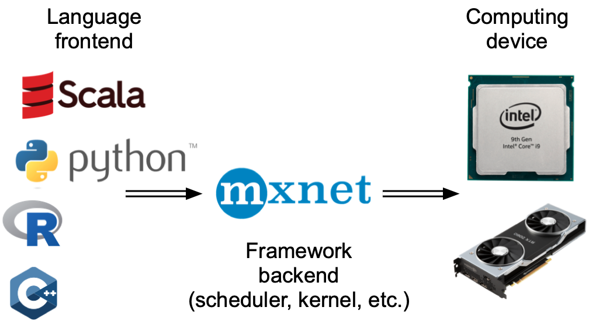
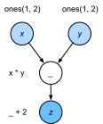
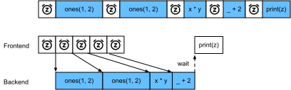

# Asynchronous Computation
:label:`sec_async`

Today's computers are highly parallel systems, consisting of multiple CPU cores (often multiple threads per core), multiple processing elements per GPU, and often multiple GPUs per device. In short, we can process many different things at the same time, often on different devices. Unfortunately Python is not a great way of writing parallel and asynchronous code, at least not without some extra help. After all, Python is single-threaded and this is unlikely to change in the future. Deep learning frameworks such as MXNet and TensorFlow adopt an *asynchronous programming* model to improve performance,
while PyTorch uses Python's own scheduler leading to a different performance trade-off.
For PyTorch, by default, GPU operations are asynchronous. When you call a function that uses the GPU, the operations are enqueued to the particular device, but not necessarily executed until later. This allows us to execute more computations in parallel, including operations on the CPU or other GPUs.
JAX takes a similar approach: all JAX operations are dispatched asynchronously. When you call a JAX function, the operation is enqueued and a future is returned immediately. The actual computation may not have completed by the time control returns to Python. To force synchronization, you call `.block_until_ready()` on the result.
TensorFlow similarly uses an asynchronous execution model. In eager mode (the default since TF 2), ops are dispatched to the GPU immediately and Python receives a handle back before the kernel finishes. Wrapping code in `@tf.function` additionally traces it into a compiled graph, allowing the XLA/CUDA runtime to pipeline and overlap operations with Python-side scheduling.

Hence, understanding how asynchronous programming works helps us to develop more efficient programs, by proactively reducing computational requirements and mutual dependencies. This allows us to reduce memory overhead and increase processor utilization.

```{.python .input #async-computation-asynchronous-computation}
#@tab mxnet
from d2l import mxnet as d2l
import numpy, os, subprocess
from mxnet import autograd, gluon, np, npx
from mxnet.gluon import nn
npx.set_np()
```

```{.python .input #async-computation-asynchronous-computation}
#@tab pytorch
from d2l import torch as d2l
import numpy, os, subprocess
import torch
from torch import nn
```

```{.python .input #async-computation-asynchronous-computation}
#@tab jax
from d2l import jax as d2l
import jax
from jax import numpy as jnp
import numpy
```

```{.python .input #async-computation-asynchronous-computation}
#@tab tensorflow
from d2l import tensorflow as d2l
import numpy
import tensorflow as tf
```

## Asynchrony via Backend

:begin_tab:`mxnet`
For a warmup consider the following toy problem: we want to generate a random matrix and multiply it. Let's do that both in NumPy and in `mxnet.np` to see the difference.
:end_tab:

:begin_tab:`pytorch`
For a warmup consider the following toy problem: we want to generate a random matrix and multiply it. Let's do that both in NumPy and in PyTorch tensor to see the difference.
Note that PyTorch `tensor` is defined on a GPU.
:end_tab:

:begin_tab:`jax`
For a warmup consider the following toy problem: we want to generate a random matrix and multiply it. Let's do that both in NumPy and in JAX to see the difference.
Note that JAX dispatches the computation to the GPU asynchronously.
:end_tab:

:begin_tab:`tensorflow`
For a warmup consider the following toy problem: we want to generate a random matrix and multiply it. Let's do that both in NumPy and in TensorFlow to see the difference.
Note that TensorFlow dispatches GPU operations asynchronously: Python returns immediately while the GPU kernel is still running.
:end_tab:

```{.python .input #async-computation-asynchrony-via-backend-1}
#@tab mxnet
with d2l.Benchmark('numpy'):
    for _ in range(10):
        a = numpy.random.normal(size=(1000, 1000))
        b = numpy.dot(a, a)

with d2l.Benchmark('mxnet.np'):
    for _ in range(10):
        a = np.random.normal(size=(1000, 1000))
        b = np.dot(a, a)
```

```{.python .input #async-computation-asynchrony-via-backend-1}
#@tab pytorch
# Warmup for GPU computation
device = d2l.try_gpu()
a = torch.randn(size=(1000, 1000), device=device)
b = torch.mm(a, a)

with d2l.Benchmark('numpy'):
    for _ in range(10):
        a = numpy.random.normal(size=(1000, 1000))
        b = numpy.dot(a, a)

with d2l.Benchmark('torch'):
    for _ in range(10):
        a = torch.randn(size=(1000, 1000), device=device)
        b = torch.mm(a, a)
```

```{.python .input #async-computation-asynchrony-via-backend-1}
#@tab jax
# Warmup for GPU computation
device = jax.devices('gpu')[0]
key = jax.random.PRNGKey(0)
a = jax.device_put(jax.random.normal(key, (1000, 1000)), device)
b = jnp.dot(a, a).block_until_ready()

with d2l.Benchmark('numpy'):
    for _ in range(10):
        a = numpy.random.normal(size=(1000, 1000))
        b = numpy.dot(a, a)

with d2l.Benchmark('jax'):
    for _ in range(10):
        a = jax.random.normal(key, (1000, 1000))
        b = jnp.dot(a, a)
```

```{.python .input #async-computation-asynchrony-via-backend-1}
#@tab tensorflow
# Warmup for GPU computation
with tf.device('/GPU:0'):
    a = tf.random.normal(shape=(1000, 1000))
    b = tf.linalg.matmul(a, a)
_ = b.numpy()  # Force synchronization for warmup

with d2l.Benchmark('numpy'):
    for _ in range(10):
        a = numpy.random.normal(size=(1000, 1000))
        b = numpy.dot(a, a)

with d2l.Benchmark('tensorflow'):
    for _ in range(10):
        with tf.device('/GPU:0'):
            a = tf.random.normal(shape=(1000, 1000))
            b = tf.linalg.matmul(a, a)
```

:begin_tab:`mxnet`
The benchmark output via MXNet is orders of magnitude faster. Since both are executed on the same processor something else must be going on.
Forcing MXNet to finish all the backend computation prior to returning shows what happened previously: computation is executed by the backend while the frontend returns control to Python.
:end_tab:

:begin_tab:`pytorch`
The benchmark output via PyTorch is orders of magnitude faster.
NumPy dot product is executed on the CPU processor while
PyTorch matrix multiplication is executed on GPU and hence the latter
is expected to be much faster. But the huge time difference suggests something
else must be going on.
By default, GPU operations are asynchronous in PyTorch.
Forcing PyTorch to finish all computation prior to returning shows
what happened previously: computation is being executed by the backend
while the frontend returns control to Python.
:end_tab:

:begin_tab:`jax`
The benchmark output via JAX is orders of magnitude faster.
NumPy dot product is executed on the CPU processor while
JAX dispatches the matrix multiplication to the GPU asynchronously.
The huge time difference suggests something else must be going on.
By default, JAX operations return futures immediately without waiting for the
computation to complete.
Forcing JAX to finish all computation via `block_until_ready()` prior to
returning shows what happened previously: computation is being executed by the
XLA backend while the frontend returns control to Python.
:end_tab:

:begin_tab:`tensorflow`
The benchmark output via TensorFlow is orders of magnitude faster.
NumPy dot product is executed on the CPU while TensorFlow dispatches the matrix
multiplication to the GPU asynchronously. The Python call returns immediately
while the CUDA kernel is still running, so the loop completes long before the
GPU is done. To see the true cost we must force synchronization by calling
`.numpy()` on the result, which blocks until the GPU kernel finishes.
:end_tab:

```{.python .input #async-computation-asynchrony-via-backend-2}
#@tab mxnet
with d2l.Benchmark():
    for _ in range(10):
        a = np.random.normal(size=(1000, 1000))
        b = np.dot(a, a)
    npx.waitall()
```

```{.python .input #async-computation-asynchrony-via-backend-2}
#@tab pytorch
with d2l.Benchmark():
    for _ in range(10):
        a = torch.randn(size=(1000, 1000), device=device)
        b = torch.mm(a, a)
    torch.cuda.synchronize(device)
```

```{.python .input #async-computation-asynchrony-via-backend-2}
#@tab jax
with d2l.Benchmark():
    for _ in range(10):
        a = jax.random.normal(key, (1000, 1000))
        b = jnp.dot(a, a)
    b.block_until_ready()
```

```{.python .input #async-computation-asynchrony-via-backend-2}
#@tab tensorflow
with d2l.Benchmark():
    for _ in range(10):
        with tf.device('/GPU:0'):
            a = tf.random.normal(shape=(1000, 1000))
            b = tf.linalg.matmul(a, a)
    _ = b.numpy()  # Force synchronization
```

:begin_tab:`mxnet`
Broadly speaking, MXNet has a frontend for direct interactions with users, e.g., via Python, as well as a backend used by the system to perform the computation. 
As shown in :numref:`fig_frontends`, users can write MXNet programs in various frontend languages, such as Python, R, Scala, and C++. Regardless of the frontend programming language used, the execution of MXNet programs occurs primarily in the backend of C++ implementations. Operations issued by the frontend language are passed on to the backend for execution. 
The backend manages its own threads that continuously collect and execute queued tasks. Note that for this to work the backend must be able to keep track of the dependencies between various steps in the computational graph. Hence, it is not possible to parallelize operations that depend on each other.
:end_tab:

:begin_tab:`pytorch`
Broadly speaking, PyTorch has a frontend for direct interaction with the users, e.g., via Python, as well as a backend used by the system to perform the computation. 
As shown in :numref:`fig_frontends`, users can write PyTorch programs in various frontend languages, such as Python and C++. Regardless of the frontend programming language used, the execution of PyTorch programs occurs primarily in the backend of C++ implementations. Operations issued by the frontend language are passed on to the backend for execution.
The backend manages its own threads that continuously collect and execute queued tasks.
Note that for this to work the backend must be able to keep track of the
dependencies between various steps in the computational graph.
Hence, it is not possible to parallelize operations that depend on each other.
:end_tab:

:begin_tab:`jax`
Broadly speaking, JAX has a Python frontend for direct interaction with the users and an XLA (Accelerated Linear Algebra) backend used by the system to perform the computation.
As shown in :numref:`fig_frontends`, operations issued by the Python frontend are traced and compiled by XLA into optimized device code. The XLA backend manages its own execution, dispatching compiled kernels to the GPU asynchronously.
Note that for this to work the backend must be able to keep track of the
dependencies between various steps in the computational graph.
Hence, it is not possible to parallelize operations that depend on each other.
:end_tab:

:begin_tab:`tensorflow`
Broadly speaking, TensorFlow has a Python frontend for direct interaction with users and a C++ runtime backend used by the system to perform the computation.
As shown in :numref:`fig_frontends`, operations issued by the Python frontend are dispatched to the backend for execution on the target device (CPU, GPU, or TPU). In eager mode, each op is enqueued to the GPU stream immediately and Python receives a handle back right away. With `@tf.function`, the entire function body is first traced into a `tf.Graph` and then compiled by XLA, giving the runtime additional freedom to reorder and pipeline independent operations.
Note that for this to work the backend must be able to keep track of the
dependencies between various steps in the computational graph.
Hence, it is not possible to parallelize operations that depend on each other.
:end_tab:


:width:`300px`
:label:`fig_frontends`

Let's look at another toy example to understand the dependency graph a bit better.

```{.python .input #async-computation-asynchrony-via-backend-3}
#@tab mxnet
x = np.ones((1, 2))
y = np.ones((1, 2))
z = x * y + 2
z
```

```{.python .input #async-computation-asynchrony-via-backend-3}
#@tab pytorch
x = torch.ones((1, 2), device=device)
y = torch.ones((1, 2), device=device)
z = x * y + 2
z
```

```{.python .input #async-computation-asynchrony-via-backend-3}
#@tab jax
x = jax.device_put(jnp.ones((1, 2)), device)
y = jax.device_put(jnp.ones((1, 2)), device)
z = x * y + 2
z
```

```{.python .input #async-computation-asynchrony-via-backend-3}
#@tab tensorflow
x = tf.ones((1, 2))
y = tf.ones((1, 2))
z = x * y + 2
z
```


:label:`fig_asyncgraph`


The code snippet above is also illustrated in :numref:`fig_asyncgraph`.
Whenever the Python frontend thread executes one of the first three statements, it simply returns the task to the backend queue. When the last statement's results need to be *printed*, the Python frontend thread will wait for the C++ backend thread to finish computing the result of the variable `z`. One benefit of this design is that the Python frontend thread does not need to perform actual computations. Thus, there is little impact on the program's overall performance, regardless of Python's performance. :numref:`fig_threading` illustrates how frontend and backend interact.


:label:`fig_threading`


## Barriers and Blockers

:begin_tab:`mxnet`
There are a number of operations that will force Python to wait for completion:

* Most obviously `npx.waitall()` waits until all computation has completed, regardless of when the compute instructions were issued. In practice it is a bad idea to use this operator unless absolutely necessary since it can lead to poor performance.
* If we just want to wait until a specific variable is available we can call `z.wait_to_read()`. In this case MXNet blocks return to Python until the variable `z` has been computed. Other computation may well continue afterwards.

Let's see how this works in practice.
:end_tab:

:begin_tab:`jax`
There are a number of operations that will force Python to wait for completion:

* Calling `result.block_until_ready()` on a JAX array blocks until that specific computation has completed. This is the primary synchronization mechanism in JAX.
* Converting to NumPy via `np.asarray(result)` or calling `result.item()` for scalars will also block, since NumPy has no notion of asynchrony and needs access to the actual values.
* Printing a variable via `print` likewise requires the value to be available and is thus a blocker.

Let's see how this works in practice.
:end_tab:

:begin_tab:`tensorflow`
There are a number of operations that will force Python to wait for the GPU to finish:

* Calling `.numpy()` on any `tf.Tensor` copies the data from the GPU to the CPU and blocks until the kernel completes. This is the most direct synchronization mechanism.
* `tf.experimental.async_scope()` can be used to explicitly delimit asynchronous regions; exiting the scope acts as a barrier.
* Printing a tensor (e.g. `print(z)`) triggers `.numpy()` implicitly and is therefore also a blocker.

Copying small amounts of data frequently from TensorFlow's device to NumPy can destroy performance, since each `.numpy()` call flushes the GPU pipeline for that tensor before anything else can proceed.

Let's see how this works in practice.
:end_tab:

```{.python .input #async-computation-barriers-and-blockers-1}
#@tab mxnet
with d2l.Benchmark('waitall'):
    b = np.dot(a, a)
    npx.waitall()

with d2l.Benchmark('wait_to_read'):
    b = np.dot(a, a)
    b.wait_to_read()
```

:begin_tab:`mxnet`
Both operations take approximately the same time to complete. Besides the obvious blocking operations we recommend that you are aware of *implicit* blockers. Printing a variable clearly requires the variable to be available and is thus a blocker. Last, conversions to NumPy via `z.asnumpy()` and conversions to scalars via `z.item()` are blocking, since NumPy has no notion of asynchrony. It needs access to the values just like the `print` function. 

Copying small amounts of data frequently from MXNet's scope to NumPy and back can destroy performance of an otherwise efficient code, since each such operation requires the computational graph to evaluate all intermediate results needed to get the relevant term *before* anything else can be done.
:end_tab:

```{.python .input #async-computation-barriers-and-blockers-2}
#@tab tensorflow
with d2l.Benchmark('numpy conversion'):
    with tf.device('/GPU:0'):
        b = tf.linalg.matmul(a, a)
    _ = b.numpy()  # Blocks until GPU is done

with d2l.Benchmark('scalar conversion'):
    with tf.device('/GPU:0'):
        b = tf.linalg.matmul(a, a)
    _ = float(tf.reduce_sum(b))  # Also blocks
```

```{.python .input #async-computation-barriers-and-blockers-2}
#@tab mxnet
with d2l.Benchmark('numpy conversion'):
    b = np.dot(a, a)
    b.asnumpy()

with d2l.Benchmark('scalar conversion'):
    b = np.dot(a, a)
    b.sum().item()
```

## Improving Computation

:begin_tab:`mxnet`
On a heavily multithreaded system (even regular laptops have 4 threads or more and on multi-socket servers this number can exceed 256) the overhead of scheduling operations can become significant. This is why it is highly desirable to have computation and scheduling occur asynchronously and in parallel. To illustrate the benefit of doing so let's see what happens if we increment a variable by 1 multiple times, both in sequence or asynchronously. We simulate synchronous execution by inserting a `wait_to_read` barrier in between each addition.
:end_tab:

:begin_tab:`tensorflow`
On a heavily multithreaded system the overhead of scheduling operations can become significant. This is why it is highly desirable to have computation and scheduling occur asynchronously and in parallel. To illustrate the benefit of doing so let's see what happens if we increment a variable by 1 multiple times.
We simulate synchronous execution by calling `.numpy()` to force a barrier after each addition, and compare it against the fully asynchronous eager loop as well as a `@tf.function`-compiled loop.
:end_tab:

```{.python .input #async-computation-improving-computation}
#@tab tensorflow
x = tf.ones((1, 2))

with d2l.Benchmark('synchronous (eager + .numpy() barrier)'):
    for _ in range(10000):
        y = x + 1
        _ = y.numpy()  # Forces synchronization after every op

with d2l.Benchmark('asynchronous (eager, single sync at end)'):
    for _ in range(10000):
        y = x + 1
    _ = y.numpy()  # Single sync at the end

@tf.function
def add_loop(x, n):
    for _ in tf.range(n):
        x = x + 1
    return x

# Warm up the tf.function trace
_ = add_loop(x, tf.constant(1))

with d2l.Benchmark('tf.function (compiled graph)'):
    y = add_loop(x, tf.constant(10000))
    _ = y.numpy()
```

```{.python .input #async-computation-improving-computation}
#@tab mxnet
with d2l.Benchmark('synchronous'):
    for _ in range(10000):
        y = x + 1
        y.wait_to_read()

with d2l.Benchmark('asynchronous'):
    for _ in range(10000):
        y = x + 1
    npx.waitall()
```

:begin_tab:`mxnet`
A slightly simplified interaction between the Python frontend thread and the C++ backend thread can be summarized as follows:
1. The frontend orders the backend to insert the computation task `y = x + 1` into the queue.
1. The backend then receives the computation tasks from the queue and performs the actual computations.
1. The backend then returns the computation results to the frontend.
Assume that the durations of these three stages are $t_1, t_2$ and $t_3$, respectively. If we do not use asynchronous programming, the total time taken to perform 10000 computations is approximately $10000 (t_1+ t_2 + t_3)$. If asynchronous programming is used, the total time taken to perform 10000 computations can be reduced to $t_1 + 10000 t_2 + t_3$ (assuming $10000 t_2 > 9999t_1$), since the frontend does not have to wait for the backend to return computation results for each loop.
:end_tab:

:begin_tab:`tensorflow`
A slightly simplified interaction between the Python frontend and the TensorFlow C++ runtime can be summarized as follows:
1. The frontend dispatches the computation task `y = x + 1` to the runtime queue.
1. The runtime executes the task on the target device (GPU/CPU).
1. When `.numpy()` is called, the frontend blocks until the result is ready.
If we synchronize after *every* op (the `.numpy()` barrier loop), the total cost is approximately $10000(t_1 + t_2 + t_3)$. Without the per-op barrier (the async eager loop), the frontend can keep enqueuing work while the GPU executes, reducing total time toward $t_1 + 10000 t_2 + t_3$. With `@tf.function`, Python tracing overhead is eliminated entirely and the compiled graph can fuse and pipeline operations further.
:end_tab:


## Summary


* Deep learning frameworks may decouple the Python frontend from an execution backend. This allows for fast asynchronous insertion of commands into the backend and associated parallelism.
* Asynchrony leads to a rather responsive frontend. However, use caution not to overfill the task queue since it may lead to excessive memory consumption. It is recommended to synchronize for each minibatch to keep frontend and backend approximately synchronized.
* Chip vendors offer sophisticated performance analysis tools to obtain a much more fine-grained insight into the efficiency of deep learning.

:begin_tab:`mxnet`
* Be aware of the fact that conversions from MXNet's memory management to Python will force the backend to wait until  the specific variable is ready. Functions such as `print`, `asnumpy` and `item` all have this effect. This can be desirable but a careless use of synchronization can ruin performance.
:end_tab:

:begin_tab:`tensorflow`
* Be aware that calling `.numpy()`, `float()`, or `int()` on a `tf.Tensor` forces the GPU pipeline to flush for that value. Use these sparingly in hot loops. Wrapping computation in `@tf.function` eliminates per-op Python overhead and allows the XLA compiler to further overlap and fuse operations.
:end_tab:


## Exercises

:begin_tab:`mxnet`
1. We mentioned above that using asynchronous computation can reduce the total amount of time needed to perform 10000 computations to $t_1 + 10000 t_2 + t_3$. Why do we have to assume $10000 t_2 > 9999 t_1$ here?
1. Measure the difference between `waitall` and `wait_to_read`. Hint: perform a number of instructions and synchronize for an intermediate result.
:end_tab:

:begin_tab:`pytorch`
1. On the CPU, benchmark the same matrix multiplication operations in this section. Can you still observe asynchrony via the backend?
:end_tab:

:begin_tab:`tensorflow`
1. On the CPU, benchmark the same matrix multiplication operations in this section using TensorFlow eager mode. Can you still observe asynchrony?
1. Measure the speedup from wrapping the computation loop with `@tf.function` compared to plain eager mode. At what loop length does `@tf.function` start to win?
:end_tab:

:begin_tab:`mxnet`
[Discussions](https://discuss.d2l.ai/t/361)
:end_tab:

:begin_tab:`pytorch`
[Discussions](https://discuss.d2l.ai/t/2564)
:end_tab:

:begin_tab:`tensorflow`
[Discussions](https://discuss.d2l.ai/t/2564)
:end_tab:

<!-- slides -->

::: {.slide}
GPUs are fast; Python is slow. If every tensor op had to
wait for the GPU before Python proceeds to the next line,
GPU utilization would be terrible.

The fix: deep-learning frameworks run *asynchronously*. The
Python frontend dispatches an op (returns immediately) and
the C++/CUDA backend queues it on a stream. Subsequent ops
join the queue. The CPU and GPU work in parallel, and
synchronization happens implicitly when you actually need
a value (e.g. `.numpy()`, printing, conversion).

{width=70%}

This deck shows how to *measure* async behavior, where it
backfires, and how to write code that benefits from it.
:::

::: {.slide title="Asynchrony in action"}
Time the same computation in pure NumPy vs the framework.
NumPy is synchronous; the framework op returns
immediately and the GPU runs in the background:

@async-computation-asynchronous-computation

. . .

@async-computation-asynchrony-via-backend-1
:::

::: {.slide title="Asynchrony (cont.)"}
@async-computation-asynchrony-via-backend-2

. . .

@async-computation-asynchrony-via-backend-3
:::

::: {.slide title="The dependency graph"}
The backend tracks dependencies between queued ops; ops
without dependencies can run in parallel on different
streams:

{width=72%}
:::

::: {.slide title="Frontend ↔ backend"}
{width=72%}
:::

::: {.slide title="Barriers"}
Anything that *needs* a value forces a barrier — Python
waits until the GPU catches up. Common offenders: printing
intermediate values, `.item()`, `.numpy()`, control flow
based on a tensor value:

@async-computation-barriers-and-blockers-1

. . .

@async-computation-barriers-and-blockers-2
:::

::: {.slide title="Improving throughput"}
Avoid unnecessary barriers. Don't `print(loss)` inside the
training loop unless you need it. Don't `.cpu().numpy()`
mid-batch. Save metrics to a list of tensors and reduce
later:

@async-computation-improving-computation
:::

::: {.slide title="Recap"}
- Frontend dispatches ops; backend queues and executes
  asynchronously. CPU and GPU overlap.
- Synchronization is implicit on `.item()`, `.numpy()`,
  printing, conversion to NumPy.
- Reading values mid-loop forces barriers and stalls the
  pipeline. Buffer metrics; reduce at epoch boundaries.
- TF needs `@tf.function` to actually be async; PyTorch
  and MXNet are async by default.
:::
