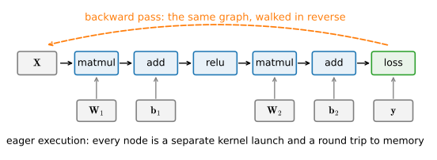
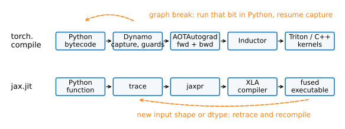

# Compute Graphs and Compilation
:label:`sec_compilation`

:numref:`sec_perf_model` left a program bleeding. An unfused chain of
elementwise operations — the kind every activation function and
normalization layer contains — ran each operation as its own GPU kernel,
and each kernel paid a full round trip to memory: read the input, compute
one cheap thing, write the output, only for the next kernel to read it
straight back. The diagnosis was bandwidth-bound, overpaying in bytes by a
factor of however many operations the chain contains. This section applies
the fix, in one line, and then explains what the line did.

The fix is *compilation*: instead of executing the network one operation
at a time as Python reaches it (*eager* execution), capture the whole
computation as a graph and hand it to a compiler, which can see across
operations and rewrite them — fusing that elementwise chain into a single
kernel that reads once, computes everything, and writes once. Both of our
frameworks do this; they do it in interestingly different ways, and the
differences are worth understanding because each has a characteristic
failure mode you will meet in practice.

*Prerequisites: the three regimes and the* `d2l.Benchmark` *timer of*
:numref:`sec_perf_model`*; the kernel-launch and memory-round-trip costs
of* :numref:`sec_hardware`*. This section retires the old imperative-
versus-symbolic "hybridize" framing in favor of the modern one: eager by
default, with a tracing compiler you switch on.*

```{.python .input #compilation-compute-graphs-and-compilation}
%%tab pytorch
%matplotlib inline
from d2l import torch as d2l
import time
import torch
from torch import nn

torch.set_float32_matmul_precision('high')
```

```{.python .input #compilation-compute-graphs-and-compilation}
%%tab jax
%matplotlib inline
from d2l import jax as d2l
import jax
from jax import numpy as jnp
import numpy as np
import time
```

## The Graph Was Always There
:label:`subsec_comp-graph`

A neural network *is* a computation graph — you have been building them
since :numref:`sec_autograd`. When you write `y = relu(x @ W + b)`,
autograd records a directed graph of operations precisely so it can walk
it backward for gradients (:numref:`fig_compute_graph`). The graph is not
new; what is new is *who gets to see it*.


:label:`fig_compute_graph`

Eager execution walks this graph one node at a time, as Python reaches
each line. Every node becomes a kernel launch (5–15 µs of CPU-to-GPU
latency, :numref:`sec_hardware`) and, for a memory-bound op, a round trip
to HBM. Python sees one operation, dispatches it, and moves on; it never
learns that the `add` feeding the `relu` could have been done *inside*
the same kernel. A compiler that captures the whole graph before running
it can — that is the entire source of its advantage.

A word of history, at footnote altitude: the frameworks once forced a
choice between *imperative* execution (flexible, debuggable, slow) and
*symbolic* graph construction (fast, rigid, awkward). That war is over.
Everyone converged on the same answer — **eager by default, with a
tracing compiler you turn on** — and the rest of this section is about the
two leading implementations of that answer.

## Capture: Two Philosophies
:label:`subsec_comp-capture`

The frameworks capture the graph in genuinely different ways, and the
difference determines how each one breaks.

**PyTorch — `torch.compile`, capture from Python bytecode.** `torch.compile`
wraps a module or function and, on first call, its front-end (TorchDynamo)
*inspects the Python bytecode* as it runs, extracting the tensor
operations into a graph while leaving the surrounding Python alone
:cite:`Ansel.Yang.He.ea.2024`. When it meets Python it cannot trace into
— a data-dependent branch, a `print`, an unsupported library call — it
does not fail; it inserts a **graph break**, runs that piece in ordinary
Python, and resumes capturing after it (:numref:`fig_compile_pipelines`,
top). The captured pieces are compiled; the breaks are the price. It also
plants *guards*: cheap runtime checks that the assumptions the graph was
compiled under (tensor shapes, dtypes) still hold, re-compiling if they do
not.


:label:`fig_compile_pipelines`

Let's see a graph break happen. A branch on a tensor's *value* forces one,
because the trace cannot know which way it goes until runtime:

```{.python .input #compilation-capture-two-philosophies-1}
%%tab pytorch
def f(x):
    x = x * 2
    if x.sum() > 0:        # Data-dependent: forces a graph break
        return x + 1
    return x - 1

explanation = torch._dynamo.explain(f)(torch.randn(8, device=d2l.try_gpu()))
print(f'graph breaks: {explanation.graph_break_count}')
```

**JAX — `jax.jit`, capture by tracing.** `jax.jit` takes the opposite
stance: it *traces* the function by calling it once with abstract
placeholder values that record every operation they touch, producing a
typed intermediate representation called a **jaxpr**, which XLA lowers to
optimized device code (:numref:`fig_compile_pipelines`, bottom). Tracing
sees tensor operations only — anything that is not a traced array
operation, like a Python `print`, runs *once at trace time* and then
vanishes from the compiled function:

```{.python .input #compilation-capture-two-philosophies-2}
%%tab jax
@jax.jit
def f(x):
    print('this prints once, at trace time')  # Not in the compiled graph
    return jnp.sin(x) + 1

x = jnp.arange(4.0)
print(jax.make_jaxpr(lambda x: jnp.sin(x) + 1)(x))  # The captured graph
_ = f(x); _ = f(x)   # Second call: no print — the trace is cached
```

The purity requirement is the flip side of having no graph breaks: because
the whole function must be traceable, JAX cannot fall back to Python
mid-graph — but in exchange it never silently splits your function into
compiled fragments. Its characteristic footgun is elsewhere: the trace is
specialized to the *shapes and dtypes* it saw, so calling the compiled
function with a new shape triggers a full **retrace and recompile**. In a
training loop with variable-length batches this can mean recompiling every
step. The escape hatches are to keep shapes static (the
`drop_remainder=True` data-loading discipline of :numref:`sec_fashion_mnist`
was exactly this, paying off now), to mark genuinely-constant arguments
with `static_argnums`, and to express data-dependent control flow with
`lax.cond`/`lax.scan` so it lives *inside* the graph rather than breaking
it. The contrast in one line: **`torch.compile` bends around Python and
you watch for breaks; `jax.jit` demands purity and you watch for
recompiles.**

## What the Compiler Does: Fusion
:label:`subsec_comp-fusion`

Now the payoff. Recall the bleeding elementwise chain from
:numref:`subsec_perf-regimes` — a handful of cheap operations, each its
own kernel, each a full memory round trip. Compilation fuses them into
one kernel that reads the input once, does all the arithmetic in
registers, and writes once:

```{.python .input #compilation-what-the-compiler-does-fusion}
%%tab pytorch
x = torch.randn(4000, 4000, device=d2l.try_gpu())

def gelu_ish(x):
    return 0.5 * x * (1 + torch.tanh(0.8 * (x + 0.04 * x**3)))

compiled = torch.compile(gelu_ish)
compiled(x)  # Warmup: first call compiles

print(d2l.Benchmark(lambda: gelu_ish(x), desc='eager'))
print(d2l.Benchmark(lambda: compiled(x), desc='compiled'))
```

```{.python .input #compilation-what-the-compiler-does-fusion}
%%tab jax
x = jax.random.normal(jax.random.PRNGKey(0), (4000, 4000))

def gelu_ish(x):
    return 0.5 * x * (1 + jnp.tanh(0.8 * (x + 0.04 * x**3)))

compiled = jax.jit(gelu_ish)
compiled(x).block_until_ready()  # Warmup: first call compiles

print(d2l.Benchmark(lambda: gelu_ish(x), desc='eager'))
print(d2l.Benchmark(lambda: compiled(x), desc='compiled'))
```

The fused version is dramatically faster — close to an order of magnitude
on this chain — and the reason is entirely on the bytes side of the
roofline: the chain performs the same arithmetic either way, but eager
execution makes one memory round trip *per operation* while the fused
kernel makes a single round trip for the whole chain. Fuse eight
elementwise ops and you cut roughly eight memory traversals to one. This
is the general rule — **fusion trades kernel launches and memory traffic
for free arithmetic in registers** — and it is why compilation helps most
exactly where :numref:`sec_perf_model` said you are bandwidth- or
overhead-bound, and barely at all where you are already compute-bound (a
single large matmul is already one well-tuned kernel; there is nothing to
fuse).

When the compiler cannot fuse enough — when a memory access pattern needs
restructuring, not just merging — people write the kernel by hand. The
hand-written FlashAttention kernel of :numref:`sec_attention-at-scale` is
exactly this: the same "keep intermediates on-chip, never round-trip the
big matrix" idea, executed by an expert for a pattern the general
compiler cannot discover. Writing such kernels is its own craft — Triton
:cite:`Tillet.Kung.Cox.2019` (which is in fact `torch.compile`'s own code
generator) and Pallas let you author them in Python-like syntax — and it
is deliberately out of scope for this book (:numref:`sec_custom_layer`
drew that fence). The point here is that the compiler gets you most of the
fusion win automatically, for free, on the code you already wrote.

## Whole-Step Compilation, Measured
:label:`subsec_comp-wholestep`

Fusing one elementwise chain is a demonstration; the real use is
compiling an entire training step — forward, backward, and optimizer — so
the compiler fuses across all of it. The lesson to internalize is the
*shape* of the cost: a large fixed price on the first call, repaid over
every step after:

```{.python .input #compilation-whole-step-compilation-measured}
%%tab pytorch
class GeluIsh(nn.Module):  # Wraps the elementwise chain above as a layer
    def forward(self, x):
        return gelu_ish(x)

net = nn.Sequential(nn.Linear(1024, 1024), GeluIsh(),
                    nn.Linear(1024, 1024), GeluIsh(),
                    nn.Linear(1024, 1024), GeluIsh(),
                    nn.Linear(1024, 1024)).to(d2l.try_gpu())
X = torch.randn(512, 1024, device=d2l.try_gpu())
opt = torch.optim.SGD(net.parameters(), lr=0.01)

def train_step(model):
    opt.zero_grad(set_to_none=True)
    model(X).sum().backward()
    opt.step()

cnet = torch.compile(net)
t0 = time.perf_counter()
train_step(cnet); torch.cuda.synchronize()  # First call: compiles
print(f'first compiled step: {time.perf_counter() - t0:.1f} s')

print(d2l.Benchmark(lambda: train_step(net), desc='eager'))
print(d2l.Benchmark(lambda: train_step(cnet), desc='compiled'))
```

```{.python .input #compilation-whole-step-compilation-measured}
%%tab jax
def loss_fn(params, X):
    h = X
    for W, b in params[:-1]:
        h = jax.nn.gelu(h @ W + b)
    W, b = params[-1]
    return (h @ W + b).sum()

key = jax.random.PRNGKey(0)
shapes = [(1024, 1024), (1024, 1024), (1024, 1024)]
params = [(jax.random.normal(k, s) * 0.03, jnp.zeros(s[1]))
          for k, s in zip(jax.random.split(key, 3), shapes)]
X = jax.random.normal(key, (512, 1024))
grad_fn = jax.value_and_grad(loss_fn)

t0 = time.perf_counter()
compiled = jax.jit(grad_fn).lower(params, X).compile()  # AOT: compile now
print(f'ahead-of-time compile: {time.perf_counter() - t0:.1f} s')

print(d2l.Benchmark(lambda: grad_fn(params, X), desc='eager'))
print(d2l.Benchmark(lambda: compiled(params, X), desc='compiled'))
```

The compiled step is faster in steady state — a fused training step makes
far fewer trips to memory and issues far fewer launches — but the first
call costs seconds while the compiler works. On a short experiment the
compile time may never be repaid; on a real training run of thousands of
steps it is amortized to nothing. The JAX tab also shows off its
ahead-of-time staging: `lower(...).compile()` runs the compiler *now*, as
an explicit step rather than lazily on first call, returning a compiled
object you can then introspect — `compiled.memory_analysis()` reports the
memory the compiler *planned* before a single byte is allocated, a theme
we develop in :numref:`sec_memory_precision`.

## The Overhead Regime: Capture and Replay
:label:`subsec_comp-overhead`

Fusion attacks the bandwidth regime. The third regime —
*overhead-bound*, where the GPU sits idle waiting for Python to launch the
next tiny kernel — needs a different weapon. A model that is a deep stack
of thin layers issues a great many small kernels, and if each takes
longer to *launch* than to *run*, the device starves no matter how little
work it truly has (:numref:`fig_async_timeline`). Compiling for fusion
helps some, but the decisive fix is to stop involving Python at all:
record the entire sequence of launches once, then *replay* it with a
single command. This is what CUDA graphs do, and `torch.compile` exposes
them through one mode flag:

```{.python .input #compilation-the-overhead-regime-capture-and-replay}
%%tab pytorch
# Many small layers: launch overhead dominates the actual arithmetic
deep = nn.Sequential(*[nn.Linear(256, 256) for _ in range(60)]).to(
    d2l.try_gpu())
x = torch.randn(64, 256, device=d2l.try_gpu())

reduced = torch.compile(deep, mode='reduce-overhead')
reduced(x)  # Warmup: compiles and captures the CUDA graph

print(d2l.Benchmark(lambda: deep(x), desc='eager'))
print(d2l.Benchmark(lambda: reduced(x), desc='reduce-overhead'))
```

```{.python .input #compilation-the-overhead-regime-capture-and-replay}
%%tab jax
# XLA already amortizes launches: the whole jitted graph is one dispatch.
deep_params = [jax.random.normal(k, (256, 256)) * 0.06
               for k in jax.random.split(jax.random.PRNGKey(1), 60)]
x = jax.random.normal(jax.random.PRNGKey(2), (64, 256))

def deep_fwd(params, x):
    for W in params:
        x = jnp.tanh(x @ W)
    return x

compiled = jax.jit(deep_fwd)
compiled(deep_params, x).block_until_ready()

print(d2l.Benchmark(lambda: deep_fwd(deep_params, x), desc='eager'))
print(d2l.Benchmark(lambda: compiled(deep_params, x), desc='jit'))
```

The `reduce-overhead` mode captures the model's kernel launches into a
CUDA graph and replays the whole thing per call, collapsing sixty launch
latencies into one. The catch is a static-shape requirement: a replayed
graph is a fixed sequence, so the input shape must not change between
calls (change it and PyTorch re-captures). The JAX tab needs no separate
mechanism and says so: a jitted function is *already* a single dispatched
executable, so XLA amortizes launch overhead by construction — the
absence of a "reduce-overhead" knob in JAX is not a missing feature but a
consequence of compile-by-tracing.

## When Compilation Hurts
:label:`subsec_comp-hurts`

Compilation is not free and not always worth it. The honest checklist:

* **Short runs.** If you train for a few dozen steps, the seconds of
  compile time may exceed everything you save. Compilation pays over
  thousands of steps, not tens.
* **Graph breaks in hot loops.** A `torch.compile`d function riddled with
  data-dependent branches compiles many small fragments and falls back to
  Python between them, keeping little of the benefit. `torch._dynamo.explain`
  (used above) counts the breaks; the fix is to remove value-dependent
  control flow from the hot path.
* **Shape churn (JAX).** A `jax.jit`ted function called with a new shape
  every step recompiles every step. Pad to fixed shapes, or accept that
  this particular function should not be jitted.
* **Already compute-bound.** If the profiler shows one big matmul
  dominating, there is nothing to fuse and no overhead to hide; compile
  it anyway (it costs nothing at steady state), but do not expect a win.

Diagnosis still comes first. Compilation is the fix for the bandwidth and
overhead regimes; reach for it when :numref:`sec_perf_model`'s method
points there, not reflexively. One last note on portability: the same
capture machinery that compiles a graph can also *export* it — PyTorch's
`torch.export` and the shared StableHLO representation let a captured
graph run outside Python entirely, in a serving runtime or on a phone.
That is the modern successor to the old model-serialization story, and it
belongs to deployment rather than training; we note it and move on.

## Summary

* A neural network is already a compute graph (autograd builds it for the
  backward pass). Eager execution walks it one kernel at a time; a
  compiler that captures the whole graph can rewrite it — chiefly by
  *fusing* operations so intermediates stay on-chip.
* `torch.compile` captures from Python bytecode and inserts *graph breaks*
  where it meets untraceable Python; `jax.jit` traces to a shape-
  specialized *jaxpr* with no breaks but *recompiles on new shapes*. Watch
  breaks in one, recompiles in the other.
* Fusion is the fix for the bandwidth regime — roughly $2\times$ on an
  unfused elementwise chain — because it trades memory round trips for
  free register arithmetic. It barely helps already-compute-bound
  kernels.
* `torch.compile(mode="reduce-overhead")` uses CUDA graphs to collapse
  many small launches into one replay, curing the overhead regime; XLA
  amortizes launches by construction and needs no such knob. Both require
  static shapes.
* Compilation costs seconds on the first call and repays over thousands of
  steps. Reach for it when the method diagnoses bandwidth or overhead, not
  reflexively.

## Exercises

1. Introduce a data-dependent `if` into a `torch.compile`d function, find
   the break with `torch._dynamo.explain`, then rewrite the control flow
   with `torch.where` and confirm the break count drops to zero. What
   happened to the steady-state time?
1. Force a `jax.jit` retrace by calling a jitted function with three
   different input lengths in a loop; time it. Then fix it two ways —
   padding to a common length, and marking the length `static_argnums` —
   and explain when each is preferable.
1. Sweep the depth of the thin-layer stack from 10 to 200 at fixed width
   256 and plot eager time and `reduce-overhead` time against depth. At
   what depth does capture-and-replay start to win, and why does the
   crossover exist?
1. Compile the matmul sweep of :numref:`subsec_perf-sweep`. For which
   sizes does the compiled time equal the eager time, and why? (Hint:
   what is a single large matmul already?)
1. Time the *first* call and the tenth call of a compiled mid-sized
   training step. How many steps of steady-state savings are needed to
   repay the first-call compile cost? Relate the answer to the "when
   compilation hurts" checklist.

<!-- slides -->

::: {.slide title="The Graph Was Always There"}
Autograd already builds a compute graph — to run *backward*.

{width=88%}

Eager: walk it one kernel at a time (a launch + a memory round
trip each). Capture it, and a compiler can rewrite across
nodes. That is the whole idea.
:::

::: {.slide title="Two Capture Philosophies"}
{width=95%}

`torch.compile`: capture Python bytecode, **graph-break** to
Python when stuck. `jax.jit`: **trace** to a jaxpr — no breaks,
but **recompile on new shapes**.
:::

::: {.slide title="Breaks vs. Retraces"}
@compilation-capture-two-philosophies-1

. . .

@compilation-capture-two-philosophies-2

The print vanishes: tracing sees tensor ops only. Purity is the
price of having no graph breaks.
:::

::: {.slide title="Fusion Cures the Bandwidth Chain"}
The bleeding chain from §13.1, cured in one line:

@compilation-what-the-compiler-does-fusion

Close to an order of magnitude, entirely on the bytes side:
one memory round trip instead of one per op. FlashAttention
(§10.5) is this idea by hand.
:::

::: {.slide title="Compile the Whole Step"}
@compilation-whole-step-compilation-measured

Large fixed cost on call one; repaid over every step after.
JAX's AOT `lower().compile()` also lets you *inspect* the plan.
:::

::: {.slide title="The Overhead Regime: Capture & Replay"}
Deep stack of thin layers — launches dominate arithmetic:

@compilation-the-overhead-regime-capture-and-replay

`reduce-overhead` records the launches into a CUDA graph and
replays them as one. XLA amortizes launches by construction —
no such knob needed.
:::

::: {.slide title="When Not to Compile"}
- short runs — compile cost never repaid
- graph breaks in the hot loop — little captured
- shape churn (JAX) — recompiles every step
- already compute-bound — nothing to fuse

Diagnose first (§13.1). Compile for bandwidth and overhead, not
reflexively.
:::
