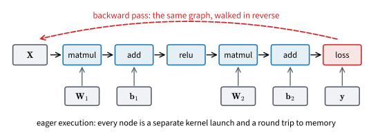
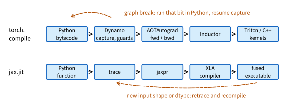

# Compute Graphs and Compilation
:label:`sec_compilation`

:numref:`sec_perf_model` measured an unfused chain of
elementwise operations — the kind every activation function and
normalization layer contains — ran each operation as its own GPU kernel,
and each kernel made a full round trip to memory: read the input, compute
one cheap thing, write the output, only for the next kernel to read it
again. The program was bandwidth-bound because it transferred every
intermediate tensor. This section shows how compilation fuses the chain and
then examines the resulting computation.

Compilation captures the computation as a graph instead of executing each
operation when Python reaches it (*eager* execution). A compiler can then
rewrite operations across the graph, for example by fusing the elementwise
chain into one kernel that reads once, performs all operations, and writes
once. Both of our
frameworks do this with different capture mechanisms and different failure
modes.

*Prerequisites: the three regimes and the* `d2l.Benchmark` *timer of*
:numref:`sec_perf_model`*; the kernel-launch and memory-round-trip costs
of* :numref:`sec_hardware`*. This section retires the old imperative-
versus-symbolic "hybridize" framing in favor of the modern one: eager by
default, with a tracing compiler you switch on.*

```{.python .input #compilation-compute-graphs-and-compilation}
%%tab pytorch
%matplotlib inline
from d2l import torch as d2l
import time
import torch
from torch import nn

torch.set_float32_matmul_precision('high')
```

```{.python .input #compilation-compute-graphs-and-compilation}
%%tab jax
%matplotlib inline
from d2l import jax as d2l
import jax
from jax import numpy as jnp
import numpy as np
import time
```

## Computation Graphs
:label:`subsec_comp-graph`

A neural network *is* a computation graph — you have been building them
since :numref:`sec_autograd`. When you write `y = relu(x @ W + b)`,
autograd records a directed graph of operations precisely so it can walk
it backward for gradients (:numref:`fig_compute_graph`). Autograd exposes
this graph to the backward pass, whereas compilation
constructs an intermediate representation for program transformation.
Autograd's graph is a *tape*, not a compiler's whole-program IR. Moreover,
not every node launches a kernel: a view launches nothing, and a library
matmul already combines many operations behind one launch.


:label:`fig_compute_graph`

Eager execution walks this graph one node at a time, as Python reaches
each line. Every node becomes a kernel launch (5–15 µs of CPU-to-GPU
latency, :numref:`sec_hardware`) and, for a memory-bound op, a round trip
to HBM. Python sees one operation, dispatches it, and moves on; it never
learns that the `add` feeding the `relu` could have been done *inside*
the same kernel. A compiler that captures the whole graph can fuse these operations before
execution.

Earlier frameworks required a choice between *imperative* execution and
*symbolic* graph construction. Current PyTorch and JAX workflows instead use
eager execution for development and enable tracing compilation for
performance. The two frameworks implement this design differently.

## Graph Capture in PyTorch and JAX
:label:`subsec_comp-capture`

The frameworks capture the graph in genuinely different ways, and the
difference determines how each one breaks.

**PyTorch — `torch.compile`, capture from Python bytecode.** `torch.compile`
wraps a module or function and, on first call, its front-end (TorchDynamo)
*inspects the Python bytecode* as it runs, extracting the tensor
operations into a graph while leaving the surrounding Python alone
:cite:`Ansel.Yang.He.ea.2024`. When it meets Python it cannot trace into
— a data-dependent branch, a `print`, an unsupported library call — it
does not fail; it inserts a **graph break**, runs that piece in ordinary
Python, and resumes capturing after it (:numref:`fig_compile_pipelines`,
top). The captured pieces are compiled; the breaks are the price. It also
plants *guards*: cheap runtime checks that the assumptions the graph was
compiled under (tensor shapes, dtypes) still hold, re-compiling if they do
not.


:label:`fig_compile_pipelines`

A branch on a tensor's *value* forces a graph break because the trace cannot
know which path it takes until runtime:

```{.python .input #compilation-capture-two-philosophies-1}
%%tab pytorch
def f(x):
    x = x * 2
    if x.sum() > 0:        # Data-dependent: forces a graph break
        return x + 1
    return x - 1

explanation = torch._dynamo.explain(f)(torch.randn(8, device=d2l.try_gpu()))
print(f'graph breaks: {explanation.graph_break_count}')
```

**JAX — `jax.jit`, capture by tracing.** `jax.jit` takes the opposite
stance: it *traces* the function by calling it once with abstract
placeholder values that record every operation they touch, producing a
typed intermediate representation called a **jaxpr**, which XLA lowers to
optimized device code (:numref:`fig_compile_pipelines`, bottom). Tracing
sees tensor operations only — anything that is not a traced array
operation, like a Python `print`, runs *once at trace time* and then
vanishes from the compiled function:

```{.python .input #compilation-capture-two-philosophies-2}
%%tab jax
@jax.jit
def f(x):
    print('this prints once, at trace time')  # Not in the compiled graph
    return jnp.sin(x) + 1

x = jnp.arange(4.0)
print(jax.make_jaxpr(lambda x: jnp.sin(x) + 1)(x))  # The captured graph
_ = f(x); _ = f(x)   # Second call: no print — the trace is cached
```

JAX avoids graph breaks by requiring the entire function to be traceable.
It cannot fall back to Python
mid-graph — but in exchange it never silently splits your function into
compiled fragments. Its main failure mode is recompilation: the trace is
specialized to the *shapes and dtypes* it saw, so calling the compiled
function with a new shape triggers a full **retrace and recompile**. In a
training loop with variable-length batches this can mean recompiling every
step. The escape hatches are to keep shapes static (the
`drop_remainder=True` data-loading discipline of :numref:`sec_fashion_mnist`
was designed for this case), to mark genuinely constant arguments
with `static_argnums`, and to express data-dependent control flow with
`lax.cond`/`lax.scan` so it lives *inside* the graph rather than breaking
it. The frameworks therefore require different checks: `torch.compile`
allows more Python but must be inspected for graph breaks, whereas
`jax.jit` requires pure traced computation and must be inspected for
shape- or dtype-triggered recompilation.

## Operation Fusion
:label:`subsec_comp-fusion`

Recall the unfused elementwise chain from
:numref:`subsec_perf-regimes` — a handful of cheap operations, each its
own kernel, each a full memory round trip. Compilation fuses them into
one kernel that reads the input once, does all the arithmetic in
registers, and writes once:

```{.python .input #compilation-what-the-compiler-does-fusion}
%%tab pytorch
x = torch.randn(4000, 4000, device=d2l.try_gpu())

def gelu_ish(x):
    return 0.5 * x * (1 + torch.tanh(0.8 * (x + 0.04 * x**3)))

compiled = torch.compile(gelu_ish)
# First call compiles; then verify the rewrite: same answer, then faster
assert torch.allclose(gelu_ish(x), compiled(x), atol=1e-6)

print(d2l.Benchmark(lambda: gelu_ish(x), desc='eager'))
print(d2l.Benchmark(lambda: compiled(x), desc='compiled'))
```

```{.python .input #compilation-what-the-compiler-does-fusion}
%%tab jax
x = jax.random.normal(jax.random.PRNGKey(0), (4000, 4000))

def gelu_ish(x):
    return 0.5 * x * (1 + jnp.tanh(0.8 * (x + 0.04 * x**3)))

compiled = jax.jit(gelu_ish)
# First call compiles; then verify the rewrite: same answer, then faster
assert jnp.allclose(gelu_ish(x), compiled(x), atol=1e-6)

print(d2l.Benchmark(lambda: gelu_ish(x), desc='eager'))
print(d2l.Benchmark(lambda: compiled(x), desc='compiled'))
```

The `assert` verifies that compilation preserves the result within
$10^{-6}$, allowing for floating-point reassociation. Performance is compared
only after this correctness check. The fused version is close to an order
of magnitude faster
on this chain — and the reason is entirely on the bytes side of the
roofline: the chain performs the same arithmetic either way, but eager
execution makes one memory round trip *per operation* while the fused
kernel makes a single round trip for the whole chain. Fuse eight
elementwise ops and you cut roughly eight memory traversals to one. More
generally, **fusion exchanges kernel launches and memory traffic for
arithmetic in registers**. Compilation therefore helps most when
:numref:`sec_perf_model` classifies the computation as bandwidth- or
overhead-bound, and barely at all where you are already compute-bound (a
single large matmul is already one well-tuned kernel; there is nothing to
fuse).

When the compiler cannot fuse enough — when a memory access pattern needs
restructuring, not just merging — people write the kernel by hand. The
hand-written FlashAttention kernel of :numref:`sec_attention-at-scale` is
exactly this: the same "keep intermediates on-chip, never round-trip the
big matrix" idea, executed by an expert for a pattern the general
compiler cannot discover. Writing such kernels is its own craft, and it
is deliberately out of scope for this book (:numref:`sec_custom_layer`
drew that fence); Triton :cite:`Tillet.Kung.Cox.2019` (an important
backend of `torch.compile`'s Inductor, which also draws on template and
library kernels) and Pallas let you author them in Python-like
syntax. A compiler applies many common fusion transformations automatically to the
existing program.

## Measured Training-Step Compilation
:label:`subsec_comp-wholestep`

The practical application is compiling a complete training step. The two
frameworks differ in which parts of that step they capture. In PyTorch,
`torch.compile(net)` captures the model's forward *and* the backward that
flows through it, but the optimizer's `opt.step()` below stays eager —
compiling the optimizer too is possible, just not what the one-liner
gives you. In JAX, nothing stops the jitted function from *being* the
whole step: loss, gradients, and the parameter update, one compiled
program. In both cases, the first call pays a fixed compilation cost, and
subsequent calls have lower steady-state execution time. Whether compilation reduces total runtime
depends on the number of subsequent calls:

```{.python .input #compilation-whole-step-compilation-measured}
%%tab pytorch
class GeluIsh(nn.Module):  # Wraps the elementwise chain above as a layer
    def forward(self, x):
        return gelu_ish(x)

net = nn.Sequential(nn.Linear(1024, 1024), GeluIsh(),
                    nn.Linear(1024, 1024), GeluIsh(),
                    nn.Linear(1024, 1024), GeluIsh(),
                    nn.Linear(1024, 1024)).to(d2l.try_gpu())
X = torch.randn(512, 1024, device=d2l.try_gpu())
opt = torch.optim.SGD(net.parameters(), lr=0.01)

def train_step(model):
    opt.zero_grad(set_to_none=True)
    model(X).sum().backward()
    opt.step()

cnet = torch.compile(net)
t0 = time.perf_counter()
train_step(cnet); torch.cuda.synchronize()  # First call: compiles
print(f'first compiled step: {time.perf_counter() - t0:.1f} s')

print(d2l.Benchmark(lambda: train_step(net), desc='eager'))
print(d2l.Benchmark(lambda: train_step(cnet), desc='compiled'))
```

```{.python .input #compilation-whole-step-compilation-measured}
%%tab jax
def loss_fn(params, X):
    h = X
    for W, b in params[:-1]:
        h = jax.nn.gelu(h @ W + b)
    W, b = params[-1]
    return (h @ W + b).sum()

def train_step(params, X, lr=0.01):  # Loss, gradients, AND the update
    loss, grads = jax.value_and_grad(loss_fn)(params, X)
    return loss, jax.tree.map(lambda p, g: p - lr * g, params, grads)

key = jax.random.PRNGKey(0)
shapes = [(1024, 1024), (1024, 1024), (1024, 1024)]
params = [(jax.random.normal(k, s) * 0.03, jnp.zeros(s[1]))
          for k, s in zip(jax.random.split(key, 3), shapes)]
X = jax.random.normal(key, (512, 1024))

t0 = time.perf_counter()
compiled = jax.jit(train_step).lower(params, X).compile()  # AOT: compile now
print(f'ahead-of-time compile: {time.perf_counter() - t0:.1f} s')

print(d2l.Benchmark(lambda: train_step(params, X), desc='eager'))
print(d2l.Benchmark(lambda: compiled(params, X), desc='compiled'))
```

The compiled step is faster in steady state — a fused training step makes
far fewer trips to memory and issues far fewer launches — and the first
call carries a visible one-time cost while the compiler works: a fraction
of a second to a couple of seconds on this toy step, depending on the
framework and the state of its compile cache, and about two seconds for
the real Transformer of :numref:`sec_fast_transformer`. On a short
experiment that price may never be repaid; on a training run of thousands
of steps, the compilation cost becomes negligible per step. The JAX tab also demonstrates
ahead-of-time compilation: `lower(...).compile()` runs the compiler as
an explicit step rather than lazily on first call, returning a compiled
object you can then introspect — `compiled.memory_analysis()` reports the
memory the compiler *planned* before a single byte is allocated, a theme
we develop in :numref:`sec_memory_precision`.

:begin_tab:`jax`
Look at the JAX ratio once more: the un-jitted step is about two orders
of magnitude slower than the compiled one, because every operation in the
loss, the gradient, *and* the update dispatches separately. JAX training
steps should normally use `jax.jit`; un-jitted execution is useful
primarily for debugging because each operation dispatches separately.
:end_tab:

## The Overhead Regime: Capture and Replay
:label:`subsec_comp-overhead`

Fusion reduces bandwidth costs. An *overhead-bound* program instead spends
most of its time waiting for Python to launch small kernels and requires
capture and replay. A model that is a deep stack
of thin layers issues a great many small kernels, and if each takes
longer to *launch* than to *run*, the device remains idle even though
each kernel requires little computation (:numref:`fig_async_timeline`). Compiling for fusion
helps some, but the decisive fix is to stop involving Python at all:
record the entire sequence of launches once, then *replay* it with a
single command. This is what CUDA graphs do, and `torch.compile` exposes
them through one mode flag:

```{.python .input #compilation-the-overhead-regime-capture-and-replay}
%%tab pytorch
# Many small layers: launch overhead dominates the actual arithmetic
deep = nn.Sequential(*[m for _ in range(60)
                       for m in (nn.Linear(256, 256), nn.Tanh())]).to(
    d2l.try_gpu())
x = torch.randn(64, 256, device=d2l.try_gpu())

reduced = torch.compile(deep, mode='reduce-overhead')
with torch.no_grad():  # Forward only: replay wants fixed buffers
    reduced(x)  # Warmup: compiles and captures the CUDA graph
    print(d2l.Benchmark(lambda: deep(x), desc='eager'))
    print(d2l.Benchmark(lambda: reduced(x), desc='reduce-overhead'))
```

```{.python .input #compilation-the-overhead-regime-capture-and-replay}
%%tab jax
# XLA already amortizes launches: the whole jitted graph is one dispatch.
deep_params = [jax.random.normal(k, (256, 256)) * 0.06
               for k in jax.random.split(jax.random.PRNGKey(1), 60)]
x = jax.random.normal(jax.random.PRNGKey(2), (64, 256))

def deep_fwd(params, x):
    for W in params:
        x = jnp.tanh(x @ W)
    return x

compiled = jax.jit(deep_fwd)
compiled(deep_params, x).block_until_ready()

print(d2l.Benchmark(lambda: deep_fwd(deep_params, x), desc='eager'))
print(d2l.Benchmark(lambda: compiled(deep_params, x), desc='jit'))
```

The `reduce-overhead` mode captures the model's kernel launches into a
CUDA graph and replays the whole thing per call, collapsing a
hundred-odd launch latencies into one. Replay is
*rigid*: a replayed graph is a fixed sequence of kernels on fixed memory
addresses, so the input shape must not change between calls (change it
and PyTorch re-captures). That rigidity is also why we time the forward
pass under `torch.no_grad()`: autograd's saved-for-backward activations
are fresh allocations on every call, and their changing addresses would
force a re-capture each time. JAX needs no separate replay mechanism: a
jitted function is *already* a single dispatched
executable, so XLA amortizes launch overhead by construction — the
absence of a "reduce-overhead" knob in JAX is not a missing feature but a
consequence of compile-by-tracing.

## When Compilation Hurts
:label:`subsec_comp-hurts`

Compilation is not free and not always worth it. The checklist:

* **Short runs.** If training lasts only a few dozen steps, compilation
  time may exceed the accumulated steady-state reduction. Report both
  first-call and repeated-call times and compute the break-even call count.
* **Graph breaks in hot loops.** A `torch.compile`d function riddled with
  data-dependent branches compiles many small fragments and falls back to
  Python between them, keeping little of the benefit. `torch._dynamo.explain`
  (used above) counts the breaks; the fix is to remove value-dependent
  control flow from the hot path.
* **Shape churn (JAX).** A `jax.jit`ted function called with a new shape
  every step recompiles every step. Pad to fixed shapes, or accept that
  this particular function should not be jitted.
* **Already compute-bound.** If the profiler shows one big matmul
  dominating, there is nothing to fuse and no overhead to hide.
  Compiling is usually harmless, but measure rather than assume —
  compilation can also regress time or memory — and do not expect a win.

The measured performance regime determines whether compilation is
appropriate. Compilation is the fix for the bandwidth and
overhead regimes; reach for it when :numref:`sec_perf_model`'s method
points there, not reflexively. One last note on portability: the same
capture machinery that compiles a graph can also *export* it — PyTorch's
`torch.export` emits a portable captured graph, and JAX lowers jitted
functions to the StableHLO interchange format; either path lets a model
run outside Python entirely, in a serving runtime or on a phone.
These export paths replace earlier model-serialization mechanisms and
belong to deployment rather than training.

## Summary

* A neural network is already a compute graph (autograd builds it for the
  backward pass). Eager execution walks it one kernel at a time; a
  compiler that captures the whole graph can rewrite it — chiefly by
  *fusing* operations so intermediates stay on-chip.
* `torch.compile` captures from Python bytecode and inserts *graph breaks*
  where it meets untraceable Python; `jax.jit` traces to a shape-
  specialized *jaxpr* with no breaks but *recompiles on new shapes*. Watch
  breaks in one, recompiles in the other.
* Fusion is the fix for the bandwidth regime — close to an order of
  magnitude on our unfused elementwise chain — because it trades memory
  round trips for free register arithmetic. It barely helps
  already-compute-bound kernels.
* `torch.compile(mode="reduce-overhead")` uses CUDA graphs to collapse
  many small launches into one replay, curing the overhead regime; XLA
  amortizes launches by construction and needs no such knob. Both require
  static shapes.
* Compilation costs seconds on the first call and repays over thousands of
  steps. Reach for it when the method diagnoses bandwidth or overhead, not
  reflexively.

## Exercises

1. Introduce a data-dependent `if` into a `torch.compile`d function, find
   the break with `torch._dynamo.explain`, then rewrite the control flow
   with `torch.where` and confirm the break count drops to zero. What
   happened to the steady-state time?
1. Force a `jax.jit` retrace by calling a jitted function with three
   different input lengths in a loop, and time it. Fix it by padding
   every input to a common length (mask the padding out of the result)
   and confirm the recompiles stop. Then explain why `static_argnums` is
   *not* a fix here: a static argument becomes part of the compilation
   cache key, so every new value triggers a fresh trace-and-compile —
   verify this by putting a counter in the function and watching it tick.
   When *is* `static_argnums` the right tool?
1. Sweep the depth of the thin-layer stack from 10 to 200 at fixed width
   256 and plot eager time and `reduce-overhead` time against depth. At
   what depth does capture-and-replay start to win, and why does the
   crossover exist?
1. Compile the matmul sweep of :numref:`subsec_perf-sweep`. For which
   sizes does the compiled time equal the eager time, and why? (Hint:
   what is a single large matmul already?)
1. Time the *first* call and the tenth call of a compiled mid-sized
   training step. How many steps of steady-state savings are needed to
   repay the first-call compile cost? Relate the answer to the "when
   compilation hurts" checklist.

<!-- slides -->

::: {.slide title="Computation Graphs"}
Autograd already builds a compute graph — to run *backward*.

{width=88%}

Eager: walk it one kernel at a time (a launch + a memory round
trip each). Capture it, and a compiler can rewrite across
nodes. Capturing the graph allows transformations across nodes.
:::

::: {.slide title="Graph Capture in PyTorch and JAX"}
{width=95%}

`torch.compile`: capture Python bytecode, **graph-break** to
Python when stuck. `jax.jit`: **trace** to a jaxpr — no breaks,
but **recompile on new shapes**.
:::

::: {.slide title="Breaks vs. Retraces"}
@compilation-capture-two-philosophies-1@pytorch

. . .

@compilation-capture-two-philosophies-2@jax

The print vanishes: tracing sees tensor ops only. Purity is the
price of having no graph breaks.
:::

::: {.slide title="Fusion Reduces Memory Traffic"}
The unfused chain from §13.1, compiled for fusion:

@compilation-what-the-compiler-does-fusion

Same answer first (the `allclose`), then faster: close to an
order of magnitude, entirely on the bytes side — one memory
round trip instead of one per op. FlashAttention (§10.5) is this
idea by hand.
:::

::: {.slide title="Compile the Training Step"}
@compilation-whole-step-compilation-measured

The first call pays a fixed compilation cost; later calls amortize it.
`torch.compile(net)` captures forward+backward (the optimizer
stays eager); `jax.jit` captures the whole step, including the update.
JAX's AOT `lower().compile()` also lets you *inspect* the plan.
:::

::: {.slide title="The Overhead Regime: Capture & Replay"}
Deep stack of thin layers — launches dominate arithmetic:

@compilation-the-overhead-regime-capture-and-replay

`reduce-overhead` records the launches into a CUDA graph and
replays them as one. XLA amortizes launches by construction —
no such knob needed.
:::

::: {.slide title="When Not to Compile"}
- short runs — compile cost never repaid
- graph breaks in the hot loop — little captured
- shape churn (JAX) — recompiles every step
- already compute-bound — nothing to fuse

Diagnose first (§13.1). Compile for bandwidth and overhead, not
reflexively.
:::
