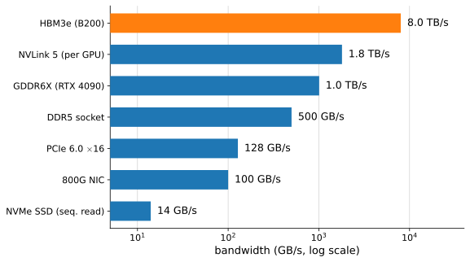
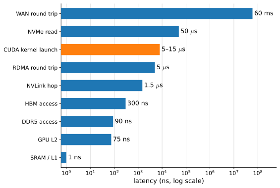
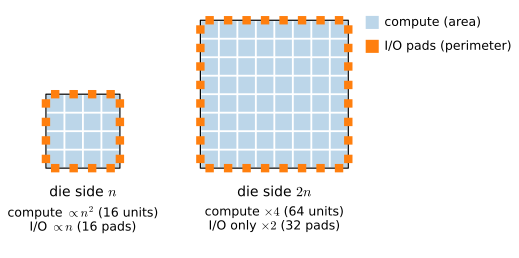
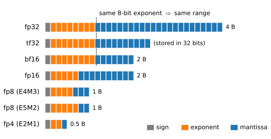
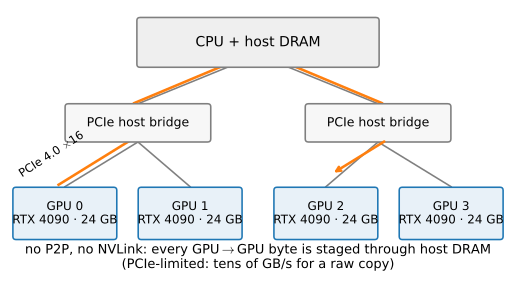
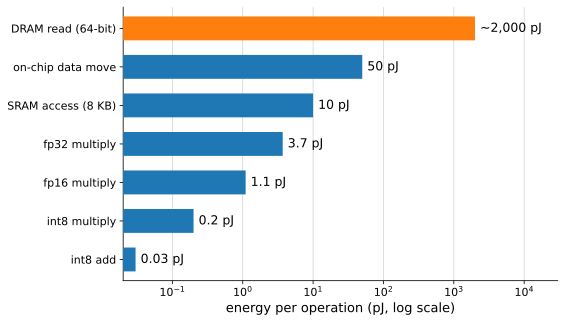

# Hardware
:label:`sec_hardware`

The previous section handed us a model with two free parameters: a machine
delivers $\min(P, I\beta)$ — peak arithmetic $P$ if you feed it enough work
per byte, bandwidth $\beta$ times intensity if you cannot. This section
explains where those two numbers come from, why their ratio — the ridge
point — keeps climbing with every hardware generation, and what else about
the machine (latency, capacity, interconnect, energy) a practitioner needs
in order to reason about performance before running anything. The aim is
working knowledge, not a computer architecture course: enough to read a
profiler, size a model, and predict which fix will pay. For the
complementary question — *what hardware should I buy* — see the buyer's
guide in :numref:`sec_hardware_buyers`; this section is about why the
machine behaves the way it does, whatever machine you have. For a proper
treatment of computer architecture see :cite:`Hennessy.Patterson.2011`.

One warning before the numbers. Hardware numbers decay: the specific
gigabytes per second below were verified in mid-2026 and will drift; every
generation roughly doubles something. What does not decay are the *ratios
and their trends* — memory is orders of magnitude slower than arithmetic,
every chip boundary costs roughly another order of magnitude, and compute
grows faster than bandwidth, which grows faster than capacity. Learn the
ladder shapes; look up the rungs when you need them.

```{.python .input #hardware}
%%tab pytorch
from d2l import torch as d2l
import time
import torch

torch.set_float32_matmul_precision('high')
```

```{.python .input #hardware}
%%tab jax
from d2l import jax as d2l
import jax
from jax import numpy as jnp
import numpy as np
import time
```

## Where Bytes Live
:label:`subsec_hw-bytes`

Every byte your program touches lives somewhere in a hierarchy
(:numref:`fig_memory_hierarchy`), and each level trades capacity for speed:
small pools close to the arithmetic are fast; large pools far away are
slow. On one end sit the GPU's on-die memories — registers and caches
totaling on the order of a tenth of a gigabyte, reachable at tens of
terabytes per second. Then comes the GPU's own DRAM — the *high-bandwidth
memory* (HBM) of datacenter parts or the GDDR of consumer cards — tens to
hundreds of gigabytes at one to eight terabytes per second. Host DRAM
holds hundreds of gigabytes at a few hundred gigabytes per second; NVMe
flash holds terabytes at about fourteen gigabytes per second; and network
storage extends without bound at whatever your network card delivers.


:label:`fig_memory_hierarchy`

Two ladders quantify the hierarchy, and both are worth staring at.
:numref:`fig_bandwidth_ladder` ranks the *pipes* by bandwidth: from an
NVMe drive's 14 GB/s, through PCIe and socket DRAM, up to on-package HBM
at 8 TB/s. The span is almost three orders of magnitude, and the rungs
correspond to physical boundaries: on-package memory is fastest because
it sits micrometers from the die; everything that crosses a connector,
a board trace, or a cable pays. The rule of thumb: **every chip boundary
costs roughly an order of magnitude of bandwidth**. Keep the bytes home.


:label:`fig_bandwidth_ladder`

:numref:`fig_latency_ladder` ranks the same world by *latency* — how long
before the first byte arrives — and spans eight orders of magnitude, from
a one-nanosecond L1 hit to a sixty-millisecond WAN round trip. Note where
the highlighted rung sits: launching a CUDA kernel costs 5–15 µs of
latency, thousands of L2 hits' worth, which is why the overhead regime of
:numref:`sec_perf_model` exists at all and why this chapter keeps returning
to "fewer, larger operations".


:label:`fig_latency_ladder`

Latency and bandwidth interact through *access patterns*. DRAM delivers
its rated bandwidth only for *burst* reads: addressing a location costs
on the order of a hundred nanoseconds, after which sequential transfers
stream at full rate — so the first word of a random read is hundreds of
times more expensive than the words that follow it. Hardware therefore
rewards streaming through memory in order and punishes pointer-chasing;
caches amortize latency only when access patterns are local and
predictable. For dense tensors this is mostly handled for you — a matmul
kernel is a carefully choreographed burst-read machine — but it is why
sparse and gather-heavy workloads struggle to reach more than a fraction
of rated bandwidth, and why shuffled *dataset* access is best done at the
granularity of large blocks. (The classic multi-core pathology of *false
sharing* — two CPU threads bouncing one cache line between cores — is
relegated to the exercises.)

Let's measure the one number from this subsection that matters most for
the roofline: our card's achievable memory bandwidth. A large elementwise
scaling reads and writes every element once — bytes moved are known
exactly, arithmetic is negligible — so timing it *is* measuring bandwidth:

```{.python .input #hardware-where-bytes-live}
%%tab pytorch
x = torch.randn(256 * 1024 * 1024, device=d2l.try_gpu())  # 1 GB fp32
t = d2l.Benchmark(lambda: x * 2.0).time
print(f'measured {2 * x.numel() * 4 / t / 1e12:.2f} TB/s '
      f'(spec: about 1.0 TB/s)')
```

```{.python .input #hardware-where-bytes-live}
%%tab jax
x = jax.random.normal(jax.random.PRNGKey(0), (256 * 1024 * 1024,))  # 1 GB
t = d2l.Benchmark(lambda: x * 2.0).time
print(f'measured {2 * x.size * 4 / t / 1e12:.2f} TB/s '
      f'(spec: about 1.0 TB/s)')
```

A well-shaped streaming kernel lands within tens of percent of the
specification — the spec number is real, not marketing. Remember what
this kernel is: the bandwidth-bound regime made flesh. Every elementwise
operation in every network you train runs at this speed, no matter how
little it computes.

## Why Compute Outruns Bandwidth
:label:`subsec_hw-shoreline`

The ridge point of :numref:`sec_perf_model` is not an accident of one
product; it is geometry. Arithmetic units fill the *interior* of a die:
double the die's side length (or halve the feature size) and you get four
times the compute, because compute scales with *area*. But the wires that
leave the chip — the I/O drivers that talk to memory — live on the die's
*edge*, and the edge only doubles. Compute scales as $n^2$, I/O as $n$
(:numref:`fig_shoreline`). Chip designers call the edge "beachfront", and
there is never enough of it: with every generation, bytes-per-FLOP falls,
and the model starves a little more.


:label:`fig_shoreline`

HBM is the countermeasure: stack DRAM dies vertically and place the stack
on a silicon *interposer* millimeters from the GPU die, so thousands of
short, dense wires replace the few hundred long board traces a socketed
DIMM gets. That is how a B200 reaches 8 TB/s while a CPU socket manages
0.5 TB/s — not faster DRAM cells, but vastly more, vastly shorter wires.
The second countermeasure is size: dies are manufactured against a hard
lithographic ceiling (the *reticle limit*, about $858\,\textrm{mm}^2$),
and flagship accelerators live at it — a B200 is two reticle-limit dies
bridged into one logical GPU. When you cannot grow the die, you bridge
dies; when you cannot bridge, you network — the interconnect story of
:numref:`subsec_hw-interconnects` is the shoreline problem continued by
other means.

The trend to memorize, per hardware generation, at fixed precision:
**compute grows about $4\times$, bandwidth about $2\times$, capacity about
$1.7\times$.** The ridge point — compute over bandwidth — therefore
*rises* every generation; workloads that were compute-bound five years ago
are bandwidth-bound today. This is why a chapter about performance is
mostly a chapter about bytes, and why it will remain one.

## The GPU
:label:`subsec_hw-gpu`

A GPU spends its area on thousands of simple arithmetic units rather than
on the deep control logic of a CPU core. The units are organized into
*streaming multiprocessors* (SMs) — our RTX 4090 has 128 of them — and
each SM executes threads in lockstep groups of 32 called *warps*,
swapping between many resident warps to hide memory latency. That is as
much microarchitecture as this book needs: when a profiler reports
"occupancy" it means resident warps available for latency-hiding; when a
kernel is "too small for the machine" it means too few warps to keep 128
SMs busy — the launch-overhead regime again.

What makes GPUs *deep learning* machines is a further specialization:
**tensor cores**, silicon shaped exactly like a small matrix
multiply-accumulate. A scalar unit spends most of its energy on
instruction handling per multiply; a tensor core amortizes that control
over an entire $16\times 16$-ish tile, executing it as one instruction —
the same insight as the TPU's systolic array
:cite:`Jouppi.Young.Patil.ea.2017,Kung.1988`. The consequence: matrix
multiplications run an order of magnitude faster than anything else on
the chip, *provided* the data comes in the formats the tensor cores
speak. Those formats are the ladder in :numref:`fig_float_formats`.


:label:`fig_float_formats`

Two rules organize the ladder. First, **the exponent width sets the
range, the mantissa width sets the precision**. fp32, tf32, and bf16 all
carry the same 8-bit exponent: they represent the same span of magnitudes
and can be swapped without overflow — you only lose decimal places, which
deep learning mostly tolerates. fp16's 5-bit exponent trades range for
precision, which is why it needs the loss-scaling machinery we will meet
in :numref:`sec_memory_precision`, and why bf16 has become the training
default. The sub-byte formats — fp8 in two flavors (E4M3 for activations
and weights, wider-range E5M2 for gradients) and fp4 with just sixteen
representable values — push the same trade to its limit and lean on
per-block scaling factors to survive :cite:`Micikevicius.Stosic.Burgess.ea.2022`.
Second, **every halving wins twice**: half the bits means double the peak
FLOP/s (twice the tile fits in the same silicon) *and* half the bytes per
operand — the format ladder climbs the roofline along both axes at once.
The catch: each halving buys about $2\times$ on real silicon, not the
$4\times$ the marketing arithmetic suggests, and the big jumps between
generations come from new architectures, not formats alone.

The numbers-dense table, for orientation (dense compute, fp32
accumulation; sparsity-doubled marketing figures excluded):

| | H100 SXM | B200 SXM | RTX 4090 (ours) | RTX 5090 |
|---|---|---|---|---|
| memory | 80 GB HBM3 | 192 GB HBM3e | 24 GB GDDR6X | 32 GB GDDR7 |
| bandwidth | 3.35 TB/s | 8.0 TB/s | 1.0 TB/s | 1.8 TB/s |
| bf16 dense | 989 TF | 2,250 TF | 165 TF | 210 TF |
| fp8 dense | 1,979 TF | 4,500 TF | 330 TF | 419 TF |
| fp4 dense | — | 9,000 TF | — | 1,676 TF |
| ridge (bf16) | ~295 FLOP/B | ~281 FLOP/B | ~165 FLOP/B | ~117 FLOP/B |
| power | 700 W | 1,000–1,200 W | 450 W | 575 W |
:label:`tab_gpu_specs`

The same physics produces the same shape at every vendor — high-bandwidth
stacked memory next to a die full of matrix engines: AMD's MI355X (288 GB
HBM3e at 8 TB/s, 5,000 TF bf16), Google's TPU v7 (192 GB at 7.4 TB/s,
2,307 TF), Amazon's Trainium2 (96 GB at 2.9 TB/s, 667 TF). Different
silicon, one design point; the roofline reasoning of this chapter applies
unchanged to all of them.

One more distinction the table hides: *training* hardware must hold
activations for the backward pass and accumulate gradients robustly
(bf16 with fp32 accumulation as the floor — :numref:`sec_memory_precision`),
while *inference* can run forward-only in the smallest format quality
allows. That asymmetry, plus capacity — note that memory capacity grew
the *slowest* of the three curves — shapes the memory anatomy we build in
:numref:`sec_memory_precision`.

## The CPU's Role
:label:`subsec_hw-cpu`

The CPU in a deep learning machine is no longer where the FLOPs happen —
one RTX 4090 out-multiplies a 64-core CPU by two orders of magnitude —
but three jobs still live or die on it. First, the CPU is the
*orchestrator*: every kernel the GPU runs was launched by a CPU thread at
5–15 µs apiece (:numref:`fig_latency_ladder`), which is exactly the
Python-must-stay-ahead story of :numref:`sec_perf_model`. Second, it runs
the *input pipeline*: decoding JPEGs, tokenizing text, augmenting,
batching — if those fall behind, the GPU starves no matter how fast it
is (a dataloader-starved profile is the overhead regime with extra
steps). Third, it *feeds the bus*: host-to-device copies cross PCIe, and
how you stage the host memory matters. A regular (pageable) host tensor
must first be copied into a locked staging buffer before DMA can move it;
allocating the tensor in *pinned* (page-locked) memory skips that step
and, as a bonus, allows the copy to proceed asynchronously alongside
compute (`non_blocking=True`, `DataLoader(pin_memory=True)`):

```{.python .input #hardware-the-cpu-s-role}
%%tab pytorch
x_pageable = torch.randn(64 * 1024 * 1024)          # 256 MB on the host
x_pinned = x_pageable.pin_memory()
gpu = d2l.try_gpu()
for desc, src in [('pageable', x_pageable), ('pinned', x_pinned)]:
    t = d2l.Benchmark(lambda: src.to(gpu, non_blocking=True),
                      desc=f'{desc} H2D').time
    print(f'{desc}: {x_pageable.numel() * 4 / t / 1e9:.1f} GB/s')
```

```{.python .input #hardware-the-cpu-s-role}
%%tab jax
# JAX manages host staging internally; measure the achieved H2D rate.
x_host = np.random.randn(64 * 1024 * 1024).astype(np.float32)  # 256 MB
t = d2l.Benchmark(lambda: jax.device_put(x_host), desc='H2D').time
print(f'device_put: {x_host.nbytes / t / 1e9:.1f} GB/s')
```

The measured rate tops out near PCIe's practical ceiling — tens of GB/s,
two orders of magnitude below the GPU's own memory. The conclusion is
structural: get data onto the device, keep it there, and overlap the
unavoidable transfers with compute. This is also your first sighting of
the number that will dominate the multi-GPU sections: *everything that
leaves the GPU moves at bus speed, not memory speed*.

## Interconnects: Our Box as the Worked Example
:label:`subsec_hw-interconnects`

When one GPU is not enough, GPUs must talk to each other, and the
bandwidth ladder says this is where performance goes to die. Datacenter
parts attack the problem with dedicated fabrics: NVLink gives each B200
1.8 TB/s to its peers — memory-class bandwidth, one rung below HBM — and
an NVL72 rack wires 72 GPUs into a single 130 TB/s domain. Consumer
parts get PCIe, and — the fact that shapes the rest of this chapter —
consumer GeForce cards have *peer-to-peer transfers disabled* as market
segmentation: two RTX 4090s in one box may not even talk PCIe-directly to
each other.

Our build machine makes the consequence concrete
(:numref:`fig_pcie_topology`). Its four RTX 4090s hang in pairs off two
PCIe host bridges; with P2P disabled, *every* byte from one GPU to
another is staged through host DRAM — up one PCIe link, through the
CPU's memory system, down another. Measured end to end
(:numref:`sec_multi_gpu` does the measuring), a large GPU-to-GPU copy
sustains a few tens of GB/s — PCIe-limited, roughly two orders of magnitude
below an NVL72's ~1.8 TB/s per GPU — and a collective library like NCCL,
whose ring/tree chunking assumes a peer-to-peer fabric, extracts even less
(a couple of GB/s of effective bus bandwidth) on this staged path. Either
way the per-GPU staging step, not the link count, is the ceiling, so it
does *not* improve from two GPUs to four.


:label:`fig_pcie_topology`

We treat this as a teaching instrument, not an embarrassment. Most
readers' multi-GPU machines look like ours, not like an NVL72; and a slow
fabric makes the *accounting* of parallel training vivid — on this box,
communication costs are impossible to ignore, so the cost model of
:numref:`sec_multi_gpu` predicts real behavior instead of disappearing
into NVLink headroom. Why datacenter fabrics exist will not need to be
asserted; we will have measured it.

## Energy: Why Moving Bytes Is the Budget
:label:`subsec_hw-energy`

There is a final ladder underneath the other two.
:numref:`fig_energy_ladder` shows the energy cost of elementary
operations at a fixed process node :cite:`Horowitz.2014`: an 8-bit
integer add costs 0.03 pJ, an fp32 multiply 3.7 pJ — and *one 64-bit
read from DRAM costs about 2,000 pJ*. One memory access buys roughly
five hundred multiplies. Arithmetic is nearly free; fetching operands is
the budget, and a chip's power limit is in the end an energy-per-second
limit. This is the deepest version of the ridge-point story: the reason
compute outruns bandwidth is not just wire count but joules — you can
afford to place more multipliers, but you cannot afford to feed them
from far away.


:label:`fig_energy_ladder`

The practical corollaries are the fixes this chapter teaches: fusion
(:numref:`sec_compilation`) saves energy, not just time, by keeping
intermediates on-die; low-precision formats
(:numref:`sec_memory_precision`) halve the bytes and hence nearly halve
the energy per operand; recomputation trades cheap arithmetic for
expensive memory traffic. When a technique in this chapter feels like a
trick, check it against :numref:`fig_energy_ladder` — nearly all of them
are the same move: *do more arithmetic per byte fetched*.

## Reading the Roofline: Two Workloads
:label:`subsec_hw-two-workloads`

Close the loop by reading one model's two working regimes straight off
the hardware numbers — the exercise this section exists to enable.
Consider a language model of the kind built in
:numref:`sec_gpt`, with $N$ parameters in bf16 ($2N$ bytes of weights),
serving a prompt and then generating.

**Prefill** — processing the prompt — pushes the whole context through
the network at once. Each weight fetched from memory is reused across
every token in the context, so arithmetic intensity is on the order of
the context length: hundreds to tens of thousands of FLOPs per byte,
far above any ridge point. Prefill is *compute-bound*: it runs at the
tensor cores' pace and benefits from every format halving.

**Decode** — generating one token at a time — is the opposite. Producing
a single token performs about $2N$ FLOPs but must read all $2N$ weight
bytes (plus the KV cache of :numref:`sec_kv-cache`): intensity $\approx
1$ FLOP/byte, the bottom of the roofline. Decode is *bandwidth-bound*,
and its speed limit is arithmetic you can do on a napkin:

$$
\textrm{tokens/s} \;\lesssim\;
\frac{\beta}{\textrm{bytes per token}} \;=\;
\frac{\beta}{2N + \textrm{KV bytes}}.
$$

An 8-billion-parameter model in bf16 reads at least 16 GB per generated
token; on our 1 TB/s card that caps generation near sixty tokens per
second *regardless of compute*, while the same card's prefill chews
through the prompt at tensor-core speed. One model, both ends of
:numref:`fig_roofline` — and the reason batching multiple generation
streams (which shares each weight read across streams, multiplying
intensity by the batch size) is the central trick of inference serving.
The systems that exploit this — batching schedulers, paged caches,
speculative decoding — belong to the Language Models part; the
*economics* fit in the equation above.

Rules of thumb worth carrying out of this section:

| quantity | magnitude | why it matters |
|---|---|---|
| kernel launch | 5–15 µs | small ops cannot feed the GPU (:numref:`sec_compilation`) |
| GPU memory bandwidth | 1–8 TB/s | the decode/elementwise speed limit |
| PCIe per direction | tens of GB/s | host↔device; get data on-device, keep it there |
| NVLink-class fabric | ~1.8 TB/s per GPU | why datacenter multi-GPU scales and PCIe boxes struggle |
| bytes/param, training with Adam | ~16–20 (mixed precision) | memory anatomy of :numref:`sec_memory_precision` |
| bytes/token, decode | ~2 × params + KV | tokens/s ≤ bandwidth / this |
| DRAM read vs fp32 multiply | ~500× the energy | fuse, shrink formats, recompute |
:label:`tab_rules_of_thumb`

## Summary

* Memory is a hierarchy: each level away from the arithmetic holds orders
  of magnitude more bytes and delivers orders of magnitude fewer per
  second, with a latency ladder spanning eight decades. Bandwidth is
  earned by streaming; boundaries cost an order of magnitude each.
* Compute scales with die area, I/O with die perimeter — so compute grows
  ~4× per generation while bandwidth grows ~2× and capacity ~1.7×, and
  the ridge point keeps rising. HBM-on-interposer is a countermeasure,
  not a repeal.
* Tensor cores make matrix arithmetic an order of magnitude faster than
  everything else, in exchange for format discipline: same exponent =
  same range; every halving of width doubles FLOP/s and halves bytes.
* The CPU orchestrates (kernel launches), feeds (input pipeline), and
  stages (pinned-memory PCIe copies). Inter-GPU bandwidth on consumer
  boxes is host-staged and PCIe-limited — tens of GB/s for a raw copy,
  and only a couple of GB/s of NCCL busbw — one to two orders of magnitude
  below an NVLink domain, which is why datacenter fabrics exist.
* Energy explains everything twice: a DRAM access costs ~500 multiplies,
  so every technique in this chapter is a variation on "more arithmetic
  per byte fetched".
* One model can live at both ends of the roofline: prefill is
  compute-bound, single-stream decode is bandwidth-bound with tokens/s ≲
  bandwidth / model bytes.

## Exercises

1. Compute the ridge point for each GPU in :numref:`tab_gpu_specs` at
   bf16 and at fp8. Which direction has it moved between the H100 and
   the B200 generations, and why is that the expected direction?
1. Take the GPT of :numref:`sec_gpt` (count its parameters) and your own
   GPU's specifications. Estimate (a) the prefill arithmetic intensity at
   context length 128 and (b) the decode tokens-per-second bound. Which
   regime is each in?
1. Using :numref:`fig_energy_ladder`, estimate the energy spent on DRAM
   traffic alone in one epoch of the Fashion-MNIST training loop of
   :numref:`sec_lenet` (count the bytes your activations and weights
   move). At $0.30/kWh, what does the epoch's memory traffic cost?
1. Measure the cache cliff on your GPU: time `x * 2.0` for tensor sizes
   from 1 MB to 2 GB and plot achieved bandwidth against size. Where do
   the level transitions of :numref:`fig_memory_hierarchy` appear?
1. Why is HBM placed on a silicon interposer rather than on the
   motherboard next to the CPU's DRAM slots? Answer using the shoreline
   argument, then check: how many signal wires does a DIMM socket carry,
   versus an HBM stack's interface?
1. Burst versus random access: allocate a large tensor and compare
   summing it in natural order against summing it through a random
   permutation of indices. Explain the ratio using the
   address-setup-versus-streaming model of
   :numref:`subsec_hw-bytes`.
1. (False sharing.) Write a two-thread CPU program in which each thread
   increments its own counter, first with the counters adjacent in
   memory, then padded to separate cache lines. Measure, and explain why
   the "shared-nothing" version can be many times faster despite
   identical arithmetic.
1. Your DataLoader delivers batches at 300 MB/s from NVMe while your GPU
   consumes them at 2 GB/s. Using the ladders in this section, list the
   three cheapest interventions in order of expected payoff.

<!-- slides -->

::: {.slide title="Where the Two Numbers Come From"}
The roofline had two free parameters: peak compute $P$ and
bandwidth $\beta$. This section is where they come from — and
why $P/\beta$ keeps climbing.

- bytes live in a **hierarchy**: each level out is bigger and
  slower by orders of magnitude
- compute is **area**, I/O is **perimeter**
- arithmetic is (energetically) free; **moving operands is the
  budget**

Properties here; buying advice lives in the Tools appendix.
:::

::: {.slide title="Two Ladders"}
{width=85%}

Every chip boundary ≈ one order of magnitude. Keep bytes home.
:::

::: {.slide title="Latency: Eight Orders of Magnitude"}
{width=85%}

The highlighted rung — 5–15 µs to launch a kernel — is why the
overhead regime exists.
:::

::: {.slide title="Measured, Not Asserted"}
A big elementwise op *is* a bandwidth meter — bytes known,
arithmetic negligible:

@hardware-where-bytes-live

Streaming kernels land within tens of percent of spec.
:::

::: {.slide title="The Shoreline"}
{width=80%}

Per generation: compute ~4×, bandwidth ~2×, capacity ~1.7×.
The ridge point rises; the model starves a little more each
generation. HBM-on-interposer is the countermeasure.
:::

::: {.slide title="The Format Ladder"}
{width=75%}

Same 8-bit exponent (fp32/tf32/bf16) ⇒ same range, swap freely.
Every halving wins twice: 2× FLOP/s *and* half the bytes.
:::

::: {.slide title="Our Box vs. a Datacenter Rack"}
{width=70%}

No P2P on GeForce: every inter-GPU byte staged through host
DRAM — PCIe-limited, tens of GB/s for a raw copy (a couple for
NCCL busbw), flat from 2 to 4 GPUs. An NVL72 gives each GPU
1.8 TB/s. One to two orders of magnitude — that gap *is* the
multi-GPU chapter.
:::

::: {.slide title="Energy, and One Model at Both Ends"}
{width=72%}

One DRAM read ≈ 500 fp32 multiplies.

. . .

Prefill: weight reuse ~ context length ⇒ compute-bound.
Decode: every token reads all weights ⇒ tokens/s ≲ β / model
bytes. One model, both ends of the roofline.
:::
