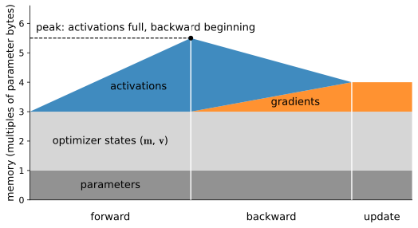

# Memory and Precision
:label:`sec_memory_precision`

So far this chapter has fought for *time*: fewer memory round trips, fewer
kernel launches, more arithmetic per byte. This section fights for *space*.
Sooner or later a model stops fitting: the optimizer states, the
activations held for the backward pass, and a large enough batch together
overflow the card, and training dies with an out-of-memory error long
before it is slow. The good news is that memory is the most *legible* of
the resources — you can write down exactly where every byte of a training
step goes, measure it against that prediction, and then spend three
well-understood techniques to buy headroom: lower-precision formats, which
also buy speed; activation checkpointing, which trades compute for memory;
and gradient accumulation, which trades *time* for the effect of a bigger
batch. Together these are the "it doesn't fit" rung of the ladder, and
they are what stand between a 24 GB card and a model that wants 30.

*Prerequisites: the format ladder and tensor-core requirement of*
:numref:`sec_hardware`*; the* `d2l.Benchmark` *timer of*
:numref:`sec_perf_model`*; the AdamW optimizer states of*
:numref:`sec_adam`*. This section finally discharges the "gradient
accumulation, returned to in the performance chapter" promise of*
:numref:`sec_minibatch_sgd`*.*

```{.python .input #memory-precision-memory-and-precision}
%%tab pytorch
%matplotlib inline
from d2l import torch as d2l
import torch
from torch import nn

torch.set_float32_matmul_precision('high')
```

```{.python .input #memory-precision-memory-and-precision}
%%tab jax
%matplotlib inline
from d2l import jax as d2l
import jax
from jax import numpy as jnp
import numpy as np
```

## The Memory Anatomy of a Training Step
:label:`subsec_mp-anatomy`

A training step holds four kinds of tensor in memory, and knowing their
sizes lets you predict the peak before you run anything
(:numref:`fig_memory_anatomy`). Let the model have $P$ parameters.

* **Parameters** — $P$ values. In mixed-precision training these are kept
  in fp32 (4 bytes) as the master copy: $4P$ bytes.
* **Gradients** — one per parameter, produced during the backward pass:
  another $4P$ bytes.
* **Optimizer states** — Adam keeps a first and second moment per
  parameter (:numref:`sec_adam`), $2 \times 4P = 8P$ bytes; plain SGD
  keeps none.
* **Activations** — every intermediate result the forward pass produces
  that the backward pass will need. Unlike the first three, this scales
  with the *batch* and the *depth*: roughly
  $\textrm{batch} \times \textrm{sequence} \times \textrm{width} \times
  \textrm{depth}$, and it is usually the term that blows up.


:label:`fig_memory_anatomy`

Add the constant terms: training a model with Adam costs about
$4P + 4P + 8P = 16P$ bytes *before a single activation* — sixteen bytes
per parameter, the number to carry in your head. (Mixed precision, below,
nudges this to roughly 18–20 by keeping some tensors in two formats; it
still saves memory overall, because activations, the dominant term,
halve.) The shape of :numref:`fig_memory_anatomy` is the other half of the
lesson: activations *accumulate* through the forward pass and are *freed*
as the backward pass consumes them, so peak memory occurs early in
backward — which is exactly the moment activation checkpointing will
target.

## Measuring Memory
:label:`subsec_mp-measuring`

The frameworks let you check the anatomy against reality, and — as with
timing — the two do it in characteristically different ways. PyTorch keeps
running *counters* you query at runtime; JAX lets the compiler *plan*
memory ahead of time and reports the plan. Start with PyTorch's counters,
the numbers the anatomy table predicts:

```{.python .input #memory-precision-measuring-memory-1}
%%tab pytorch
gpu = d2l.try_gpu()
net = nn.Sequential(*[nn.Linear(2048, 2048) for _ in range(6)]).to(gpu)
X = torch.randn(256, 2048, device=gpu)
opt = torch.optim.Adam(net.parameters())

torch.cuda.reset_peak_memory_stats()
opt.zero_grad(set_to_none=True)
net(X).sum().backward()
opt.step()
P = sum(p.numel() for p in net.parameters())
print(f'{P/1e6:.1f}M params  '
      f'predicted states+grads+params: {16 * P / 1e6:.0f} MB')
print(f'measured peak: {torch.cuda.max_memory_allocated() / 1e6:.0f} MB')
```

For a finer picture, PyTorch can record every allocation and free as a
*snapshot*. Rather than embed its interactive viewer, we reconstruct the
one plot that matters — allocated bytes over the step — directly from the
recorded trace, and see the sawtooth of :numref:`fig_memory_anatomy` in
real data:

```{.python .input #memory-precision-measuring-memory-2}
%%tab pytorch
torch.cuda.memory._record_memory_history(max_entries=100000)
for _ in range(3):
    opt.zero_grad(set_to_none=True)
    net(X).sum().backward()
    opt.step()
snapshot = torch.cuda.memory._snapshot()
torch.cuda.memory._record_memory_history(enabled=None)

# Reconstruct cumulative allocated bytes from the allocation trace.
cum, series = 0, []
for ev in snapshot['device_traces'][0]:
    if ev['action'] == 'alloc':
        cum += ev['size']
    elif ev['action'] == 'free_completed':
        cum -= ev['size']
    series.append(cum / 1e6)
d2l.plot(list(range(len(series))), [series],
         'allocation event', 'allocated (MB)')
```

Each cycle is one training step: memory climbs through the forward pass as
activations accumulate, then falls through the backward pass as they are
released — exactly the anatomy, now measured. The JAX side plans instead
of counts. Ahead-of-time compilation (:numref:`sec_compilation`) hands
back an object whose `memory_analysis()` reports what the compiler
*decided* to allocate, before any memory is touched:

```{.python .input #memory-precision-measuring-memory-3}
%%tab jax
def loss_fn(params, X):
    h = X
    for W in params:
        h = jax.nn.relu(h @ W)
    return h.sum()

key = jax.random.PRNGKey(0)
params = [jax.random.normal(k, (2048, 2048)) * 0.02
          for k in jax.random.split(key, 6)]
X = jax.random.normal(key, (256, 2048))

compiled = jax.jit(jax.grad(loss_fn)).lower(params, X).compile()
a = compiled.memory_analysis()
print(f'compiler-planned temp memory: {a.temp_size_in_bytes / 1e6:.0f} MB')
print(f'argument + output: '
      f'{(a.argument_size_in_bytes + a.output_size_in_bytes) / 1e6:.0f} MB')
```

The contrast is worth stating plainly: **PyTorch counts allocations as
they happen; XLA plans memory at compile time.** Neither is better; they
reflect the eager-versus-traced split of :numref:`sec_compilation`, and
knowing which mental model your framework uses tells you where to look
when memory surprises you.

## Mixed Precision
:label:`subsec_mp-mixed`

The format ladder of :numref:`sec_hardware` promised that every halving of
width wins twice — double the tensor-core throughput and half the bytes.
Mixed precision cashes that promise for training. The idea: run the
compute-heavy operations (matmuls, convolutions) in bf16, where tensor
cores are fastest and activations are half-size, while keeping a few
numerically delicate things (the master weights, the loss reduction) in
fp32. On our Ada card the arithmetic win is real and robust — but only if
you measure against an *honest* baseline, which is the lesson
:numref:`sec_hardware` flagged: tf32 tensor cores are off by default, so a
naive fp32 baseline is needlessly slow and inflates the apparent speedup.
We show both baselines, once, so the difference is unmistakable:

```{.python .input #memory-precision-mixed-precision}
%%tab pytorch
net = nn.Sequential(nn.Flatten(),
                    nn.Linear(64 * 64, 8192), nn.ReLU(),
                    nn.Linear(8192, 8192), nn.ReLU(),
                    nn.Linear(8192, 10)).to(gpu)
X = torch.randn(2048, 1, 64, 64, device=gpu)
y = torch.randint(0, 10, (2048,), device=gpu)
opt = torch.optim.SGD(net.parameters(), lr=0.01)
loss = nn.CrossEntropyLoss()

def step(autocast, dtype=None):
    opt.zero_grad(set_to_none=True)
    if autocast:
        with torch.autocast('cuda', dtype=dtype):
            l = loss(net(X), y)
    else:
        l = loss(net(X), y)
    l.backward(); opt.step()

torch.set_float32_matmul_precision('highest')  # Unfair baseline: tf32 off
print(d2l.Benchmark(lambda: step(False), desc='fp32 (tf32 off)'))
torch.set_float32_matmul_precision('high')     # Fair baseline: tf32 on
print(d2l.Benchmark(lambda: step(False), desc='tf32'))
print(d2l.Benchmark(lambda: step(True, torch.bfloat16), desc='bf16 autocast'))
```

```{.python .input #memory-precision-mixed-precision}
%%tab jax
def net_fn(params, X, dtype):
    h = X.reshape(X.shape[0], -1).astype(dtype)
    for W in params[:-1]:
        h = jax.nn.relu(h @ W.astype(dtype))
    return h @ params[-1].astype(dtype)

key = jax.random.PRNGKey(0)
sizes = [(64 * 64, 8192), (8192, 8192), (8192, 10)]
params = [jax.random.normal(k, s) * 0.02
          for k, s in zip(jax.random.split(key, 3), sizes)]
X = jax.random.normal(key, (2048, 64 * 64))

def loss_fn(params, dtype):
    return (net_fn(params, X, dtype) ** 2).sum()

f32 = jax.jit(jax.grad(loss_fn), static_argnums=1)
print(d2l.Benchmark(lambda: f32(params, jnp.float32), desc='fp32'))
print(d2l.Benchmark(lambda: f32(params, jnp.bfloat16), desc='bf16'))
```

Against the fair tf32 baseline, bf16 autocast runs about one and a half
times as fast here — and note the two-step story the three timings tell:
turning tf32 on (the fair baseline) already bought a good fraction over
plain fp32, and bf16 then adds roughly that much again. Both are genuine
tensor-core wins, not measurement artifacts.
Note what the PyTorch tab does *not* use: a `GradScaler`. Loss scaling
exists to keep tiny fp16 gradients from underflowing fp16's narrow
5-bit-exponent range; bf16 shares fp32's 8-bit exponent
(:numref:`fig_float_formats`), so its gradients do not underflow and no
scaler is needed. fp16-plus-`GradScaler` is the pre-Ampere legacy path,
worth one sentence and an exercise. The JAX tab makes the philosophical
difference visible: precision in JAX is *explicit* — you thread dtypes
through the computation (or set `jax.default_matmul_precision`) rather than
wrapping a context manager. PyTorch decides per-operation what to cast;
JAX makes you say it. Both report the same physics: bf16 halves the bytes
and doubles the tensor-core rate.

## Activation Checkpointing
:label:`subsec_mp-checkpointing`

Mixed precision halves activation memory; activation checkpointing can cut
it much further, by refusing to *store* most activations at all. Recall
from :numref:`fig_memory_anatomy` that activations are held from the
moment the forward pass produces them until the backward pass consumes
them — that storage is the peak. Checkpointing makes a different trade:
store only a few activations (at block boundaries), and when the backward
pass needs the ones in between, *recompute them* by re-running that block's
forward pass. You pay extra compute — at most one extra forward pass, a
modest increase in step time — to avoid holding a large fraction of the
activations. This is the same "recompute rather than store" argument the
Mamba kernel of :numref:`sec_mamba` made one level down in the hardware
:cite:`Chen.Xu.Zhang.ea.2016`.

```{.python .input #memory-precision-activation-checkpointing}
%%tab pytorch
from torch.utils.checkpoint import checkpoint

class Block(nn.Module):
    def __init__(self, d=1024):
        super().__init__()
        self.net = nn.Sequential(nn.Linear(d, d), nn.GELU(), nn.Linear(d, d))
    def forward(self, x):
        return x + self.net(x)

blocks = nn.ModuleList([Block().to(gpu) for _ in range(16)])
X = torch.randn(16384, 1024, device=gpu, requires_grad=True)

def run(use_ckpt):
    h = X
    for blk in blocks:
        # use_reentrant=False is the modern, mandatory-since-2.9 form
        h = checkpoint(blk, h, use_reentrant=False) if use_ckpt else blk(h)
    return h.sum()

for use_ckpt in (False, True):
    torch.cuda.reset_peak_memory_stats()
    run(use_ckpt).backward()
    tag = 'checkpointed' if use_ckpt else 'store all'
    print(f'{tag}: peak {torch.cuda.max_memory_allocated() / 1e6:.0f} MB')
```

```{.python .input #memory-precision-activation-checkpointing}
%%tab jax
def block(W1, W2, x):
    return x + jax.nn.gelu(x @ W1) @ W2

key = jax.random.PRNGKey(1)
Ws = [(jax.random.normal(k, (1024, 1024)) * 0.02,
       jax.random.normal(k, (1024, 1024)) * 0.02)
      for k in jax.random.split(key, 16)]
X = jax.random.normal(key, (16384, 1024))

# jax.checkpoint (a.k.a. remat) recomputes the block in the backward pass.
ckpt_block = jax.checkpoint(block)
def forward(Ws, X, blk):
    h = X
    for W1, W2 in Ws:
        h = blk(W1, W2, h)
    return (h ** 2).sum()

for name, blk in [('store all', block), ('checkpointed', ckpt_block)]:
    compiled = jax.jit(jax.grad(forward), static_argnums=2).lower(
        Ws, X, blk).compile()
    mb = compiled.memory_analysis().temp_size_in_bytes / 1e6
    print(f'{name}: compiler temp {mb:.0f} MB')
```

Checkpointing cuts peak memory by a large fraction here — well over a
factor of one and a half on this deep stack — for a modest increase in
step time; it is a trade you make only when memory is the binding
constraint, never for speed (it *costs* speed). JAX exposes the same
mechanism as `jax.checkpoint` (equivalently `jax.remat`), with a nicer
knob: policies like `checkpoint_dots` let you say *which* intermediates to
keep, and `jax.remat`'s companion tools let you *watch* what was saved —
the introspection theme JAX does uniquely well. The trade is identical;
the interface reflects each framework's temperament, imperative versus
declarative.

## Gradient Accumulation
:label:`subsec_mp-accumulation`

The final technique buys the *statistical* effect of a large batch without
its memory cost — and discharges a promise made all the way back in
:numref:`sec_minibatch_sgd`. A large batch improves gradient estimates and
tensor-core utilization (its intensity is higher, :numref:`sec_perf_model`),
but a large batch's activations may not fit. Gradient accumulation splits
the desired *global* batch into $k$ *micro-batches*, runs forward and
backward on each while *summing* the gradients, and only then takes one
optimizer step. The activations of just one micro-batch are live at a
time, so peak memory follows the micro-batch, while the update sees the
full global batch: $B_{\textrm{global}} = B_{\textrm{micro}} \times k$
(times the number of devices, once :numref:`sec_multi_gpu` adds them). The
parity check — that accumulating $k$ micro-batches matches one full-batch
step — is worth seeing, because it is the whole correctness claim:

```{.python .input #memory-precision-gradient-accumulation}
%%tab pytorch
net = nn.Linear(1024, 1).to(gpu)
X = torch.randn(128, 1024, device=gpu)
y = torch.randn(128, 1, device=gpu)
loss = nn.MSELoss()

# Full batch: one backward over all 128 rows.
net.zero_grad()
loss(net(X), y).backward()
full = net.weight.grad.clone()

# Accumulated: 4 micro-batches of 32, gradients summed, scaled by 1/4.
net.zero_grad()
for i in range(4):
    xb, yb = X[i * 32:(i + 1) * 32], y[i * 32:(i + 1) * 32]
    (loss(net(xb), yb) / 4).backward()   # /4 because MSE already averages
accumulated = net.weight.grad.clone()
print(f'max gradient difference: {(full - accumulated).abs().max():.2e}')
```

```{.python .input #memory-precision-gradient-accumulation}
%%tab jax
W = jax.random.normal(jax.random.PRNGKey(0), (1024, 1))
X = jax.random.normal(jax.random.PRNGKey(1), (128, 1024))
y = jax.random.normal(jax.random.PRNGKey(2), (128, 1))

def mse(W, X, y):
    return ((X @ W - y) ** 2).mean()

full = jax.grad(mse)(W, X, y)
acc = sum(jax.grad(mse)(W, X[i * 32:(i + 1) * 32], y[i * 32:(i + 1) * 32])
          for i in range(4)) / 4
print(f'max gradient difference: {jnp.abs(full - acc).max():.2e}')
```

The gradients match to floating-point noise. The one subtlety is the
averaging: if your loss already averages over the batch (as MSE and
cross-entropy do), each micro-batch gradient must be scaled by $1/k$ so
the sum reproduces the mean. Accumulation is the right tool when you are
memory-bound and want a bigger *effective* batch; it is the wrong tool
when you want to go faster, because it does the same work in the same
time — it only rearranges *when* the optimizer step happens.

## The Ladder So Far
:label:`subsec_mp-ladder`

Four sections in, the escalation is worth naming as a checklist. When a
model does not fit or does not run fast enough, in order of cost:

1. **It's slow, bandwidth- or overhead-bound** → compile it
   (:numref:`sec_compilation`). Free.
2. **It's slow, compute-bound, or it's tight on memory** → drop to bf16
   (mixed precision). Around $1.5\times$ speed and half the activation
   bytes.
3. **It still doesn't fit** → checkpoint activations. Large memory saving
   for a modest increase in time.
4. **It still doesn't fit, and you want a bigger effective batch** →
   accumulate gradients. Bigger effective batch at micro-batch memory,
   same wall-clock.
5. **It's still too slow, or genuinely too big for one card** → add
   devices (:numref:`sec_multi_gpu`).

The next section takes that last step — and finds that adding devices is
where the honest accounting gets hardest.

## Summary

* A training step's memory is parameters ($4P$) + gradients ($4P$) +
  optimizer states (Adam: $8P$) + activations (batch × depth × width, the
  term that explodes). About $16P$ bytes before activations; peak lands
  early in the backward pass.
* PyTorch measures memory with runtime counters and allocation snapshots;
  JAX reports the compiler's ahead-of-time memory *plan*. Counting versus
  planning — the eager-versus-traced split again.
* Mixed-precision bf16 raises tensor-core throughput (~1.5× over a fair
  tf32 baseline here) and halves activation bytes; measure it against that
  *fair* tf32 baseline, and skip the `GradScaler` (bf16 shares fp32's
  exponent range — only fp16 needs loss scaling).
* Activation checkpointing recomputes instead of stores: a large fraction
  of activation memory saved (well over 1.5× on a deep stack) for a modest
  increase in compute. Use it when memory binds, never for speed.
* Gradient accumulation reaches a large *effective* batch at micro-batch
  memory cost — $B_{\textrm{global}} = B_{\textrm{micro}} \times k$ — at
  the same wall-clock; scale per-micro-batch losses by $1/k$ when the loss
  already averages.

## Exercises

1. Take the GPT of :numref:`sec_gpt` and, using only the anatomy of
   :numref:`subsec_mp-anatomy`, compute the largest $(\textrm{width},
   \textrm{depth})$ trainable in 24 GB under three regimes: fp32 + Adam,
   bf16 + Adam, bf16 + Adam + checkpointing (assume activations dominate).
   Then verify one point against `max_memory_allocated`.
1. Derive the per-token activation bytes of one `TransformerBlock`
   (:numref:`sec_gpt`) as a function of width and sequence length, and
   check your formula against the measured peak from the snapshot plot.
1. Implement "checkpoint every $\sqrt{n}$-th block" for the deep block
   stack above and measure peak memory and step time. Why is $\sqrt{n}$ the
   memory-optimal checkpointing interval?
1. Show fp16 (not bf16) diverging: train a deep net with
   `torch.autocast(dtype=torch.float16)` and no `GradScaler`, watch the
   loss go to NaN, then fix it with a `GradScaler` and explain what the
   scaler did in terms of :numref:`fig_float_formats`.
1. With a fixed global batch of 512, sweep the micro-batch size $\in
   \{512, 256, 128, 64\}$ (so $k \in \{1, 2, 4, 8\}$), and plot peak
   memory and wall-clock per optimizer step. Confirm that memory follows
   the micro-batch while the update is unchanged, and explain the small
   time overhead of large $k$.

<!-- slides -->

::: {.slide title="The Memory Anatomy of a Step"}
{width=78%}

Params $4P$ + grads $4P$ + Adam states $8P$ = **$16P$ bytes
before activations**. Activations scale with batch×depth×width
and dominate; peak lands early in backward.
:::

::: {.slide title="Measuring: Count vs. Plan"}
@memory-precision-measuring-memory-2@pytorch

The sawtooth *is* the anatomy: grow in forward, shrink in
backward.

. . .

@memory-precision-measuring-memory-3@jax

PyTorch counts at runtime; XLA plans at compile time.
:::

::: {.slide title="Mixed Precision, Fairly Measured"}
@memory-precision-mixed-precision

fp32→tf32 is a config; tf32→bf16 adds ~1.5× more. No
`GradScaler` for bf16 — it shares fp32's exponent range. Only
fp16 underflows and needs loss scaling.
:::

::: {.slide title="Activation Checkpointing"}
Store a few activations; recompute the rest in backward.

@memory-precision-activation-checkpointing

Large memory saving for ~⅓ more time. Same trade as Mamba's
recompute-in-kernel (§12), one level up. Use it when memory
binds, never for speed.
:::

::: {.slide title="Gradient Accumulation"}
$B_{\textrm{global}} = B_{\textrm{micro}} \times k$: split the
batch, sum the gradients, step once.

@memory-precision-gradient-accumulation

Gradients match a full-batch step to noise (scale by $1/k$ for
mean-losses). Big *effective* batch at micro-batch memory —
same wall-clock, not faster.
:::

::: {.slide title="The Ladder So Far"}
1. slow (bandwidth/overhead) → **compile** (free)
2. slow (compute) or tight → **bf16** (~1.5×, half the bytes)
3. doesn't fit → **checkpoint** (large memory cut, modest time)
4. want a bigger batch → **accumulate** (same wall-clock)
5. still too slow / too big → **more devices** (next)
:::
