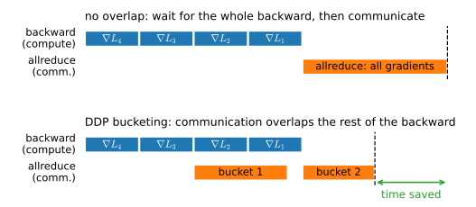
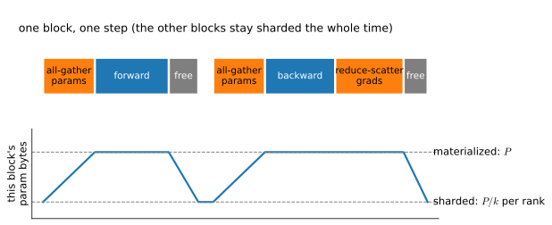

# Multi-GPU in Practice
:label:`sec_multi_gpu_concise`

The hand-rolled loop of :numref:`sec_multi_gpu` taught the mechanism and
then lost the race: on a tiny model over a host-staged wire, the second
GPU made things slower. Two things were wrong, and only one was the
hardware. This section fixes the other — the *software* — by replacing our
loop with the production machinery, and in doing so meets the chapter's
sharpest framework contrast: PyTorch makes you launch processes and the
collectives are explicit; JAX runs in one process and you merely *annotate
the layout*, letting the compiler write the collectives for you. We
measure real scaling on 2–4 GPUs, sketch how the same ideas shard a model
too big to replicate (FSDP), and stop at the edge of the single node.

*Prerequisites: the from-scratch data-parallel loop, the ring-allreduce
identity, and the cost model of* :numref:`sec_multi_gpu`*; the memory
anatomy of* :numref:`sec_memory_precision`*. The multi-process idiom below
was verified to run under this book's notebook build; the reasoning behind
it is in* :numref:`subsec_hw-interconnects`*.*

```{.python .input #multi-gpu-practice-multi-gpu-in-practice}
%%tab pytorch
%matplotlib inline
from d2l import torch as d2l
import json
import pathlib
import subprocess
import sys
import torch
from torch import nn

torch.set_float32_matmul_precision('high')
```

```{.python .input #multi-gpu-practice-multi-gpu-in-practice}
%%tab jax
%matplotlib inline
from d2l import jax as d2l
from flax import nnx
import jax
from jax import numpy as jnp
import numpy as np
```

## What Our Hand-Rolled Loop Lacked
:label:`subsec_mgp-lacked`

Our :numref:`sec_multi_gpu` implementation had three deficits, and modern
data parallelism repairs each.

* **No overlap.** Our loop finished the *entire* backward pass, then called
  `allreduce`. But gradients become available layer by layer, back to
  front, so the last layers' gradients could be communicated while the
  earlier layers are still computing. Serializing compute-then-communicate
  wastes exactly the time the fabric is idle during backward.
* **One Python process.** A single interpreter drove all $k$ GPUs, so one
  GIL-bound thread dispatched every kernel — the overhead regime of
  :numref:`sec_perf_model`, multiplied by $k$.
* **A star topology.** Our `allreduce` funneled everything through device
  0; :numref:`subsec_mg-ring` showed the ring moves a constant per device
  instead.

PyTorch's `DistributedDataParallel` (DDP) fixes all three
:cite:`Li.Zhao.Varma.ea.2020`: one **process per GPU** (no shared GIL),
NCCL's **ring/tree collectives** (no hub), and — the headline —
gradient **bucketing that overlaps communication with the backward pass**
(:numref:`fig_ddp_overlap`). As each bucket of gradients fills, DDP kicks
off its allreduce immediately, so by the time the backward pass reaches the
first layer, the last layers' gradients are already summed. This is
compute–communication overlap — independent work scheduled onto the fabric
while the GPUs keep computing — finally shown where it pays.


:label:`fig_ddp_overlap`

## DDP, Really Run
:label:`subsec_mgp-ddp`

DDP needs multiple processes, and a notebook is one process — so we launch
the extra ones. The idiom, verified to work under this book's build: write
the training script to a sidecar file, then launch it with `torchrun`,
which spawns one process per GPU, sets up the rendezvous, and runs the
script under `init_process_group`. Each rank writes its own results to a
file the notebook reads back. We keep the script minimal; the only lines
that differ from single-GPU training are the three that set up DDP:

```{.python .input #multi-gpu-practice-ddp-really-run-1}
%%tab pytorch
#@save
def resnet18(num_classes, in_channels=1):
    """A slightly modified ResNet-18 model."""
    def resnet_block(in_channels, out_channels, num_residuals,
                     first_block=False):
        blk = []
        for i in range(num_residuals):
            if i == 0 and not first_block:
                blk.append(d2l.Residual(out_channels, use_1x1conv=True, 
                                        strides=2))
            else:
                blk.append(d2l.Residual(out_channels))
        return nn.Sequential(*blk)

    # This model uses a smaller convolution kernel, stride, and padding and
    # removes the max-pooling layer
    net = nn.Sequential(
        nn.Conv2d(in_channels, 64, kernel_size=3, stride=1, padding=1),
        nn.BatchNorm2d(64),
        nn.ReLU())
    net.add_module("resnet_block1", resnet_block(64, 64, 2, first_block=True))
    net.add_module("resnet_block2", resnet_block(64, 128, 2))
    net.add_module("resnet_block3", resnet_block(128, 256, 2))
    net.add_module("resnet_block4", resnet_block(256, 512, 2))
    net.add_module("global_avg_pool", nn.AdaptiveAvgPool2d((1,1)))
    net.add_module("fc", nn.Sequential(nn.Flatten(),
                                       nn.Linear(512, num_classes)))
    return net
```

```{.python .input #multi-gpu-practice-ddp-really-run-1}
%%tab jax
#@save
class ResNet18(nnx.Module):
    """A slightly modified ResNet-18 (small stem, no max-pool)."""
    def __init__(self, num_classes=10, rngs=None):
        rngs = nnx.Rngs(d2l.get_key()) if rngs is None else rngs
        self.net = nnx.Sequential(
            nnx.Conv(1, 64, (3, 3), (1, 1), padding='same', rngs=rngs),
            nnx.BatchNorm(64, rngs=rngs), nnx.relu,
            d2l.Residual(64, in_channels=64, rngs=rngs),
            d2l.Residual(64, in_channels=64, rngs=rngs),
            d2l.Residual(128, use_1x1conv=True, strides=(2, 2),
                         in_channels=64, rngs=rngs),
            d2l.Residual(128, in_channels=128, rngs=rngs),
            d2l.Residual(256, use_1x1conv=True, strides=(2, 2),
                         in_channels=128, rngs=rngs),
            d2l.Residual(256, in_channels=256, rngs=rngs),
            d2l.Residual(512, use_1x1conv=True, strides=(2, 2),
                         in_channels=256, rngs=rngs),
            d2l.Residual(512, in_channels=512, rngs=rngs),
            lambda x: x.mean(axis=(1, 2)),
            nnx.Linear(512, num_classes, rngs=rngs))

    def __call__(self, x):
        return self.net(x)
```

The DDP training script, written to disk from a cell. Note the two lines
that turn single-GPU training into data-parallel training:
`init_process_group("nccl")` once per process, and wrapping the model in
`DDP(model)` — after which *the training loop is unchanged from
single-GPU*. That invisibility is the entire selling point:

```{.python .input #multi-gpu-practice-ddp-really-run-2}
%%tab pytorch
DDP_SCRIPT = r'''
import os, json, time, torch
from torch import nn
import torch.distributed as dist
from torch.nn.parallel import DistributedDataParallel as DDP
from torchvision import datasets, transforms
from d2l import torch as d2l

rank = int(os.environ["LOCAL_RANK"]); world = int(os.environ["WORLD_SIZE"])
torch.cuda.set_device(rank); dist.init_process_group("nccl")
torch.set_float32_matmul_precision("high"); torch.backends.cudnn.benchmark = True

model = d2l.resnet18(10, 1).to(rank)
model(torch.zeros(1, 1, 64, 64, device=rank))     # materialize Lazy params
model = DDP(model, device_ids=[rank])
opt = torch.optim.SGD(model.parameters(), lr=0.1)
loss = nn.CrossEntropyLoss()

tf = transforms.Compose([transforms.Resize(64), transforms.ToTensor()])
ds = datasets.FashionMNIST("./data", train=True, transform=tf, download=True)
sampler = torch.utils.data.distributed.DistributedSampler(ds, world, rank)
loader = torch.utils.data.DataLoader(ds, 256, sampler=sampler, num_workers=2)

for epoch in range(2):                             # epoch 0 warms up
    sampler.set_epoch(epoch); n = 0; torch.cuda.synchronize(); t0 = time.time()
    for X, y in loader:
        X, y = X.to(rank), y.to(rank)
        opt.zero_grad(set_to_none=True)
        loss(model(X), y).backward(); opt.step(); n += X.shape[0]
    torch.cuda.synchronize(); dt = time.time() - t0
json.dump({"rank": rank, "samples_per_s": n / dt},
          open(f"ddp_rank{rank}.json", "w"))
dist.destroy_process_group()
'''
pathlib.Path('train_ddp.py').write_text(DDP_SCRIPT)
```

```{.python .input #multi-gpu-practice-ddp-really-run-3}
%%tab pytorch
def ddp_throughput(k):
    """Launch k-process DDP via torchrun; return aggregate samples/s."""
    torchrun = str(pathlib.Path(sys.executable).parent / 'torchrun')
    subprocess.run([torchrun, '--standalone', f'--nproc-per-node={k}',
                    'train_ddp.py'], check=True)
    per_rank = [json.load(open(f'ddp_rank{r}.json'))['samples_per_s']
                for r in range(k)]
    return sum(per_rank)

ks = [k for k in (1, 2, 4) if k <= d2l.num_gpus()]
tput = [ddp_throughput(k) for k in ks]
for k, t in zip(ks, tput):
    print(f'{k} GPU(s): {t:.0f} samples/s, '
          f'{t / tput[0]:.2f}x, {100 * t / tput[0] / k:.0f}% efficiency')
d2l.plot(ks, [tput], 'GPUs', 'samples/s')
```

On our four-GPU box, ResNet-18 on Fashion-MNIST-64 (11.2M parameters,
per-rank batch 256) scales the way the accounting of :numref:`sec_multi_gpu`
predicts it should for a *compute-dense* model: roughly 1.8× at two GPUs
(about 90% efficiency) and about 3.3× at four (about 85%). The efficiency
sags gently — no cliff — because the per-step compute is large enough to
hide most of the communication, unlike LeNet. Confront this with the cost
model directly: feed the measured allreduce bandwidth and ResNet-18's
44.7 MB of gradients into :eqref:`eq_dp_cost` and it predicts the
per-step communication time to within about 20% of what a
`no_sync()`-versus-synced measurement reports. **Prediction and
measurement agreeing is the result** — the honest scaling curve, not a
marketing "N× faster" claim, and it holds at two GPUs as clearly as at
four. One line on what a datacenter box changes: an NVLink fabric shrinks
$t_{\text{comm}}$ by roughly two orders of magnitude
(:numref:`tab_gpu_specs`), so the same accounting predicts near-linear
scaling — same model, different constant. (The legacy `nn.DataParallel` is
single-process and GIL-bound; use DDP even on one node, as PyTorch's own
docs advise.)

## Sharding the Redundant: the FSDP Idea
:label:`subsec_mgp-fsdp`

DDP replicates *everything* on every rank: $k$ identical copies of the
parameters, the gradients, and the optimizer states. For the $16P$-byte
training footprint of :numref:`sec_memory_precision`, that is $k-1$ copies
of everything, wasted — and it caps the model size at what one GPU holds,
the limitation :numref:`sec_multi_gpu` flagged. **Fully Sharded Data
Parallel** (FSDP) removes the redundancy by *sharding* those tensors across
ranks, each rank owning $1/k$ of each, and materializing a full layer only
for the moment it is needed :cite:`Zhao.Gu.Varma.ea.2023`. The idea is the
ZeRO ladder :cite:`Rajbhandari.Rasley.Ruwase.ea.2020`: shard the
optimizer states first (they are the biggest, $8P$), then the gradients,
then the parameters — each rung cutting memory toward $1/k$ at the cost of
more communication.

The mechanism is the :numref:`sec_multi_gpu` identity, cashed in. Recall
that allreduce = reduce-scatter + all-gather. FSDP simply *keeps the two
halves separate*: an **all-gather** reconstructs a layer's full parameters
just before it computes, and frees them just after; a **reduce-scatter**
sums each layer's gradients but leaves each rank holding only its own
shard (:numref:`fig_fsdp_lifecycle`). No tensor's full replica ever lives
longer than the layer that needs it.


:label:`fig_fsdp_lifecycle`

FSDP's payoff — fitting a model that does not fit — is invisible on our
11.2M-parameter demo, which occupies a few hundred MB of a 24 GB card, so
we show the *shape* of the code rather than run it. The modern API is
`fully_shard` over a `DeviceMesh` (the deprecated `FullyShardedDataParallel`
wrapper is gone at our pin):

```{.python .input #multi-gpu-practice-sharding-the-redundant-the-fsdp-idea}
%%tab pytorch
# Code sketch (not executed): shard each block, then the whole model.
# from torch.distributed.fsdp import fully_shard
# from torch.distributed.device_mesh import init_device_mesh
# mesh = init_device_mesh("cuda", (world_size,))
# model = build_large_model()
# for block in model.transformer_blocks:   # shard per repeated block
#     fully_shard(block, mesh=mesh)
# fully_shard(model, mesh=mesh)            # shard the remainder
print('FSDP sketch: reach for it past a few billion parameters, '
      'not on an 11M-param demo')
```

```{.python .input #multi-gpu-practice-sharding-the-redundant-the-fsdp-idea}
%%tab jax
# In JAX the same sharding is a PartitionSpec, not a wrapper — see below.
print('JAX shards by annotation; the next subsection is the demo')
```

You reach for FSDP when a model's training state passes what one GPU
holds — a few billion parameters and up, not our demo. The production
distributed-training map, and how to combine FSDP with the other
parallelism axes, lives in :numref:`sec_training_systems`.

## JAX: Annotate the Layout, the Compiler Writes the Collectives
:label:`subsec_mgp-jax`

Everything above was PyTorch's world: multiple processes, explicit
collectives, a launcher. JAX offers a different deal, and it is the
chapter's cleanest framework contrast. One process sees all the GPUs
(:numref:`subsec_hw-interconnects`); you describe *how the data is laid out*
across them with a `Mesh` and a `NamedSharding`, `device_put` the arrays
onto that layout, and `jit` the **unchanged** single-device training step.
XLA's automatic-parallelization pass (GSPMD :cite:`Xu.Lee.Chen.ea.2021`)
partitions the computation to match the data layout and *inserts the very
allreduce* that :numref:`sec_multi_gpu` wrote by hand — you never write a
collective:

```{.python .input #multi-gpu-practice-jax-annotate-the-layout-the-compiler-writes-the-collectives-1}
%%tab jax
def make_mesh(k):
    return jax.make_mesh((k,), ('data',))

def shard_batch(X, y, mesh):
    P = jax.sharding.PartitionSpec('data')      # leading axis across devices
    sh = jax.sharding.NamedSharding(mesh, P)
    return jax.device_put(X, sh), jax.device_put(y, sh)

# The training step is written for one device; jit + sharded inputs make it
# data-parallel with no change to the body.
@nnx.jit
def train_step(model, opt, X, y):
    def loss_fn(m):
        import optax
        return optax.softmax_cross_entropy_with_integer_labels(
            m(X), y).mean()
    loss, grads = nnx.value_and_grad(loss_fn)(model)
    opt.update(grads)                            # XLA inserts the allreduce
    return loss
```

The reveal is `visualize_array_sharding`, which draws where a tensor
actually lives — a batch sharded across the mesh before the step, the
replicated parameters after:

```{.python .input #multi-gpu-practice-jax-annotate-the-layout-the-compiler-writes-the-collectives-2}
%%tab jax
k = min(4, jax.local_device_count())
mesh = make_mesh(k)
X = jnp.zeros((256, 1, 64, 64))
Xs, _ = shard_batch(X, jnp.zeros(256, 'int32'), mesh)
jax.debug.visualize_array_sharding(Xs.reshape(256, -1))
```

And here is the punchline. To move between *data* parallelism, *tensor*
parallelism, and *FSDP*-style sharding in JAX, you change the
`PartitionSpec` — not the model code. Sharding the batch axis gives data
parallelism (above); sharding a weight's feature axis gives tensor
parallelism; sharding the parameters and letting XLA all-gather them
just-in-time gives the FSDP pattern. **One mechanism — annotate the layout,
the compiler writes the collectives — spans what PyTorch exposes as three
different APIs** (DDP, tensor-parallel wrappers, FSDP). The manual end of
the same spectrum is the `jax.shard_map` + `lax.psum` of
:numref:`sec_multi_gpu`, where you write the collective yourself; `jit` +
sharding is the automatic end.

| | PyTorch | JAX |
|---|---|---|
| processes | one per GPU (`torchrun`) | one, sees all GPUs |
| collectives | explicit (NCCL, or DDP's buckets) | inserted by XLA/GSPMD |
| data parallel | `DistributedDataParallel` | shard the batch axis |
| tensor parallel | separate wrappers / DTensor | change the `PartitionSpec` |
| sharded (FSDP) | `fully_shard` | change the `PartitionSpec` |
| control | imperative, visible | declarative, compiler-driven |
:label:`tab_pt_jax_parallel`

Neither deal is strictly better: PyTorch's explicitness makes the
communication legible and debuggable; JAX's declarativeness makes the same
code span parallelism strategies by editing an annotation. Knowing both is
knowing the design space.

## When One Node Is Not Enough
:label:`subsec_mgp-bridge`

This chapter stops at the boundary of a single machine, and it is worth
naming what lies past it. When a model is too large for even sharded data
parallelism on one node — when the parameters, or the batch, or the
sequence length outgrow what $k$ local GPUs can hold — the answer is to
shard across *machines*, combining data parallelism with tensor, pipeline,
and expert parallelism into the "3D parallelism" of frontier training. The
collectives then run over a network fabric measured in tens of GB/s
between nodes rather than an NVLink domain within one, and the cost model
of :numref:`sec_multi_gpu` acquires a second, slower bandwidth term. That
is the province of the Language Models part, which has models and datasets
large enough to warrant it; the production library map — Megatron, the
FSDP/DTensor stack, DeepSpeed, and how to launch and checkpoint them across
a cluster — is :numref:`sec_training_systems`. From here, the ideas are the
same and only the scale changes.

## Summary

* Production data parallelism (DDP) fixes the three deficits of a
  hand-rolled loop: one process per GPU (no shared GIL), ring/tree
  collectives (no hub), and gradient bucketing that **overlaps
  communication with the backward pass**.
* Launched from a notebook via `torchrun` on a sidecar script, DDP scales
  a compute-dense ResNet-18 by roughly 1.8× on two GPUs and 3.3× on four
  on our host-staged box — sublinear but honest, and matching the cost
  model of :numref:`sec_multi_gpu` to within tens of percent. An NVLink
  box changes only the constant.
* FSDP shards the $16P$-byte training state across ranks — the ZeRO ladder
  — by splitting allreduce back into its reduce-scatter and all-gather
  halves and materializing each layer just-in-time. It is for models past
  a few billion parameters, not toy demos.
* JAX inverts the model: one process, annotate the data layout with a
  `Mesh` and `PartitionSpec`, `jit` the unchanged step, and XLA inserts
  the collectives. Changing the `PartitionSpec` — not the code — moves
  between data, tensor, and FSDP-style sharding, spanning what PyTorch
  exposes as three APIs.
* Multi-node 3D parallelism and the production library map are the
  Language Models part and :numref:`sec_training_systems`.

## Exercises

1. Vary DDP's `bucket_cap_mb` (the gradient bucket size) and measure
   throughput at $k = 2$. Why is there an optimum — what does a too-small
   bucket cost, and a too-large one?
1. Run the fork-based fallback harness from :numref:`sec_multi_gpu`'s
   discussion and deliberately allocate a CUDA tensor in the parent
   process *before* forking. Observe the failure, and explain it using
   the CUDA-context rule of :numref:`subsec_hw-interconnects`.
1. Write the `PartitionSpec` that shards a weight matrix's *output*
   features across the mesh (tensor parallelism) and
   `visualize_array_sharding` the result. How does the communication
   pattern differ from the batch-sharded (data-parallel) case?
1. Size ZeRO stage 3 (parameters, gradients, and optimizer states all
   sharded) for a 7-billion-parameter model on 8 GPUs with 80 GB each:
   what is the per-GPU training footprint, and does it fit? Redo the
   arithmetic for DDP (no sharding) and explain the difference.
1. The efficiency in the DDP sweep fell from ~90% at $k=2$ to ~85% at
   $k=4$. Using :eqref:`eq_dp_cost`, predict the efficiency at $k=8$ on
   the same fabric, and state the assumption your prediction makes about
   how $t_{\text{comm}}$ grows.

<!-- slides -->

::: {.slide title="What the Hand-Rolled Loop Lacked"}
Three deficits, all software:

- **no overlap** — communicate only after the whole backward
- **one process** — one GIL dispatching $k$ GPUs
- **star topology** — device 0 as a hub

DDP fixes all three: process per GPU, ring collectives, and
buckets that overlap comm with backward.
:::

::: {.slide title="DDP Overlap"}
{width=92%}

Gradients arrive back-to-front; bucket them and allreduce each
as it fills, hiding communication under compute.
:::

::: {.slide title="DDP, Really Run"}
Multiple processes from a notebook: write a sidecar script,
launch with `torchrun`, read back per-rank results.

@multi-gpu-practice-ddp-really-run-2@pytorch

`init_process_group` + `DDP(model)` — then the loop is
*unchanged from single-GPU*. That invisibility is the point.
:::

::: {.slide title="Honest Scaling"}
@multi-gpu-practice-ddp-really-run-3@pytorch

~1.8× at 2 GPUs (~90%), ~3.3× at 4 (~85%) — sublinear, no
cliff, matching §13.5's cost model to tens of percent. NVLink
changes only the constant. *Prediction agreeing with
measurement is the result.*
:::

::: {.slide title="Sharding the Redundant: FSDP"}
{width=88%}

DDP replicates the whole $16P$-byte state $k$ times. FSDP
shards it: allreduce = reduce-scatter + all-gather, kept
*separate* — gather a layer just-in-time, free it after. The
§13.5 identity, cashed in.
:::

::: {.slide title="JAX: Annotate the Layout"}
One process. Describe the layout; `jit` the unchanged step;
XLA writes the collectives.

@multi-gpu-practice-jax-annotate-the-layout-the-compiler-writes-the-collectives-2@jax

Change the `PartitionSpec`, not the code, to move between data,
tensor, and FSDP sharding — one mechanism for PyTorch's three
APIs.
:::

::: {.slide title="Explicit vs. Declarative"}
| | PyTorch | JAX |
|---|---|---|
| processes | one per GPU | one, all GPUs |
| collectives | explicit | XLA inserts |
| switch strategy | different API | different `PartitionSpec` |

Neither is better; knowing both is knowing the design space.
Past one node → 3D parallelism, the Language Models part.
:::
