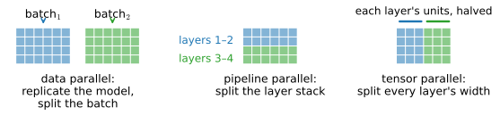
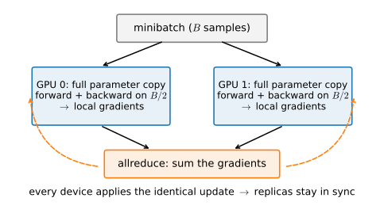
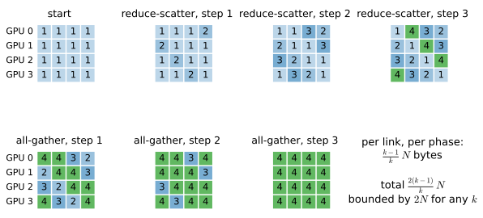

# Multi-GPU from First Principles
:label:`sec_multi_gpu`

The ladder of :numref:`sec_memory_precision` ended with the one rung that
buys more arithmetic and more *aggregate* memory at once: another GPU.
This section
adds it — but honestly, and from the ground up. We build data-parallel
training by hand, with explicit device-to-device copies and a
hand-rolled gradient sum, so that when :numref:`sec_multi_gpu_concise`
replaces our loop with production machinery, you know exactly what that
machinery does. We derive the communication algorithm the professionals
use (ring allreduce) and its cost, and — because this book's build box
has no fast inter-GPU fabric — we *measure* what communication actually
costs and discover the central fact of parallel training: **a second GPU
is not free, and whether it pays is an accounting question you can answer
before you run.**

That last point is why this section is built on a machine with no NVLink
and no peer-to-peer transfer (:numref:`sec_hardware`). A datacenter
fabric shrinks the constant in front of the communication term; it does
not repeal the accounting — at frontier scale the same arithmetic decides
how thousands of GPUs are spent, and it matters more, not less. Our slow
fabric merely makes the cost loud enough to hear, which makes this box
the better teacher. Every conclusion here holds at two GPUs as well as
four — the number of devices is a variable, never a constant.

*Prerequisites: minibatch SGD and the effect of batch size on the gradient
estimate (*:numref:`sec_minibatch_sgd`*); LeNet (*:numref:`sec_lenet`*); the
interconnect measurements of* :numref:`subsec_hw-interconnects`*.*

```{.python .input #multiple-gpus-multi-gpu-from-first-principles}
%%tab pytorch
%matplotlib inline
from d2l import torch as d2l
import torch
from torch import nn
from torch.nn import functional as F

torch.set_float32_matmul_precision('high')
```

```{.python .input #multiple-gpus-multi-gpu-from-first-principles}
%%tab jax
%matplotlib inline
from d2l import jax as d2l
import jax
from jax import numpy as jnp
import numpy as np
import optax
import os
from functools import partial

# XLA's NCCL buffer registration fails harmlessly on this P2P-less box;
# opt out rather than let every collective print the warning.
os.environ.setdefault('NCCL_LOCAL_REGISTER', '0')
```

## Three Ways to Split
:label:`subsec_mg-splitting`

Given more than one GPU and a model to train, there are three ways to
divide the work (:numref:`fig_splitting`).


:label:`fig_splitting`

**Data parallelism** replicates the whole model on every GPU and splits the
*batch*: each device runs the full network on a different slice of the
minibatch, then the devices sum their gradients so every replica takes the
same optimizer step. It is the simplest, works for any model that fits on
one GPU, and needs communication only once per step — so it is what this
chapter builds. **Pipeline parallelism** splits the *layer stack* across
devices, each holding a few consecutive layers; it lets a model too deep
for one GPU fit, at the cost of tight inter-stage synchronization.
**Tensor parallelism** splits *within* each layer — each device holds a
slice of every weight matrix — and communicates several times per layer.
The latter two matter only at scales this part defers to the Language
Models chapters, which have models large enough to warrant them; a single
historical note is that the very first of them appeared in 2012, when
AlexNet was split across two GPUs simply because its weights did not fit
in one card's 3 GB :cite:`Krizhevsky.Sutskever.Hinton.2012`. Data
parallelism is our subject, and — a warning that :numref:`sec_memory_precision`
already made — it does *not* let you train a bigger model: every GPU still
holds a full copy.

## Data Parallelism by Hand
:label:`subsec_mg-byhand`

Data-parallel training on $k$ GPUs is five steps per minibatch: split the
batch into $k$ shards; run forward and backward on each shard against that
device's copy of the parameters; sum the $k$ gradient sets so all devices
agree; and let every device apply the same update
(:numref:`fig_data_parallel`). We build each piece for a small LeNet, then
run it — and watch the second GPU buy us nothing.


:label:`fig_data_parallel`

We define LeNet from raw tensors (not a module) so that parameters,
gradients, and their movement between devices are fully visible:

```{.python .input #multiple-gpus-data-parallelism-by-hand-1}
%%tab pytorch
scale = 0.01
def new_params(device):
    def p(*shape):
        return (torch.randn(*shape, device=device) * scale).requires_grad_()
    return [p(20, 1, 3, 3), torch.zeros(20, device=device, requires_grad=True),
            p(50, 20, 5, 5), torch.zeros(50, device=device, requires_grad=True),
            p(800, 128), torch.zeros(128, device=device, requires_grad=True),
            p(128, 10), torch.zeros(10, device=device, requires_grad=True)]

def lenet(X, params):
    h1 = F.avg_pool2d(F.relu(F.conv2d(X, params[0], params[1])), 2, 2)
    h2 = F.avg_pool2d(F.relu(F.conv2d(h1, params[2], params[3])), 2, 2)
    h2 = h2.reshape(h2.shape[0], -1)
    h3 = F.relu(torch.mm(h2, params[4]) + params[5])
    return torch.mm(h3, params[6]) + params[7]

loss = nn.CrossEntropyLoss(reduction='none')
```

```{.python .input #multiple-gpus-data-parallelism-by-hand-1}
%%tab jax
scale = 0.01
def new_params(key):
    ks = jax.random.split(key, 4)
    return [jax.random.normal(ks[0], (20, 1, 3, 3)) * scale, jnp.zeros(20),
            jax.random.normal(ks[1], (50, 20, 5, 5)) * scale, jnp.zeros(50),
            jax.random.normal(ks[2], (800, 128)) * scale, jnp.zeros(128),
            jax.random.normal(ks[3], (128, 10)) * scale, jnp.zeros(10)]

def lenet(params, X):
    conv = lambda x, W: jax.lax.conv_general_dilated(
        x, W, (1, 1), 'VALID', dimension_numbers=('NCHW', 'OIHW', 'NCHW'))
    pool = lambda x: jax.lax.reduce_window(
        x, 0.0, jax.lax.add, (1, 1, 2, 2), (1, 1, 2, 2), 'VALID') / 4.0
    h1 = pool(jax.nn.relu(conv(X, params[0]) + params[1].reshape(1, -1, 1, 1)))
    h2 = pool(jax.nn.relu(conv(h1, params[2]) + params[3].reshape(1, -1, 1, 1)))
    h2 = h2.reshape(h2.shape[0], -1)
    h3 = jax.nn.relu(jnp.dot(h2, params[4]) + params[5])
    return jnp.dot(h3, params[6]) + params[7]
```

The two operations that make it parallel are *broadcasting* parameters to
each device and *summing* gradients across them. We build the PyTorch
version by hand, because the hand-rolled version is the lesson; the
`#@save`d `split_batch` (which chops a minibatch into per-device shards)
rounds out the toolkit:

```{.python .input #multiple-gpus-data-parallelism-by-hand-2}
%%tab pytorch
def get_params(params, device):
    return [p.clone().to(device).detach().requires_grad_() for p in params]

def allreduce(data):
    # Star pattern: sum everything onto device 0, then broadcast back.
    for i in range(1, len(data)):
        data[0][:] += data[i].to(data[0].device)
    for i in range(1, len(data)):
        data[i][:] = data[0].to(data[i].device)

def split_batch(X, y, devices):  #@save
    """Split `X` and `y` into multiple devices."""
    assert X.shape[0] == y.shape[0]
    return (nn.parallel.scatter(X, devices),
            nn.parallel.scatter(y, devices))
```

```{.python .input #multiple-gpus-data-parallelism-by-hand-2}
%%tab jax
def get_params(params, num_devices):
    """Data parallelism replicates the full parameter set on every device;
    shard_map's P() in-spec (below) broadcasts one copy to each."""
    return params

def split_batch(X, y, num_devices):  #@save
    """Reshape `X` and `y` onto a leading device axis of size num_devices."""
    assert X.shape[0] % num_devices == 0
    reshape = lambda a: a.reshape(num_devices, -1, *a.shape[1:])
    return reshape(X), reshape(y)
```

`allreduce` is the heart of it, and the naive version above is
deliberately clumsy: it gathers every device's gradient onto device 0,
sums there, and broadcasts back — a *star* topology, with device 0 as a
hub that handles all $k-1$ inbound and $k-1$ outbound transfers. Watch it
work on two vectors living on two GPUs:

```{.python .input #multiple-gpus-data-parallelism-by-hand-3}
%%tab pytorch
data = [torch.ones((1, 2), device=d2l.try_gpu(i)) * (i + 1)
        for i in range(min(2, d2l.num_gpus()))]
print('before:', [d.cpu().numpy().tolist() for d in data])
allreduce(data)
print('after: ', [d.cpu().numpy().tolist() for d in data])
```

```{.python .input #multiple-gpus-data-parallelism-by-hand-3}
%%tab jax
# JAX writes the same allreduce as a collective inside shard_map (below,
# a pmean: the sum divided by k); here we show the summed result it is
# built on.
data = jnp.stack([jnp.ones((1, 2)) * (i + 1)
                  for i in range(min(2, jax.local_device_count()))])
print('before:', data.tolist())
print('summed:', jnp.broadcast_to(data.sum(0), data.shape).tolist())
```

The training step assembles the pieces. Each device computes its shard's
gradient; we allreduce parameter by parameter; each device applies plain
SGD. The whole thing runs in one Python process — nothing here needs
multiple processes, because we move tensors explicitly:

```{.python .input #multiple-gpus-data-parallelism-by-hand-4}
%%tab pytorch
def train_batch(X, y, device_params, devices, lr):
    X_shards, y_shards = split_batch(X, y, devices)
    ls = [loss(lenet(Xs, dev_W), ys).sum()
          for Xs, ys, dev_W in zip(X_shards, y_shards, device_params)]
    for l in ls:
        l.backward()
    with torch.no_grad():
        for i in range(len(device_params[0])):
            allreduce([device_params[c][i].grad for c in range(len(devices))])
        for param in device_params:
            d2l.sgd(param, lr, X.shape[0])
            for p in param:
                p.grad = None
```

```{.python .input #multiple-gpus-data-parallelism-by-hand-4}
%%tab jax
@partial(jax.jit, static_argnames=('lr', 'mesh'))
def train_step(params, X, y, lr, mesh):
    """One data-parallel step: shard_map makes the pmean collective explicit.
    `X`, `y` arrive with the batch sharded across devices (P('data')) and
    `params` replicated (P()) -- see `train` below; shard_map hands each device
    the full parameter replica and its own batch shard. pcast marks the replica
    as this device's own local copy, so the gradient below is the shard's own;
    pmean then averages the shard gradients across devices."""
    P = jax.sharding.PartitionSpec

    def per_device(params, X, y):
        def loss_fn(p):
            logits = lenet(p, X[0])   # X[0]: strip the size-1 sharded axis
            return optax.softmax_cross_entropy_with_integer_labels(
                logits, y[0]).mean()
        local = jax.lax.pcast(params, 'data', to='varying')  # my own copy
        grads = jax.grad(loss_fn)(local)        # my shard's mean-loss gradient
        grads = jax.lax.pmean(grads, 'data')    # The allreduce, in one line
        return jax.tree.map(lambda p, g: p - lr * g, params, grads)

    step = jax.shard_map(per_device, mesh=mesh,
                         in_specs=(P(), P('data'), P('data')),
                         out_specs=P())
    return step(params, X, y)
```

The two tabs make the same computation visible in two idioms. PyTorch
moves gradients between devices with explicit `.to(device)` copies inside
`allreduce`; JAX writes the collective as a single `jax.lax.pmean` inside
a `jax.shard_map`, where the `PartitionSpec('data')` annotation tells XLA
that the leading axis is sharded across devices. (Note the top-level
`jax.shard_map` — the older `jax.pmap` is a compatibility shim as of JAX
0.8 and we do not use it.) One subtlety in the JAX tab earns its line:
under `shard_map` the parameters arrive *replicated*, and differentiating
a replicated tensor makes JAX's autodiff insert a gradient *sum* of its
own — the transpose of "broadcast to every device" is "add up every
device's contribution", and a further explicit `psum` on top would then
double-count. The `pcast(..., to='varying')` line opts out by declaring
each replica device-local, so the code owns the collective: every device
takes its shard's mean-loss gradient, and `pmean` averages them into
exactly the gradient one device would compute on the whole batch. The
collective is *visible in the code* in both tabs — exactly the point of
building it by hand.

Both tabs also make a strong claim — that $k$ devices take *the same*
step one device would — and a claim like that deserves a check, not a
promise. From the same initialization, on the same minibatch, one step on
two GPUs must move the parameters exactly where one step on one GPU does.
The test is cheap, and it is the test that catches normalization bugs —
a summed instead of averaged gradient is an accidental $k\times$ learning
rate — that no accuracy curve reliably reveals:

```{.python .input #multiple-gpus-data-parallelism-by-hand-7}
%%tab pytorch
X, y = torch.randn(256, 1, 28, 28), torch.randint(0, 10, (256,))
base = new_params(d2l.try_gpu(0))
deltas = []
for k in (1, min(2, d2l.num_gpus())):
    devices = [d2l.try_gpu(i) for i in range(k)]
    device_params = [get_params(base, d) for d in devices]
    train_batch(X, y, device_params, devices, lr=0.2)
    deltas.append([(p - b).detach().cpu()
                   for p, b in zip(device_params[0], base)])
print('max update difference, k=1 vs k=2: '
      f'{max((a - b).abs().max() for a, b in zip(*deltas)):.2e}')
```

```{.python .input #multiple-gpus-data-parallelism-by-hand-7}
%%tab jax
P = jax.sharding.PartitionSpec
X = jax.random.normal(jax.random.PRNGKey(1), (256, 1, 28, 28))
y = jax.random.randint(jax.random.PRNGKey(2), (256,), 0, 10)
base = new_params(jax.random.PRNGKey(0))
deltas = []
for k in (1, min(2, jax.local_device_count())):
    mesh = jax.make_mesh((k,), ('data',))
    place = lambda a, spec: jax.device_put(
        a, jax.sharding.NamedSharding(mesh, spec))
    params = jax.tree.map(lambda p: place(p, P()), base)
    Xs, ys = split_batch(X, y, k)
    new = train_step(params, place(Xs, P('data')), place(ys, P('data')),
                     0.2, mesh)
    deltas.append([np.asarray(n - b) for n, b in zip(new, base)])
print('max update difference, k=1 vs k=2: '
      f'{max(np.abs(a - b).max() for a, b in zip(*deltas)):.2e}')
```

The parameter updates agree to floating-point noise — around $10^{-9}$,
against update magnitudes near $10^{-2}$. "Mathematically identical" is
now a measurement, not a slogan. With correctness established, the
training loop that wraps `train_batch`/`train_step` is the multi-GPU
cousin of :numref:`sec_lenet`'s. First, one GPU:

```{.python .input #multiple-gpus-data-parallelism-by-hand-5}
%%tab pytorch
def train(num_gpus, batch_size, lr):
    train_iter, test_iter = d2l.load_data_fashion_mnist(batch_size)
    devices = [d2l.try_gpu(i) for i in range(num_gpus)]
    base = new_params(devices[0])
    device_params = [get_params(base, d) for d in devices]
    timer, num_epochs = d2l.Timer(), 5
    for epoch in range(num_epochs):
        timer.start()
        for X, y in train_iter:
            train_batch(X, y, device_params, devices, lr)
        for d in devices:   # completion timing: sync before stopping the clock
            torch.cuda.synchronize(d)
        timer.stop()
    acc = d2l.evaluate_accuracy_gpu(
        lambda x: lenet(x, device_params[0]), test_iter, devices[0])
    print(f'test acc {acc:.2f}, {timer.avg():.2f} sec/epoch on {num_gpus} GPU(s)')

train(num_gpus=1, batch_size=256, lr=0.2)
```

```{.python .input #multiple-gpus-data-parallelism-by-hand-5}
%%tab jax
def train(num_gpus, batch_size, lr):
    P = jax.sharding.PartitionSpec
    data = d2l.FashionMNIST(batch_size=batch_size)
    train_iter = data.get_dataloader(train=True)
    mesh = jax.make_mesh((num_gpus,), ('data',))
    place = lambda a, spec: jax.device_put(
        a, jax.sharding.NamedSharding(mesh, spec))
    params = get_params(new_params(jax.random.PRNGKey(0)), num_gpus)
    params = jax.tree.map(lambda p: place(p, P()), params)  # a replica per device
    timer, num_epochs = d2l.Timer(), 5
    for epoch in range(num_epochs):
        timer.start()
        for X, y in train_iter:
            X = jnp.array(X).transpose(0, 3, 1, 2)
            if X.shape[0] % num_gpus:       # drop a ragged final batch
                continue
            Xs, ys = split_batch(X, jnp.array(y), num_gpus)
            Xs, ys = place(Xs, P('data')), place(ys, P('data'))  # shard the batch
            params = train_step(params, Xs, ys, lr, mesh)
        jax.block_until_ready(params)
        timer.stop()
    apply_fn, hits, total = jax.jit(lenet), 0, 0
    p0 = jax.tree.map(lambda p: jax.device_put(p, jax.devices()[0]), params)
    for X, y in data.get_dataloader(train=False):
        X = jnp.array(X).transpose(0, 3, 1, 2)
        hits += int((apply_fn(p0, X).argmax(axis=1) == jnp.array(y)).sum())
        total += len(y)
    print(f'test acc {hits / total:.2f}, {timer.avg():.2f} sec/epoch '
          f'on {num_gpus} GPU(s)')

train(num_gpus=1, batch_size=256, lr=0.2)
```

Now two GPUs, same batch size and learning rate. The optimization is
mathematically identical, as the one-step check just proved — any
accuracy gap between these short runs is run-to-run noise from
initialization and rounding, not the parallelism — but the wall-clock is
**no better**:

```{.python .input #multiple-gpus-data-parallelism-by-hand-6}
%%tab pytorch
train(num_gpus=min(2, d2l.num_gpus()), batch_size=256, lr=0.2)
```

```{.python .input #multiple-gpus-data-parallelism-by-hand-6}
%%tab jax
train(num_gpus=min(2, jax.local_device_count()), batch_size=256, lr=0.2)
```

The second GPU buys **no speedup** — on our box the two-GPU run is at
best on par with one GPU, and in JAX outright slower — and this is not a
bug, it is the syllabus.
The reason is *not* slow communication: LeNet's parameters are tiny — the
whole gradient set is about half a megabyte — so its allreduce is
negligible, and we measure the transport directly below. The reason is
that LeNet is simply too small
to parallelize. Splitting a 256-example batch into two 128-example shards
underfeeds each GPU — a convolution on half the batch does not run at half
the time, because a small batch never filled the device to begin with —
and the Python orchestration and per-step dispatch are not amortized
by microsecond-scale compute. The technique is not wrong; the *regime* is
wrong. This tiny model is the worst case for data parallelism, and
diagnosing exactly why — separating the communication cost, which is small
here, from the underutilization cost, which is not — is the next two
subsections' work.

## Doing Better: Ring Allreduce
:label:`subsec_mg-ring`

Our star `allreduce` has an obvious flaw: device 0 is a hub through which
everything passes, so it moves $(k-1)N$ bytes in and $(k-1)N$ out for a
parameter set of $N$ bytes, and the other devices' links sit idle while it
works. The algorithm the professionals use — *ring allreduce*
:cite:`Patarasuk.Yuan.2009` — removes the hub entirely, and it is worth
deriving because the same identity reappears as the seed of FSDP in
:numref:`sec_multi_gpu_concise`.

Arrange the $k$ devices in a ring, each talking only to its neighbor.
Split each device's gradient vector into $k$ equal chunks. The allreduce
runs in two phases (:numref:`fig_ring_allreduce`). In **reduce-scatter**,
over $k-1$ steps, device $i$ sends one chunk to its neighbor while
receiving and accumulating another; after the phase, each device owns one
fully-summed chunk (a different chunk per device). In **all-gather**,
another $k-1$ steps pass those finished chunks around the ring until every
device has all $k$. At every step, every link carries exactly one chunk of
size $N/k$, so each device sends $(k-1) \cdot N/k$ bytes per phase, and
both phases together move

$$
\frac{2(k-1)}{k}\, N \quad\text{bytes per device,}
$$
:eqlabel:`eq_ring_traffic`

which is **nearly constant in $k$**: it rises from $N$ at $k=2$ toward
its bound of $2N$ and never exceeds it, however many devices join the
ring. The star pattern's hub moved $(k-1)N$ — linear in $k$; the ring
moves at most $2N$. That is why production collective libraries are built
on rings and trees, chosen per message size and topology, alongside
hardware-specific schemes; for messages small enough that per-hop
*latency* dominates the byte count, trees win — a term this byte-only
accounting deliberately ignores.


:label:`fig_ring_allreduce`

The catch, on our box, is that the elegant $2(k-1)/k$ accounting assumes
the links are the bottleneck — and they are, but *which* links? With no
peer-to-peer transfer, every "neighbor to neighbor" hop is really a
round trip through host memory (:numref:`subsec_hw-interconnects`), so the
ring's theoretical advantage over the star is largely erased: the
transport, not the topology, is the ceiling. This is the theory-versus-
practice lesson in miniature — NCCL will still pick a ring or tree per
message size, but on this hardware the constant in front of $N$ is what
hurts, and no algorithm fixes a slow wire.

## The Accounting
:label:`subsec_mg-accounting`

We can now answer the question data parallelism always poses — *does the
next GPU pay?* — with a cost model rather than a guess. One step on $k$
GPUs takes roughly

$$
t_{\text{step}}(k) \;\approx\;
\underbrace{t_{\text{compute}}(B/k)}_{\text{forward+backward on a shard}}
\;+\;
\underbrace{t_{\text{comm}}}_{\approx\, 2N / \beta},
$$
:eqlabel:`eq_dp_cost`

where $B$ is the global batch, $N$ the bytes of gradients to reduce, and
$\beta$ the achievable allreduce bandwidth (:eqref:`eq_ring_traffic` gives
the $2N$; the per-device traffic is bounded by it for any $k$). The
compute term *shrinks* with more GPUs (each does less of the batch); the
communication term does not. Parallelism pays exactly when the compute
you offload exceeds the communication you take on — models with high
compute per byte of gradient traffic, large per-device batches, and fast
links all push in your favor; a tiny model on a slow link, like LeNet on
our box, is the case where it never pays.

Two scaling conventions deserve names here, because every published
speedup quietly picks one. :eqref:`eq_dp_cost` holds the global batch $B$
fixed while $k$ grows — *strong scaling*: the same work, hopefully
finishing sooner. The alternative holds the *per-device* batch fixed, so
the global batch grows to $kB_{\textrm{device}}$ — *weak scaling*: more
work per unit time, quoted as throughput. The throughput sweep of
:numref:`sec_multi_gpu_concise` holds the per-rank batch fixed and must
be read under the weak-scaling convention — and remember that a grown
global batch changes the optimization trajectory itself
(:numref:`sec_batch_size`).

Let's plug in real numbers by measuring $\beta$ directly. One bookkeeping
convention first, so the numbers below are comparable: we quote *bytes
moved per device per allreduce* ($\approx 2N$ for the ring) divided by
wall-clock time — an effective bandwidth. NCCL's benchmark "busbw"
normalizes differently, so its figures are not directly comparable to
ours. Here is the effective bandwidth of the allreduce each tab actually
runs — the hand-rolled star in PyTorch, XLA's `psum` collective in JAX:

```{.python .input #multiple-gpus-the-accounting}
%%tab pytorch
if d2l.num_gpus() >= 2:
    N = 64 * 1024 * 1024  # 64M floats = 256 MB per replica
    data = [torch.randn(N, device=d2l.try_gpu(i)) for i in range(2)]
    t = d2l.Benchmark(lambda: allreduce(data), warmup=2, repeats=5).time
    # Per-device traffic is ~2N bytes; report effective bandwidth
    print(f'allreduce {2 * N * 4 / t / 1e9:.2f} GB/s effective '
          f'over {1000 * t:.1f} ms')
else:
    print('needs 2 GPUs')
```

```{.python .input #multiple-gpus-the-accounting}
%%tab jax
if jax.local_device_count() >= 2:
    mesh = jax.make_mesh((2,), ('data',))
    P = jax.sharding.PartitionSpec
    N = 64 * 1024 * 1024
    x = jax.device_put(jnp.ones((2, N)),
                       jax.sharding.NamedSharding(mesh, P('data')))
    psum = jax.jit(jax.shard_map(
        lambda a: jax.lax.psum(a, 'data'), mesh=mesh,
        in_specs=P('data'), out_specs=P('data')))
    t = d2l.Benchmark(lambda: psum(x), warmup=2, repeats=5).time
    print(f'psum {2 * N * 4 / t / 1e9:.2f} GB/s effective over {1000*t:.1f} ms')
else:
    print('needs 2 GPUs')
```

:begin_tab:`pytorch`
The hand-rolled copy sustains roughly twenty GB/s — this is a plain PCIe
transfer, staged through host memory, running near the bus limit, and
two orders of magnitude below an NVLink domain's ~1.8 TB/s per GPU
(:numref:`tab_gpu_specs`). A theory-versus-practice aside worth noticing:
a *collective library* like NCCL, whose ring/tree chunking is tuned for
peer-to-peer fabrics, extracts noticeably *less* effective bandwidth than
this naive one-shot copy on our P2P-less box — its busbw here is only a
couple of GB/s. The wire is not the culprit: our copy and NCCL's cross
the same PCIe links. The difference is *how* the bytes move. With
peer-to-peer unavailable, NCCL falls back to a shared-memory transport
whose default mode drives the transfer with a GPU kernel issuing
load/store instructions across the bus — a latency-bound path — while
our `.to()` copy rides the GPU's DMA copy engines, built for exactly
this. One environment variable (`NCCL_SHM_USE_CUDA_MEMCPY=1`) switches
NCCL's fallback onto those same copy engines and recovers most of the
gap on this box — a workaround for what is best read as a
platform-specific performance bug, not a setting to copy blindly:
:numref:`sec_multi_gpu_concise` measures the roughly five-fold recovery —
and shows why its training runs nonetheless keep the library's defaults.
The diagnosis is
this chapter's method in miniature: the ceiling was not the algorithm
and not the wire but one stage of the transport — and you find the
binding stage by measuring, not by trusting the library.
:end_tab:

:begin_tab:`jax`
The measured `psum` sustains well under ten GB/s in our convention —
more than two orders of magnitude below an NVLink domain's ~1.8 TB/s per
GPU (:numref:`tab_gpu_specs`). That number is itself a theory-versus-practice
lesson: XLA hands the collective to NCCL, whose ring/tree chunking is
tuned for peer-to-peer fabrics, and on our P2P-less box every "neighbor"
hop stages through host memory — so the tuned library lands well *below*
the roughly twenty GB/s a naive one-shot `.to()` copy achieves (the
PyTorch tab measures it). The wire is not the culprit — both paths cross
the same PCIe links. The gap is in *how* the fallback transport moves
bytes (a latency-bound GPU-kernel copy by default, rather than the DMA
copy engines), and a single NCCL environment switch recovers most of it
in bare collectives (the PyTorch tab takes this apart, and
:numref:`sec_multi_gpu_concise` measures the workaround — and its
limits). The ceiling
was one stage of the transport — found, as always in this chapter, by
measuring.
:end_tab:

Now read the cost model against what we measured. LeNet's
parameters are tiny, so $2N/\beta$ is a fraction of a millisecond — the
communication term is *not* what denies the speedup. The culprit is the
other term: $t_{\text{compute}}(B/k)$ does not actually fall like $1/k$
for a small model, because halving an already-small batch leaves each GPU
underutilized, so $t_{\text{compute}}(B/2) \approx t_{\text{compute}}(B)$
and the second GPU does redundant-feeling work for no wall-clock gain. The
model pays off only when compute genuinely scales with the batch — a
compute-dense network with a large per-device batch, where
$t_{\text{compute}}(B/k) \approx t_{\text{compute}}(B)/k$ dominates the
small $t_{\text{comm}}$. That is exactly the regime
:numref:`sec_multi_gpu_concise` moves to, and where the second GPU finally
earns its keep.

A closing word of history, because it names the lineage. Before
synchronous ring allreduce won for dense training, large-scale learning
organized this same communication through *parameter servers*: dedicated
storage nodes exposed a `push` (accumulate my gradient) and `pull`
(give me the current sum) interface, sharding the parameters across
servers so aggregation bandwidth scaled with the fleet
:cite:`Li.Andersen.Park.ea.2014`. That push/pull abstraction is the
authors' own lineage, and it lives on today in recommender-system
embedding tables (the territory of :numref:`chap_recsys`), where the
parameters are too large and too sparse for every worker to hold a full
replica — and, more broadly, wherever sparse or asynchronous state
dominates the traffic. For dense training, collectives won; the modern
production map is :numref:`sec_training_systems`.

## Summary

* Data parallelism replicates the model, splits the batch, sums gradients
  with an allreduce, and applies the identical update on every device.
  It is the simplest form of multi-GPU training and does not enlarge the
  model that fits.
* Built by hand, the gradient sum is a star: device 0 is a hub moving
  $(k-1)N$ bytes each way. Ring allreduce removes the hub — reduce-scatter
  then all-gather — moving $2(k-1)/k \cdot N$ bytes per device: nearly
  constant, bounded by $2N$ however many devices join. That identity
  reappears as the basis of FSDP.
* The cost model $t_{\text{step}}(k) \approx t_{\text{compute}}(B/k) +
  2N/\beta$ decides whether a GPU pays — but only when compute genuinely
  scales with the batch. It is a *strong-scaling* statement (fixed global
  batch); *weak scaling* fixes the per-device batch instead, and every
  quoted speedup picks one convention. LeNet is the deliberate worst
  case: its gradients
  are tiny (communication negligible), yet a second GPU buys no speedup
  because halving an already-small batch underutilizes each device, so
  $t_{\text{compute}}(B/k)$ does not fall. A one-step k=1-versus-k=2
  equality check *proves* the parallel step is the same mathematics before
  any timing is read. Inter-GPU bandwidth on this P2P-less box is
  PCIe-limited (tens of GB/s for a raw copy; far less through NCCL's
  fallback transport at its defaults — a documented switch recovers most
  of it in bare collectives, and :numref:`sec_multi_gpu_concise`
  measures both the workaround and its limits) — two to three orders of
  magnitude below an NVLink domain.
* Parameter servers (push/pull) organized this communication for the
  asynchronous, multi-machine era; synchronous collectives won for dense
  training, and the pattern survives in recsys embedding systems and
  wherever sparse or asynchronous state dominates.

## Exercises

1. Extend the hand-rolled version to $k = 4$ (guard with `d2l.num_gpus()`)
   and measure `sec/epoch` at $k \in \{1, 2, 4\}$. Does the slowdown grow,
   shrink, or hold? Explain using :eqref:`eq_dp_cost`.
1. Implement ring allreduce with explicit `.to()` copies (reduce-scatter
   then all-gather) and test whether it beats the star `allreduce` on our
   host-staged box. It barely can — explain why in terms of
   :numref:`subsec_hw-interconnects`.
1. Compute the ring's per-device traffic (:eqref:`eq_ring_traffic`) for
   ResNet-18's ~11M parameters in fp32, and, using your measured $\beta$,
   predict $t_{\text{comm}}$ per step. :numref:`sec_multi_gpu_concise`
   will measure the real thing — how close is your prediction?
1. A thought experiment: sending gradients in bf16 instead of fp32 halves
   $N$ and hence $t_{\text{comm}}$. What could break, and which term of
   :eqref:`eq_dp_cost` does it help — the one that shrinks with $k$ or the
   one that does not?
1. Scale the batch size with $k$ (from $B$ to $kB$) so each device keeps a
   full $B$-sized shard. Now which term of :eqref:`eq_dp_cost` dominates,
   and does the second GPU pay? Relate your answer to the batch-size
   discussion of :numref:`sec_batch_size`.

<!-- slides -->

::: {.slide title="The Next Rung: Another GPU"}
More GPUs buy more compute *and* more memory. The catch:
communication is not free, and on a box with no NVLink it is
loud enough to hear.

Plan: build data parallelism by hand, derive the collective
the professionals use, then *measure* what a second GPU costs —
and predict, before running, whether it pays.
:::

::: {.slide title="Three Ways to Split"}
{width=95%}

Data parallel is our subject: simplest, one sync per step,
works for any model that fits. Pipeline and tensor parallel
wait for the Language Models part.
:::

::: {.slide title="Data Parallelism by Hand"}
{width=62%}

Split batch → forward/backward per replica → **allreduce
gradients** → identical update. One process; tensors moved
explicitly.

@multiple-gpus-data-parallelism-by-hand-4
:::

::: {.slide title="Two GPUs, No Speedup"}
@multiple-gpus-data-parallelism-by-hand-6

Not a bug — the syllabus. LeNet is too small: halving a small
batch underutilizes each GPU. *Not* a bandwidth problem — the
whole gradient set is about half a megabyte. Wrong regime, not
wrong technique.
:::

::: {.slide title="Ring Allreduce"}
{width=95%}

Star: hub moves $(k-1)N$. Ring (reduce-scatter + all-gather):
$\frac{2(k-1)}{k}N$ per device — **nearly constant, bounded by
$2N$ for any $k$**. The identity that becomes FSDP.
:::

::: {.slide title="The Accounting"}
$$t_{\text{step}}(k) \approx t_{\text{compute}}(B/k) + 2N/\beta$$

@multiple-gpus-the-accounting

Raw copies sustain tens of GB/s (PCIe-limited); NCCL's fallback
transport lands lower — one stage of it is the ceiling; §13.6
measures the env-switch workaround, and its limits. So LeNet's no-speedup isn't
communication — it's $t_{\text{compute}}(B/k)$ *not* shrinking
when a small batch is halved. Big model + big batch → the
second GPU pays (next section).
:::

::: {.slide title="Lineage"}
- **Parameter servers** (push/pull): the asynchronous,
  multi-machine era; alive in recsys embeddings and other
  sparse, asynchronous state.
- **Synchronous collectives** (ring allreduce): won for dense
  training; what DDP runs.

Production map → the Tools appendix. Next: let the library
run the ring for us.
:::
