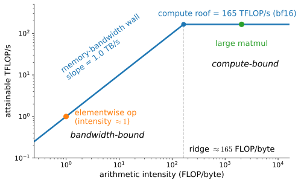
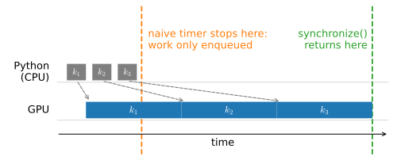
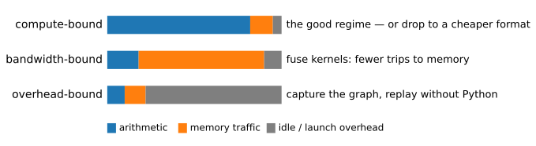

# The Performance Model
:label:`sec_perf_model`

Run one matrix multiplication at two sizes on the same GPU and time it
honestly, and you will find that the hardware delivers wildly different
fractions of its advertised speed: a small multiplication achieves a
percent or less of the chip's peak, a large one comes close to the
specification sheet. Same silicon, same operation, same library — a
difference of roughly two orders of magnitude in *achieved* arithmetic
throughput. This section
exists to explain that plot, and to turn the explanation into a working
method.

The method has four steps, and the rest of this chapter is the method,
applied: **measure** what your program actually does; **classify** which of
three resources binds it — arithmetic, memory bandwidth, or per-operation
overhead; **fix** the binding constraint with the matching technique; then
**re-measure**, because the fix moves the bottleneck somewhere else. Every
later section of this chapter slots into this loop.
:numref:`sec_hardware` explains where the machine's two headline numbers
come from; :numref:`sec_compilation` targets the bandwidth and overhead
regimes; :numref:`sec_memory_precision` buys back memory and trades
precision for speed; :numref:`sec_multi_gpu` and
:numref:`sec_multi_gpu_concise` add devices;
:numref:`sec_fast_transformer` runs the whole loop on a real Transformer.

Two ideas carry the section. The first is *arithmetic intensity*: how many
floating-point operations a computation performs per byte it moves to and
from memory. Intensity, compared against a single machine-dependent
threshold, predicts which regime an operation lands in — before you run
anything. The second is that *timing a GPU is easy to get wrong*: the
frameworks dispatch work asynchronously, so a naive timer measures how fast
Python can enqueue work, not how fast the GPU can do it. We build the
measurement discipline first, package it into a small tool used throughout
the chapter, and then use it to map our own GPU.

*Prerequisites: tensors and GPU placement from* :numref:`sec_use_gpu`*; the
training loop of* :numref:`sec_linear_scratch`*. No new modeling ideas
appear here — this section is about the machine.*

```{.python .input #performance-model-the-performance-model}
%%tab pytorch
%matplotlib inline
from d2l import torch as d2l
import time
import torch
from torch import nn

# Let fp32 matmuls use tf32 tensor cores; off by default, and every timing
# in this chapter is misleading without it (see :numref:`sec_memory_precision`).
torch.set_float32_matmul_precision('high')
```

```{.python .input #performance-model-the-performance-model}
%%tab jax
%matplotlib inline
from d2l import jax as d2l
import jax
from jax import numpy as jnp
import numpy as np
import time
```

## Counting: FLOPs, Bytes, and Arithmetic Intensity
:label:`subsec_perf-counting`

Every tensor operation makes two demands on the hardware: it asks for
*arithmetic* — some number of floating-point operations (FLOPs) — and it
asks for *bytes* — its inputs must be fetched from memory and its outputs
written back. A GPU has a separate budget for each. Our build machine's RTX
4090 can execute about $165 \times 10^{12}$ FLOP/s on bf16 tensor cores,
and can move about $1.0 \times 10^{12}$ bytes/s between its compute units
and its memory. Which budget runs out first depends on the *ratio* the
operation asks for:

$$
\textrm{arithmetic intensity} \;=\;
\frac{\textrm{FLOPs performed}}{\textrm{bytes moved}}.
$$

Consider the workhorse: a matrix multiplication
$\mathbf{X}\mathbf{W}$ with $\mathbf{X} \in \mathbb{R}^{B \times D}$ and
$\mathbf{W} \in \mathbb{R}^{D \times F}$. It performs $2BDF$ FLOPs (one
multiply and one add per term), while touching $BD + DF + BF$ numbers. With
$b$ bytes per element, the intensity is

$$
\frac{2BDF}{b\,(BD + DF + BF)}
\;=\; \frac{2}{b}\left(\frac{1}{F} + \frac{1}{B} + \frac{1}{D}\right)^{-1}
\;\approx\; \frac{2B}{b} \quad \textrm{for } B \ll D, F.
$$

The approximation is worth memorizing: for a skinny batch pushed through a
wide layer, **intensity grows linearly with the batch size**, because each
weight fetched from memory is reused across every row of the batch. A
batch of one reuses nothing — each weight is fetched, used once, and
discarded. This single observation will explain phenomena from "why big
batches are fast" to why generating from a language model one token at a
time is memory-bound (:numref:`sec_hardware`).

An elementwise operation sits at the other extreme: $y_i = x_i + 1$
performs one FLOP per element while moving $2b$ bytes (read $x_i$, write
$y_i$), an intensity of $1/(2b)$ — a fraction of a FLOP per byte, no matter
how large the tensor.

The *roofline model* :cite:`Williams.Waterman.Patterson.2009` turns
intensity into a performance prediction with one line of arithmetic. An
operation with intensity $I$ running on a machine with peak compute $P$
(FLOP/s) and memory bandwidth $\beta$ (bytes/s) can attain at most

$$
\textrm{performance} \;\leq\; \min(P,\; I \cdot \beta).
$$
:eqlabel:`eq_roofline`

Plotted on log–log axes (:numref:`fig_roofline`), the bound is a sloped
"bandwidth wall" that rises with intensity until it hits the flat "compute
roof". The corner where they meet is the **ridge point** $I^* = P/\beta$:
operations with intensity below $I^*$ are *bandwidth-bound* — the memory
system cannot feed the arithmetic units fast enough, and extra arithmetic
hides under the memory time; operations above it are *compute-bound* — the
arithmetic units are saturated, and moving fewer bytes would not help.


:label:`fig_roofline`

Let's compute the ridge point for the card this book is built on. Peak
tensor-core throughput is not exposed programmatically, so we take it from
the specification sheet; the device query tells us what we are running on.

```{.python .input #performance-model-counting-flops-bytes-and-arithmetic-intensity}
%%tab pytorch
prop = torch.cuda.get_device_properties(0)
peak_tflops = 165.0   # RTX 4090 dense bf16 tensor-core spec
bandwidth_tbs = 1.008  # GDDR6X spec
print(f'{prop.name}, {prop.total_memory / 1e9:.0f} GB')
print(f'ridge point = {peak_tflops / bandwidth_tbs:.0f} FLOP/byte')
```

```{.python .input #performance-model-counting-flops-bytes-and-arithmetic-intensity}
%%tab jax
device = jax.devices()[0]
peak_tflops = 165.0   # RTX 4090 dense bf16 tensor-core spec
bandwidth_tbs = 1.008  # GDDR6X spec
print(f'{device.device_kind}')
print(f'ridge point = {peak_tflops / bandwidth_tbs:.0f} FLOP/byte')
```

A ridge point of about 165 FLOP/byte means the machine wants about *165
arithmetic operations for every byte it fetches*, just to break even —
and our consumer card is on the low side; across modern accelerators the
ridge sits anywhere from a hundred to several hundred FLOP/byte. Very little of
what a neural network does naturally reaches that ratio — which is why
the rest of this chapter is mostly about bytes, not FLOPs. For the square
matmul above ($B = D = F = n$, bf16), intensity is $n/3$: *in principle*,
sizes beyond $n \approx 500$ stop being bandwidth-limited. The measured
sweep below will show that this number is only half the story.
:numref:`sec_hardware` explains where $P$ and $\beta$ come from
physically, and why their ratio has climbed, over the long run, from one
hardware generation to the next.

## Measuring Without Lying
:label:`subsec_perf-measuring`

Before we can map our GPU against the roofline, we must be able to time it —
and the obvious way is wrong. Deep learning frameworks dispatch GPU work
*asynchronously*: when Python executes a tensor operation, the framework
enqueues a kernel on the device and returns immediately, long before the
arithmetic happens. Python then races ahead and enqueues more work while
the GPU chews through the queue (:numref:`fig_async_timeline`). This design
is what lets a slow interpreter drive a fast accelerator — the CPU's job is
to stay *ahead* of the GPU, and any point where Python must stop and wait
for a value is a stall.


:label:`fig_async_timeline`

The consequence for measurement: a wall-clock timer wrapped around a GPU
operation measures the *enqueue*, not the *execution*. Watch it lie:

```{.python .input #performance-model-measuring-without-lying-1}
%%tab pytorch
a = torch.randn(4096, 4096, device=d2l.try_gpu(), dtype=torch.bfloat16)
b = torch.mm(a, a)  # Warmup: cuBLAS picks its kernel on first call

t0 = time.perf_counter()
for _ in range(10):
    b = torch.mm(a, a)
naive = time.perf_counter() - t0

torch.cuda.synchronize()
t0 = time.perf_counter()
for _ in range(10):
    b = torch.mm(a, a)
torch.cuda.synchronize()
honest = time.perf_counter() - t0
print(f'naive timer: {1000 * naive:.2f} ms   '
      f'with synchronize: {1000 * honest:.2f} ms')
```

```{.python .input #performance-model-measuring-without-lying-1}
%%tab jax
key = jax.random.PRNGKey(0)
a = jax.random.normal(key, (4096, 4096), dtype=jnp.bfloat16)
jnp.dot(a, a).block_until_ready()  # Warmup: triggers compilation

t0 = time.perf_counter()
for _ in range(10):
    b = jnp.dot(a, a)
naive = time.perf_counter() - t0

b.block_until_ready()  # Drain the naive loop's in-flight work first
t0 = time.perf_counter()
for _ in range(10):
    b = jnp.dot(a, a)
b.block_until_ready()
honest = time.perf_counter() - t0
print(f'naive timer: {1000 * naive:.2f} ms   '
      f'with block_until_ready: {1000 * honest:.2f} ms')
```

The naive timer reports close to nothing — it clocked ten kernel *launches*.
The real number requires a barrier: in PyTorch,
`torch.cuda.synchronize()` blocks Python until the device queue drains; in
JAX, `block_until_ready()` blocks on one specific result (the tighter of
the two — other work may proceed). Note the barrier *before* the second
timer starts as well: without it, the naive loop's ten still-in-flight
matmuls would be billed to the synchronized loop. A measurement must both
start and stop at a known-quiet device. PyTorch also offers
`torch.cuda.Event` timestamps recorded *on the device itself*, which avoid
stopping the pipeline at all; for whole-operation timing,
synchronize-and-wall-clock gives the same answer and is what we use.

Synchronization also sneaks in where you did not ask for it. Any operation
that needs a tensor's *value* on the host must wait for the device to
produce it:

* `float(x)` and `x.item()` — converting to a Python scalar;
* `x.cpu()`, `x.numpy()`, `np.asarray(x)` — leaving device memory;
* `print(x)` — printing needs the values;
* boolean control flow like `if (loss < 0.1)` — deciding needs the value;
* in PyTorch, shape-producing ops like `x.nonzero()` — the *size* of the
  result depends on the data, so Python must wait to learn it.

Each of these is a barrier exactly like `synchronize()`, but implicit. The
classic self-inflicted wound is reading the loss on every step of a
training loop: the read itself is cheap, but it parks Python at the barrier
once per step, so the GPU queue drains and the enqueue-ahead pipeline of
:numref:`fig_async_timeline` never fills. Let's measure the damage on a
long chain of small operations, where staying ahead matters most:

```{.python .input #performance-model-measuring-without-lying-2}
%%tab pytorch
x = torch.ones(256, 256, device=d2l.try_gpu())

torch.cuda.synchronize()
t0 = time.perf_counter()
s = 0.0
for _ in range(1000):
    y = (x * 1.01).sum()
    s += y.item()          # Reads the value: a barrier on every step
sync_every = time.perf_counter() - t0

torch.cuda.synchronize()
t0 = time.perf_counter()
s = torch.zeros((), device=d2l.try_gpu())
for _ in range(1000):
    y = (x * 1.01).sum()
    s += y                 # Accumulate on the device: no barrier
s = s.item()               # One read at the very end
sync_once = time.perf_counter() - t0
print(f'read every step: {sync_every:.3f} s   '
      f'read once: {sync_once:.3f} s')
```

```{.python .input #performance-model-measuring-without-lying-2}
%%tab jax
x = jnp.ones((256, 256))

t0 = time.perf_counter()
s = 0.0
for _ in range(1000):
    y = (x * 1.01).sum()
    s += float(y)          # Reads the value: a barrier on every step
sync_every = time.perf_counter() - t0

t0 = time.perf_counter()
s = jnp.zeros(())
for _ in range(1000):
    y = (x * 1.01).sum()
    s = s + y              # Accumulate on the device: no barrier
s = float(s)               # One read at the very end
sync_once = time.perf_counter() - t0
print(f'read every step: {sync_every:.3f} s   '
      f'read once: {sync_once:.3f} s')
```

Both loops launch the same kernels and compute the same total; they differ
only in *where the host reads*. Keeping the accumulator on the device and
reading once at the end cuts the wall clock by roughly a third in PyTorch
and by more — around two-thirds — in JAX, where every un-jitted operation
already pays a hefty dispatch cost (a preview of :numref:`sec_compilation`)
and the per-step read stalls that pipeline on top. The exact margin is
framework- and workload-dependent; the rule is not: **synchronize once per
minibatch at most, and only when the host actually needs the value** —
accumulate metrics on the device and read them at logging boundaries. (The
`d2l` training loops used throughout this book go a step further: they
hand each logged value to the plotting board, which performs the
device-to-host conversion on a background thread, off the training loop.)

Since every timing in this chapter needs the same three-step discipline —
warm up, synchronize, then time — we package it once. Warmup matters
because first calls are unrepresentative: cuBLAS selects kernels, JAX
compiles, caches fill. The class times a zero-argument callable and blocks
on the device before starting and stopping the clock:

```{.python .input #performance-model-measuring-without-lying-3}
%%tab pytorch
class Benchmark:  #@save
    """Time a callable: warmup, then device-synchronized average seconds."""
    def __init__(self, f, warmup=3, repeats=10, desc='time'):
        self.desc = desc
        for _ in range(warmup):
            f()
        if torch.cuda.is_available():
            torch.cuda.synchronize()
        t0 = time.perf_counter()
        for _ in range(repeats):
            f()
        if torch.cuda.is_available():
            torch.cuda.synchronize()
        self.time = (time.perf_counter() - t0) / repeats

    def __repr__(self):
        return f'{self.desc}: {1000 * self.time:.2f} ms/call'
```

```{.python .input #performance-model-measuring-without-lying-3}
%%tab jax
class Benchmark:  #@save
    """Time a callable: warmup, then device-synchronized average seconds."""
    def __init__(self, f, warmup=3, repeats=10, desc='time'):
        self.desc = desc
        for _ in range(warmup):
            out = f()
        jax.block_until_ready(out)
        t0 = time.perf_counter()
        for _ in range(repeats):
            out = f()
        jax.block_until_ready(out)
        self.time = (time.perf_counter() - t0) / repeats

    def __repr__(self):
        return f'{self.desc}: {1000 * self.time:.2f} ms/call'
```

```{.python .input #performance-model-measuring-without-lying-4}
%%tab pytorch
Benchmark(lambda: torch.mm(a, a), desc='4096-matmul')
```

```{.python .input #performance-model-measuring-without-lying-4}
%%tab jax
Benchmark(lambda: jnp.dot(a, a), desc='4096-matmul')
```

Note the JAX version blocks on the callable's *return value*, so the
callable must return what it computes — pure functions returning their
results is JAX's house style anyway, and :numref:`sec_compilation` will
make that convention load-bearing.

## The Sweep: Mapping Our GPU
:label:`subsec_perf-sweep`

Armed with a synchronized timer, we can produce the plot this section
opened with: achieved TFLOP/s as a function of matrix size, against the
roofline's bound. A square bf16 matmul at size $n$ performs $2n^3$ FLOPs;
its intensity $n/3$ crosses our card's ridge point near $n \approx 500$,
so the *ceiling* of :eqref:`eq_roofline` rises for small $n$ and flattens
for large $n$. Where the measured curve sits below that ceiling is the
interesting part.

```{.python .input #performance-model-the-sweep-mapping-our-gpu}
%%tab pytorch
sizes = [256, 512, 1024, 2048, 4096, 8192]
achieved = []
for n in sizes:
    a = torch.randn(n, n, device=d2l.try_gpu(), dtype=torch.bfloat16)
    t = Benchmark(lambda: torch.mm(a, a)).time
    achieved.append(2 * n**3 / t / 1e12)
d2l.plot(sizes, [achieved], 'matrix size $n$', 'achieved TFLOP/s',
         xscale='log', yscale='log')
print([f'{n}: {tf:.1f}' for n, tf in zip(sizes, achieved)])
```

```{.python .input #performance-model-the-sweep-mapping-our-gpu}
%%tab jax
sizes = [256, 512, 1024, 2048, 4096, 8192]
achieved = []
for n in sizes:
    a = jax.random.normal(key, (n, n), dtype=jnp.bfloat16)
    compiled = jax.jit(jnp.dot).lower(a, a).compile()
    flops = compiled.cost_analysis()['flops']  # Analytic count, no timing
    t = Benchmark(lambda: compiled(a, a)).time
    achieved.append(flops / t / 1e12)
d2l.plot(sizes, [achieved], 'matrix size $n$', 'achieved TFLOP/s',
         xscale='log', yscale='log')
print([f'{n}: {tf:.1f}' for n, tf in zip(sizes, achieved)])
```

The JAX tab shows off a genuinely elegant tool: instead of writing the
$2n^3$ formula by hand, it asks the compiler. Ahead-of-time lowering
(`jit(...).lower(...).compile()`) produces a compiled object whose
`cost_analysis()` reports the exact analytic FLOP count of the program —
no execution, no estimation. We will lean on this introspection again in
:numref:`sec_compilation` and :numref:`sec_memory_precision`.

Read the plot against :numref:`fig_roofline`, remembering that the
roofline is a *ceiling*, not a prediction of where you land. At $n = 256$
the card delivers a percent or less of peak: the matrix is so small that
per-kernel overhead (a few microseconds to launch work at all — see
:numref:`sec_hardware`) rivals the arithmetic. More telling is $n = 512$.
Its nominal intensity ($\approx 171$) already sits *above* the ridge
point, so the intensity model alone declares it compute-bound — yet the
card delivers a tenth of peak or less. A $512^2$ output is simply too
little work to fill 128 streaming multiprocessors, and the launch
overhead has not yet been amortized away. Through the middle sizes
throughput therefore climbs steeply — a single doubling of $n$ can buy
several times the TFLOP/s — and the curve approaches the specification
number only around $n \approx 2048$–$4096$, where the tensor cores
finally saturate and the operation is compute-bound in fact as well as on
paper. The gap between the nominal crossover ($n \approx 500$) and the
measured knee ($n \approx 2048$–$4096$, depending on the framework) is
not a failure of the model; it *is*
a lesson: intensity tells you when an operation stops being
bandwidth-limited in principle, while utilization and overhead decide how
much of the roof you collect — and separating those causes is exactly
what the profiler below is for.

## Three Regimes
:label:`subsec_perf-regimes`

The sweep exposed all three ways a GPU program spends its time, and they
are worth naming precisely, because the *fix depends on the diagnosis*
:cite:`He.2022`. A step of any workload divides its wall-clock time among
arithmetic, memory traffic, and idle gaps where the device waits for
Python; whichever dominates names the regime
(:numref:`fig_regimes`).


:label:`fig_regimes`

**Compute-bound** — the arithmetic units are the constraint. This is the
regime you *want*: the silicon is earning its price. The remaining levers
are to buy the arithmetic more cheaply — a lower-precision format doubles
throughput per halving (:numref:`sec_hardware`,
:numref:`sec_memory_precision`) — or to buy more silicon
(:numref:`sec_multi_gpu`).

**Bandwidth-bound** — intensity below the ridge; the compute units starve
while memory serves bytes. The fix is to *move fewer bytes*: fuse chains
of operations so intermediate results never make the round trip to memory
(:numref:`sec_compilation`), recompute rather than store
(:numref:`sec_memory_precision`), or restructure the algorithm for reuse —
the FlashAttention kernel of :numref:`sec_attention-at-scale` is this fix,
executed by hand at world-class level.

**Overhead-bound** — the device finishes each kernel before Python can
supply the next one; the GPU is idle most of the time. Small models with
many small layers live here. The fix is to get Python out of the loop:
capture the whole graph once and replay it without the interpreter
(:numref:`sec_compilation`).

Here is a bandwidth-bound specimen, and a first taste of diagnosis. Take
one large tensor and apply single elementwise kernels of wildly different
arithmetic cost — an add, a multiply, and a transcendental:

```{.python .input #performance-model-three-regimes-1}
%%tab pytorch
x = torch.randn(4000, 4000, device=d2l.try_gpu())
for desc, f in [('add', lambda: x + 1), ('mul', lambda: x * 1.5),
                ('sin', lambda: torch.sin(x)),
                ('sigmoid', lambda: torch.sigmoid(x))]:
    print(Benchmark(f, desc=desc))
```

```{.python .input #performance-model-three-regimes-1}
%%tab jax
x = jax.random.normal(key, (4000, 4000))
for desc, f in [('add', lambda: x + 1), ('mul', lambda: x * 1.5),
                ('sin', lambda: jnp.sin(x)),
                ('sigmoid', lambda: jax.nn.sigmoid(x))]:
    print(Benchmark(f, desc=desc))
```

A sine costs far more arithmetic than an add, yet it runs no slower:
each kernel's cost is set by the 128 MB it reads and writes, not by what
it computes on the way through. (In the PyTorch tab the four times are
all but identical; where they scatter, as in the JAX tab, the spread is
per-dispatch overhead on these un-jitted calls — a preview of the third
regime — not the arithmetic.) While bandwidth binds,
extra arithmetic hides under the memory time — the definition of
bandwidth-bound. Now chain a few of these operations, the way any
activation function or normalization layer does:

```{.python .input #performance-model-three-regimes-2}
%%tab pytorch
def gelu_ish(x):
    # Several elementwise ops; eager mode runs one kernel per op,
    # each a full round trip to memory
    return 0.5 * x * (1 + torch.tanh(0.8 * (x + 0.04 * x**3)))

print(Benchmark(lambda: x + 1, desc='1 op'))
print(Benchmark(lambda: gelu_ish(x), desc='chain'))
```

```{.python .input #performance-model-three-regimes-2}
%%tab jax
def gelu_ish(x):
    # Several elementwise ops; without jit, one kernel per op,
    # each a full round trip to memory
    return 0.5 * x * (1 + jnp.tanh(0.8 * (x + 0.04 * x**3)))

print(Benchmark(lambda: x + 1, desc='1 op'))
print(Benchmark(lambda: gelu_ish(x), desc='chain'))
```

The chain performs a handful of cheap operations, but eager execution runs
each as its own kernel, and each kernel pays the full memory round trip —
so the chain costs roughly as many round trips as it has operations,
despite computing one output from one input. The diagnosis is complete:
bandwidth-bound, with a factor-of-several overpayment in bytes. We could
cure it right now by hand-writing one fused kernel; instead we deliberately
leave it bleeding. :numref:`sec_compilation` will cure it with one line,
and explain what the compiler saw.

## The Profiler
:label:`subsec_perf-profiler`

Intensity arithmetic classifies a single operation; real training steps mix
hundreds. The tool that classifies a *program* is the profiler, which
records every kernel with its duration and stream — the measured version of
:numref:`fig_async_timeline`. First contact, on a small training step:

```{.python .input #performance-model-the-profiler}
%%tab pytorch
net = nn.Sequential(nn.Linear(1024, 1024), nn.ReLU(),
                    nn.Linear(1024, 1024), nn.ReLU(),
                    nn.Linear(1024, 10)).to(d2l.try_gpu())
X = torch.randn(64, 1024, device=d2l.try_gpu())
opt = torch.optim.SGD(net.parameters(), lr=0.1)

def step():
    opt.zero_grad(set_to_none=True)
    net(X).sum().backward()
    opt.step()

step()  # Warmup
with torch.profiler.profile(
        activities=[torch.profiler.ProfilerActivity.CPU,
                    torch.profiler.ProfilerActivity.CUDA],
        acc_events=True) as prof:
    for _ in range(5):
        step()
print(prof.key_averages().table(sort_by='cuda_time_total', row_limit=8))
```

```{.python .input #performance-model-the-profiler}
%%tab jax
def loss_fn(params, X):
    h = X
    for W in params[:-1]:
        h = jax.nn.relu(h @ W)
    return (h @ params[-1]).sum()

params = [jax.random.normal(k, s) * 0.03 for k, s in zip(
    jax.random.split(key, 3), [(1024, 1024), (1024, 1024), (1024, 10)])]
X = jax.random.normal(key, (64, 1024))
grad_fn = jax.jit(jax.grad(loss_fn))
jax.block_until_ready(grad_fn(params, X))  # Warmup / compile

with jax.profiler.trace('/tmp/jax-trace'):
    for _ in range(5):
        grads = grad_fn(params, X)
    jax.block_until_ready(grads)
print('trace written to /tmp/jax-trace; '
      'open it in Perfetto (ui.perfetto.dev) or TensorBoard')
```

The PyTorch table is the diagnostic in miniature. Two columns matter most:
device ("CUDA") time tells you *which kernels* dominate — matmuls
(compute), elementwise/copy kernels (bandwidth) — and the ratio of total
CPU time to total CUDA time tells you *whether the GPU is fed*: when CPU
time is far larger, the program is overhead-bound and the kernels
themselves are almost irrelevant. Read that ratio coarsely, though: CPU
and device totals overlap across threads and streams, so it is a regime
heuristic, not a utilization figure — when a real decision hangs on it,
look at the timeline instead. Both frameworks can also export a full
timeline — `prof.export_chrome_trace(...)` in PyTorch; the JAX trace
directory above opens in Perfetto or TensorBoard — where the
:numref:`fig_async_timeline` picture appears for your actual program, gaps
and all. We will read one in earnest in :numref:`sec_fast_transformer`.

> **The method.** Measure with a synchronized timer or profiler. Classify
> the regime: compute-bound (kernels dominated by matmuls, device busy),
> bandwidth-bound (kernels dominated by memory traffic, device busy), or
> overhead-bound (device idle between kernels). Fix what binds — formats
> and parallelism for compute, fusion and recomputation for bandwidth,
> capture-and-replay for overhead. Re-measure, because the bottleneck
> moves. The rest of this chapter is this loop, applied.

## Summary

* Arithmetic intensity — FLOPs per byte moved — caps performance
  through the roofline bound
  $\min(\textrm{peak}, \textrm{intensity} \times \textrm{bandwidth})$. The
  ridge point of a modern GPU sits at a hundred to several hundred
  FLOP/byte (about 165 on our card), so most operations are
  bandwidth-bound, and batch size is the main natural lever on a
  matmul's intensity.
* GPU dispatch is asynchronous: naive timers measure the enqueue, not the
  work. Time with a synchronization barrier (`torch.cuda.synchronize`,
  `block_until_ready`), warm up first, and beware implicit barriers —
  `.item()`, `.numpy()`, `print`, value-dependent control flow — inside hot
  loops.
* One matmul kernel traverses three regimes as it grows: overhead-bound
  when tiny, bandwidth-bound in the middle, compute-bound at scale — and
  it reaches the roof well after the intensity model's nominal crossover,
  because small shapes cannot fill the machine. The profiler's
  CPU-versus-device-time comparison diagnoses which regime a whole
  program is in.
* The chapter's method: measure → classify → fix → re-measure.

## Exercises

1. Compute the ridge point of the GPU you are actually running on, from
   its specification sheet, and compare it against your own sweep: at what
   matrix size does the measured curve leave the bandwidth wall? How does
   the answer change if you sweep fp32 matmuls instead of bf16?
1. For the batched product $\mathbf{X}\mathbf{W}$ with
   $\mathbf{X} \in \mathbb{R}^{B \times 4096}$ and
   $\mathbf{W} \in \mathbb{R}^{4096 \times 4096}$ in bf16, the intensity
   is approximately $B$ for small $B$. Predict the batch size at which the
   operation crosses your card's ridge point, then measure achieved
   TFLOP/s for $B \in \{1, 8, 64, 512, 4096\}$ and check.
1. Take the training loop of :numref:`sec_linear_concise` and add a
   `print(loss)` on every iteration. Measure the slowdown per step as a
   function of batch size. Why does the *relative* damage shrink as the
   batch grows?
1. Profile a training step whose `DataLoader` uses `num_workers=0` on a
   small model, and classify the program using the CPU-versus-device-time
   rule. Which of the three regimes is it in — and is that a GPU problem
   at all?
1. `x.nonzero()` forces a synchronization in PyTorch but `x + 1` does
   not, even though both launch kernels. Explain the difference in one
   sentence, and find one more operation with the same property.

<!-- slides -->

::: {.slide title="Same Chip, Two Orders of Magnitude Apart"}
One kernel — a square matmul — timed honestly at two sizes on
the same GPU delivers a percent or so of peak at one size and
nearly the full specification number at the other.

Explaining that gap yields the chapter's whole toolkit:

- a **cost model** you can compute with pencil and paper,
- a **measurement discipline** the frameworks' async dispatch
  makes non-optional,
- a **diagnosis → fix** table the next six sections fill in.
:::

::: {.slide title="Arithmetic Intensity and the Roofline"}
Every op asks for FLOPs *and* bytes. Intensity = FLOPs/byte.

$$\textrm{performance} \leq \min(P,\; I \cdot \beta)$$

{width=78%}

Matmul $\mathbf{X}_{B\times D}\mathbf{W}_{D\times F}$: intensity
$\approx 2B/b$ — *batch size is intensity*. Elementwise ops:
intensity below 1, forever bandwidth-bound.
:::

::: {.slide title="The Ridge Point, on Our Card"}
@performance-model-counting-flops-bytes-and-arithmetic-intensity

. . .

~165 FLOP/byte: the machine wants **about 165 ops for every byte
fetched** just to break even. Almost nothing you write naturally
gets there. Performance work is mostly about bytes.
:::

::: {.slide title="Timing GPUs: the Trap"}
Dispatch is asynchronous — Python enqueues, the GPU runs behind.

{width=90%}

@performance-model-measuring-without-lying-1
:::

::: {.slide title="Implicit Barriers"}
Anything that needs a *value* waits for the device:
`.item()`, `.numpy()`, `print(x)`, `if loss < 0.1:`, `nonzero()`.

@performance-model-measuring-without-lying-2

. . .

Rule: synchronize once per minibatch at most — and only when the
host actually needs the value.
:::

::: {.slide title="A Benchmark That Does Not Lie"}
Warmup (kernel selection, compilation), sync, time, sync:

@performance-model-measuring-without-lying-3
:::

::: {.slide title="The Sweep: One Kernel, Three Regimes"}
@performance-model-the-sweep-mapping-our-gpu

. . .

Tiny: overhead-bound (launches rival arithmetic). Middle: a steep
climb while the kernel learns to fill 128 SMs. Large: flat at the
roof — compute-bound. The roofline is the *ceiling*; the
measured knee (~2048–4096) sits well past the nominal crossover (~500) —
that gap is utilization and overhead.
:::

::: {.slide title="Diagnosis Determines the Fix"}
{width=95%}

@performance-model-three-regimes-1

sin costs no more than add: below the ridge, **memory traffic sets
the time and the arithmetic hides under it.**
:::

::: {.slide title="The Method"}
An unfused elementwise chain pays one memory round trip per op —
we measured it, we diagnosed it, and we leave it bleeding until
the compiler section cures it with one line.

**measure → classify → fix → re-measure**

The rest of the chapter is this loop, applied: hardware explains
the constants; compilation attacks bandwidth and overhead; memory
and precision buy headroom; more GPUs buy more roof.
:::
