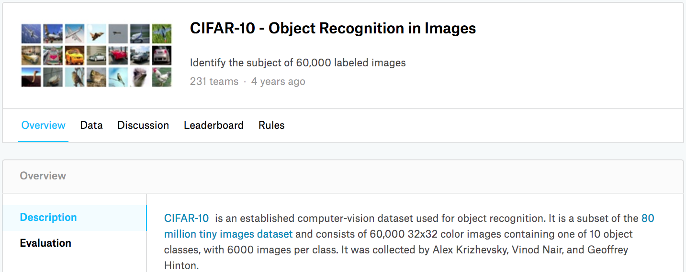

# Image Classification (CIFAR-10) on Kaggle
:label:`sec_kaggle_cifar10`

So far, we have been using high-level APIs of deep learning frameworks to directly obtain image datasets in tensor format.
However, custom image datasets
often come in the form of image files.
In this section, we will start from
raw image files,
and organize, read, then transform them
into tensor format step by step.

We experimented with the CIFAR-10 dataset in :numref:`sec_image_augmentation`,
which is an important dataset in computer vision.
In this section,
we will apply the knowledge we learned
in previous sections
to practice the Kaggle competition of
CIFAR-10 image classification.
The web address of the competition is https://www.kaggle.com/c/cifar-10

:numref:`fig_kaggle_cifar10` shows the information on the competition's webpage.
In order to submit the results,
you need to register a Kaggle account.


:width:`600px`
:label:`fig_kaggle_cifar10`

```{.python .input #kaggle-cifar10-image-classification-cifar-10-on-kaggle}
#@tab mxnet
import collections
from d2l import mxnet as d2l
import math
from mxnet import gluon, init, np, npx
from mxnet.gluon import nn
import os
import pandas as pd
import shutil

npx.set_np()
```

```{.python .input #kaggle-cifar10-image-classification-cifar-10-on-kaggle}
#@tab pytorch
import collections
from d2l import torch as d2l
import math
import torch
import torchvision
from torch import nn
import os
import pandas as pd
import shutil
```

```{.python .input #kaggle-cifar10-image-classification-cifar-10-on-kaggle}
#@tab jax
import collections
from d2l import jax as d2l
import jax
from jax import numpy as jnp
from flax import linen as nn
import optax
import numpy as np
import tensorflow as tf
import math
import os
import pandas as pd
import shutil
```

```{.python .input #kaggle-cifar10-image-classification-cifar-10-on-kaggle}
#@tab tensorflow
import collections
from d2l import tensorflow as d2l
import tensorflow as tf
import keras
import numpy as np
import math
import os
import pandas as pd
import shutil
```

## Obtaining and Organizing the Dataset

The competition dataset is divided into
a training set and a test set,
which contain 50000 and 300000 images, respectively.
In the test set,
10000 images will be used for evaluation,
while the remaining 290000 images will not
be evaluated:
they are included just
to make it hard
to cheat with
*manually* labeled results of the test set.
The images in this dataset
are all png color (RGB channels) image files,
whose height and width are both 32 pixels.
The images cover a total of 10 categories, namely airplanes, cars, birds, cats, deer, dogs, frogs, horses, boats, and trucks.
The upper-left corner of :numref:`fig_kaggle_cifar10` shows some images of airplanes, cars, and birds in the dataset.


### Downloading the Dataset

After logging in to Kaggle, we can click the "Data" tab on the CIFAR-10 image classification competition webpage shown in :numref:`fig_kaggle_cifar10` and download the dataset by clicking the "Download All" button.
After unzipping the downloaded file in `../data`, and unzipping `train.7z` and `test.7z` inside it, you will find the entire dataset in the following paths:

* `../data/cifar-10/train/[1-50000].png`
* `../data/cifar-10/test/[1-300000].png`
* `../data/cifar-10/trainLabels.csv`
* `../data/cifar-10/sampleSubmission.csv`

where the `train` and `test` directories contain the training and testing images, respectively, `trainLabels.csv` provides labels for the training images, and `sample_submission.csv` is a sample submission file.

To make it easier to get started, we provide a small-scale sample of the dataset that
contains the first 1000 training images and 5 random testing images.
To use the full dataset of the Kaggle competition, you need to set the following `demo` variable to `False`.

```{.python .input #kaggle-cifar10-downloading-the-dataset}
#@save
d2l.DATA_HUB['cifar10_tiny'] = (d2l.DATA_URL + 'kaggle_cifar10_tiny.zip',
                                '2068874e4b9a9f0fb07ebe0ad2b29754449ccacd')

# If you use the full dataset downloaded for the Kaggle competition, set
# `demo` to False
demo = True

if demo:
    data_dir = d2l.download_extract('cifar10_tiny')
else:
    data_dir = '../data/cifar-10/'
```

### Organizing the Dataset

We need to organize datasets to facilitate model training and testing.
Let's first read the labels from the csv file.
The following function returns a dictionary that maps
the non-extension part of the filename to its label.

```{.python .input #kaggle-cifar10-organizing-the-dataset-1}
#@save
def read_csv_labels(fname):
    """Read `fname` to return a filename to label dictionary."""
    with open(fname, 'r') as f:
        # Skip the file header line (column name)
        lines = f.readlines()[1:]
    tokens = [l.rstrip().split(',') for l in lines]
    return dict(((name, label) for name, label in tokens))

labels = read_csv_labels(os.path.join(data_dir, 'trainLabels.csv'))
print('# training examples:', len(labels))
print('# classes:', len(set(labels.values())))
```

Next, we define the `reorg_train_valid` function to split the validation set out of the original training set.
The argument `valid_ratio` in this function is the ratio of the number of examples in the validation set to the number of examples in the original training set.
More concretely,
let $n$ be the number of images of the class with the least examples, and $r$ be the ratio.
The validation set will split out
$\max(\lfloor nr\rfloor,1)$ images for each class.
Let's use `valid_ratio=0.1` as an example. Since the original training set has 50000 images,
there will be 45000 images used for training in the path `train_valid_test/train`,
while the other 5000 images will be split out
as validation set in the path `train_valid_test/valid`. After organizing the dataset, images of the same class will be placed under the same folder.

```{.python .input #kaggle-cifar10-organizing-the-dataset-2}
#@save
def copyfile(filename, target_dir):
    """Copy a file into a target directory."""
    os.makedirs(target_dir, exist_ok=True)
    shutil.copy(filename, target_dir)

#@save
def reorg_train_valid(data_dir, labels, valid_ratio):
    """Split the validation set out of the original training set."""
    # The number of examples of the class that has the fewest examples in the
    # training dataset
    n = collections.Counter(labels.values()).most_common()[-1][1]
    # The number of examples per class for the validation set
    n_valid_per_label = max(1, math.floor(n * valid_ratio))
    label_count = {}
    for train_file in os.listdir(os.path.join(data_dir, 'train')):
        label = labels[train_file.split('.')[0]]
        fname = os.path.join(data_dir, 'train', train_file)
        copyfile(fname, os.path.join(data_dir, 'train_valid_test',
                                     'train_valid', label))
        if label not in label_count or label_count[label] < n_valid_per_label:
            copyfile(fname, os.path.join(data_dir, 'train_valid_test',
                                         'valid', label))
            label_count[label] = label_count.get(label, 0) + 1
        else:
            copyfile(fname, os.path.join(data_dir, 'train_valid_test',
                                         'train', label))
    return n_valid_per_label
```

The `reorg_test` function below organizes the testing set for data loading during prediction.

```{.python .input #kaggle-cifar10-organizing-the-dataset-3}
#@save
def reorg_test(data_dir):
    """Organize the testing set for data loading during prediction."""
    for test_file in os.listdir(os.path.join(data_dir, 'test')):
        copyfile(os.path.join(data_dir, 'test', test_file),
                 os.path.join(data_dir, 'train_valid_test', 'test',
                              'unknown'))
```

Finally, we use a function to invoke
the `read_csv_labels`, `reorg_train_valid`, and `reorg_test` functions defined above.

```{.python .input #kaggle-cifar10-organizing-the-dataset-4}
def reorg_cifar10_data(data_dir, valid_ratio):
    labels = read_csv_labels(os.path.join(data_dir, 'trainLabels.csv'))
    reorg_train_valid(data_dir, labels, valid_ratio)
    reorg_test(data_dir)
```

Here we only set the batch size to 32 for the small-scale sample of the dataset.
When training and testing
the complete dataset of the Kaggle competition,
`batch_size` should be set to a larger integer, such as 128.
We split out 10% of the training examples as the validation set for tuning hyperparameters.

```{.python .input #kaggle-cifar10-organizing-the-dataset-5}
batch_size = 32 if demo else 128
valid_ratio = 0.1
reorg_cifar10_data(data_dir, valid_ratio)
```

## Image Augmentation

We use image augmentation to address overfitting.
For example, images can be flipped horizontally at random during training.
We can also perform standardization for the three RGB channels of color images. Below lists some of these operations that you can tweak.

```{.python .input #kaggle-cifar10-image-augmentation-1}
#@tab mxnet
transform_train = gluon.data.vision.transforms.Compose([
    # Scale the image up to a square of 40 pixels in both height and width
    gluon.data.vision.transforms.Resize(40),
    # Randomly crop a square image of 40 pixels in both height and width to
    # produce a small square of 0.64 to 1 times the area of the original
    # image, and then scale it to a square of 32 pixels in both height and
    # width
    gluon.data.vision.transforms.RandomResizedCrop(32, scale=(0.64, 1.0),
                                                   ratio=(1.0, 1.0)),
    gluon.data.vision.transforms.RandomFlipLeftRight(),
    gluon.data.vision.transforms.ToTensor(),
    # Standardize each channel of the image
    gluon.data.vision.transforms.Normalize([0.4914, 0.4822, 0.4465],
                                           [0.2023, 0.1994, 0.2010])])
```

```{.python .input #kaggle-cifar10-image-augmentation-1}
#@tab pytorch
transform_train = torchvision.transforms.Compose([
    # Scale the image up to a square of 40 pixels in both height and width
    torchvision.transforms.Resize(40),
    # Randomly crop a square image of 40 pixels in both height and width to
    # produce a small square of 0.64 to 1 times the area of the original
    # image, and then scale it to a square of 32 pixels in both height and
    # width
    torchvision.transforms.RandomResizedCrop(32, scale=(0.64, 1.0),
                                                   ratio=(1.0, 1.0)),
    torchvision.transforms.RandomHorizontalFlip(),
    torchvision.transforms.ToTensor(),
    # Standardize each channel of the image
    torchvision.transforms.Normalize([0.4914, 0.4822, 0.4465],
                                     [0.2023, 0.1994, 0.2010])])
```

```{.python .input #kaggle-cifar10-image-augmentation-1}
#@tab jax
CIFAR_MEAN = np.array([0.4914, 0.4822, 0.4465], dtype=np.float32)
CIFAR_STD = np.array([0.2023, 0.1994, 0.2010], dtype=np.float32)

def transform_train_fn(image, label):
    """Training augmentation: resize, random crop, flip, normalize."""
    image = tf.cast(image, tf.float32)
    image = tf.image.resize(image, [40, 40])
    image = tf.image.random_crop(image, size=[32, 32, 3])
    image = tf.image.random_flip_left_right(image)
    image = image / 255.0
    image = (image - CIFAR_MEAN) / CIFAR_STD
    return image, label

def transform_test_fn(image, label):
    """Test preprocessing: normalize only."""
    image = tf.cast(image, tf.float32) / 255.0
    image = (image - CIFAR_MEAN) / CIFAR_STD
    return image, label
```

```{.python .input #kaggle-cifar10-image-augmentation-1}
#@tab tensorflow
CIFAR_MEAN = tf.constant([0.4914, 0.4822, 0.4465], dtype=tf.float32)
CIFAR_STD = tf.constant([0.2023, 0.1994, 0.2010], dtype=tf.float32)

def transform_train_fn(image, label):
    """Training augmentation: resize, random crop, flip, normalize."""
    image = tf.cast(image, tf.float32)
    image = tf.image.resize(image, [40, 40])
    image = tf.image.random_crop(image, size=[32, 32, 3])
    image = tf.image.random_flip_left_right(image)
    image = image / 255.0
    image = (image - CIFAR_MEAN) / CIFAR_STD
    return image, label

def transform_test_fn(image, label):
    """Test preprocessing: normalize only."""
    image = tf.cast(image, tf.float32) / 255.0
    image = (image - CIFAR_MEAN) / CIFAR_STD
    return image, label
```

During testing,
we only perform standardization on images
so as to
remove randomness in the evaluation results.

```{.python .input #kaggle-cifar10-image-augmentation-2}
#@tab mxnet
transform_test = gluon.data.vision.transforms.Compose([
    gluon.data.vision.transforms.ToTensor(),
    gluon.data.vision.transforms.Normalize([0.4914, 0.4822, 0.4465],
                                           [0.2023, 0.1994, 0.2010])])
```

```{.python .input #kaggle-cifar10-image-augmentation-2}
#@tab pytorch
transform_test = torchvision.transforms.Compose([
    torchvision.transforms.ToTensor(),
    torchvision.transforms.Normalize([0.4914, 0.4822, 0.4465],
                                     [0.2023, 0.1994, 0.2010])])
```

```{.python .input #kaggle-cifar10-image-augmentation-2}
#@tab jax
# Test transform is defined above as transform_test_fn
```

```{.python .input #kaggle-cifar10-image-augmentation-2}
#@tab tensorflow
# Test transform is defined above as transform_test_fn
```

## Reading the Dataset

Next, we read the organized dataset consisting of raw image files. Each example includes an image and a label.

```{.python .input #kaggle-cifar10-reading-the-dataset-1}
#@tab mxnet
train_ds, valid_ds, train_valid_ds, test_ds = [
    gluon.data.vision.ImageFolderDataset(
        os.path.join(data_dir, 'train_valid_test', folder))
    for folder in ['train', 'valid', 'train_valid', 'test']]
```

```{.python .input #kaggle-cifar10-reading-the-dataset-1}
#@tab pytorch
train_ds, train_valid_ds = [torchvision.datasets.ImageFolder(
    os.path.join(data_dir, 'train_valid_test', folder),
    transform=transform_train) for folder in ['train', 'train_valid']]

valid_ds, test_ds = [torchvision.datasets.ImageFolder(
    os.path.join(data_dir, 'train_valid_test', folder),
    transform=transform_test) for folder in ['valid', 'test']]
```

```{.python .input #kaggle-cifar10-reading-the-dataset-1}
#@tab jax
def _load_image_folder_tf(folder_path):
    """Load images from a class-subfolder directory into a tf.data.Dataset
    of (image, label) where image is uint8 [H, W, 3] and label is int."""
    ds = tf.keras.utils.image_dataset_from_directory(
        folder_path, label_mode='int', image_size=(32, 32),
        batch_size=None, shuffle=False)
    return ds

train_ds = _load_image_folder_tf(
    os.path.join(data_dir, 'train_valid_test', 'train'))
train_valid_ds = _load_image_folder_tf(
    os.path.join(data_dir, 'train_valid_test', 'train_valid'))
valid_ds = _load_image_folder_tf(
    os.path.join(data_dir, 'train_valid_test', 'valid'))
test_ds = _load_image_folder_tf(
    os.path.join(data_dir, 'train_valid_test', 'test'))
```

```{.python .input #kaggle-cifar10-reading-the-dataset-1}
#@tab tensorflow
def _load_image_folder_tf(folder_path):
    """Load images from a class-subfolder directory into a tf.data.Dataset
    of (image, label) where image is uint8 [H, W, 3] and label is int."""
    ds = keras.utils.image_dataset_from_directory(
        folder_path, label_mode='int', image_size=(32, 32),
        batch_size=None, shuffle=False)
    return ds

train_ds = _load_image_folder_tf(
    os.path.join(data_dir, 'train_valid_test', 'train'))
train_valid_ds = _load_image_folder_tf(
    os.path.join(data_dir, 'train_valid_test', 'train_valid'))
valid_ds = _load_image_folder_tf(
    os.path.join(data_dir, 'train_valid_test', 'valid'))
test_ds = _load_image_folder_tf(
    os.path.join(data_dir, 'train_valid_test', 'test'))
```

During training,
we need to specify all the image augmentation operations defined above.
When the validation set
is used for model evaluation during hyperparameter tuning,
no randomness from image augmentation should be introduced.
Before final prediction,
we train the model on the combined training set and validation set to make full use of all the labeled data.

```{.python .input #kaggle-cifar10-reading-the-dataset-2}
#@tab mxnet
train_iter, train_valid_iter = [gluon.data.DataLoader(
    dataset.transform_first(transform_train), batch_size, shuffle=True,
    last_batch='discard') for dataset in (train_ds, train_valid_ds)]

valid_iter = gluon.data.DataLoader(
    valid_ds.transform_first(transform_test), batch_size, shuffle=False,
    last_batch='discard')

test_iter = gluon.data.DataLoader(
    test_ds.transform_first(transform_test), batch_size, shuffle=False,
    last_batch='keep')
```

```{.python .input #kaggle-cifar10-reading-the-dataset-2}
#@tab pytorch
train_iter, train_valid_iter = [torch.utils.data.DataLoader(
    dataset, batch_size, shuffle=True, drop_last=True)
    for dataset in (train_ds, train_valid_ds)]

valid_iter = torch.utils.data.DataLoader(valid_ds, batch_size, shuffle=False,
                                         drop_last=True)

test_iter = torch.utils.data.DataLoader(test_ds, batch_size, shuffle=False,
                                        drop_last=False)
```

```{.python .input #kaggle-cifar10-reading-the-dataset-2}
#@tab jax
train_iter = (train_ds.map(transform_train_fn, num_parallel_calls=tf.data.AUTOTUNE)
              .shuffle(10000).batch(batch_size, drop_remainder=True)
              .prefetch(tf.data.AUTOTUNE))
train_valid_iter = (train_valid_ds.map(transform_train_fn,
                    num_parallel_calls=tf.data.AUTOTUNE)
                    .shuffle(10000).batch(batch_size, drop_remainder=True)
                    .prefetch(tf.data.AUTOTUNE))
valid_iter = (valid_ds.map(transform_test_fn, num_parallel_calls=tf.data.AUTOTUNE)
              .batch(batch_size, drop_remainder=True)
              .prefetch(tf.data.AUTOTUNE))
test_iter = (test_ds.map(transform_test_fn, num_parallel_calls=tf.data.AUTOTUNE)
             .batch(batch_size, drop_remainder=False)
             .prefetch(tf.data.AUTOTUNE))
```

```{.python .input #kaggle-cifar10-reading-the-dataset-2}
#@tab tensorflow
train_iter = (train_ds.map(transform_train_fn, num_parallel_calls=tf.data.AUTOTUNE)
              .shuffle(10000).batch(batch_size, drop_remainder=True)
              .prefetch(tf.data.AUTOTUNE))
train_valid_iter = (train_valid_ds.map(transform_train_fn,
                    num_parallel_calls=tf.data.AUTOTUNE)
                    .shuffle(10000).batch(batch_size, drop_remainder=True)
                    .prefetch(tf.data.AUTOTUNE))
valid_iter = (valid_ds.map(transform_test_fn, num_parallel_calls=tf.data.AUTOTUNE)
              .batch(batch_size, drop_remainder=True)
              .prefetch(tf.data.AUTOTUNE))
test_iter = (test_ds.map(transform_test_fn, num_parallel_calls=tf.data.AUTOTUNE)
             .batch(batch_size, drop_remainder=False)
             .prefetch(tf.data.AUTOTUNE))
```

## Defining the Model

:begin_tab:`mxnet`
Here, we build the residual blocks based on the `HybridBlock` class, which is
slightly different from the implementation described in
:numref:`sec_resnet`.
This is for improving computational efficiency.
:end_tab:

```{.python .input #kaggle-cifar10-defining-the-model-1}
#@tab mxnet
class Residual(nn.HybridBlock):
    def __init__(self, num_channels, use_1x1conv=False, strides=1):
        super(Residual, self).__init__()
        self.conv1 = nn.Conv2D(num_channels, kernel_size=3, padding=1,
                               strides=strides)
        self.conv2 = nn.Conv2D(num_channels, kernel_size=3, padding=1)
        if use_1x1conv:
            self.conv3 = nn.Conv2D(num_channels, kernel_size=1,
                                   strides=strides)
        else:
            self.conv3 = None
        self.bn1 = nn.BatchNorm()
        self.bn2 = nn.BatchNorm()

    def forward(self, X):
        Y = npx.relu(self.bn1(self.conv1(X)))
        Y = self.bn2(self.conv2(Y))
        if self.conv3:
            X = self.conv3(X)
        return npx.relu(Y + X)
```

:begin_tab:`mxnet`
Next, we define the ResNet-18 model.
:end_tab:

```{.python .input #kaggle-cifar10-defining-the-model-2}
#@tab mxnet
def resnet18(num_classes):
    net = nn.HybridSequential()
    net.add(nn.Conv2D(64, kernel_size=3, strides=1, padding=1),
            nn.BatchNorm(), nn.Activation('relu'))

    def resnet_block(num_channels, num_residuals, first_block=False):
        blk = nn.HybridSequential()
        for i in range(num_residuals):
            if i == 0 and not first_block:
                blk.add(Residual(num_channels, use_1x1conv=True, strides=2))
            else:
                blk.add(Residual(num_channels))
        return blk

    net.add(resnet_block(64, 2, first_block=True),
            resnet_block(128, 2),
            resnet_block(256, 2),
            resnet_block(512, 2))
    net.add(nn.GlobalAvgPool2D(), nn.Dense(num_classes))
    return net
```

:begin_tab:`mxnet`
We use Xavier initialization described in :numref:`subsec_xavier` before training begins.
:end_tab:

:begin_tab:`pytorch`
We define the ResNet-18 model described in
:numref:`sec_resnet`.
:end_tab:

:begin_tab:`jax`
We define the ResNet-18 model described in
:numref:`sec_resnet` using Flax.
:end_tab:

```{.python .input #kaggle-cifar10-defining-the-model-3}
#@tab mxnet
def get_net(devices):
    num_classes = 10
    net = resnet18(num_classes)
    net.initialize(ctx=devices, init=init.Xavier())
    return net

loss = gluon.loss.SoftmaxCrossEntropyLoss()
```

```{.python .input #kaggle-cifar10-defining-the-model-3}
#@tab pytorch
def get_net():
    num_classes = 10
    net = d2l.resnet18(num_classes, 3)
    return net

loss = nn.CrossEntropyLoss(reduction="none")
```

```{.python .input #kaggle-cifar10-defining-the-model-3}
#@tab jax
class Residual(nn.Module):
    num_channels: int
    use_1x1conv: bool = False
    strides: int = 1

    @nn.compact
    def __call__(self, X, training=False):
        Y = nn.relu(nn.BatchNorm(use_running_average=not training)(
            nn.Conv(self.num_channels, kernel_size=(3, 3),
                    strides=(self.strides, self.strides), padding='SAME')(X)))
        Y = nn.BatchNorm(use_running_average=not training)(
            nn.Conv(self.num_channels, kernel_size=(3, 3), padding='SAME')(Y))
        if self.use_1x1conv:
            X = nn.Conv(self.num_channels, kernel_size=(1, 1),
                        strides=(self.strides, self.strides))(X)
        return nn.relu(Y + X)

class ResNet18(nn.Module):
    num_classes: int = 10

    @nn.compact
    def __call__(self, X, training=False):
        X = nn.relu(nn.BatchNorm(use_running_average=not training)(
            nn.Conv(64, kernel_size=(3, 3), strides=(1, 1),
                    padding='SAME')(X)))
        # Block 1
        for _ in range(2):
            X = Residual(64)(X, training=training)
        # Block 2
        X = Residual(128, use_1x1conv=True, strides=2)(X, training=training)
        X = Residual(128)(X, training=training)
        # Block 3
        X = Residual(256, use_1x1conv=True, strides=2)(X, training=training)
        X = Residual(256)(X, training=training)
        # Block 4
        X = Residual(512, use_1x1conv=True, strides=2)(X, training=training)
        X = Residual(512)(X, training=training)
        X = jnp.mean(X, axis=(1, 2))  # Global average pooling
        X = nn.Dense(self.num_classes)(X)
        return X

def get_net():
    return ResNet18(num_classes=10)

def loss_fn(logits, labels):
    return optax.softmax_cross_entropy_with_integer_labels(logits, labels)
```

```{.python .input #kaggle-cifar10-defining-the-model-3}
#@tab tensorflow
def _resnet_block(x, num_filters, strides=1):
    """A single residual block with Keras functional API."""
    shortcut = x
    x = keras.layers.Conv2D(num_filters, 3, strides=strides,
                            padding='same', use_bias=False)(x)
    x = keras.layers.BatchNormalization()(x)
    x = keras.layers.Activation('relu')(x)
    x = keras.layers.Conv2D(num_filters, 3, padding='same',
                            use_bias=False)(x)
    x = keras.layers.BatchNormalization()(x)
    if strides != 1 or shortcut.shape[-1] != num_filters:
        shortcut = keras.layers.Conv2D(num_filters, 1, strides=strides,
                                       use_bias=False)(shortcut)
        shortcut = keras.layers.BatchNormalization()(shortcut)
    x = keras.layers.Add()([x, shortcut])
    x = keras.layers.Activation('relu')(x)
    return x

def get_net():
    inputs = keras.Input(shape=(32, 32, 3))
    x = keras.layers.Conv2D(64, 3, strides=1, padding='same',
                            use_bias=False)(inputs)
    x = keras.layers.BatchNormalization()(x)
    x = keras.layers.Activation('relu')(x)
    for _ in range(2):
        x = _resnet_block(x, 64)
    x = _resnet_block(x, 128, strides=2)
    x = _resnet_block(x, 128)
    x = _resnet_block(x, 256, strides=2)
    x = _resnet_block(x, 256)
    x = _resnet_block(x, 512, strides=2)
    x = _resnet_block(x, 512)
    x = keras.layers.GlobalAveragePooling2D()(x)
    outputs = keras.layers.Dense(10)(x)
    return keras.Model(inputs, outputs)

loss = keras.losses.SparseCategoricalCrossentropy(
    from_logits=True, reduction='none')
```

## Defining the Training Function

We will select models and tune hyperparameters according to the model's performance on the validation set.
In the following, we define the model training function `train`.

```{.python .input #kaggle-cifar10-defining-the-training-function}
#@tab mxnet
def train(net, train_iter, valid_iter, num_epochs, lr, wd, devices, lr_period,
          lr_decay):
    trainer = gluon.Trainer(net.collect_params(), 'sgd',
                            {'learning_rate': lr, 'momentum': 0.9, 'wd': wd})
    num_batches, timer = len(train_iter), d2l.Timer()
    legend = ['train loss', 'train acc']
    if valid_iter is not None:
        legend.append('valid acc')
    animator = d2l.Animator(xlabel='epoch', xlim=[1, num_epochs],
                            legend=legend)
    for epoch in range(num_epochs):
        metric = d2l.Accumulator(3)
        if epoch > 0 and epoch % lr_period == 0:
            trainer.set_learning_rate(trainer.learning_rate * lr_decay)
        for i, (features, labels) in enumerate(train_iter):
            timer.start()
            l, acc = d2l.train_batch_ch13(
                net, features, labels.astype('float32'), loss, trainer,
                devices, d2l.split_batch)
            metric.add(l, acc, labels.shape[0])
            timer.stop()
            if (i + 1) % (num_batches // 5) == 0 or i == num_batches - 1:
                animator.add(epoch + (i + 1) / num_batches,
                             (metric[0] / metric[2], metric[1] / metric[2],
                              None))
        if valid_iter is not None:
            valid_acc = d2l.evaluate_accuracy_gpus(net, valid_iter,
                                                   d2l.split_batch)
            animator.add(epoch + 1, (None, None, valid_acc))
    measures = (f'train loss {metric[0] / metric[2]:.3f}, '
                f'train acc {metric[1] / metric[2]:.3f}')
    if valid_iter is not None:
        measures += f', valid acc {valid_acc:.3f}'
    print(measures + f'\n{metric[2] * num_epochs / timer.sum():.1f}'
          f' examples/sec on {str(devices)}')
```

```{.python .input #kaggle-cifar10-defining-the-training-function}
#@tab pytorch
def train(net, train_iter, valid_iter, num_epochs, lr, wd, devices, lr_period,
          lr_decay):
    trainer = torch.optim.SGD(net.parameters(), lr=lr, momentum=0.9,
                              weight_decay=wd)
    scheduler = torch.optim.lr_scheduler.StepLR(trainer, lr_period, lr_decay)
    num_batches, timer = len(train_iter), d2l.Timer()
    legend = ['train loss', 'train acc']
    if valid_iter is not None:
        legend.append('valid acc')
    animator = d2l.Animator(xlabel='epoch', xlim=[1, num_epochs],
                            legend=legend)
    net = nn.DataParallel(net, device_ids=devices).to(devices[0])
    best_valid_acc = None
    for epoch in range(num_epochs):
        net.train()
        metric = d2l.Accumulator(3)
        for i, (features, labels) in enumerate(train_iter):
            timer.start()
            l, acc = d2l.train_batch_ch13(net, features, labels,
                                          loss, trainer, devices)
            metric.add(l, acc, labels.shape[0])
            timer.stop()
            if (i + 1) % (num_batches // 5) == 0 or i == num_batches - 1:
                animator.add(epoch + (i + 1) / num_batches,
                             (metric[0] / metric[2], metric[1] / metric[2],
                              None))
        if valid_iter is not None:
            valid_acc = d2l.evaluate_accuracy_gpu(net, valid_iter)
            best_valid_acc = valid_acc if best_valid_acc is None else max(
                best_valid_acc, valid_acc)
            animator.add(epoch + 1, (None, None, valid_acc))
        scheduler.step()
    measures = (f'train loss {metric[0] / metric[2]:.3f}, '
                f'train acc {metric[1] / metric[2]:.3f}')
    if valid_iter is not None:
        measures += f', best valid acc {best_valid_acc:.3f}'
    print(measures + f'\n{metric[2] * num_epochs / timer.sum():.1f}'
          f' examples/sec on {str(devices)}')
```

```{.python .input #kaggle-cifar10-defining-the-training-function}
#@tab jax
def train(net, train_iter, valid_iter, num_epochs, lr, wd, lr_period,
          lr_decay):
    dummy = jnp.ones((1, 32, 32, 3))
    variables = net.init(jax.random.PRNGKey(0), dummy, training=True)
    # `optax.exponential_decay.transition_steps` and Keras's
    # `ExponentialDecay.decay_steps` count *gradient-update steps*, not
    # epochs — unlike PyTorch's `StepLR(step_size=lr_period)`, which the
    # PT tab steps once per epoch. Scale by `num_batches` so all four
    # frameworks decay the LR every `lr_period` *epochs*.
    num_batches = sum(1 for _ in train_iter)
    schedule = optax.exponential_decay(
        init_value=lr, transition_steps=lr_period * num_batches,
        decay_rate=lr_decay, staircase=True)
    tx = optax.chain(optax.add_decayed_weights(wd),
                     optax.sgd(schedule, momentum=0.9))
    opt_state = tx.init(variables['params'])
    timer = d2l.Timer()
    legend = ['train loss', 'train acc']
    if valid_iter is not None:
        legend.append('valid acc')
    animator = d2l.Animator(xlabel='epoch', xlim=[1, num_epochs],
                            legend=legend)

    @jax.jit
    def train_step(variables, opt_state, X, y):
        def compute_loss(params):
            variables_ = {'params': params,
                          'batch_stats': variables.get('batch_stats', {})}
            logits, updates = net.apply(
                variables_, X, training=True, mutable=['batch_stats'])
            l = loss_fn(logits, y)
            return l.mean(), (l.sum(), (logits.argmax(axis=-1) == y).sum(),
                              updates)
        grads, (l_sum, acc, updates) = jax.grad(
            compute_loss, has_aux=True)(variables['params'])
        param_updates, new_opt_state = tx.update(
            grads, opt_state, variables['params'])
        new_params = optax.apply_updates(variables['params'], param_updates)
        new_variables = {'params': new_params, **updates}
        return new_variables, new_opt_state, l_sum, acc

    for epoch in range(num_epochs):
        metric = d2l.Accumulator(3)
        for i, (features, labels) in enumerate(train_iter):
            timer.start()
            X = jnp.array(features.numpy())  # Already NHWC from tf.data
            y = jnp.array(labels.numpy())
            variables, opt_state, l, acc = train_step(
                variables, opt_state, X, y)
            metric.add(float(l), float(acc), len(labels))
            timer.stop()
            if (i + 1) % (num_batches // 5) == 0 or i == num_batches - 1:
                animator.add(epoch + (i + 1) / num_batches,
                             (metric[0] / metric[2], metric[1] / metric[2],
                              None))
        if valid_iter is not None:
            valid_metric = d2l.Accumulator(2)
            for features, labels in valid_iter:
                X = jnp.array(features.numpy())  # Already NHWC
                y = jnp.array(labels.numpy())
                logits = net.apply(variables, X, training=False)
                valid_metric.add(
                    float((logits.argmax(axis=-1) == y).sum()), len(labels))
            valid_acc = valid_metric[0] / valid_metric[1]
            animator.add(epoch + 1, (None, None, valid_acc))
    measures = (f'train loss {metric[0] / metric[2]:.3f}, '
                f'train acc {metric[1] / metric[2]:.3f}')
    if valid_iter is not None:
        measures += f', valid acc {valid_acc:.3f}'
    print(measures + f'\n{metric[2] * num_epochs / timer.sum():.1f}'
          f' examples/sec')
    return variables
```

```{.python .input #kaggle-cifar10-defining-the-training-function}
#@tab tensorflow
def train(net, train_iter, valid_iter, num_epochs, lr, wd, lr_period,
          lr_decay):
    # Keras's `ExponentialDecay.decay_steps` counts *gradient-update
    # steps*, not epochs — unlike PyTorch's `StepLR(step_size=lr_period)`
    # in the PT tab, which the PT loop steps once per epoch. Scale by
    # `num_batches` so all four frameworks decay the LR every
    # `lr_period` *epochs*.
    num_batches = sum(1 for _ in train_iter)
    lr_schedule = keras.optimizers.schedules.ExponentialDecay(
        initial_learning_rate=lr,
        decay_steps=lr_period * num_batches,
        decay_rate=lr_decay,
        staircase=True)
    optimizer = keras.optimizers.SGD(learning_rate=lr_schedule, momentum=0.9,
                                     weight_decay=wd)
    timer = d2l.Timer()
    legend = ['train loss', 'train acc']
    if valid_iter is not None:
        legend.append('valid acc')
    animator = d2l.Animator(xlabel='epoch', xlim=[1, num_epochs],
                            legend=legend)
    for epoch in range(num_epochs):
        metric = d2l.Accumulator(3)
        for i, (features, labels) in enumerate(train_iter):
            timer.start()
            with tf.GradientTape() as tape:
                logits = net(features, training=True)
                l = loss(labels, logits)
            grads = tape.gradient(l, net.trainable_variables)
            optimizer.apply_gradients(zip(grads, net.trainable_variables))
            acc = tf.reduce_sum(tf.cast(
                tf.argmax(logits, axis=1) == tf.cast(labels, tf.int64),
                tf.float32))
            metric.add(float(tf.reduce_sum(l)), float(acc), len(labels))
            timer.stop()
            if (i + 1) % (num_batches // 5) == 0 or i == num_batches - 1:
                animator.add(epoch + (i + 1) / num_batches,
                             (metric[0] / metric[2], metric[1] / metric[2],
                              None))
        if valid_iter is not None:
            valid_metric = d2l.Accumulator(2)
            for features, labels in valid_iter:
                logits = net(features, training=False)
                valid_metric.add(
                    float(tf.reduce_sum(tf.cast(
                        tf.argmax(logits, axis=1) == tf.cast(labels, tf.int64),
                        tf.float32))),
                    len(labels))
            valid_acc = valid_metric[0] / valid_metric[1]
            animator.add(epoch + 1, (None, None, valid_acc))
    measures = (f'train loss {metric[0] / metric[2]:.3f}, '
                f'train acc {metric[1] / metric[2]:.3f}')
    if valid_iter is not None:
        measures += f', valid acc {valid_acc:.3f}'
    print(measures + f'\n{metric[2] * num_epochs / timer.sum():.1f}'
          f' examples/sec')
    return net
```

## Training and Validating the Model

Now, we can train and validate the model.
All the following hyperparameters can be tuned.
For example, we can increase the number of epochs.
When `lr_period` and `lr_decay` are set to 4 and 0.9, respectively, the learning rate of the optimization algorithm will be multiplied by 0.9 after every 4 epochs. Just for ease of demonstration,
we only train 20 epochs here.
When `demo=True`, the tiny sample has only a few validation images per class,
so the validation accuracy is a noisy smoke test of the pipeline rather than
a meaningful competition score. Use the full dataset (`demo=False`) and the
longer recipe in the exercises to assess model quality.

```{.python .input #kaggle-cifar10-training-and-validating-the-model}
#@tab mxnet
devices, num_epochs, lr, wd = d2l.try_all_gpus(), 20, 0.02, 5e-4
lr_period, lr_decay, net = 4, 0.9, get_net(devices)
net.hybridize()
train(net, train_iter, valid_iter, num_epochs, lr, wd, devices, lr_period,
      lr_decay)
```

```{.python .input #kaggle-cifar10-training-and-validating-the-model}
#@tab pytorch
devices, num_epochs, lr, wd = d2l.try_all_gpus(), 20, 5e-4, 5e-4
lr_period, lr_decay, net = 4, 0.9, get_net()
net(next(iter(train_iter))[0])
def init_weights(module):
    if type(module) in [nn.Linear, nn.Conv2d]:
        nn.init.kaiming_normal_(module.weight, nonlinearity='relu')
net.apply(init_weights)
train(net, train_iter, valid_iter, num_epochs, lr, wd, devices, lr_period,
      lr_decay)
```

```{.python .input #kaggle-cifar10-training-and-validating-the-model}
#@tab jax
num_epochs, lr, wd = 20, 5e-4, 5e-4
lr_period, lr_decay = 4, 0.9
net = get_net()
variables = train(net, train_iter, valid_iter, num_epochs, lr, wd, lr_period,
                  lr_decay)
```

```{.python .input #kaggle-cifar10-training-and-validating-the-model}
#@tab tensorflow
num_epochs, lr, wd = 20, 2e-4, 5e-4
lr_period, lr_decay = 4, 0.9
net = get_net()
net = train(net, train_iter, valid_iter, num_epochs, lr, wd, lr_period,
            lr_decay)
```

## Classifying the Testing Set and Submitting Results on Kaggle

After obtaining a promising model with hyperparameters,
we use all the labeled data (including the validation set) to retrain the model and classify the testing set.

```{.python .input #kaggle-cifar10-classifying-the-testing-set-and-submitting-results-on-kaggle}
#@tab mxnet
net, preds = get_net(devices), []
net.hybridize()
train(net, train_valid_iter, None, num_epochs, lr, wd, devices, lr_period,
      lr_decay)

for X, _ in test_iter:
    y_hat = net(X.as_in_ctx(devices[0]))
    preds.extend(y_hat.argmax(axis=1).astype(int).asnumpy())
sorted_ids = list(range(1, len(test_ds) + 1))
sorted_ids.sort(key=lambda x: str(x))
df = pd.DataFrame({'id': sorted_ids, 'label': preds})
df['label'] = df['label'].apply(lambda x: train_valid_ds.synsets[x])
df.to_csv('submission.csv', index=False)
```

```{.python .input #kaggle-cifar10-classifying-the-testing-set-and-submitting-results-on-kaggle}
#@tab pytorch
net, preds = get_net(), []
net(next(iter(train_valid_iter))[0])
train(net, train_valid_iter, None, num_epochs, lr, wd, devices, lr_period,
      lr_decay)

for X, _ in test_iter:
    y_hat = net(X.to(devices[0]))
    preds.extend(y_hat.argmax(dim=1).type(torch.int32).cpu().numpy())
sorted_ids = list(range(1, len(test_ds) + 1))
sorted_ids.sort(key=lambda x: str(x))
df = pd.DataFrame({'id': sorted_ids, 'label': preds})
df['label'] = df['label'].apply(lambda x: train_valid_ds.classes[x])
df.to_csv('submission.csv', index=False)
```

```{.python .input #kaggle-cifar10-classifying-the-testing-set-and-submitting-results-on-kaggle}
#@tab jax
net, preds = get_net(), []
variables = train(net, train_valid_iter, None, num_epochs, lr, wd, lr_period,
                  lr_decay)

for X, _ in test_iter:
    X_jax = jnp.array(X.numpy())  # Already NHWC from tf.data
    y_hat = net.apply(variables, X_jax, training=False)
    preds.extend(np.array(y_hat.argmax(axis=-1)))
# Get class names from the train_valid dataset directory
class_names = sorted(os.listdir(
    os.path.join(data_dir, 'train_valid_test', 'train_valid')))
sorted_ids = list(range(1, sum(1 for _ in test_ds) + 1))
sorted_ids.sort(key=lambda x: str(x))
df = pd.DataFrame({'id': sorted_ids, 'label': preds})
df['label'] = df['label'].apply(lambda x: class_names[x])
df.to_csv('submission.csv', index=False)
```

```{.python .input #kaggle-cifar10-classifying-the-testing-set-and-submitting-results-on-kaggle}
#@tab tensorflow
net = get_net()
net = train(net, train_valid_iter, None, num_epochs, lr, wd, lr_period,
            lr_decay)
preds = []
for X, _ in test_iter:
    y_hat = net(X, training=False)
    preds.extend(tf.argmax(y_hat, axis=1).numpy())
# Get class names from the train_valid dataset directory
class_names = sorted(os.listdir(
    os.path.join(data_dir, 'train_valid_test', 'train_valid')))
sorted_ids = list(range(1, sum(1 for _ in test_ds) + 1))
sorted_ids.sort(key=lambda x: str(x))
df = pd.DataFrame({'id': sorted_ids, 'label': preds})
df['label'] = df['label'].apply(lambda x: class_names[x])
df.to_csv('submission.csv', index=False)
```

The above code
will generate a `submission.csv` file,
whose format
meets the requirement of the Kaggle competition.
The method
for submitting results to Kaggle
is similar to that in :numref:`sec_kaggle_house`.

## Summary

* We can read datasets containing raw image files after organizing them into the required format.

:begin_tab:`mxnet`
* We can use convolutional neural networks, image augmentation, and hybrid programming in an image classification competition.
:end_tab:

:begin_tab:`pytorch`
* We can use convolutional neural networks and image augmentation in an image classification competition.
:end_tab:

:begin_tab:`jax`
* We can use convolutional neural networks and image augmentation in an image classification competition.
:end_tab:

:begin_tab:`tensorflow`
* We can use convolutional neural networks and image augmentation in an image classification competition.
:end_tab:

## Exercises

1. Use the complete CIFAR-10 dataset for this Kaggle competition. Set hyperparameters as `batch_size = 128`, `num_epochs = 100`, `lr = 0.1`, `lr_period = 50`, and `lr_decay = 0.1`.  See what accuracy and ranking you can achieve in this competition. Can you further improve them?
1. What accuracy can you get when not using image augmentation?

:begin_tab:`mxnet`
[Discussions](https://discuss.d2l.ai/t/379)
:end_tab:

:begin_tab:`pytorch`
[Discussions](https://discuss.d2l.ai/t/1479)
:end_tab:

:begin_tab:`jax`
[Discussions](https://discuss.d2l.ai/t/1479)
:end_tab:

:begin_tab:`tensorflow`
[Discussions](https://discuss.d2l.ai/t/1479)
:end_tab:

<!-- slides -->

::: {.slide title="Kaggle CIFAR-10"}
A capstone deck: assemble everything from the chapter
(augmentation, fine-tuning, modern CNN architectures) and
take a Kaggle competition. CIFAR-10 has been done to death,
but it's the right size for a teaching example — small
enough to fit in memory, big enough that augmentation and
ensembling matter.

{width=72%}

@kaggle-cifar10-image-classification-cifar-10-on-kaggle
:::

::: {.slide title="Downloading"}
Tiny demo subset for the book; swap in the full dataset
for the actual competition:

@kaggle-cifar10-downloading-the-dataset
:::

::: {.slide title="Organizing the dataset"}
Kaggle ships everything in one folder; standard
torchvision-style training expects `train/<class>/img.png`.
Build that layout from the labels.csv:

@kaggle-cifar10-organizing-the-dataset-1

. . .

@kaggle-cifar10-organizing-the-dataset-2

. . .

@kaggle-cifar10-organizing-the-dataset-3
:::

::: {.slide title="Run the reorg"}
@kaggle-cifar10-organizing-the-dataset-4

. . .

@kaggle-cifar10-organizing-the-dataset-5
:::

::: {.slide title="Augmentation pipelines"}
Standard recipe — random crop, flip, normalize for train;
just normalize for eval:

@kaggle-cifar10-image-augmentation-1

. . .

@kaggle-cifar10-image-augmentation-2
:::

::: {.slide title="Data loaders"}
Folder-based dataset + the augmentation pipelines:

@kaggle-cifar10-reading-the-dataset-1

. . .

@kaggle-cifar10-reading-the-dataset-2
:::

::: {.slide title="ResNet-18 residual block"}
No transfer learning this time — CIFAR-10 is small enough
to train from scratch. The core unit is the same residual
block from the ResNet chapter: two 3×3 convs plus an
identity or 1×1 projection shortcut.

@kaggle-cifar10-defining-the-model-1
:::

::: {.slide title="Assembling ResNet-18"}
Four residual stages progressively downsample the image
and widen channels. Global average pooling removes spatial
dimensions; the final dense layer emits 10 class logits:

@kaggle-cifar10-defining-the-model-2
:::

::: {.slide title="Framework model contract"}
Across frameworks, `get_net` returns the same contract:
input minibatches of CIFAR-10 images, output logits with
shape `(batch, 10)`, and cross-entropy as the training
loss.

@kaggle-cifar10-defining-the-model-3
:::

::: {.slide title="Training function"}
SGD with momentum + weight decay + LR step decay is the
classic small-image vision recipe. The long helper mainly
adapts that recipe to each framework, so teach the invariant
loop:

- augment and load a minibatch;
- compute logits and cross-entropy;
- backpropagate with momentum and weight decay;
- step the learning-rate schedule;
- log validation accuracy for model selection.
:::

::: {.slide title="Train"}
Use the validation split for model selection. Training
loss should decline smoothly; validation accuracy is the
signal for whether augmentation and the learning-rate
schedule are helping rather than just fitting the train
set.

@kaggle-cifar10-training-and-validating-the-model
:::

::: {.slide title="Submit predictions"}
Run on the test set, write a Kaggle-format CSV:

@kaggle-cifar10-classifying-the-testing-set-and-submitting-results-on-kaggle
:::

::: {.slide title="Recap"}
- Real competition setup: download → reorganize files →
  augment → train → predict → submit.
- Augmentation matters more than model tweaks at the
  CIFAR-10 scale.
- ResNet-18 from scratch + standard recipe is a strong
  baseline; the chapter techniques (mixup, cutmix, cosine
  schedule, longer training) push it higher.
- This pipeline scales to ImageNet — only the model size
  and training time change.
:::
