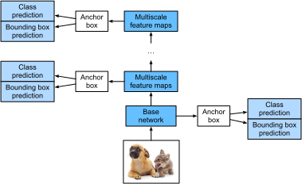

# Single Shot Multibox Detection
:label:`sec_ssd`

In :numref:`sec_bbox`--:numref:`sec_object-detection-dataset`,
we introduced bounding boxes, anchor boxes,
multiscale object detection, and the dataset for object detection.
Now we are ready to use such background
knowledge to design an object detection model:
single shot multibox detection
(SSD) :cite:`Liu.Anguelov.Erhan.ea.2016`.
This model is simple, fast, and widely used.
Although this is just one of vast amounts of
object detection models,
some of the design principles
and implementation details in this section
are also applicable to other models.


## Model

:numref:`fig_ssd` provides an overview of
the design of single-shot multibox detection.
This model mainly consists of
a base network
followed by
several multiscale feature map blocks.
The base network
is for extracting features from the input image,
so it can use a deep CNN.
For example,
the original single-shot multibox detection paper
adopts a VGG network truncated before the
classification layer :cite:`Liu.Anguelov.Erhan.ea.2016`,
while ResNet has also been commonly used.
Through our design
we can make the base network output
larger feature maps
so as to generate more anchor boxes
for detecting smaller objects.
Subsequently,
each multiscale feature map block
reduces (e.g., by half)
the height and width of the feature maps
from the previous block,
and enables each unit
of the feature maps
to increase its receptive field on the input image.


Recall the design
of multiscale object detection
through layerwise representations of images by
deep neural networks
in :numref:`sec_multiscale-object-detection`.
Since
multiscale feature maps closer to the top of :numref:`fig_ssd`
are smaller but have larger receptive fields,
they are suitable for detecting
fewer but larger objects.

In a nutshell,
via its base network and several multiscale feature map blocks,
single-shot multibox detection
generates a varying number of anchor boxes with different sizes,
and detects varying-size objects
by predicting classes and offsets
of these anchor boxes (thus the bounding boxes);
this is therefore a multiscale object detection model.



:label:`fig_ssd`


In the following,
we will describe the implementation details
of different blocks in :numref:`fig_ssd`. To begin with, we discuss how to implement
the class and bounding box prediction.


### Class Prediction Layer

Let the number of object classes be $q$.
Then anchor boxes have $q+1$ classes,
where class 0 is background.
At some scale,
suppose that the height and width of feature maps
are $h$ and $w$, respectively.
When $a$ anchor boxes
are generated with
each spatial position of these feature maps as their center,
a total of $hwa$ anchor boxes need to be classified.
This often makes classification with fully connected layers infeasible due to likely
heavy parametrization costs.
Recall how we used channels of
convolutional layers
to predict classes in :numref:`sec_nin`.
Single-shot multibox detection uses the
same technique to reduce model complexity.

Specifically,
the class prediction layer uses a convolutional layer
without altering width or height of feature maps.
In this way,
there can be a one-to-one correspondence
between outputs and inputs
at the same spatial dimensions (width and height)
of feature maps.
More concretely,
channels of the output feature maps
at any spatial position ($x$, $y$)
represent class predictions
for all the anchor boxes centered on
($x$, $y$) of the input feature maps.
To produce valid predictions,
there must be $a(q+1)$ output channels,
where for the same spatial position
the output channel with index $i(q+1) + j$
represents the prediction of
the class $j$ ($0 \leq j \leq q$)
for the anchor box $i$ ($0 \leq i < a$).

Below we define such a class prediction layer,
specifying $a$ and $q$ via arguments `num_anchors` and `num_classes`, respectively.
This layer uses a $3\times3$ convolutional layer with a
padding of 1.
The width and height of the input and output of this
convolutional layer remain unchanged.

```{.python .input #ssd-class-prediction-layer}
#@tab mxnet
%matplotlib inline
from d2l import mxnet as d2l
from mxnet import autograd, gluon, image, init, np, npx
from mxnet.gluon import nn

npx.set_np()

def cls_predictor(num_anchors, num_classes):
    return nn.Conv2D(num_anchors * (num_classes + 1), kernel_size=3,
                     padding=1)
```

```{.python .input #ssd-class-prediction-layer}
#@tab pytorch
%matplotlib inline
from d2l import torch as d2l
import torch
import torchvision
from torch import nn
from torch.nn import functional as F

def cls_predictor(num_inputs, num_anchors, num_classes):
    return nn.Conv2d(num_inputs, num_anchors * (num_classes + 1),
                     kernel_size=3, padding=1)
```

```{.python .input #ssd-class-prediction-layer}
#@tab jax
%matplotlib inline
from d2l import jax as d2l
import jax
from jax import numpy as jnp
from flax import linen as nn
import optax
import numpy as np
from PIL import Image

def cls_predictor(num_anchors, num_classes):
    return nn.Conv(num_anchors * (num_classes + 1), kernel_size=(3, 3),
                   padding='SAME')
```

```{.python .input #ssd-class-prediction-layer}
#@tab tensorflow
%matplotlib inline
from d2l import tensorflow as d2l
import tensorflow as tf
from tensorflow import keras
import numpy as np

def cls_predictor(num_anchors, num_classes):
    return keras.layers.Conv2D(num_anchors * (num_classes + 1),
                               kernel_size=3, padding='same')
```

### Bounding Box Prediction Layer

The design of the bounding box prediction layer is similar to that of the class prediction layer.
The only difference lies in the number of outputs for each anchor box:
here we need to predict four offsets rather than $q+1$ classes.

```{.python .input #ssd-bounding-box-prediction-layer}
#@tab mxnet
def bbox_predictor(num_anchors):
    return nn.Conv2D(num_anchors * 4, kernel_size=3, padding=1)
```

```{.python .input #ssd-bounding-box-prediction-layer}
#@tab pytorch
def bbox_predictor(num_inputs, num_anchors):
    return nn.Conv2d(num_inputs, num_anchors * 4, kernel_size=3, padding=1)
```

```{.python .input #ssd-bounding-box-prediction-layer}
#@tab jax
def bbox_predictor(num_anchors):
    return nn.Conv(num_anchors * 4, kernel_size=(3, 3), padding='SAME')
```

```{.python .input #ssd-bounding-box-prediction-layer}
#@tab tensorflow
def bbox_predictor(num_anchors):
    return keras.layers.Conv2D(num_anchors * 4, kernel_size=3, padding='same')
```

### Concatenating Predictions for Multiple Scales

As we mentioned, single-shot multibox detection
uses multiscale feature maps to generate anchor boxes and predict their classes and offsets.
At different scales,
the shapes of feature maps
or the numbers of anchor boxes centered on the same unit
may vary.
Therefore,
shapes of the prediction outputs
at different scales may vary.

In the following example,
we construct feature maps at two different scales,
`Y1` and `Y2`,
for the same minibatch,
where the height and width of `Y2`
are half of those of `Y1`.
Let's take class prediction as an example.
Suppose that
5 and 3 anchor boxes
are generated for every unit in `Y1` and `Y2`, respectively.
Suppose further that
the number of object classes is 10.
For feature maps `Y1` and `Y2`
the numbers of channels in the class prediction outputs
are $5\times(10+1)=55$ and $3\times(10+1)=33$, respectively,
where either output shape is
(batch size, number of channels, height, width).

```{.python .input #ssd-concatenating-predictions-for-multiple-scales-1}
#@tab mxnet
def forward(x, block):
    block.initialize()
    return block(x)

Y1 = forward(np.zeros((2, 8, 20, 20)), cls_predictor(5, 10))
Y2 = forward(np.zeros((2, 16, 10, 10)), cls_predictor(3, 10))
Y1.shape, Y2.shape
```

```{.python .input #ssd-concatenating-predictions-for-multiple-scales-1}
#@tab pytorch
def forward(x, block):
    return block(x)

Y1 = forward(torch.zeros((2, 8, 20, 20)), cls_predictor(8, 5, 10))
Y2 = forward(torch.zeros((2, 16, 10, 10)), cls_predictor(16, 3, 10))
Y1.shape, Y2.shape
```

```{.python .input #ssd-concatenating-predictions-for-multiple-scales-1}
#@tab jax
def forward(x, block):
    # Flax uses NHWC format; input shape: (N, H, W, C)
    return block.init_with_output(jax.random.PRNGKey(0), x)[0]

Y1 = forward(jnp.zeros((2, 20, 20, 8)), cls_predictor(5, 10))
Y2 = forward(jnp.zeros((2, 10, 10, 16)), cls_predictor(3, 10))
Y1.shape, Y2.shape
```

```{.python .input #ssd-concatenating-predictions-for-multiple-scales-1}
#@tab tensorflow
def forward(x, block):
    # Keras uses NHWC format; input shape: (N, H, W, C)
    return block(x)

Y1 = forward(tf.zeros((2, 20, 20, 8)), cls_predictor(5, 10))
Y2 = forward(tf.zeros((2, 10, 10, 16)), cls_predictor(3, 10))
Y1.shape, Y2.shape
```

As we can see, except for the batch size dimension,
the other three dimensions all have different sizes.
To concatenate these two prediction outputs for more efficient computation,
we will transform these tensors into a more consistent format.

Note that
the channel dimension holds the predictions for
anchor boxes with the same center.
We first move this dimension to the innermost.
Since the batch size remains the same for different scales,
we can transform the prediction output
into a two-dimensional tensor
with shape (batch size, height $\times$ width $\times$ number of channels).
Then we can concatenate
such outputs at different scales
along dimension 1.

```{.python .input #ssd-concatenating-predictions-for-multiple-scales-2}
#@tab mxnet
def flatten_pred(pred):
    return npx.batch_flatten(pred.transpose(0, 2, 3, 1))

def concat_preds(preds):
    return np.concatenate([flatten_pred(p) for p in preds], axis=1)
```

```{.python .input #ssd-concatenating-predictions-for-multiple-scales-2}
#@tab pytorch
def flatten_pred(pred):
    return torch.flatten(pred.permute(0, 2, 3, 1), start_dim=1)

def concat_preds(preds):
    return torch.cat([flatten_pred(p) for p in preds], dim=1)
```

```{.python .input #ssd-concatenating-predictions-for-multiple-scales-2}
#@tab jax
def flatten_pred(pred):
    # Flax output is NHWC, flatten H*W*C
    return pred.reshape(pred.shape[0], -1)

def concat_preds(preds):
    return jnp.concatenate([flatten_pred(p) for p in preds], axis=1)
```

```{.python .input #ssd-concatenating-predictions-for-multiple-scales-2}
#@tab tensorflow
def flatten_pred(pred):
    # pred is (N, H, W, C); flatten H*W*C with channel innermost so that
    # the resulting layout matches multibox_prior's anchor ordering
    return tf.reshape(pred, (tf.shape(pred)[0], -1))

def concat_preds(preds):
    return tf.concat([flatten_pred(p) for p in preds], axis=1)
```

In this way,
even though `Y1` and `Y2` have different sizes
in channels, heights, and widths,
we can still concatenate these two prediction outputs at two different scales for the same minibatch.

```{.python .input #ssd-concatenating-predictions-for-multiple-scales-3}
concat_preds([Y1, Y2]).shape
```

### Downsampling Block

In order to detect objects at multiple scales,
we define the following downsampling block `down_sample_blk` that
halves the height and width of input feature maps.
In fact,
this block applies the design of VGG blocks
in :numref:`subsec_vgg-blocks`.
More concretely,
each downsampling block consists of
two $3\times3$ convolutional layers with padding of 1
followed by a $2\times2$ max-pooling layer with stride of 2.
As we know, $3\times3$ convolutional layers with padding of 1 do not change the shape of feature maps.
However, the subsequent $2\times2$ max-pooling  reduces the height and width of input feature maps by half.
For both input and output feature maps of this downsampling block,
because $1\times 2+(3-1)+(3-1)=6$,
each unit in the output
has a $6\times6$ receptive field on the input.
Therefore, the downsampling block enlarges the receptive field of each unit in its output feature maps.

```{.python .input #ssd-downsampling-block-1}
#@tab mxnet
def down_sample_blk(num_channels):
    blk = nn.Sequential()
    for _ in range(2):
        blk.add(nn.Conv2D(num_channels, kernel_size=3, padding=1),
                nn.BatchNorm(in_channels=num_channels),
                nn.Activation('relu'))
    blk.add(nn.MaxPool2D(2))
    return blk
```

```{.python .input #ssd-downsampling-block-1}
#@tab pytorch
def down_sample_blk(in_channels, out_channels):
    blk = []
    for _ in range(2):
        blk.append(nn.Conv2d(in_channels, out_channels,
                             kernel_size=3, padding=1))
        blk.append(nn.BatchNorm2d(out_channels))
        blk.append(nn.ReLU())
        in_channels = out_channels
    blk.append(nn.MaxPool2d(2))
    return nn.Sequential(*blk)
```

```{.python .input #ssd-downsampling-block-1}
#@tab jax
class DownSampleBlk(nn.Module):
    num_channels: int

    @nn.compact
    def __call__(self, x, training=False):
        for _ in range(2):
            x = nn.Conv(self.num_channels, kernel_size=(3, 3),
                        padding='SAME')(x)
            x = nn.BatchNorm(use_running_average=not training)(x)
            x = nn.relu(x)
        x = nn.max_pool(x, window_shape=(2, 2), strides=(2, 2))
        return x
```

```{.python .input #ssd-downsampling-block-1}
#@tab tensorflow
def down_sample_blk(num_channels):
    blk = keras.Sequential()
    for _ in range(2):
        blk.add(keras.layers.Conv2D(num_channels, kernel_size=3,
                                    padding='same'))
        blk.add(keras.layers.BatchNormalization())
        blk.add(keras.layers.ReLU())
    blk.add(keras.layers.MaxPool2D(pool_size=2, strides=2))
    return blk
```

In the following example, our constructed downsampling block changes the number of input channels and halves the height and width of the input feature maps.

```{.python .input #ssd-downsampling-block-2}
#@tab mxnet
forward(np.zeros((2, 3, 20, 20)), down_sample_blk(10)).shape
```

```{.python .input #ssd-downsampling-block-2}
#@tab pytorch
forward(torch.zeros((2, 3, 20, 20)), down_sample_blk(3, 10)).shape
```

```{.python .input #ssd-downsampling-block-2}
#@tab jax
forward(jnp.zeros((2, 20, 20, 3)), DownSampleBlk(num_channels=10)).shape
```

```{.python .input #ssd-downsampling-block-2}
#@tab tensorflow
forward(tf.zeros((2, 20, 20, 3)), down_sample_blk(10)).shape
```

### Base Network Block

The base network block is used to extract features from input images.
For simplicity,
we construct a small base network
consisting of three downsampling blocks
that double the number of channels at each block.
Given a $256\times256$ input image,
this base network block outputs $32 \times 32$ feature maps ($256/2^3=32$).

```{.python .input #ssd-base-network-block}
#@tab mxnet
def base_net():
    blk = nn.Sequential()
    for num_filters in [16, 32, 64]:
        blk.add(down_sample_blk(num_filters))
    return blk

forward(np.zeros((2, 3, 256, 256)), base_net()).shape
```

```{.python .input #ssd-base-network-block}
#@tab pytorch
def base_net():
    blk = []
    num_filters = [3, 16, 32, 64]
    for i in range(len(num_filters) - 1):
        blk.append(down_sample_blk(num_filters[i], num_filters[i+1]))
    return nn.Sequential(*blk)

forward(torch.zeros((2, 3, 256, 256)), base_net()).shape
```

```{.python .input #ssd-base-network-block}
#@tab jax
class BaseNet(nn.Module):
    @nn.compact
    def __call__(self, x, training=False):
        for num_filters in [16, 32, 64]:
            x = DownSampleBlk(num_channels=num_filters)(x, training)
        return x

forward(jnp.zeros((2, 256, 256, 3)), BaseNet()).shape
```

```{.python .input #ssd-base-network-block}
#@tab tensorflow
def base_net():
    blk = keras.Sequential()
    for num_filters in [16, 32, 64]:
        blk.add(down_sample_blk(num_filters))
    return blk

forward(tf.zeros((2, 256, 256, 3)), base_net()).shape
```

### The Complete Model


The complete
single shot multibox detection model
consists of five blocks.
The feature maps produced by each block
are used for both
(i) generating anchor boxes
and (ii) predicting classes and offsets of these anchor boxes.
Among these five blocks,
the first one
is the base network block,
the second to the fourth are
downsampling blocks,
and the last block
uses global max-pooling
to reduce both the height and width to 1.
Technically,
the second to the fifth blocks
are all
those
multiscale feature map blocks
in :numref:`fig_ssd`.

```{.python .input #ssd-the-complete-model-1}
#@tab mxnet
def get_blk(i):
    if i == 0:
        blk = base_net()
    elif i == 4:
        blk = nn.GlobalMaxPool2D()
    else:
        blk = down_sample_blk(128)
    return blk
```

```{.python .input #ssd-the-complete-model-1}
#@tab pytorch
def get_blk(i):
    if i == 0:
        blk = base_net()
    elif i == 1:
        blk = down_sample_blk(64, 128)
    elif i == 4:
        blk = nn.AdaptiveMaxPool2d((1,1))
    else:
        blk = down_sample_blk(128, 128)
    return blk
```

```{.python .input #ssd-the-complete-model-1}
#@tab jax
def get_blk(i):
    if i == 0:
        return BaseNet()
    elif i == 4:
        return None  # Global max pooling handled in TinySSD
    else:
        return DownSampleBlk(num_channels=128)
```

```{.python .input #ssd-the-complete-model-1}
#@tab tensorflow
def get_blk(i):
    if i == 0:
        return base_net()
    elif i == 4:
        return keras.layers.GlobalMaxPool2D(keepdims=True)
    else:
        return down_sample_blk(128)
```

Now we define the forward propagation
for each block.
Different from
in image classification tasks,
outputs here include
(i) CNN feature maps `Y`,
(ii) anchor boxes generated using `Y` at the current scale,
and (iii) classes and offsets predicted (based on `Y`)
for these anchor boxes.

```{.python .input #ssd-the-complete-model-2}
#@tab mxnet
def blk_forward(X, blk, size, ratio, cls_predictor, bbox_predictor):
    Y = blk(X)
    anchors = d2l.multibox_prior(Y, sizes=size, ratios=ratio)
    cls_preds = cls_predictor(Y)
    bbox_preds = bbox_predictor(Y)
    return (Y, anchors, cls_preds, bbox_preds)
```

```{.python .input #ssd-the-complete-model-2}
#@tab pytorch
def blk_forward(X, blk, size, ratio, cls_predictor, bbox_predictor):
    Y = blk(X)
    anchors = d2l.multibox_prior(Y, sizes=size, ratios=ratio)
    cls_preds = cls_predictor(Y)
    bbox_preds = bbox_predictor(Y)
    return (Y, anchors, cls_preds, bbox_preds)
```

```{.python .input #ssd-the-complete-model-2}
#@tab jax
def blk_forward(X, blk_params, blk_apply, size, ratio, cls_params,
                cls_apply, bbox_params, bbox_apply, training=False,
                batch_stats=None):
    if blk_apply is not None:
        if batch_stats is not None:
            Y, updates = blk_apply({'params': blk_params,
                                    'batch_stats': batch_stats},
                                   X, training=training,
                                   mutable=['batch_stats'])
        else:
            Y = blk_apply({'params': blk_params}, X, training=training)
            updates = {}
    else:
        # Global max pooling
        Y = X.max(axis=(1, 2), keepdims=True)
        updates = {}
    # Convert NHWC to NCHW for multibox_prior
    Y_nchw = jnp.transpose(Y, (0, 3, 1, 2))
    anchors = d2l.multibox_prior(Y_nchw, sizes=size, ratios=ratio)
    cls_preds = cls_apply({'params': cls_params}, Y)
    bbox_preds = bbox_apply({'params': bbox_params}, Y)
    # Convert NHWC predictions to NCHW format
    cls_preds = jnp.transpose(cls_preds, (0, 3, 1, 2))
    bbox_preds = jnp.transpose(bbox_preds, (0, 3, 1, 2))
    return (Y, anchors, cls_preds, bbox_preds, updates)
```

```{.python .input #ssd-the-complete-model-2}
#@tab tensorflow
def blk_forward(X, blk, size, ratio, cls_predictor, bbox_predictor,
                training=False):
    Y = blk(X, training=training)
    # Keras uses NHWC; multibox_prior expects NCHW (shape[-2:] = H, W)
    Y_nchw = tf.transpose(Y, (0, 3, 1, 2))
    anchors = d2l.multibox_prior(Y_nchw, sizes=size, ratios=ratio)
    # Keep cls_preds and bbox_preds in NHWC; flatten_pred relies on the
    # channel-last memory layout to align with multibox_prior's anchor order
    cls_preds = cls_predictor(Y, training=training)
    bbox_preds = bbox_predictor(Y, training=training)
    return (Y, anchors, cls_preds, bbox_preds)
```

Recall that
in :numref:`fig_ssd`
a multiscale feature map block
that is closer to the top
is for detecting larger objects;
thus, it needs to generate larger anchor boxes.
In the above forward propagation,
at each multiscale feature map block
we pass in a list of two scale values
via the `sizes` argument
of the invoked `multibox_prior` function (described in :numref:`sec_anchor`).
In the following,
the interval between 0.2 and 1.05
is split evenly
into five sections to determine the
smaller scale values at the five blocks: 0.2, 0.37, 0.54, 0.71, and 0.88.
Then their larger scale values
are given by
$\sqrt{0.2 \times 0.37} = 0.272$, $\sqrt{0.37 \times 0.54} = 0.447$, and so on.


```{.python .input #ssd-the-complete-model-3}
sizes = [[0.2, 0.272], [0.37, 0.447], [0.54, 0.619], [0.71, 0.79],
         [0.88, 0.961]]
ratios = [[1, 2, 0.5]] * 5
num_anchors = len(sizes[0]) + len(ratios[0]) - 1
```

Now we can define the complete model `TinySSD` as follows.

```{.python .input #ssd-the-complete-model-4}
#@tab mxnet
class TinySSD(nn.Block):
    def __init__(self, num_classes, **kwargs):
        super(TinySSD, self).__init__kwargs)
        self.num_classes = num_classes
        for i in range(5):
            # Equivalent to the assignment statement `self.blk_i = get_blk(i)`
            setattr(self, f'blk_{i}', get_blk(i))
            setattr(self, f'cls_{i}', cls_predictor(num_anchors, num_classes))
            setattr(self, f'bbox_{i}', bbox_predictor(num_anchors))

    def forward(self, X):
        anchors, cls_preds, bbox_preds = [None] * 5, [None] * 5, [None] * 5
        for i in range(5):
            # Here `getattr(self, 'blk_%d' % i)` accesses `self.blk_i`
            X, anchors[i], cls_preds[i], bbox_preds[i] = blk_forward(
                X, getattr(self, f'blk_{i}'), sizes[i], ratios[i],
                getattr(self, f'cls_{i}'), getattr(self, f'bbox_{i}'))
        anchors = np.concatenate(anchors, axis=1)
        cls_preds = concat_preds(cls_preds)
        cls_preds = cls_preds.reshape(
            cls_preds.shape[0], -1, self.num_classes + 1)
        bbox_preds = concat_preds(bbox_preds)
        return anchors, cls_preds, bbox_preds
```

```{.python .input #ssd-the-complete-model-4}
#@tab pytorch
class TinySSD(nn.Module):
    def __init__(self, num_classes, **kwargs):
        super(TinySSD, self).__init__(**kwargs)
        self.num_classes = num_classes
        idx_to_in_channels = [64, 128, 128, 128, 128]
        for i in range(5):
            # Equivalent to the assignment statement `self.blk_i = get_blk(i)`
            setattr(self, f'blk_{i}', get_blk(i))
            setattr(self, f'cls_{i}', cls_predictor(idx_to_in_channels[i],
                                                    num_anchors, num_classes))
            setattr(self, f'bbox_{i}', bbox_predictor(idx_to_in_channels[i],
                                                      num_anchors))

    def forward(self, X):
        anchors, cls_preds, bbox_preds = [None] * 5, [None] * 5, [None] * 5
        for i in range(5):
            # Here `getattr(self, 'blk_%d' % i)` accesses `self.blk_i`
            X, anchors[i], cls_preds[i], bbox_preds[i] = blk_forward(
                X, getattr(self, f'blk_{i}'), sizes[i], ratios[i],
                getattr(self, f'cls_{i}'), getattr(self, f'bbox_{i}'))
        anchors = torch.cat(anchors, dim=1)
        cls_preds = concat_preds(cls_preds)
        cls_preds = cls_preds.reshape(
            cls_preds.shape[0], -1, self.num_classes + 1)
        bbox_preds = concat_preds(bbox_preds)
        return anchors, cls_preds, bbox_preds
```

```{.python .input #ssd-the-complete-model-4}
#@tab jax
class TinySSD(nn.Module):
    num_classes: int

    def setup(self):
        self.blks = [get_blk(i) for i in range(5)]
        self.cls_layers = [cls_predictor(num_anchors, self.num_classes)
                           for _ in range(5)]
        self.bbox_layers = [bbox_predictor(num_anchors) for _ in range(5)]

    def __call__(self, X, training=False):
        anchors, cls_preds, bbox_preds = [None] * 5, [None] * 5, [None] * 5
        # Convert NCHW input to NHWC for Flax
        X = jnp.transpose(X, (0, 2, 3, 1))
        for i in range(5):
            blk = self.blks[i]
            if blk is not None:
                X = blk(X, training=training)
            else:
                # Global max pooling
                X = X.max(axis=(1, 2), keepdims=True)
            # Convert NHWC to NCHW for multibox_prior
            X_nchw = jnp.transpose(X, (0, 3, 1, 2))
            anchors[i] = d2l.multibox_prior(X_nchw, sizes=sizes[i],
                                            ratios=ratios[i])
            cls_out = self.cls_layers[i](X)
            bbox_out = self.bbox_layers[i](X)
            # Convert NHWC outputs to NCHW for concat_preds
            cls_preds[i] = jnp.transpose(cls_out, (0, 3, 1, 2))
            bbox_preds[i] = jnp.transpose(bbox_out, (0, 3, 1, 2))
        anchors = jnp.concatenate(anchors, axis=1)
        cls_preds = concat_preds(cls_preds)
        cls_preds = cls_preds.reshape(
            cls_preds.shape[0], -1, self.num_classes + 1)
        bbox_preds = concat_preds(bbox_preds)
        return anchors, cls_preds, bbox_preds
```

```{.python .input #ssd-the-complete-model-4}
#@tab tensorflow
#@save
class TinySSD(keras.Model):
    def __init__(self, num_classes, **kwargs):
        super().__init__(**kwargs)
        self.num_classes = num_classes
        self.cls_loss = keras.losses.SparseCategoricalCrossentropy(
            from_logits=True)
        for i in range(5):
            # Equivalent to: self.blk_i, self.cls_i, self.bbox_i
            setattr(self, f'blk_{i}', get_blk(i))
            setattr(self, f'cls_{i}', cls_predictor(num_anchors, num_classes))
            setattr(self, f'bbox_{i}', bbox_predictor(num_anchors))

    def call(self, X, training=False):
        anchors_list = [None] * 5
        cls_preds_list = [None] * 5
        bbox_preds_list = [None] * 5
        # X is expected in NHWC layout (the Keras default)
        for i in range(5):
            blk = getattr(self, f'blk_{i}')
            cls_pred = getattr(self, f'cls_{i}')
            bbox_pred = getattr(self, f'bbox_{i}')
            X, anchors_list[i], cls_preds_list[i], bbox_preds_list[i] = \
                blk_forward(X, blk, sizes[i], ratios[i],
                            cls_pred, bbox_pred, training=training)
        anchors = tf.concat(anchors_list, axis=1)
        cls_preds = concat_preds(cls_preds_list)
        cls_preds = tf.reshape(cls_preds,
                               (tf.shape(cls_preds)[0], -1,
                                self.num_classes + 1))
        bbox_preds = concat_preds(bbox_preds_list)
        return anchors, cls_preds, bbox_preds

    def _compute_ssd_loss(self, cls_preds, cls_labels, bbox_preds,
                          bbox_labels, bbox_masks):
        num_classes = self.num_classes + 1
        cls = self.cls_loss(
            tf.reshape(cls_labels, [-1]),
            tf.reshape(cls_preds, [-1, num_classes]))
        bbox = tf.reduce_mean(
            tf.abs((bbox_preds * bbox_masks) -
                   (bbox_labels * bbox_masks)))
        return cls + bbox

    def train_step(self, data):
        features, target = data
        with tf.GradientTape() as tape:
            anchors, cls_preds, bbox_preds = self(features, training=True)
            bbox_labels, bbox_masks, cls_labels = d2l.multibox_target(
                anchors, target)
            loss = self._compute_ssd_loss(cls_preds, cls_labels,
                                          bbox_preds, bbox_labels, bbox_masks)
        grads = tape.gradient(loss, self.trainable_variables)
        self.optimizer.apply_gradients(zip(grads, self.trainable_variables))
        # Accumulate metrics without syncing large tensors to host
        cls_correct = tf.reduce_sum(
            tf.cast(tf.argmax(cls_preds, axis=-1) ==
                    tf.cast(cls_labels, tf.int64), tf.int64))
        cls_total = tf.cast(tf.size(cls_labels), tf.int64)
        bbox_abs = tf.reduce_sum(
            tf.abs((bbox_preds * bbox_masks) - (bbox_labels * bbox_masks)))
        bbox_total = tf.cast(tf.size(bbox_labels), tf.float32)
        return {'loss': loss,
                'cls_correct': cls_correct, 'cls_total': cls_total,
                'bbox_abs': bbox_abs, 'bbox_total': bbox_total}
```

We create a model instance
and use it to perform forward propagation
on a minibatch of $256 \times 256$ images `X`.

As shown earlier in this section,
the first block outputs $32 \times 32$ feature maps.
Recall that
the second to fourth downsampling blocks
halve the height and width
and the fifth block uses global pooling.
Since 4 anchor boxes
are generated for each unit along spatial dimensions
of feature maps,
at all the five scales
a total of $(32^2 + 16^2 + 8^2 + 4^2 + 1)\times 4 = 5444$ anchor boxes are generated for each image.

```{.python .input #ssd-the-complete-model-5}
#@tab mxnet
net = TinySSD(num_classes=1)
net.initialize()
X = np.zeros((32, 3, 256, 256))
anchors, cls_preds, bbox_preds = net(X)

print('output anchors:', anchors.shape)
print('output class preds:', cls_preds.shape)
print('output bbox preds:', bbox_preds.shape)
```

```{.python .input #ssd-the-complete-model-5}
#@tab pytorch
net = TinySSD(num_classes=1)
X = torch.zeros((32, 3, 256, 256))
anchors, cls_preds, bbox_preds = net(X)

print('output anchors:', anchors.shape)
print('output class preds:', cls_preds.shape)
print('output bbox preds:', bbox_preds.shape)
```

```{.python .input #ssd-the-complete-model-5}
#@tab jax
net = TinySSD(num_classes=1)
X = jnp.zeros((32, 3, 256, 256))
variables = net.init(jax.random.PRNGKey(0), X)
anchors, cls_preds, bbox_preds = net.apply(variables, X)

print('output anchors:', anchors.shape)
print('output class preds:', cls_preds.shape)
print('output bbox preds:', bbox_preds.shape)
```

```{.python .input #ssd-the-complete-model-5}
#@tab tensorflow
net = TinySSD(num_classes=1)
X = tf.zeros((32, 256, 256, 3))  # NHWC for Keras
anchors, cls_preds, bbox_preds = net(X)

print('output anchors:', anchors.shape)
print('output class preds:', cls_preds.shape)
print('output bbox preds:', bbox_preds.shape)
```

## Training

Now we will explain
how to train the single shot multibox detection model
for object detection.


### Reading the Dataset and Initializing the Model

To begin with,
let's read
the banana detection dataset
described in :numref:`sec_object-detection-dataset`.

```{.python .input #ssd-reading-the-dataset-and-initializing-the-model-1}
batch_size = 32
train_iter, _ = d2l.load_data_bananas(batch_size)
```

There is only one class in the banana detection dataset. After defining the model,
we need to (**initialize its parameters and define
the optimization algorithm.

```{.python .input #ssd-reading-the-dataset-and-initializing-the-model-2}
#@tab mxnet
device, net = d2l.try_gpu(), TinySSD(num_classes=1)
net.initialize(init=init.Xavier(), ctx=device)
trainer = gluon.Trainer(net.collect_params(), 'sgd',
                        {'learning_rate': 0.2, 'wd': 5e-4})
```

```{.python .input #ssd-reading-the-dataset-and-initializing-the-model-2}
#@tab pytorch
device, net = d2l.try_gpu(), TinySSD(num_classes=1)
trainer = torch.optim.SGD(net.parameters(), lr=0.2, weight_decay=5e-4)
```

```{.python .input #ssd-reading-the-dataset-and-initializing-the-model-2}
#@tab jax
net = TinySSD(num_classes=1)
dummy_X = jnp.zeros((32, 3, 256, 256))
variables = net.init(jax.random.PRNGKey(0), dummy_X, training=True)
params = variables['params']
batch_stats = variables.get('batch_stats', {})
trainer = optax.sgd(learning_rate=0.2)
opt_state = trainer.init(params)
```

```{.python .input #ssd-reading-the-dataset-and-initializing-the-model-2}
#@tab tensorflow
net = TinySSD(num_classes=1)
net.compile(optimizer=keras.optimizers.SGD(learning_rate=0.2,
                                           weight_decay=5e-4))
```

### Defining Loss and Evaluation Functions

Object detection has two types of losses.
The first loss concerns classes of anchor boxes:
its computation
can simply reuse
the cross-entropy loss function
that we used for image classification.
The second loss
concerns offsets of positive (non-background) anchor boxes:
this is a regression problem.
For this regression problem,
however,
here we do not use the squared loss
described in :numref:`subsec_normal_distribution_and_squared_loss`.
Instead,
we use the $\ell_1$ norm loss,
the absolute value of the difference between
the prediction and the ground-truth.
The mask variable `bbox_masks` filters out
negative anchor boxes and illegal (padded)
anchor boxes in the loss calculation.
In the end, we sum up
the anchor box class loss
and the anchor box offset loss
to obtain the loss function for the model.

```{.python .input #ssd-defining-loss-and-evaluation-functions-1}
#@tab mxnet
cls_loss = gluon.loss.SoftmaxCrossEntropyLoss()
bbox_loss = gluon.loss.L1Loss()

def calc_loss(cls_preds, cls_labels, bbox_preds, bbox_labels, bbox_masks):
    cls = cls_loss(cls_preds, cls_labels)
    bbox = bbox_loss(bbox_preds * bbox_masks, bbox_labels * bbox_masks)
    return cls + bbox
```

```{.python .input #ssd-defining-loss-and-evaluation-functions-1}
#@tab pytorch
cls_loss = nn.CrossEntropyLoss(reduction='none')
bbox_loss = nn.L1Loss(reduction='none')

def calc_loss(cls_preds, cls_labels, bbox_preds, bbox_labels, bbox_masks):
    batch_size, num_classes = cls_preds.shape[0], cls_preds.shape[2]
    cls = cls_loss(cls_preds.reshape(-1, num_classes),
                   cls_labels.reshape(-1)).reshape(batch_size, -1).mean(dim=1)
    bbox = bbox_loss(bbox_preds * bbox_masks,
                     bbox_labels * bbox_masks).mean(dim=1)
    return cls + bbox
```

```{.python .input #ssd-defining-loss-and-evaluation-functions-1}
#@tab jax
def calc_loss(cls_preds, cls_labels, bbox_preds, bbox_labels, bbox_masks):
    batch_size, num_classes = cls_preds.shape[0], cls_preds.shape[2]
    cls = optax.softmax_cross_entropy_with_integer_labels(
        cls_preds.reshape(-1, num_classes),
        cls_labels.reshape(-1)).reshape(batch_size, -1).mean(axis=1)
    bbox = jnp.abs(
        (bbox_preds * bbox_masks) -
        (bbox_labels * bbox_masks)).mean(axis=1)
    return cls + bbox
```

```{.python .input #ssd-defining-loss-and-evaluation-functions-1}
#@tab tensorflow
# Loss functions are encapsulated in TinySSD._compute_ssd_loss and
# train_step; these module-level helpers mirror the other frameworks for
# use in evaluation after training.
_cls_loss = keras.losses.SparseCategoricalCrossentropy(from_logits=True)

def calc_loss(cls_preds, cls_labels, bbox_preds, bbox_labels, bbox_masks):
    batch_size = cls_preds.shape[0]
    num_classes = cls_preds.shape[2]
    cls = _cls_loss(tf.reshape(cls_labels, [-1]),
                    tf.reshape(cls_preds, [-1, num_classes]))
    bbox = tf.reduce_mean(
        tf.abs((bbox_preds * bbox_masks) - (bbox_labels * bbox_masks)))
    return cls + bbox
```

We can use accuracy to evaluate the classification results.
Due to the used $\ell_1$ norm loss for the offsets,
we use the *mean absolute error* to evaluate the
predicted bounding boxes.
These prediction results are obtained
from the generated anchor boxes and the
predicted offsets for them.

```{.python .input #ssd-defining-loss-and-evaluation-functions-2}
#@tab mxnet
def cls_eval(cls_preds, cls_labels):
    # Because the class prediction results are on the final dimension,
    # `argmax` needs to specify this dimension
    return float((cls_preds.argmax(axis=-1).astype(
        cls_labels.dtype) == cls_labels).sum())

def bbox_eval(bbox_preds, bbox_labels, bbox_masks):
    return float((np.abs((bbox_labels - bbox_preds) * bbox_masks)).sum())
```

```{.python .input #ssd-defining-loss-and-evaluation-functions-2}
#@tab pytorch
def cls_eval(cls_preds, cls_labels):
    # Because the class prediction results are on the final dimension,
    # `argmax` needs to specify this dimension
    return float((cls_preds.argmax(dim=-1).type(
        cls_labels.dtype) == cls_labels).sum())

def bbox_eval(bbox_preds, bbox_labels, bbox_masks):
    return float((torch.abs((bbox_labels - bbox_preds) * bbox_masks)).sum())
```

```{.python .input #ssd-defining-loss-and-evaluation-functions-2}
#@tab jax
def cls_eval(cls_preds, cls_labels):
    # Because the class prediction results are on the final dimension,
    # `argmax` needs to specify this dimension
    return float((cls_preds.argmax(axis=-1).astype(
        cls_labels.dtype) == cls_labels).sum())

def bbox_eval(bbox_preds, bbox_labels, bbox_masks):
    return float((jnp.abs((bbox_labels - bbox_preds) * bbox_masks)).sum())
```

```{.python .input #ssd-defining-loss-and-evaluation-functions-2}
#@tab tensorflow
def cls_eval(cls_preds, cls_labels):
    # Because the class prediction results are on the final dimension,
    # `argmax` needs to specify this dimension
    return float(tf.reduce_sum(
        tf.cast(tf.argmax(cls_preds, axis=-1) ==
                tf.cast(cls_labels, tf.int64), tf.int64)))

def bbox_eval(bbox_preds, bbox_labels, bbox_masks):
    return float(tf.reduce_sum(
        tf.abs((bbox_labels - bbox_preds) * bbox_masks)))
```

### Training the Model

When training the model,
we need to generate multiscale anchor boxes (`anchors`)
and predict their classes (`cls_preds`) and offsets (`bbox_preds`) in the forward propagation.
Then we label the classes (`cls_labels`) and offsets (`bbox_labels`) of such generated anchor boxes
based on the label information `Y`.
Finally, we calculate the loss function
using the predicted and labeled values
of the classes and offsets.
For concise implementations,
evaluation of the test dataset is omitted here.

```{.python .input #ssd-training-the-model}
#@tab mxnet
num_epochs, timer = 20, d2l.Timer()
animator = d2l.Animator(xlabel='epoch', xlim=[1, num_epochs],
                        legend=['class error', 'bbox mae'])
for epoch in range(num_epochs):
    # Sum of training accuracy, no. of examples in sum of training accuracy,
    # Sum of absolute error, no. of examples in sum of absolute error
    metric = d2l.Accumulator(4)
    for features, target in train_iter:
        timer.start()
        X = features.as_in_ctx(device)
        Y = target.as_in_ctx(device)
        with autograd.record():
            # Generate multiscale anchor boxes and predict their classes and
            # offsets
            anchors, cls_preds, bbox_preds = net(X)
            # Label the classes and offsets of these anchor boxes
            bbox_labels, bbox_masks, cls_labels = d2l.multibox_target(anchors,
                                                                      Y)
            # Calculate the loss function using the predicted and labeled
            # values of the classes and offsets
            l = calc_loss(cls_preds, cls_labels, bbox_preds, bbox_labels,
                          bbox_masks)
        l.backward()
        trainer.step(batch_size)
        metric.add(cls_eval(cls_preds, cls_labels), cls_labels.size,
                   bbox_eval(bbox_preds, bbox_labels, bbox_masks),
                   bbox_labels.size)
    cls_err, bbox_mae = 1 - metric[0] / metric[1], metric[2] / metric[3]
    animator.add(epoch + 1, (cls_err, bbox_mae))
print(f'class err {cls_err:.2e}, bbox mae {bbox_mae:.2e}')
print(f'{len(train_iter._dataset) / timer.stop():.1f} examples/sec on '
      f'{str(device)}')
```

```{.python .input #ssd-training-the-model}
#@tab pytorch
num_epochs, timer = 20, d2l.Timer()
animator = d2l.Animator(xlabel='epoch', xlim=[1, num_epochs],
                        legend=['class error', 'bbox mae'])
net = net.to(device)
for epoch in range(num_epochs):
    # Sum of training accuracy, no. of examples in sum of training accuracy,
    # Sum of absolute error, no. of examples in sum of absolute error
    metric = d2l.Accumulator(4)
    net.train()
    for features, target in train_iter:
        timer.start()
        trainer.zero_grad()
        X, Y = features.to(device), target.to(device)
        # Generate multiscale anchor boxes and predict their classes and
        # offsets
        anchors, cls_preds, bbox_preds = net(X)
        # Label the classes and offsets of these anchor boxes
        bbox_labels, bbox_masks, cls_labels = d2l.multibox_target(anchors, Y)
        # Calculate the loss function using the predicted and labeled values
        # of the classes and offsets
        l = calc_loss(cls_preds, cls_labels, bbox_preds, bbox_labels,
                      bbox_masks)
        l.mean().backward()
        trainer.step()
        metric.add(cls_eval(cls_preds, cls_labels), cls_labels.numel(),
                   bbox_eval(bbox_preds, bbox_labels, bbox_masks),
                   bbox_labels.numel())
    cls_err, bbox_mae = 1 - metric[0] / metric[1], metric[2] / metric[3]
    animator.add(epoch + 1, (cls_err, bbox_mae))
print(f'class err {cls_err:.2e}, bbox mae {bbox_mae:.2e}')
print(f'{len(train_iter.dataset) / timer.stop():.1f} examples/sec on '
      f'{str(device)}')
```

```{.python .input #ssd-training-the-model}
#@tab jax
@jax.jit
def train_step(params, batch_stats, opt_state, X, Y):
    def loss_fn(params):
        variables = {'params': params, 'batch_stats': batch_stats}
        (anchors, cls_preds, bbox_preds), updates = net.apply(
            variables, X, training=True, mutable=['batch_stats'])
        bbox_labels, bbox_masks, cls_labels = d2l.multibox_target(anchors, Y)
        l = calc_loss(cls_preds, cls_labels, bbox_preds, bbox_labels,
                      bbox_masks)
        return l.mean(), (updates, cls_preds, bbox_preds,
                          bbox_labels, bbox_masks, cls_labels)

    (loss, aux), grads = jax.value_and_grad(
        loss_fn, has_aux=True)(params)
    updates_dict, cls_preds, bbox_preds, bbox_labels, bbox_masks, \
        cls_labels = aux
    new_batch_stats = updates_dict['batch_stats']
    param_updates, opt_state = trainer.update(grads, opt_state, params)
    params = optax.apply_updates(params, param_updates)
    # Compute scalar metrics inside the jit so we don't ship large tensors
    # back to the host every step.
    cls_correct = (cls_preds.argmax(axis=-1).astype(cls_labels.dtype)
                   == cls_labels).sum()
    cls_count = jnp.array(cls_labels.size, dtype=cls_correct.dtype)
    bbox_abs_sum = jnp.abs((bbox_labels - bbox_preds) * bbox_masks).sum()
    bbox_count = jnp.array(bbox_labels.size, dtype=bbox_abs_sum.dtype)
    return (params, new_batch_stats, opt_state, loss,
            cls_correct, cls_count, bbox_abs_sum, bbox_count)

num_epochs, timer = 20, d2l.Timer()
animator = d2l.Animator(xlabel='epoch', xlim=[1, num_epochs],
                        legend=['class error', 'bbox mae'])
for epoch in range(num_epochs):
    # Sum of training accuracy, no. of examples in sum of training accuracy,
    # Sum of absolute error, no. of examples in sum of absolute error
    cls_correct_sum = 0.0
    cls_total = 0.0
    bbox_abs_total = 0.0
    bbox_total = 0.0
    for features, target in train_iter:
        timer.start()
        X, Y = jnp.asarray(features), jnp.asarray(target)
        (params, batch_stats, opt_state, loss,
         cls_correct, cls_count, bbox_abs_sum, bbox_count) = train_step(
            params, batch_stats, opt_state, X, Y)
        cls_correct_sum += cls_correct
        cls_total += cls_count
        bbox_abs_total += bbox_abs_sum
        bbox_total += bbox_count
    cls_err = float(1 - cls_correct_sum / cls_total)
    bbox_mae = float(bbox_abs_total / bbox_total)
    animator.add(epoch + 1, (cls_err, bbox_mae))
print(f'class err {cls_err:.2e}, bbox mae {bbox_mae:.2e}')
print(f'{len(train_iter) * batch_size / timer.stop():.1f} examples/sec on '
      f'{str(jax.devices()[0])}')
```

```{.python .input #ssd-training-the-model}
#@tab tensorflow
num_epochs, timer = 20, d2l.Timer()
animator = d2l.Animator(xlabel='epoch', xlim=[1, num_epochs],
                        legend=['class error', 'bbox mae'])
# Anchors depend only on the input *shape*, so for a fixed input size
# they're constant across the epoch. Grab them once here and reuse
# them in every batch's multibox_target call — saves one forward pass
# per step.
sample_features, _ = next(iter(train_iter))
sample_features = tf.cast(sample_features, tf.float32)
anchors_static, _, _ = net(sample_features, training=False)
# `multibox_target` mixes TF ops with NumPy / `.numpy()` calls, which
# can't run inside `@tf.function`. We keep it eager and only put the
# pure-TF gradient step under @tf.function. The wrapper closes over
# `net` so its trainable variables aren't @tf.function arguments
# (which would re-trace each call) — same pattern that worked for
# gan / dcgan.
@tf.function(reduce_retracing=True)
def _grad_step(features, bbox_labels, bbox_masks, cls_labels):
    with tf.GradientTape() as tape:
        _, cls_preds, bbox_preds = net(features, training=True)
        loss = net._compute_ssd_loss(cls_preds, cls_labels, bbox_preds,
                                     bbox_labels, bbox_masks)
    grads = tape.gradient(loss, net.trainable_variables)
    net.optimizer.apply_gradients(zip(grads, net.trainable_variables))
    cls_correct = tf.reduce_sum(
        tf.cast(tf.argmax(cls_preds, axis=-1) ==
                tf.cast(cls_labels, tf.int64), tf.int64))
    cls_total = tf.cast(tf.size(cls_labels), tf.int64)
    bbox_abs = tf.reduce_sum(
        tf.abs((bbox_preds * bbox_masks) - (bbox_labels * bbox_masks)))
    bbox_total = tf.cast(tf.size(bbox_labels), tf.float32)
    return loss, cls_correct, cls_total, bbox_abs, bbox_total
for epoch in range(num_epochs):
    # Accumulate metrics as TF tensors so the inner loop never forces
    # a host sync (the per-batch `int(logs['cls_correct'])` was a
    # significant bottleneck before).
    cls_correct_sum = tf.zeros((), dtype=tf.int64)
    cls_total = tf.zeros((), dtype=tf.int64)
    bbox_abs_total = tf.zeros((), dtype=tf.float32)
    bbox_total = tf.zeros((), dtype=tf.float32)
    for features, target in train_iter:
        timer.start()
        features = tf.cast(features, tf.float32)
        target = tf.cast(target, tf.float32)
        bbox_labels, bbox_masks, cls_labels = d2l.multibox_target(
            anchors_static, target)
        _, cc, ct, ba, bt = _grad_step(features, bbox_labels,
                                       bbox_masks, cls_labels)
        cls_correct_sum += cc
        cls_total += ct
        bbox_abs_total += ba
        bbox_total += bt
    cls_err = float(1 - cls_correct_sum / cls_total)
    bbox_mae = float(bbox_abs_total / bbox_total)
    animator.add(epoch + 1, (cls_err, bbox_mae))
print(f'class err {cls_err:.2e}, bbox mae {bbox_mae:.2e}')
print(f'{len(train_iter) * batch_size / timer.stop():.1f} examples/sec')
```

## Prediction

During prediction,
the goal is to detect all the objects of interest
on the image.
Below
we read and resize a test image,
converting it to
a four-dimensional tensor that is
required by convolutional layers.

```{.python .input #ssd-prediction-1}
#@tab mxnet
img = image.imread('../img/banana.jpg')
feature = image.imresize(img, 256, 256).astype('float32')
X = np.expand_dims(feature.transpose(2, 0, 1), axis=0)
```

```{.python .input #ssd-prediction-1}
#@tab pytorch
X = torchvision.io.read_image('../img/banana.jpg').unsqueeze(0).float()
img = X.squeeze(0).permute(1, 2, 0).long()
```

```{.python .input #ssd-prediction-1}
#@tab jax
from PIL import Image as PILImage
img_pil = PILImage.open('../img/banana.jpg')
img = jnp.array(img_pil)
X = jnp.transpose(img, (2, 0, 1)).astype(jnp.float32)
X = jnp.expand_dims(X, axis=0)
```

```{.python .input #ssd-prediction-1}
#@tab tensorflow
from PIL import Image as PILImage
img_pil = PILImage.open('../img/banana.jpg')
img = np.array(img_pil)
# img is (H, W, C); add batch dim for NHWC input
X = tf.expand_dims(tf.cast(img, tf.float32), axis=0)
```

Using the `multibox_detection` function below,
the predicted bounding boxes
are obtained
from the anchor boxes and their predicted offsets.
Then non-maximum suppression is used
to remove similar predicted bounding boxes.

```{.python .input #ssd-prediction-2}
#@tab mxnet
def predict(X):
    anchors, cls_preds, bbox_preds = net(X.as_in_ctx(device))
    cls_probs = npx.softmax(cls_preds).transpose(0, 2, 1)
    output = d2l.multibox_detection(cls_probs, bbox_preds, anchors)
    idx = [i for i, row in enumerate(output[0]) if row[0] != -1]
    return output[0, idx]

output = predict(X)
```

```{.python .input #ssd-prediction-2}
#@tab pytorch
def predict(X):
    net.eval()
    anchors, cls_preds, bbox_preds = net(X.to(device))
    cls_probs = F.softmax(cls_preds, dim=2).permute(0, 2, 1)
    output = d2l.multibox_detection(cls_probs, bbox_preds, anchors)
    idx = [i for i, row in enumerate(output[0]) if row[0] != -1]
    return output[0, idx]

output = predict(X)
```

```{.python .input #ssd-prediction-2}
#@tab jax
def predict(X):
    variables = {'params': params, 'batch_stats': batch_stats}
    anchors, cls_preds, bbox_preds = net.apply(variables, X, training=False)
    cls_probs = jax.nn.softmax(cls_preds, axis=2).transpose(0, 2, 1)
    output = d2l.multibox_detection(cls_probs, bbox_preds, anchors)
    idx = [i for i, row in enumerate(output[0]) if row[0] != -1]
    return output[0, idx]

output = predict(X)
```

```{.python .input #ssd-prediction-2}
#@tab tensorflow
def predict(X):
    anchors, cls_preds, bbox_preds = net(X, training=False)
    # cls_preds: (batch, num_anchors, num_classes+1) -> softmax -> transpose
    # to (batch, num_classes+1, num_anchors) for multibox_detection
    cls_probs = tf.transpose(tf.nn.softmax(cls_preds, axis=-1), (0, 2, 1))
    output = d2l.multibox_detection(cls_probs, bbox_preds, anchors)
    # Drop padding rows (class index -1).
    mask = output[0, :, 0] != -1
    idx = tf.where(mask)[:, 0]
    return tf.gather(output[0], idx)

output = predict(X)
```

Finally, we display
all the predicted bounding boxes with
confidence 0.9 or above
as output.

```{.python .input #ssd-prediction-3}
#@tab mxnet
def display(img, output, threshold):
    d2l.set_figsize((5, 5))
    fig = d2l.plt.imshow(img.asnumpy())
    for row in output:
        score = float(row[1])
        if score < threshold:
            continue
        h, w = img.shape[:2]
        bbox = [row[2:6] * np.array((w, h, w, h), ctx=row.ctx)]
        d2l.show_bboxes(fig.axes, bbox, '%.2f' % score, 'w')

display(img, output, threshold=0.9)
```

```{.python .input #ssd-prediction-3}
#@tab pytorch
def display(img, output, threshold):
    d2l.set_figsize((5, 5))
    fig = d2l.plt.imshow(img)
    for row in output:
        score = float(row[1])
        if score < threshold:
            continue
        h, w = img.shape[:2]
        bbox = [row[2:6] * torch.tensor((w, h, w, h), device=row.device)]
        d2l.show_bboxes(fig.axes, bbox, '%.2f' % score, 'w')

display(img, output.cpu(), threshold=0.9)
```

```{.python .input #ssd-prediction-3}
#@tab jax
def display(img, output, threshold):
    d2l.set_figsize((5, 5))
    fig = d2l.plt.imshow(img)
    for row in output:
        score = float(row[1])
        if score < threshold:
            continue
        h, w = img.shape[:2]
        bbox = [row[2:6] * jnp.array((w, h, w, h))]
        d2l.show_bboxes(fig.axes, bbox, '%.2f' % score, 'w')

display(img, output, threshold=0.9)
```

```{.python .input #ssd-prediction-3}
#@tab tensorflow
def display(img, output, threshold):
    d2l.set_figsize((5, 5))
    fig = d2l.plt.imshow(img)
    for row in output:
        score = float(row[1])
        if score < threshold:
            continue
        h, w = img.shape[:2]
        bbox = [row[2:6] * np.array((w, h, w, h), dtype=np.float32)]
        d2l.show_bboxes(fig.axes, bbox, '%.2f' % score, 'w')

display(img, output, threshold=0.9)
```

## Summary

* Single shot multibox detection is a multiscale object detection model. Via its base network and several multiscale feature map blocks, single-shot multibox detection generates a varying number of anchor boxes with different sizes, and detects varying-size objects by predicting classes and offsets of these anchor boxes (thus the bounding boxes).
* When training the single-shot multibox detection model, the loss function is calculated based on the predicted and labeled values of the anchor box classes and offsets.


## Exercises

1. Can you improve the single-shot multibox detection by improving the loss function? For example, replace $\ell_1$ norm loss with smooth $\ell_1$ norm loss for the predicted offsets. This loss function uses a square function around zero for smoothness, which is controlled by the hyperparameter $\sigma$:

$$
f(x) =
    \begin{cases}
    (\sigma x)^2/2,& \textrm{if }|x| < 1/\sigma^2\\
    |x|-0.5/\sigma^2,& \textrm{otherwise}
    \end{cases}
$$

When $\sigma$ is very large, this loss is similar to the $\ell_1$ norm loss. When its value is smaller, the loss function is smoother.

```{.python .input #ssd-exercises-1}
#@tab mxnet
sigmas = [10, 1, 0.5]
lines = ['-', '--', '-.']
x = np.arange(-2, 2, 0.1)
d2l.set_figsize()

for l, s in zip(lines, sigmas):
    y = npx.smooth_l1(x, scalar=s)
    d2l.plt.plot(x.asnumpy(), y.asnumpy(), l, label='sigma=%.1f' % s)
d2l.plt.legend();
```

```{.python .input #ssd-exercises-1}
#@tab pytorch
def smooth_l1(data, scalar):
    out = []
    for i in data:
        if abs(i) < 1 / (scalar ** 2):
            out.append(((scalar * i) ** 2) / 2)
        else:
            out.append(abs(i) - 0.5 / (scalar ** 2))
    return torch.tensor(out)

sigmas = [10, 1, 0.5]
lines = ['-', '--', '-.']
x = torch.arange(-2, 2, 0.1)
d2l.set_figsize()

for l, s in zip(lines, sigmas):
    y = smooth_l1(x, scalar=s)
    d2l.plt.plot(x, y, l, label='sigma=%.1f' % s)
d2l.plt.legend();
```

```{.python .input #ssd-exercises-1}
#@tab jax
def smooth_l1(data, scalar):
    out = []
    for i in data:
        if abs(i) < 1 / (scalar ** 2):
            out.append(((scalar * i) ** 2) / 2)
        else:
            out.append(abs(i) - 0.5 / (scalar ** 2))
    return jnp.array(out)

sigmas = [10, 1, 0.5]
lines = ['-', '--', '-.']
x = jnp.arange(-2, 2, 0.1)
d2l.set_figsize()

for l, s in zip(lines, sigmas):
    y = smooth_l1(x, scalar=s)
    d2l.plt.plot(x, y, l, label='sigma=%.1f' % s)
d2l.plt.legend();
```

```{.python .input #ssd-exercises-1}
#@tab tensorflow
def smooth_l1(data, scalar):
    cond = tf.abs(data) < 1 / (scalar ** 2)
    quad = (scalar * data) ** 2 / 2
    lin = tf.abs(data) - 0.5 / (scalar ** 2)
    return tf.where(cond, quad, lin)

sigmas = [10, 1, 0.5]
lines = ['-', '--', '-.']
x = tf.range(-2.0, 2.0, 0.1)
d2l.set_figsize()

for l, s in zip(lines, sigmas):
    y = smooth_l1(x, scalar=s)
    d2l.plt.plot(x, y, l, label='sigma=%.1f' % s)
d2l.plt.legend();
```

Besides, in the experiment we used cross-entropy loss for class prediction:
denoting by $p_j$ the predicted probability for the ground-truth class $j$, the cross-entropy loss is $-\log p_j$. We can also use the focal loss
:cite:`Lin.Goyal.Girshick.ea.2017`: given hyperparameters $\gamma > 0$
and $\alpha > 0$, this loss is defined as:

$$ - \alpha (1-p_j)^{\gamma} \log p_j.$$

As we can see, increasing $\gamma$
can effectively reduce the relative loss
for well-classified examples (e.g., $p_j > 0.5$)
so the training
can focus more on those difficult examples that are misclassified.

```{.python .input #ssd-exercises-2}
#@tab mxnet
def focal_loss(gamma, x):
    return -(1 - x) ** gamma * np.log(x)

x = np.arange(0.01, 1, 0.01)
for l, gamma in zip(lines, [0, 1, 5]):
    y = d2l.plt.plot(x.asnumpy(), focal_loss(gamma, x).asnumpy(), l,
                     label='gamma=%.1f' % gamma)
d2l.plt.legend();
```

```{.python .input #ssd-exercises-2}
#@tab pytorch
def focal_loss(gamma, x):
    return -(1 - x) ** gamma * torch.log(x)

x = torch.arange(0.01, 1, 0.01)
for l, gamma in zip(lines, [0, 1, 5]):
    y = d2l.plt.plot(x, focal_loss(gamma, x), l, label='gamma=%.1f' % gamma)
d2l.plt.legend();
```

```{.python .input #ssd-exercises-2}
#@tab jax
def focal_loss(gamma, x):
    return -(1 - x) ** gamma * jnp.log(x)

x = jnp.arange(0.01, 1, 0.01)
for l, gamma in zip(lines, [0, 1, 5]):
    y = d2l.plt.plot(x, focal_loss(gamma, x), l, label='gamma=%.1f' % gamma)
d2l.plt.legend();
```

```{.python .input #ssd-exercises-2}
#@tab tensorflow
def focal_loss(gamma, x):
    return -(1 - x) ** gamma * tf.math.log(x)

x = tf.range(0.01, 1.0, 0.01)
for l, gamma in zip(lines, [0, 1, 5]):
    y = d2l.plt.plot(x, focal_loss(gamma, x), l, label='gamma=%.1f' % gamma)
d2l.plt.legend();
```

2. Due to space limitations, we have omitted some implementation details of the single shot multibox detection model in this section. Can you further improve the model in the following aspects:
    1. When an object is much smaller compared with the image, the model could resize the input image bigger.
    1. There are typically a vast number of negative anchor boxes. To make the class distribution more balanced, we could downsample negative anchor boxes.
    1. In the loss function, assign different weight hyperparameters to the class loss and the offset loss.
    1. Use other methods to evaluate the object detection model, such as those in the single shot multibox detection paper :cite:`Liu.Anguelov.Erhan.ea.2016`.


:begin_tab:`mxnet`
[Discussions](https://discuss.d2l.ai/t/373)
:end_tab:

:begin_tab:`pytorch`
[Discussions](https://discuss.d2l.ai/t/1604)
:end_tab:

:begin_tab:`jax`
[Discussions](https://discuss.d2l.ai/t/1604)
:end_tab:

:begin_tab:`tensorflow`
[Discussions](https://discuss.d2l.ai/t/1604)
:end_tab:

<!-- slides -->

::: {.slide}

Class Prediction Layer

@ssd-class-prediction-layer

Bounding Box Prediction Layer

@ssd-bounding-box-prediction-layer

:::

::: {.slide}

Concatenating Predictions for Multiple Scales

@ssd-concatenating-predictions-for-multiple-scales-1

@ssd-concatenating-predictions-for-multiple-scales-2

@ssd-concatenating-predictions-for-multiple-scales-3

:::

::: {.slide}

Downsampling Block

@ssd-downsampling-block-1

@ssd-downsampling-block-2

:::

::: {.slide}

Base Network Block

@ssd-base-network-block

:::

::: {.slide}

The complete
single shot multibox detection model
consists of five blocks

@ssd-the-complete-model-1

:::

::: {.slide}

define the forward propagation

@ssd-the-complete-model-2

:::

::: {.slide}

Hyperparameters for each block

@ssd-the-complete-model-3

:::

::: {.slide}

define the complete model

@ssd-the-complete-model-4

:::

::: {.slide}

create a model instance
and use it to perform forward propagation

@ssd-the-complete-model-5

:::

::: {.slide}

read
the banana detection dataset

@ssd-reading-the-dataset-and-initializing-the-model-1

initialize its parameters and define
the optimization algorithm

@ssd-reading-the-dataset-and-initializing-the-model-2

:::

::: {.slide}

Defining Loss and Evaluation Functions

@ssd-defining-loss-and-evaluation-functions-1

@ssd-defining-loss-and-evaluation-functions-2

:::

::: {.slide}

Training the Model

@ssd-training-the-model

:::

::: {.slide}

Prediction

@ssd-prediction-1

@ssd-prediction-2

:::

::: {.slide}

display
all the predicted bounding boxes with
confidence 0.9 or above

@ssd-prediction-3

@ssd-exercises-1

@ssd-exercises-2

:::
