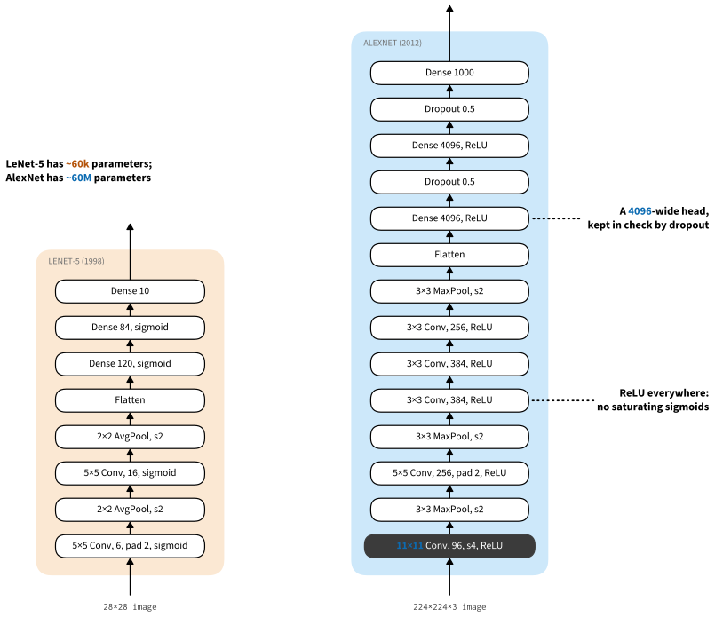

```{.python .input  n=1}
%load_ext d2lbook.tab
tab.interact_select('mxnet', 'pytorch', 'tensorflow', 'jax')
```

# The ImageNet Moment: AlexNet
:label:`sec_alexnet`


Although CNNs were well known in computer vision and machine learning
following the introduction of LeNet :cite:`LeCun.Jackel.Bottou.ea.1995`,
they did not immediately dominate the field. For much of the time between
the early 1990s and the watershed results of 2012
:cite:`Krizhevsky.Sutskever.Hinton.2012`, neural networks were often
outperformed by other methods, such as kernel methods :cite:`Scholkopf.Smola.2002`,
ensemble methods :cite:`Freund.Schapire.ea.1996`,
and structured estimation :cite:`Taskar.Guestrin.Koller.2004`.

For computer vision, this comparison is not entirely fair, because
practitioners never fed raw pixels into traditional models. A typical
pipeline preprocessed the images with hand-crafted feature extractors such as
SIFT (the scale-invariant feature transform) :cite:`Lowe.2004`,
SURF (speeded up robust features) :cite:`Bay.Tuytelaars.Van-Gool.2006`,
or bags of visual words :cite:`Sivic.Zisserman.2003`, and only then trained
a linear model or kernel method on the result. The features were *crafted*
rather than *learned*: progress came from cleverer features and from deep
insight into geometry :cite:`Hartley.Zisserman.2000`, and researchers
believed, justifiably, that a slightly bigger or cleaner dataset or a
slightly improved feature-extraction pipeline mattered far more to the final
accuracy than the choice of classifier. The learning algorithm was an
afterthought.

Neural networks also faced real obstacles. The accelerators of the 1990s
could not power deep multichannel, multilayer CNNs with many parameters,
and datasets were small: OCR on 60,000 low-resolution $28 \times 28$ pixel
images was considered a highly challenging task. Key tricks for training
neural networks were still missing, too, including parameter initialization
heuristics :cite:`Glorot.Bengio.2010`, clever variants of stochastic gradient
descent :cite:`Kingma.Ba.2014`, non-squashing activation functions
:cite:`Nair.Hinton.2010`, and effective regularization
:cite:`Srivastava.Hinton.Krizhevsky.ea.2014`.

```{.python .input #alexnet-deep-convolutional-neural-networks-alexnet  n=2}
%%tab mxnet
from d2l import mxnet as d2l
from mxnet import np, init, npx
from mxnet.gluon import nn
npx.set_np()
```

```{.python .input #alexnet-deep-convolutional-neural-networks-alexnet  n=3}
%%tab pytorch
from d2l import torch as d2l
import torch
from torch import nn
```

```{.python .input #alexnet-deep-convolutional-neural-networks-alexnet  n=4}
%%tab tensorflow
from d2l import tensorflow as d2l
import tensorflow as tf
```

```{.python .input #alexnet-deep-convolutional-neural-networks-alexnet}
%%tab jax
from d2l import jax as d2l
from flax import nnx
from jax import numpy as jnp
```

## Representation Learning

Put differently, the most important part of the classical pipeline was the
representation, and up until 2012 it was calculated mostly mechanically:
SIFT, SURF, HOG (histograms of oriented gradient) :cite:`Dalal.Triggs.2005`,
and bags of visual words ruled the roost.

Another group of researchers, including Yann LeCun, Geoff Hinton, Yoshua
Bengio, Andrew Ng, Shun-ichi Amari, and Juergen Schmidhuber, believed instead
that features themselves ought to be learned, hierarchically composed from
multiple jointly learned layers. The automatic design of visual features,
such as those obtained by sparse coding :cite:`olshausen1996emergence`,
remained an open challenge until
:citet:`Dean.Corrado.Monga.ea.2012,le2013building` and the advent of modern
CNNs.

The first modern CNN :cite:`Krizhevsky.Sutskever.Hinton.2012`, named
*AlexNet* after one of its inventors, Alex Krizhevsky, is largely an
evolutionary improvement over LeNet. It won the 2012 ImageNet challenge and
vindicated the bet on learning: in its lowest layers, the network learned
feature extractors that resembled the traditional filters, as
:numref:`fig_filters` shows. Higher layers build upon these representations
to capture larger structures, like eyes, noses, and blades of grass, and yet
higher layers whole objects, like people, airplanes, and dogs. Ultimately,
the final hidden state is a compact representation of the image in which the
different categories are easily separated.


:width:`400px`
:label:`fig_filters`

AlexNet (2012) and its precursor LeNet (1995) share many architectural
elements, which raises the question of why it took so long. The decisive
difference is that, over the intervening two decades, the amount of data and
the computing power available had each grown by orders of magnitude.

### Missing Ingredient: Data

Deep models with many layers require large amounts of data in order to enter
the regime where they significantly outperform traditional methods based on
convex optimization. However, given the limited storage, the expense of
imaging sensors, and the tighter research budgets of the 1990s, most research
relied on tiny datasets of hundreds or a few thousand low-resolution images,
such as those in the UCI collection.

The ImageNet dataset, released in 2009 :cite:`Deng.Dong.Socher.ea.2009`,
changed this. The 2012 classification challenge supplied roughly 1.2 million
training images across 1000 categories drawn from WordNet
:cite:`Miller.1995`, prefiltered by web image search and verified by Amazon
Mechanical Turk workers. Class sizes varied, and the source images had varying
resolutions; models commonly trained on $224 \times 224$ crops. The scale
exceeded earlier labeled datasets by over an order of magnitude, while the
source images retained far more detail than the $32 \times 32$ thumbnails of
the 80-million-image TinyImages dataset
:cite:`Torralba.Fergus.Freeman.2008`, which allowed higher-level features to
form. The associated competition, the ImageNet Large Scale Visual Recognition
Challenge :cite:`russakovsky2015imagenet`, pushed computer vision and machine
learning research to a scale that academics had not previously considered.

### Missing Ingredient: Hardware

Deep learning models are also voracious consumers of compute cycles: training
can take hundreds of epochs, and each iteration passes data through many
layers of expensive linear algebra operations. *Graphics processing units*
(GPUs) changed the economics. These chips had been developed to accelerate
computer graphics, in particular high-throughput $4 \times 4$ matrix--vector
products, math very similar to that of convolutional layers, and around that
time NVIDIA and ATI had begun optimizing them for general computing
:cite:`Fernando.2004`, marketing them as *general-purpose GPUs* (GPGPUs).
Where a CPU devotes substantial area to low-latency execution, caches, and
general control flow, a GPU devotes more of the chip to parallel arithmetic and
supports much higher memory bandwidth. A convolution applies the same small
program at many output locations and channels, providing enough independent
work to use that throughput. Between the late 1990s and 2012, programmable GPU
throughput grew by orders of magnitude and general-purpose GPU interfaces made
it accessible without expressing the computation as a graphics pipeline.

This was the situation in 2012 when Alex Krizhevsky and Ilya Sutskever
implemented a deep CNN that could run on GPUs. They realized that the
computational bottlenecks in CNNs, convolutions and matrix multiplications,
are precisely the operations that GPUs parallelize well. Using two NVIDIA GTX
580s with 3 GB of memory each, they implemented fast convolutions. The
[cuda-convnet](https://code.google.com/archive/p/cuda-convnet/) code was good
enough that for several years it was the industry standard and powered the
first couple of years of the deep learning boom.

## AlexNet

AlexNet, which employed an 8-layer CNN,
won the ImageNet Large Scale Visual Recognition Challenge 2012
by a large margin :cite:`Russakovsky.Deng.Huang.ea.2013`.
This network showed, for the first time,
that the features obtained by learning can transcend manually designed features, breaking the previous paradigm in computer vision.

The architectures of AlexNet and LeNet are closely related,
as :numref:`fig_alexnet` illustrates.
Note that we provide a slightly streamlined version of AlexNet
removing some of the design quirks that were needed in 2012
to make the model fit on two small GPUs.


:label:`fig_alexnet`

There are also key differences.
First, AlexNet is much deeper than the comparatively small LeNet-5.
AlexNet consists of eight layers: five convolutional layers,
two fully connected hidden layers, and one fully connected output layer.
Second, AlexNet used the ReLU instead of the sigmoid
as its activation function.
Let's look at the details.

### Architecture

In AlexNet's first layer, the convolution window shape is $11\times11$.
Since the images in ImageNet are eight times taller and wider
than the MNIST images,
objects in ImageNet data tend to occupy more pixels with more visual detail.
Consequently, a larger convolution window is needed to capture the object.
The convolution window shape in the second layer
is reduced to $5\times5$, followed by $3\times3$.
In addition, after the first, second, and fifth convolutional layers,
the network adds max-pooling layers
with a window shape of $3\times3$ and a stride of 2.
Moreover, AlexNet has ten times more convolution channels than LeNet.

After the final convolutional layer, there are two huge fully connected layers
with 4096 outputs each.
Together they account for almost all of the model's parameters
(over 160 MB in single precision).
Because of the limited memory in early GPUs,
the original AlexNet used a dual data stream design,
so that each of their two GPUs could be responsible
for storing and computing only its half of the model.
GPU memory is rarely that scarce anymore,
so our version of the model dispenses with the split.

### Activation Functions

AlexNet also changed the sigmoid activation function
to the simpler ReLU activation function.
This makes the computation cheaper,
since the ReLU has no exponentiation operation,
and, more importantly, it makes training easier:
when the output of the sigmoid is very close to 0 or 1,
its gradient is almost 0,
so poorly initialized parameters may stop receiving updates,
whereas the gradient of the ReLU in the positive interval
is always 1 (:numref:`subsec_activation-functions`).

### Capacity Control and Preprocessing

AlexNet controls the model complexity of the fully connected layer
by dropout (:numref:`sec_dropout`),
while LeNet only uses weight decay.
To augment the data even further, the training loop of AlexNet
added a great deal of image augmentation,
such as flipping, clipping, and color changes.
This exposes the model to many more variants of each image
and thereby reduces overfitting;
see :citet:`Buslaev.Iglovikov.Khvedchenya.ea.2020` for an in-depth
review of such preprocessing steps.
Augmentation and its descendants have since grown into a central part
of how convolutional networks are trained,
and we return to them in :numref:`sec_training_recipes`.

```{.python .input #alexnet-capacity-control-and-preprocessing-1  n=5}
%%tab pytorch
class AlexNet(d2l.Classifier):
    def __init__(self, lr=0.1, num_classes=10):
        super().__init__()
        self.save_hyperparameters()
        self.net = nn.Sequential(
            nn.LazyConv2d(96, kernel_size=11, stride=4),
            nn.ReLU(), nn.MaxPool2d(kernel_size=3, stride=2),
            nn.LazyConv2d(256, kernel_size=5, padding=2), nn.ReLU(),
            nn.MaxPool2d(kernel_size=3, stride=2),
            nn.LazyConv2d(384, kernel_size=3, padding=1), nn.ReLU(),
            nn.LazyConv2d(384, kernel_size=3, padding=1), nn.ReLU(),
            nn.LazyConv2d(256, kernel_size=3, padding=1), nn.ReLU(),
            nn.MaxPool2d(kernel_size=3, stride=2), nn.Flatten(),
            nn.LazyLinear(4096), nn.ReLU(), nn.Dropout(p=0.5),
            nn.LazyLinear(4096), nn.ReLU(),nn.Dropout(p=0.5),
            nn.LazyLinear(num_classes))
        # Note: lazy layers have no parameters at construction time, so weight
        # initialization (d2l.init_cnn) is applied later via apply_init after
        # a dummy forward pass materializes the parameters.
```

```{.python .input #alexnet-capacity-control-and-preprocessing-1  n=5}
%%tab mxnet
class AlexNet(d2l.Classifier):
    def __init__(self, lr=0.1, num_classes=10):
        super().__init__()
        self.save_hyperparameters()
        self.net = nn.Sequential()
        self.net.add(
            nn.Conv2D(96, kernel_size=11, strides=4, activation='relu'),
            nn.MaxPool2D(pool_size=3, strides=2),
            nn.Conv2D(256, kernel_size=5, padding=2, activation='relu'),
            nn.MaxPool2D(pool_size=3, strides=2),
            nn.Conv2D(384, kernel_size=3, padding=1, activation='relu'),
            nn.Conv2D(384, kernel_size=3, padding=1, activation='relu'),
            nn.Conv2D(256, kernel_size=3, padding=1, activation='relu'),
            nn.MaxPool2D(pool_size=3, strides=2),
            nn.Dense(4096, activation='relu'), nn.Dropout(0.5),
            nn.Dense(4096, activation='relu'), nn.Dropout(0.5),
            nn.Dense(num_classes))
        self.net.initialize(init.Xavier())
```

```{.python .input #alexnet-capacity-control-and-preprocessing-1  n=5}
%%tab tensorflow
class AlexNet(d2l.Classifier):
    def __init__(self, lr=0.1, num_classes=10):
        super().__init__()
        self.save_hyperparameters()
        self.net = tf.keras.models.Sequential([
            tf.keras.layers.Conv2D(filters=96, kernel_size=11, strides=4,
                                   activation='relu'),
            tf.keras.layers.MaxPool2D(pool_size=3, strides=2),
            tf.keras.layers.Conv2D(filters=256, kernel_size=5, padding='same',
                                   activation='relu'),
            tf.keras.layers.MaxPool2D(pool_size=3, strides=2),
            tf.keras.layers.Conv2D(filters=384, kernel_size=3, padding='same',
                                   activation='relu'),
            tf.keras.layers.Conv2D(filters=384, kernel_size=3, padding='same',
                                   activation='relu'),
            tf.keras.layers.Conv2D(filters=256, kernel_size=3, padding='same',
                                   activation='relu'),
            tf.keras.layers.MaxPool2D(pool_size=3, strides=2),
            tf.keras.layers.Flatten(),
            tf.keras.layers.Dense(4096, activation='relu'),
            tf.keras.layers.Dropout(0.5),
            tf.keras.layers.Dense(4096, activation='relu'),
            tf.keras.layers.Dropout(0.5),
            tf.keras.layers.Dense(num_classes)])
```

```{.python .input #alexnet-capacity-control-and-preprocessing-1}
%%tab jax
class AlexNet(d2l.Classifier):
    def __init__(self, lr=0.1, num_classes=10, rngs=None):
        super().__init__()
        self.save_hyperparameters(ignore=['rngs'])
        rngs = (nnx.Rngs(params=d2l.get_key(), dropout=d2l.get_key())
                if rngs is None else rngs)
        self.net = nnx.Sequential(
            nnx.Conv(1, 96, kernel_size=(11, 11), strides=4,
                     padding='VALID', rngs=rngs),
            nnx.relu,
            lambda x: nnx.max_pool(x, window_shape=(3, 3), strides=(2, 2)),
            nnx.Conv(96, 256, kernel_size=(5, 5), rngs=rngs),
            nnx.relu,
            lambda x: nnx.max_pool(x, window_shape=(3, 3), strides=(2, 2)),
            nnx.Conv(256, 384, kernel_size=(3, 3), rngs=rngs), nnx.relu,
            nnx.Conv(384, 384, kernel_size=(3, 3), rngs=rngs), nnx.relu,
            nnx.Conv(384, 256, kernel_size=(3, 3), rngs=rngs), nnx.relu,
            lambda x: nnx.max_pool(x, window_shape=(3, 3), strides=(2, 2)),
            lambda x: x.reshape((x.shape[0], -1)),  # flatten
            nnx.Linear(5 * 5 * 256, 4096, rngs=rngs),
            nnx.relu,
            nnx.Dropout(0.5, rngs=rngs),
            nnx.Linear(4096, 4096, rngs=rngs),
            nnx.relu,
            nnx.Dropout(0.5, rngs=rngs),
            nnx.Linear(4096, num_classes, rngs=rngs))
```

We construct a single-channel data example with both height and width of 224 to observe the output shape of each layer. It matches the AlexNet architecture in :numref:`fig_alexnet`.

```{.python .input #alexnet-capacity-control-and-preprocessing-2  n=6}
%%tab pytorch, mxnet
AlexNet().layer_summary((1, 1, 224, 224))
```

```{.python .input #alexnet-capacity-control-and-preprocessing-2  n=7}
%%tab tensorflow
AlexNet().layer_summary((1, 224, 224, 1))
```

```{.python .input #alexnet-capacity-control-and-preprocessing-2}
%%tab jax
AlexNet().layer_summary((1, 224, 224, 1))
```

## Training

Although AlexNet was trained on ImageNet in :citet:`Krizhevsky.Sutskever.Hinton.2012`,
we use Fashion-MNIST here
since training an ImageNet model to convergence could take hours or days
even on a modern GPU.
One of the problems with applying AlexNet directly on Fashion-MNIST
is that its images have lower resolution ($28 \times 28$ pixels)
than ImageNet images.
To make things work, we upsample them to $224 \times 224$.
This is generally not a smart practice, as it simply increases the computational
complexity without adding information. Nonetheless, we do it here to be faithful to the AlexNet architecture.
We perform this resizing with the `resize` argument in the `d2l.FashionMNIST` constructor.

Now, we can start training AlexNet.
Compared to LeNet in :numref:`sec_lenet`,
the main change here is the use of a smaller learning rate
and much slower training due to the deeper and wider network,
the higher image resolution, and the more costly convolutions.

```{.python .input #alexnet-training  n=8}
%%tab pytorch, mxnet, jax
model = AlexNet(lr=0.01)
data = d2l.FashionMNIST(batch_size=128, resize=(224, 224))
trainer = d2l.Trainer(max_epochs=10, num_gpus=1)
if tab.selected('pytorch'):
    # Lazy layers have no weights at construction time; apply_init runs a
    # dummy forward pass to materialize parameters and then applies init_cnn.
    model.apply_init([next(iter(data.get_dataloader(True)))[0]], d2l.init_cnn)
trainer.fit(model, data)
```

```{.python .input #alexnet-training  n=9}
%%tab tensorflow
trainer = d2l.Trainer(max_epochs=10)
data = d2l.FashionMNIST(batch_size=128, resize=(224, 224))
with d2l.try_gpu():
    model = AlexNet(lr=0.01)
    trainer.fit(model, data)
```

## Discussion

AlexNet's structure bears a close resemblance to LeNet, with a number of critical improvements, both for accuracy (dropout) and for ease of training (ReLU). Equally consequential is the progress in deep learning tooling: what was several months of work in 2012 can now be accomplished in a dozen lines of code using any modern framework.

Reviewing the architecture, we see that AlexNet has an Achilles heel when it comes to efficiency: the last two hidden layers require matrices of size $6400 \times 4096$ and $4096 \times 4096$, respectively. This corresponds to 164 MB of memory and 81 MFLOPs of computation, both of which are a nontrivial outlay, especially on smaller devices, such as mobile phones. This is one of the reasons why AlexNet has been surpassed by much more effective architectures that we will cover in the following sections. Nonetheless, it is a key step from shallow to deep networks that are used nowadays. Note that even though the number of parameters exceeds by far the amount of training data in our experiments (the last two layers have more than 40 million parameters, trained on a dataset of 60 thousand images), there is hardly any overfitting: training and validation loss are virtually identical throughout training. This is due to the improved regularization, such as dropout, inherent in modern deep network designs.

Although it seems that there are only a few more lines in AlexNet's implementation than in LeNet's, it took the academic community many years to embrace this conceptual change and take advantage of its excellent experimental results. This was also due to the lack of efficient computational tools. At the time neither DistBelief :cite:`Dean.Corrado.Monga.ea.2012` nor Caffe :cite:`Jia.Shelhamer.Donahue.ea.2014` existed, and Theano :cite:`Bergstra.Breuleux.Bastien.ea.2010`, the first widely used automatic-differentiation framework, still lacked many features its successors would bring. It was the maturation of such frameworks, from Theano to TensorFlow :cite:`Abadi.Barham.Chen.ea.2016` and later PyTorch :cite:`Paszke.Gross.Massa.ea.2019` and JAX :cite:`Frostig.Johnson.Leary.2018`, that turned implementing a new architecture from an engineering project into routine work.

## Exercises

1. Following up on the discussion above, analyze the computational properties of AlexNet.
    1. Compute the memory footprint for convolutions and fully connected layers, respectively. Which one dominates?
    1. Calculate the computational cost for the convolutions and the fully connected layers.
    1. How does the memory (read and write bandwidth, latency, size) affect computation? Is there any difference in its effects for training and inference?
1. You are a chip designer and need to trade off computation and memory bandwidth. For example, a faster chip requires more power and possibly a larger chip area. More memory bandwidth requires more pins and control logic, thus also more area. How do you optimize?
1. Why do engineers no longer report performance benchmarks on AlexNet?
1. Try increasing the number of epochs when training AlexNet. Compared with LeNet, how do the results differ? Why?
1. AlexNet may be too complex for the Fashion-MNIST dataset, in particular due to the low resolution of the initial images.
    1. Try simplifying the model to make the training faster, while ensuring that the accuracy does not drop significantly.
    1. Design a better model that works directly on $28 \times 28$ images.
1. Modify the batch size, and observe the changes in throughput (images/s), accuracy, and GPU memory.
1. Apply dropout and ReLU to LeNet-5. Does it improve? Can you improve things further by preprocessing to take advantage of the invariances inherent in the images?
1. Can you make AlexNet overfit? Which feature do you need to remove or change to break training?

:begin_tab:`mxnet`
[Discussions](https://d2l.discourse.group/t/75)
:end_tab:

:begin_tab:`pytorch`
[Discussions](https://d2l.discourse.group/t/76)
:end_tab:

:begin_tab:`tensorflow`
[Discussions](https://d2l.discourse.group/t/276)
:end_tab:

:begin_tab:`jax`
[Discussions](https://d2l.discourse.group/t/18001)
:end_tab:

<!-- slides -->

::: {.slide title="Before 2012: features were crafted"}
Classical vision pipelines never fed raw pixels to a classifier:

- hand-engineered extractors (**SIFT**, **SURF**, bags of visual
  words) computed the representation;
- a linear model or kernel method handled the final classification.

Progress meant inventing better *features*, not better *learning*.
:::

::: {.slide title="The bet: learn the representation"}
LeCun, Hinton, Bengio, Ng, Amari, Schmidhuber: features should be
*learned*, hierarchically, layer by layer.

AlexNet's first layer learned filters that resemble the hand-crafted
ones:

{width=45%}
:::

::: {.slide title="What changed: data and compute"}
- **ImageNet** (2009): 1.2 M labeled images, 1000 classes,
  224×224 resolution.
- **GPUs**: from 1999 to 2012, throughput grew by roughly three
  orders of magnitude.
- Plus the missing training tricks: **ReLU**, **dropout**,
  augmentation, better initialization.

AlexNet (Krizhevsky, Sutskever, Hinton, 2012) put them together and
won ILSVRC 2012 by a large margin.
:::

::: {.slide title="From LeNet to AlexNet"}
Same design, scaled up: convolutional stages, then a fully connected
head.

{width=55%}
:::

::: {.slide title="The architecture in code"}
Five conv layers (11×11 → 5×5 → three 3×3) with max-pooling, then two
4096-wide dense layers with dropout:

@alexnet-deep-convolutional-neural-networks-alexnet

@alexnet-capacity-control-and-preprocessing-1
:::

::: {.slide title="Shape inspection"}
Walk a single 224×224 image through the network and print each
block's output shape, from 224×224 down to 6×6 at 256 channels:

@alexnet-capacity-control-and-preprocessing-2
:::

::: {.slide title="Training on Fashion-MNIST"}
Upsample the 28×28 Fashion-MNIST images to the 224×224 input AlexNet
expects, then train with a smaller learning rate than LeNet:

@alexnet-training
:::

::: {.slide title="Recap"}
- AlexNet is LeNet's recipe at scale: 8 layers, ~60 M parameters,
  **ReLU**, **dropout**, GPU training, ImageNet.
- Learned features displaced a decade of hand-crafted pipelines.
- Its huge dense head is costly; the architectures in the next
  sections trim it away step by step.
:::
