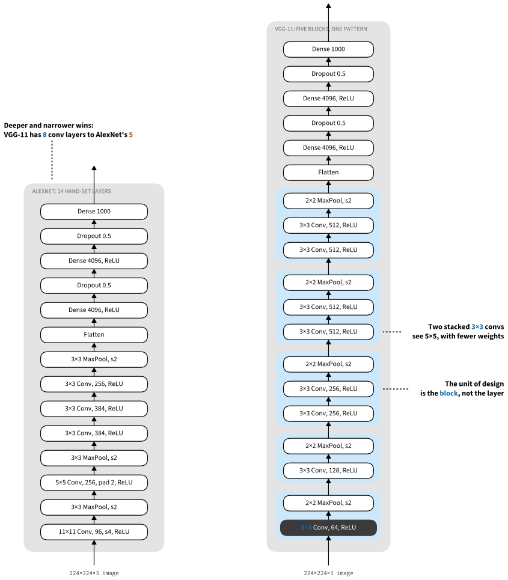
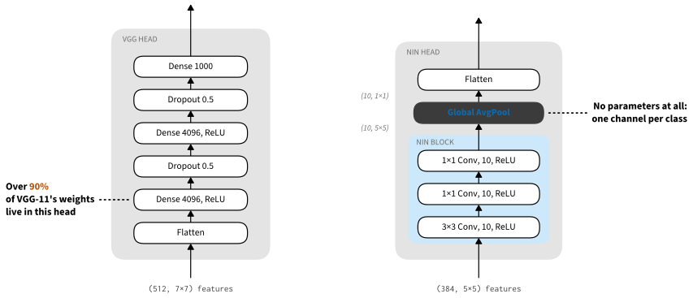
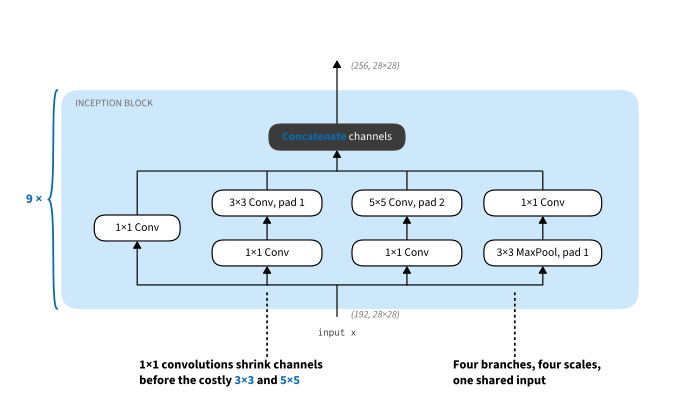

```{.python .input}
%load_ext d2lbook.tab
tab.interact_select('mxnet', 'pytorch', 'tensorflow', 'jax')
```

# Blocks, Bottlenecks, and Branches: VGG, NiN, GoogLeNet
:label:`sec_blocks`

AlexNet gave empirical proof that deep convolutional networks work, but it offered no template for designing the next one: every layer was shaped individually. In the two years that followed, progress came less from new operations than from new ways of *organizing* convolutions, and the three architectures of this section each contributed one organizing idea that every current network still uses. VGG :cite:`Simonyan.Zisserman.2014` made the repeated *block* the unit of design, so that a whole network can be specified by a short list of block parameters. Network in network (NiN) :cite:`Lin.Chen.Yan.2013` mixed channels with $1 \times 1$ convolutions and replaced the parameter-hungry fully connected head with global average pooling. GoogLeNet :cite:`Szegedy.Liu.Jia.ea.2015` ran convolutions of several sizes in parallel inside a *multi-branch* block and, in passing, established the stem-body-head vocabulary in which architectures are still described. The progression mirrors VLSI chip design, where engineers moved from placing transistors to logical elements to logic blocks :cite:`Mead.1980`; carried to its conclusion, the unit of design today is often an entire pretrained network, a *foundation model* :cite:`bommasani2021opportunities`.

```{.python .input #blocks-imports}
%%tab mxnet
# Memory-footprint knobs (set before importing mxnet). VGG and NiN train
# back-to-back at 224x224; MXNet's default "Naive" GPU pool keeps each
# training's freed blocks in size-exact free lists, so NiN's differently
# shaped activations cannot reuse VGG's and the pool high-water grows. The
# "Round" pool buckets allocations by rounded size, letting the second model
# reuse the first's memory; disabling cuDNN autotune drops its scratch
# workspace. Together: ~7.7 GiB -> ~6.4 GiB true peak, with identical results.
import os
os.environ['MXNET_GPU_MEM_POOL_TYPE'] = 'Round'
os.environ['MXNET_CUDNN_AUTOTUNE_DEFAULT'] = '0'
from d2l import mxnet as d2l
from mxnet import np, npx, init
from mxnet.gluon import nn
npx.set_np()
```

```{.python .input #blocks-imports}
%%tab pytorch
from d2l import torch as d2l
import torch
from torch import nn
from torch.nn import functional as F
```

```{.python .input #blocks-imports}
%%tab tensorflow
import tensorflow as tf
from d2l import tensorflow as d2l
```

```{.python .input #blocks-imports}
%%tab jax
# Memory-footprint knob (set before JAX initialises its GPU backend). At
# 224x224 the VGG/NiN convolutions' true peak is dominated not by activations
# but by the cuDNN convolution workspace XLA allocates while autotuning
# algorithms. Capping XLA's memory pool bounds that workspace budget, so
# autotuning simply picks the fastest algorithm that fits -- cutting the true
# peak from ~7.6 GiB to ~6.4 GiB with numerically identical convolutions and
# no slowdown (unlike disabling autotune outright).
import os
os.environ['XLA_PYTHON_CLIENT_MEM_FRACTION'] = '.25'
from d2l import jax as d2l
from flax import nnx
from jax import numpy as jnp
```

## VGG: Blocks as the Unit of Design
:label:`sec_vgg`

The idea of building networks from repeated blocks first emerged from the Visual Geometry Group (VGG) at Oxford University, in their eponymously named *VGG* network :cite:`Simonyan.Zisserman.2014`. Repeated structures are easy to express in code with loops and subroutines, and, as we will see, they turn the design of an entire network into the choice of a handful of numbers.

### VGG Blocks
:label:`subsec_vgg-blocks`

The classic building pattern of CNNs is a sequence of the following: (i) a convolutional layer with padding to maintain the resolution, (ii) a nonlinearity such as a ReLU, (iii) a pooling layer such as max-pooling to reduce the resolution. One problem with this approach is that the spatial resolution decreases quite rapidly. In particular, it imposes a hard limit of $\log_2 d$ convolutional layers on a network with input dimension $d$ before all resolution is used up. For instance, in the case of ImageNet, it would be impossible to have more than 8 convolutional layers in this way.

The key idea of :citet:`Simonyan.Zisserman.2014` was to use *multiple* convolutions in between downsampling via max-pooling in the form of a block. They were primarily interested in whether deep or wide networks perform better, and the receptive-field formula :eqref:`eq_receptive_field` explains why stacking is affordable: two stacked $3 \times 3$ convolutions (stride 1) see the same $5 \times 5$ window as a single $5 \times 5$ convolution while using $18c^2$ rather than $25c^2$ parameters for $c$ input and output channels, and three of them cover a $7 \times 7$ receptive field with $27c^2$ rather than $49c^2$ parameters, with a nonlinearity after every layer. In a rather detailed analysis they showed that deep and narrow networks significantly outperform their shallow counterparts. This set deep learning on a quest for ever deeper networks, with over 100 layers for typical applications. Stacking $3 \times 3$ convolutions became a gold standard in later deep networks, a design decision only revisited recently by :citet:`liu2022convnet`, and fast implementations for small convolutions became a staple on GPUs :cite:`lavin2016fast`.

Back to VGG: a VGG block consists of a *sequence* of convolutions with $3\times3$ kernels with padding of 1 (keeping height and width) followed by a $2 \times 2$ max-pooling layer with stride of 2 (halving height and width after each block). In the code below, we define a function called `vgg_block` to implement one VGG block. It takes two arguments, the number of convolutional layers `num_convs` and the number of output channels `num_channels`.

```{.python .input #vgg-vgg-blocks  n=2}
%%tab mxnet
def vgg_block(num_convs, num_channels):
    blk = nn.Sequential()
    for _ in range(num_convs):
        blk.add(nn.Conv2D(num_channels, kernel_size=3,
                          padding=1, activation='relu'))
    blk.add(nn.MaxPool2D(pool_size=2, strides=2))
    return blk
```

```{.python .input #vgg-vgg-blocks  n=3}
%%tab pytorch
def vgg_block(num_convs, out_channels):
    layers = []
    for _ in range(num_convs):
        layers.append(nn.LazyConv2d(out_channels, kernel_size=3, padding=1))
        layers.append(nn.ReLU())
    layers.append(nn.MaxPool2d(kernel_size=2,stride=2))
    return nn.Sequential(*layers)
```

```{.python .input #vgg-vgg-blocks  n=4}
%%tab tensorflow
def vgg_block(num_convs, num_channels):
    blk = tf.keras.models.Sequential()
    for _ in range(num_convs):
        blk.add(
            tf.keras.layers.Conv2D(num_channels, kernel_size=3,
                                   padding='same', activation='relu'))
    blk.add(tf.keras.layers.MaxPool2D(pool_size=2, strides=2))
    return blk
```

```{.python .input #vgg-vgg-blocks}
%%tab jax
def vgg_block(num_convs, in_channels, out_channels, rngs):
    layers = []
    for _ in range(num_convs):
        layers.append(nnx.Conv(in_channels, out_channels,
                               kernel_size=(3, 3), padding=(1, 1), rngs=rngs))
        layers.append(nnx.relu)
        in_channels = out_channels
    layers.append(lambda x: nnx.max_pool(
        x, window_shape=(2, 2), strides=(2, 2)))
    return nnx.Sequential(*layers)
```

### The VGG Network
:label:`subsec_vgg-network`

Like AlexNet and LeNet, the VGG network can be partitioned into two parts: the first consisting mostly of convolutional and pooling layers and the second consisting of fully connected layers that are identical to those in AlexNet. The key difference is that the convolutional layers are grouped in nonlinear transformations that leave the dimensionality unchanged, followed by a resolution-reduction step, as depicted in :numref:`fig_vgg`.


:label:`fig_vgg`

The convolutional part of the network connects several VGG blocks from :numref:`fig_vgg` (also defined in the `vgg_block` function) in succession. This grouping of convolutions is a pattern that has remained almost unchanged over the past decade, although the specific choice of operations has undergone considerable modifications. The variable `arch` consists of a list of tuples (one per block), where each contains two values: the number of convolutional layers and the number of output channels, which are precisely the arguments required to call the `vgg_block` function. As such, VGG defines a *family* of networks rather than just a specific manifestation. To build a specific network we simply iterate over `arch` to compose the blocks.

```{.python .input #vgg-vgg-network-1  n=5}
%%tab pytorch
class VGG(d2l.Classifier):
    def __init__(self, arch, lr=0.1, num_classes=10):
        super().__init__()
        self.save_hyperparameters()
        conv_blks = []
        for (num_convs, out_channels) in arch:
            conv_blks.append(vgg_block(num_convs, out_channels))
        self.net = nn.Sequential(
            *conv_blks, nn.Flatten(),
            nn.LazyLinear(4096), nn.ReLU(), nn.Dropout(0.5),
            nn.LazyLinear(4096), nn.ReLU(), nn.Dropout(0.5),
            nn.LazyLinear(num_classes))
        self.net.apply(d2l.init_cnn)
```

```{.python .input #vgg-vgg-network-1  n=5}
%%tab mxnet
class VGG(d2l.Classifier):
    def __init__(self, arch, lr=0.1, num_classes=10):
        super().__init__()
        self.save_hyperparameters()
        self.net = nn.Sequential()
        for (num_convs, num_channels) in arch:
            self.net.add(vgg_block(num_convs, num_channels))
        self.net.add(nn.Dense(4096, activation='relu'), nn.Dropout(0.5),
                     nn.Dense(4096, activation='relu'), nn.Dropout(0.5),
                     nn.Dense(num_classes))
        self.net.initialize(init.Xavier())
```

```{.python .input #vgg-vgg-network-1  n=5}
%%tab tensorflow
class VGG(d2l.Classifier):
    def __init__(self, arch, lr=0.1, num_classes=10):
        super().__init__()
        self.save_hyperparameters()
        self.net = tf.keras.models.Sequential()
        for (num_convs, num_channels) in arch:
            self.net.add(vgg_block(num_convs, num_channels))
        self.net.add(
            tf.keras.models.Sequential([
            tf.keras.layers.Flatten(),
            tf.keras.layers.Dense(4096, activation='relu'),
            tf.keras.layers.Dropout(0.5),
            tf.keras.layers.Dense(4096, activation='relu'),
            tf.keras.layers.Dropout(0.5),
            tf.keras.layers.Dense(num_classes)]))
```

```{.python .input #vgg-vgg-network-1  n=5}
%%tab jax
class VGG(d2l.Classifier):
    def __init__(self, arch, lr=0.1, num_classes=10,
                 input_shape=(224, 224, 1), rngs=None):
        super().__init__()
        self.save_hyperparameters(ignore=['rngs'])
        rngs = (nnx.Rngs(params=d2l.get_key(), dropout=d2l.get_key())
                if rngs is None else rngs)
        conv_blks = []
        in_channels = input_shape[-1]
        for num_convs, out_channels in arch:
            conv_blks.append(vgg_block(
                num_convs, in_channels, out_channels, rngs))
            in_channels = out_channels
        height, width = input_shape[:2]
        flat_features = (height // 2 ** len(arch)) * (
            width // 2 ** len(arch)) * in_channels

        self.net = nnx.Sequential(
            *conv_blks,
            lambda x: x.reshape((x.shape[0], -1)),  # flatten
            nnx.Linear(flat_features, 4096, rngs=rngs), nnx.relu,
            nnx.Dropout(0.5, rngs=rngs),
            nnx.Linear(4096, 4096, rngs=rngs), nnx.relu,
            nnx.Dropout(0.5, rngs=rngs),
            nnx.Linear(4096, num_classes, rngs=rngs))
```

The original VGG network had five convolutional blocks, among which the first two have one convolutional layer each and the latter three contain two convolutional layers each. The first block has 64 output channels and each subsequent block doubles the number of output channels, until that number reaches 512. Since this network uses eight convolutional layers and three fully connected layers, it is often called VGG-11.

```{.python .input #vgg-vgg-network-2  n=6}
%%tab pytorch, mxnet
VGG(arch=((1, 64), (1, 128), (2, 256), (2, 512), (2, 512))).layer_summary(
    (1, 1, 224, 224))
```

```{.python .input #vgg-vgg-network-2  n=7}
%%tab tensorflow
VGG(arch=((1, 64), (1, 128), (2, 256), (2, 512), (2, 512))).layer_summary(
    (1, 224, 224, 1))
```

```{.python .input #vgg-vgg-network-2}
%%tab jax
VGG(arch=((1, 64), (1, 128), (2, 256), (2, 512), (2, 512)),
    ).layer_summary((1, 224, 224, 1))
```

As you can see, we halve height and width at each block, finally reaching a height and width of 7 before flattening the representations for processing by the fully connected part of the network. :citet:`Simonyan.Zisserman.2014` described several other variants of VGG. In fact, it has become the norm to propose *families* of networks with different speed--accuracy trade-offs when introducing a new architecture.

### Training

Since VGG-11 is computationally more demanding than AlexNet we construct a network with a smaller number of channels. This is more than sufficient for training on Fashion-MNIST. The model training process is similar to that of AlexNet in :numref:`sec_alexnet`. Again observe the close match between validation and training loss, suggesting only a small amount of overfitting.

```{.python .input #vgg-training  n=8}
%%tab mxnet
model = VGG(arch=((1, 16), (1, 32), (2, 64), (2, 128), (2, 128)), lr=0.01)
trainer = d2l.Trainer(max_epochs=10, num_gpus=1)
data = d2l.FashionMNIST(batch_size=128, resize=(224, 224))
trainer.fit(model, data)
```

```{.python .input #vgg-training  n=8}
%%tab pytorch
model = VGG(arch=((1, 16), (1, 32), (2, 64), (2, 128), (2, 128)), lr=0.01)
trainer = d2l.Trainer(max_epochs=10, num_gpus=1)
data = d2l.FashionMNIST(batch_size=128, resize=(224, 224))
model.apply_init([next(iter(data.get_dataloader(True)))[0]], d2l.init_cnn)
trainer.fit(model, data)
```

```{.python .input #vgg-training  n=8}
%%tab jax
model = VGG(arch=((1, 16), (1, 32), (2, 64), (2, 128), (2, 128)), lr=0.01)
trainer = d2l.Trainer(max_epochs=10, num_gpus=1)
data = d2l.FashionMNIST(batch_size=128, resize=(224, 224))
trainer.fit(model, data)
```

```{.python .input #vgg-training  n=9}
%%tab tensorflow
trainer = d2l.Trainer(max_epochs=10)
data = d2l.FashionMNIST(batch_size=128, resize=(224, 224))
with d2l.try_gpu():
    model = VGG(arch=((1, 16), (1, 32), (2, 64), (2, 128), (2, 128)), lr=0.01)
    trainer.fit(model, data)
```

One might argue that VGG is the first truly modern convolutional neural network. While AlexNet introduced many of the components of what makes deep learning effective at scale, it is VGG that introduced blocks of repeated convolutions and a preference for deep and narrow networks. It is also the first network that is actually an entire family of similarly parametrized models, giving the practitioner an ample trade-off between complexity and speed, and its architecture-as-a-tuple pattern is how networks have been specified ever since.

## NiN: $1 \times 1$ Convolutions and Global Average Pooling
:label:`sec_nin`

LeNet, AlexNet, and VGG all share a common design pattern: extract features exploiting *spatial* structure via a sequence of convolutions and pooling layers and post-process the representations via fully connected layers. The improvements upon LeNet by AlexNet and VGG mainly lie in how these later networks widen and deepen these two modules.

This design poses two major challenges. First, the fully connected layers at the end of the architecture consume tremendous numbers of parameters: even a simple model such as VGG-11 needs a matrix occupying almost 400 MB of RAM in single precision (FP32) just for its first fully connected layer. That outlay is invisible on a server but rules out deployment on memory-constrained mobile and embedded devices, where an image classifier cannot claim the bulk of the device's memory. Second, it is equally impossible to add fully connected layers earlier in the network to increase the degree of nonlinearity: doing so would destroy the spatial structure and require potentially even more memory.

The *network in network* (*NiN*) blocks :cite:`Lin.Chen.Yan.2013` offer an alternative, capable of solving both problems in one simple strategy: (i) use $1 \times 1$ convolutions to add local nonlinearities across the channel activations and (ii) use global average pooling to integrate across all locations in the last representation layer. Note that global average pooling would not be effective, were it not for the added nonlinearities.

### NiN Blocks

Recall from :numref:`subsec_1x1` that a $1 \times 1$ convolution is a fully connected layer applied independently at each pixel location: it mixes channels while leaving the spatial structure untouched. The idea behind NiN is to apply such a per-pixel fully connected layer after each ordinary convolution, twice, with ReLUs in between. This gives the network local nonlinear computation across channels at no spatial cost. :numref:`fig_nin` illustrates the main structural differences between VGG and NiN, and their blocks.


:label:`fig_nin`

```{.python .input #nin-nin-blocks}
%%tab mxnet
def nin_block(num_channels, kernel_size, strides, padding):
    blk = nn.Sequential()
    blk.add(nn.Conv2D(num_channels, kernel_size, strides, padding,
                      activation='relu'),
            nn.Conv2D(num_channels, kernel_size=1, activation='relu'),
            nn.Conv2D(num_channels, kernel_size=1, activation='relu'))
    return blk
```

```{.python .input #nin-nin-blocks}
%%tab pytorch
def nin_block(out_channels, kernel_size, strides, padding):
    return nn.Sequential(
        nn.LazyConv2d(out_channels, kernel_size, strides, padding), nn.ReLU(),
        nn.LazyConv2d(out_channels, kernel_size=1), nn.ReLU(),
        nn.LazyConv2d(out_channels, kernel_size=1), nn.ReLU())
```

```{.python .input #nin-nin-blocks}
%%tab tensorflow
def nin_block(out_channels, kernel_size, strides, padding):
    return tf.keras.models.Sequential([
    tf.keras.layers.Conv2D(out_channels, kernel_size, strides=strides,
                           padding=padding),
    tf.keras.layers.Activation('relu'),
    tf.keras.layers.Conv2D(out_channels, 1),
    tf.keras.layers.Activation('relu'),
    tf.keras.layers.Conv2D(out_channels, 1),
    tf.keras.layers.Activation('relu')])
```

```{.python .input #nin-nin-blocks}
%%tab jax
def nin_block(in_channels, out_channels, kernel_size, strides, padding, rngs):
    return nnx.Sequential(
        nnx.Conv(in_channels, out_channels, kernel_size, strides=strides,
                 padding=padding, rngs=rngs), nnx.relu,
        nnx.Conv(out_channels, out_channels, kernel_size=(1, 1), rngs=rngs),
        nnx.relu,
        nnx.Conv(out_channels, out_channels, kernel_size=(1, 1), rngs=rngs),
        nnx.relu)
```

### The NiN Model

NiN uses the same initial convolution sizes as AlexNet (it was proposed shortly thereafter). The kernel sizes are $11\times 11$, $5\times 5$, and $3\times 3$, respectively, and the numbers of output channels match those of AlexNet. Each NiN block is followed by a max-pooling layer with a stride of 2 and a window shape of $3\times 3$.

The second significant difference between NiN and both AlexNet and VGG is that NiN avoids fully connected layers altogether. Instead, NiN uses a NiN block with a number of output channels equal to the number of label classes, followed by a *global* average pooling layer, yielding a vector of logits. This design dramatically reduces the number of required model parameters, albeit at the expense of a potential increase in training time.

```{.python .input #nin-nin-model-1}
%%tab pytorch
class NiN(d2l.Classifier):
    def __init__(self, lr=0.1, num_classes=10):
        super().__init__()
        self.save_hyperparameters()
        self.net = nn.Sequential(
            nin_block(96, kernel_size=11, strides=4, padding=0),
            nn.MaxPool2d(3, stride=2),
            nin_block(256, kernel_size=5, strides=1, padding=2),
            nn.MaxPool2d(3, stride=2),
            nin_block(384, kernel_size=3, strides=1, padding=1),
            nn.MaxPool2d(3, stride=2),
            nn.Dropout(0.5),
            nin_block(num_classes, kernel_size=3, strides=1, padding=1),
            nn.AdaptiveAvgPool2d((1, 1)),
            nn.Flatten())
        self.net.apply(d2l.init_cnn)
```

```{.python .input #nin-nin-model-1}
%%tab mxnet
class NiN(d2l.Classifier):
    def __init__(self, lr=0.1, num_classes=10):
        super().__init__()
        self.save_hyperparameters()
        self.net = nn.Sequential()
        self.net.add(
            nin_block(96, kernel_size=11, strides=4, padding=0),
            nn.MaxPool2D(pool_size=3, strides=2),
            nin_block(256, kernel_size=5, strides=1, padding=2),
            nn.MaxPool2D(pool_size=3, strides=2),
            nin_block(384, kernel_size=3, strides=1, padding=1),
            nn.MaxPool2D(pool_size=3, strides=2),
            nn.Dropout(0.5),
            nin_block(num_classes, kernel_size=3, strides=1, padding=1),
            nn.GlobalAvgPool2D(),
            nn.Flatten())
        self.net.initialize(init.Xavier())
```

```{.python .input #nin-nin-model-1}
%%tab tensorflow
class NiN(d2l.Classifier):
    def __init__(self, lr=0.1, num_classes=10):
        super().__init__()
        self.save_hyperparameters()
        self.net = tf.keras.models.Sequential([
            nin_block(96, kernel_size=11, strides=4, padding='valid'),
            tf.keras.layers.MaxPool2D(pool_size=3, strides=2),
            nin_block(256, kernel_size=5, strides=1, padding='same'),
            tf.keras.layers.MaxPool2D(pool_size=3, strides=2),
            nin_block(384, kernel_size=3, strides=1, padding='same'),
            tf.keras.layers.MaxPool2D(pool_size=3, strides=2),
            tf.keras.layers.Dropout(0.5),
            nin_block(num_classes, kernel_size=3, strides=1, padding='same'),
            tf.keras.layers.GlobalAvgPool2D(),
            tf.keras.layers.Flatten()])
```

```{.python .input #nin-nin-model-1}
%%tab jax
class NiN(d2l.Classifier):
    def __init__(self, lr=0.1, num_classes=10, rngs=None):
        super().__init__()
        self.save_hyperparameters(ignore=['rngs'])
        rngs = (nnx.Rngs(params=d2l.get_key(), dropout=d2l.get_key())
                if rngs is None else rngs)
        self.net = nnx.Sequential(
            nin_block(1, 96, (11, 11), (4, 4), (0, 0), rngs),
            lambda x: nnx.max_pool(x, (3, 3), strides=(2, 2)),
            nin_block(96, 256, (5, 5), (1, 1), (2, 2), rngs),
            lambda x: nnx.max_pool(x, (3, 3), strides=(2, 2)),
            nin_block(256, 384, (3, 3), (1, 1), (1, 1), rngs),
            lambda x: nnx.max_pool(x, (3, 3), strides=(2, 2)),
            nnx.Dropout(0.5, rngs=rngs),
            nin_block(384, num_classes, (3, 3), (1, 1), (1, 1), rngs),
            lambda x: x.mean(axis=(1, 2)),  # global avg pooling over H, W (NHWC)
            lambda x: x.reshape((x.shape[0], -1)))  # flatten
```

We create a data example to see the output shape of each block.

```{.python .input #nin-nin-model-2}
%%tab mxnet, pytorch
NiN().layer_summary((1, 1, 224, 224))
```

```{.python .input #nin-nin-model-2}
%%tab tensorflow
NiN().layer_summary((1, 224, 224, 1))
```

```{.python .input #nin-nin-model-2}
%%tab jax
NiN().layer_summary((1, 224, 224, 1))
```

### Training

As before we use Fashion-MNIST to train the model, with the same optimizer that we used for AlexNet and VGG.

```{.python .input #nin-training}
%%tab mxnet
model = NiN(lr=0.05)
trainer = d2l.Trainer(max_epochs=10, num_gpus=1)
data = d2l.FashionMNIST(batch_size=128, resize=(224, 224))
trainer.fit(model, data)
```

```{.python .input #nin-training}
%%tab pytorch
model = NiN(lr=0.05)
trainer = d2l.Trainer(max_epochs=10, num_gpus=1)
data = d2l.FashionMNIST(batch_size=128, resize=(224, 224))
model.apply_init([next(iter(data.get_dataloader(True)))[0]], d2l.init_cnn)
trainer.fit(model, data)
```

```{.python .input #nin-training}
%%tab jax
model = NiN(lr=0.05)
trainer = d2l.Trainer(max_epochs=10, num_gpus=1)
data = d2l.FashionMNIST(batch_size=128, resize=(224, 224))
trainer.fit(model, data)
```

```{.python .input #nin-training}
%%tab tensorflow
trainer = d2l.Trainer(max_epochs=10)
data = d2l.FashionMNIST(batch_size=128, resize=(224, 224))
with d2l.try_gpu():
    model = NiN(lr=0.05)
    trainer.fit(model, data)
```

NiN has dramatically fewer parameters than AlexNet and VGG, primarily
because it needs no giant fully connected layers. Instead, global average
pooling replaces an expensive learned reduction with a simple average across
locations. Under ideal translation equivariance, a translation merely
permutes those locations, so the global average is invariant. Finite boundaries
and strided stages make real networks only approximately shift-invariant. Two
of NiN's choices outlived it: $1 \times 1$ convolution for channel mixing and
global average pooling as the common classification head.

## GoogLeNet: Multi-Branch Blocks and the Stem-Body-Head Pattern
:label:`sec_googlenet`

In 2014, *GoogLeNet* won the ImageNet Challenge :cite:`Szegedy.Liu.Jia.ea.2015`, using a structure that combined the strengths of NiN :cite:`Lin.Chen.Yan.2013`, repeated blocks :cite:`Simonyan.Zisserman.2014`, and a cocktail of convolution kernels. It was arguably also the first network that exhibited a clear distinction among the stem (data ingest), body (data processing), and head (prediction) in a CNN. This design pattern has persisted ever since in the design of deep networks: the *stem* is given by the first two or three convolutions that operate on the image. They extract low-level features from the underlying images. This is followed by a *body* of convolutional blocks. Finally, the *head* maps the features obtained so far to the required classification, segmentation, detection, or tracking problem at hand.

The key contribution in GoogLeNet was the design of the network body. It solved the problem of selecting convolution kernels in an ingenious way. While other works tried to identify which convolution, ranging from $1 \times 1$ to $11 \times 11$, would be best, it simply *concatenated* multi-branch convolutions. In what follows we introduce a slightly simplified version of GoogLeNet: the original design included a number of tricks for stabilizing training through intermediate loss functions, applied to multiple layers of the network. They are no longer necessary due to the availability of improved training algorithms.

### The Inception Block

The basic convolutional block in GoogLeNet is called an *Inception block*, stemming from the meme "we need to go deeper" from the movie *Inception*.


:label:`fig_inception`

As depicted in :numref:`fig_inception`, the Inception block consists of four parallel branches. The first three branches use convolutional layers with window sizes of $1\times 1$, $3\times 3$, and $5\times 5$ to extract information from different spatial sizes. The middle two branches also add a $1\times 1$ convolution of the input to reduce the number of channels, reducing the model's complexity. The fourth branch uses a $3\times 3$ max-pooling layer, followed by a $1\times 1$ convolutional layer to change the number of channels. The four branches all use appropriate padding to give the input and output the same height and width. Finally, the outputs along each branch are concatenated along the channel dimension and comprise the block's output. The commonly tuned hyperparameters of the Inception block are the number of output channels per branch, i.e., how to allocate capacity among convolutions of different size.

```{.python .input #googlenet-inception-blocks}
%%tab mxnet
class Inception(nn.Block):
    # c1--c4 are the number of output channels for each branch
    def __init__(self, c1, c2, c3, c4):
        super().__init__()
        # Branch 1
        self.b1_1 = nn.Conv2D(c1, kernel_size=1, activation='relu')
        # Branch 2
        self.b2_1 = nn.Conv2D(c2[0], kernel_size=1, activation='relu')
        self.b2_2 = nn.Conv2D(c2[1], kernel_size=3, padding=1,
                              activation='relu')
        # Branch 3
        self.b3_1 = nn.Conv2D(c3[0], kernel_size=1, activation='relu')
        self.b3_2 = nn.Conv2D(c3[1], kernel_size=5, padding=2,
                              activation='relu')
        # Branch 4
        self.b4_1 = nn.MaxPool2D(pool_size=3, strides=1, padding=1)
        self.b4_2 = nn.Conv2D(c4, kernel_size=1, activation='relu')

    def forward(self, x):
        b1 = self.b1_1(x)
        b2 = self.b2_2(self.b2_1(x))
        b3 = self.b3_2(self.b3_1(x))
        b4 = self.b4_2(self.b4_1(x))
        return np.concatenate((b1, b2, b3, b4), axis=1)
```

```{.python .input #googlenet-inception-blocks}
%%tab pytorch
class Inception(nn.Module):
    # c1--c4 are the number of output channels for each branch
    def __init__(self, c1, c2, c3, c4, **kwargs):
        super(Inception, self).__init__(**kwargs)
        # Branch 1
        self.b1_1 = nn.LazyConv2d(c1, kernel_size=1)
        # Branch 2
        self.b2_1 = nn.LazyConv2d(c2[0], kernel_size=1)
        self.b2_2 = nn.LazyConv2d(c2[1], kernel_size=3, padding=1)
        # Branch 3
        self.b3_1 = nn.LazyConv2d(c3[0], kernel_size=1)
        self.b3_2 = nn.LazyConv2d(c3[1], kernel_size=5, padding=2)
        # Branch 4
        self.b4_1 = nn.MaxPool2d(kernel_size=3, stride=1, padding=1)
        self.b4_2 = nn.LazyConv2d(c4, kernel_size=1)

    def forward(self, x):
        b1 = F.relu(self.b1_1(x))
        b2 = F.relu(self.b2_2(F.relu(self.b2_1(x))))
        b3 = F.relu(self.b3_2(F.relu(self.b3_1(x))))
        b4 = F.relu(self.b4_2(self.b4_1(x)))
        return torch.cat((b1, b2, b3, b4), dim=1)
```

```{.python .input #googlenet-inception-blocks}
%%tab tensorflow
class Inception(tf.keras.Model):
    # c1--c4 are the number of output channels for each branch
    def __init__(self, c1, c2, c3, c4):
        super().__init__()
        self.b1_1 = tf.keras.layers.Conv2D(c1, 1, activation='relu')
        self.b2_1 = tf.keras.layers.Conv2D(c2[0], 1, activation='relu')
        self.b2_2 = tf.keras.layers.Conv2D(c2[1], 3, padding='same',
                                           activation='relu')
        self.b3_1 = tf.keras.layers.Conv2D(c3[0], 1, activation='relu')
        self.b3_2 = tf.keras.layers.Conv2D(c3[1], 5, padding='same',
                                           activation='relu')
        self.b4_1 = tf.keras.layers.MaxPool2D(3, 1, padding='same')
        self.b4_2 = tf.keras.layers.Conv2D(c4, 1, activation='relu')

    def call(self, x):
        b1 = self.b1_1(x)
        b2 = self.b2_2(self.b2_1(x))
        b3 = self.b3_2(self.b3_1(x))
        b4 = self.b4_2(self.b4_1(x))
        return tf.keras.layers.Concatenate()([b1, b2, b3, b4])
```

```{.python .input #googlenet-inception-blocks}
%%tab jax
class Inception(nnx.Module):
    def __init__(self, in_channels, c1, c2, c3, c4, rngs):
        # Branch 1
        self.b1_1 = nnx.Conv(in_channels, c1, kernel_size=(1, 1), rngs=rngs)
        # Branch 2
        self.b2_1 = nnx.Conv(in_channels, c2[0], kernel_size=(1, 1), rngs=rngs)
        self.b2_2 = nnx.Conv(c2[0], c2[1], kernel_size=(3, 3),
                             padding='same', rngs=rngs)
        # Branch 3
        self.b3_1 = nnx.Conv(in_channels, c3[0], kernel_size=(1, 1), rngs=rngs)
        self.b3_2 = nnx.Conv(c3[0], c3[1], kernel_size=(5, 5),
                             padding='same', rngs=rngs)
        # Branch 4
        self.b4_2 = nnx.Conv(in_channels, c4, kernel_size=(1, 1), rngs=rngs)

    def __call__(self, x):
        b1 = nnx.relu(self.b1_1(x))
        b2 = nnx.relu(self.b2_2(nnx.relu(self.b2_1(x))))
        b3 = nnx.relu(self.b3_2(nnx.relu(self.b3_1(x))))
        pooled = nnx.max_pool(x, window_shape=(3, 3),
                              strides=(1, 1), padding='same')
        b4 = nnx.relu(self.b4_2(pooled))
        return jnp.concatenate((b1, b2, b3, b4), axis=-1)
```

To see how the shapes work out, follow the first Inception block of the body on an ImageNet-sized input, where it receives 192 channels at $28 \times 28$ resolution (the annotations in :numref:`fig_inception`). With branch outputs of $c_1 = 64$, $c_2 = (96, 128)$, $c_3 = (16, 32)$, and $c_4 = 32$, the block emits $64+128+32+32 = 256$ channels at the same $28 \times 28$ resolution: multi-branch blocks change the channel count, never the spatial size. The $1 \times 1$ bottlenecks are what make the wide branches affordable. A direct $5 \times 5$ convolution from 192 to 32 channels would need $25 \cdot 192 \cdot 32 \approx 154$k weights; squeezing to 16 channels first costs $192 \cdot 16$ weights for the reduction plus $25 \cdot 16 \cdot 32$ for the convolution, about 16k in total, a tenfold saving. This bottleneck-before-expensive-convolution trick reappears in nearly every architecture in the rest of this chapter.

Beyond economy, the combination of filters explores the image at a variety of spatial extents, so details of different sizes can be recognized by filters of the matching size, and the channel allocation decides how much capacity each scale receives.

### Stem, Body, and Head

GoogLeNet arranges 9 Inception blocks into three groups of 2, 5, and 2, with max-pooling between the groups to reduce the resolution. The stem is AlexNet-like: a $7 \times 7$ convolution with stride 2, a max-pooling step, then a $1 \times 1$ and a $3 \times 3$ convolution that raise the channel count to 192, and one more max-pooling step. The head is exactly NiN's: global average pooling followed by a single fully connected layer.

The channel allocations inside the 9 blocks are data, not derivations. The paper picked them by hand, balancing the branches so that concatenation yields 256 up to 1024 channels as depth grows; the text itself offers no principle behind the exact ratios. At the time, automatic tools for design exploration were not yet available, and even input-shape inference, which we now take for granted, had to be done by the experimenter. We therefore store the allocation as a tuple of tuples, one entry per block, in the same architecture-as-data style as VGG's `arch`:

```{.python .input #blocks-stem-body-and-head-1}
arch = (((64, (96, 128), (16, 32), 32), (128, (128, 192), (32, 96), 64)),
        ((192, (96, 208), (16, 48), 64), (160, (112, 224), (24, 64), 64),
         (128, (128, 256), (24, 64), 64), (112, (144, 288), (32, 64), 64),
         (256, (160, 320), (32, 128), 128)),
        ((256, (160, 320), (32, 128), 128), (384, (192, 384), (48, 128), 128)))
```

Assembling the full network is now a matter of composing stem, body, and head.

```{.python .input #blocks-stem-body-and-head-2}
%%tab pytorch
class GoogleNet(d2l.Classifier):
    def __init__(self, lr=0.1, num_classes=10):
        super().__init__()
        self.save_hyperparameters()
        pool = lambda: nn.MaxPool2d(kernel_size=3, stride=2, padding=1)
        stem = nn.Sequential(
            nn.LazyConv2d(64, kernel_size=7, stride=2, padding=3), nn.ReLU(),
            pool(),
            nn.LazyConv2d(64, kernel_size=1), nn.ReLU(),
            nn.LazyConv2d(192, kernel_size=3, padding=1), nn.ReLU(), pool())
        body = [nn.Sequential(*[Inception(*c) for c in group])
                for group in arch]
        head = nn.Sequential(nn.AdaptiveAvgPool2d((1, 1)), nn.Flatten(),
                             nn.LazyLinear(num_classes))
        self.net = nn.Sequential(stem, body[0], pool(), body[1], pool(),
                                 body[2], head)
        self.net.apply(d2l.init_cnn)
```

```{.python .input #blocks-stem-body-and-head-2}
%%tab mxnet
class GoogleNet(d2l.Classifier):
    def __init__(self, lr=0.1, num_classes=10):
        super().__init__()
        self.save_hyperparameters()
        pool = lambda: nn.MaxPool2D(pool_size=3, strides=2, padding=1)
        stem = nn.Sequential()
        stem.add(nn.Conv2D(64, kernel_size=7, strides=2, padding=3,
                           activation='relu'), pool(),
                 nn.Conv2D(64, kernel_size=1, activation='relu'),
                 nn.Conv2D(192, kernel_size=3, padding=1, activation='relu'),
                 pool())
        body = []
        for group in arch:
            blk = nn.Sequential()
            blk.add(*[Inception(*c) for c in group])
            body.append(blk)
        self.net = nn.Sequential()
        self.net.add(stem, body[0], pool(), body[1], pool(), body[2],
                     nn.GlobalAvgPool2D(), nn.Dense(num_classes))
        self.net.initialize(init.Xavier())
```

```{.python .input #blocks-stem-body-and-head-2}
%%tab tensorflow
class GoogleNet(d2l.Classifier):
    def __init__(self, lr=0.1, num_classes=10):
        super().__init__()
        self.save_hyperparameters()
        pool = lambda: tf.keras.layers.MaxPool2D(pool_size=3, strides=2,
                                                 padding='same')
        stem = tf.keras.Sequential([
            tf.keras.layers.Conv2D(64, 7, strides=2, padding='same',
                                   activation='relu'), pool(),
            tf.keras.layers.Conv2D(64, 1, activation='relu'),
            tf.keras.layers.Conv2D(192, 3, padding='same', activation='relu'),
            pool()])
        body = [tf.keras.Sequential([Inception(*c) for c in group])
                for group in arch]
        head = tf.keras.Sequential([tf.keras.layers.GlobalAvgPool2D(),
                                    tf.keras.layers.Dense(num_classes)])
        self.net = tf.keras.Sequential([stem, body[0], pool(), body[1],
                                        pool(), body[2], head])
```

```{.python .input #blocks-stem-body-and-head-2}
%%tab jax
class GoogleNet(d2l.Classifier):
    def __init__(self, lr=0.1, num_classes=10, rngs=None):
        super().__init__()
        self.save_hyperparameters(ignore=['rngs'])
        rngs = nnx.Rngs(d2l.get_key()) if rngs is None else rngs
        pool = lambda x: nnx.max_pool(
            x, window_shape=(3, 3), strides=(2, 2), padding='same')
        stem = nnx.Sequential(
            nnx.Conv(1, 64, kernel_size=(7, 7), strides=(2, 2),
                     padding='same', rngs=rngs), nnx.relu, pool,
            nnx.Conv(64, 64, kernel_size=(1, 1), rngs=rngs), nnx.relu,
            nnx.Conv(64, 192, kernel_size=(3, 3), padding='same', rngs=rngs),
            nnx.relu, pool)
        body, in_channels = [], 192
        for group in arch:
            blocks = []
            for c1, c2, c3, c4 in group:
                blocks.append(Inception(
                    in_channels, c1, c2, c3, c4, rngs))
                in_channels = c1 + c2[1] + c3[1] + c4
            body.append(nnx.Sequential(*blocks))
        head = nnx.Sequential(lambda x: x.mean(axis=(1, 2)),
                              nnx.Linear(in_channels, num_classes, rngs=rngs))
        self.net = nnx.Sequential(stem, body[0], pool, body[1], pool,
                                  body[2], head)
```

We check the shapes on a $96 \times 96$ input, a resolution at which the network still works and the table stays compact. Resolution falls at the stem and at each pooling step between groups; the channel count grows after every group of Inception blocks, from 192 to 480 to 832 to 1024.

```{.python .input #googlenet-googlenet-model-7}
%%tab mxnet, pytorch
GoogleNet().layer_summary((1, 1, 96, 96))
```

```{.python .input #googlenet-googlenet-model-7}
%%tab tensorflow, jax
GoogleNet().layer_summary((1, 96, 96, 1))
```

Training proceeds exactly as for AlexNet and VGG, so we do not repeat the run here. A key feature of GoogLeNet is that it is actually *cheaper* to compute than its predecessors, at about 7 million parameters against VGG's 138 million, while simultaneously providing improved accuracy. This marks the beginning of much more deliberate network design that trades off the cost of evaluating a network against a reduction in errors, and of experimentation at a block level with network design hyperparameters, even though it was entirely manual at the time. We will revisit this topic in :numref:`sec_cnn-design` when discussing strategies for network structure exploration.

GoogLeNet spawned a lineage: Inception-v2 and v3 :cite:`Szegedy.Vanhoucke.Ioffe.ea.2016` and Inception-v4 and Inception-ResNet :cite:`Szegedy.Ioffe.Vanhoucke.ea.2017` kept refining the branch mixtures. That lineage is dead: no current architecture descends from it, and nobody hand-tunes branch cocktails anymore. Two of its ideas survive in different clothes. Grouped convolutions, as in ResNeXt (:numref:`subsec_resnext`), are multi-branch blocks with all branches made identical, which removes the hand-tuning while keeping the cost savings. And RepVGG :cite:`ding2021repvgg` uses parallel branches at training time only, fusing them into a single convolution for inference (:numref:`sec_efficient_cnns`).

## Summary

Between 2013 and 2015 these three architectures explored the design space that AlexNet had opened. None of them is used today, but every one of them contributed at least one permanent idea, and the table below is a fair summary of what a decade of subsequent work kept.

| Idea | Introduced by | Where it lives today |
| :-- | :-- | :-- |
| Repeated blocks, architecture as a tuple | VGG | every modern network is specified stage by stage as block parameters |
| $1 \times 1$ convolution | NiN | the channel-mixing layer in bottlenecks, ResNets, and transformers' per-position MLPs |
| Global average pooling | NiN | the default classification head |
| Multi-branch blocks | GoogLeNet | grouped convolutions (ResNeXt) and train-time-only branches (RepVGG) |

The stem-body-head decomposition that GoogLeNet made explicit is now the universal vocabulary for describing vision architectures, and we will use it for the rest of the book. The next ingredient, which none of these networks had and all of their successors would adopt, is normalization.

## Exercises

1. Compared with AlexNet, VGG is much slower in terms of computation, and it also needs more GPU memory.
    1. Compare the number of parameters needed for AlexNet and VGG.
    1. Compare the number of floating point operations used in the convolutional layers and in the fully connected layers.
    1. How could you reduce the computational cost created by the fully connected layers?
1. When displaying the dimensions associated with the various layers of the VGG network, we only see the information associated with eight blocks (plus some auxiliary transforms), even though the network has 11 layers. Where did the remaining three layers go?
1. Use Table 1 in the VGG paper :cite:`Simonyan.Zisserman.2014` to construct other common models, such as VGG-16 or VGG-19.
1. Upsampling the resolution in Fashion-MNIST eight-fold from $28 \times 28$ to $224 \times 224$ dimensions is very wasteful. Try modifying the network architecture and resolution conversion, e.g., to 56 or to 84 dimensions for its input instead. Can you do so without reducing the accuracy of the network? Consult the VGG paper :cite:`Simonyan.Zisserman.2014` for ideas on adding more nonlinearities prior to downsampling.
1. Why are there two $1\times 1$ convolutional layers per NiN block? Increase their number to three. Reduce their number to one. What changes?
1. What happens if you replace NiN's global average pooling by a fully connected layer (speed, accuracy, number of parameters)?
1. What are possible problems with reducing the $384 \times 5 \times 5$ representation to a $10 \times 5 \times 5$ representation in one step, as the final NiN block does?
1. Add a squeeze-and-excitation gate :cite:`Hu.Shen.Sun.2018` to the Inception block: global-average-pool the block's output to one value per channel, pass it through a two-layer MLP with a sigmoid at the end, and multiply the channels by the result. How many parameters does this add, and how does it change training on Fashion-MNIST?
1. Replace the Inception block's four branches with a single $7 \times 7$ depthwise convolution followed by a $1 \times 1$ convolution (:numref:`sec_depthwise_separable`). Compare the parameter count and the number of floating point operations with the original block at the same input and output sizes.
1. What is the minimum image size needed for GoogLeNet to work? Can you design a variant that works on Fashion-MNIST's native resolution of $28 \times 28$ pixels? What would you need to change in the stem, the body, and the head?
1. Compare the model parameter sizes of AlexNet, VGG, NiN, and GoogLeNet. How do the latter two architectures reduce the model parameter size so dramatically?

:begin_tab:`mxnet`
[Discussions](https://d2l.discourse.group/t/77)
:end_tab:

:begin_tab:`pytorch`
[Discussions](https://d2l.discourse.group/t/78)
:end_tab:

:begin_tab:`tensorflow`
[Discussions](https://d2l.discourse.group/t/277)
:end_tab:

:begin_tab:`jax`
[Discussions](https://d2l.discourse.group/t/18002)
:end_tab:

<!-- slides -->

::: {.slide title="After AlexNet: organize the convolutions"}
AlexNet proved deep CNNs work, but gave no **template**: every
layer was designed individually.

The next generation contributed one organizing idea each:

- **VGG** repeats identical blocks; a network becomes a tuple.
- **NiN** mixes channels with 1×1 convs and replaces the FC head
  with **global average pooling**.
- **GoogLeNet** runs branches of several filter sizes in
  parallel and concatenates.

All three ideas are still in every modern network.
:::

::: {.slide title="VGG: regular blocks at scale"}
**VGG** (Simonyan & Zisserman, 2014) is AlexNet taken seriously:
stack more layers, but make them **regular** blocks of
`3×3 conv + ReLU`, ending in a `2×2 max-pool`.

{width=72%}
:::

::: {.slide title="Receptive field arithmetic"}
Why 3×3 only? Stacking small kernels grows the visible patch
without paying for a large kernel in one step. For stride 1:

$$r = 1 + \sum_{i=1}^{L} (k_i - 1).$$

Two 3×3 convolutions see $1 + 2 + 2 = 5$ pixels across: the same
receptive field as one 5×5 conv, with $18c^2$ instead of $25c^2$
weights and one extra ReLU. Deep-and-narrow beats shallow-and-wide.
:::

::: {.slide title="The VGG block"}
A reusable subunit: `num_convs` consecutive `Conv-ReLU` pairs,
then a `2×2 MaxPool`:

@blocks-imports

@vgg-vgg-blocks
:::

::: {.slide title="The VGG network"}
Five blocks at growing channel counts plus a 3-layer dense head.
The "named architecture" is just a tuple of `(n_convs, channels)`
pairs; a different tuple gives VGG-13/16/19:

@vgg-vgg-network-1
:::

::: {.slide title="VGG-11 shape check"}
Each block halves the resolution; channels double until 512:

@vgg-vgg-network-2
:::

::: {.slide title="Training a thin VGG"}
Full VGG-11 is heavy for a notebook, so we thin the channels
(16/32/64/128/128) and train on Fashion-MNIST:

@vgg-training

Same pipeline as AlexNet; the block design is what changed.
:::

::: {.slide title="NiN: 1×1 convolutions and GAP"}
**Network in network** (Lin et al., 2013) attacks the FC head:
VGG-11's first dense layer alone needs ~400 MB in FP32.

- **1×1 convolutions**: an MLP applied at every pixel; channel
  mixing and extra nonlinearity at zero spatial cost.
- **Global average pooling**: one number per channel replaces
  the giant dense classifier.

{width=72%}
:::

::: {.slide title="The NiN block"}
A regular convolution followed by **two 1×1 convolutions** with
ReLUs in between:

@nin-nin-blocks
:::

::: {.slide title="The NiN model"}
Four NiN blocks (AlexNet's kernel sizes), max-pool between them,
and the last block emits `num_classes` channels. Then global
average pooling. **No fully connected layers at all.**

@nin-nin-model-1
:::

::: {.slide title="NiN shape inspection"}
Spatial dims shrink, channels grow, and the final block already
has one channel per class:

@nin-nin-model-2
:::

::: {.slide title="Training NiN"}
@nin-training

The averaging head costs nothing and does not hurt accuracy;
that surprise made GAP the default head ever since.
:::

::: {.slide title="GoogLeNet: go wide"}
**GoogLeNet** (Szegedy et al., 2015) won ImageNet 2014 with two
lasting contributions:

- The **stem / body / head** decomposition of a network,
  still the universal vocabulary.
- The **Inception block**: don't pick a filter size,
  run 1×1, 3×3, 5×5, and pooling **in parallel** and
  concatenate the channels.

{width=78%}
:::

::: {.slide title="The Inception block in code"}
Four branches, channel-concatenated; 1×1 convs shrink channels
before the costly 3×3 and 5×5:

@googlenet-inception-blocks
:::

::: {.slide title="Bottleneck arithmetic"}
First body block: 192 channels in, $64+128+32+32 = 256$ out,
spatial size unchanged.

The 5×5 branch, direct: $25 \cdot 192 \cdot 32 \approx 154$k
weights.

. . .

With a 16-channel 1×1 bottleneck first:
$192 \cdot 16 + 25 \cdot 16 \cdot 32 \approx 16$k, a **10×**
saving. This trick is in nearly every network since.
:::

::: {.slide title="The whole network as data"}
Nine Inception blocks in three groups (2, 5, 2), pooling
between groups. The hand-picked channel allocations are just a
tuple; assembly is stem + body + head:

@blocks-stem-body-and-head-1

@blocks-stem-body-and-head-2
:::

::: {.slide title="Shape check"}
@googlenet-googlenet-model-7

Cheaper than VGG (~7M vs. ~138M parameters) *and* more accurate:
the start of deliberate cost--accuracy design.
:::

::: {.slide title="What survived"}
- **Blocks** (VGG): everything is specified block by block.
- **1×1 convolution** (NiN): the standard channel mixer.
- **Global average pooling** (NiN): the default head.
- **Multi-branch** (GoogLeNet): survives as grouped convolutions
  (ResNeXt) and train-time-only branches (RepVGG).
- Inception-style hand-tuned branch cocktails: extinct.

Next ingredient: **normalization**.
:::
