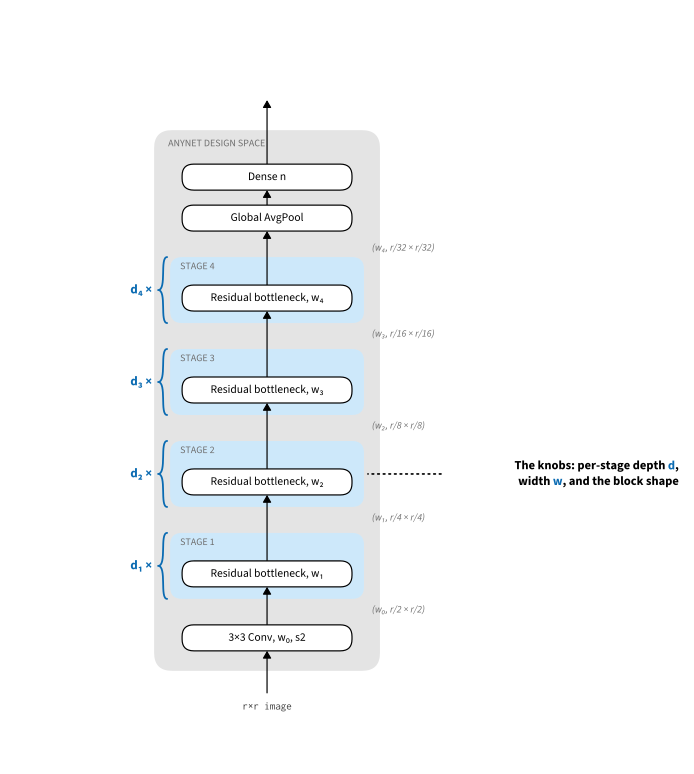
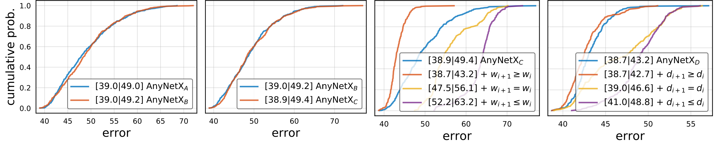

```{.python .input}
%load_ext d2lbook.tab
tab.interact_select('mxnet', 'pytorch', 'tensorflow', 'jax')
```

# Design Spaces and the Big Picture
:label:`sec_cnn-design`

Every architecture in this chapter was designed by hand. AlexNet (:numref:`sec_alexnet`) established that deep networks beat feature engineering; VGG (:numref:`sec_vgg`) organized convolutions into repeated blocks of $3 \times 3$ kernels; NiN (:numref:`sec_nin`) mixed channels with $1 \times 1$ convolutions and aggregated with global pooling; GoogLeNet (:numref:`sec_googlenet`) combined branches of different convolution widths; ResNet (:numref:`sec_resnet`) rebiased networks towards the identity mapping, making great depth trainable; and ResNeXt (:numref:`subsec_resnext`) added grouped convolutions for a better parameter--computation trade-off. This *network engineering* succeeded, but each step depended on the intuition of its designers rather than on any systematic exploration of the space of possible networks.

One alternative is *neural architecture search* (NAS) :cite:`zoph2016neural,liu2018darts`: fix a search space, then let a search strategy (reinforcement learning, evolutionary algorithms, or gradient-based relaxations) select an architecture based on estimated performance. EfficientNet is a prominent product of this approach :cite:`tan2019efficientnet`. But the cost is usually enormous, and the outcome is a *single network instance*: we learn that it works, not why.

This section covers a middle way due to :citet:`Radosavovic.Kosaraju.Girshick.ea.2020`: *designing network design spaces*. Instead of hunting for the single best network, we study *distributions over networks* and tune the parameters of the distribution so that a typical member performs well. This is far cheaper than NAS, and it yields transferable design principles rather than one opaque winner. The outcome is the *RegNet* family (RegNetX and RegNetY). This way of thinking, characterizing whole populations of models by a few simple empirical laws instead of championing individual instances, is the direct ancestor of the scaling-law analyses that guide model design today.

```{.python .input #cnn-design-designing-convolutional-network-architectures}
%%tab mxnet
from d2l import mxnet as d2l
from mxnet import np, npx, init
from mxnet.gluon import nn

npx.set_np()
```

```{.python .input #cnn-design-designing-convolutional-network-architectures}
%%tab pytorch
from d2l import torch as d2l
import torch
from torch import nn
from torch.nn import functional as F
```

```{.python .input #cnn-design-designing-convolutional-network-architectures}
%%tab tensorflow
import tensorflow as tf
from d2l import tensorflow as d2l
```

```{.python .input #cnn-design-designing-convolutional-network-architectures}
%%tab jax
from d2l import jax as d2l
from flax import nnx
import jax
```

## The AnyNet Design Space
:label:`subsec_the-anynet-design-space`

Following :citet:`Radosavovic.Kosaraju.Girshick.ea.2020`, we first need a template for the family of networks to explore. A commonality of the designs in this chapter is that networks consist of a *stem*, a *body*, and a *head*. The stem performs initial image processing, often via convolutions with a larger window size. The body carries out the bulk of the transformation from raw images to object representations; it consists of multiple *stages* that operate on the image at decreasing resolutions, each stage built from one or more *blocks*. The head converts the result into the desired output, for instance via a softmax regressor for multiclass classification. This pattern is common to all networks from VGG to ResNeXt; for generic AnyNet networks, :citet:`Radosavovic.Kosaraju.Girshick.ea.2020` used the ResNeXt block of :numref:`fig_resnext_block`.

![The AnyNet design space: a stem, a body of four stages, and a head. Each stage container holds $\mathit{d_i}$ ResNeXt blocks producing $\mathit{c_i}$ channels; the first block of a stage halves the resolution. The $(\mathit{c}, \mathit{r})$ annotations give the number of channels $\mathit{c}$ and the resolution $\mathit{r} \times \mathit{r}$ at each point. Design choices per stage $\mathit{i}$: depth $\mathit{d_i}$, output channels $\mathit{c_i}$, number of groups $\mathit{g_i}$, and bottleneck ratio $\mathit{k_i}$.](../img/arch-anynet.svg)
:label:`fig_anynet_full`

Let's review the structure of :numref:`fig_anynet_full` in detail. The stem takes RGB images (3 channels) and applies a $3 \times 3$ convolution with a stride of $2$, followed by batch norm, halving the resolution from $r \times r$ to $r/2 \times r/2$ and producing $c_0$ channels that serve as input to the body.

Since the network is designed for ImageNet images of shape $224 \times 224 \times 3$, the body reduces this to $7 \times 7 \times c_4$ through 4 stages (recall that $224 / 2^{1+4} = 7$), each with an eventual stride of $2$. The head is entirely standard: global average pooling, as in NiN (:numref:`sec_nin`), followed by a fully connected layer emitting an $n$-dimensional vector for $n$-class classification.

Most of the design decisions live in the body. Each stage begins with a block that halves the resolution using a stride of $2$ (the rightmost in :numref:`fig_anynet_full`); to match shapes, its residual branch passes through a $1 \times 1$ convolution. This block is followed by a variable number of ResNeXt blocks that leave both resolution and channel count unchanged. Each block may narrow its internal channels by a bottleneck ratio $k_i \geq 1$, affording $c_i/k_i$ channels inside the block for stage $i$ (as the experiments will show, this is not really effective and should be skipped). Since we use ResNeXt blocks, we must also pick the number of groups $g_i$ for grouped convolutions at stage $i$.

This seemingly generic design space still leaves many parameters: block widths $c_0, \ldots c_4$, depths per stage $d_1, \ldots d_4$, bottleneck ratios $k_1, \ldots k_4$, and group widths $g_1, \ldots g_4$, a total of 17 parameters and an unreasonably large number of configurations to explore. We will need tools to reduce this design space effectively. But first, let's implement the generic design.

```{.python .input #cnn-design-the-anynet-design-space-1}
%%tab mxnet
class AnyNet(d2l.Classifier):
    def stem(self, num_channels):
        net = nn.Sequential()
        net.add(nn.Conv2D(num_channels, kernel_size=3, padding=1, strides=2),
                nn.BatchNorm(), nn.Activation('relu'))
        return net
```

```{.python .input #cnn-design-the-anynet-design-space-1}
%%tab pytorch
class AnyNet(d2l.Classifier):
    def stem(self, num_channels):
        return nn.Sequential(
            nn.LazyConv2d(num_channels, kernel_size=3, stride=2, padding=1),
            nn.LazyBatchNorm2d(), nn.ReLU())
```

```{.python .input #cnn-design-the-anynet-design-space-1}
%%tab tensorflow
class AnyNet(d2l.Classifier):
    def stem(self, num_channels):
        return tf.keras.models.Sequential([
            tf.keras.layers.Conv2D(num_channels, kernel_size=3, strides=2,
                                   padding='same'),
            tf.keras.layers.BatchNormalization(),
            tf.keras.layers.Activation('relu')])
```

```{.python .input #cnn-design-the-anynet-design-space-1}
%%tab jax
class AnyNet(d2l.Classifier):
    def __init__(self, arch, stem_channels, lr=0.1, num_classes=10,
                 in_channels=1, rngs=None):
        super().__init__()
        self.save_hyperparameters(ignore=['rngs'])
        rngs = nnx.Rngs(d2l.get_key()) if rngs is None else rngs
        self.net = self.create_net(in_channels, rngs)

    def stem(self, in_channels, num_channels, rngs):
        return nnx.Sequential(
            nnx.Conv(in_channels, num_channels, kernel_size=(3, 3),
                     strides=(2, 2), padding=(1, 1), rngs=rngs),
            nnx.BatchNorm(num_channels, rngs=rngs), nnx.relu)
```

Each stage consists of `depth` ResNeXt blocks,
where `num_channels` specifies the block width.
Note that the first block halves the height and width of input images.

```{.python .input #cnn-design-the-anynet-design-space-2}
%%tab mxnet
@d2l.add_to_class(AnyNet)
def stage(self, depth, num_channels, groups, bot_mul):
    net = nn.Sequential()
    for i in range(depth):
        if i == 0:
            net.add(d2l.ResNeXtBlock(
                num_channels, groups, bot_mul, use_1x1conv=True, strides=2))
        else:
            net.add(d2l.ResNeXtBlock(
                num_channels, groups, bot_mul))
    return net
```

```{.python .input #cnn-design-the-anynet-design-space-2}
%%tab pytorch
@d2l.add_to_class(AnyNet)
def stage(self, depth, num_channels, groups, bot_mul):
    blk = []
    for i in range(depth):
        if i == 0:
            blk.append(d2l.ResNeXtBlock(num_channels, groups, bot_mul,
                use_1x1conv=True, strides=2))
        else:
            blk.append(d2l.ResNeXtBlock(num_channels, groups, bot_mul))
    return nn.Sequential(*blk)
```

```{.python .input #cnn-design-the-anynet-design-space-2}
%%tab tensorflow
@d2l.add_to_class(AnyNet)
def stage(self, depth, num_channels, groups, bot_mul):
    net = tf.keras.models.Sequential()
    for i in range(depth):
        if i == 0:
            net.add(d2l.ResNeXtBlock(num_channels, groups, bot_mul,
                use_1x1conv=True, strides=2))
        else:
            net.add(d2l.ResNeXtBlock(num_channels, groups, bot_mul))
    return net
```

```{.python .input #cnn-design-the-anynet-design-space-2}
%%tab jax
@d2l.add_to_class(AnyNet)
def stage(self, depth, num_channels, groups, bot_mul, in_channels, rngs):
    blk = []
    for i in range(depth):
        if i == 0:
            blk.append(d2l.ResNeXtBlock(num_channels, groups, bot_mul,
                use_1x1conv=True, strides=(2, 2), in_channels=in_channels,
                rngs=rngs))
        else:
            blk.append(d2l.ResNeXtBlock(num_channels, groups, bot_mul,
                                        in_channels=num_channels, rngs=rngs))
    return nnx.Sequential(*blk)
```

Putting the network stem, body, and head together,
we complete the implementation of AnyNet.

```{.python .input #cnn-design-the-anynet-design-space-3}
%%tab pytorch
@d2l.add_to_class(AnyNet)
def __init__(self, arch, stem_channels, lr=0.1, num_classes=10):
    super(AnyNet, self).__init__()
    self.save_hyperparameters()
    self.net = nn.Sequential(self.stem(stem_channels))
    for i, s in enumerate(arch):
        self.net.add_module(f'stage{i+1}', self.stage(*s))
    self.net.add_module('head', nn.Sequential(
        nn.AdaptiveAvgPool2d((1, 1)), nn.Flatten(),
        nn.LazyLinear(num_classes)))
    self.net.apply(d2l.init_cnn)
```

```{.python .input #cnn-design-the-anynet-design-space-3}
%%tab mxnet
@d2l.add_to_class(AnyNet)
def __init__(self, arch, stem_channels, lr=0.1, num_classes=10):
    super(AnyNet, self).__init__()
    self.save_hyperparameters()
    self.net = nn.Sequential()
    self.net.add(self.stem(stem_channels))
    for i, s in enumerate(arch):
        self.net.add(self.stage(*s))
    self.net.add(nn.GlobalAvgPool2D(), nn.Dense(num_classes))
    self.net.initialize(init.Xavier())
```

```{.python .input #cnn-design-the-anynet-design-space-3}
%%tab tensorflow
@d2l.add_to_class(AnyNet)
def __init__(self, arch, stem_channels, lr=0.1, num_classes=10):
    super(AnyNet, self).__init__()
    self.save_hyperparameters()
    self.net = self.stem(stem_channels)
    for i, s in enumerate(arch):
        self.net.add(self.stage(*s))
    self.net.add(tf.keras.models.Sequential([
        tf.keras.layers.GlobalAvgPool2D(),
        tf.keras.layers.Dense(units=num_classes)]))
```

```{.python .input #cnn-design-the-anynet-design-space-3}
%%tab jax
@d2l.add_to_class(AnyNet)
def create_net(self, in_channels, rngs):
    layers = [self.stem(in_channels, self.stem_channels, rngs)]
    stage_channels = self.stem_channels
    for s in self.arch:
        layers.append(self.stage(*s, stage_channels, rngs))
        stage_channels = s[1]
    layers.append(nnx.Sequential(
        lambda x: x.mean(axis=(1, 2)),  # global avg pooling over H, W (NHWC)
        nnx.Linear(stage_channels, self.num_classes, rngs=rngs)))
    return nnx.Sequential(*layers)
```

## Distributions and Parameters of Design Spaces

Parameters of a design space are hyperparameters of networks in that design space. Consider the problem of identifying good parameters in the AnyNet design space. We could try to find the *single best* parameter choice for a given amount of computation (e.g., FLOPs). But even with only *two* possible choices per parameter, we would have to explore $2^{17} = 131072$ combinations. Worse, exhaustive search teaches us nothing about *how* to design a network: add a new stage type or operation and we start from scratch, and training stochasticity (rounding, shuffling) means no two runs produce exactly the same result anyway. A better strategy is to determine general guidelines for how parameter choices should be related, e.g., that the bottleneck ratio, the number of channels, blocks, and groups, or their change between stages, should be governed by a collection of simple rules. The approach in :citet:`radosavovic2019network` relies on the following four assumptions:

1. General design principles actually exist, so that many networks satisfying them offer good performance. Consequently, identifying a *distribution* over networks is a sensible strategy: there are many good needles in the haystack.
1. We need not train networks to convergence to assess whether they are good; intermediate results are reliable guidance for final accuracy. Using such approximate proxies to optimize an objective is referred to as multi-fidelity optimization :cite:`forrester2007multi`. Design optimization is thus carried out based on the accuracy achieved after only a few passes through the dataset, reducing the cost significantly.
1. Results obtained at a smaller scale (with fewer blocks and channels) generalize to larger ones, so optimization is carried out on structurally similar but smaller networks; only at the end do we verify that the resulting networks also perform well at scale.
1. Aspects of the design can be approximately factorized, so that their effect on the outcome can be inferred somewhat independently.

These assumptions allow us to test many networks cheaply: we *sample* uniformly from the space of configurations and then judge a choice of design-space parameters by the *distribution* of errors it produces. Denote by $F(e)$ the cumulative distribution function (CDF) for errors committed by networks of a given design space, drawn using probability distribution $p$. That is,

$$F(e, p) \stackrel{\textrm{def}}{=} P_{\textrm{net} \sim p} \{e(\textrm{net}) \leq e\}.$$

Our goal is to find a distribution $p$ over *networks* such that most networks have a very low error rate and the support of $p$ is concise. Computing $F$ exactly is infeasible, so we resort to a sample of networks $\mathcal{Z} \stackrel{\textrm{def}}{=} \{\textrm{net}_1, \ldots \textrm{net}_n\}$ (with errors $e_1, \ldots, e_n$, respectively) drawn from $p$ and use the empirical CDF $\hat{F}(e, \mathcal{Z})$ instead:

$$\hat{F}(e, \mathcal{Z}) = \frac{1}{n}\sum_{i=1}^n \mathbf{1}(e_i \leq e).$$

Whenever the CDF for one set of choices majorizes (or matches) another CDF, its choice of parameters is superior (or indifferent). This gives us a cheap experimental protocol: constrain the design space, draw networks from the constrained and the unconstrained distribution, and compare the two CDFs. Accordingly, :citet:`Radosavovic.Kosaraju.Girshick.ea.2020` tried a shared bottleneck ratio $k_i = k$ for all stages $i$, removing three of the four bottleneck parameters. As the first panel of :numref:`fig_regnet-fig` shows, this constraint does not affect the error distribution at all. Sharing the group width $g_i = g$ across stages is equally harmless (second panel). Both steps combined remove six free parameters.

![Comparing error empirical distribution functions of design spaces. $\textrm{AnyNet}_\mathit{A}$ is the original design space; $\textrm{AnyNet}_\mathit{B}$ ties the bottleneck ratios, $\textrm{AnyNet}_\mathit{C}$ also ties group widths, $\textrm{AnyNet}_\mathit{D}$ increases the network depth across stages. From left to right: (i) tying bottleneck ratios has no effect on performance; (ii) tying group widths has no effect on performance; (iii) increasing network widths (channels) across stages improves performance; (iv) increasing network depths across stages improves performance. Figure courtesy of :citet:`Radosavovic.Kosaraju.Girshick.ea.2020`.](../img/regnet-fig.png)
:label:`fig_regnet-fig`

Next we reduce the choices for width and depth of the stages. It is reasonable to assume that channels increase with depth, i.e., $c_i \geq c_{i-1}$ ($w_{i+1} \geq w_i$ per their notation in :numref:`fig_regnet-fig`), yielding $\textrm{AnyNetX}_D$, and likewise that later stages are deeper, i.e., $d_i \geq d_{i-1}$, yielding $\textrm{AnyNetX}_E$. The third and fourth panels of :numref:`fig_regnet-fig` verify both experimentally.

## RegNet

The resulting $\textrm{AnyNetX}_E$ design space consists of simple networks
following easy-to-interpret design principles:

* Share the bottleneck ratio $k_i = k$ for all stages $i$;
* Share the group width $g_i = g$ for all stages $i$;
* Increase network width across stages: $c_{i} \leq c_{i+1}$;
* Increase network depth across stages: $d_{i} \leq d_{i+1}$.

It remains to pick specific values for the parameters of the $\textrm{AnyNetX}_E$ design space. Studying the best-performing networks from its distribution shows that network width ideally increases linearly with the block index $j$ across the network, i.e., $c_j \approx c_0 + c_a j$ with slope $c_a > 0$; since block width can only change per stage, we arrive at a piecewise constant function engineered to match this dependence. Experiments also show that a bottleneck ratio of $k = 1$ performs best, i.e., we are advised not to use bottlenecks at all.

We refer the interested reader to :citet:`Radosavovic.Kosaraju.Girshick.ea.2020` for the design of specific networks at different amounts of computation. For instance, an effective 32-layer RegNetX variant is given by $k = 1$ (no bottleneck), $g = 16$ (group width 16), with $c_1 = 32$ and $c_2 = 80$ channels for the first and second stage, respectively, chosen to be $d_1=4$ and $d_2=6$ blocks deep. These design principles continue to hold at larger scale, and they carry over to the Squeeze-and-Excitation variant (RegNetY) that adds a global channel activation :cite:`Hu.Shen.Sun.2018`, which we describe below.

```{.python .input #cnn-design-regnet-1}
%%tab pytorch, mxnet, tensorflow
class RegNetX32(AnyNet):
    def __init__(self, lr=0.1, num_classes=10):
        stem_channels, groups, bot_mul = 32, 16, 1
        depths, channels = (4, 6), (32, 80)
        super().__init__(
            ((depths[0], channels[0], groups, bot_mul),
             (depths[1], channels[1], groups, bot_mul)),
            stem_channels, lr, num_classes)
```

```{.python .input #cnn-design-regnet-1}
%%tab jax
class RegNetX32(AnyNet):
    def __init__(self, lr=0.1, num_classes=10, in_channels=1, rngs=None):
        super().__init__(((4, 32, 16, 1), (6, 80, 16, 1)), 32,
                         lr, num_classes, in_channels, rngs)
```

We can see that each RegNetX stage progressively reduces resolution and increases output channels.

```{.python .input #cnn-design-regnet-2}
%%tab mxnet, pytorch
RegNetX32().layer_summary((1, 1, 96, 96))
```

```{.python .input #cnn-design-regnet-2}
%%tab tensorflow
import logging
tf.get_logger().setLevel(logging.ERROR)
RegNetX32().layer_summary((1, 96, 96, 1))
tf.get_logger().setLevel(logging.WARNING)
```

```{.python .input #cnn-design-regnet-2}
%%tab jax
RegNetX32().layer_summary((1, 96, 96, 1))
```

### Squeeze-and-Excitation Gates
:label:`subsec_se`

The global channel activation that turns RegNetX into RegNetY is the *squeeze-and-excitation* (SE) gate :cite:`Hu.Shen.Sun.2018`. A convolution mixes information locally; an SE gate lets the network reweight entire channels based on global context. It *squeezes* each channel to a single number by global average pooling, passes the resulting vector of $c$ channel summaries through a two-layer bottleneck MLP with a sigmoid output (the *excitation*), and multiplies each channel of the input by its gate value. The extra cost is negligible, about $2c^2/r$ parameters for reduction ratio $r$ and almost no FLOPs, since the MLP acts on a pooled vector rather than on the feature map. This is a simple form of attention, computed per channel rather than per location; the general mechanism is the subject of :numref:`chap_attention`. The gate outlived its namesake network: EfficientNet :cite:`tan2019efficientnet` and most of the mobile architectures of :numref:`sec_efficient_cnns` include SE blocks.

An SE gate is only a few lines: pool, two dense layers, rescale.

```{.python .input #cnn-design-squeeze-and-excitation-gates}
%%tab mxnet
class SE(nn.Block):
    def __init__(self, num_channels, ratio=4):
        super().__init__()
        self.fc = nn.Sequential()
        self.fc.add(nn.Dense(num_channels // ratio, activation='relu'),
                    nn.Dense(num_channels, activation='sigmoid'))

    def forward(self, X):
        s = self.fc(X.mean(axis=(2, 3)))
        return X * s.reshape(s.shape + (1, 1))

se = SE(32)
se.initialize()
se(d2l.randn(2, 32, 16, 16)).shape
```

```{.python .input #cnn-design-squeeze-and-excitation-gates}
%%tab pytorch
class SE(nn.Module):
    def __init__(self, num_channels, ratio=4):
        super().__init__()
        self.fc = nn.Sequential(
            nn.LazyLinear(num_channels // ratio), nn.ReLU(),
            nn.LazyLinear(num_channels), nn.Sigmoid())

    def forward(self, X):
        s = self.fc(X.mean(dim=(2, 3)))
        return X * s[:, :, None, None]

SE(32)(d2l.randn(2, 32, 16, 16)).shape
```

```{.python .input #cnn-design-squeeze-and-excitation-gates}
%%tab tensorflow
class SE(tf.keras.Model):
    def __init__(self, num_channels, ratio=4):
        super().__init__()
        self.fc = tf.keras.Sequential([
            tf.keras.layers.Dense(num_channels // ratio, activation='relu'),
            tf.keras.layers.Dense(num_channels, activation='sigmoid')])

    def call(self, X):
        s = self.fc(tf.reduce_mean(X, axis=(1, 2)))
        return X * s[:, None, None, :]

SE(32)(tf.random.normal((2, 16, 16, 32))).shape
```

```{.python .input #cnn-design-squeeze-and-excitation-gates}
%%tab jax
class SE(nnx.Module):
    def __init__(self, num_channels, ratio=4, rngs=None):
        rngs = nnx.Rngs(d2l.get_key()) if rngs is None else rngs
        self.squeeze = nnx.Linear(num_channels, num_channels // ratio,
                                  rngs=rngs)
        self.excite = nnx.Linear(num_channels // ratio, num_channels,
                                 rngs=rngs)

    def __call__(self, X):
        s = X.mean(axis=(1, 2))
        s = nnx.relu(self.squeeze(s))
        s = nnx.sigmoid(self.excite(s))
        return X * s[:, None, None, :]

X = jax.random.normal(d2l.get_key(), (2, 16, 16, 32))
SE(32)(X).shape
```

The output has the same shape as the input: an SE gate can be dropped into any block, which is exactly how RegNetY, EfficientNet, and their successors use it.

## Training

Training the 32-layer RegNetX on the Fashion-MNIST dataset is just like before.

```{.python .input #cnn-design-training}
%%tab mxnet, pytorch, jax
model = RegNetX32(lr=0.05)
trainer = d2l.Trainer(max_epochs=10, num_gpus=1)
data = d2l.FashionMNIST(batch_size=128, resize=(96, 96))
trainer.fit(model, data)
```

```{.python .input #cnn-design-training}
%%tab tensorflow
trainer = d2l.Trainer(max_epochs=10)
data = d2l.FashionMNIST(batch_size=128, resize=(96, 96))
with d2l.try_gpu():
    model = RegNetX32(lr=0.05)
    trainer.fit(model, data)
```

## The Big Picture: ConvNets and Transformers
:label:`subsec_cnn_big_picture`

For most of a decade, the networks in this chapter defined the state of the art in computer vision. Then vision Transformers (:numref:`sec_vision-transformer`) :cite:`Dosovitskiy.Beyer.Kolesnikov.ea.2021,touvron2021training`, which have far weaker inductive biases towards locality and translation equivariance (:numref:`sec_why-conv`), surpassed CNNs on large-scale image classification, and it became common to read that convolution was obsolete. The evidence that has accumulated since is more precise.

First, the scaling question was settled. When convolutional networks are given modern training recipes and the same compute budget as vision Transformers, they keep up: NFNets :cite:`brock2021nfnet` pretrained at JFT-4B scale match ViT accuracy at equal compute :cite:`smith2023convnets`, and modernizing the recipe (:numref:`sec_training_recipes`) and architecture of a ResNet yields ConvNeXt (:numref:`sec_convnext`) :cite:`liu2022convnet`, which is competitive with contemporary Transformers. The apparent gap between the two families around 2021 was mostly a gap in recipe and scale, not in representational power.

What remains is a division of labor. Foundation-scale pretraining and multimodal systems belong to the Transformer: it trains on billion-scale image--text corpora, and it plugs directly into the tooling, scaling infrastructure, and language models built around the same architecture (:numref:`sec_large-pretraining-transformers`). Convolutional networks own the regimes where their inductive bias pays: latency-constrained and edge deployment, small datasets, and much of dense prediction. In medical image segmentation, nnU-Net, a self-configuring convolutional U-Net, still wins controlled benchmarks :cite:`isensee2021nnunet`. And convolutions persist *inside* Transformers: Whisper, for example, feeds its Transformer encoder from a convolutional stem :cite:`radford2023whisper`. :numref:`sec_efficient_cnns` covers the deployment side of this division in detail.

The same pattern holds beyond classification. Diffusion image generators moved from convolutional U-Nets to diffusion Transformers at the frontier :cite:`peebles2023dit`, while convolutional U-Nets remain standard in deployed and smaller systems.

The lesson of the chapter, then, is that inductive bias is a data-efficiency dial, not a ceiling. With limited data and compute, locality and translation equivariance buy accuracy that a less constrained model must learn from examples; with enough of both, a Transformer learns those regularities and others besides. :numref:`chap_transformers` develops that architecture in full.

## Exercises

1. Increase the number of stages to four. Can you design a deeper RegNetX that performs better?
1. De-ResNeXt-ify RegNets by replacing the ResNeXt block with the ResNet block. How does your new model perform?
1. Implement multiple instances of a "VioNet" family by *violating* the design principles of RegNetX. How do they perform? Which of ($d_i$, $c_i$, $g_i$, $b_i$) is the most important factor?
1. The AnyNet experiments used the ResNeXt block throughout. Apply the same methodology to a design space built from ConvNeXt blocks (:numref:`sec_convnext`): sample configurations, compare empirical CDFs, and check which of the RegNet design principles survive the change of block.

:begin_tab:`mxnet`
[Discussions](https://d2l.discourse.group/t/7462)
:end_tab:

:begin_tab:`pytorch`
[Discussions](https://d2l.discourse.group/t/7463)
:end_tab:

:begin_tab:`tensorflow`
[Discussions](https://d2l.discourse.group/t/8738)
:end_tab:

:begin_tab:`jax`
[Discussions](https://d2l.discourse.group/t/18009)
:end_tab:

<!-- slides -->

::: {.slide title="From hand design to design spaces"}
We've seen a sequence of hand-designed architectures
(LeNet → AlexNet → VGG → GoogLeNet → ResNet → DenseNet),
each a **hypothesis** about what makes nets work.

Can we design networks more **systematically**?
:::

::: {.slide title="RegNet: design space search"}
**RegNet** (Radosavovic et al., 2020):

- Define a parametric **design space** (`AnyNet`): same
  template, free hyperparameters.
- **Sample many** networks, train each briefly, see how
  accuracy correlates with hyperparameter choices.
- Constrain the design space based on what works.

Simple closed-form rules ("width grows linearly with stage")
outperform years of expert tuning.
:::

::: {.slide title="The AnyNet design space"}
{width=76%}

Stem (low-level conv) → 4 stages of residual blocks → head
(global pool + linear). Each stage's depth, width, group count
are free parameters:

@cnn-design-designing-convolutional-network-architectures

:::

::: {.slide title="AnyNet stem"}
The stem is deliberately plain: one stride-2 3×3 convolution,
BatchNorm, ReLU. Its job is to halve resolution and create the
first feature channels before the repeated stages begin.

@cnn-design-the-anynet-design-space-1
:::

::: {.slide title="AnyNet stage"}
Each stage repeats the same ResNeXt block. The first block uses
stride 2 and a 1×1 skip projection to change resolution and
channel count; the rest preserve shape.

@cnn-design-the-anynet-design-space-2
:::

::: {.slide title="AnyNet assembly"}
The architecture tuple supplies `(depth, channels, groups,
bottleneck)` per stage. The head is the now-standard global
average pool + linear classifier.

@cnn-design-the-anynet-design-space-3
:::

::: {.slide title="RegNet design-space evidence"}
{width=82%}

RegNet narrows AnyNet with simple constraints: stage widths grow
approximately linearly, bottleneck ratios stay fixed, and group widths
are shared across stages. The result is a smaller search space with
better probability of good models.
:::

::: {.slide title="A RegNetX-3.2GF instance"}
The paper's empirical findings collapse to: **width grows
linearly with stage**, depth stays roughly constant, ResNeXt-style
groups. A scaled-down version for Fashion-MNIST:

@cnn-design-regnet-1

. . .

@cnn-design-regnet-2
:::

::: {.slide title="Training"}
@cnn-design-training

The architecture is competitive with hand-designed ResNets at
similar parameter counts, and the **discovery process** scales
trivially with compute.
:::

::: {.slide title="The big picture: ConvNets vs. Transformers"}
- Vision Transformers overtook CNNs on large-scale
  classification around 2021.
- The scaling resolution: with modern recipes and equal compute,
  **ConvNets match ViTs** (NFNets at JFT-4B scale; ConvNeXt).
- The 2021 gap was mostly **recipe + scale**, not
  representational power.
:::

::: {.slide title="The division of labor (2026)"}
- **Transformers**: foundation-scale pretraining, multimodal
  stacks, billion-scale image-text corpora.
- **ConvNets**: edge/latency, small data, dense prediction
  (nnU-Net still wins medical segmentation).
- Conv stems persist *inside* Transformers (Whisper); diffusion
  moved U-Net → DiT at the frontier, conv U-Nets deployed widely.
- Inductive bias is a **data-efficiency dial**, not a ceiling.
:::

::: {.slide title="Recap"}
- Modern architecture design = **search over a parametric
  design space**, not heroic engineering.
- AnyNet specifies the template (stem / 4 stages / head); the
  empirical search picks widths, depths, and groups.
- Resulting networks (RegNet) match or beat hand-designed
  rivals with simpler, more interpretable rules.
- The same philosophy (fit simple laws to populations of models)
  drives today's scaling-law-guided design.
:::
