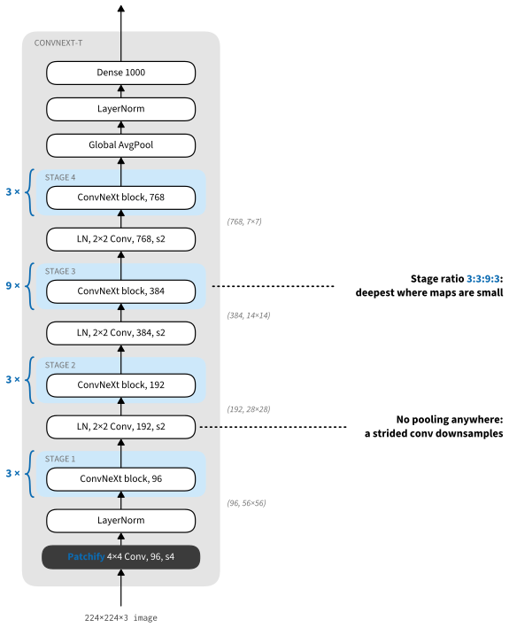
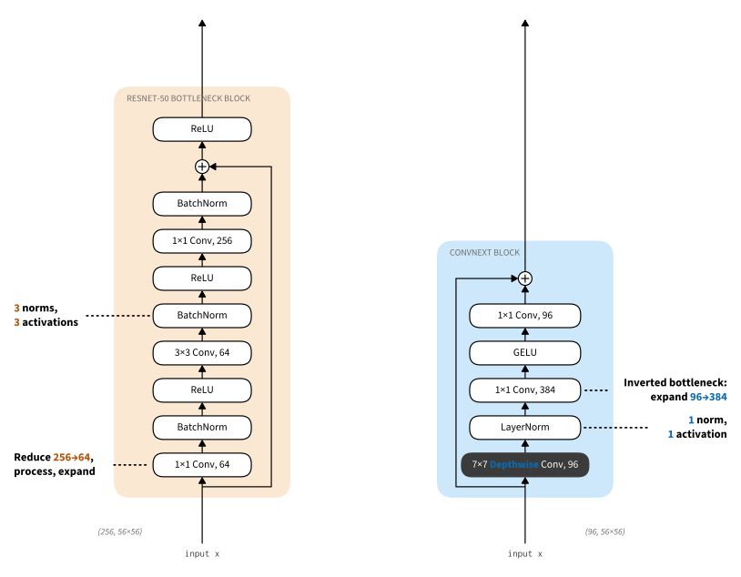

```{.python .input}
%load_ext d2lbook.tab
tab.interact_select('mxnet', 'pytorch', 'tensorflow', 'jax')
```

# ConvNeXt: A ConvNet for the 2020s
:label:`sec_convnext`

By 2021, vision transformers :cite:`Dosovitskiy.Beyer.Kolesnikov.ea.2021` had taken over the top of the ImageNet leaderboard, and hierarchical variants such as the Swin transformer :cite:`liu2021swin` were displacing convnets as the default backbone for detection and segmentation. It was tempting to conclude that attention had made convolution obsolete. But a transformer differs from a 2015 ResNet in many ways besides attention: its training recipe, its stem, its activation function, its normalization layers, the shape and depth of its stages. Which of these differences actually carried the improvement?

:citet:`liu2022convnet` answered by experiment. Starting from a ResNet-50, they applied one transformer-inspired design change at a time, measured ImageNet accuracy after each, kept what helped, and never added attention. The end point, named ConvNeXt, reaches 82.0% top-1 accuracy where the Swin-T transformer of the same computational cost reaches 81.3%. The exercise is the best guided tour of modern architecture design we know of, because every step uses a concept this book has already taught: training recipes (:numref:`sec_training_recipes`), depthwise convolutions (:numref:`sec_depthwise_separable`), the inverted bottleneck (:numref:`sec_efficient_cnns`), receptive fields (:eqref:`eq_receptive_field`), and normalization layers (:numref:`sec_batch_norm`). In this section we walk the roadmap, implement the result, and train a scaled-down ConvNeXt with the modern recipe of :numref:`sec_training_recipes`.

```{.python .input #convnext-imports}
%%tab mxnet
from d2l import mxnet as d2l
import math
import mxnet as mx
from mxnet import gluon, init, np, npx
from mxnet.gluon import nn
npx.set_np()
```

```{.python .input #convnext-imports}
%%tab pytorch
from d2l import torch as d2l
import math
import torch
from torch import nn
from torch.nn import functional as F
```

```{.python .input #convnext-imports}
%%tab tensorflow
import tensorflow as tf
from d2l import tensorflow as d2l
```

```{.python .input #convnext-imports}
%%tab jax
from d2l import jax as d2l
from flax import nnx
import jax
from jax import numpy as jnp
import optax
```

## The Modernization Roadmap

:numref:`tab_convnext_roadmap` shows the full sequence. Each row keeps every change above it, so the accuracies are cumulative; the computational cost is held near that of Swin-T (about 4.5 GFLOPs) throughout.

:The ConvNeXt modernization roadmap :cite:`liu2022convnet`. ImageNet-1K top-1 accuracy of a ResNet-50 as design changes accumulate; each row includes all rows above it, at roughly constant cost. Swin-T, the transformer of the same cost, reaches 81.3%.
:label:`tab_convnext_roadmap`

| Change | What it means | Top-1 |
|:--|:--|:--|
| (starting point) | ResNet-50 with its 2015 recipe | 76.1% |
| Modern training recipe | 300 epochs, AdamW, Mixup, label smoothing, stochastic depth (:numref:`sec_training_recipes`) | 78.8% |
| Stage ratio | blocks per stage $(3, 4, 6, 3) \to (3, 3, 9, 3)$ | 79.4% |
| Patchify stem | $7 \times 7$ stride-2 convolution plus pooling $\to$ one $4 \times 4$ stride-4 convolution | 79.5% |
| Depthwise convolutions | the $3 \times 3$ convolution becomes depthwise; width grows from 64 to 96 channels | 80.5% |
| Inverted bottleneck | expand $4\times$ inside the block instead of compressing | 80.6% |
| Large kernels | depthwise convolution moved to the front and enlarged to $7 \times 7$ | 80.6% |
| ReLU $\to$ GELU | a smooth activation, as in transformers | 80.6% |
| Fewer activations | one activation per block instead of three | 81.3% |
| Fewer normalizations | one normalization per block instead of three | 81.4% |
| BN $\to$ LN | layer normalization over channels at each position | 81.5% |
| Separate downsampling | an LN plus $2 \times 2$ stride-2 convolution between stages | 82.0% |

The first row is the largest single jump, and it is not an architecture change at all. The 2.7 points it contributes are the recipe effect of :numref:`sec_training_recipes` (the "ResNet strikes back" study pushed the same network to 80.4% with a still longer 600-epoch procedure :cite:`wightman2021resnet`). Keep this split in mind for everything below: of the 5.9 points separating the 2015 ResNet-50 from ConvNeXt, 2.7 are training and 3.2 are architecture. Papers that compared a well-tuned transformer against a 2015-recipe ResNet were, in large part, comparing recipes.

### Macro design

The next two rows change the network's silhouette. Swin-T distributes its blocks across the four stages in the ratio $1{:}1{:}3{:}1$, spending most of its depth where the feature maps are small and each block is cheap; adopting the same ratio, $(3, 3, 9, 3)$ blocks instead of ResNet-50's $(3, 4, 6, 3)$, adds 0.6 points. The stem changes more. ResNet begins with a $7 \times 7$ stride-2 convolution followed by max-pooling, a fourfold reduction computed with overlapping windows. Vision transformers instead slice the image into non-overlapping patches, which is just a strided convolution whose kernel size equals its stride (:numref:`sec_padding`): a $4 \times 4$ convolution with stride 4. This *patchify* stem replaces the ResNet stem with no loss (79.5%), and its output, one feature vector per $4 \times 4$ patch, is the same object a transformer calls a patch embedding.

### Depthwise convolutions and the inverted bottleneck

The attention core of a transformer mixes information *across positions* using
one weight pattern per head. Its query, key, value, and output projections also
mix channels. The MLP that follows mixes channels independently at each
position. MobileNet factorizes a convolution in a related way: a depthwise
convolution mixes positions within each channel, then $1 \times 1$ convolutions
mix channels (:numref:`sec_depthwise_separable`). Making the ResNet
bottleneck's $3 \times 3$ convolution depthwise, and spending the savings on
width (64 to 96 channels, matching Swin-T), brings 80.5%. Inverting the
bottleneck so that the block expands its thin residual stream by $4\times$ and
projects back adds a little more (80.6%). We saw in
:numref:`sec_efficient_cnns` why this shape is economical once the spatial
convolution is depthwise. The transformer's MLP uses the same factor-four
pointwise expand--activate--project substructure; ConvNeXt adds the depthwise
spatial mixer before it.

With the expensive dense convolution gone, kernel size stops being a luxury. Moving the depthwise convolution to the front of the block (so the cheap operation sees the unexpanded stream; this alone temporarily costs 0.7 points) and enlarging it from $3 \times 3$ to $7 \times 7$ recovers the loss at lower cost. By :eqref:`eq_receptive_field`, a $7 \times 7$ kernel grows the receptive field as fast as three stacked $3 \times 3$ layers, the trade VGG once resolved in favor of depth (:numref:`sec_vgg`) when kernels were dense and their cost quadratic. Depthwise, a $7 \times 7$ kernel costs only $49/9 \approx 5\times$ a $3 \times 3$ one on the depthwise term alone, a small fraction of the block. The authors report that accuracy saturates at $7 \times 7$: kernels of $9 \times 9$ and $11 \times 11$ buy nothing further at this scale.

### Micro design

The remaining rows are small and, cumulatively, decisive. Replacing ReLU by GELU, the smooth activation used in transformers and in essentially every large language model, changes nothing by itself (80.6%). What matters is *how many* activations and normalizations the block contains. A ResNet bottleneck interleaves a normalization and an activation after every convolution: three of each. A transformer block applies one activation, inside its MLP, and one or two normalizations. Deleting all but one GELU (between the two $1 \times 1$ convolutions) adds 0.7 points, more than any other micro-design change; deleting all but one normalization adds a little more, and swapping that survivor from batch normalization to layer normalization, applied over the channels at each spatial position, another tenth (81.5%). The lesson of :numref:`sec_batch_norm` reappears: normalization is scaffolding for optimization, and less of it, placed well, can be better. :numref:`fig_resnet_vs_convnext_block` shows the before and after.


:label:`fig_resnet_vs_convnext_block`

Finally, ResNet downsamples inside the first block of each stage, by giving its $3 \times 3$ convolution a stride of 2. Swin instead uses a separate patch-merging layer between stages. Adopting the same separation, a layer normalization followed by a $2 \times 2$ stride-2 convolution between stages (plus a normalization after the stem and one before the classifier head, which the authors found necessary for stable training), completes the roadmap at 82.0%. :numref:`fig_convnext` shows the assembled ConvNeXt-T: a patchify stem, four stages of $(3, 3, 9, 3)$ blocks at widths $(96, 192, 384, 768)$, downsampling layers between them, and a global-average-pooling head, the stem-body-head layout this chapter has used since :numref:`sec_googlenet`.


:label:`fig_convnext`

Where does this leave the convnet-versus-transformer question? At this scale, even: a pure convnet, given the transformer's recipe and design sensibilities, matches or slightly beats the transformer, and the paper shows the result persists for larger variants and transfers to COCO detection and ADE20K segmentation, the benchmarks that :numref:`sec_training_recipes` argued still discriminate. What the roadmap does not show is a convnet *advantage*: the two families, tuned by the same hands, land in the same place. We return to what that means in :numref:`sec_cnn-design`.

## Implementation

ConvNeXt is easy to build precisely because the roadmap removed things. A block is six operations; the network is the familiar arch-tuple loop.

### The ConvNeXt block

The block applies, in order: a $7 \times 7$ depthwise convolution, layer normalization, a $1 \times 1$ convolution expanding the channels $4\times$, a GELU, and a $1 \times 1$ convolution projecting back, with the result added to the input. Two refinements from the paper's training setup come along. *Layer scale* multiplies the branch by a learnable per-channel vector $\gamma$ initialized to $10^{-6}$, so every block starts as a near-identity and the network begins training as a shallow function that gradually deepens; the technique was introduced for very deep vision transformers :cite:`touvron2021cait` and helps stability here too. *Stochastic depth*, :eqref:`eq_stochastic_depth` of :numref:`sec_training_recipes`, randomly drops the whole branch per sample during training.

One implementation detail deserves attention, because it is the
layer-normalization placement that the roadmap's LN row depends on. ConvNeXt
normalizes over the *channels at each spatial position*, the same normalization
a transformer applies to each token. In a channels-last layout (samples,
height, width, channels) this is the library default, and a $1 \times 1$
convolution is a linear layer applied to the last axis. Our PyTorch
implementation therefore permutes to channels-last inside the block, while
TensorFlow and JAX are channels-last natively. MXNet stays channels-first and
normalizes `axis=1`.

:begin_tab:`mxnet`
The MXNet block implements the deterministic ConvNeXt transformation and layer
scale. This reduced variant omits stochastic depth; PyTorch, JAX, and
TensorFlow include the per-sample mask used for training.
:end_tab:

```{.python .input #convnext-block}
%%tab pytorch
def drop_path(Y, p, training):  # Stochastic depth, as in the previous section
    if not training or p == 0:
        return Y
    keep = (torch.rand(Y.shape[0], 1, 1, 1, device=Y.device) > p).float()
    return Y * keep / (1 - p)

class ConvNeXtBlock(nn.Module):
    """Depthwise 7x7, LN, 1x1 expand, GELU, 1x1 project, scaled residual."""
    def __init__(self, dim, drop_prob=0.0, layer_scale=1e-6):
        super().__init__()
        self.dwconv = nn.Conv2d(dim, dim, kernel_size=7, padding=3,
                                groups=dim)
        self.norm = nn.LayerNorm(dim, eps=1e-6)
        self.pwconv1 = nn.Linear(dim, 4 * dim)  # 1x1 conv in channels-last
        self.pwconv2 = nn.Linear(4 * dim, dim)
        self.gamma = nn.Parameter(layer_scale * torch.ones(dim))
        self.drop_prob = drop_prob

    def forward(self, X):
        Y = self.dwconv(X).permute(0, 2, 3, 1)  # to channels-last
        Y = self.pwconv2(F.gelu(self.pwconv1(self.norm(Y))))
        Y = (self.gamma * Y).permute(0, 3, 1, 2)  # back to channels-first
        return X + drop_path(Y, self.drop_prob, self.training)
```

```{.python .input #convnext-block}
%%tab mxnet
class ConvNeXtBlock(nn.Block):
    """Depthwise 7x7, LN, 1x1 expand, GELU, 1x1 project, scaled residual."""
    def __init__(self, dim, layer_scale=1e-6):
        super().__init__()
        self.dwconv = nn.Conv2D(dim, kernel_size=7, padding=3, groups=dim)
        self.norm = nn.LayerNorm(axis=1, epsilon=1e-6)
        self.pwconv1 = nn.Conv2D(4 * dim, kernel_size=1)
        self.act = nn.GELU()
        self.pwconv2 = nn.Conv2D(dim, kernel_size=1)
        self.gamma = gluon.Parameter('gamma', shape=(1, dim, 1, 1),
                                     init=init.Constant(layer_scale))

    def forward(self, X):
        Y = self.norm(self.dwconv(X))
        Y = self.pwconv2(self.act(self.pwconv1(Y)))
        return X + self.gamma.data() * Y
```

```{.python .input #convnext-block}
%%tab tensorflow
class ConvNeXtBlock(tf.keras.layers.Layer):
    """Depthwise 7x7, LN, 1x1 expand, GELU, 1x1 project, scaled residual."""
    def __init__(self, dim, drop_prob=0.0, layer_scale=1e-6):
        super().__init__()
        self.dwconv = tf.keras.layers.DepthwiseConv2D(kernel_size=7,
                                                      padding='same')
        self.norm = tf.keras.layers.LayerNormalization(epsilon=1e-6)
        self.pwconv1 = tf.keras.layers.Dense(4 * dim)
        self.pwconv2 = tf.keras.layers.Dense(dim)
        self.gamma = self.add_weight(
            shape=(dim,),
            initializer=tf.keras.initializers.Constant(layer_scale))
        self.drop_prob = drop_prob

    def call(self, X, training=False):
        Y = self.norm(self.dwconv(X))
        Y = self.pwconv2(tf.keras.activations.gelu(self.pwconv1(Y)))
        Y = self.gamma * Y
        if training and self.drop_prob > 0:
            keep = tf.cast(tf.random.uniform((tf.shape(Y)[0], 1, 1, 1))
                           > self.drop_prob, Y.dtype)
            Y = Y * keep / (1 - self.drop_prob)
        return X + Y
```

```{.python .input #convnext-block}
%%tab jax
class ConvNeXtBlock(nnx.Module):
    """Depthwise 7x7, LN, 1x1 expand, GELU, 1x1 project, scaled residual."""
    deterministic: bool

    def __init__(self, dim, drop_prob=0.0, layer_scale=1e-6, rngs=None):
        rngs = (nnx.Rngs(params=d2l.get_key(), dropout=d2l.get_key())
                if rngs is None else rngs)
        self.dim, self.drop_prob = dim, drop_prob
        self.deterministic = False
        self.rngs = rngs
        self.dwconv = nnx.Conv(dim, dim, kernel_size=(7, 7), padding='same',
                               feature_group_count=dim, rngs=rngs)
        self.norm = nnx.LayerNorm(dim, epsilon=1e-6, rngs=rngs)
        self.pwconv1 = nnx.Linear(dim, 4 * dim, rngs=rngs)
        self.pwconv2 = nnx.Linear(4 * dim, dim, rngs=rngs)
        self.gamma = nnx.Param(layer_scale * jnp.ones(dim))

    def set_view(self, *, deterministic):
        self.deterministic = deterministic

    def __call__(self, X):
        Y = self.norm(self.dwconv(X))
        Y = self.pwconv2(nnx.gelu(self.pwconv1(Y)))
        Y = self.gamma * Y
        if not self.deterministic and self.drop_prob > 0:
            keep = jax.random.bernoulli(
                self.rngs.dropout(), 1 - self.drop_prob,
                (X.shape[0], 1, 1, 1))
            Y = Y * keep / (1 - self.drop_prob)
        return X + Y
```

### The full network

The network is the arch-tuple pattern of :numref:`sec_vgg` one more time: a tuple of (depth, channels) pairs, a stem, a loop, a head. The stem is the patchify convolution plus a normalization. Between stages sits the separate downsampling layer, a normalization followed by a $2 \times 2$ stride-2 convolution; there is no pooling anywhere in the body. Following the paper, the per-block stochastic-depth probability ramps linearly from zero at the first block to its maximum at the last. Our dimensions are a scaled-down ConvNeXt sized for Fashion-MNIST, near the "atto" end of the family: widths $(40, 80, 160, 320)$ and depths $(2, 2, 6, 2)$, with the third stage deepest as in the full model.

```{.python .input #convnext-model}
%%tab pytorch
class LayerNorm2d(nn.LayerNorm):
    """LayerNorm over the channel axis of an NCHW tensor."""
    def forward(self, X):
        return super().forward(X.permute(0, 2, 3, 1)).permute(0, 3, 1, 2)

class ConvNeXt(d2l.Classifier):
    arch = ((2, 40), (2, 80), (6, 160), (2, 320))

    def __init__(self, lr=2e-3, num_classes=10, drop_path_max=0.1):
        super().__init__()
        self.save_hyperparameters()
        depths = [d for d, c in self.arch]
        rates = torch.linspace(0, drop_path_max, sum(depths)).tolist()
        layers = [nn.Conv2d(1, self.arch[0][1], kernel_size=4, stride=4),
                  LayerNorm2d(self.arch[0][1], eps=1e-6)]
        c_prev, b = self.arch[0][1], 0
        for i, (depth, c) in enumerate(self.arch):
            if i > 0:  # separate downsampling layer between stages
                layers += [LayerNorm2d(c_prev, eps=1e-6),
                           nn.Conv2d(c_prev, c, kernel_size=2, stride=2)]
            for _ in range(depth):
                layers.append(ConvNeXtBlock(c, drop_prob=rates[b]))
                b += 1
            c_prev = c
        layers += [nn.AdaptiveAvgPool2d((1, 1)), nn.Flatten(),
                   nn.LayerNorm(c_prev, eps=1e-6),
                   nn.Linear(c_prev, num_classes)]
        self.net = nn.Sequential(*layers)
```

```{.python .input #convnext-model}
%%tab mxnet
class ConvNeXt(d2l.Classifier):
    def __init__(self, arch=((2, 40), (2, 80), (6, 160), (2, 320)),
                 lr=2e-3, num_classes=10, drop_path_max=0.1):
        super().__init__()
        self.save_hyperparameters()
        self.net = nn.Sequential()
        self.net.add(nn.Conv2D(arch[0][1], kernel_size=4, strides=4),
                     nn.LayerNorm(axis=1, epsilon=1e-6))
        for i, (depth, c) in enumerate(arch):
            if i > 0:  # separate downsampling layer between stages
                self.net.add(nn.LayerNorm(axis=1, epsilon=1e-6),
                             nn.Conv2D(c, kernel_size=2, strides=2))
            for _ in range(depth):
                self.net.add(ConvNeXtBlock(c))
        self.net.add(nn.GlobalAvgPool2D(), nn.Flatten(),
                     nn.LayerNorm(axis=-1, epsilon=1e-6),
                     nn.Dense(num_classes))
        self.net.initialize(init.Xavier())
```

```{.python .input #convnext-model}
%%tab tensorflow
class ConvNeXt(d2l.Classifier):
    def __init__(self, arch=((2, 40), (2, 80), (6, 160), (2, 320)),
                 lr=2e-3, num_classes=10, drop_path_max=0.1):
        super().__init__()
        self.save_hyperparameters()
        self.net = tf.keras.models.Sequential([
            tf.keras.layers.Conv2D(arch[0][1], kernel_size=4, strides=4),
            tf.keras.layers.LayerNormalization(epsilon=1e-6)])
        rates = tf.linspace(0.0, drop_path_max, sum(d for d, _ in arch))
        b = 0
        for i, (depth, c) in enumerate(arch):
            if i > 0:  # separate downsampling layer between stages
                self.net.add(tf.keras.layers.LayerNormalization(
                    epsilon=1e-6))
                self.net.add(tf.keras.layers.Conv2D(c, kernel_size=2,
                                                    strides=2))
            for _ in range(depth):
                self.net.add(ConvNeXtBlock(c, drop_prob=float(rates[b])))
                b += 1
        self.net.add(tf.keras.layers.GlobalAvgPool2D())
        self.net.add(tf.keras.layers.LayerNormalization(epsilon=1e-6))
        self.net.add(tf.keras.layers.Dense(num_classes))
```

```{.python .input #convnext-model}
%%tab jax
class ConvNeXt(d2l.Classifier):
    def __init__(self, arch=((2, 40), (2, 80), (6, 160), (2, 320)),
                 lr=2e-3, num_classes=10, drop_path_max=0.1, rngs=None):
        super().__init__()
        self.save_hyperparameters(ignore=['rngs'])
        rngs = (nnx.Rngs(params=d2l.get_key(), dropout=d2l.get_key(),
                         mixup=d2l.get_key()) if rngs is None else rngs)
        self.rngs = rngs
        layers = [nnx.Conv(1, arch[0][1], kernel_size=(4, 4),
                           strides=(4, 4), rngs=rngs),
                  nnx.LayerNorm(arch[0][1], epsilon=1e-6, rngs=rngs)]
        total = sum(d for d, _ in arch)
        rates = [drop_path_max * i / max(total - 1, 1)
                 for i in range(total)]
        b, c_prev = 0, arch[0][1]
        for i, (depth, c) in enumerate(arch):
            if i > 0:  # separate downsampling layer between stages
                layers += [nnx.LayerNorm(c_prev, epsilon=1e-6, rngs=rngs),
                           nnx.Conv(c_prev, c, kernel_size=(2, 2),
                                    strides=(2, 2), rngs=rngs)]
            for _ in range(depth):
                layers.append(ConvNeXtBlock(c, drop_prob=rates[b], rngs=rngs))
                b += 1
            c_prev = c
        layers += [lambda x: x.mean(axis=(1, 2)),  # global average pooling
                   nnx.LayerNorm(c_prev, epsilon=1e-6, rngs=rngs),
                   nnx.Linear(c_prev, num_classes, rngs=rngs)]
        self.net = nnx.Sequential(*layers)
```

:begin_tab:`jax`
Unlike every network since :numref:`sec_batch_norm`, this model carries no
batch statistics: layer normalization is a pure function of its input. The
`deterministic` mode controls stochastic depth rather than normalization,
and the module needs no mutable running statistics. Each block owns a
`dropout` RNG stream that advances when it samples per-example residual masks.
:end_tab:

A $96 \times 96$ input leaves the stem as a $24 \times 24$ map, and the three downsampling layers reduce it to $12 \times 12$, $6 \times 6$, and finally $3 \times 3$ before the head pools it away. We check the output shape and count parameters: 3,376,450, about a third of the 11.2 million in the ResNet-18 we trained in :numref:`sec_training_recipes`. The exact count is a stringent correctness check for any reimplementation, ours included, since a single wrongly sized layer changes it.

```{.python .input #convnext-params}
%%tab pytorch
model = ConvNeXt()
X = torch.randn(1, 1, 96, 96)
assert model.net(X).shape == (1, 10)
sum(p.numel() for p in model.parameters())
```

```{.python .input #convnext-params}
%%tab mxnet
model = ConvNeXt()
X = np.random.normal(0, 1, (1, 1, 96, 96))
assert model.net(X).shape == (1, 10)
sum(p.data().size for p in model.collect_params().values()
    if p.grad_req != 'null')
```

```{.python .input #convnext-params}
%%tab tensorflow
model = ConvNeXt()
X = tf.random.normal((1, 96, 96, 1))
assert model.net(X).shape == (1, 10)
sum(int(tf.size(w)) for w in model.net.trainable_weights)
```

```{.python .input #convnext-params}
%%tab jax
model = ConvNeXt()
X = jnp.zeros((1, 96, 96, 1))
assert nnx.view(model, deterministic=True)(X).shape == (1, 10)
sum(p.size for _, p in nnx.state(model, nnx.Param).flat_state())
```

### Training with the modern recipe

We train ConvNeXt with the compact modern recipe used in
:numref:`sec_training_recipes`: AdamW, cosine decay with warmup, label
smoothing, and Mixup. For a controlled local comparison, we train a ResNet-18
whose base width is reduced from 64 to 35 channels, giving it nearly the same
parameter count as our ConvNeXt. The two models share the data, recipe, epoch
budget, and the same seed.

:begin_tab:`mxnet`
The MXNet path above implements the deterministic ConvNeXt transformation but
omits stochastic depth and this repeated training comparison. Its available
AdamW, cosine-schedule, label-smoothing, and Mixup components are demonstrated
in :numref:`sec_training_recipes`.
:end_tab:

:begin_tab:`tensorflow`
TensorFlow implements the complete block, including stochastic depth, but
omits this repeated comparative training run. The corresponding AdamW,
warmup-cosine, label-smoothing, and Mixup components appear in
:numref:`sec_training_recipes`.
:end_tab:

```{.python .input #convnext-recipe}
%%tab pytorch
def cosine_warmup(epoch, max_epochs, base_lr, warmup=3):
    if epoch < warmup:
        return base_lr * (epoch + 1) / warmup
    t = (epoch - warmup) / (max_epochs - warmup)
    return base_lr * 0.5 * (1 + math.cos(math.pi * t))

def mixup(X, y, alpha):
    lam = float(torch.distributions.Beta(alpha, alpha).sample())
    perm = torch.randperm(X.shape[0], device=X.device)
    return lam * X + (1 - lam) * X[perm], y, y[perm], lam

class RecipeTrainer(d2l.Trainer):
    """A Trainer that sets the learning rate from the model's schedule."""
    def fit_epoch(self):
        for group in self.optim.param_groups:
            group['lr'] = cosine_warmup(self.epoch, self.max_epochs,
                                        self.model.lr)
        super().fit_epoch()

class ModernConvNeXt(ConvNeXt):
    """ConvNeXt under the modern recipe of the previous section."""
    def __init__(self, lr=2e-3, num_classes=10, drop_path_max=0.0):
        super().__init__(lr, num_classes, drop_path_max)

    def configure_optimizers(self):
        return torch.optim.AdamW(self.parameters(), lr=self.lr,
                                 weight_decay=0.05)

    def loss(self, y_hat, y):
        return F.cross_entropy(y_hat, y, label_smoothing=0.1)

    def training_step(self, batch):
        X, y_a, y_b, lam = mixup(*batch, alpha=0.2)
        y_hat = self(X)
        l = lam * self.loss(y_hat, y_a) + (1 - lam) * self.loss(y_hat, y_b)
        self.plot('loss', l, train=True)
        return l

class CompactResNet18(d2l.Classifier):
    """A parameter-matched ResNet-18 with base width 35."""
    def __init__(self, lr=2e-3, num_classes=10, base=35):
        super().__init__()
        self.save_hyperparameters()
        channels = (base, 2 * base, 4 * base, 8 * base)
        layers = [nn.Conv2d(1, base, 7, stride=2, padding=3),
                  nn.BatchNorm2d(base), nn.ReLU(),
                  nn.MaxPool2d(3, stride=2, padding=1)]
        for i, c in enumerate(channels):
            for j in range(2):
                down = i > 0 and j == 0
                layers.append(d2l.Residual(c, use_1x1conv=down,
                                           strides=2 if down else 1))
        layers += [nn.AdaptiveAvgPool2d((1, 1)), nn.Flatten(),
                   nn.Linear(channels[-1], num_classes)]
        self.net = nn.Sequential(*layers)

    configure_optimizers = ModernConvNeXt.configure_optimizers
    loss = ModernConvNeXt.loss
    training_step = ModernConvNeXt.training_step
```

```{.python .input #convnext-recipe}
%%tab jax
def mixup(key, X, y, alpha):
    key_lam, key_perm = jax.random.split(key)
    lam = jax.random.beta(key_lam, alpha, alpha)
    perm = jax.random.permutation(key_perm, X.shape[0])
    return lam * X + (1 - lam) * X[perm], y, y[perm], lam

class ModernConvNeXt(ConvNeXt):
    def __init__(self, lr=2e-3, num_classes=10, drop_path_max=0.0,
                 max_epochs=30, steps_per_epoch=468, rngs=None):
        super().__init__(lr=lr, num_classes=num_classes,
                         drop_path_max=drop_path_max, rngs=rngs)
        self.max_epochs, self.steps_per_epoch = max_epochs, steps_per_epoch

    def configure_optimizers(self):
        total = self.max_epochs * self.steps_per_epoch
        schedule = optax.warmup_cosine_decay_schedule(
            0.0, self.lr, 3 * self.steps_per_epoch, total)
        return optax.adamw(schedule, weight_decay=0.05)

    def training_step(self, batch):
        X, y = batch
        X, y_a, y_b, lam = mixup(self.rngs.mixup(), X, y, 0.2)
        logp = jax.nn.log_softmax(self(X))
        eye = jnp.eye(self.num_classes)
        ta = 0.9 * eye[y_a] + 0.1 / self.num_classes
        tb = 0.9 * eye[y_b] + 0.1 / self.num_classes
        return (lam * -(ta * logp).sum(axis=1).mean()
                + (1 - lam) * -(tb * logp).sum(axis=1).mean())

class CompactResNet18(d2l.Classifier):
    def __init__(self, lr=2e-3, num_classes=10, base=35, max_epochs=30,
                 steps_per_epoch=468, rngs=None):
        super().__init__()
        self.save_hyperparameters(ignore=['rngs'])
        rngs = (nnx.Rngs(params=d2l.get_key(), dropout=d2l.get_key(),
                         mixup=d2l.get_key()) if rngs is None else rngs)
        self.rngs = rngs
        channels = (base, 2 * base, 4 * base, 8 * base)
        layers = [nnx.Conv(1, base, (7, 7), strides=(2, 2),
                           padding='same', rngs=rngs),
                  nnx.BatchNorm(base, rngs=rngs), nnx.relu,
                  lambda x: nnx.max_pool(x, (3, 3), (2, 2), padding='SAME')]
        in_channels = base
        for i, c in enumerate(channels):
            for j in range(2):
                down = i > 0 and j == 0
                layers.append(d2l.Residual(
                    c, use_1x1conv=down,
                    strides=(2, 2) if down else (1, 1),
                    in_channels=in_channels, rngs=rngs))
                in_channels = c
        layers += [lambda x: x.mean(axis=(1, 2)),
                   nnx.Linear(channels[-1], num_classes, rngs=rngs)]
        self.net = nnx.Sequential(*layers)

    configure_optimizers = ModernConvNeXt.configure_optimizers
    training_step = ModernConvNeXt.training_step
```

We train for 30 epochs on the full Fashion-MNIST training set at $96 \times
96$, matching the modern-recipe ResNet-18 run of
:numref:`sec_training_recipes` epoch for epoch. We set ConvNeXt's stochastic
depth rate to zero in this comparison because the compact ResNet control does
not use it; the block implementation above still exercises the complete
stochastic-depth path.

```{.python .input #convnext-train}
%%tab pytorch
data = d2l.FashionMNIST(batch_size=128, resize=(96, 96))

def train_model(model_cls, seed):
    torch.manual_seed(seed)
    model = model_cls(lr=2e-3)
    trainer = RecipeTrainer(max_epochs=30, num_gpus=1)
    trainer.fit(model, data)
    model.eval()
    correct, n = 0.0, 0
    with torch.no_grad():
        for X, y in map(trainer.prepare_batch, data.val_dataloader()):
            correct += float(model.accuracy(
                model(X), y, averaged=False).sum())
            n += len(y)
    return model, correct / n

scores, models = {}, {}
for name, cls in (('ConvNeXt', ModernConvNeXt),
                  ('compact ResNet-18', CompactResNet18)):
    model, acc = train_model(cls, seed=1)
    models[name] = model
    scores[name] = acc
```

```{.python .input #convnext-train}
%%tab jax
data = d2l.FashionMNIST(batch_size=128, resize=(96, 96))
jax_scores = {}
for name, model in (
        ('ConvNeXt', ModernConvNeXt(
            steps_per_epoch=len(data.train_dataloader()))),
        ('compact ResNet-18', CompactResNet18(
            steps_per_epoch=len(data.train_dataloader())))):
    d2l.tf.random.set_seed(1)  # Match the tf.data order between models
    trainer = d2l.Trainer(max_epochs=30, num_gpus=1)
    trainer.fit(model, data)
    correct, n = 0.0, 0
    for X, y in data.val_dataloader():
        values = model.accuracy(trainer.val_model(X), y, averaged=False)
        correct += float(values.sum())
        n += len(y)
    jax_scores[name] = correct / n
```

```{.python .input #convnext-eval}
%%tab pytorch
for name, acc in scores.items():
    count = sum(p.numel() for p in models[name].parameters())
    print(f'{name}: {count:,} parameters, val acc {acc:.3f}')
```

```{.python .input #convnext-eval}
%%tab jax
jax_scores
```

| Model | Parameters | PyTorch accuracy | JAX accuracy |
|---|---:|---:|---:|
| ConvNeXt | 3,376,450 | ≈92% | ≈92% |
| Compact ResNet-18 | 3,348,320 | ≈94% | ≈94.5% |

This comparison asks a narrower question than the earlier run against the
11.2-million-parameter ResNet-18: at roughly 3.4 million parameters, does the
ConvNeXt block and stem help on upsampled Fashion-MNIST? Each entry is one
seeded run, rounded to the half point; the independent JAX run checks that
the result is not tied to one implementation. Here the compact
ResNet is ahead by about two points in both implementations. Even this control
is task-specific: it matches parameters, not latency or multiply-adds, and
every step in the published roadmap was selected on ImageNet at
$224\times224$. The local result therefore says that ConvNeXt's ImageNet
design choices do not automatically transfer to this small grayscale task; it
is not a general ranking of the architecture families.

## Beyond ConvNeXt

### ConvNeXt V2: pretraining and GRN

ConvNeXt closed the supervised gap, but by 2023 the frontier had moved to self-supervised pretraining, where transformers held an advantage: masked autoencoders :cite:`he2022masked` drop most input patches and train the network to reconstruct them, which is natural for a patch-sequence model and awkward for a convolution that slides across the holes. ConvNeXt V2 :cite:`woo2023convnextv2` adapted the idea with sparse convolutions that skip masked regions during pretraining. Doing so exposed a failure the authors traced to feature *collapse*: with the V1 block, many channels of the pretrained network go dead or redundant. Their fix, *Global Response Normalization* (GRN), is a three-line layer inserted after the block's GELU that computes each channel's global response norm, divides by the mean over channels, and uses the ratio to recalibrate the features, sharpening the contrast between channels and preventing collapse; it also replaces layer scale. The combination of the masked-autoencoder pretraining and GRN lifted the largest model to 88.9% ImageNet top-1 accuracy, at the time the best result trained on public data. Implementing GRN is one of the exercises, and it fits in about five lines.

### Large Kernels and Other Spatial Mixers

The roadmap's $7 \times 7$ kernel invited an obvious question: why stop there? RepLKNet :cite:`ding2022replknet` pushed depthwise kernels to $31 \times 31$, using the re-parameterization trick of :numref:`sec_efficient_cnns` to train a parallel small kernel that folds away at inference, and showed the effective receptive field widening dramatically, with the gains showing up mostly in detection and segmentation rather than classification. SLaK :cite:`liu2022slak` reached $51 \times 51$ by factorizing the kernel into two thin rectangular stripes plus dynamic sparsity. InternImage :cite:`wang2023internimage` took the opposite route to the same goal, a large *adaptive* receptive field, by building its blocks from deformable convolutions (DCNv3) whose sampling locations are input-dependent, and scaled to 3 billion parameters and state-of-the-art COCO detection. UniRepLKNet :cite:`ding2024unireplknet` carried large-kernel design across modalities, to audio, point clouds, and time series.

The durable result is narrower than a verdict on one winning operator. Modern
backbones need access to wide context, and ConvNeXt showed that a moderately
large depthwise kernel is one practical way to obtain it. Fixed kernels of
$31 \times 31$ and beyond have remained specialized: their reported gains are
strongest in dense prediction, and efficient training or inference often needs
re-parameterization, sparsity, or specialized kernels. Deformable operators
and attention provide alternative, input-dependent routes to wide context.

### ConvNeXt in 2026

ConvNeXt has aged into infrastructure. It is a standard strong-CNN backbone
in detection and segmentation toolkits, a common encoder choice where a
transformer's quadratic attention cost is unwelcome at high resolution, and
the convolutional tower in several widely used OpenCLIP image-text models
:cite:`radford2021learning`, where ConvNeXt encoders trained on
billion-scale image-text corpora remain among the strongest public
convolutional models. When a practitioner in 2026 says "just use a CNN",
the CNN they reach for is more often than not a ConvNeXt or something
shaped like one.

## Summary and Discussion

ConvNeXt is a controlled experiment wearing an architecture's name. One change
at a time, it turned a 2015 ResNet-50 into a network that matches Swin at equal
cost: a modern recipe, a Swin-like stage ratio, a patchify stem, depthwise
convolutions in an inverted bottleneck led by a $7 \times 7$ kernel, GELU, and
fewer normalization and activation layers. At the scales tested in the paper,
well-tuned convnets and transformers are competitive; the experiment does not
establish that either family dominates in every data and compute regime. Our
parameter-matched Fashion-MNIST comparison applies the same control discipline
to the smaller setting used in this book.

The block itself is a piece of convergent evolution. Depthwise convolution mixing space but not channels, a pointwise MLP expanding by four mixing channels but not space, one normalization, one activation, a residual connection: strip the names and the ConvNeXt block and the transformer block are the same design with different spatial mixers. That reading, which :numref:`sec_cnn-design` develops, is more durable than any single leaderboard number, including the ones in this section.

## Exercises

1. Implement Global Response Normalization. For a channels-last feature map $X$, compute per-channel global norms $g_c = \lVert X_{:,:,c} \rVert_2$, normalize them as $n_c = g_c / \bar{g}$ where $\bar{g}$ is the mean over channels, and return $\gamma \odot (X \cdot n) + \beta + X$ with learnable per-channel $\gamma, \beta$ initialized to zero. Insert it after the GELU in `ConvNeXtBlock` (ConvNeXt V2 also removes layer scale when doing so), retrain, and compare.
1. Swap the depthwise kernel size: train the model with $3 \times 3$ and with $11 \times 11$ depthwise convolutions (adjust the padding) and compare accuracy, parameter count, and time per epoch against the $7 \times 7$ baseline. Do you see the saturation that :citet:`liu2022convnet` report?
1. Count where the parameters live: for our ConvNeXt, compute the fraction of parameters in depthwise convolutions, in the $1 \times 1$ expansions and projections, and in the downsampling layers, and compare with the ResNet-18 of :numref:`sec_training_recipes`. Which design decision explains why ConvNeXt is three times smaller at the same depth-times-width feel?
1. Ablate layer scale: train with $\gamma$ initialized to $10^{-6}$ (the default), to $1$, and with the parameter removed entirely. Relate what you observe to stochastic depth, which also shrinks the effective contribution of each residual branch early in training.
1. Our run gives the modern recipe to a modern architecture. Complete the other half of the ablation square: train this ConvNeXt with the 2015 recipe of :numref:`sec_training_recipes` (SGD with momentum, step decay, no Mixup or smoothing). How much of the network's quality survives the recipe downgrade?

<!-- slides -->

::: {.slide title="The question in 2021"}
Vision transformers (ViT, then **Swin**) took over ImageNet and
detection/segmentation backbones.

But a transformer differs from a 2015 ResNet in *many* ways
besides attention: recipe, stem, activations, normalization,
stage shape.

. . .

**Liu et al., 2022**: change a ResNet-50 one step at a time toward
Swin's design, measure after each step, never add attention.

End point: **ConvNeXt, 82.0%** vs. Swin-T's 81.3% at equal FLOPs.
:::

::: {.slide title="The modernization roadmap"}
| Change | Top-1 |
|:--|:--|
| ResNet-50, 2015 recipe | 76.1% |
| modern training recipe | 78.8% |
| stage ratio (3,4,6,3) → (3,3,9,3) | 79.4% |
| patchify stem (4×4, stride 4) | 79.5% |
| depthwise conv + width 64 → 96 | 80.5% |
| inverted bottleneck | 80.6% |
| 7×7 depthwise, moved first | 80.6% |
| GELU; **fewer activations** | 81.3% |
| **fewer norms**; BN → LN | 81.5% |
| separate downsampling | **82.0%** |
:::

::: {.slide title="Read the first row first"}
The largest single jump, **+2.7 points, is the recipe**, not the
architecture (and RSB pushed the same ResNet-50 to 80.4%).

. . .

Of the 5.9 points from 2015 ResNet-50 to ConvNeXt:

- **2.7 training**, 3.2 architecture.

Papers comparing tuned transformers against 2015-recipe ResNets
were largely comparing recipes.
:::

::: {.slide title="Macro design"}
- **Stage ratio**: spend depth where maps are small,
  $(3,3,9,3)$ like Swin-T (+0.6).
- **Patchify stem**: a ViT patch embedding *is* a convolution
  whose kernel equals its stride: 4×4, stride 4 (79.5%).

No pooling, no 7×7 stem: one strided conv slices the image into
patches.
:::

::: {.slide title="The block, before and after"}
{width=88%}
:::

::: {.slide title="Why this shape"}
The transformer block factorizes: attention mixes **positions**,
the MLP mixes **channels**.

Convnets have owned that factorization since MobileNet:
depthwise conv + 1×1 convs.

- depthwise 3×3, width to 96: **80.5%**
- inverted bottleneck (expand 4×, like a transformer MLP): 80.6%
- depthwise kernel to **7×7** (cheap once depthwise): 80.6%,
  saturates beyond 7×7
- one GELU, one LayerNorm per block: **81.5%**
:::

::: {.slide title="ConvNeXt-T assembled"}
{width=46%}
:::

::: {.slide title="The block in code"}
LN over channels *at each position* (a transformer's LN): go
channels-last, then 1×1 convs are `Linear` layers:

@convnext-block@pytorch

Layer scale ($\gamma \approx 10^{-6}$): every block starts
near-identity. Stochastic depth: the same `drop_path` as in the
previous section.
:::

::: {.slide title="The network: the arch tuple again"}
Widths (40, 80, 160, 320), depths (2, 2, 6, 2), a scaled-down
"atto" ConvNeXt:

@convnext-model@pytorch
:::

::: {.slide title="Parameter count as a checksum"}
@convnext-params

**3,376,450 parameters**: one wrongly sized layer changes this
number, so matching it validates a reimplementation. A third of
ResNet-18's 11.2M.
:::

::: {.slide title="Train it with the modern recipe"}
ConvNeXt was never trained any other way: AdamW + cosine warmup +
label smoothing + Mixup, from the previous section:

@convnext-recipe@pytorch
:::

::: {.slide title="Results"}
@convnext-train@pytorch

@convnext-eval@pytorch
:::

::: {.slide title="Read the result plainly"}
- ConvNeXt, 3.4M params: **about 92%**.
- Parameter-matched Compact ResNet-18, 3.35M, same recipe and budget: **about 94%**.

. . .

The compact ResNet is ahead by about two points in both PyTorch and
JAX. The control matches parameters, not latency or multiply-adds.

Every roadmap step was selected on ImageNet at 224 px. On upsampled
28 px data, ResNet's overlapping stem + BN + size win.
**Architectures are good for a regime, not in the abstract.**
:::

::: {.slide title="ConvNeXt V2, briefly"}
Masked-autoencoder pretraining for convnets (**FCMAE**): sparse
convolutions skip the masked holes.

. . .

Pretraining exposed **feature collapse**; the fix is
**Global Response Normalization**: normalize each channel's global
response by the mean over channels (~5 lines; exercise 1).

Result: **88.9%** top-1, the best public-data model at the time.
:::

::: {.slide title="Large kernels, honestly"}
- **RepLKNet**: 31×31 depthwise (re-param trick to train).
- **SLaK**: 51×51 via stripes + sparsity.
- **InternImage**: deformable conv (DCNv3), adaptive field, 3B params.
- **UniRepLKNet**: large kernels across audio/points/time series.

. . .

Verdict: the *principle* (large effective receptive field, bought
depthwise) stuck. Giant dense kernels did not become defaults;
deformable/adaptive operators and attention carried it further.
:::

::: {.slide title="Recap"}
- ConvNeXt = a **controlled ablation**: ResNet-50 → 82.0%,
  matching Swin-T, with no attention.
- Largest step: the **recipe**. Then: patchify, depthwise +
  inverted bottleneck, 7×7, one norm + one activation, LN.
- Strip the names: ConvNeXt block ≡ transformer block with a
  depthwise conv as the spatial mixer.
- 2026: a default strong-CNN backbone (OpenCLIP towers,
  detection/segmentation encoders).
:::
