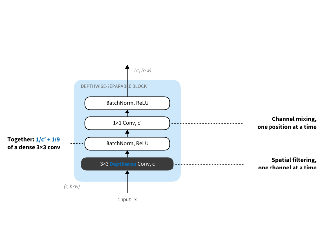
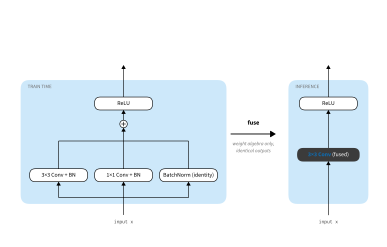

```{.python .input}
%load_ext d2lbook.tab
tab.interact_select('mxnet', 'pytorch', 'tensorflow', 'jax')
```

# Efficient ConvNets: Depthwise Separability, Mobile Architectures, and Re-parameterization
:label:`sec_efficient_cnns`

The architectures of this chapter so far were designed to win accuracy
benchmarks on datacenter GPUs. Many deployment settings instead involve
phones, cameras, cars, or embedded boards, where latency, memory, and power
matter directly. Efficient convolutional architectures organize this regime
around three ideas. First, *factorize*: replace dense convolutions with the
depthwise-separable convolutions of :numref:`sec_depthwise_separable`.
Second, *scale and search*: once the block is fixed, let optimization allocate
widths, depths, and resolutions. Third, *re-parameterize*: train a multi-branch
network, then deploy an algebraically identical single-branch one.

```{.python .input #efficient-convnets-imports}
%%tab mxnet
from d2l import mxnet as d2l
from mxnet import autograd, init, np, npx
from mxnet.gluon import nn
npx.set_np()
```

```{.python .input #efficient-convnets-imports}
%%tab pytorch
from d2l import torch as d2l
import torch
import statistics
import time
from torch import nn
from torch.nn import functional as F
```

```{.python .input #efficient-convnets-imports}
%%tab tensorflow
import tensorflow as tf
from d2l import tensorflow as d2l
```

```{.python .input #efficient-convnets-imports}
%%tab jax
from d2l import jax as d2l
from flax import linen as nn
import jax
from jax import numpy as jnp
import optax
```

## Depthwise-Separable Networks

### MobileNet

Recall from :numref:`sec_depthwise_separable` that a depthwise-separable convolution factorizes a dense $k \times k$ convolution into a per-channel spatial filter followed by a $1 \times 1$ channel mixture, cutting parameters and operations to a fraction $1/c_\textrm{o} + 1/k^2$ of the dense cost (:eqref:`eq_depthwise_sep_ratio`), roughly $1/9$ for $3 \times 3$ kernels. In :numref:`sec_channels` this was a layer-level observation. MobileNet :cite:`howard2017mobilenet` made it an architecture: the entire network is a stack of the block shown in :numref:`fig_dws_block`, a depthwise $3 \times 3$ convolution and a pointwise $1 \times 1$ convolution, each followed by batch normalization and a ReLU. Downsampling happens inside the block by giving the depthwise convolution a stride of 2, so there are no pooling layers, and a global average pooling head replaces fully connected layers, following NiN (:numref:`sec_nin`). The result matched the ImageNet accuracy of VGG-16 to within a percentage point using roughly $27\times$ fewer operations and $33\times$ fewer parameters. A single *width multiplier* $\alpha$ scales every channel count in the network, trading accuracy against cost along a smooth curve, so MobileNet is a family in the same sense that VGG is (:numref:`sec_vgg`).


:label:`fig_dws_block`

### The Inverted Bottleneck

The bottleneck blocks of ResNet and ResNeXt (:numref:`subsec_resnext`) compress: a $1 \times 1$ convolution reduces a wide representation, the $3 \times 3$ convolution works in the narrow space, and a final $1 \times 1$ convolution expands it back. This is the right trade when the $3 \times 3$ convolution is dense and therefore expensive. Once the spatial convolution is depthwise, however, it is cheap even on wide tensors, and the economics reverse. MobileNetV2 :cite:`sandler2018mobilenetv2` therefore *inverts* the bottleneck: the residual stream stays thin, a $1 \times 1$ convolution expands it (by a factor of 6 in the paper), the depthwise $3 \times 3$ convolution operates in the wide expanded space, and a $1 \times 1$ projection returns to the thin stream. The projection is *linear*: no ReLU follows it, because a ReLU acting on a low-dimensional representation discards information that cannot be recovered, which the paper demonstrates by ablation. The residual connection joins the thin ends, so the tensors that must be kept in memory across blocks are the small ones. That matters on a phone, where activation memory rather than parameter storage is often the binding constraint.

The inverted bottleneck outlived its mobile origins: ConvNeXt (:numref:`sec_convnext`) adopted the same shape for its blocks, with the depthwise convolution enlarged to $7 \times 7$ and moved to the front :cite:`liu2022convnet`. We will meet it again when we discuss design spaces in :numref:`sec_cnn-design`.

### A Mini-MobileNet

Let's build a small MobileNetV1-style network for Fashion-MNIST. We use the original block rather than the inverted bottleneck: it is the clearest expression of the factorization, and at Fashion-MNIST scale the difference is negligible. Real mobile networks since MobileNetV2 use inverted bottlenecks throughout. The block below is the pair from :numref:`fig_dws_block`; a stride of 2 downsamples.

```{.python .input #efficient-convnets-a-mini-mobilenet-1}
%%tab mxnet
def dws_block(in_channels, out_channels, strides=1):
    """Depthwise 3x3 and pointwise 1x1 convolutions, each with BN and ReLU."""
    blk = nn.Sequential()
    blk.add(nn.Conv2D(in_channels, kernel_size=3, strides=strides, padding=1,
                      groups=in_channels, use_bias=False),
            nn.BatchNorm(), nn.Activation('relu'),
            nn.Conv2D(out_channels, kernel_size=1, use_bias=False),
            nn.BatchNorm(), nn.Activation('relu'))
    return blk
```

```{.python .input #efficient-convnets-a-mini-mobilenet-1}
%%tab pytorch
def dws_block(in_channels, out_channels, stride=1):
    """Depthwise 3x3 and pointwise 1x1 convolutions, each with BN and ReLU."""
    return nn.Sequential(
        nn.Conv2d(in_channels, in_channels, kernel_size=3, stride=stride,
                  padding=1, groups=in_channels, bias=False),
        nn.BatchNorm2d(in_channels), nn.ReLU(),
        nn.Conv2d(in_channels, out_channels, kernel_size=1, bias=False),
        nn.BatchNorm2d(out_channels), nn.ReLU())
```

```{.python .input #efficient-convnets-a-mini-mobilenet-1}
%%tab tensorflow
class DWSBlock(tf.keras.layers.Layer):
    """Depthwise 3x3 and pointwise 1x1 convolutions, each with BN and ReLU."""
    def __init__(self, out_channels, strides=1):
        super().__init__()
        self.net = tf.keras.models.Sequential([
            tf.keras.layers.DepthwiseConv2D(kernel_size=3, strides=strides,
                                            padding='same', use_bias=False),
            tf.keras.layers.BatchNormalization(), tf.keras.layers.ReLU(),
            tf.keras.layers.Conv2D(out_channels, kernel_size=1,
                                   use_bias=False),
            tf.keras.layers.BatchNormalization(), tf.keras.layers.ReLU()])

    def call(self, X):
        return self.net(X)
```

```{.python .input #efficient-convnets-a-mini-mobilenet-1}
%%tab jax
class DWSBlock(nn.Module):
    """Depthwise 3x3 and pointwise 1x1 convolutions, each with BN and ReLU."""
    in_channels: int
    out_channels: int
    strides: tuple = (1, 1)
    training: bool = True

    @nn.compact
    def __call__(self, X):
        X = nn.Conv(self.in_channels, kernel_size=(3, 3),
                    strides=self.strides, padding='same',
                    feature_group_count=self.in_channels, use_bias=False)(X)
        X = nn.relu(nn.BatchNorm(not self.training)(X))
        X = nn.Conv(self.out_channels, kernel_size=(1, 1), use_bias=False)(X)
        return nn.relu(nn.BatchNorm(not self.training)(X))
```

Like VGG (:numref:`sec_vgg`), the whole network is a list of block parameters, here (channels, stride) pairs. A small convolutional stem lifts the grayscale input to 32 channels at half resolution; seven depthwise-separable blocks double the channels while shrinking the feature map; global average pooling and a linear layer produce the class scores.

```{.python .input #efficient-convnets-a-mini-mobilenet-2}
%%tab mxnet
class MiniMobileNet(d2l.Classifier):
    def __init__(self, arch=((64, 1), (128, 2), (128, 1), (256, 2), (256, 1),
                             (512, 2), (512, 1)),
                 lr=0.1, num_classes=10):
        super().__init__()
        self.save_hyperparameters()
        self.net = nn.Sequential()
        self.net.add(nn.Conv2D(32, kernel_size=3, strides=2, padding=1,
                               use_bias=False),
                     nn.BatchNorm(), nn.Activation('relu'))
        c = 32
        for c_out, strides in arch:
            self.net.add(dws_block(c, c_out, strides))
            c = c_out
        self.net.add(nn.GlobalAvgPool2D(), nn.Dense(num_classes))
        self.net.initialize(init.Xavier())
```

```{.python .input #efficient-convnets-a-mini-mobilenet-2}
%%tab pytorch
class MiniMobileNet(d2l.Classifier):
    def __init__(self, arch=((64, 1), (128, 2), (128, 1), (256, 2), (256, 1),
                             (512, 2), (512, 1)),
                 lr=0.1, num_classes=10):
        super().__init__()
        self.save_hyperparameters()
        layers = [nn.Conv2d(1, 32, kernel_size=3, stride=2, padding=1,
                            bias=False),
                  nn.BatchNorm2d(32), nn.ReLU()]
        c = 32
        for c_out, stride in arch:
            layers.append(dws_block(c, c_out, stride))
            c = c_out
        layers += [nn.AdaptiveAvgPool2d((1, 1)), nn.Flatten(),
                   nn.Linear(c, num_classes)]
        self.net = nn.Sequential(*layers)

    def configure_optimizers(self):
        return torch.optim.SGD(self.parameters(), lr=self.lr, momentum=0.9)
```

```{.python .input #efficient-convnets-a-mini-mobilenet-2}
%%tab tensorflow
class MiniMobileNet(d2l.Classifier):
    def __init__(self, arch=((64, 1), (128, 2), (128, 1), (256, 2), (256, 1),
                             (512, 2), (512, 1)),
                 lr=0.1, num_classes=10):
        super().__init__()
        self.save_hyperparameters()
        self.net = tf.keras.models.Sequential([
            tf.keras.layers.Conv2D(32, kernel_size=3, strides=2,
                                   padding='same', use_bias=False),
            tf.keras.layers.BatchNormalization(), tf.keras.layers.ReLU()])
        for out_channels, strides in arch:
            self.net.add(DWSBlock(out_channels, strides))
        self.net.add(tf.keras.layers.GlobalAvgPool2D())
        self.net.add(tf.keras.layers.Dense(num_classes))

    def configure_optimizers(self):
        return tf.keras.optimizers.SGD(self.lr, momentum=0.9)
```

```{.python .input #efficient-convnets-a-mini-mobilenet-2}
%%tab jax
class MiniMobileNet(d2l.Classifier):
    arch: tuple = ((64, 1), (128, 2), (128, 1), (256, 2), (256, 1),
                   (512, 2), (512, 1))
    lr: float = 0.1
    num_classes: int = 10
    training: bool = True

    def setup(self):
        layers = [nn.Conv(32, kernel_size=(3, 3), strides=(2, 2),
                          padding='same', use_bias=False),
                  nn.BatchNorm(not self.training), nn.relu]
        c = 32
        for c_out, s in self.arch:
            layers.append(DWSBlock(c, c_out, (s, s), self.training))
            c = c_out
        layers.extend([lambda x: x.mean(axis=(1, 2)),  # global average pooling
                       nn.Dense(self.num_classes)])
        self.net = nn.Sequential(layers)

    def configure_optimizers(self):
        return optax.sgd(self.lr, momentum=0.9)
```

Before training, let's verify the arithmetic that motivates the design. The network below has 542,474 trainable parameters. A twin with each depthwise-separable pair replaced by one dense $3 \times 3$ convolution at the same widths would need $9 \sum_l c_{\textrm{i},l}\, c_{\textrm{o},l} \approx 4.7$ million parameters in its body, about $8.8\times$ more, matching the prediction of :eqref:`eq_depthwise_sep_ratio` for these channel counts.

```{.python .input #efficient-convnets-a-mini-mobilenet-3}
%%tab mxnet
model = MiniMobileNet()
X = d2l.normal(0, 1, (1, 1, 96, 96))
assert model.net(X).shape == (1, 10)
sum(p.data().size for p in model.collect_params().values()
    if p.grad_req != 'null')
```

```{.python .input #efficient-convnets-a-mini-mobilenet-3}
%%tab pytorch
model = MiniMobileNet()
X = d2l.randn(1, 1, 96, 96)
assert model.net(X).shape == (1, 10)
sum(p.numel() for p in model.parameters())
```

```{.python .input #efficient-convnets-a-mini-mobilenet-3}
%%tab tensorflow
model = MiniMobileNet()
X = d2l.normal((1, 96, 96, 1), 0, 1)
assert model.net(X).shape == (1, 10)
sum(int(tf.size(w)) for w in model.net.trainable_weights)
```

```{.python .input #efficient-convnets-a-mini-mobilenet-3}
%%tab jax
model = MiniMobileNet(training=False)
X = jnp.zeros((1, 96, 96, 1))
params = model.init(d2l.get_key(), X)
assert model.apply(params, X).shape == (1, 10)
sum(p.size for p in jax.tree_util.tree_leaves(params['params']))
```

### Training and Comparison

Parameter counts alone do not settle whether the factorization gives anything
up, so we train the mini-MobileNet against a plain VGG-style network
(:numref:`sec_vgg`) at the *same parameter budget*. Dense $3 \times 3$
convolutions spend parameters roughly nine times faster per pair of channel
counts, so the dense network stops at 128 channels where the separable one
reaches 512. Both use batch normalization and an identical
global-average-pooling head. The comparison matches parameter count, input
resolution, optimizer, and training budget; the separable block and the wider
channel allocation it permits change together.

:begin_tab:`mxnet`
The MXNet path implements and verifies the MobileNet blocks and the RepVGG
fusion algebra. It omits this repeated comparative training run; PyTorch uses
three seeds, while JAX and TensorFlow execute independent comparisons.
:end_tab:

```{.python .input #efficient-convnets-training-and-comparison-1}
%%tab pytorch
def vgg_stage(num_convs, in_channels, out_channels):
    layers = []
    for _ in range(num_convs):
        layers += [nn.Conv2d(in_channels, out_channels, kernel_size=3,
                             padding=1, bias=False),
                   nn.BatchNorm2d(out_channels), nn.ReLU()]
        in_channels = out_channels
    layers.append(nn.MaxPool2d(2))
    return layers

class VGGSmall(d2l.Classifier):
    """A dense VGG-style network with the same parameter budget."""
    def __init__(self, arch=((2, 32), (2, 64), (2, 128), (2, 128)),
                 lr=0.1, num_classes=10):
        super().__init__()
        self.save_hyperparameters()
        layers, c = [], 1
        for num_convs, c_out in arch:
            layers += vgg_stage(num_convs, c, c_out)
            c = c_out
        layers += [nn.AdaptiveAvgPool2d((1, 1)), nn.Flatten(),
                   nn.Linear(c, num_classes)]
        self.net = nn.Sequential(*layers)

    def configure_optimizers(self):
        return torch.optim.SGD(self.parameters(), lr=self.lr, momentum=0.9)
```

```{.python .input #efficient-convnets-training-and-comparison-1}
%%tab tensorflow
class VGGSmall(d2l.Classifier):
    """A dense VGG-style network with the same parameter budget."""
    def __init__(self, arch=((2, 32), (2, 64), (2, 128), (2, 128)),
                 lr=0.1, num_classes=10):
        super().__init__()
        self.save_hyperparameters()
        self.net = tf.keras.Sequential()
        for num_convs, c_out in arch:
            for _ in range(num_convs):
                self.net.add(tf.keras.layers.Conv2D(
                    c_out, 3, padding='same', use_bias=False))
                self.net.add(tf.keras.layers.BatchNormalization())
                self.net.add(tf.keras.layers.ReLU())
            self.net.add(tf.keras.layers.MaxPool2D(2))
        self.net.add(tf.keras.layers.GlobalAvgPool2D())
        self.net.add(tf.keras.layers.Dense(num_classes))

    def configure_optimizers(self):
        return tf.keras.optimizers.SGD(self.lr, momentum=0.9)
```

```{.python .input #efficient-convnets-training-and-comparison-1}
%%tab jax
class VGGSmall(d2l.Classifier):
    """A dense VGG-style network with the same parameter budget."""
    arch: tuple = ((2, 32), (2, 64), (2, 128), (2, 128))
    lr: float = 0.1
    num_classes: int = 10
    training: bool = True

    def setup(self):
        layers = []
        for num_convs, c_out in self.arch:
            for _ in range(num_convs):
                layers += [nn.Conv(c_out, (3, 3), padding='same',
                                   use_bias=False),
                           nn.BatchNorm(not self.training), nn.relu]
            layers.append(lambda x: nn.max_pool(x, (2, 2), (2, 2)))
        layers += [lambda x: x.mean(axis=(1, 2)), nn.Dense(self.num_classes)]
        self.net = nn.Sequential(layers)

    def configure_optimizers(self):
        return optax.sgd(self.lr, momentum=0.9)
```

We train both for 10 epochs on Fashion-MNIST at $96 \times 96$ resolution, with the same trainer and data pipeline we used for ResNet-18 in :numref:`sec_resnet`.

```{.python .input #efficient-convnets-training-and-comparison-2}
%%tab pytorch
data = d2l.FashionMNIST(batch_size=128, resize=(96, 96))

def val_acc(model, data):
    model.eval()
    correct, n = 0.0, 0
    with torch.no_grad():
        for X, y in data.val_dataloader():
            X, y = X.to(d2l.gpu()), y.to(d2l.gpu())
            correct += float(model.accuracy(model(X), y,
                                            averaged=False).sum())
            n += len(y)
    return correct / n

def train_one(model_cls, seed):
    torch.manual_seed(seed)
    model = model_cls(lr=0.05)
    trainer = d2l.Trainer(max_epochs=10, num_gpus=1)
    torch.manual_seed(seed)  # Match minibatch order across the two models
    start = time.perf_counter()
    trainer.fit(model, data)
    return model, val_acc(model, data), (time.perf_counter() - start) / 10
```

```{.python .input #efficient-convnets-training-and-comparison-2}
%%tab jax
data = d2l.FashionMNIST(batch_size=128, resize=(96, 96))

def train_jax(model_cls, seed):
    d2l.tf.random.set_seed(seed)  # Seed the tf.data shuffle used by JAX
    model = model_cls(lr=0.05, training=True)
    trainer = d2l.Trainer(max_epochs=10, num_gpus=1)
    trainer.fit(model, data, key=jax.random.key(seed))
    correct, n = 0.0, 0
    for X, y in data.val_dataloader():
        values = model.accuracy(trainer.state.params, (X,), y,
                                trainer.state, averaged=False)
        correct += float(values.sum())
        n += len(y)
    return model, trainer, correct / n
```

```{.python .input #efficient-convnets-training-and-comparison-2}
%%tab tensorflow
data = d2l.FashionMNIST(batch_size=128, resize=(96, 96))
mobile = MiniMobileNet(lr=0.05)
mobile_trainer = d2l.Trainer(max_epochs=10)
tf.random.set_seed(1)
with d2l.try_gpu():
    mobile_trainer.fit(mobile, data)
```

```{.python .input #efficient-convnets-training-and-comparison-3}
%%tab pytorch
runs = {'mini-MobileNet': [], 'VGG-style': []}
models = {}
for seed in (1, 2, 3):
    for name, cls in (('mini-MobileNet', MiniMobileNet),
                      ('VGG-style', VGGSmall)):
        model, acc, seconds = train_one(cls, seed)
        models[name] = model
        runs[name].append((acc, seconds))
```

```{.python .input #efficient-convnets-training-and-comparison-3}
%%tab jax
jax_runs = {'mini-MobileNet': [], 'VGG-style': []}
jax_models, jax_trainers = {}, {}
for seed in (1, 2, 3):
    for name, cls in (('mini-MobileNet', MiniMobileNet),
                      ('VGG-style', VGGSmall)):
        model, trainer, acc = train_jax(cls, seed)
        jax_models[name], jax_trainers[name] = model, trainer
        jax_runs[name].append(acc)
```

```{.python .input #efficient-convnets-training-and-comparison-3}
%%tab tensorflow
vgg = VGGSmall(lr=0.05)
vgg_trainer = d2l.Trainer(max_epochs=10)
tf.random.set_seed(1)
with d2l.try_gpu():
    vgg_trainer.fit(vgg, data)
```

```{.python .input #efficient-convnets-training-and-comparison-4}
%%tab pytorch
for name, values in runs.items():
    accs, seconds = zip(*values)
    params = sum(p.numel() for p in models[name].parameters())
    print(f'{name}: {params:,} params, '
          f'val acc {statistics.mean(accs):.3f} ± {statistics.stdev(accs):.3f}, '
          f'{statistics.mean(seconds):.1f} s/epoch; seeds '
          f'{[round(x, 3) for x in accs]}')
```

```{.python .input #efficient-convnets-training-and-comparison-4}
%%tab jax
for name, values in jax_runs.items():
    model, trainer = jax_models[name], jax_trainers[name]
    count = sum(p.size for p in
                jax.tree_util.tree_leaves(trainer.state.params))
    accs = jnp.array(values)
    print(f'{name}: {count:,} params, val acc '
          f'{float(accs.mean()):.3f} ± {float(accs.std(ddof=1)):.3f}; '
          f'seeds {[round(x, 3) for x in values]}')
```

```{.python .input #efficient-convnets-training-and-comparison-4}
%%tab tensorflow
def val_acc(model, data):
    correct, n = 0.0, 0
    for X, y in data.val_dataloader():
        values = model.accuracy(model(X, training=False), y,
                                averaged=False)
        correct += float(tf.reduce_sum(values))
        n += len(y)
    return correct / n

for name, model in (('mini-MobileNet', mobile), ('VGG-style', vgg)):
    count = sum(int(tf.size(w)) for w in model.trainable_variables)
    print(f'{name}: {count:,} params, val acc {val_acc(model, data):.3f}')
```

The table reports three seeds for PyTorch and JAX; each entry is the mean and
sample standard deviation. TensorFlow supplies a one-seed parity check. The
PyTorch times include training and validation and are averaged across seeds.

| Model | Parameters | Multiply-adds | PyTorch accuracy | JAX accuracy | TensorFlow accuracy |
|---|---:|---:|---:|---:|---:|
| Mini-MobileNet | 542,474 | 50.3 million | $91.8 \pm 0.1$% | $89.2 \pm 1.6$% | 90.1% |
| VGG-style control | 583,594 | 384.9 million | $90.7 \pm 1.9$% | $87.3 \pm 1.5$% | 90.5% |

The two models have comparable accuracy in this small experiment: PyTorch and
JAX favor Mini-MobileNet on average, while the single TensorFlow run favors
the dense control by 0.4 points. The stable result is computational. At this
parameter budget the separable network performs about $7.7\times$ fewer
multiply-adds. Its PyTorch epochs average 7.3 seconds, versus 12.7 seconds for
the dense model, only a $1.7\times$ speedup. Depthwise convolutions perform
little arithmetic per byte of memory, so operation count and wall-clock time
diverge. We return to this systems constraint below and in the exercises.

## Scaling and Searching

MobileNet fixes a block and picks channel counts by hand. Two further questions remain: how should a network grow when more compute is available, and who chooses the per-stage hyperparameters? EfficientNet :cite:`tan2019efficientnet` answered the first with *compound scaling*. Depth, width, and input resolution all improve accuracy with diminishing returns when scaled alone, so EfficientNet scales them together, multiplying depth by $\alpha^\phi$, width by $\beta^\phi$, and resolution by $\gamma^\phi$ for a single budget knob $\phi$, with constants fitted once on a small grid subject to $\alpha \beta^2 \gamma^2 \approx 2$, so that each increment of $\phi$ doubles the cost. The base network itself was found by neural architecture search over inverted-bottleneck blocks, an automated version of the design-space exploration we study in :numref:`sec_cnn-design`.

EfficientNetV2 :cite:`tan2021efficientnetv2` revised both halves with training cost in the objective. The search rewards training speed alongside inference speed, and the resulting models replace the depthwise blocks in early, high-resolution stages with dense fused blocks: exactly where depthwise convolutions do too little arithmetic per byte of memory traffic to keep an accelerator busy. Training uses *progressive resizing*, starting on small images with weak regularization and growing both together, which shortens training severalfold at equal accuracy. FLOP counts favor depthwise convolutions everywhere; measured throughput does not, and the search follows the measurement.

MobileNetV4 :cite:`qin2024mobilenetv4` pushed the same logic across hardware. Its *universal inverted bottleneck* generalizes the MobileNetV2 block with two optional depthwise convolutions, before the expansion and between expansion and projection; the choices recover the classic inverted bottleneck, a ConvNeXt-like block, a pure feedforward layer, and a new extra-depthwise variant as corners of one searchable space. Searched jointly with a mobile-friendly attention variant, the resulting family is close to Pareto-optimal not on one device but across phone CPUs, DSPs, GPUs, and neural accelerators, whose preferred operations differ. The design lesson of a decade of mobile convnets is that the *block* is a human insight, but the *allocation*, of width, depth, resolution, and block variant per stage, is better treated as an optimization problem against measured latency.

## Structural Re-parameterization

### The RepVGG Block

Multi-branch architectures train better than plain ones; that was the lesson of :numref:`sec_resnet`. At inference time, however, every branch must be computed and its output held in memory until the join, and the many small operations of a branchy block leave accelerator kernels underutilized. A plain stack of $3 \times 3$ convolutions, VGG-style, is the shape inference hardware likes best: one big, regular operation per layer, one activation tensor alive at a time. RepVGG :cite:`ding2021repvgg` obtains both. During training, each layer is a three-branch block, a $3 \times 3$ convolution, a $1 \times 1$ convolution, and an identity path, each with its own batch normalization, summed before the ReLU (:numref:`fig_repvgg_reparam`). For deployment, the three branches are *fused into a single $3 \times 3$ convolution* whose output is identical, not approximately but exactly, because everything involved is linear. The train-time network enjoys residual-style optimization; the deployed network is a plain convolution stack.


:label:`fig_repvgg_reparam`

```{.python .input #efficient-convnets-the-repvgg-block}
%%tab mxnet
class RepVGGBlock(nn.Block):
    """Train-time block: 3x3, 1x1, and identity branches, each with BN."""
    def __init__(self, num_channels):
        super().__init__()
        self.conv3 = nn.Conv2D(num_channels, kernel_size=3, padding=1,
                               use_bias=False)
        self.conv1 = nn.Conv2D(num_channels, kernel_size=1, use_bias=False)
        self.bn3, self.bn1, self.bn0 = (nn.BatchNorm() for _ in range(3))

    def forward(self, X):
        return npx.relu(self.bn3(self.conv3(X)) + self.bn1(self.conv1(X))
                        + self.bn0(X))
```

```{.python .input #efficient-convnets-the-repvgg-block}
%%tab pytorch
class RepVGGBlock(nn.Module):
    """Train-time block: 3x3, 1x1, and identity branches, each with BN."""
    def __init__(self, num_channels):
        super().__init__()
        self.conv3 = nn.Conv2d(num_channels, num_channels, kernel_size=3,
                               padding=1, bias=False)
        self.conv1 = nn.Conv2d(num_channels, num_channels, kernel_size=1,
                               bias=False)
        self.bn3 = nn.BatchNorm2d(num_channels)
        self.bn1 = nn.BatchNorm2d(num_channels)
        self.bn0 = nn.BatchNorm2d(num_channels)

    def forward(self, X):
        return F.relu(self.bn3(self.conv3(X)) + self.bn1(self.conv1(X))
                      + self.bn0(X))
```

```{.python .input #efficient-convnets-the-repvgg-block}
%%tab tensorflow
class RepVGGBlock(tf.keras.Model):
    """Train-time block: 3x3, 1x1, and identity branches, each with BN."""
    def __init__(self, num_channels):
        super().__init__()
        self.conv3 = tf.keras.layers.Conv2D(num_channels, 3, padding='same',
                                            use_bias=False)
        self.conv1 = tf.keras.layers.Conv2D(num_channels, 1, use_bias=False)
        self.bn3 = tf.keras.layers.BatchNormalization(epsilon=1e-5)
        self.bn1 = tf.keras.layers.BatchNormalization(epsilon=1e-5)
        self.bn0 = tf.keras.layers.BatchNormalization(epsilon=1e-5)

    def call(self, X, training=False):
        return tf.keras.activations.relu(
            self.bn3(self.conv3(X), training=training)
            + self.bn1(self.conv1(X), training=training)
            + self.bn0(X, training=training))
```

```{.python .input #efficient-convnets-the-repvgg-block}
%%tab jax
class RepVGGBlock(nn.Module):
    """Train-time block: 3x3, 1x1, and identity branches, each with BN."""
    num_channels: int
    training: bool = True

    def setup(self):
        self.conv3 = nn.Conv(self.num_channels, kernel_size=(3, 3),
                             padding='same', use_bias=False)
        self.conv1 = nn.Conv(self.num_channels, kernel_size=(1, 1),
                             use_bias=False)
        self.bn3 = nn.BatchNorm(not self.training)
        self.bn1 = nn.BatchNorm(not self.training)
        self.bn0 = nn.BatchNorm(not self.training)

    def __call__(self, X):
        return nn.relu(self.bn3(self.conv3(X)) + self.bn1(self.conv1(X))
                       + self.bn0(X))
```

### Fusing the Branches

The fusion is three small pieces of weight algebra. At inference time, batch normalization is a fixed affine map per channel: it subtracts the running mean $\mu_o$, divides by $\sqrt{\sigma_o^2 + \epsilon}$, scales by $\gamma_o$, and shifts by $\beta_o$. Applied to the output of a convolution with kernel $\mathbf{W}$ and bias $b_o$, it can be absorbed into a new kernel and bias,

$$
\hat{\mathbf{W}}_o = \frac{\gamma_o}{\sqrt{\sigma_o^2 + \epsilon}}\, \mathbf{W}_o,
\qquad
\hat{b}_o = \beta_o + \frac{\gamma_o(b_o-\mu_o)}{\sqrt{\sigma_o^2 + \epsilon}},
$$
:eqlabel:`eq_bn_fold`

where the index $o$ runs over output channels. The RepVGG convolutions below
set $b_o=0$, giving the shorter expression implemented in `fuse_bn`.
Conv--BN folding is a standard inference optimization for such layer pairs.
Next, the two remaining branches are convolutions in disguise. A $1 \times 1$
kernel is a $3 \times 3$ kernel that is zero everywhere except at the center,
so padding it with a ring of zeros changes nothing. The identity map is a
convolution with the kernel $\mathbf{W}^{\textrm{id}}_{o,i}$ that is 1 at the
center position when $i = o$ and 0 otherwise. Finally, convolution is linear
in its kernel: the sum of three convolutions applied to the same input equals
one convolution with the summed kernels, and likewise for the biases. Folding
each branch by :eqref:`eq_bn_fold`, padding the $1 \times 1$ kernel, and
summing gives the single fused layer.

```{.python .input #efficient-convnets-fusing-the-branches-1}
%%tab mxnet
def fuse_bn(W, bn, eps=1e-5):
    scale = bn.gamma.data() / np.sqrt(bn.running_var.data() + eps)
    return (W * scale.reshape(-1, 1, 1, 1),
            bn.beta.data() - bn.running_mean.data() * scale)

def fuse_block(blk):
    c = blk.conv3.weight.shape[0]
    W1 = np.zeros((c, c, 3, 3))
    W1[:, :, 1, 1] = blk.conv1.weight.data().reshape(c, c)
    I = np.zeros((c, c, 3, 3))
    I[:, :, 1, 1] = np.eye(c)
    W3, b3 = fuse_bn(blk.conv3.weight.data(), blk.bn3)
    W1, b1 = fuse_bn(W1, blk.bn1)
    W0, b0 = fuse_bn(I, blk.bn0)
    fused = nn.Conv2D(c, kernel_size=3, padding=1)
    fused.initialize()
    fused(np.zeros((1, c, 3, 3)))  # materialize the deferred parameters
    fused.weight.data()[:] = W3 + W1 + W0
    fused.bias.data()[:] = b3 + b1 + b0
    return fused
```

```{.python .input #efficient-convnets-fusing-the-branches-1}
%%tab pytorch
def fuse_bn(W, bn):
    scale = bn.weight.data / torch.sqrt(bn.running_var + bn.eps)
    return (W * scale.reshape(-1, 1, 1, 1),
            bn.bias.data - bn.running_mean * scale)

def fuse_block(blk):
    c = blk.conv3.weight.shape[0]
    W3, b3 = fuse_bn(blk.conv3.weight.data, blk.bn3)
    W1, b1 = fuse_bn(F.pad(blk.conv1.weight.data, (1, 1, 1, 1)), blk.bn1)
    I = torch.zeros(c, c, 3, 3)
    I[torch.arange(c), torch.arange(c), 1, 1] = 1.0
    W0, b0 = fuse_bn(I, blk.bn0)
    fused = nn.Conv2d(c, c, kernel_size=3, padding=1)
    fused.weight.data, fused.bias.data = W3 + W1 + W0, b3 + b1 + b0
    return fused
```

```{.python .input #efficient-convnets-fusing-the-branches-1}
%%tab tensorflow
def fuse_bn(W, bn):
    scale = bn.gamma / tf.sqrt(bn.moving_variance + bn.epsilon)
    return W * scale, bn.beta - bn.moving_mean * scale

def fuse_block(blk):
    c = blk.conv3.kernel.shape[-1]
    pad = [[1, 1], [1, 1], [0, 0], [0, 0]]
    W3, b3 = fuse_bn(blk.conv3.kernel, blk.bn3)
    W1, b1 = fuse_bn(tf.pad(blk.conv1.kernel, pad), blk.bn1)
    I = tf.pad(tf.reshape(tf.eye(c), (1, 1, c, c)), pad)
    W0, b0 = fuse_bn(I, blk.bn0)
    return W3 + W1 + W0, b3 + b1 + b0
```

```{.python .input #efficient-convnets-fusing-the-branches-1}
%%tab jax
def fuse_bn(W, bn_params, bn_stats, eps=1e-5):
    scale = bn_params['scale'] / jnp.sqrt(bn_stats['var'] + eps)
    return W * scale, bn_params['bias'] - bn_stats['mean'] * scale

def fuse_block(variables, c):
    p, s = variables['params'], variables['batch_stats']
    pad = ((1, 1), (1, 1), (0, 0), (0, 0))
    W3, b3 = fuse_bn(p['conv3']['kernel'], p['bn3'], s['bn3'])
    W1, b1 = fuse_bn(jnp.pad(p['conv1']['kernel'], pad), p['bn1'], s['bn1'])
    I = jnp.pad(jnp.eye(c).reshape(1, 1, c, c), pad)
    W0, b0 = fuse_bn(I, p['bn0'], s['bn0'])
    return W3 + W1 + W0, b3 + b1 + b0
```

Fusion uses the *running* statistics, the same ones inference uses, so before checking equivalence we push a few batches through the block in training mode to move those statistics away from their initialization. The check itself feeds fresh data to the train-time block in inference mode and to the fused convolution, and compares.

```{.python .input #efficient-convnets-fusing-the-branches-2}
%%tab mxnet
blk = RepVGGBlock(8)
blk.initialize()
for _ in range(4):  # populate the BN running statistics
    with autograd.train_mode():
        blk(np.random.normal(size=(32, 8, 16, 16)))
fused = fuse_block(blk)
X = np.random.normal(size=(32, 8, 16, 16))
float(np.abs(blk(X) - npx.relu(fused(X))).max())
```

```{.python .input #efficient-convnets-fusing-the-branches-2}
%%tab pytorch
blk = RepVGGBlock(8)
blk.train()
for _ in range(4):  # populate the BN running statistics
    blk(torch.randn(32, 8, 16, 16))
blk.eval()
fused = fuse_block(blk)
X = torch.randn(32, 8, 16, 16)
with torch.no_grad():
    Y, Y_fused = blk(X), F.relu(fused(X))
assert torch.allclose(Y, Y_fused, atol=1e-5)
float((Y - Y_fused).abs().max())
```

```{.python .input #efficient-convnets-fusing-the-branches-2}
%%tab tensorflow
blk = RepVGGBlock(8)
for _ in range(4):  # populate the BN running statistics
    blk(tf.random.normal((32, 16, 16, 8)), training=True)
W_fused, b_fused = fuse_block(blk)
X = tf.random.normal((32, 16, 16, 8))
Y = blk(X, training=False)
Y_fused = tf.nn.relu(tf.nn.conv2d(X, W_fused, strides=1,
                                  padding='SAME') + b_fused)
float(tf.reduce_max(tf.abs(Y - Y_fused)))
```

```{.python .input #efficient-convnets-fusing-the-branches-2}
%%tab jax
c = 8
blk = RepVGGBlock(c)
variables = blk.init(d2l.get_key(), jnp.zeros((32, 16, 16, c)))
for _ in range(4):  # populate the BN running statistics
    X = jax.random.normal(d2l.get_key(), (32, 16, 16, c))
    _, updates = blk.apply(variables, X, mutable=['batch_stats'])
    variables = {'params': variables['params'],
                 'batch_stats': updates['batch_stats']}
W_fused, b_fused = fuse_block(variables, c)
X = jax.random.normal(d2l.get_key(), (32, 16, 16, c))
Y = RepVGGBlock(c, training=False).apply(variables, X)
fused = nn.Conv(c, kernel_size=(3, 3), padding='same')
Y_fused = nn.relu(fused.apply(
    {'params': {'kernel': W_fused, 'bias': b_fused}}, X))
float(jnp.abs(Y - Y_fused).max())
```

The maximum difference is on the order of $10^{-6}$, single-precision roundoff: the fused convolution is the same function. The parameter saving is modest, about a tenth. The real change is execution shape: one convolution kernel instead of three plus three normalizations and two additions, one live activation tensor instead of three, and no batch normalization at all at inference time.

### From Paper to Product

Deployment adds a constraint that the fusion algebra does not model. The fused kernel is a *sum* of branches whose scales, after folding batch normalization into them by :eqref:`eq_bn_fold`, can differ by orders of magnitude, so the summed weights and the activations they produce have wide, poorly centered distributions. Naive post-training INT8 quantization, which represents each tensor with 256 evenly spaced values, collapses on such distributions: a fused RepVGG drops from 75.1% to 40.2% top-1 accuracy on ImageNet, where a plain ResNet loses a fraction of a point. Quantization-aware re-parameterization variants restore the lost accuracy by constraining the branch statistics during training :cite:`chu2024qarepvgg`. The episode is a useful corrective to reading papers too literally: "mathematically identical" holds in FP32, and the real world quantizes.

The idea has since appeared in deployment-oriented architectures. MobileOne
:cite:`vasu2023mobileone` applies train-time over-parameterization to
depthwise-separable blocks and reports sub-millisecond backbone latency on a
phone. FastViT :cite:`vasu2023fastvit` combines re-parameterized convolutional
stages with attention after resolution reduction. Training-time auxiliary
branches that fold away also appear in large-kernel and hybrid architectures.

## Summary and Discussion

Efficiency turned out to be a design axis of its own, with its own architectures and its own failure modes. Depthwise separability cuts the cost of convolution by roughly $k^2$ at small accuracy cost; the inverted bottleneck arranges the factorized operations so that the expensive tensors are also the transient ones; compound scaling and architecture search allocate a budget across width, depth, and resolution better than manual choice; and structural re-parameterization separates the network you train from the network you ship, connected by exact weight algebra. Twice in this section the correct accounting was memory traffic rather than arithmetic: EfficientNetV2 removed depthwise convolutions from early stages because they starve the accelerator, and RepVGG's whole premise is that fewer, larger operations beat more, smaller ones at equal FLOPs. Operation counts are a proxy, and hardware keeps score in its own currency.

No architecture family wins on every device. Depthwise convnets remain strong
when memory and operator support are restricted; hybrids often use
convolutions on large feature maps and attention only after downsampling; pure
vision transformers become more practical when the accelerator and memory
system support their operators well. FLOPs alone cannot choose among them.
The correct comparison measures latency, memory, and energy on the target
hardware. :numref:`sec_cnn-design` develops a systematic way to reason about
such design choices.

## Exercises

1. Fold a Conv-BN pair by hand: take a single convolution followed by batch normalization, apply :eqref:`eq_bn_fold` to obtain one biased convolution, and verify with `allclose` that the two agree in inference mode. Why must the running statistics, not the batch statistics, be used?
1. Derive the cost ratio of :eqref:`eq_depthwise_sep_ratio` for $5 \times 5$ kernels. For which output-channel counts is the pointwise term the dominant cost? What does this imply for architectures that enlarge depthwise kernels, such as ConvNeXt?
1. The mini-MobileNet performs about $7.7\times$ fewer multiply-adds than its VGG-style twin, yet its epochs are not $7.7\times$ faster. Measure the forward-pass time of both networks on a batch of $128$ images. Explain the gap in terms of arithmetic intensity: how many operations does a depthwise convolution perform per weight and per activation it touches, compared to a dense convolution? Relate your answer to EfficientNetV2's fused early stages.
1. If the fused RepVGG layer computes the same function, why not train the plain $3 \times 3$ stack directly? Build a small network from `RepVGGBlock` layers and an otherwise identical one from plain convolutions, train both on Fashion-MNIST, and compare training curves.
1. Add a width multiplier $\alpha$ to `MiniMobileNet` that scales every channel count. How do the parameter count and the number of multiply-adds scale with $\alpha$? Verify your prediction at $\alpha = 0.5$.

<!-- slides -->

::: {.slide title="Where convnets still win"}
Most deployed convnets run on **phones, cameras, cars, and
embedded boards**: budgets in milliseconds and milliwatts.
Three ideas organize the efficient regime:

- **Factorize**: depthwise-separable convolutions (MobileNet).
- **Scale and search**: let optimization allocate width, depth,
  resolution (EfficientNet, MobileNetV4).
- **Re-parameterize**: train a multi-branch net, ship an
  algebraically identical single-branch one (RepVGG).
:::

::: {.slide title="Depthwise separability, recalled"}
A dense $k \times k$ convolution factorizes into a per-channel
spatial filter plus a $1 \times 1$ channel mixture, at fraction

$$\frac{1}{c_\textrm{o}} + \frac{1}{k^2}$$

of the dense cost: roughly $1/9$ for $3 \times 3$ kernels.

{width=72%}
:::

::: {.slide title="The block in code"}
MobileNet is this block, stacked; stride-2 depthwise convolutions
downsample, so there is no pooling:

@efficient-convnets-a-mini-mobilenet-1
:::

::: {.slide title="Mini-MobileNet"}
Like VGG, the network is a list of block parameters,
here (channels, stride) pairs:

@efficient-convnets-a-mini-mobilenet-2

. . .

0.54M trainable parameters; a dense twin at the same widths
would need about 4.7M, the $8.8\times$ gap the cost ratio
predicts:

@efficient-convnets-a-mini-mobilenet-3
:::

::: {.slide title="Matched parameter budget"}
Same parameter budget, same head, 10 epochs of Fashion-MNIST at
96×96; the dense net must stop at 128 channels where the
separable one reaches 512:

@efficient-convnets-training-and-comparison-4@pytorch

. . .

Accuracy is comparable across the seeded runs; the ordering
depends on implementation. Mini-MobileNet uses $7.7\times$ fewer
multiply-adds (50M vs. 385M), but its PyTorch epochs are only
$1.7\times$ faster:
**FLOPs are not latency** (depthwise convolutions are
memory-bound).
:::

::: {.slide title="The inverted bottleneck"}
ResNet bottlenecks compress around the expensive dense 3×3.
Once the 3×3 is depthwise, wide is cheap and MobileNetV2
**inverts** the block:

- thin residual stream, $1 \times 1$ expansion (6×),
- depthwise 3×3 in the wide space,
- **linear** $1 \times 1$ projection back (no ReLU: it would
  destroy information in the thin space).

. . .

The tensors alive across blocks are the thin ones, so activation
memory stays small. ConvNeXt reused this exact shape with a 7×7
depthwise convolution.
:::

::: {.slide title="Scaling and searching"}
- **EfficientNet**: scale depth, width, resolution *together*
  ($\alpha^\phi, \beta^\phi, \gamma^\phi$, one budget knob $\phi$);
  base block found by architecture search.
- **EfficientNetV2**: search rewards *training* speed; drops
  depthwise blocks from early high-resolution stages
  (memory-bound there) and grows image size during training.
- **MobileNetV4**: one *universal inverted bottleneck* covering
  four block variants; searched to be near Pareto-optimal across
  phone CPUs, DSPs, GPUs, and NPUs.

. . .

The block is human insight; the **allocation** is an optimization
problem against measured latency.
:::

::: {.slide title="RepVGG: train branches, ship a stack"}
Multi-branch nets train better (ResNet's lesson); plain 3×3
stacks run faster (one big kernel per layer, one live tensor).
RepVGG gets both: train with branches, then **fuse them exactly**.

{width=86%}
:::

::: {.slide title="The train-time block"}
@efficient-convnets-the-repvgg-block
:::

::: {.slide title="The fusion algebra"}
Three pieces of weight algebra, all exact:

1. **Fold BN into the conv** (per output channel $o$):

$$\hat{\mathbf{W}}_o = \frac{\gamma_o}{\sqrt{\sigma_o^2+\epsilon}}\,\mathbf{W}_o,
\qquad \hat{b}_o = \beta_o - \frac{\gamma_o \mu_o}{\sqrt{\sigma_o^2+\epsilon}}.$$

2. A $1 \times 1$ kernel is a $3 \times 3$ kernel padded with zeros;
   the identity is a $3 \times 3$ kernel with a centered 1 where $i = o$.
3. Convolution is **linear in its kernel**: sum the three kernels
   and the three biases.
:::

::: {.slide title="Fusing in code"}
@efficient-convnets-fusing-the-branches-1
:::

::: {.slide title="Exact to the last float"}
Push a few batches through to populate the BN running statistics,
then compare the three-branch block against the single fused conv:

@efficient-convnets-fusing-the-branches-2

Maximum difference: order $10^{-6}$, i.e. single-precision
roundoff. Same function, one kernel, no BN at inference.
:::

::: {.slide title="Deployment has the last word"}
"Mathematically identical" holds in FP32. The fused kernel sums
branches of very different scales, so its weight and activation
distributions are wide, and **naive INT8 quantization collapses**:
75.1% → 40.2% top-1 for a fused RepVGG. Quantization-aware
re-parameterization fixes it.

. . .

The idea industrialized anyway: **MobileOne** (sub-millisecond
phone backbones) and **FastViT** (re-param conv stages + attention)
both ship on consumer devices.
:::

::: {.slide title="Recap: convnets at the edge, 2026"}
- Depthwise separability: $\sim k^2$ cheaper convolutions,
  small accuracy cost.
- Inverted bottleneck: expensive tensors are the transient ones.
- Compound scaling / search: allocate budget by optimization.
- Re-parameterization: the trained net and the shipped net differ,
  connected by exact weight algebra.
- Cheapest tier: plain depthwise convnets. Flagship phones:
  conv-attention hybrids. Pure ViT: only with a dedicated NPU.
- FLOPs are a proxy; hardware keeps score in memory traffic.
:::
