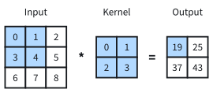

```{.python .input}
%load_ext d2lbook.tab
tab.interact_select('mxnet', 'pytorch', 'tensorflow', 'jax')
```

# Convolutions for Images
:label:`sec_conv_layer`

The preceding section derived convolutional layers from locality and
translation equivariance. We now define the two-dimensional cross-correlation
operation, implement it directly, and show how its kernels can be learned from
image data.

```{.python .input #conv-layer-convolutions-for-images}
%%tab mxnet
from d2l import mxnet as d2l
from mxnet import autograd, gluon, np, npx
from mxnet.gluon import nn
npx.set_np()
```

```{.python .input #conv-layer-convolutions-for-images}
%%tab pytorch
from d2l import torch as d2l
import torch
from torch import nn
from torch.nn import functional as F
```

```{.python .input #conv-layer-convolutions-for-images}
%%tab jax
from d2l import jax as d2l
from flax import nnx
import jax
from jax import numpy as jnp
```

```{.python .input #conv-layer-convolutions-for-images}
%%tab tensorflow
from d2l import tensorflow as d2l
import tensorflow as tf
```

## The Cross-Correlation Operation

Strictly speaking, the operation used by a convolutional layer is
cross-correlation rather than mathematical convolution.
As described in :numref:`sec_why-conv`,
such a layer combines an input tensor
and a kernel tensor
into an output tensor through a cross-correlation operation.

We first omit channels and consider two-dimensional inputs and hidden
representations.
In :numref:`fig_correlation`,
the input is a two-dimensional tensor
with a height of 3 and width of 3.
We mark the shape of the tensor as $3 \times 3$ or ($3$, $3$).
The height and width of the kernel are both 2.
The shape of the *kernel window* (or *convolution window*)
is given by the height and width of the kernel
(here it is $2 \times 2$).


:label:`fig_correlation`

In the two-dimensional cross-correlation operation,
we begin with the convolution window positioned
at the upper-left corner of the input tensor
and slide it across the input tensor,
both from left to right and top to bottom.
When the convolution window slides to a certain position,
the input subtensor contained in that window
and the kernel tensor are multiplied elementwise
and the resulting tensor is summed up
yielding a single scalar value.
This result gives the value of the output tensor
at the corresponding location.
Here, the output tensor has a height of 2 and width of 2
and the four elements are derived from
the two-dimensional cross-correlation operation:

$$
\begin{aligned}
0\times0+1\times1+3\times2+4\times3 &= 19,\\
1\times0+2\times1+4\times2+5\times3 &= 25,\\
3\times0+4\times1+6\times2+7\times3 &= 37,\\
4\times0+5\times1+7\times2+8\times3 &= 43.
\end{aligned}
$$

Along each axis, the output is smaller than the input.
Because the kernel has width and height greater than $1$,
we can only properly compute the cross-correlation
for locations where the kernel fits wholly within the image.
The output size is therefore the input size $n_\textrm{h} \times n_\textrm{w}$
minus the size of the convolution kernel $k_\textrm{h} \times k_\textrm{w}$,
that is,

$$(n_\textrm{h}-k_\textrm{h}+1) \times (n_\textrm{w}-k_\textrm{w}+1).$$

The kernel must fit within the image at every evaluated position. The next
section shows how to keep the size unchanged
by padding the image with zeros around its boundary
so that there is enough space to shift the kernel.
Next, we implement this process in the `corr2d` function,
which accepts an input tensor `X` and a kernel tensor `K`
and returns an output tensor `Y`.

```{.python .input #conv-layer-the-cross-correlation-operation-1}
%%tab mxnet
def corr2d(X, K):  #@save
    """Compute 2D cross-correlation."""
    h, w = K.shape
    Y = d2l.zeros((X.shape[0] - h + 1, X.shape[1] - w + 1))
    for i in range(Y.shape[0]):
        for j in range(Y.shape[1]):
            Y[i, j] = d2l.reduce_sum((X[i: i + h, j: j + w] * K))
    return Y
```

```{.python .input #conv-layer-the-cross-correlation-operation-1}
%%tab pytorch
def corr2d(X, K):  #@save
    """Compute 2D cross-correlation."""
    h, w = K.shape
    Y = d2l.zeros((X.shape[0] - h + 1, X.shape[1] - w + 1))
    for i in range(Y.shape[0]):
        for j in range(Y.shape[1]):
            Y[i, j] = d2l.reduce_sum((X[i: i + h, j: j + w] * K))
    return Y
```

```{.python .input #conv-layer-the-cross-correlation-operation-1}
%%tab jax
def corr2d(X, K):  #@save
    """Compute 2D cross-correlation."""
    h, w = K.shape
    Y = jnp.zeros((X.shape[0] - h + 1, X.shape[1] - w + 1))
    for i in range(Y.shape[0]):
        for j in range(Y.shape[1]):
            Y = Y.at[i, j].set((X[i:i + h, j:j + w] * K).sum())
    return Y
```

```{.python .input #conv-layer-the-cross-correlation-operation-1}
%%tab tensorflow
def corr2d(X, K):  #@save
    """Compute 2D cross-correlation."""
    h, w = K.shape
    Y = tf.Variable(tf.zeros((X.shape[0] - h + 1, X.shape[1] - w + 1)))
    for i in range(Y.shape[0]):
        for j in range(Y.shape[1]):
            Y[i, j].assign(tf.reduce_sum(
                X[i: i + h, j: j + w] * K))
    return Y
```

We can construct the input tensor `X` and the kernel tensor `K`
from :numref:`fig_correlation`
to validate the output of the above implementation
of the two-dimensional cross-correlation operation.

```{.python .input #conv-layer-the-cross-correlation-operation-2}
X = d2l.tensor([[0.0, 1.0, 2.0], [3.0, 4.0, 5.0], [6.0, 7.0, 8.0]])
K = d2l.tensor([[0.0, 1.0], [2.0, 3.0]])
corr2d(X, K)
```

## Convolutional Layers

A convolutional layer cross-correlates the input and kernel
and adds a scalar bias to produce an output.
The two parameters of a convolutional layer
are the kernel and the scalar bias.
When training models based on convolutional layers,
we typically initialize the kernels randomly,
as with a fully connected layer.

We are now ready to implement a two-dimensional convolutional layer
based on the `corr2d` function defined above.
In the `__init__` constructor method,
we declare `weight` and `bias` as the two model parameters.
The forward propagation method
calls the `corr2d` function and adds the bias.

```{.python .input #conv-layer-convolutional-layers}
%%tab mxnet
class Conv2D(nn.Block):
    def __init__(self, kernel_size):
        super().__init__()
        self.weight = gluon.Parameter('weight', shape=kernel_size)
        self.bias = gluon.Parameter('bias', shape=(1,))

    def forward(self, x):
        return corr2d(x, self.weight.data()) + self.bias.data()
```

```{.python .input #conv-layer-convolutional-layers}
%%tab pytorch
class Conv2D(nn.Module):
    def __init__(self, kernel_size):
        super().__init__()
        self.weight = nn.Parameter(torch.rand(kernel_size))
        self.bias = nn.Parameter(torch.zeros(1))

    def forward(self, x):
        return corr2d(x, self.weight) + self.bias
```

```{.python .input #conv-layer-convolutional-layers}
%%tab tensorflow
class Conv2D(tf.keras.layers.Layer):
    def __init__(self):
        super().__init__()

    def build(self, kernel_size):
        initializer = tf.random_normal_initializer()
        self.weight = self.add_weight(name='w', shape=kernel_size,
                                      initializer=initializer)
        self.bias = self.add_weight(name='b', shape=(1, ),
                                    initializer=initializer)

    def call(self, inputs):
        return corr2d(inputs, self.weight) + self.bias
```

```{.python .input #conv-layer-convolutional-layers}
%%tab jax
class Conv2D(nnx.Module):
    def __init__(self, kernel_size, rngs=None):
        rngs = nnx.Rngs(d2l.get_key()) if rngs is None else rngs
        self.weight = nnx.Param(
            nnx.initializers.uniform()(rngs.params(), kernel_size))
        self.bias = nnx.Param(jnp.zeros(1))

    def __call__(self, x):
        return corr2d(x, self.weight) + self.bias
```

In
an $h \times w$ convolution,
or an $h \times w$ convolution kernel,
the height and width of the kernel are $h$ and $w$, respectively.
We call a convolutional layer with this kernel an $h \times w$ convolutional
layer.


## Object Edge Detection in Images

As a first application, we use a convolutional layer to detect an object's
edge by locating changes in pixel values.
First, we construct an "image" of $6\times 8$ pixels.
The middle four columns are black ($0$) and the rest are white ($1$).

```{.python .input #conv-layer-object-edge-detection-in-images-1}
%%tab mxnet, pytorch
X = d2l.ones((6, 8))
X[:, 2:6] = 0
X
```

```{.python .input #conv-layer-object-edge-detection-in-images-1}
%%tab tensorflow
X = tf.Variable(tf.ones((6, 8)))
X[:, 2:6].assign(tf.zeros(X[:, 2:6].shape))
X
```

```{.python .input #conv-layer-object-edge-detection-in-images-1}
%%tab jax
X = jnp.ones((6, 8))
X = X.at[:, 2:6].set(0)
X
```

Next, we construct a kernel `K` with a height of 1 and a width of 2,

$$\mathbf{K} = \begin{bmatrix} 1 & -1 \end{bmatrix}.$$
:eqlabel:`eq_edge_kernel`

When we perform the cross-correlation operation with the input,
if the horizontally adjacent elements are the same,
the output is 0. Otherwise, the output is nonzero.
This kernel is a special case of a finite-difference operator. At location
$(i,j)$ it computes $x_{i,j} - x_{i,j+1}$, the difference between horizontally
adjacent pixels. Up to a sign, this is a discrete approximation to the first
derivative in the horizontal direction. For a function $f(i,j)$, the derivative
is

$$\partial_j f(i,j) = \lim_{\epsilon \to 0} \frac{f(i,j+\epsilon) - f(i,j)}{\epsilon},$$

so the kernel output $x_{i,j} - x_{i,j+1}$ approximates $-\partial_j f(i,j)$.

```{.python .input #conv-layer-object-edge-detection-in-images-2}
K = d2l.tensor([[1.0, -1.0]])
```

We are ready to perform the cross-correlation operation
with arguments `X` (our input) and `K` (our kernel).
The output is $1$ at the edge from white to black
and $-1$ for the edge from black to white.
All other outputs take value $0$.

```{.python .input #conv-layer-object-edge-detection-in-images-3}
Y = corr2d(X, K)
Y
```

We can now apply the kernel to the transposed image.
As expected, it vanishes. The kernel `K` only detects vertical edges.

```{.python .input #conv-layer-object-edge-detection-in-images-4}
corr2d(d2l.transpose(X), K)
```

## Learning a Kernel
:label:`subsec_learning_kernel`

The finite difference `[1, -1]` works when the desired feature is known in
advance. For larger kernels and successive convolutional layers, manually
specifying every filter is generally impractical.

We therefore learn the kernel that maps `X` to `Y` from input--output pairs.
We first construct a convolutional layer
and initialize its kernel as a random tensor.
Next, in each iteration, we will use the squared error
to compare `Y` with the output of the convolutional layer.
We can then calculate the gradient to update the kernel.
The following example uses the built-in two-dimensional convolutional layer and
omits the bias.

```{.python .input #conv-layer-learning-a-kernel-1}
%%tab mxnet
# Construct a two-dimensional convolutional layer with 1 output channel and a
# kernel of shape (1, 2). For the sake of simplicity, we ignore the bias here
conv2d = nn.Conv2D(1, kernel_size=(1, 2), use_bias=False)
conv2d.initialize()

# The two-dimensional convolutional layer uses four-dimensional input and
# output in the format of (example, channel, height, width), where the batch
# size (number of examples in the batch) and the number of channels are both 1
X = X.reshape(1, 1, 6, 8)
Y = Y.reshape(1, 1, 6, 7)
lr = 3e-2  # Learning rate

for i in range(10):
    with autograd.record():
        Y_hat = conv2d(X)
        l = (Y_hat - Y) ** 2
    l.backward()
    # Update the kernel
    conv2d.weight.data()[:] -= lr * conv2d.weight.grad()
    if (i + 1) % 2 == 0:
        print(f'epoch {i + 1}, loss {float(l.sum()):.3f}')
```

```{.python .input #conv-layer-learning-a-kernel-1}
%%tab pytorch
# Construct a two-dimensional convolutional layer with 1 output channel and a
# kernel of shape (1, 2). For the sake of simplicity, we ignore the bias here
conv2d = nn.LazyConv2d(1, kernel_size=(1, 2), bias=False)

# The two-dimensional convolutional layer uses four-dimensional input and
# output in the format of (example, channel, height, width), where the batch
# size (number of examples in the batch) and the number of channels are both 1
X = X.reshape((1, 1, 6, 8))
Y = Y.reshape((1, 1, 6, 7))
lr = 3e-2  # Learning rate

for i in range(10):
    Y_hat = conv2d(X)
    l = (Y_hat - Y) ** 2
    conv2d.zero_grad()
    l.sum().backward()
    # Update the kernel
    with torch.no_grad():
        conv2d.weight[:] -= lr * conv2d.weight.grad
    if (i + 1) % 2 == 0:
        print(f'epoch {i + 1}, loss {l.sum():.3f}')
```

```{.python .input #conv-layer-learning-a-kernel-1}
%%tab tensorflow
# Construct a two-dimensional convolutional layer with 1 output channel and a
# kernel of shape (1, 2). For the sake of simplicity, we ignore the bias here
conv2d = tf.keras.layers.Conv2D(1, (1, 2), use_bias=False)

# The two-dimensional convolutional layer uses four-dimensional input and
# output in the format of (example, height, width, channel), where the batch
# size (number of examples in the batch) and the number of channels are both 1
X = tf.reshape(X, (1, 6, 8, 1))
Y = tf.reshape(Y, (1, 6, 7, 1))
lr = 3e-2  # Learning rate

for i in range(10):
    with tf.GradientTape() as g:
        Y_hat = conv2d(X)
        l = (Y_hat - Y) ** 2
    # Update the kernel
    update = tf.multiply(lr, g.gradient(l, conv2d.trainable_weights)[0])
    conv2d.kernel.assign(conv2d.kernel - update)
    if (i + 1) % 2 == 0:
        print(f'epoch {i + 1}, loss {tf.reduce_sum(l):.3f}')
```

```{.python .input #conv-layer-learning-a-kernel-1}
%%tab jax
# Construct a two-dimensional convolutional layer with 1 output channel and a
# kernel of shape (1, 2). For the sake of simplicity, we ignore the bias here.
# Use a small-stddev normal init so the toy 10-step SGD has time to converge
# (Flax's default lecun_normal yields a much larger initial loss).
conv2d = nnx.Conv(1, 1, kernel_size=(1, 2), use_bias=False, padding='VALID',
                  kernel_init=nnx.initializers.normal(stddev=0.01),
                  rngs=nnx.Rngs(d2l.get_key()))

# The two-dimensional convolutional layer uses four-dimensional input and
# output in the format of (example, height, width, channel), where the batch
# size (number of examples in the batch) and the number of channels are both 1
X = X.reshape((1, 6, 8, 1))
Y = Y.reshape((1, 6, 7, 1))
lr = 3e-2  # Learning rate

def loss(model, X, Y):
    Y_hat = model(X)
    return ((Y_hat - Y) ** 2).sum()

for i in range(10):
    l, grads = nnx.value_and_grad(loss)(conv2d, X, Y)
    conv2d.kernel[...] -= lr * grads.kernel[...]
    if (i + 1) % 2 == 0:
        print(f'epoch {i + 1}, loss {l:.3f}')
```

After 10 iterations, the error is small. We can inspect the learned kernel.

```{.python .input #conv-layer-learning-a-kernel-2}
%%tab mxnet
d2l.reshape(conv2d.weight.data(), (1, 2))
```

```{.python .input #conv-layer-learning-a-kernel-2}
%%tab pytorch
d2l.reshape(conv2d.weight.data, (1, 2))
```

```{.python .input #conv-layer-learning-a-kernel-2}
%%tab tensorflow
d2l.reshape(conv2d.get_weights()[0], (1, 2))
```

```{.python .input #conv-layer-learning-a-kernel-2}
%%tab jax
conv2d.kernel[...].reshape((1, 2))
```

Indeed, the learned kernel tensor is close
to the kernel tensor `K` we defined earlier.

## Cross-Correlation and Convolution

Recall our observation from :numref:`sec_why-conv` of the correspondence
between the cross-correlation and convolution operations.
For two-dimensional layers, strict convolution as defined in
:eqref:`eq_2d-conv-discrete` differs from cross-correlation only by flipping the
kernel horizontally and vertically before applying cross-correlation.

Since kernels are learned from data in deep learning,
the outputs of convolutional layers remain unaffected
whether the layers perform strict convolution or cross-correlation.

To illustrate this, suppose that a convolutional layer performs *cross-correlation* and learns the kernel in :numref:`fig_correlation`, which is here denoted as the matrix $\mathbf{K}$.
Assuming that other conditions remain unchanged,
when this layer instead performs strict *convolution*,
the learned kernel $\mathbf{K}'$ will be the same as $\mathbf{K}$
after $\mathbf{K}'$ is
flipped both horizontally and vertically.
Thus, when the convolutional layer
performs strict *convolution*
on the input in :numref:`fig_correlation`
with $\mathbf{K}'$,
it produces the same output as in :numref:`fig_correlation`
(the cross-correlation of the input and $\mathbf{K}$).

In keeping with standard terminology in deep learning literature,
we will continue to refer to the cross-correlation operation
as a convolution even though the operations differ mathematically. We use the
term *element* to refer to
an entry (or component) of any tensor representing a layer representation or a convolution kernel.


## Convolution as Matrix Multiplication
:label:`subsec_conv_matmul`

Every output element in :numref:`fig_correlation` is a dot product:
the kernel, flattened into a vector of length $k_\textrm{h} k_\textrm{w}$,
multiplied with the input patch under the window, flattened the same way.
For an input of spatial size $h \times w$, the number of such patches depends
on the kernel, padding, and stride.
If we extract each patch the sliding window visits,
flatten it into a row, and stack the rows,
we obtain a matrix with one row per output position.
The entire cross-correlation then collapses into a single product
of this patch matrix with the flattened kernel.
The rearrangement is called *im2col*
(it turns image patches into the columns, here rows, of a matrix).

This rewriting motivates one important family of convolution implementations.
GPUs and other accelerators are built around fast dense matrix multiplication,
and libraries often lower convolutions to explicit or implicit matrix products.
Depending on the shapes and hardware, they may instead select direct,
Winograd, FFT-based, or other specialized kernels.
The explicit form costs memory:
each input element is duplicated in up to $k_\textrm{h} k_\textrm{w}$ rows.
Let's build the patch matrix for the input and kernel
of :numref:`fig_correlation`
and check that the matrix product reproduces `corr2d`.

```{.python .input #conv-layer-convolution-as-matrix-multiplication-1}
X = d2l.tensor([[0.0, 1.0, 2.0], [3.0, 4.0, 5.0], [6.0, 7.0, 8.0]])
K = d2l.tensor([[0.0, 1.0], [2.0, 3.0]])
h, w = K.shape
p_h, p_w = X.shape[0] - h + 1, X.shape[1] - w + 1
patches = d2l.stack([d2l.reshape(X[i:i + h, j:j + w], (-1,))
                     for i in range(p_h) for j in range(p_w)])
Y_mat = d2l.reshape(d2l.matmul(patches, d2l.reshape(K, (-1, 1))), (p_h, p_w))
Y_mat, d2l.reduce_sum(d2l.abs(Y_mat - corr2d(X, K)))
```

The sum of absolute differences is zero:
the one matrix product and the sliding-window loop
compute the same output.

:begin_tab:`pytorch`
PyTorch exposes this rearrangement directly:
`F.unfold` extracts the patch matrix
(transposed, and with batch and channel dimensions),
so any convolution can be written as unfold,
matrix multiplication, and reshape.
:end_tab:

```{.python .input #conv-layer-convolution-as-matrix-multiplication-2}
%%tab pytorch
X_batch = d2l.reshape(X, (1, 1, 3, 3))
patches_unfold = F.unfold(X_batch, kernel_size=(2, 2))[0].T
torch.allclose(patches_unfold, patches)
```

The same idea also works in the opposite direction:
instead of unfolding the input,
we can unroll the kernel into a sparse, banded matrix
that multiplies the flattened image.
The exercises explore this view.

## Feature Map and Receptive Field

As described in :numref:`subsec_why-conv-channels`,
the convolutional layer output in
:numref:`fig_correlation`
is sometimes called a *feature map*,
as it can be regarded as
the learned representations (features)
in the spatial dimensions (e.g., width and height)
that it passes on to the subsequent layer.
In CNNs,
for any element $x$ of some layer,
its *receptive field* refers to
all the elements (from all the previous layers)
that may affect the calculation of $x$
during the forward propagation.
The receptive field can extend beyond the valid input region when padding is
used.

We use :numref:`fig_correlation` to illustrate the receptive field.
Given the $2 \times 2$ convolution kernel,
the receptive field of the shaded output element (of value $19$)
is
the four elements in the shaded portion of the input.
Now let's denote the $2 \times 2$
output as $\mathbf{Y}$
and consider a deeper CNN
with an additional $2 \times 2$ convolutional layer that takes $\mathbf{Y}$
as its input, outputting
a single element $z$.
In this case,
the receptive field of $z$
on $\mathbf{Y}$ includes all the four elements of $\mathbf{Y}$,
while
the receptive field
on the input includes all the nine input elements.
Stacking layers therefore lets an element respond to input features over a
broader area.

This layer-by-layer counting has a closed form.
Consider a stack of $L$ convolutional layers
in which layer $i$ has a $k_i \times k_i$ kernel and stride $s_i$
(padding affects only which outputs exist,
not how far each one sees).
One step at the input of layer $i$
corresponds to $\prod_{j=1}^{i-1} s_j$ steps at the original input,
since every earlier layer with stride $s_j$
multiplies the step size by $s_j$.
Layer $i$'s kernel spans $k_i - 1$ steps of its own input,
so it widens the receptive field by
$(k_i - 1) \prod_{j=1}^{i-1} s_j$ input pixels.
Starting from a single pixel and summing over layers,
an element at the top of the stack
has a receptive field of side length

$$
r = 1 + \sum_{i=1}^{L} \left( k_i - 1 \right) \prod_{j=1}^{i-1} s_j,
$$
:eqlabel:`eq_receptive_field`

where the empty product for $i = 1$ equals $1$.

The most common case is $L$ stacked $3 \times 3$ layers with stride $1$:
each layer adds $2$,
so the stack sees $(2L + 1) \times (2L + 1)$ input pixels.
Two such layers cover $5 \times 5$, three cover $7 \times 7$.
This is why deep stacks of small kernels can replace single large ones:
three $3 \times 3$ layers match the receptive field
of one $7 \times 7$ layer with fewer parameters
($27$ weights instead of $49$ per input--output channel pair)
and three nonlinearities instead of one.
Strides enter through the product:
after a stride-$2$ layer (or a pooling step, :numref:`sec_pooling`),
every later kernel counts double,
so downsampling makes the receptive field grow geometrically with depth.
We will use :eqref:`eq_receptive_field` repeatedly
when we analyze modern architectures in :numref:`chap_modern_cnn`.

Equation :eqref:`eq_receptive_field` gives the *theoretical* receptive field:
the set of inputs that can affect an activation at all. Their influence is not
uniform. :citet:`Luo.Li.Urtasun.ea.2016` measured the *effective* receptive
field through gradients and found that it concentrates near the center of the
theoretical region, with a roughly Gaussian profile in common randomly
initialized and trained networks. Depth, dilation, and larger kernels enlarge
the set of possible inputs; they do not guarantee that optimization will use
all of it equally.

Receptive fields derive their name from neurophysiology.
Experiments recording from the visual cortex of several animal species
:cite:`Hubel.Wiesel.1959,Hubel.Wiesel.1962,Hubel.Wiesel.1968`
found that its lower levels respond to edges and related shapes.
Later, :citet:`Field.1987` modeled these responses on natural images
with what are, in effect, convolutional kernels.
We reprint a key figure in :numref:`field_visual`.


:label:`field_visual`

The correspondence extends to features computed by deeper layers of networks trained on image classification :cite:`Kuzovkin.Vicente.Petton.ea.2018`.

## Summary

The core computation in a convolutional layer is cross-correlation. A nested
loop states the operation directly; practical libraries select among implicit
matrix multiplication, direct, Winograd, FFT-based, and specialized kernels.
Locality creates extensive reuse of weights and overlapping input patches, but
real performance depends on both arithmetic throughput and memory movement.

Convolutions can detect edges and lines, blur images, or sharpen them. In a
neural network, the filters are learned from data rather than specified by
hand. The language of receptive fields has a historical connection to visual
neurophysiology, but that analogy is motivation rather than evidence that a
particular network mirrors the brain.

## Exercises

1. [code] **Diagonal edges.** Construct an image `X` with diagonal edges.
    1. What happens if you apply the kernel `K` of :eqref:`eq_edge_kernel`
       to it?
    1. What happens if you transpose `X`?
    1. What happens if you transpose `K`?
1. [code] **Designing kernels.** Design some kernels manually.
    1. Given a directional vector $\mathbf{v} = (v_1, v_2)$, derive an
       edge-detection kernel that detects edges orthogonal to $\mathbf{v}$,
       i.e., edges in the direction $(v_2, -v_1)$.
    1. Derive a finite difference operator for the second derivative. What
       is the minimum size of the convolutional kernel associated with it?
       Which structures in images respond most strongly to it?
    1. How would you design a blur kernel? Why might you want to use such
       a kernel?
    1. What is the minimum size of a kernel to obtain a derivative of
       order $d$?
    1. Load a single image and convert it to one channel. Apply three of
       your kernels with `corr2d`: the edge detector, the blur kernel,
       and a sharpening kernel defined as twice the identity minus the
       blur. Display each result next to the original.

    *Adapted from Stanford CS231n,
    [Assignment 2](https://cs231n.github.io/assignments2024/assignment2/).*
1. [code] **Convolution as a banded matrix.** The patch matrix of
   :numref:`subsec_conv_matmul` unfolds the input. The opposite
   construction unrolls the kernel. Let $\mathbf{X}$ be a $4 \times 4$
   input, $\mathbf{K}$ a $3 \times 3$ kernel, and $\textrm{vec}(\cdot)$
   the row-by-row flattening.
    1. Construct the $4 \times 16$ matrix $\mathbf{W}$ with
       $\mathbf{W}\,\textrm{vec}(\mathbf{X}) = \textrm{vec}(\mathbf{Y})$,
       where $\mathbf{Y}$ is the cross-correlation of $\mathbf{X}$ with
       $\mathbf{K}$. How many nonzero entries does each row have, and how
       many distinct values appear in $\mathbf{W}$?
    1. Build $\mathbf{W}$ in code from `K` and confirm that the product
       reproduces `corr2d(X, K)`.
    1. How does the memory needed to store $\mathbf{W}$ compare with that
       of the patch matrix as the input grows?
1. [code] **Backward pass of a convolution.** ● Consider the
   single-channel convolution of this section with input $\mathbf{X}$,
   kernel $\mathbf{K}$, and a scalar loss $\ell$.
    1. Derive $\partial \ell/\partial \mathbf{K}$ and
       $\partial \ell/\partial \mathbf{X}$ in the style of the
       backpropagation equations of :numref:`sec_backprop`.
    1. Check your expression for $\partial \ell/\partial \mathbf{K}$
       against the kernel updates produced by the experiment of
       :numref:`subsec_learning_kernel`.
    1. Implement the gradient of `corr2d(X, K)` with respect to `K`
       directly, without automatic differentiation, and check it against a
       finite-difference gradient on a small random `X` and `K` to a
       relative error below $10^{-4}$.

    *Adapted from Michael Nielsen,
    [Neural Networks and Deep Learning](http://neuralnetworksanddeeplearning.com/chap6.html),
    Chapter 6, and Stanford CS231n,
    [Assignment 2](https://cs231n.github.io/assignments2024/assignment2/).*
1. [code] **Effective receptive field.** The theoretical receptive
   field of :eqref:`eq_receptive_field` bounds which inputs *can*
   influence an output; the effective receptive field measures how much
   they actually do :cite:`Luo.Li.Urtasun.ea.2016`. Build a stack of three
   $3 \times 3$ convolutional layers with random weights, stride 1, and no
   padding on a $32 \times 32$ single-channel input. Backpropagate a unit
   gradient from one output unit of the last layer to the input and plot
   the magnitude of the input gradient over the $32 \times 32$ grid.
   Compare the region of non-negligible magnitude with the $7 \times 7$
   theoretical receptive field, and describe the shape of the falloff.

:begin_tab:`pytorch`
6. [code] **Autodiff on the custom layer.** `corr2d` fills its output with
   the in-place assignment `Y[i, j] = ...`. Create `K` with
   `requires_grad=True`, run `corr2d(X, K).sum().backward()`, and inspect
   the `grad_fn` of the output. Does writing into a tensor that does not
   itself require gradients block differentiation? Explain what autograd
   records for such an assignment, and confirm that `Conv2D` learns the
   kernel of :eqref:`eq_edge_kernel` from `X` and `Y` by plain gradient
   descent.
:end_tab:

:begin_tab:`jax`
6. [code] **Autodiff on the custom layer.** `corr2d` builds its output
   with the functional update `Y.at[i, j].set(...)`. Compute
   `jax.grad(lambda K: corr2d(X, K).sum())(K)` and explain why this update
   poses no obstacle to differentiation. Then wrap `corr2d` in `jax.jit`
   and compare the compile time for a $6 \times 8$ and a $28 \times 28$
   input. Why does the Python loop make the compiled program grow with
   the input size?
:end_tab:

:begin_tab:`tensorflow`
6. [code] **Autodiff on the custom layer.** `corr2d` writes its output into
   a `tf.Variable` with `Y[i, j].assign(...)`. Watch `K` on a
   `tf.GradientTape`, evaluate `corr2d(X, K)`, and request the gradient of
   its sum with respect to `K`. What does the tape return, and why does a
   variable assignment break the chain from `K` to the output? Rewrite
   `corr2d` so that it collects the window sums in a Python list and
   assembles the output with `tf.stack`, and verify that the gradient is
   now defined.
:end_tab:

:begin_tab:`mxnet`
6. [code] **Autodiff on the custom layer.** Call `K.attach_grad()`,
   evaluate `corr2d(X, K)` inside `autograd.record()`, and call
   `backward()`. What error message do you see, and which line of
   `corr2d` triggers it? Rewrite `corr2d` without in-place assignment so
   that the gradient with respect to `K` can be computed.
:end_tab:

:begin_tab:`mxnet`
[Discussions](https://d2l.discourse.group/t/65)
:end_tab:

:begin_tab:`pytorch`
[Discussions](https://d2l.discourse.group/t/66)
:end_tab:

:begin_tab:`tensorflow`
[Discussions](https://d2l.discourse.group/t/271)
:end_tab:

:begin_tab:`jax`
[Discussions](https://d2l.discourse.group/t/17996)
:end_tab:

<!-- slides -->

::: {.slide title="Why convolution works for images"}
A fully-connected layer on a 1-megapixel RGB image needs
roughly **3 million** weights *per output unit* — wildly
wasteful, since pixel correlations are local and the same
edge detector should work everywhere.

A **convolutional layer** swaps this for two strong
inductive biases:

- **Translation invariance** — one small filter, slid
  everywhere with shared parameters.
- **Locality** — each output depends only on a small
  neighborhood of input pixels.

Thousands of parameters instead of millions, with exactly
the right prior for natural images.
:::

::: {.slide title="2-D cross-correlation"}
Slide a small kernel $\mathbf{K}$ over the input $\mathbf{X}$.
At each position, multiply elementwise and sum:

$$Y[i, j] = \sum_{a, b} X[i+a, j+b]\, K[a, b].$$

{width=78%}

The output is smaller than the input by $k - 1$ in each
direction — same shrinking we'll undo with padding next
section.
:::

::: {.slide title="Setup for implementation"}
Two nested loops over output positions. Each cell is a
slice multiplied elementwise with the kernel and summed:

@conv-layer-convolutions-for-images
:::

::: {.slide title="Implementing cross-correlation"}
@conv-layer-the-cross-correlation-operation-1
:::

::: {.slide title="Verify cross-correlation"}
Verify against the figure — 3×3 input × 2×2 kernel →
2×2 output with the worked-out values:

@conv-layer-the-cross-correlation-operation-2
:::

::: {.slide title="A conv layer is corr2d + bias"}
Wrap the operator as a learnable `Module`. Two parameters:
the kernel weights and a scalar bias:

@conv-layer-convolutional-layers

These are the only learnable parameters of a single-channel
conv layer. A 3×3 conv has *nine* weights regardless of
input size — that's the parameter savings the inductive
bias buys us.
:::

::: {.slide title="What kernels actually do: edge detection"}
Build an image with a vertical edge in the middle: 1s on
the outsides, 0s in the middle four columns:

@conv-layer-object-edge-detection-in-images-1

. . .

A 1×2 horizontal-difference kernel — discrete first
derivative across $x$:

$$\mathbf{K} = [\,1, \, -1\,] \;\Rightarrow\; (\mathbf{K} * \mathbf{X})[i, j] = X[i, j] - X[i, j+1].$$

@conv-layer-object-edge-detection-in-images-2
:::

::: {.slide title="The output is the edge map"}
Cross-correlate the image with the difference kernel: $+1$
at each white→black transition, $-1$ at each black→white,
zero everywhere else:

@conv-layer-object-edge-detection-in-images-3

. . .

Transpose the image so the edge is now horizontal — the
**same** kernel detects nothing:

@conv-layer-object-edge-detection-in-images-4

Filters are **direction-sensitive**. Real ConvNets stack
many filters per layer to cover all directions / patterns.
:::

::: {.slide title="Learning the kernel"}
We don't *have* to design kernels by hand. Random init,
SGD on squared error against ground truth $\mathbf{Y}$:

@conv-layer-learning-a-kernel-1

. . .

After 10 steps the loss is near zero, and the learned
kernel is essentially $[1, -1]$:

@conv-layer-learning-a-kernel-2

The rest of the chapter is built on this idea — let
gradient descent discover what filters the data needs.
:::

::: {.slide title="Convolution as matrix multiplication"}
Every output element is a dot product: flattened patch
times flattened kernel. Stack all the patches as rows of
a matrix and the whole convolution becomes **one matmul**
(the *im2col* trick):

@conv-layer-convolution-as-matrix-multiplication-1

This is why convolutions run fast on hardware built for
dense matrix multiplication.
:::

::: {.slide title="im2col in production" only="pytorch"}
`F.unfold` extracts the same patch matrix (transposed,
with batch and channel dimensions added):

@conv-layer-convolution-as-matrix-multiplication-2

Convolution = unfold, matmul, reshape.
:::

::: {.slide title="Receptive field: stacking deepens reach"}
The **receptive field** of an output cell = the set of
input positions that can affect it.

- A 2×2 kernel: receptive field = 2×2 pixels.
- Two stacked 2×2 layers: each output cell sees 3×3 input.
- $L$ layers, kernel $k_i$, stride $s_i$:
  $r = 1 + \sum_{i=1}^{L} (k_i - 1) \prod_{j<i} s_j$.
- Stack $L$ layers of 3×3, stride 1: $(2L + 1) \times (2L + 1)$.

Local kernels + depth = global reach without the
parameter cost of large kernels.
:::

::: {.slide title="Trained filters look biological"}
{width=82%}
:::

::: {.slide title="Recap"}
- Conv layer = small kernel slid across input + bias.
- Inductive biases: translation equivariance + locality →
  *orders of magnitude* fewer parameters than fully
  connected.
- Hand-designed kernels can detect edges, blobs, blurs;
  trained kernels discover whatever the loss demands.
- Receptive fields *grow with depth* — a deep stack of
  small kernels covers a large input region.
- Filters look biologically plausible: the same shapes
  visual cortex neurons respond to.
:::
