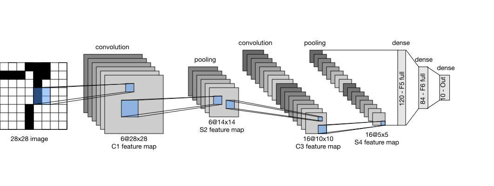

```{.python .input}
%load_ext d2lbook.tab
tab.interact_select('mxnet', 'pytorch', 'tensorflow', 'jax')
```

# Convolutional Neural Networks (LeNet)
:label:`sec_lenet`

We can now combine convolution, pooling, and fully connected layers into a
complete image classifier. In our earlier experiments with image data, we applied
a linear model with softmax regression (:numref:`sec_softmax_scratch`)
and an MLP (:numref:`sec_mlp-implementation`)
to pictures of clothing in the Fashion-MNIST dataset.
To make such data amenable we first flattened each image from a $28\times28$ matrix
into a fixed-length $784$-dimensional vector,
and thereafter processed them in fully connected layers.
Convolutional layers preserve this spatial organization and share parameters
across locations, reducing the number of parameters.

This section introduces *LeNet*, one of the early CNNs to demonstrate strong
performance on a practical computer vision task.
The model was introduced by (and named for) Yann LeCun,
then a researcher at AT&T Bell Labs,
for the purpose of recognizing handwritten digits in images :cite:`LeCun.Bottou.Bengio.ea.1998`.
This work represented the culmination
of a decade of research developing the technology;
LeCun's team published the first study to successfully
train CNNs via backpropagation :cite:`LeCun.Boser.Denker.ea.1989`.

LeNet matched the performance of support vector machines, then a dominant
approach to handwritten-digit recognition, with an error rate below 1% per
digit. Variants were deployed to read handwritten amounts on bank checks and
deposit slips. The deployment demonstrated that a trained convolutional model
could replace a substantial hand-engineered recognition pipeline.

```{.python .input #lenet-convolutional-neural-networks-lenet}
%%tab mxnet
from d2l import mxnet as d2l
from mxnet import autograd, gluon, init, np, npx
from mxnet.gluon import nn
npx.set_np()
```

```{.python .input #lenet-convolutional-neural-networks-lenet}
%%tab pytorch
from d2l import torch as d2l
import torch
from torch import nn
```

```{.python .input #lenet-convolutional-neural-networks-lenet}
%%tab tensorflow
import tensorflow as tf
from d2l import tensorflow as d2l
```

```{.python .input #lenet-convolutional-neural-networks-lenet}
%%tab jax
from d2l import jax as d2l
from flax import nnx
from jax import numpy as jnp
```

## LeNet

At a high level, LeNet (LeNet-5) consists of two parts:
(i) a convolutional encoder consisting of two convolutional layers; and
(ii) a dense block consisting of three fully connected layers.
The architecture is summarized in :numref:`img_lenet`.


:label:`img_lenet`

The basic units in each convolutional block
are a convolutional layer, a sigmoid activation function,
and a subsequent average pooling operation.
ReLUs and max-pooling were not part of LeNet-5 and had not yet become the
standard choices for trained CNNs.
Each convolutional layer uses a $5\times 5$ kernel
and a sigmoid activation function.
These layers map spatially arranged inputs
to a number of two-dimensional feature maps, typically
increasing the number of channels.
The first convolutional layer has 6 output channels,
while the second has 16.
Each $2\times2$ pooling operation (stride 2)
reduces dimensionality by a factor of $4$ via spatial downsampling.
The convolutional block emits an output with shape (batch size, number
of channels, height, width) in the PyTorch/MXNet convention; TensorFlow
and JAX use the channels-last layout (batch, height, width, channels).

To pass the convolutional block's output to the dense block, we flatten each
example. This transforms the four-dimensional tensor into a matrix whose first
axis indexes examples and whose second axis contains the flattened features.
LeNet's dense block has three fully connected layers,
with 120, 84, and 10 outputs, respectively.
Because we are still performing classification,
the 10-dimensional output layer corresponds
to the number of possible output classes.

Modern frameworks express LeNet as a `Sequential` block containing the layers
described above. We use Xavier initialization, introduced in
:numref:`subsec_xavier`.

```{.python .input #lenet-1}
%%tab pytorch
def init_cnn(module):  #@save
    """Initialize weights for CNNs."""
    if type(module) == nn.Linear or type(module) == nn.Conv2d:
        nn.init.xavier_uniform_(module.weight)
```

```{.python .input #lenet-2}
%%tab pytorch
class LeNet(d2l.Classifier):  #@save
    """The LeNet-5 model."""
    def __init__(self, lr=0.1, num_classes=10):
        super().__init__()
        self.save_hyperparameters()
        self.net = nn.Sequential(
            nn.LazyConv2d(6, kernel_size=5, padding=2), nn.Sigmoid(),
            nn.AvgPool2d(kernel_size=2, stride=2),
            nn.LazyConv2d(16, kernel_size=5), nn.Sigmoid(),
            nn.AvgPool2d(kernel_size=2, stride=2),
            nn.Flatten(),
            nn.LazyLinear(120), nn.Sigmoid(),
            nn.LazyLinear(84), nn.Sigmoid(),
            nn.LazyLinear(num_classes))
```

```{.python .input #lenet-2}
%%tab mxnet
class LeNet(d2l.Classifier):  #@save
    """The LeNet-5 model."""
    def __init__(self, lr=0.1, num_classes=10):
        super().__init__()
        self.save_hyperparameters()
        self.net = nn.Sequential()
        self.net.add(
            nn.Conv2D(channels=6, kernel_size=5, padding=2,
                      activation='sigmoid'),
            nn.AvgPool2D(pool_size=2, strides=2),
            nn.Conv2D(channels=16, kernel_size=5, activation='sigmoid'),
            nn.AvgPool2D(pool_size=2, strides=2),
            nn.Dense(120, activation='sigmoid'),
            nn.Dense(84, activation='sigmoid'),
            nn.Dense(num_classes))
        self.net.initialize(init.Xavier())
```

```{.python .input #lenet-2}
%%tab tensorflow
class LeNet(d2l.Classifier):  #@save
    """The LeNet-5 model."""
    def __init__(self, lr=0.1, num_classes=10):
        super().__init__()
        self.save_hyperparameters()
        self.net = tf.keras.models.Sequential([
            tf.keras.layers.Conv2D(filters=6, kernel_size=5,
                                   activation='sigmoid', padding='same'),
            tf.keras.layers.AvgPool2D(pool_size=2, strides=2),
            tf.keras.layers.Conv2D(filters=16, kernel_size=5,
                                   activation='sigmoid'),
            tf.keras.layers.AvgPool2D(pool_size=2, strides=2),
            tf.keras.layers.Flatten(),
            tf.keras.layers.Dense(120, activation='sigmoid'),
            tf.keras.layers.Dense(84, activation='sigmoid'),
            tf.keras.layers.Dense(num_classes)])
```

```{.python .input #lenet-2}
%%tab jax
class LeNet(d2l.Classifier):  #@save
    """The LeNet-5 model."""
    def __init__(self, lr=0.1, num_classes=10, kernel_init=None, rngs=None):
        super().__init__()
        self.save_hyperparameters(ignore=['rngs', 'kernel_init'])
        rngs = nnx.Rngs(d2l.get_key()) if rngs is None else rngs
        kernel_init = (nnx.initializers.xavier_uniform() if kernel_init is None
                       else kernel_init)
        self.net = nnx.Sequential(
            nnx.Conv(1, 6, kernel_size=(5, 5), padding='SAME',
                     kernel_init=kernel_init, rngs=rngs),
            nnx.sigmoid,
            lambda x: nnx.avg_pool(x, window_shape=(2, 2), strides=(2, 2)),
            nnx.Conv(6, 16, kernel_size=(5, 5), padding='VALID',
                     kernel_init=kernel_init, rngs=rngs),
            nnx.sigmoid,
            lambda x: nnx.avg_pool(x, window_shape=(2, 2), strides=(2, 2)),
            lambda x: x.reshape((x.shape[0], -1)),  # flatten
            nnx.Linear(400, 120, kernel_init=kernel_init, rngs=rngs),
            nnx.sigmoid,
            nnx.Linear(120, 84, kernel_init=kernel_init, rngs=rngs),
            nnx.sigmoid,
            nnx.Linear(84, num_classes, kernel_init=kernel_init, rngs=rngs))
```

This is a teaching variant of LeNet-5 rather than an exact historical
reproduction. We use $28\times28$ inputs with padding instead of the original
$32\times32$ inputs, ordinary average pooling instead of trainable subsampling,
full connectivity between convolutional channels instead of LeNet-5's partial
C3 connections, logistic sigmoid instead of scaled hyperbolic tangent, and a
linear logit head trained with cross-entropy instead of radial-basis output
units. These changes keep the alternating convolution--pooling structure and
the 6--16--120--84 channel/hidden dimensions while making every component
recognizable in a modern library.

:begin_tab:`pytorch, mxnet, tensorflow`
We inspect the network by passing a
single-channel (black and white)
$28 \times 28$ image through the network
and printing the output shape at each layer,
we can inspect the model to ensure
that its operations line up with
what we expect from :numref:`img_lenet_vert`.
:end_tab:

:begin_tab:`jax`
We inspect the network by passing a
single-channel (black and white)
$28 \times 28$ image through the network
and printing the output shape at each layer,
we can inspect the model to ensure
that its operations line up with
what we expect from :numref:`img_lenet_vert`.
Because an NNX model already owns its initialized layers, we can pass an array
through the callables stored in `Sequential` and print each intermediate shape
directly.
:end_tab:


:label:`img_lenet_vert`

```{.python .input #lenet-3}
%%tab mxnet, pytorch
@d2l.add_to_class(d2l.Classifier)  #@save
def layer_summary(self, X_shape):
    X = d2l.randn(*X_shape)
    for layer in self.net:
        X = layer(X)
        print(layer.__class__.__name__, 'output shape:\t', X.shape)
        
model = LeNet()
model.layer_summary((1, 1, 28, 28))
```

```{.python .input #lenet-3}
%%tab tensorflow
@d2l.add_to_class(d2l.Classifier)  #@save
def layer_summary(self, X_shape):
    X = d2l.normal(X_shape)
    for layer in self.net.layers:
        X = layer(X)
        print(layer.__class__.__name__, 'output shape:\t', X.shape)

model = LeNet()
model.layer_summary((1, 28, 28, 1))
```

```{.python .input #lenet-3}
%%tab jax
@d2l.add_to_class(d2l.Classifier)  #@save
def layer_summary(self, X_shape):
    X = jnp.zeros(X_shape)
    for layer in self.net.layers:
        X = layer(X)
        print(layer.__class__.__name__, 'output shape:\t', X.shape)

model = LeNet()
model.layer_summary((1, 28, 28, 1))
```

The height and width of the representation
at each layer throughout the convolutional block
is reduced (compared with the previous layer).
The first convolutional layer uses two pixels of padding
to compensate for the reduction in height and width
that would otherwise result from using a $5 \times 5$ kernel.
As an aside, the image size of $28 \times 28$ pixels in the original
MNIST OCR dataset is a result of *trimming* two pixel rows (and columns) from the
original scans that measured $32 \times 32$ pixels. This was done primarily to
save space (a 30% reduction) at a time when megabytes mattered.

In contrast, the second convolutional layer forgoes padding,
and thus the height and width are both reduced by four pixels.
As we go up the stack of layers,
the number of channels increases layer-over-layer
from 1 in the input to 6 after the first convolutional layer
and 16 after the second convolutional layer.
However, each pooling layer halves the height and width.
Finally, each fully connected layer reduces dimensionality,
ultimately emitting an output whose dimension
matches the number of classes.


## Training

We now train the LeNet variant on Fashion-MNIST.

While CNNs have fewer parameters,
they can still be more expensive to compute
than similarly deep MLPs
because each parameter participates in many more
multiplications.
Using a GPU can accelerate training. The `d2l.Trainer` class manages device
placement and the training loop.
By default, it initializes the model parameters on the
available devices.
As with MLPs, the loss function is cross-entropy,
and we minimize it via minibatch stochastic gradient descent.

```{.python .input #lenet-training}
%%tab pytorch
trainer = d2l.Trainer(max_epochs=10, num_gpus=1)
data = d2l.FashionMNIST(batch_size=128)
model = LeNet(lr=0.1)
model.apply_init([next(iter(data.get_dataloader(True)))[0]], init_cnn)
trainer.fit(model, data)
```

```{.python .input #lenet-training}
%%tab mxnet
trainer = d2l.Trainer(max_epochs=10, num_gpus=1)
data = d2l.FashionMNIST(batch_size=128)
model = LeNet(lr=0.1)
trainer.fit(model, data)
```

```{.python .input #lenet-training}
%%tab jax
trainer = d2l.Trainer(max_epochs=10, num_gpus=1)
data = d2l.FashionMNIST(batch_size=128)
model = LeNet(lr=0.1)
trainer.fit(model, data)
```

```{.python .input #lenet-training}
%%tab tensorflow
trainer = d2l.Trainer(max_epochs=10)
data = d2l.FashionMNIST(batch_size=128)
with d2l.try_gpu():
    model = LeNet(lr=0.1)
    trainer.fit(model, data)
```

## Summary

LeNet combines a convolutional encoder with a small classification head. Its
performance on Fashion-MNIST illustrates the advantage of using image
structure rather than flattening every input. Modern frameworks also make its
implementation substantially shorter than the specialized systems required
for the original experiments :cite:`Bottou.Le-Cun.1988`.

The overall encoder--classifier organization remains common, although modern
networks replace most of LeNet's individual components:

:Component substitutions from LeNet to modern CNNs.
:label:`tab_lenet_modern`

| LeNet (1998) | Modern (2020s) | What the change buys |
|:--|:--|:--|
| sigmoid activation | ReLU or GELU | gradients that survive depth instead of saturating |
| average pooling | max-pooling or strided convolution | provides selective or learned local downsampling |
| no normalization | batch or layer normalization | stable activation scales, so much deeper stacks train |
| dense head on flattened features | global average pooling plus one linear layer | removes most of the parameters (the $400 \times 120$ block here) |
| Xavier initialization | He initialization | variance matched to ReLU rather than to sigmoid |

The next chapter examines these changes through AlexNet
(:numref:`sec_alexnet`), NiN (:numref:`sec_nin`), batch normalization
(:numref:`sec_batch_norm`), and ResNet (:numref:`sec_resnet`). He
initialization, introduced in :numref:`sec_init_param`, accompanies the use of
ReLU activations.

## Exercises

1. [code] **Modernizing LeNet.** Modernize LeNet by implementing and
   testing the following changes:
    1. Replace average pooling with max-pooling.
    1. Replace the sigmoid activations with ReLU.
1. [code] **Architecture sweep.** Change the size of the LeNet-style
   network and determine whether accuracy improves beyond the effects of
   max-pooling and ReLU.
    1. Adjust the convolution window size.
    1. Adjust the number of output channels.
    1. Adjust the number of convolution layers.
    1. Adjust the number of fully connected layers.
    1. Adjust the learning rates and other training details, for example
       the initialization and the number of epochs.
1. [code] **Original MNIST.** Try out the improved network on the original
   MNIST dataset. :citet:`LeCun.Bottou.Bengio.ea.1998` report an error
   rate below 1% for LeNet-5 on this task; state how your result compares.
1. [code] **Visualizing activations.** Extract the outputs of the first
   and second convolutional layers of the trained `LeNet`.
    1. Display them for inputs from different classes, for example
       sweaters and coats.
    1. Measure the maximum activation magnitude of each of the two layers
       for in-distribution Fashion-MNIST test images, for
       out-of-distribution photos such as a cat or a car, and for pure
       random noise. Do the out-of-distribution and noise magnitudes fall
       inside or clearly outside the range observed on in-distribution
       inputs?
1. [code] **The dense head.** ● :numref:`tab_lenet_modern` states that
   replacing the dense head with global average pooling removes most of
   LeNet's parameters.
    1. Using the weight count of :numref:`sec_channels` and the layer
       shapes of :numref:`img_lenet_vert`, compute the number of
       parameters in the two convolutional layers combined and in the
       $400 \times 120$ dense layer. Which dominates?
    1. Replace the flatten and the two hidden dense layers of widths 120
       and 84 by global average pooling followed by a single linear layer
       from 16 to 10 units. How many parameters remain? Before training,
       predict whether the test accuracy changes by more than one
       percentage point relative to `LeNet`; then retrain and compare.
    1. Instead connect the flattened 400-dimensional convolutional output
       directly to the ten-way output. Retrain, and compare the accuracy
       of the two reduced heads with each other and with your prediction.
       What does the comparison say about where LeNet's capacity is used?

    *Adapted from Michael Nielsen,
    [Neural Networks and Deep Learning](http://neuralnetworksanddeeplearning.com/chap6.html),
    Chapter 6.*
1. [code] **Overfitting sanity check.** Before trusting a full training
   run, verify that the modernized LeNet of the first problem can drive
   training accuracy above 99% on a fixed subset of 50 Fashion-MNIST
   images within 500 gradient steps (with 50 images, one epoch is one
   minibatch). If it cannot, diagnose which architectural or optimization
   choice is responsible.

    *Adapted from Stanford CS231n,
    [Assignment 2](https://cs231n.github.io/assignments2024/assignment2/).*

:begin_tab:`mxnet`
[Discussions](https://d2l.discourse.group/t/73)
:end_tab:

:begin_tab:`pytorch`
[Discussions](https://d2l.discourse.group/t/74)
:end_tab:

:begin_tab:`tensorflow`
[Discussions](https://d2l.discourse.group/t/275)
:end_tab:

:begin_tab:`jax`
[Discussions](https://d2l.discourse.group/t/18000)
:end_tab:

<!-- slides -->

::: {.slide title="LeNet sets the CNN template"}
**LeNet-5** (Yann LeCun et al., 1989; deployed in the 1990s) recognized
handwritten digits on bank checks.

Its organization—a **convolutional encoder** in which spatial dimensions
shrink and channels grow, followed by a **dense head**—influenced many later
CNN architectures.
:::

::: {.slide title="LeNet-5 architecture"}
{width=92%}
:::

::: {.slide title="Layer-by-layer"}
- Conv1: 1→6 channels, 5×5 kernel, padding 2 (28→28)
- AvgPool: stride 2 → 14×14
- Conv2: 6→16 channels, 5×5, no padding → 10×10
- AvgPool: stride 2 → 5×5
- Flatten → 16·5·5 = 400 → 120 → 84 → 10

Two conv→sigmoid→avgpool blocks, three FC layers, 10 logits.
:::

::: {.slide title="Compressed view"}
Same network, vertical schematic (the textbook version):

{width=44%}
:::

::: {.slide title="Two takeaways"}
- **Pyramid shape:** spatial dimensions halve at each pooling layer while the
  number of channels increases. Many later CNNs retain this pattern.
- **The bottleneck is the flatten:** `400 × 120 = 48000`
  weights from conv block to first dense layer. Modern
  CNNs replace the dense stack with *global average
  pooling*, which is much cheaper.
:::

::: {.slide title="Implementation setup"}
The figure translates directly to a `Sequential` model. Xavier initialization
helps keep the sigmoid layers from
saturating early in training:

@lenet-convolutional-neural-networks-lenet
:::

::: {.slide title="LeNet in code"}
@lenet-1
:::

::: {.slide title="LeNet initialization"}
@lenet-2
:::

::: {.slide title="Tracing shapes through the network"}
To check tensor shapes, pass a dummy `(1, 1, 28, 28)`
input through the layers and print the shape after each.
Match this against the figure to verify the architecture
is wired correctly:

@lenet-3

The output confirms 28→28→14→10→5→flatten→120→84→10, matching the
diagram.
:::

::: {.slide title="Training on Fashion-MNIST"}
Cross-entropy loss + SGD + 10 epochs. Same `Trainer` API
as every previous chapter; only the model changes:

@lenet-training

Compare the result with the dense MLP from the previous chapter to assess the
effect of LeNet's convolutional inductive bias.
:::

::: {.slide title="What 30 years of progress changed"}
LeNet's 1998 architecture vs. modern best practice:

| LeNet (1998) | Modern (2020s) |
|---|---|
| sigmoid activation | ReLU / GELU |
| average pooling | max pool / strided conv |
| no normalization | BatchNorm / LayerNorm |
| dense head | global average pool + 1 linear |
| Xavier init | He init |
| 5 layers, ~60k params | 50+ layers, millions of params |

Each substitution is a section of the next chapter, Modern
CNNs (He initialization was introduced in the builder's guide). The overall
*convolutional encoder + head* organization is retained.
:::

::: {.slide title="Recap"}
- LeNet-5 demonstrated a CNN in a deployed recognition system.
- Architectural template: conv encoder (spatial ↓, channels ↑)
  → flatten → dense head.
- Later CNNs such as ResNet and EfficientNet retain the encoder--head
  organization while changing its components and scale.
- The next chapter swaps every component for its modern
  equivalent and goes much deeper.
:::
