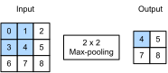

```{.python .input}
%load_ext d2lbook.tab
tab.interact_select('mxnet', 'pytorch', 'tensorflow', 'jax')
```

# Pooling
:label:`sec_pooling`

In many cases our ultimate task asks some global question about the image,
e.g., *does it contain a cat?* Consequently, the units of our final layer 
should be sensitive to the entire input.
By gradually aggregating information, yielding coarser and coarser maps,
we accomplish this goal of ultimately learning a global representation,
while keeping all of the advantages of convolutional layers at the intermediate layers of processing.
The deeper we go in the network,
the larger the receptive field (relative to the input)
to which each hidden node is sensitive. Reducing spatial resolution 
accelerates this process, 
since the convolution kernels cover a larger effective area. 

Moreover, when detecting lower-level features, such as edges
(as discussed in :numref:`sec_conv_layer`),
we often want our representations to be somewhat invariant to translation.
For instance, if we take the image `X`
with a sharp delineation between black and white
and shift the whole image by one pixel to the right,
i.e., `Z[i, j] = X[i, j - 1]`,
then the output for the new image `Z` might be vastly different.
The edge will have shifted by one pixel.
In reality, objects hardly ever occur exactly at the same place.
In fact, even with a tripod and a stationary object,
vibration of the camera due to the movement of the shutter
might shift everything by a pixel or so
(high-end cameras are loaded with special features to address this problem).

This section introduces *pooling layers*,
which serve the dual purposes of
mitigating the sensitivity of convolutional layers to location
and of spatially downsampling representations.

```{.python .input #pooling}
%%tab mxnet
from d2l import mxnet as d2l
from mxnet import np, npx
from mxnet.gluon import nn
npx.set_np()
```

```{.python .input #pooling}
%%tab pytorch
from d2l import torch as d2l
import torch
from torch import nn
```

```{.python .input #pooling}
%%tab jax
from d2l import jax as d2l
from flax import nnx
import jax
from jax import numpy as jnp
```

```{.python .input #pooling}
%%tab tensorflow
from d2l import tensorflow as d2l
import tensorflow as tf
```

## Maximum Pooling and Average Pooling

Like convolutional layers, *pooling* operators
consist of a fixed-shape window that is slid over
all regions in the input according to its stride,
computing a single output for each location traversed
by the fixed-shape window (sometimes known as the *pooling window*).
However, unlike the cross-correlation computation
of the inputs and kernels in the convolutional layer,
the pooling layer contains no parameters (there is no *kernel*).
Instead, pooling operators are deterministic,
typically calculating either the maximum or the average value
of the elements in the pooling window.
These operations are called *maximum pooling* (*max-pooling* for short)
and *average pooling*, respectively.

*Average pooling* is essentially as old as CNNs. The idea is akin to 
downsampling an image. Rather than just taking the value of every second (or third) 
pixel for the lower resolution image, we can average over adjacent pixels to obtain 
an image with better signal-to-noise ratio since we are combining the information 
from multiple adjacent pixels. *Max-pooling* was introduced in 
:citet:`Riesenhuber.Poggio.1999` in the context of cognitive neuroscience to describe 
how information might be aggregated hierarchically for the purpose 
of object recognition; there already was an earlier version in speech recognition
:cite:`Yamaguchi.Sakamoto.Akabane.ea.1990`. Historically, max-pooling was
often preferred inside convolutional bodies, while average pooling became the
standard choice for global classifier heads. Neither dominates in every setting.

In both cases, as with the cross-correlation operator,
we can think of the pooling window
as starting from the upper-left of the input tensor
and sliding across it from left to right and top to bottom.
At each location that the pooling window hits,
it computes the maximum or average
value of the input subtensor in the window,
depending on whether max or average pooling is employed.



:label:`fig_pooling`

The output tensor in :numref:`fig_pooling`  has a height of 2 and a width of 2.
The four elements are derived from the maximum value in each pooling window:

$$
\max(0, 1, 3, 4)=4,\\
\max(1, 2, 4, 5)=5,\\
\max(3, 4, 6, 7)=7,\\
\max(4, 5, 7, 8)=8.\\
$$

More generally, we can define a $p \times q$ pooling layer by aggregating over 
a region of said size. Returning to the problem of edge detection, 
we use the output of the convolutional layer
as input for $2\times 2$ max-pooling.
Denote the edge-detector output by `X` and the pooling output by `Y`. If a
single response of value 1 moves anywhere within the same $2\times2$ pooling
window while the other responses remain no larger, then `Y[i, j]` remains 1.
Thus max-pooling can make a representation insensitive to some small movements
that stay within a window. Crossing a window boundary can still change the
pooled output abruptly, so this is local tolerance rather than exact translation
invariance.

In the code below, we implement the forward propagation
of the pooling layer in the `pool2d` function.
This function is similar to the `corr2d` function
in :numref:`sec_conv_layer`.
However, no kernel is needed, computing the output
as either the maximum or the average of each region in the input.

```{.python .input #pooling-maximum-pooling-and-average-pooling-1}
%%tab mxnet, pytorch
def pool2d(X, pool_size, mode='max'):
    p_h, p_w = pool_size
    Y = d2l.zeros((X.shape[0] - p_h + 1, X.shape[1] - p_w + 1))
    for i in range(Y.shape[0]):
        for j in range(Y.shape[1]):
            if mode == 'max':
                Y[i, j] = X[i: i + p_h, j: j + p_w].max()
            elif mode == 'avg':
                Y[i, j] = X[i: i + p_h, j: j + p_w].mean()
    return Y
```

```{.python .input #pooling-maximum-pooling-and-average-pooling-1}
%%tab jax
def pool2d(X, pool_size, mode='max'):
    p_h, p_w = pool_size
    Y = jnp.zeros((X.shape[0] - p_h + 1, X.shape[1] - p_w + 1))
    for i in range(Y.shape[0]):
        for j in range(Y.shape[1]):
            if mode == 'max':
                Y = Y.at[i, j].set(X[i: i + p_h, j: j + p_w].max())
            elif mode == 'avg':
                Y = Y.at[i, j].set(X[i: i + p_h, j: j + p_w].mean())
    return Y
```

```{.python .input #pooling-maximum-pooling-and-average-pooling-1}
%%tab tensorflow
def pool2d(X, pool_size, mode='max'):
    p_h, p_w = pool_size
    Y = tf.Variable(tf.zeros((X.shape[0] - p_h + 1, X.shape[1] - p_w +1)))
    for i in range(Y.shape[0]):
        for j in range(Y.shape[1]):
            if mode == 'max':
                Y[i, j].assign(tf.reduce_max(X[i: i + p_h, j: j + p_w]))
            elif mode =='avg':
                Y[i, j].assign(tf.reduce_mean(X[i: i + p_h, j: j + p_w]))
    return Y
```

We can construct the input tensor `X` in :numref:`fig_pooling` to validate the output of the two-dimensional max-pooling layer.

```{.python .input #pooling-maximum-pooling-and-average-pooling-2}
X = d2l.tensor([[0.0, 1.0, 2.0], [3.0, 4.0, 5.0], [6.0, 7.0, 8.0]])
pool2d(X, (2, 2))
```

Also, we can experiment with the average pooling layer.

```{.python .input #pooling-maximum-pooling-and-average-pooling-3}
pool2d(X, (2, 2), 'avg')
```

## Padding and Stride

As with convolutional layers, pooling layers
change the output shape.
And as before, we can adjust the operation to achieve a desired output shape
by padding the input and adjusting the stride.
We can demonstrate the use of padding and strides
in pooling layers via the built-in two-dimensional max-pooling layer from the deep learning framework.
We first construct an input tensor `X` whose shape has four dimensions,
where the number of examples (batch size) and number of channels are both 1.

:begin_tab:`tensorflow`
Note that unlike other frameworks, TensorFlow
prefers and is optimized for *channels-last* input.
:end_tab:

```{.python .input #pooling-padding-and-stride-1}
%%tab mxnet, pytorch
X = d2l.reshape(d2l.arange(16, dtype=d2l.float32), (1, 1, 4, 4))
X
```

```{.python .input #pooling-padding-and-stride-1}
%%tab tensorflow, jax
X = d2l.reshape(d2l.arange(16, dtype=d2l.float32), (1, 4, 4, 1))
X
```

Since pooling aggregates information from an area, deep learning frameworks default to matching pooling window sizes and stride. For instance, if we use a pooling window of shape `(3, 3)`
we get a stride shape of `(3, 3)` by default.

```{.python .input #pooling-padding-and-stride-2}
%%tab mxnet
pool2d = nn.MaxPool2D(3)
# Pooling has no model parameters, hence it needs no initialization
pool2d(X)
```

```{.python .input #pooling-padding-and-stride-2}
%%tab pytorch
pool2d = nn.MaxPool2d(3)
# Pooling has no model parameters, hence it needs no initialization
pool2d(X)
```

```{.python .input #pooling-padding-and-stride-2}
%%tab tensorflow
pool2d = tf.keras.layers.MaxPool2D(pool_size=[3, 3])
# Pooling has no model parameters, hence it needs no initialization
pool2d(X)
```

```{.python .input #pooling-padding-and-stride-2}
%%tab jax
# Pooling has no model parameters, hence it needs no initialization
nnx.max_pool(X, window_shape=(3, 3), strides=(3, 3))
```

Needless to say, the stride and padding can be manually specified to override framework defaults if required.

```{.python .input #pooling-padding-and-stride-3}
%%tab mxnet
pool2d = nn.MaxPool2D(3, padding=1, strides=2)
pool2d(X)
```

```{.python .input #pooling-padding-and-stride-3}
%%tab pytorch
pool2d = nn.MaxPool2d(3, padding=1, stride=2)
pool2d(X)
```

```{.python .input #pooling-padding-and-stride-3}
%%tab tensorflow
paddings = tf.constant([[0, 0], [1,0], [1,0], [0,0]])
X_padded = tf.pad(X, paddings, "CONSTANT")
pool2d = tf.keras.layers.MaxPool2D(pool_size=[3, 3], padding='valid',
                                   strides=2)
pool2d(X_padded)
```

```{.python .input #pooling-padding-and-stride-3}
%%tab jax
X_padded = jnp.pad(X, ((0, 0), (1, 0), (1, 0), (0, 0)), mode='constant')
nnx.max_pool(X_padded, window_shape=(3, 3), padding='VALID', strides=(2, 2))
```

Of course, we can specify an arbitrary rectangular pooling window with arbitrary height and width respectively, as the example below shows.

```{.python .input #pooling-padding-and-stride-4}
%%tab mxnet
pool2d = nn.MaxPool2D((2, 3), padding=(0, 1), strides=(2, 3))
pool2d(X)
```

```{.python .input #pooling-padding-and-stride-4}
%%tab pytorch
pool2d = nn.MaxPool2d((2, 3), stride=(2, 3), padding=(0, 1))
pool2d(X)
```

```{.python .input #pooling-padding-and-stride-4}
%%tab tensorflow
paddings = tf.constant([[0, 0], [0, 0], [1, 1], [0, 0]])
X_padded = tf.pad(X, paddings, "CONSTANT")

pool2d = tf.keras.layers.MaxPool2D(pool_size=[2, 3], padding='valid',
                                   strides=(2, 3))
pool2d(X_padded)
```

```{.python .input #pooling-padding-and-stride-4}
%%tab jax

X_padded = jnp.pad(X, ((0, 0), (0, 0), (1, 1), (0, 0)), mode='constant')
nnx.max_pool(X_padded, window_shape=(2, 3), strides=(2, 3), padding='VALID')
```

## Multiple Channels

When processing multi-channel input data,
the pooling layer pools each input channel separately,
rather than summing the inputs up over channels
as in a convolutional layer.
This means that the number of output channels for the pooling layer
is the same as the number of input channels.
Below, we will concatenate tensors `X` and `X + 1`
on the channel dimension to construct an input with two channels.

:begin_tab:`tensorflow`
Note that this will require a
concatenation along the last dimension for TensorFlow due to the channels-last syntax.
:end_tab:

```{.python .input #pooling-multiple-channels-1}
%%tab mxnet, pytorch
X = d2l.concat((X, X + 1), 1)
X
```

```{.python .input #pooling-multiple-channels-1}
%%tab tensorflow, jax
# Concatenate along `dim=3` due to channels-last syntax
X = d2l.concat([X, X + 1], 3)
X
```

As we can see, the number of output channels is still two after pooling.

```{.python .input #pooling-multiple-channels-2}
%%tab mxnet
pool2d = nn.MaxPool2D(3, padding=1, strides=2)
pool2d(X)
```

```{.python .input #pooling-multiple-channels-2}
%%tab pytorch
pool2d = nn.MaxPool2d(3, padding=1, stride=2)
pool2d(X)
```

```{.python .input #pooling-multiple-channels-2}
%%tab tensorflow
paddings = tf.constant([[0, 0], [1,0], [1,0], [0,0]])
X_padded = tf.pad(X, paddings, "CONSTANT")
pool2d = tf.keras.layers.MaxPool2D(pool_size=[3, 3], padding='valid',
                                   strides=2)
pool2d(X_padded)

```

```{.python .input #pooling-multiple-channels-2}
%%tab jax
X_padded = jnp.pad(X, ((0, 0), (1, 0), (1, 0), (0, 0)), mode='constant')
nnx.max_pool(X_padded, window_shape=(3, 3), padding='VALID', strides=(2, 2))
```

:begin_tab:`tensorflow`
Note that the output for the TensorFlow pooling appears at first glance to be different, however
numerically the same results are presented as MXNet and PyTorch.
The difference lies in the dimensionality, and reading the
output vertically yields the same output as the other implementations.
:end_tab:

## Summary

Pooling is a simple operation: it replaces each window of values with a single
summary, the maximum or the mean. The stride and padding semantics of
convolutions carry over unchanged, and pooling applies to each channel
separately, so the number of channels is preserved. There are no parameters to
learn. A $2 \times 2$ window with stride 2, which quarters the number of
spatial locations, is the classical local configuration; global average
pooling is now the common classification head.

Be aware, though, that pooling is no longer how most downsampling happens. Modern convolutional networks reduce resolution mainly with *strided convolutions*: a convolution with stride 2 halves the resolution just as a pooling layer would, but it learns its aggregation weights rather than fixing them to max or mean. ResNet (:numref:`sec_resnet`) and its successors follow this pattern. Pooling survives in two roles. *Global average pooling*, introduced with the network-in-network architecture (:numref:`sec_nin`) :cite:`Lin.Chen.Yan.2013`, averages each channel over all spatial positions; it turns the final feature map into one number per channel and has replaced the large fully connected layers of early CNNs as the default classifier head. Max-pooling persists in some network stems (ResNet opens with one) and in detection models that merge feature maps across scales.

One caveat applies to every stride-2 downsampler, pooled or convolutional:
subsampling a signal without first removing its high spatial frequencies can
*alias*, so that shifting the input by a single pixel changes the output
noticeably; applying a small low-pass (blur) filter before subsampling can make
the result substantially more shift-consistent, though not exactly invariant
:cite:`zhang2019making`. Beyond these mainstays there are randomized variants
such as stochastic pooling :cite:`Zeiler.Fergus.2013` and fractional
max-pooling :cite:`Graham.2014`, and the attention mechanisms of
:numref:`chap_attention` aggregate by learned alignment
between a query and representation vectors rather than by spatial location.


## Exercises

1. Implement average pooling through a convolution. 
1. Prove that max-pooling cannot be implemented through a convolution alone. 
1. Max-pooling can be accomplished using ReLU operations, i.e., $\textrm{ReLU}(x) = \max(0, x)$.
    1. Express $\max (a, b)$ by using only ReLU operations.
    1. Use this to implement max-pooling by means of convolutions and ReLU layers. 
    1. How many channels and layers do you need for a $2 \times 2$ convolution? How many for a $3 \times 3$ convolution?
1. What is the computational cost of the pooling layer? Assume that the input to the pooling layer is of size $c\times h\times w$, the pooling window has a shape of $p_\textrm{h}\times p_\textrm{w}$ with a padding of $(p_\textrm{h}, p_\textrm{w})$ and a stride of $(s_\textrm{h}, s_\textrm{w})$.
1. Why do you expect max-pooling and average pooling to work differently?
1. Do we need a separate minimum pooling layer? Can you replace it with another operation?
1. We could use the softmax operation for pooling. Why might it not be so popular?
1. Naive stride-2 downsampling keeps every second entry of its input. Apply it to the one-dimensional signals $(1, 0, 1, 0, 1, 0)$ and $(0, 1, 0, 1, 0, 1)$, i.e., the same pattern shifted by one position. 
    1. Compare the two outputs. Why is this behavior called *aliasing*, and which input frequencies can a stride-2 subsampler represent faithfully?
    1. Blur-pool counteracts aliasing by applying a small averaging filter before subsampling. Work out what blur-pool with a two-tap box filter $(\tfrac{1}{2}, \tfrac{1}{2})$ computes on the two signals above. Which pooling operation from this section does it coincide with?

:begin_tab:`mxnet`
[Discussions](https://d2l.discourse.group/t/71)
:end_tab:

:begin_tab:`pytorch`
[Discussions](https://d2l.discourse.group/t/72)
:end_tab:

:begin_tab:`tensorflow`
[Discussions](https://d2l.discourse.group/t/274)
:end_tab:

:begin_tab:`jax`
[Discussions](https://d2l.discourse.group/t/17999)
:end_tab:

<!-- slides -->

::: {.slide title="Pooling summarizes local evidence"}
**Pooling** is a parameter-free downsampling operation:
slide a window, replace it with a single summary value
(max or mean).

Two reasons it's everywhere:

- **Spatial aggregation** — summarize over locations to
  answer "is there a cat *anywhere* in the image?".
- **Local translation tolerance** — a 1-pixel shift doesn't
  usually change the max of a small window. Robust to
  small spatial perturbations.

2×2 pool with stride 2 — halves resolution, the canonical
example.
:::

::: {.slide title="Max-pooling at a glance"}
Same sliding-window pattern as a convolution, but the
operation is `max` instead of multiply-and-sum:

{width=78%}

Average pooling replaces `max` with `mean`. Max is the
default in modern nets — it's more selective ("did the
feature fire *somewhere* in this region?") and better
preserves sharp activations.
:::

::: {.slide title="Implementation"}
A few lines — no kernel, just a reduction over each
window. Two modes: max and avg.

@pooling

. . .

@pooling-maximum-pooling-and-average-pooling-1
:::

::: {.slide title="Verify against the figure"}
Max gives 4, 5, 7, 8 — matches the diagram:

@pooling-maximum-pooling-and-average-pooling-2

. . .

@pooling-maximum-pooling-and-average-pooling-3
:::

::: {.slide title="Why max gives local translation tolerance"}
A 2×2 max-pool window on `[0, 1, 3, 4]` returns 4. Shift
the input by a pixel; window now sees `[1, 0, 4, 0]` —
still 4.

A small shift moves *which* element fires, not *whether*
some element in the window fires. As long as the feature
stays inside the window, the output is unchanged.

Modern alternative: a *strided convolution* does the same
downsampling but learns its own "pool" function.
:::

::: {.slide title="Padding and stride for pooling"}
Same knobs as conv, but different *defaults*: a
framework `MaxPool2d` matches stride to window size
(non-overlapping pools) — we want to *reduce*
resolution, not preserve it.

@pooling-padding-and-stride-1

. . .

@pooling-padding-and-stride-2
:::

::: {.slide title="Overlapping and asymmetric pools"}
Override the defaults when you want overlapping pools:

@pooling-padding-and-stride-3

. . .

Or asymmetric pools per axis:

@pooling-padding-and-stride-4
:::

::: {.slide title="Multi-channel pooling"}
Convs *combine* channels (input channels feed every
output channel). Pooling does **not**:

- Each input channel is pooled independently.
- Output channel count = input channel count.
- Pooling has no notion of channel mixing.

@pooling-multiple-channels-1

. . .

@pooling-multiple-channels-2
:::

::: {.slide title="Where pooling sits in modern architectures"}
- **Classic CNNs** (LeNet, AlexNet, VGG): pool every
  few conv layers to halve spatial dims; final stack is
  fully connected.
- **ResNet / modern**: pool less often — strided convs
  (`stride=2`) handle most downsampling. One initial
  max-pool, then strided convs.
- **Global average pooling**: at the very end, average
  the entire feature map per channel. Replaces the
  fully-connected stack with a tiny linear classifier;
  drastically cuts parameters. Default in ResNet, ViT
  classification head, etc.
:::

::: {.slide title="Recap"}
- Pooling = window-slide reduction (max or mean), no
  learnable parameters.
- 2×2 max-pool with stride 2 is the classic spatial
  downsampler.
- Provides limited translation tolerance: the output
  unchanged under sub-window shifts.
- Per-channel — no channel mixing.
- Modern nets downsample mostly with strided convs;
  pooling survives as global average pooling at the
  head, plus a max-pool in some stems.
:::
