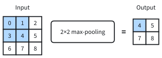

```{.python .input}
%load_ext d2lbook.tab
tab.interact_select('mxnet', 'pytorch', 'tensorflow', 'jax')
```

# Pooling
:label:`sec_pooling`

Many image tasks require a global prediction, such as whether an image
contains a cat. The final representation must therefore combine information
from the entire input. Convolutional networks commonly build this
representation by progressively reducing spatial resolution while increasing
the receptive field of each hidden unit.
Deeper hidden units have larger receptive fields relative to the input.
Reducing spatial resolution accelerates this growth because subsequent kernels
cover a larger effective area.

For lower-level features such as edges, we also want small translations of the
input to produce modest changes in the representation.
For instance, if we take the image `X`
with a sharp delineation between black and white
and shift the whole image by one pixel to the right,
i.e., `Z[i, j] = X[i, j - 1]`,
then the edge in the new output shifts by one pixel and sampled values may
change.
Such shifts occur whenever an object or camera moves slightly.

This section introduces *pooling layers*, which summarize local windows to
reduce spatial resolution and sensitivity to small translations.

```{.python .input #pooling}
%%tab mxnet
from d2l import mxnet as d2l
from mxnet import np, npx
from mxnet.gluon import nn
npx.set_np()
```

```{.python .input #pooling}
%%tab pytorch
from d2l import torch as d2l
import torch
from torch import nn
```

```{.python .input #pooling}
%%tab jax
from d2l import jax as d2l
from flax import nnx
import jax
from jax import numpy as jnp
```

```{.python .input #pooling}
%%tab tensorflow
from d2l import tensorflow as d2l
import tensorflow as tf
```

## Maximum Pooling and Average Pooling

Like convolutional layers, *pooling* operators
consist of a fixed-shape window that is slid over
all regions in the input according to its stride,
computing a single output for each location traversed
by the fixed-shape window (sometimes known as the *pooling window*).
However, unlike the cross-correlation computation
of the inputs and kernels in the convolutional layer,
the pooling layer contains no parameters (there is no *kernel*).
Instead, pooling operators are deterministic,
typically calculating either the maximum or the average value
of the elements in the pooling window.
These operations are called *maximum pooling* (*max-pooling* for short)
and *average pooling*, respectively.

*Average pooling* dates to the earliest CNNs and resembles image downsampling.
Instead of retaining every second or third pixel, it averages adjacent pixels,
combining their information and reducing high-frequency variation.
*Max-pooling* was introduced in
:citet:`Riesenhuber.Poggio.1999` in the context of cognitive neuroscience to describe 
how information might be aggregated hierarchically for the purpose 
of object recognition; there already was an earlier version in speech recognition
:cite:`Yamaguchi.Sakamoto.Akabane.ea.1990`. Historically, max-pooling was
often preferred inside convolutional bodies, while average pooling became the
standard choice for global classifier heads. Neither dominates in every setting.

In both cases, as with the cross-correlation operator,
we can think of the pooling window
as starting from the upper-left of the input tensor
and sliding across it from left to right and top to bottom.
At each location that the pooling window hits,
it computes the maximum or average
value of the input subtensor in the window,
depending on whether max or average pooling is employed.



:label:`fig_pooling`

The output tensor in :numref:`fig_pooling`  has a height of 2 and a width of 2.
The four elements are derived from the maximum value in each pooling window:

$$
\begin{aligned}
\max(0, 1, 3, 4) &= 4,\\
\max(1, 2, 4, 5) &= 5,\\
\max(3, 4, 6, 7) &= 7,\\
\max(4, 5, 7, 8) &= 8.
\end{aligned}
$$

More generally, we can define a $p \times q$ pooling layer by aggregating over 
a region of that size. Returning to the problem of edge detection, 
we use the output of the convolutional layer
as input for $2\times 2$ max-pooling.
Denote the edge-detector output by `X` and the pooling output by `Y`. If a
single response of value 1 moves anywhere within the same $2\times2$ pooling
window while the other responses remain no larger, then `Y[i, j]` remains 1.
Thus max-pooling can make a representation insensitive to some small movements
that stay within a window. Crossing a window boundary can still change the
pooled output abruptly, so this is local tolerance rather than exact translation
invariance.

In the code below, we implement the forward propagation
of the pooling layer in the `pool2d` function.
This function is similar to the `corr2d` function
in :numref:`sec_conv_layer`.
No kernel is needed: the output is
the maximum or the average of each region in the input.

```{.python .input #pooling-maximum-pooling-and-average-pooling-1}
%%tab mxnet, pytorch
def pool2d(X, pool_size, mode='max'):
    p_h, p_w = pool_size
    Y = d2l.zeros((X.shape[0] - p_h + 1, X.shape[1] - p_w + 1))
    for i in range(Y.shape[0]):
        for j in range(Y.shape[1]):
            if mode == 'max':
                Y[i, j] = X[i: i + p_h, j: j + p_w].max()
            elif mode == 'avg':
                Y[i, j] = X[i: i + p_h, j: j + p_w].mean()
    return Y
```

```{.python .input #pooling-maximum-pooling-and-average-pooling-1}
%%tab jax
def pool2d(X, pool_size, mode='max'):
    p_h, p_w = pool_size
    Y = jnp.zeros((X.shape[0] - p_h + 1, X.shape[1] - p_w + 1))
    for i in range(Y.shape[0]):
        for j in range(Y.shape[1]):
            if mode == 'max':
                Y = Y.at[i, j].set(X[i: i + p_h, j: j + p_w].max())
            elif mode == 'avg':
                Y = Y.at[i, j].set(X[i: i + p_h, j: j + p_w].mean())
    return Y
```

```{.python .input #pooling-maximum-pooling-and-average-pooling-1}
%%tab tensorflow
def pool2d(X, pool_size, mode='max'):
    p_h, p_w = pool_size
    Y = tf.Variable(tf.zeros((X.shape[0] - p_h + 1, X.shape[1] - p_w +1)))
    for i in range(Y.shape[0]):
        for j in range(Y.shape[1]):
            if mode == 'max':
                Y[i, j].assign(tf.reduce_max(X[i: i + p_h, j: j + p_w]))
            elif mode =='avg':
                Y[i, j].assign(tf.reduce_mean(X[i: i + p_h, j: j + p_w]))
    return Y
```

We can construct the input tensor `X` in :numref:`fig_pooling` to validate the output of the two-dimensional max-pooling layer.

```{.python .input #pooling-maximum-pooling-and-average-pooling-2}
X = d2l.tensor([[0.0, 1.0, 2.0], [3.0, 4.0, 5.0], [6.0, 7.0, 8.0]])
pool2d(X, (2, 2))
```

We can likewise evaluate average pooling.

```{.python .input #pooling-maximum-pooling-and-average-pooling-3}
pool2d(X, (2, 2), 'avg')
```

## Padding and Stride

As with convolutional layers, pooling layers
change the output shape.
And as before, we can adjust the operation to achieve a desired output shape
by padding the input and adjusting the stride.
We can demonstrate the use of padding and strides
in pooling layers via the built-in two-dimensional max-pooling layer from the deep learning framework.
We first construct an input tensor `X` whose shape has four dimensions,
where the number of examples (batch size) and number of channels are both 1.

:begin_tab:`tensorflow`
Unlike the other frameworks, TensorFlow
prefers and is optimized for *channels-last* input.
:end_tab:

```{.python .input #pooling-padding-and-stride-1}
%%tab mxnet, pytorch
X = d2l.reshape(d2l.arange(16, dtype=d2l.float32), (1, 1, 4, 4))
X
```

```{.python .input #pooling-padding-and-stride-1}
%%tab tensorflow, jax
X = d2l.reshape(d2l.arange(16, dtype=d2l.float32), (1, 4, 4, 1))
X
```

Since pooling aggregates information from an area, deep learning frameworks default to matching pooling window sizes and stride. For instance, if we use a pooling window of shape `(3, 3)`
we get a stride shape of `(3, 3)` by default.

```{.python .input #pooling-padding-and-stride-2}
%%tab mxnet
pool2d = nn.MaxPool2D(3)
# Pooling has no model parameters, hence it needs no initialization
pool2d(X)
```

```{.python .input #pooling-padding-and-stride-2}
%%tab pytorch
pool2d = nn.MaxPool2d(3)
# Pooling has no model parameters, hence it needs no initialization
pool2d(X)
```

```{.python .input #pooling-padding-and-stride-2}
%%tab tensorflow
pool2d = tf.keras.layers.MaxPool2D(pool_size=[3, 3])
# Pooling has no model parameters, hence it needs no initialization
pool2d(X)
```

```{.python .input #pooling-padding-and-stride-2}
%%tab jax
# Pooling has no model parameters, hence it needs no initialization
nnx.max_pool(X, window_shape=(3, 3), strides=(3, 3))
```

The stride and padding can be specified explicitly to override the framework
defaults.

```{.python .input #pooling-padding-and-stride-3}
%%tab mxnet
pool2d = nn.MaxPool2D(3, padding=1, strides=2)
pool2d(X)
```

```{.python .input #pooling-padding-and-stride-3}
%%tab pytorch
pool2d = nn.MaxPool2d(3, padding=1, stride=2)
pool2d(X)
```

```{.python .input #pooling-padding-and-stride-3}
%%tab tensorflow
paddings = tf.constant([[0, 0], [1,0], [1,0], [0,0]])
X_padded = tf.pad(X, paddings, "CONSTANT")
pool2d = tf.keras.layers.MaxPool2D(pool_size=[3, 3], padding='valid',
                                   strides=2)
pool2d(X_padded)
```

```{.python .input #pooling-padding-and-stride-3}
%%tab jax
X_padded = jnp.pad(X, ((0, 0), (1, 0), (1, 0), (0, 0)), mode='constant')
nnx.max_pool(X_padded, window_shape=(3, 3), padding='VALID', strides=(2, 2))
```

Pooling windows can also have different heights and widths.

```{.python .input #pooling-padding-and-stride-4}
%%tab mxnet
pool2d = nn.MaxPool2D((2, 3), padding=(0, 1), strides=(2, 3))
pool2d(X)
```

```{.python .input #pooling-padding-and-stride-4}
%%tab pytorch
pool2d = nn.MaxPool2d((2, 3), stride=(2, 3), padding=(0, 1))
pool2d(X)
```

```{.python .input #pooling-padding-and-stride-4}
%%tab tensorflow
paddings = tf.constant([[0, 0], [0, 0], [1, 1], [0, 0]])
X_padded = tf.pad(X, paddings, "CONSTANT")

pool2d = tf.keras.layers.MaxPool2D(pool_size=[2, 3], padding='valid',
                                   strides=(2, 3))
pool2d(X_padded)
```

```{.python .input #pooling-padding-and-stride-4}
%%tab jax

X_padded = jnp.pad(X, ((0, 0), (0, 0), (1, 1), (0, 0)), mode='constant')
nnx.max_pool(X_padded, window_shape=(2, 3), strides=(2, 3), padding='VALID')
```

## Multiple Channels

When processing multi-channel input data,
the pooling layer pools each input channel separately,
rather than summing the inputs up over channels
as in a convolutional layer.
This means that the number of output channels for the pooling layer
is the same as the number of input channels.
Below, we will concatenate tensors `X` and `X + 1`
on the channel dimension to construct an input with two channels.

:begin_tab:`tensorflow`
TensorFlow's channels-last layout requires concatenation along the final
dimension.
:end_tab:

```{.python .input #pooling-multiple-channels-1}
%%tab mxnet, pytorch
X = d2l.concat((X, X + 1), 1)
X
```

```{.python .input #pooling-multiple-channels-1}
%%tab tensorflow, jax
# Concatenate along `dim=3` due to channels-last syntax
X = d2l.concat([X, X + 1], 3)
X
```

The output still has two channels after pooling.

```{.python .input #pooling-multiple-channels-2}
%%tab mxnet
pool2d = nn.MaxPool2D(3, padding=1, strides=2)
pool2d(X)
```

```{.python .input #pooling-multiple-channels-2}
%%tab pytorch
pool2d = nn.MaxPool2d(3, padding=1, stride=2)
pool2d(X)
```

```{.python .input #pooling-multiple-channels-2}
%%tab tensorflow
paddings = tf.constant([[0, 0], [1,0], [1,0], [0,0]])
X_padded = tf.pad(X, paddings, "CONSTANT")
pool2d = tf.keras.layers.MaxPool2D(pool_size=[3, 3], padding='valid',
                                   strides=2)
pool2d(X_padded)

```

```{.python .input #pooling-multiple-channels-2}
%%tab jax
X_padded = jnp.pad(X, ((0, 0), (1, 0), (1, 0), (0, 0)), mode='constant')
nnx.max_pool(X_padded, window_shape=(3, 3), padding='VALID', strides=(2, 2))
```

:begin_tab:`tensorflow`
TensorFlow stores these tensors in NHWC order, whereas the MXNet and PyTorch
tabs use NCHW order. Transposing the TensorFlow result from NHWC to NCHW gives
the same values; only the channel axis is displayed in a different position.
:end_tab:

## Summary

Pooling is a simple operation: it replaces each window of values with a single
summary, the maximum or the mean. The stride and padding semantics of
convolutions carry over unchanged, and pooling applies to each channel
separately, so the number of channels is preserved. There are no parameters to
learn. A $2 \times 2$ window with stride 2, which quarters the number of
spatial locations, is the classical local configuration; global average
pooling is now the common classification head.

Modern convolutional networks often reduce resolution with *strided
convolutions*: a convolution with stride 2 halves the resolution while learning
its aggregation weights instead of fixing them to a maximum or mean. ResNet
(:numref:`sec_resnet`) uses this pattern within its stages. Pooling remains
common in two roles. *Global average pooling*, introduced with the
network-in-network architecture (:numref:`sec_nin`)
:cite:`Lin.Chen.Yan.2013`, averages each channel over all spatial positions and
turns the final feature map into one value per channel. It often replaces the
large fully connected classifier stacks of early CNNs. Max-pooling persists in
some network stems and in detection models that combine feature maps across
scales.

One caveat applies to every stride-2 downsampler, pooled or convolutional:
subsampling a signal without first removing its high spatial frequencies can
*alias*, so that shifting the input by a single pixel changes the output
noticeably; applying a small low-pass (blur) filter before subsampling can make
the result substantially more shift-consistent, though not exactly invariant
:cite:`zhang2019making`. Beyond these mainstays there are randomized variants
such as stochastic pooling :cite:`Zeiler.Fergus.2013` and fractional
max-pooling :cite:`Graham.2014`, and the attention mechanisms of
:numref:`chap_attention` aggregate by learned alignment
between a query and representation vectors rather than by spatial location.


## Exercises

1. [code] **Average pooling as convolution.** Express
   $k_\textrm{h} \times k_\textrm{w}$ average pooling with stride
   $(s_\textrm{h}, s_\textrm{w})$ as a convolution. Give the kernel, and
   state how the convolution must be structured across channels so that
   each channel is pooled separately, as pooling layers do. Verify against
   `pool2d(X, (2, 2), 'avg')` on the input `X` of :numref:`fig_pooling`.
1. **Max-pooling is not a convolution.** Prove that max-pooling cannot be
   implemented through a convolution alone.
1. **Max-pooling via ReLU.** Max-pooling can be built from ReLU
   activations, $\textrm{ReLU}(x) = \max(0, x)$, and linear layers.
    1. Express $\max(a, b)$ using ReLU and affine operations only.
    1. Use this to implement max-pooling by means of convolutions and ReLU
       layers.
    1. How many channels and layers do you need for a $2 \times 2$ window?
       How many for a $3 \times 3$ window?
1. **Cost of pooling.** What is the computational cost of the pooling
   layer? Assume that the input is of size $c \times h \times w$, the
   pooling window has a shape of $k_\textrm{h} \times k_\textrm{w}$, the
   padding is $(p_\textrm{h}, p_\textrm{w})$, and the stride is
   $(s_\textrm{h}, s_\textrm{w})$.
1. [code] **Max versus average pooling.** Construct two synthetic
   $4 \times 4$ patches with the same mean: one with a single high-value
   outlier on a uniform background, and one with a smooth gradient. Apply
   $2 \times 2$ max-pooling and average pooling with stride 2 to both and
   report all four outputs. Using these numbers, describe one scenario in
   which max-pooling is preferable and one in which average pooling is
   preferable.
1. **Pooling alternatives.**
    1. Do we need a separate minimum-pooling layer, or can it be expressed
       through an operation already in this section?
    1. We could combine the values in a pooling window with a softmax
       instead of a max or a mean. Give one concrete reason this is not
       popular in practice.
1. [code] **Aliasing and blur-pool.** Naive stride-2 downsampling keeps
   every second entry of its input.
    1. Apply it to the one-dimensional signals $(1, 0, 1, 0, 1, 0)$ and
       $(0, 1, 0, 1, 0, 1)$, i.e., the same pattern shifted by one
       position. Compare the two outputs. Why is this behavior called
       *aliasing*, and which input frequencies can a stride-2 subsampler
       represent faithfully?
    1. Blur-pool :cite:`zhang2019making` counteracts aliasing by applying
       a small averaging filter before subsampling. Work out what
       blur-pool with a two-tap box filter
       $(\tfrac{1}{2}, \tfrac{1}{2})$ computes on the two signals above.
       Which pooling operation from this section does it coincide with?
1. [code] **Backward pass of max-pooling.** Derive the gradient of
   two-dimensional max-pooling with respect to its input, for a
   $k_\textrm{h} \times k_\textrm{w}$ window and stride equal to the
   window size, and implement it without automatic differentiation.
   Verify against the gradient that automatic differentiation computes
   through the built-in max-pooling layer of this section on a small
   random tensor, to a relative error below $10^{-4}$.

    *Adapted from Stanford CS231n,
    [Assignment 2](https://cs231n.github.io/assignments2024/assignment2/).*

:begin_tab:`mxnet`
[Discussions](https://d2l.discourse.group/t/71)
:end_tab:

:begin_tab:`pytorch`
[Discussions](https://d2l.discourse.group/t/72)
:end_tab:

:begin_tab:`tensorflow`
[Discussions](https://d2l.discourse.group/t/274)
:end_tab:

:begin_tab:`jax`
[Discussions](https://d2l.discourse.group/t/17999)
:end_tab:

<!-- slides -->

::: {.slide title="Pooling summarizes local evidence"}
**Pooling** is a parameter-free downsampling operation:
slide a window, replace it with a single summary value
(max or mean).

Two reasons to use it:

- **Spatial aggregation** — summarize over locations to
  answer "is there a cat *anywhere* in the image?".
- **Local translation tolerance** — a 1-pixel shift doesn't
  usually change the max of a small window. Robust to
  small spatial perturbations.

2×2 pool with stride 2 — halves resolution, the canonical
example.
:::

::: {.slide title="Max-Pooling Selects the Largest Local Response"}
Same sliding-window pattern as a convolution, but the
operation is `max` instead of multiply-and-sum:

{width=78%}

Average pooling replaces `max` with `mean`. Local max-pooling was the standard
downsampler in early CNNs and remains in some stems. Modern networks more often
use strided convolutions for learned downsampling and global average pooling in
the classification head.
:::

::: {.slide title="Implementation"}
A few lines implement the operation: no kernel, only a reduction over each
window. Two modes: max and avg.

@pooling

. . .

@pooling-maximum-pooling-and-average-pooling-1
:::

::: {.slide title="Verify against the figure"}
Max-pooling returns 4, 5, 7, 8, matching the diagram:

@pooling-maximum-pooling-and-average-pooling-2

. . .

@pooling-maximum-pooling-and-average-pooling-3
:::

::: {.slide title="Why max gives local translation tolerance"}
A 2×2 max-pool window on `[0, 1, 3, 4]` returns 4. Shift
the input by a pixel; window now sees `[1, 0, 4, 0]` —
still 4.

A small shift moves *which* element fires, not *whether*
some element in the window fires. As long as the feature
stays inside the window, the output is unchanged.

Modern alternative: a *strided convolution* does the same
downsampling but learns its own "pool" function.
:::

::: {.slide title="Padding and stride for pooling"}
Pooling uses the same padding and stride controls as convolution, but a
framework `MaxPool2d` typically matches the stride to the window size to create
non-overlapping windows and reduce resolution.

@pooling-padding-and-stride-1

. . .

@pooling-padding-and-stride-2
:::

::: {.slide title="Overlapping and asymmetric pools"}
Override the defaults when you want overlapping pools:

@pooling-padding-and-stride-3

. . .

Or asymmetric pools per axis:

@pooling-padding-and-stride-4
:::

::: {.slide title="Multi-channel pooling"}
Convs *combine* channels (input channels feed every
output channel). Pooling does **not**:

- Each input channel is pooled independently.
- Output channel count = input channel count.
- Pooling has no notion of channel mixing.

@pooling-multiple-channels-1

. . .

@pooling-multiple-channels-2
:::

::: {.slide title="Where pooling sits in modern architectures"}
- **Classic CNNs** (LeNet, AlexNet, VGG): pool every
  few conv layers to halve spatial dims; final stack is
  fully connected.
- **ResNet / modern**: pool less often — strided convs
  (`stride=2`) handle most downsampling. One initial
  max-pool, then strided convs.
- **Global average pooling**: at the very end, average
  the entire feature map per channel. Replaces the
  fully connected stack with a linear classifier, reducing the parameter
  count. ResNet uses this design.
:::

::: {.slide title="Recap"}
- Pooling = window-slide reduction (max or mean), no
  learnable parameters.
- 2×2 max-pool with stride 2 is the classic spatial
  downsampler.
- Provides limited translation tolerance: the output
  unchanged under sub-window shifts.
- Per-channel — no channel mixing.
- Modern nets downsample mostly with strided convs;
  pooling survives as global average pooling at the
  head, plus a max-pool in some stems.
:::
