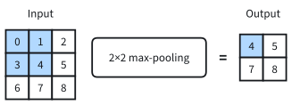

```{.python .input}
%load_ext d2lbook.tab
tab.interact_select('mxnet', 'pytorch', 'tensorflow', 'jax')
```

# Pooling
:label:`sec_pooling`

Convolutional layers answer local questions—whether an edge sits at pixel
$(i, j)$—whereas a classifier must answer a global question about the whole
image. Bridging from local feature maps to a global prediction requires both
wide spatial reach (:numref:`subsec_stride_rf`) and robustness to tiny spatial
shifts so a one-pixel camera jitter does not alter the prediction.

A *pooling layer* serves both goals without adding learnable parameters: it
slides a window across each channel independently and summarizes every patch by
its *maximum* or *average*. Because the maximum over a small block stays unchanged
as long as the peak response remains inside that block, local pooling provides
*tolerance* to small shifts, while *global pooling* across the entire feature map
collapses spatial coordinates into a single channel-wise vector.
```{.python .input #pooling}
%%tab mxnet
import math
import numpy as np
from mxnet import autograd, gluon, init, np as mnp, npx
from mxnet.gluon import nn
from d2l import mxnet as d2l
npx.set_np()
```

```{.python .input #pooling}
%%tab pytorch
import math
import numpy as np
import torch
from torch import nn
from torch.nn import functional as F
from d2l import torch as d2l
```

```{.python .input #pooling}
%%tab tensorflow
import math
import numpy as np
import tensorflow as tf
from d2l import tensorflow as d2l
```

```{.python .input #pooling}
%%tab jax
import math
import numpy as np
import jax
from jax import numpy as jnp
from flax import nnx
import optax
from d2l import jax as d2l
```

```{.python .input #pooling-1}
%%tab tensorflow, jax
from functools import partial
```

## Maximum Pooling and Average Pooling

Like a convolutional layer, a pooling operator slides a fixed-shape window---the
*pooling window*---across its input and computes a single scalar output at
each position. Unlike a convolution, however, a pooling layer has no
learnable kernel weights: it applies a fixed deterministic reduction to the
elements inside the window. *Maximum pooling* (*max-pooling* for short)
returns the largest entry in the window, whereas *average pooling* returns
their arithmetic mean.


:label:`fig_pooling`

In :numref:`fig_pooling`, a $2\times2$ window slides across a $3\times3$ input
with stride 1, moving from left to right and top to bottom. Because the window
fits in two positions along each axis, the output has shape $2\times2$, with
entries given by the maximum of each window:

$$
\begin{aligned}
\max(0, 1, 3, 4) &= 4,\\
\max(1, 2, 4, 5) &= 5,\\
\max(3, 4, 6, 7) &= 7,\\
\max(4, 5, 7, 8) &= 8.
\end{aligned}
$$

Notice that five of the nine input entries---0, 1, 2, 3, and 6---are never the
maximum of any window. Perturbing them slightly leaves the output completely
unchanged, because max-pooling depends only on the winning element in each
window. The same sliding-window construction generalizes immediately to any
$k_\textrm{h} \times k_\textrm{w}$ pooling window.

Below we implement forward propagation for two-dimensional pooling in
`pool2d`. Its nested loop mirrors `corr2d` from :numref:`sec_conv_layer`,
replacing the weighted inner product with either `max` or `mean`. We also
include a `stride` argument so we can examine downsampling next.

```{.python .input #pooling-maximum-pooling-and-average-pooling-1}
%%tab mxnet, pytorch
def pool2d(X, pool_size, mode='max', stride=1):
    k_h, k_w = pool_size
    Y = d2l.zeros(((X.shape[0] - k_h) // stride + 1,
                   (X.shape[1] - k_w) // stride + 1))
    for i in range(Y.shape[0]):
        for j in range(Y.shape[1]):
            window = X[i * stride: i * stride + k_h,
                       j * stride: j * stride + k_w]
            Y[i, j] = window.max() if mode == 'max' else window.mean()
    return Y
```

```{.python .input #pooling-maximum-pooling-and-average-pooling-1}
%%tab tensorflow
def pool2d(X, pool_size, mode='max', stride=1):
    k_h, k_w = pool_size
    reduce = tf.reduce_max if mode == 'max' else tf.reduce_mean
    # Build Y from its entries, so that gradients flow through it
    return tf.stack([
        tf.stack([reduce(X[i: i + k_h, j: j + k_w])
                  for j in range(0, X.shape[1] - k_w + 1, stride)])
        for i in range(0, X.shape[0] - k_h + 1, stride)])
```

```{.python .input #pooling-maximum-pooling-and-average-pooling-1}
%%tab jax
def pool2d(X, pool_size, mode='max', stride=1):
    k_h, k_w = pool_size
    Y = jnp.zeros(((X.shape[0] - k_h) // stride + 1,
                   (X.shape[1] - k_w) // stride + 1))
    for i in range(Y.shape[0]):
        for j in range(Y.shape[1]):
            window = X[i * stride: i * stride + k_h,
                       j * stride: j * stride + k_w]
            Y = Y.at[i, j].set(window.max() if mode == 'max'
                               else window.mean())
    return Y
```

Testing `pool2d` on the $3\times3$ tensor from :numref:`fig_pooling` confirms
that max-pooling yields 4, 5, 7, and 8.

```{.python .input #pooling-maximum-pooling-and-average-pooling-2}
X = d2l.tensor([[0.0, 1.0, 2.0], [3.0, 4.0, 5.0], [6.0, 7.0, 8.0]])
pool2d(X, (2, 2))
```

Switching to average pooling on the same input returns the four window means:
2, 3, 5, and 6.

```{.python .input #pooling-maximum-pooling-and-average-pooling-3}
pool2d(X, (2, 2), 'avg')
```

## Tolerance to Small Shifts

Just how much spatial shift can pooling absorb? Let us test the simplest
possible setting. A $2\times2$ pooling layer with stride 2 partitions its
input into non-overlapping $2\times2$ blocks and summarizes each block by a
single value. Imagine a $4\times4$ feature map containing a single nonzero
response of 1---like an edge detector firing at an isolated edge---and slide
that response one pixel at a time across row 1. Below we compare the
max-pooled and average-pooled outputs across three consecutive column
positions.

```{.python .input #pooling-tolerance-to-small-shifts}
def single_response(i, j, n=4):
    """An n x n feature map that is 1 at (i, j) and 0 elsewhere."""
    return d2l.tensor([[float(r == i and c == j) for c in range(n)]
                       for r in range(n)])

for j in range(3):
    Z = single_response(1, j)
    print(f'response at (1, {j}): max',
          d2l.numpy(pool2d(Z, (2, 2), stride=2)).tolist(),
          'avg', d2l.numpy(pool2d(Z, (2, 2), 'avg', stride=2)).tolist())
```

Shifting the response from column 0 to column 1 leaves both pooled outputs
completely unchanged because both locations fall inside the same $2\times2$
block. Shifting it one pixel further to column 2 crosses a block boundary,
causing the pooled response to jump to the adjacent output cell. Thus, a
one-pixel horizontal shift is absorbed whenever the response remains within
its block---half of all starting columns---and shifts the output by one
position otherwise. Local pooling therefore makes a representation *tolerant*
to certain small shifts, not strictly invariant to them.
:numref:`fig_pooling_shift` illustrates the max-pooled outputs across all
four column positions.


:label:`fig_pooling_shift`

Notice also how max-pooling and average pooling summarize the block
differently. Max-pooling preserves the full strength of the activation (1)
anywhere inside the block, effectively asking whether the feature appears
somewhere in that neighborhood. Average pooling outputs 0.25 because the
feature occupies only one of the four cells, measuring the feature's spatial
coverage and diluting a strong isolated response with its zero neighbors.

Subsampling with stride 2 also introduces a subtle signal-processing hazard
whenever a feature crosses a sampling boundary. In the extreme case, taking
every second sample of a high-frequency alternating signal $1, 0, 1, 0, \ldots$
produces either all ones or all zeros depending on a single-pixel shift. This
distortion---occurring whenever a signal varies faster than the sampling rate
can resolve---is called *aliasing*, and it affects every stride-2 downsampler,
whether pooled or convolutional. Applying a small smoothing filter before
subsampling mitigates aliasing :cite:`zhang2019making`, a technique explored
in the exercises below.

Historically, shift tolerance was the primary motivation behind pooling.
Fukushima's Neocognitron :cite:`Fukushima.1980` paired each layer of
feature-detecting cells with pooling-like cells that fired whenever a feature
appeared anywhere in a local neighborhood. An early version of max-pooling
appeared in speech recognition :cite:`Yamaguchi.Sakamoto.Akabane.ea.1990`, and
max-pooling was subsequently proposed in computational neuroscience as a model
of hierarchical evidence aggregation in the visual cortex
:cite:`Riesenhuber.Poggio.1999`.

## Global Pooling

What about the full translation invariance we desired in :numref:`sec_why-conv`
when asking whether Waldo appears *anywhere* in an image? As we just saw, a
small fixed window cannot guarantee it. Expanding the pooling window to cover
the *entire* spatial extent of each feature map can: the maximum or mean over
all spatial positions yields the exact same scalar regardless of where the
response sits (bottom row of :numref:`fig_pooling_shift`). This operation is
called *global pooling*, and it collapses each channel to a single number.


Inside a full CNN, however, global pooling sits atop zero-padded convolutional
layers, which are strictly shift-equivariant only away from the image borders
(:numref:`sec_why-conv`). As we saw in :numref:`subsec_padding_values`, an
interior pixel participates in all nine windows of a $3 \times 3$ kernel whereas
a border pixel participates in only six (and a corner pixel in four), so while a
global maximum over an isolated response stays constant across columns, a global
average drops when a feature moves onto the padded border. Convolutional stacks
ending in global pooling are therefore strictly invariant to shifts that keep
salient content away from the boundaries, and approximately invariant otherwise.

In the modern architectures of :numref:`chap_modern_cnn`, the two roles of
pooling are frequently separated. Intermediate spatial downsampling is often
handled by stride-2 convolutions, which learn how to weight each window rather
than committing to a fixed maximum or average, while the network terminates in
*global average pooling* :cite:`Lin.Chen.Yan.2013` before the final linear
classifier. LeNet, the classic architecture we build in the next section,
predates both conventions.

## Padding and Stride

Because pooling slides a window over spatial grids in exactly the same way as
convolution, deep learning frameworks parameterize pooling layers with the
same window shape, padding, and stride arguments, and the output shape obeys
the identical formula from :numref:`sec_padding`: padding $p$ pixels on each
side of an axis of length $n$ with window size $k$ and stride $s$ yields
$\lfloor(n+2p-k)/s\rfloor+1$ outputs along that axis. The one subtle
difference is what *value* fills the padded border. To demonstrate these
behaviors with built-in pooling layers, we first construct a four-dimensional
tensor holding a single $4\times4$ feature map with entries 0 through 15.

```{.python .input #pooling-padding-and-stride-1}
%%tab mxnet, pytorch
# (example, channel, height, width)
X = d2l.reshape(d2l.arange(16, dtype=d2l.float32), (1, 1, 4, 4))
X
```

```{.python .input #pooling-padding-and-stride-1}
%%tab tensorflow, jax
# (example, height, width, channel), as in the previous sections
X = d2l.reshape(d2l.arange(16, dtype=d2l.float32), (1, 4, 4, 1))
X
```

Because pooling is usually used to summarize non-overlapping regions, most
frameworks default to setting the stride equal to the pooling window size so
the windows tile the input without overlap. On our $4\times4$ input, a
$3\times3$ window with stride 3 fits only once, returning the maximum of the
upper-left $3\times3$ block (10). Since pooling has no learnable weights, the
layer requires no parameter initialization.

```{.python .input #pooling-padding-and-stride-2}
%%tab mxnet
pool = nn.MaxPool2D(3)  # The stride defaults to the window shape
pool(X)
```

```{.python .input #pooling-padding-and-stride-2}
%%tab pytorch
pool = nn.MaxPool2d(3)  # The stride defaults to the window shape
pool(X)
```

```{.python .input #pooling-padding-and-stride-2}
%%tab tensorflow
pool = tf.keras.layers.MaxPool2D(3)  # The stride defaults to the window
pool(X)
```

```{.python .input #pooling-padding-and-stride-2}
%%tab jax
# The stride of nnx.max_pool defaults to 1, so we set it to the window shape
nnx.max_pool(X, window_shape=(3, 3), strides=(3, 3))
```

We can override these defaults whenever we want overlapping windows or
explicit padding. Setting padding to 1 and stride to 2 produces an output of
size $\lfloor(4+2-3)/2\rfloor+1 = 2$ along both height and width.

```{.python .input #pooling-padding-and-stride-3}
%%tab mxnet
pool = nn.MaxPool2D(3, padding=1, strides=2)
pool(X)
```

```{.python .input #pooling-padding-and-stride-3}
%%tab pytorch
pool = nn.MaxPool2d(3, padding=1, stride=2)
pool(X)
```

```{.python .input #pooling-padding-and-stride-3}
%%tab tensorflow
# Keras pooling layers pad only 'valid' or 'same'; tf.nn.max_pool2d takes
# the padding of each axis explicitly
pool = partial(tf.nn.max_pool2d, ksize=3, strides=2,
               padding=[[0, 0], [1, 1], [1, 1], [0, 0]])
pool(X)
```

```{.python .input #pooling-padding-and-stride-3}
%%tab jax
# One (before, after) pair of padding for each spatial axis
pool = partial(nnx.max_pool, window_shape=(3, 3), strides=(2, 2),
               padding=((1, 1), (1, 1)))
pool(X)
```

What value should fill the padded border of a pooling layer? In a convolution,
zero is the natural neutral element because multiplying by zero contributes
nothing to a weighted sum. For max-pooling, however, the neutral element is
$-\infty$: padded cells can never beat a real activation, ensuring every
output equals the maximum over the genuine input entries inside its window. In
our example above, the windows cover real rows and columns $\{0, 1\}$ and
$\{1, 2, 3\}$, yielding 5, 7, 13, and 15. Padding with $-\infty$ also
preserves shift equivariance in *value*: adding a constant to every input
entry shifts every pooled output by the exact same constant. We can verify
this on `X - 16`, whose entries are all strictly negative.

```{.python .input #pooling-padding-and-stride-5}
pool(X - 16)
```

Every output decreases by exactly 16, as expected. Had the layer padded with
zeros instead, the three windows touching the border would have returned 0,
corrupting the result simply because 0 happens to be larger than all negative
inputs.

Average pooling has no analogous neutral constant. Including padded zeros in
the denominator biases border averages toward 0; the cleaner alternative is to
divide only by the count of real input entries falling inside each window.

:begin_tab:`mxnet, pytorch, jax`
Average pooling here counts the padded zeros by default
(`count_include_pad=True`); `count_include_pad=False` averages only the real
entries.
:end_tab:

:begin_tab:`tensorflow`
`tf.keras.layers.AvgPool2D` with `padding='same'` averages only the real
entries under each window.
:end_tab:

## Multiple Channels

Whereas a convolutional layer mixes information across all input channels by
summing over them (:numref:`sec_channels`), a pooling layer operates
independently on each channel. Consequently, the output always has the exact
same number of channels as the input. To verify this behavior, we concatenate
`X` and `X + 1` along the channel axis to create a two-channel tensor.

```{.python .input #pooling-multiple-channels-1}
%%tab mxnet, pytorch
X = d2l.concat((X, X + 1), 1)
X
```

```{.python .input #pooling-multiple-channels-1}
%%tab tensorflow, jax
X = d2l.concat([X, X + 1], 3)  # the channel axis is last
X
```

Applying our earlier pooling operation (padding 1, stride 2) yields two output
channels: the first reproduces 5, 7, 13, and 15, while the second returns the
same values incremented by 1.

```{.python .input #pooling-multiple-channels-2}
pool(X)
```

:begin_tab:`tensorflow, jax`
The result is in the channels-last layout, so the two channels appear side
by side in the last axis.
:end_tab:

Because pooling has no learnable weights, it discovers no patterns on its
own---it can only summarize the features detected by preceding convolutional
layers. With convolutions, padding, stride, dilation, multi-channel feature
maps, and pooling all in hand, we now have every building block needed to
assemble and train a complete convolutional neural network and compare it
directly against our earlier MLPs.

## Summary

Pooling layers summarize each spatial window of an input feature map by its
maximum or average. They introduce zero learnable parameters, process each
channel independently, and follow the exact same padding and stride output-shape
rules as convolutions; max-pooling pads borders with $-\infty$ so that padded
positions never affect the maximum. A $2\times2$ pooling layer with stride 2
halves spatial resolution along each axis and absorbs small shifts that stay
within a block, while still jumping when a response crosses a block boundary.
Max-pooling preserves the peak activation in a neighborhood, whereas average
pooling dilutes isolated peaks across the window. Finally, global pooling
collapses each entire feature map to a single scalar, yielding full
translation invariance for interior patterns (and approximate invariance near
padded borders).

## Exercises

1. **Pooling alternatives.**
    1. Do we need a separate minimum-pooling layer, or can it be expressed
       through an operation already in this section?
    1. *Softmax pooling* with temperature $\tau > 0$ replaces the window
       entries $x_1, \ldots, x_m$ by their softmax-weighted average
       $$\sum_{i=1}^m x_i \frac{\exp(x_i / \tau)}{\sum_{j=1}^m \exp(x_j / \tau)}.$$
       Find its limits as $\tau \to 0$ and as $\tau \to \infty$. Give one
       cost that softmax pooling adds relative to max-pooling.

2. **Aliasing and blur-pool.** Naive stride-2 downsampling keeps
   every second entry of its input. Measure frequency in cycles per input
   sample, so that the one-dimensional signals $(1, 0, 1, 0, 1, 0)$ and
   $(0, 1, 0, 1, 0, 1)$ both have frequency $\tfrac{1}{2}$.
    1. Apply naive stride-2 downsampling to both signals, which differ by
       a shift of one position, and compare the two outputs. Why is this
       behavior called *aliasing*?
    1. Which input frequencies can a stride-2 subsampler represent
       faithfully?
    1. Blur-pool :cite:`zhang2019making` counteracts aliasing by applying
       a small averaging filter before subsampling. Work out what
       blur-pool with a two-tap box filter
       $(\tfrac{1}{2}, \tfrac{1}{2})$ computes on the two signals above.
       Which pooling operation from this section does it coincide with?

3. [code] **Backward pass of max-pooling.** Derive the gradient of
   two-dimensional max-pooling with respect to its input, for a
   $k_\textrm{h} \times k_\textrm{w}$ window and stride equal to the
   window size, and implement it without automatic differentiation.
   Verify against the gradient that automatic differentiation computes
   through the built-in max-pooling operation of this section on a small
   random tensor, to a relative error below $10^{-4}$.

    *Adapted from Stanford CS231n,
    [Assignment 2](https://cs231n.github.io/assignments2024/assignment2/),
    ConvolutionalNetworks, naive max-pooling backward pass.*

4. **Max-pooling via ReLU.** ● A convolution is linear, so it cannot
   compute a maximum by itself.
    1. Express $\max(a, b)$ using only affine operations and
       $\textrm{ReLU}(x) = \max(0, x)$.
    1. Use this to implement max-pooling as a stack of convolutions and
       ReLU layers.
    1. Count the channels per layer and the ReLU layers that your
       construction uses for a $2 \times 2$ window and for a
       $3 \times 3$ window. How does the number of ReLU layers grow with
       the number of entries in the window?

:begin_tab:`mxnet`
[Discussions](https://d2l.discourse.group/t/71)
:end_tab:

:begin_tab:`pytorch`
[Discussions](https://d2l.discourse.group/t/72)
:end_tab:

:begin_tab:`tensorflow`
[Discussions](https://d2l.discourse.group/t/274)
:end_tab:

:begin_tab:`jax`
[Discussions](https://d2l.discourse.group/t/17999)
:end_tab:

<!-- slides -->

::: {.slide}
::: {.cover}
[Dive into Deep Learning · §6.5]{.kicker}

Pooling Layers<br>**max & average pooling · local shift tolerance · aliasing · global pooling · padding with −∞**
:::
:::

::: {.slide title="Why Equivariant Feature Maps Need Spatial Aggregation"}
[Motivation & The Shift-Sensitivity Problem]{.kicker}

::: {.cols .vc}
::: {.col}
- **Equivariance is pixel-sensitive:** Shifting an input image by 1 pixel shifts every edge activation in every feature map by 1 pixel.
- **Tolerance & downsampling:** Classifiers need local shift stability and progressive spatial coarsening.
- **Parameter-free pooling:** Summarizes each $k \times k$ patch per channel by its **max** or **mean** ($0$ learnable weights).
:::

::: {.col .fig .big}
@fig:ch06-cnn-jitter-sensitivity
:::
:::
:::

::: {.slide title="Maximum Pooling and Average Pooling"}
[Deterministic Sliding-Window Reductions]{.kicker}

A $k_\textrm{h} \times k_\textrm{w}$ pooling window slides across the input grid exactly like `corr2d`, but applies a fixed reduction (`max` or `mean`) instead of a weighted inner product:

::: {.cols .vc}
::: {.col}
$$\begin{aligned}
[\mathbf{Y}^{\textrm{max}}]_{i,j} &= \max_{0 \le a < k_\textrm{h},\, 0 \le b < k_\textrm{w}} [\mathbf{X}]_{i\cdot s + a,\, j\cdot s + b}, \\
[\mathbf{Y}^{\textrm{avg}}]_{i,j} &= \frac{1}{k_\textrm{h} k_\textrm{w}} \sum_{a=0}^{k_\textrm{h}-1} \sum_{b=0}^{k_\textrm{w}-1} [\mathbf{X}]_{i\cdot s + a,\, j\cdot s + b}.
\end{aligned}$$

- **$2 \times 2$ max-pooling ($s=1$) on $3 \times 3$ input:**
  $\max(0,1,3,4) = 4$, $\max(1,2,4,5) = 5$, $\max(3,4,6,7) = 7$, $\max(4,5,7,8) = 8$.
- **Gradient routing in backprop:** Max-pooling routes 100% of the upstream gradient to the single winning entry in each window; average pooling splits it equally ($1 / (k_\textrm{h} k_\textrm{w})$).
:::

::: {.col .fig}
{.nostretch width=100%}
:::
:::
:::

::: {.slide title="Implementing 2D Pooling from Scratch"}
[Replacing the Kernel Inner Product with Max or Mean]{.kicker}

The function `pool2d` mirrors `corr2d`, stepping the top-left corner by `stride` and reducing each $k_\textrm{h} \times k_\textrm{w}$ window with `.max()` or `.mean()`:

@pooling-maximum-pooling-and-average-pooling-1
:::

::: {.slide title="Comparing Max-Pooling vs. Average Pooling Outputs"}
[Peak Activation Preservation vs. Spatial Averaging]{.kicker}

::: {.cols .vc}
::: {.col}
@pooling-maximum-pooling-and-average-pooling-2

@pooling-maximum-pooling-and-average-pooling-3
:::

::: {.col .fig}
@fig:ch06-cnn-max-vs-avg-pool
:::
:::
:::

::: {.slide title="Testing Shift Tolerance on a Moving Impulse"}
[How a 2×2 Stride-2 Pool Responds to 1-Pixel Shifts]{.kicker}

::: {.cols .vc}
::: {.col}
@pooling-tolerance-to-small-shifts

- **Within-block absorption ($j=0 \to 1$):** Output is $100\%$ unchanged.
- **Cross-boundary jump ($j=1 \to 2$):** Peak enters the right $2 \times 2$ block.
:::

::: {.col .fig}
@fig:ch06-cnn-block-boundary-shift
:::
:::
:::

::: {.slide title="Local Shift Tolerance vs. Global Invariance"}
[Why Local Pooling Absorbs Half of 1-Pixel Shifts]{.kicker}

Tracing the impulse across all four columns of the $4 \times 4$ grid contrasts local $2 \times 2$ stride-2 pooling (middle) against global pooling over the entire grid (bottom):

{.nostretch width=76% fig-align="center"}

- **Local pooling ($k \times k$, stride $k$):** Absorbs a 1-pixel horizontal shift whenever the peak does not sit in the rightmost column of its block—a fraction $(k - 1)/k$ of starting columns ($50\%$ for $k = 2$, $67\%$ for $k = 3$).
- **Max vs. average signal strength:** Max-pooling preserves the full impulse amplitude ($1.0$) anywhere in the block (*"Did the feature occur?"*), whereas average pooling dilutes an isolated response by $1/k^2 = 0.25$ (*"What fraction of the block did it cover?"*).
:::

::: {.slide title="Signal-Processing Pitfall: Subsampling & Aliasing"}
[Why Stride-2 Downsampling Can Flip High-Frequency Signals]{.kicker}

::: {.cols .vc}
::: {.col}
- **Nyquist aliasing:** On $\mathbf{x} = (1,0,1,0,1,0)$, naive stride-2 subsampling outputs $(1,1,1)$, whereas a 1-pixel shift $T_1 \mathbf{x} = (0,1,0,1,0,1)$ flips the output to $(0,0,0)$!
- **BlurPool fix (Zhang, 2019):** Low-pass box filtering $[\tfrac{1}{2}, \tfrac{1}{2}]$ before stride-2 subsampling (i.e., $2 \times 2$ AvgPool) maps both to $(0.5, 0.5, 0.5)$.
:::

::: {.col .fig .big}
@fig:ch06-cnn-subsampling-aliasing
:::
:::
:::

::: {.slide title="Global Pooling and Boundary Caveats"}
[Collapsing Each Feature Map to a Single Scalar]{.kicker}

::: {.cols .vc}
::: {.col}
- **Global pooling ($H \times W \to 1 \times 1$):** Collapses each channel into a single scalar ($c_\textrm{o}$-vector), eliminating dense-head spatial weights.
- **Exact interior invariance:** Global max is $1$ regardless of impulse coordinate.
- **Zero-padded border caveat:** Preceding padded convs sample interior pixels in 9 windows vs. 6 at edges (mean $9/16$ vs. $6/16$).
:::

::: {.col .fig .big}
@fig:ch06-cnn-global-pooling-collapse
:::
:::
:::

::: {.slide title="Built-In Pooling Layers: Default Non-Overlapping Stride"}
[Framework Defaults and 4D Input Tensors]{.kicker}

::: {.cols .vc}
::: {.col}
@pooling-padding-and-stride-1

@pooling-padding-and-stride-2
:::

::: {.col .fig}
@fig:ch06-cnn-nonoverlapping-default-stride
:::
:::
:::

::: {.slide title="Custom Padding and Stride in Pooling Layers"}
[Using the Exact Same Output-Shape Formula as Convolutions]{.kicker}

Overriding the defaults with `padding=1` and `stride=2` on a $3 \times 3$ window produces an output of size $\lfloor (n + 2p - k)/s \rfloor + 1 = \lfloor (4 + 2 - 3)/2 \rfloor + 1 = 2 \times 2$:

@pooling-padding-and-stride-3
:::

::: {.slide title="Systems Pitfall: Why Max-Pooling Pads Borders with −∞"}
[Neutral Elements and Shift Equivariance in Activation Value]{.kicker}

::: {.cols .vc}
::: {.col}
@pooling-padding-and-stride-5

- **Neutral element $-\infty$:** Ensures padded border cells never beat negative real activations ($\max(\mathbf{X}-16) = \max(\mathbf{X})-16$).
- **AvgPool option:** Use `count_include_pad=False` to divide only by real pixel counts.
:::

::: {.col .fig}
@fig:ch06-cnn-neg-inf-padding
:::
:::
:::

::: {.slide title="Channel Independence in Pooling Layers"}
[One Spatial Reduction per Channel, Zero Cross-Channel Mixing]{.kicker}

::: {.cols .vc}
::: {.col}
@pooling-multiple-channels-1

@pooling-multiple-channels-2
:::

::: {.col .fig}
@fig:ch06-cnn-pooling-channel-indep
:::
:::
:::

::: {.slide title="Modern Evolution: Strided Convs & Global Avg Pool"}
[How Contemporary Architectures Separate Downsampling from Invariance]{.kicker}

::: {.cols .vc}
::: {.col}
- **Intermediate downsampling:** Modern CNNs (ResNet, ConvNeXt) replace fixed local pooling between stages with **stride-2 convolutions** that learn downsampling weights.
- **Head aggregation:** **Global Average Pooling** ($c \times h \times w \to c$) plus a single linear layer replaces multi-layer flattened dense heads, cutting $>75\%$ of parameters.
:::

::: {.col .fig .big}
@fig:ch06-cnn-classical-vs-modern-pooling
:::
:::
:::

::: {.slide title="Concept Check: Pooling Mechanics & Invariance"}
[Concept Check]{.kicker}

Test your understanding of pooling shapes, compute cost, and shift tolerance:

1. **LeNet first pooling layer:** Takes a feature map of shape $6 \times 28 \times 28$ and applies $2 \times 2$ pooling with stride $2$ and padding $0$. What are the output shape, parameter count, and total number of pairwise comparisons (for max-pooling)?
2. **Shift-absorption probability:** An isolated peak activation sits at a uniformly random pixel $(i, j)$ in a large feature map and shifts by $+1$ row and $+1$ column (diagonally). What fraction of starting positions leave the output of a $3 \times 3$, stride-3 max-pooling layer unchanged?
3. **Expressing min-pooling and softmax pooling:** How can you compute minimum pooling $\min_{x \in W} x$ using only `MaxPool2d`, and what do the temperature limits $\tau \to 0^+$ and $\tau \to \infty$ of softmax pooling $\sum_i x_i e^{x_i/\tau} / \sum_j e^{x_j/\tau}$ recover?

::: {.d2l-note .fragment .fade-up}
**Answers:**
(1) Output shape: $6 \times 14 \times 14$ ($1{,}176$ values). Parameters: **$0$**. Comparisons: each $2 \times 2$ window of 4 numbers takes $3$ comparisons, giving $1{,}176 \times 3 = 3{,}528$ comparisons (vs. $117{,}600$ MACs in the preceding conv layer).
(2) The peak stays inside its $3 \times 3$ block iff its row is in $\{0, 1\} \pmod 3$ and its column is in $\{0, 1\} \pmod 3$, which occurs for $(2/3) \times (2/3) = 4/9 \approx 44.4\%$ of positions.
(3) $\min(\mathbf{X}) = -\max(-\mathbf{X})$. As $\tau \to 0^+$, softmax weights concentrate on the largest entry (**max-pooling**); as $\tau \to \infty$, all weights approach $1/m$ (**average pooling**).
:::
:::

::: {.slide title="Summary & Key Takeaways"}
[Section Synthesis]{.kicker}

| Pooling Variant | Window Reduction | Padding Rule | Parameters & Channel Rule | Architectural Role |
|---|---|---|---|---|
| **Max-Pooling ($k \times k$)** | $\max_{(a,b) \in W} X_{i\cdot s+a, j\cdot s+b}$ | Pads with $-\infty$ | $0$ params; $c_\textrm{o} = c_\textrm{i}$ (per-channel) | Preserves peak feature activation; routes gradient to winner |
| **Average Pooling ($k \times k$)** | $\frac{1}{|W|}\sum_{(a,b) \in W} X_{i\cdot s+a, j\cdot s+b}$ | Divide by real count (`count_include_pad=False`) | $0$ params; $c_\textrm{o} = c_\textrm{i}$ (per-channel) | Smooths high-frequency aliasing; measures area coverage |
| **Local Stride-$k$ Pool** | Non-overlapping $k \times k$ tiles | Output size $\lfloor (n+2p-k)/k \rfloor + 1$ | Cuts spatial positions by $k^2$ | Absorbs $(k-1)/k$ of 1-pixel shifts per axis (local tolerance) |
| **Global Pooling ($H \times W$)** | $\max$ or $\textrm{mean}$ over all $(i,j)$ | No padding needed | Output shape $(c_\textrm{i}, 1, 1) \to \mathbb{R}^{c_\textrm{i}}$ | Replaces dense flatten head; invariant to interior shifts |

::: {.d2l-note}
**Next (§6.6):** We assemble convolutions, padding, multi-channel feature maps, and pooling into a complete end-to-end CNN—**LeNet**—and pit it against our MLP on ordered and pixel-shuffled Fashion-MNIST images.
:::
:::
