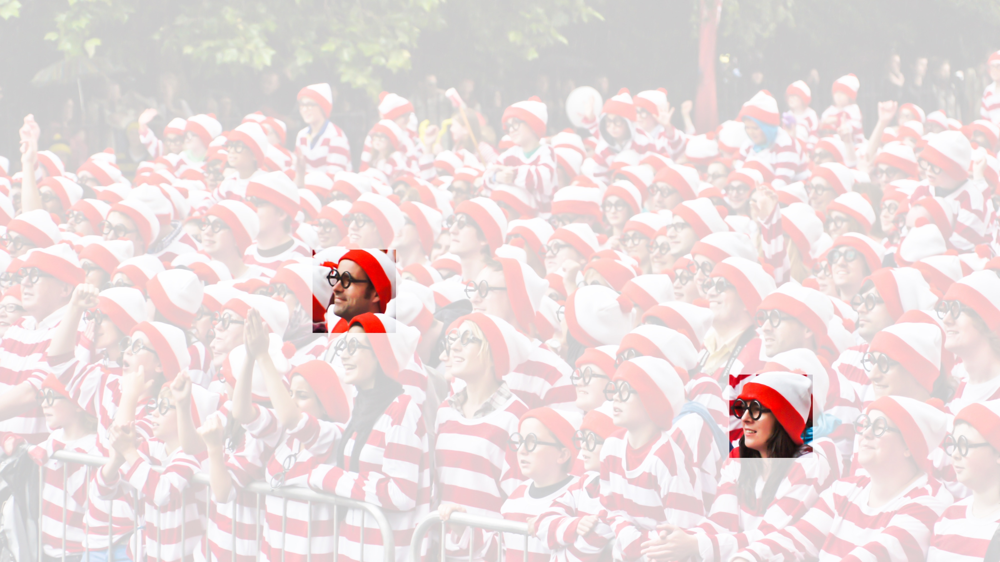

# From Fully Connected Layers to Convolutions
:label:`sec_why-conv`

The models introduced so far treat the input as a collection of features
without assuming a spatial relation among them. This is appropriate for many
tabular datasets, where columns have no natural ordering. Images have a known
two-dimensional organization, and ignoring it makes a fully connected model
both inefficient and insensitive to useful prior knowledge.

Consider a classifier that distinguishes cats from dogs in one-megapixel
photographs.
This means that each input to the network has one million dimensions.
Even an aggressive reduction to one thousand hidden dimensions
would require a fully connected layer with
$10^6 \times 10^3 = 10^9$ parameters. In 32-bit floating point, the weights
alone occupy 4 GB, before gradients, optimizer state, and activations are
stored. The layer is therefore expensive to train and statistically difficult
to estimate unless the dataset is correspondingly large.

Reducing the resolution to one hundred thousand pixels does not remove the
problem, because a practical representation may also require substantially
more than 1000 hidden units. A fully connected model can therefore still
require billions of parameters.
Moreover, learning a classifier by fitting so many parameters
might require collecting an enormous dataset.
And yet today both humans and computers are able
to distinguish cats from dogs quite well,
seemingly contradicting these intuitions.
Images exhibit spatial structure that a model can exploit. Convolutional
neural networks (CNNs) encode two important parts of this structure: local
interactions and a shared response to the same pattern at different
locations.
The derivation below maps an input image $\mathbf{X}$ to a hidden
representation $\mathbf{H}$ while imposing these two constraints.

## Invariance

An object detector should recognize a pattern at different locations in an
image. The children's game "Where's Waldo," illustrated in
:numref:`img_waldo`, provides a simple example: the target retains its identity
regardless of where it appears in the scene.
Each scene contains many people and activities, with Waldo placed among the
distractions. His appearance does not depend on his location. A detector could
therefore scan the image and assign each patch a score indicating its
likelihood of containing Waldo.
In fact, many object detection :cite:`Girshick.Donahue.Darrell.ea.2014` 
and semantic segmentation :cite:`Long.Shelhamer.Darrell.2015` algorithms 
are based on this approach. 
CNNs systematize this idea of *spatial invariance*,
exploiting it to learn useful representations
with fewer parameters.

:width:`400px`
:label:`img_waldo`

These observations suggest three requirements for a computer vision
architecture:

1. In the earliest layers, our network
   should respond similarly to the same patch,
   regardless of where it appears in the image: if the input is translated, the
   feature map produced by these layers should translate by the same amount.
   This property is called *translation equivariance*. Later in the network,
   global pooling or another location-agnostic readout can turn equivariant
   features into *translation-invariant* predictions.
1. The earliest layers of the network should focus on local regions,
   without regard for the contents of the image in distant regions. This is the *locality* principle.
   Eventually, these local representations can be aggregated
   to make predictions at the whole image level.
1. Deeper layers should combine local representations to capture progressively
   longer-range structure.

The distinction drawn in the first desideratum deserves precise notation.
Let $T_v$ denote the operator that translates an image by an offset $v$,
so that $[T_v \mathbf{X}]_{i,j} = [\mathbf{X}]_{i-v_1, j-v_2}$.
A function $f$ is *translation equivariant* if shifting its input shifts
its output by the same amount, and *translation invariant* if shifting
its input leaves the output unchanged:

$$\begin{aligned} f(T_v \mathbf{X}) &= T_v f(\mathbf{X}) && \text{(equivariance)},\\ f(T_v \mathbf{X}) &= f(\mathbf{X}) && \text{(invariance)}.\end{aligned}$$

On an infinite or periodically extended grid, a stride-1 convolution is
equivariant. Finite boundaries, padding, and subsampling require qualifications
that we develop in :numref:`sec_padding` and :numref:`sec_pooling`. Where we
want invariance, a global aggregation in the head can supply it: such an
operation discards *where* a feature occurred and keeps whether it occurred.

We now express these requirements mathematically.

## Constraining the MLP

Consider an MLP whose input $\mathbf{X}$ and immediate hidden representation
$\mathbf{H}$ are matrices of the same shape (two-dimensional tensors in code).
We retain the spatial organization of both arrays.

Let $[\mathbf{X}]_{i, j}$ and $[\mathbf{H}]_{i, j}$ denote the pixel
at location $(i,j)$
in the input image and hidden representation, respectively.
Consequently, to have each of the hidden units
receive input from each of the input pixels,
we would switch from using weight matrices
(as we did previously in MLPs)
to representing our parameters
as fourth-order weight tensors $\mathsf{W}$.
Suppose that $\mathbf{U}$ contains biases,
we could formally express the fully connected layer as

$$\begin{aligned} \left[\mathbf{H}\right]_{i, j} &= [\mathbf{U}]_{i, j} + \sum_k \sum_l[\mathsf{W}]_{i, j, k, l}  [\mathbf{X}]_{k, l}\\ &=  [\mathbf{U}]_{i, j} +
\sum_a \sum_b [\mathsf{V}]_{i, j, a, b}  [\mathbf{X}]_{i+a, j+b}.\end{aligned}$$

The switch from $\mathsf{W}$ to $\mathsf{V}$ is entirely cosmetic for now
since there is a one-to-one correspondence
between coefficients in both fourth-order tensors.
We re-index the subscripts $(k, l)$ so that $k = i+a$ and $l = j+b$.
In other words, we set $[\mathsf{V}]_{i, j, a, b} = [\mathsf{W}]_{i, j, i+a, j+b}$.
The indices $a$ and $b$ run over both positive and negative offsets,
covering the entire image.
For any given location ($i$, $j$) in the hidden representation $[\mathbf{H}]_{i, j}$,
we compute its value by summing over pixels in $x$,
centered around $(i, j)$ and weighted by $[\mathsf{V}]_{i, j, a, b}$. Mapping
a $1000 \times 1000$ image (1 megapixel) to a $1000 \times 1000$ hidden
representation in this parameterization requires $10^{12}$ parameters in a
*single* layer. A trillion parameters is roughly a million times the number of
training images we could plausibly collect for a pet classifier, so the data
would not constrain most of them.

### Translation Equivariance

We first impose translation equivariance :cite:`Zhang.ea.1988`: shifting the
input $\mathbf{X}$ should shift the hidden representation $\mathbf{H}$ by the
same amount.
For a linear map on an infinite or periodically extended grid, this requires
$\mathsf{V}$ and $\mathbf{U}$ not to depend on $(i, j)$. As such,
we have $[\mathsf{V}]_{i, j, a, b} = [\mathbf{V}]_{a, b}$ and $\mathbf{U}$ is a constant, say $u$.
As a result, we can simplify the definition for $\mathbf{H}$:

$$[\mathbf{H}]_{i, j} = u + \sum_a\sum_b [\mathbf{V}]_{a, b}  [\mathbf{X}]_{i+a, j+b}.$$

This is a *convolution*.
We are effectively weighting pixels at $(i+a, j+b)$
in the vicinity of location $(i, j)$ with coefficients $[\mathbf{V}]_{a, b}$
to obtain the value $[\mathbf{H}]_{i, j}$.
$[\mathbf{V}]_{a, b}$ needs many fewer coefficients than $[\mathsf{V}]_{i, j, a, b}$ because it
no longer depends on the location within the image. Consequently, the number
of parameters required is no longer $10^{12}$ but roughly $4 \times 10^6$:
there are $(2001)^2$ choices of offsets
$a, b \in \{-1000, \ldots, 1000\}$. Time-delay neural networks (TDNNs) are
some of the first examples to exploit this idea
:cite:`Waibel.Hanazawa.Hinton.ea.1989`.

###  Locality

We next impose locality: computing $[\mathbf{H}]_{i, j}$ should require only a
neighborhood around $(i, j)$.
This means that outside some range $|a|> \Delta$ or $|b| > \Delta$,
we should set $[\mathbf{V}]_{a, b} = 0$.
Equivalently, we can rewrite $[\mathbf{H}]_{i, j}$ as

$$[\mathbf{H}]_{i, j} = u + \sum_{a = -\Delta}^{\Delta} \sum_{b = -\Delta}^{\Delta} [\mathbf{V}]_{a, b}  [\mathbf{X}]_{i+a, j+b}.$$
:eqlabel:`eq_conv-layer`

This reduces the number of parameters from roughly $4 \times 10^6$ to
$(2\Delta+1)^2$, where $\Delta$ is typically smaller than $10$. We reduced
the number of parameters by another four orders of magnitude. Equation
:eqref:`eq_conv-layer` defines a *convolutional layer*.
*Convolutional neural networks* (CNNs)
are a special family of neural networks that contain convolutional layers.
In the deep learning research community,
$\mathbf{V}$ is referred to as a *convolution kernel*,
a *filter*, or the layer's learnable *weights*.

Where the unrestricted layer required billions of parameters, a local kernel
typically requires a few hundred without
altering the dimensionality of either
the inputs or the hidden representations.
The tradeoff for this reduction in parameters
is that our features are now translation equivariant
and that our layer can only incorporate local information,
when determining the value of each hidden activation.
All learning depends on imposing inductive bias.
When that bias agrees with reality,
we get sample-efficient models
that generalize well to unseen data.
If those biases do not agree with reality---if the same local pattern requires
a different response at every location, for example---
our models might struggle even to fit our training data.

Stacking convolutional layers with nonlinearities gives deeper units larger
effective receptive fields, allowing them to represent larger and more complex
image structure.

## Convolutions

To understand the terminology, compare :eqref:`eq_conv-layer` with the
mathematical definition of convolution.
In mathematics, the *convolution* between two functions :cite:`Rudin.1973`,
say $f, g: \mathbb{R}^d \to \mathbb{R}$ is defined as

$$(f * g)(\mathbf{x}) = \int f(\mathbf{z}) g(\mathbf{x}-\mathbf{z}) d\mathbf{z}.$$

That is, we measure the overlap between $f$ and $g$
when one function is "flipped" and shifted by $\mathbf{x}$.
Whenever we have discrete objects, the integral turns into a sum.
For instance, for vectors from
the set of square-summable infinite-dimensional vectors
with index running over $\mathbb{Z}$ we obtain the following definition:

$$(f * g)(i) = \sum_a f(a) g(i-a).$$

For two-dimensional tensors, we have a corresponding sum
with indices $(a, b)$ for $f$ and $(i-a, j-b)$ for $g$, respectively:

$$(f * g)(i, j) = \sum_a\sum_b f(a, b) g(i-a, j-b).$$
:eqlabel:`eq_2d-conv-discrete`

This looks similar to :eqref:`eq_conv-layer`, with one major difference.
Rather than using $(i+a, j+b)$, we are using the difference instead.
Note, though, that this distinction is mostly cosmetic
since we can always match the notation between
:eqref:`eq_conv-layer` and :eqref:`eq_2d-conv-discrete`.
Our original definition in :eqref:`eq_conv-layer` more properly
describes a *cross-correlation*.
We will come back to this in the following section.

## Channels
:label:`subsec_why-conv-channels`

Return to the Waldo detector.
The convolutional layer picks windows of a given size
and weighs intensities according to the filter $\mathsf{V}$, as demonstrated in :numref:`fig_waldo_mask`.
We might aim to learn a model so that
wherever the "waldoness" is highest,
we should find a peak in the hidden layer representations.

:width:`400px`
:label:`fig_waldo_mask`

The preceding derivation omitted the three color channels in an image: red,
green, and blue.
In sum, images are not two-dimensional objects
but rather third-order tensors,
characterized by a height, width, and channel,
e.g., with shape $1024 \times 1024 \times 3$ pixels. 
While the first two of these axes concern spatial relationships,
the third can be regarded as assigning
a multidimensional representation to each pixel location.
We thus index $\mathsf{X}$ as $[\mathsf{X}]_{i, j, k}$.
The convolutional filter has to adapt accordingly.
Instead of $[\mathbf{V}]_{a,b}$, we now have $[\mathsf{V}]_{a,b,c}$.

We likewise formulate the hidden representation as a third-order tensor
$\mathsf{H}$, assigning a vector rather than a scalar to each spatial location.
We could think of the hidden representations as comprising
a number of two-dimensional grids stacked on top of each other.
As in the inputs, these are sometimes called *channels*.
They are also sometimes called *feature maps*,
as each provides a spatialized set
of learned features for the subsequent layer.
In early layers, some channels may specialize in edges while
others could recognize textures.

To support multiple channels in both inputs ($\mathsf{X}$) and hidden representations ($\mathsf{H}$),
we can add a fourth coordinate to $\mathsf{V}$: $[\mathsf{V}]_{a, b, c, d}$.
Putting everything together we have:

$$[\mathsf{H}]_{i,j,d} = \sum_{a = -\Delta}^{\Delta} \sum_{b = -\Delta}^{\Delta} \sum_c [\mathsf{V}]_{a, b, c, d} [\mathsf{X}]_{i+a, j+b, c},$$
:eqlabel:`eq_conv-layer-channels`

where $d$ indexes the output channels in the hidden representations $\mathsf{H}$. The subsequent convolutional layer will go on to take a third-order tensor, $\mathsf{H}$, as input.
We take
:eqref:`eq_conv-layer-channels`,
because of its generality, as
the definition of a convolutional layer for multiple channels, where $\mathsf{V}$ is a kernel or filter of the layer.

There are still many operations that we need to address.
For instance, we need to figure out how to combine all the hidden representations
to a single output, e.g., whether there is a Waldo *anywhere* in the image.
We also need to decide how to compute things efficiently,
how to combine multiple layers,
appropriate activation functions,
and how to make reasonable design choices
to yield networks that are effective in practice.
We turn to these issues in the remainder of the chapter.

## Summary and Discussion

In this section we derived convolutional layers from two assumptions about
low-level image processing. Translation equivariance means that the same local
pattern is processed in the same way at every location; locality restricts that
processing to a small neighborhood. Exact equivariance holds on an infinite or
periodic grid. Boundaries, padding, and strides can break it, as the next
sections will show. Some of the earliest CNN-like architectures appear in the
Neocognitron :cite:`Fukushima.1982`.

The parameter reduction comes from restricting the function class. It
preserves a desired mapping when that mapping is local and translation
equivariant, but it excludes mappings that depend on absolute position. For
example, a classifier whose label changes when the same object moves from the
left half of an image to the right cannot be represented by a translation-
invariant head alone. The assumptions make many image problems tractable; they
do not preserve arbitrary functions.

Adding channels restores some of the expressive capacity removed by locality
and translation equivariance. It is natural to add channels other than red,
green, and blue. Many satellite images used in agriculture and meteorology are
hyperspectral, with tens to hundreds of channels that record different
wavelengths. The following sections show how convolutions transform spatial
dimensions and channels efficiently.

## Exercises

1. Assume that the size of the convolution kernel is $\Delta = 0$.
   Show that in this case the convolution kernel
   implements an MLP independently for each set of channels. This leads to the Network in Network 
   architectures :cite:`Lin.Chen.Yan.2013`. 
1. Audio data is often represented as a one-dimensional sequence. 
    1. When might you want to impose locality and translation equivariance for audio?
    1. Derive the convolution operations for audio.
    1. Can you treat audio using the same tools as computer vision? Hint: use the spectrogram.
1. Why might translation equivariance not be a good inductive bias? Give an example.
1. Do you think that convolutional layers might also be applicable for text data?
   Which problems might you encounter with language?
1. What happens with convolutions when an object is at the boundary of an image?
1. Prove that the convolution is symmetric, i.e., $f * g = g * f$.

[Discussions](https://d2l.discourse.group/t/64)

<!-- slides -->

::: {.slide title="Fully connected layers do not scale"}
Distinguishing cats from dogs on one-megapixel photographs:

- Each input has $10^6$ dimensions.
- Even an aggressive reduction to 1000 hidden units costs
  $10^6 \times 10^3 = 10^9$ parameters for a *single* layer.
- Keep the hidden layer spatially organized at full resolution
  and the count reaches $10^{12}$.

The objection is not that computers cannot hold $10^{12}$ numbers.
It is **waste**: about a million times more parameters than the
number of training images we could plausibly collect.
:::

::: {.slide title="Images have structure we can exploit"}
Flattening an image into a vector forgets which pixels are
neighbors. Yet humans and machines both classify pets easily,
because natural images are far from arbitrary:

- Nearby pixels are strongly correlated.
- The same pattern (an edge, an eye, a whisker) means the same
  thing wherever it appears.

CNNs are one way of building this knowledge
into the architecture itself.
:::

::: {.slide title="Where's Waldo?"}
{width=46%}

*What Waldo looks like* does not depend on *where Waldo is
located*. So sweep the image with a **Waldo detector**: assign
each patch a score for how likely it is to contain him. Many
object detection and segmentation systems work this way.
:::

::: {.slide title="Two principles"}
Desiderata for a vision architecture:

- **Translation equivariance**: in the earliest layers, shifting
  the input should shift the feature map by the same amount. The same patch
  gets the same response wherever it appears.
- **Locality**: early layers should look only at small
  neighborhoods, ignoring distant regions.

Deeper layers then aggregate: longer-range features first,
image-level predictions at the end.
:::

::: {.slide title="Constraining the MLP: the unconstrained case"}
Keep both input $\mathbf{X}$ and hidden representation $\mathbf{H}$
as 2-D grids. Fully connecting them takes a *fourth-order* weight
tensor:

$$[\mathbf{H}]_{i, j} = [\mathbf{U}]_{i, j} + \sum_a \sum_b [\mathsf{V}]_{i, j, a, b}  [\mathbf{X}]_{i+a, j+b}.$$

Every output location $(i, j)$ owns its own full-image weight
table. For a $1000 \times 1000$ image: $10^{12}$ parameters.
:::

::: {.slide title="Step 1: impose translation equivariance"}
A shift in $\mathbf{X}$ should produce the same shift in
$\mathbf{H}$. That forces the weights to be independent of
location: $[\mathsf{V}]_{i, j, a, b} = [\mathbf{V}]_{a, b}$.

$$[\mathbf{H}]_{i, j} = u + \sum_a\sum_b [\mathbf{V}]_{a, b}  [\mathbf{X}]_{i+a, j+b}.$$

One shared filter for the whole image:
$10^{12}$ parameters become $4 \times 10^6$.
:::

::: {.slide title="Step 2: impose locality"}
Outside a small window, set the weights to zero:
$[\mathbf{V}]_{a, b} = 0$ for $|a| > \Delta$ or $|b| > \Delta$.

$$[\mathbf{H}]_{i, j} = u + \sum_{a = -\Delta}^{\Delta} \sum_{b = -\Delta}^{\Delta} [\mathbf{V}]_{a, b}  [\mathbf{X}]_{i+a, j+b}.$$

With $\Delta < 10$, the count drops from roughly $4 \times 10^6$ to
$(2\Delta+1)^2$: a few hundred parameters.

This is a **convolutional layer**, and $\mathbf{V}$ is its
*kernel* (or *filter*).
:::

::: {.slide title="Why is it called a convolution?"}
In mathematics, the convolution of two functions is

$$(f * g)(i, j) = \sum_a\sum_b f(a, b) g(i-a, j-b).$$

Our layer uses $(i+a, j+b)$ instead of $(i-a, j-b)$: strictly
speaking it computes a **cross-correlation**. The difference is
cosmetic (flip the kernel), and deep learning keeps the name
*convolution*.
:::

::: {.slide title="Equivariance vs. invariance"}
Let $T_v$ translate an image by offset $v$. For a map $f$:

$$\begin{aligned} f(T_v \mathbf{X}) &= T_v f(\mathbf{X}) && \text{(equivariance)},\\ f(T_v \mathbf{X}) &= f(\mathbf{X}) && \text{(invariance)}.\end{aligned}$$

- Convolutional layers are **equivariant**: shift the input,
  the feature map shifts along.
- **Invariance** is supplied by the head of the network:
  pooling and aggregation discard *where* a feature occurred
  and keep only *whether* it occurred.
:::

::: {.slide title="Channels"}
Images are not 2-D: an RGB input is a third-order tensor,
e.g., $1024 \times 1024 \times 3$. Hidden representations
become stacks of 2-D grids too, called **channels** or
*feature maps*:

$$[\mathsf{H}]_{i,j,d} = \sum_{a = -\Delta}^{\Delta} \sum_{b = -\Delta}^{\Delta} \sum_c [\mathsf{V}]_{a, b, c, d} [\mathsf{X}]_{i+a, j+b, c}.$$

The kernel gains two channel indices: $c$ sums over input
channels, $d$ selects the output channel. Different channels
can specialize, e.g., to edges or textures.
:::

::: {.slide title="A Waldo detector, concretely"}
{width=46%}

Slide the learned filter $\mathsf{V}$ over the image and weigh
intensities window by window; wherever the "waldoness" is
highest, the hidden representation should peak.

What remains: combining feature maps into a single answer
(is Waldo *anywhere*?), efficient computation, and stacking
layers. That is the rest of this chapter.
:::

::: {.slide title="Recap"}
- Flattening images into vectors discards spatial structure and
  wastes parameters.
- Two principles constrain the MLP: **translation equivariance**
  (share weights across locations) and **locality** (small
  windows).
- Applying both turns a $10^{12}$-parameter layer into a
  convolutional layer with a few hundred parameters.
- Convolutional layers are translation *equivariant*; the network
  head buys *invariance* by aggregation.
- Channels restore expressive power: many filters per layer,
  operating over all input channels.
:::
