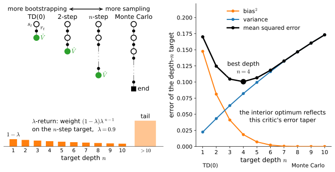
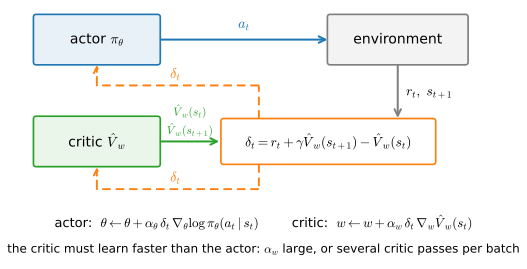

# Actor-Critic and the Credit-Assignment Dial
:label:`sec_actorcritic`

:numref:`sec_deeprl` closed by naming three debts, and this section pays the first. The agent we have learns nothing until an episode ends, because its weight, the Monte Carlo advantage $\hat{G}_t - \hat{V}(s_t)$, contains the reward-to-go, and $\hat{G}_t$ is known only once the trajectory's tail has finished unspooling, with every coin flip of that tail baked into the number. Here we replace the sampled tail by a prediction, borrowing the bootstrapped one-step target that Q-learning built its update on in :numref:`sec_qlearning`. Three things come out. A pair of learners that improve each other as the agent acts, an *actor* $\pi_\theta$ and a *critic* $\hat{V}_w$, an arrangement older than deep learning :cite:`Barto.Sutton.Anderson.1983,Konda.Tsitsiklis.2000`. A continuous dial between the one-step estimate and the Monte Carlo one, with a four-line identity that collapses the whole dial into one line of code. And a measurement of the dial's two ends, bias against variance, on the task itself.

```{.python .input #actor-critic-actor-critic-and-the-credit-assignment-dial-1}
%%tab pytorch
%matplotlib inline
from d2l import torch as d2l
import gymnasium as gym
import numpy as np
import torch
from torch import nn
torch.set_num_threads(1)
```

```{.python .input #actor-critic-actor-critic-and-the-credit-assignment-dial-1}
%%tab jax
%matplotlib inline
from d2l import jax as d2l
from flax import nnx
import gymnasium as gym
import jax
from jax import numpy as jnp
import numpy as np
import optax
```

The laboratory is unchanged from :numref:`sec_deeprl`: CartPole, discount $0.99$, and the one-hidden-layer `ActorCritic.mlp` container, so that every difference below is a difference between algorithms and not between setups. One hyperparameter is new, and it is this section's knob: `critic_steps`, the number of regression passes the critic takes per batch. :numref:`sec_deeprl` gave `fit_value` a pass count and deliberately took a single pass; this section takes twenty, each against a freshly recomputed target.

```{.python .input #actor-critic-actor-critic-and-the-credit-assignment-dial-2}
%%tab pytorch, jax
gamma, num_updates, batch_episodes = 0.99, 100, 8
num_seeds, critic_steps, grad_clip = 3, 20, 0.5
if tab.selected('pytorch'):
    def cartpole_agent(seed):
        torch.manual_seed(seed)
        return d2l.ActorCritic.mlp(4, 2)
if tab.selected('jax'):
    def cartpole_agent(seed):
        return d2l.ActorCritic.mlp(4, 2, rngs=nnx.Rngs(seed))
```

## Bootstrapping the Reward-to-Go

### The TD error

Write out one step of what the reward-to-go contains,

$$\hat{G}_t = r_t + \gamma\, \hat{G}_{t+1},$$

and recall what the learned baseline of :numref:`sec_baselines` is trained on: $\hat{V}(s_{t+1})$ regresses toward exactly the quantity that $\hat{G}_{t+1}$ samples. So stop waiting for the sample and substitute the prediction, $\hat{G}_t \approx r_t + \gamma \hat{V}(s_{t+1})$. The weight on the score at step $t$ was $\hat{G}_t - \hat{V}(s_t)$; after the substitution it becomes

$$\delta_t = r_t + \gamma\, \hat{V}(s_{t+1}) - \hat{V}(s_t),$$
:eqlabel:`eq_td_error_v`

with the convention $\hat{V}(s_{t+1}) = 0$ when $s_{t+1}$ is terminal. This is the temporal-difference error of :eqref:`eq_td_error` with one substitution of its own: Q-learning's scalar bootstraps on the greedy continuation $\max_{a'} \hat{Q}(s', a')$ because it aims at $Q^*$, while this one bootstraps on the policy's own continuation $\hat{V}(s_{t+1})$, because a policy gradient needs the value of the policy it is improving. Everything :numref:`sec_qlearning` established about the scalar carries over, the terminal mask included: the mask is gated by `terminated` and never by `truncated`, since a time limit is a stopped recording, not an empty future (:numref:`sec_mdp`). In code the target is one line on the `Batch` container, and notice what the line cannot contain: a gradient graph. The `bootstrap` argument maps numpy states to numpy values, and a numpy array carries no autograd history, so the target is data by construction; there is no `detach` here because the numpy boundary *is* the detach.

```{.python .input #actor-critic-the-td-error}
%%tab pytorch, jax
@d2l.add_to_class(d2l.Batch)  #@save
def td_target(self, bootstrap, gamma):
    """r_t + gamma (1 - terminated) V(s'), by a numpy bootstrap."""
    return self.rew + gamma * (1 - self.term) * bootstrap(self.next_obs)
```

One bookkeeping clause before moving on: as everywhere since :eqref:`eq_rtg`, the $\gamma^t$ factor that the strict discounted derivation would place on the actor's step stays dropped; :numref:`sec_baselines` priced that choice once, and nothing about it changes here.

### Why it is an advantage in expectation

The TD error is not merely cheaper than the Monte Carlo weight; it estimates the same thing. Suppose for a moment the critic were exact, $\hat{V} = V^\pi$. Averaging :eqref:`eq_td_error_v` over the next state,

$$E\big[ \delta_t \mid s_t, a_t \big] = r(s_t, a_t) + \gamma \sum_{s'} P(s' \mid s_t, a_t)\, V^{\pi}(s') - V^{\pi}(s_t) = Q^{\pi}(s_t, a_t) - V^{\pi}(s_t),$$

where the second equality is :eqref:`eq_dynamic_programming_q` written with $V^\pi$. The right-hand side is the advantage :eqref:`eq_advantage` of the action taken, the exact quantity the learned baseline of :numref:`sec_baselines` estimated with $\hat{G}_t - \hat{V}(s_t)$. So a single transition, one reward plus two critic evaluations, yields an unbiased one-sample estimate of the advantage, where the Monte Carlo estimate needed the entire remaining trajectory.

The price is in the premise. During training $\hat{V}$ is not $V^\pi$, so $\delta_t$ is a biased estimate of the advantage, and the policy update below is no longer an unbiased gradient estimator of $J(\theta)$. Nor does the baseline lemma of :numref:`sec_baselines` come to the rescue: that argument subtracted quantities already determined when the agent stands at $s_t$, and the bootstrap term $\hat{V}(s_{t+1})$ is not such a quantity, since $s_{t+1}$ depends on the action (exercise 1 locates the exact step that breaks). We traded variance for bias.

### The critic is sampled policy evaluation

What kind of object is the critic's own update? :numref:`sec_valueiter` built *policy evaluation*, the Bellman sweep without the max, whose fixed point is $V^\pi$; it consumed the kernel $P$ through one expectation. Regressing $\hat{V}(s_t)$ toward $r_t + \gamma \hat{V}(s_{t+1})$ is that sweep with the expectation replaced by the single sampled next state, exactly the substitution that turned value iteration into Q-learning in :numref:`sec_qlearning`, now aimed at the *current policy's* value rather than the optimal one. That closes a thread left open since :numref:`fig_rl_gpi`: actor-critic is generalized policy iteration with both halves approximate, a sampled, bootstrapped evaluation nudging $\hat{V}$ toward $V^{\pi_\theta}$, and a sampled policy-gradient step as the improvement half, each move taken from the other's current answer. And because the target contains the critic's own prediction, the critic has crossed the line that :numref:`sec_deeprl` drew under "why nothing broke": its update is a semi-gradient chasing a self-consistency condition, not gradient descent on any fixed objective. This chapter begins on the far side of that line.

### The trade, named

Both estimates of the advantage are honest attempts at the same number, and they fail in opposite directions. The Monte Carlo weight is unbiased and noisy: its variance collects a contribution from every remaining step of the episode, so it grows with the horizon, and on CartPole the horizon grows as the policy improves. The TD error is quiet and wrong: its noise is one reward and one transition, but it leans wherever the critic leans, and early in training the critic leans everywhere. This is the same bargain Q-learning struck (:eqref:`eq_td_error`), now on the policy side, and :numref:`fig_rl_td_mc_spectrum` draws the whole family it generates: between one step of reality and the full tail sit targets of every depth, bias falling and variance rising as the estimate trusts sampling for longer before handing over to the critic. The right panel of the figure measures the family on a synthetic chain where the truth is computable; the last part of this section runs the same measurement where it is not, on CartPole itself.

![The credit-assignment dial. Left: backup diagrams of depth one, two, $n$, and to termination; the green node is where the estimate stops sampling and starts trusting the critic, and the strip below shows the $\lambda$-return's weights $(1-\lambda)\lambda^{n-1}$ over the $n$-step targets at $\lambda = 0.9$. Right: the family measured on a synthetic ten-state chain, deterministic step right with only the final transition paying $1$, per-step reward noise of standard deviation $0.15$, and $\gamma = 0.97$, under a critic whose error tapers toward termination as $0.5\,(1 - s/9)^2$, the shape value learning actually produces; over $20{,}000$ rollouts of the depth-$n$ target from the start state, bias falls with depth, variance grows, and the mean squared error is smallest at $n = 4$. A critic equally wrong everywhere would make the error monotone in $n$; the interior optimum exists because deeper targets bootstrap from better-known states.](../img/mdl-rl-td-mc-spectrum.svg)
:label:`fig_rl_td_mc_spectrum`

## The Actor-Critic Algorithm

### Two learners, one number

Both learners now update from the same scalar. Writing $\hat{V}_w$ for the critic's parameters, the updates after the transition $(s_t, a_t, r_t, s_{t+1})$ are

$$w \leftarrow w + \alpha_w\, \delta_t\, \nabla_w \hat{V}_w(s_t), \qquad \theta \leftarrow \theta + \alpha_\theta\, \delta_t\, \nabla_\theta \log \pi_\theta(a_t \mid s_t).$$
:eqlabel:`eq_actor_critic`

The critic's update is the sampled policy evaluation of the previous section, a semi-gradient step toward the one-step target; the actor's is the policy gradient of :numref:`sec_baselines` with $\delta_t$ as the advantage weight. One number does both jobs: $\delta_t$ tells the critic how wrong its prediction was, and it tells the actor whether the action just taken was better or worse than the state's average. And because $\delta_t$ needs only a single transition, :eqref:`eq_actor_critic` can be applied at every step as the agent acts, the way Q-learning updates its table; nothing must terminate before learning starts, so the method extends to tasks that never end. REINFORCE, with or without a baseline, cannot say the same.


:label:`fig_rl_actor_critic_loop`

### Two timescales

Two learning rates appear because the two learners have different jobs. The critic chases a moving target twice over: every actor update changes the policy, which changes the values the critic is trying to predict, and every critic update moves the bootstrapped targets themselves. The actor then judges its actions with whatever the critic currently believes. If the actor moves much faster than the critic, the advantages are judged against stale values and the updates degrade. The practical rule is to let the critic learn faster than the actor, either through a larger learning rate or through more update steps, and our implementation uses the second form.

### A2C by name

What we implement below is not the fully online :eqref:`eq_actor_critic`, and the difference deserves its name. The code collects a batch of eight episodes, gives the critic its `critic_steps` regression passes on the batch's one-step targets, and then takes a single actor step weighted by the TD errors of the freshly updated critic: this batched, synchronous form is the *advantage actor-critic*, A2C, the workhorse descendant of the asynchronous original :cite:`Mnih.Badia.Mirza.ea.2016`. The fully online form, one update per transition with no batch at all, is exercise 5, and what goes wrong there is a preview of :numref:`sec_dqn`.

Two pieces of local machinery first. The actor's step is `d2l.policy_step` with one addition that the bootstrapped weight will shortly justify: the gradient norm is capped at the customary $0.5$, and the function reports the norm it measured *before* the cap, because that number is about to carry a lesson.

```{.python .input #actor-critic-a2c-by-name-1}
%%tab pytorch
def policy_step_clip(ac, batch, w, clip=grad_clip):
    """d2l.policy_step with the actor's gradient norm capped at `clip`;
    returns the norm measured before the cap."""
    obs, act = torch.as_tensor(batch.obs), torch.as_tensor(batch.act)
    loss = -(torch.as_tensor(w) * ac.log_prob(obs, act)).mean()
    ac.opt_pi.zero_grad()
    loss.backward()
    gnorm = nn.utils.clip_grad_norm_(ac.policy.parameters(), clip)
    ac.opt_pi.step()
    return float(gnorm)
```

```{.python .input #actor-critic-a2c-by-name-1}
%%tab jax
def policy_step_clip(ac, batch, w, clip=grad_clip):
    """d2l.policy_step with the actor's gradient norm capped at `clip`;
    returns the norm measured before the cap. `_pad` and `_actor_pass`,
    defined with the critic's compilation story two cells below, are
    resolved at the first call."""
    size = 1 << max(6, (len(w) - 1).bit_length())
    gnorm = _actor_pass(ac.policy, ac.opt_pi, _pad(batch.obs, size),
                        _pad(batch.act, size), _pad(w, size),
                        jnp.float32(len(w)), jnp.float32(clip))
    return float(gnorm)
```

The second piece is per-framework speed, not algorithm, and follows the compilation rule of :numref:`sec_compilation`: compile what has a fixed shape and runs hot, leave ragged shapes eager. The acting forward runs a few hundred thousand times at one fixed shape, so the jax tab compiles and caches it exactly as :numref:`sec_deeprl` did; the pytorch tab's eager dispatch is already cheap at this scale and needs nothing.

```{.python .input #actor-critic-a2c-by-name-2}
%%tab jax
_act_probs = nnx.jit(lambda net, obs: jax.nn.softmax(net(obs), -1))

def _probs(ac, obs):   # the fixed-shape acting forward, compiled and
    if not hasattr(ac, '_fwd'):        # cached as in :numref:`sec_deeprl`
        ac._fwd = nnx.cached_partial(_act_probs, ac.policy)
    return np.asarray(ac._fwd(jnp.asarray(obs)))

@d2l.add_to_class(d2l.ActorCritic)
def act(self, obs, rng):
    p = _probs(self, obs)
    return int(rng.choice(len(p), p=p))

@d2l.add_to_class(d2l.ActorCritic)
def act_greedy(self, obs, rng=None):
    return int(_probs(self, obs).argmax())
```

The critic's regression and the actor's clipped step are this section's hot loops, together tens of thousands of passes per run, each on a batch of a few fixed lengths. Padding every batch to a power-of-two length makes the shape one of a handful and lets the jitted passes, and the jitted value read that computes the critic's target, compile once per bucket rather than once per batch; a mask, or zero-padded weights, keeps the padded entries out of each loss.

```{.python .input #actor-critic-a2c-by-name-3}
%%tab pytorch
# Eager per-pass cost is about a millisecond in this tab; the library
# helper needs no compilation story here, unlike its jax sibling.
fit_value = d2l.fit_value
```

```{.python .input #actor-critic-a2c-by-name-3}
%%tab jax
def _pad(x, size):
    return jnp.asarray(np.pad(x, ((0, size - len(x)),) + ((0, 0),)
                              * (x.ndim - 1)))

_value_fwd = nnx.jit(lambda net, obs: net(obs).squeeze(-1))

@d2l.add_to_class(d2l.ActorCritic)
def value_np(self, obs):   # batched reads only, padded to the bucket size
    size = 1 << max(6, (len(obs) - 1).bit_length())
    return np.asarray(_value_fwd(self.value, _pad(obs, size)))[:len(obs)]

@nnx.jit
def _critic_pass(value, opt, obs, target, mask):
    loss, grads = nnx.value_and_grad(lambda v: (mask * (
        v(obs).squeeze(-1) - target) ** 2).sum() / mask.sum())(value)
    opt.update(value, grads)
    return loss

@nnx.jit
def _actor_pass(policy, opt, obs, act, adv, n_real, clip):
    def loss_fn(p):   # zero-padded adv silences the padded rows exactly
        logp = jax.nn.log_softmax(p(obs), -1)[jnp.arange(obs.shape[0]), act]
        return -(adv * logp).sum() / n_real
    grads = nnx.grad(loss_fn)(policy)
    gnorm = optax.global_norm(grads)
    grads = jax.tree.map(lambda g: g * jnp.minimum(1.0, clip / gnorm), grads)
    opt.update(policy, grads)
    return gnorm

def fit_value(ac, obs, target, num_steps=1):
    """d2l.fit_value, padded to a power-of-two length: the jitted pass
    compiles once per size bucket (:numref:`sec_compilation`)."""
    size = 1 << max(6, (len(target) - 1).bit_length())
    mask = jnp.asarray((np.arange(size) < len(target)).astype(np.float32))
    for _ in range(num_steps):
        loss = _critic_pass(ac.value, ac.opt_v, _pad(obs, size),
                            _pad(target, size), mask)
    return float(loss)
```

Now the two training functions, side by side. The Monte Carlo reference is `train_reinforce` of :numref:`sec_deeprl` with two mechanical changes: the agent arrives from the caller, the pattern of :numref:`sec_qlearning`'s caller-owned tables, so that the last cell of this section can audit the trained agents; and the actor's step goes through the clipped variant and yields its gradient norm, a diagnostic returned as data.

```{.python .input #actor-critic-a2c-by-name-4}
%%tab pytorch, jax
def train_reinforce(seed, ac, num_updates=num_updates):
    """sec_deeprl's learned-baseline REINFORCE; the agent is caller-owned
    and the actor step reports its pre-clip gradient norm."""
    rng, env = np.random.default_rng(seed), gym.make('CartPole-v1')
    env.reset(seed=seed)
    for _ in range(num_updates):
        batch = d2l.rollout(env, ac.act, batch_episodes, rng)
        G = batch.reward_to_go(gamma)
        w = d2l.normalize(G - ac.value_np(batch.obs))
        gnorm = policy_step_clip(ac, batch, w)
        fit_value(ac, batch.obs, G)
        yield float(batch.episode_returns().mean()), gnorm
```

Actor-critic is the same loop with the tail replaced, and the diff is four lines. The critic regresses on the bootstrapped one-step target instead of the reward-to-go, and takes its `critic_steps` passes *first*, so that the actor judges its actions with the freshest available critic; each pass recomputes its target from the newest critic, so the regression tracks the moving fixed point it is chasing rather than a snapshot of it. The weight handed to the actor is the TD error of :eqref:`eq_td_error_v`, normalized per batch exactly as before. Nothing else changes.

```{.python .input #actor-critic-a2c-by-name-5}
%%tab pytorch, jax
def train_ac(seed, ac, num_updates=num_updates):
    """The same loop with the sampled tail replaced by the bootstrap."""
    rng, env = np.random.default_rng(seed), gym.make('CartPole-v1')
    env.reset(seed=seed)
    for _ in range(num_updates):
        batch = d2l.rollout(env, ac.act, batch_episodes, rng)
        for _ in range(critic_steps):   # fresh target, one pass, repeat
            fit_value(ac, batch.obs, batch.td_target(ac.value_np, gamma))
        delta = batch.td_target(ac.value_np, gamma) - ac.value_np(batch.obs)
        gnorm = policy_step_clip(ac, batch, d2l.normalize(delta))
        yield float(batch.episode_returns().mean()), gnorm
```

Three seeds each, with the agents kept. The reference arm first:

```{.python .input #actor-critic-a2c-by-name-6}
%%tab pytorch, jax
agents = {name: [cartpole_agent(s) for s in range(num_seeds)]
          for name in ('REINFORCE + baseline', 'actor-critic')}
runs = {'REINFORCE + baseline': np.array(
    [list(train_reinforce(s, agents['REINFORCE + baseline'][s]))
     for s in range(num_seeds)])}
```

Then the bootstrapped arm, and the comparison:

```{.python .input #actor-critic-a2c-by-name-9}
%%tab pytorch, jax
runs['actor-critic'] = np.array(
    [list(train_ac(s, agents['actor-critic'][s]))
     for s in range(num_seeds)])
d2l.plot_curves({name: r[:, :, 0] for name, r in runs.items()},
                xlabel='update', ylabel='mean return of the batch',
                reference=500)
```

The two curves are the trade of :numref:`fig_rl_td_mc_spectrum` drawn by the algorithms themselves. Actor-critic starts slower: for its first stretch the critic is still wrong, the TD errors point in poorly chosen directions, and the biased updates buy little, while the Monte Carlo weight is correct on average from the first batch. Then the curves stop differing in level, both reach the neighborhood of the ceiling, and start differing in *texture*. A batch mean of $500$ means every one of the batch's eight episodes ran the full 500 steps, a perfect batch; $500$ is CartPole's structural ceiling, so it can be tied but never beaten, and the honest comparison is not who is higher but who, having arrived, stays. The claim is checkable in four lines:

```{.python .input #actor-critic-a2c-by-name-7}
%%tab pytorch, jax
def longest_streak(hits):
    """The longest run of consecutive True entries."""
    best = run = 0
    for h in hits:
        run = run + 1 if h else 0
        best = max(best, run)
    return best

for name, r in runs.items():
    print(f'{name:>20}: longest stretch of perfect batches, per seed: '
          f'{[longest_streak(row == 500) for row in r[:, :, 0]]}')
```

What separates the methods here is not the height of the plateau but whether a run ever comes to rest on it: in every tab the longest stretch of consecutive perfect batches belongs to the bootstrapped side, and the gap is widest exactly where the horizon is longest. Not a higher plateau, a stiller one. The Monte Carlo curve keeps dipping and recovering to the end, because its weight still carries the sampled noise of every remaining coin flip of the trajectory, and a run at the ceiling is only ever one noisy batch away from a stumble; the bootstrapped weight's noise left with the tail. The early cost is the bias while the critic trains, the late payoff is the stillness, and both halves of the bargain are visible in one figure.

The training functions also brought back a second number, and it justifies the clip. Both methods scale their weights to unit variance before the update, so it is tempting to assume both take steps of the same size:

```{.python .input #actor-critic-a2c-by-name-8}
%%tab pytorch, jax
for name, r in runs.items():
    g = r[:, :, 1].ravel()
    print(f'{name:>20}: median pre-clip gradient norm {np.median(g):5.2f}, '
          f'clip binds on {(g > grad_clip).mean():4.0%} of updates')
```

Measured on these runs the actor-critic gradients are an order of magnitude larger, and the clip binds on about a third of the actor-critic updates and on none of the Monte Carlo ones. The reason is the baseline argument of :numref:`sec_baselines` read backwards: whatever part of the weight depends on the state alone contributes nothing in expectation, and the Monte Carlo weight spends much of its variance there, while $\delta_t$ is almost all action-dependent signal. A better advantage estimate is also a bigger step at the same learning rate, and how to take big steps safely is what :numref:`sec_ppo` is about.

### Why the critic's moving target is survivable here and fatal later

The two-timescale paragraph promised trouble, the critic chasing a doubly moving target, and the runs above show none. The reason is freshness. Every batch is drawn from the current policy at exactly the states the current policy visits, so wherever the critic is wrong in a way that matters, the very next batch delivers the transitions that expose it; this is :numref:`sec_qlearning`'s self-correcting loop, running on $V$ instead of $Q$. The same loop also lets us watch the trade itself in vivo. Rerun `train_ac` once more, and before each actor step compute both candidate weights for the same batch, the TD error and the Monte Carlo advantage: how much the two agree, and how much each varies.

```{.python .input #actor-critic-why-the-critic-s-moving-target-is-survivable-here-and-fatal-later}
%%tab pytorch, jax
rng, env = np.random.default_rng(0), gym.make('CartPole-v1')
ac = cartpole_agent(0)
env.reset(seed=0)
trace = []
for _ in range(num_updates):
    b = d2l.rollout(env, ac.act, batch_episodes, rng)
    for _ in range(critic_steps):
        fit_value(ac, b.obs, b.td_target(ac.value_np, gamma))
    V = ac.value_np(b.obs)
    delta = b.td_target(ac.value_np, gamma) - V
    A_mc = b.reward_to_go(gamma) - V
    trace.append((np.corrcoef(delta, A_mc)[0, 1], delta.var(), A_mc.var()))
    policy_step_clip(ac, b, d2l.normalize(delta))
trace = np.array(trace)
print(f'corr(TD error, MC advantage): mean {trace[:10, 0].mean():.2f} over '
      f'the first ten updates, {trace[-50:, 0].mean():.2f} over the last 50')
d2l.plot_curves({'corr(TD error, MC advantage)': trace[:, 0]},
                xlabel='update', ylabel='correlation', smooth=10)
```

When episodes last a few dozen steps the two candidate weights visibly overlap, a correlation around $0.3$; by the time the policy holds the pole for hundreds of steps the correlation has fallen to zero. This is not the critic failing. Unroll :eqref:`eq_td_error_v` one step and the Monte Carlo advantage contains the TD error, plus a discounted copy of itself one step later: $\hat{G}_t - \hat{V}(s_t) = \delta_t + \gamma \big( \hat{G}_{t+1} - \hat{V}(s_{t+1}) \big)$. At a long horizon the Monte Carlo weight is therefore one part signal shared with $\delta_t$ and hundreds of parts accumulated tail, and the share the two weights have in common shrinks toward nothing as episodes lengthen: the correlation falls because the Monte Carlo weight is dissolving into noise, not because the TD error is drifting away from it. The second half of the measurement says the same thing in absolute terms:

```{.python .input #actor-critic-why-the-critic-s-moving-target-is-survivable-here-and-fatal-later-1}
%%tab pytorch, jax
print(f'median variance, MC advantage over TD error: '
      f'{np.median(trace[:, 2] / trace[:, 1]):.0f}x')
d2l.plot_curves({'TD error': trace[:, 1], 'MC advantage': trace[:, 2]},
                xlabel='update', ylabel='variance of the weight', smooth=10)
```

As the policy improves and episodes stretch toward 500 steps, the Monte Carlo weight's variance grows with the horizon, every extra step of tail adding its noise, from tens of squared units early in training to several hundred at the ceiling; the TD error's variance is the flat line pinned at the bottom of the same axes, one reward and one transition regardless of what follows, and it falls further as the critic sharpens, which is what pushes the printed median ratio past a hundredfold. The actor wants the advantage, and at a 500-step horizon the Monte Carlo estimate of it is almost entirely tail; averaging over a batch of eight episodes is what kept REINFORCE trainable at all.

Hold on to why this worked, because :numref:`sec_dqn` is about what happens when it stops working. The critic survives its moving target because its data is never stale; sever that, by training a value function on replayed old experience, off the visited distribution, with the bootstrap still in the loop, and the same semi-gradient can diverge outright. Notice also which way our implementation leaned: every pass recomputes its target from the newest critic, maximal tracking, affordable precisely because fresh data keeps auditing the result. :numref:`sec_dqn`, having given up freshness, makes the opposite choice, freezing the bootstrap inside a second, slowly synchronized copy of the value network, the *target network*, and trades tracking away for stability.

## The Dial

### n-step returns

The one-step target and the Monte Carlo tail are the ends of a family. Trust sampling for $n$ steps before handing over to the critic,

$$\hat{G}^{(n)}_t = r_t + \gamma\, r_{t+1} + \cdots + \gamma^{n-1} r_{t+n-1} + \gamma^n\, \hat{V}(s_{t+n}),$$
:eqlabel:`eq_nstep_return`

and the corresponding advantage estimate is $\hat{G}^{(n)}_t - \hat{V}(s_t)$. At $n = 1$ this is $\delta_t$; run $n$ to the end of the episode and it is the Monte Carlo advantage. In between, each extra step of reality buys bias down, the critic's error arrives discounted by $\gamma^n$ and evaluated $n$ steps closer to termination where value estimates are better, and costs variance up, one more sampled reward and transition in every estimate; that is exactly the falling and rising pair measured in :numref:`fig_rl_td_mc_spectrum`.

### The lambda-return and the telescoping identity

Rather than pick one depth, average them all, with geometric weights that make the average computable:

$$\hat{A}^{\textrm{GAE}}_t = (1 - \lambda) \sum_{n=1}^{\infty} \lambda^{n-1} \big( \hat{G}^{(n)}_t - \hat{V}(s_t) \big), \qquad \lambda \in [0, 1].$$
:eqlabel:`eq_lambda_return`

The weights $(1-\lambda)\lambda^{n-1}$ sum to one, $\lambda = 0$ puts everything on the one-step estimate, and $\lambda \to 1$ puts everything on the deepest one. Written this way the estimator looks like it needs every depth computed separately. It does not, and the identity that says so is why $\lambda$ survived into every deployed implementation :cite:`Schulman.Moritz.Levine.ea.2016`.

**Proposition.** The mixture collapses to a discounted sum of TD errors:

$$
\hat{A}^{\textrm{GAE}}_t = \sum_{l=0}^{\infty} (\gamma\lambda)^l\, \delta_{t+l}.
$$
:eqlabel:`eq_gae_deltas`

**Proof.** Each depth telescopes into TD errors: $\sum_{l=0}^{n-1} \gamma^l \delta_{t+l} = \sum_{l=0}^{n-1} \gamma^l r_{t+l} + \gamma^n \hat{V}(s_{t+n}) - \hat{V}(s_t) = \hat{G}^{(n)}_t - \hat{V}(s_t)$, the interior $\hat{V}$ terms cancelling in pairs. Substitute this into :eqref:`eq_lambda_return` and swap the two sums: the pair $(n, l)$ with $l < n$ contributes $(1-\lambda)\lambda^{n-1} \gamma^l \delta_{t+l}$, so $\hat{A}^{\textrm{GAE}}_t = \sum_{l \ge 0} \gamma^l \delta_{t+l}\, (1-\lambda) \sum_{n \ge l+1} \lambda^{n-1}$. The inner geometric sum is $\lambda^l$. $\blacksquare$

On an episodic task the sums truncate at termination, where $\hat{V} = 0$ and no rewards follow, so every $\delta$ past the end is zero and the infinite form above is also the finite one.

### GAE in one old function

Read :eqref:`eq_gae_deltas` as an algorithm: compute the TD errors, then accumulate them backward with factor $\gamma\lambda$, restarting at episode boundaries. That is *generalized advantage estimation*, GAE, and the accumulation is a scan this book already owns. `Batch.backward_scan` was written once in :numref:`sec_baselines` with the promise that it would be run on TD errors here, and the promise costs two lines to keep: a new estimator is a new input to an old function.

```{.python .input #actor-critic-gae-in-one-old-function-1}
%%tab pytorch, jax
@d2l.add_to_class(d2l.Batch)  #@save
def gae(self, value_fn, gamma, lam):
    """GAE(gamma, lam): the reward-to-go scan, run on the TD errors."""
    delta = self.td_target(value_fn, gamma) - value_fn(self.obs)
    return self.backward_scan(delta, gamma * lam)
```

The endpoints are theorems, so we assert rather than assume them: at $\lambda = 0$ the scan returns the TD errors themselves, and at $\lambda = 1$ the telescoping runs to termination and returns the reward-to-go minus the baseline, the Monte Carlo advantage of :numref:`sec_baselines`.

```{.python .input #actor-critic-gae-in-one-old-function-2}
%%tab pytorch, jax
env = gym.make('CartPole-v1')
env.reset(seed=0)
fresh = cartpole_agent(0)
b = d2l.rollout(env, fresh.act, 8, np.random.default_rng(0))
V = fresh.value_np(b.obs)
delta = b.td_target(fresh.value_np, gamma) - V
assert np.allclose(b.gae(fresh.value_np, gamma, 0.0), delta)
assert np.allclose(b.gae(fresh.value_np, gamma, 1.0),
                   b.reward_to_go(gamma) - V, atol=1e-4)
print('lambda = 0 is the TD error; lambda = 1 is the Monte Carlo advantage')
```

One boundary clause: the $\lambda = 1$ identity holds on episodes that *terminate*. On an episode cut off by a time limit, `gae` correctly bootstraps the missing future through the unmasked $\hat{V}$ in its last TD error, while `reward_to_go` silently pretends the future is empty; the untrained probe above ends every episode by falling, which is why the assertion is exact. The estimator handles the `terminated`-versus-`truncated` distinction of :numref:`sec_mdp` correctly because `td_target` does.

### Eligibility traces, in one clause

The dial is older than deep reinforcement learning: $\lambda$-returns are TD($\lambda$), and before batched implementations it was run *backward*, each parameter carrying an exponentially decaying eligibility trace of past scores so that every new $\delta$ could pay every old state its $(\gamma\lambda)^l$ share online, per transition, with no batch at all :cite:`Sutton.1988,Sutton.Barto.2018`. The batched scan above made the backward machinery unnecessary at textbook scale, but not obsolete: settings that forbid batches, agents that must learn from a stream under real-time and memory constraints, have revived exactly this machinery :cite:`Elsayed.Vasan.Mahmood.2024`.

## Measuring the Dial

The dial's two ends are the two algorithms already raced above; what remains is the interior. One generator serves the whole dial. It is `train_ac` with $\lambda$ exposed: the advantage is `gae`, and the critic's target is the $\lambda$-return `A + V`, which at $\lambda = 0$ is the one-step target and at $\lambda = 1$ the reward-to-go, so a single knob moves both uses of the estimate coherently. Following :numref:`sec_baselines`, the runs are deliberately small, fifty updates of four episodes, both to keep the estimator's variance visible and because five values of $\lambda$ times five seeds is twenty-five training runs.

```{.python .input #actor-critic-measuring-the-dial-1}
%%tab pytorch, jax
lams = [0.0, 0.5, 0.9, 0.95, 1.0]

def train_gae(seed, lam, num_updates=50, batch_episodes=4):
    """train_ac with the dial exposed; lam=0 is train_ac line for line."""
    rng, env = np.random.default_rng(seed), gym.make('CartPole-v1')
    ac = cartpole_agent(seed)
    env.reset(seed=seed)
    for _ in range(num_updates):
        batch = d2l.rollout(env, ac.act, batch_episodes, rng)
        for _ in range(critic_steps):
            fit_value(ac, batch.obs, batch.gae(ac.value_np, gamma, lam)
                      + ac.value_np(batch.obs))
        A = batch.gae(ac.value_np, gamma, lam)
        policy_step_clip(ac, batch, d2l.normalize(A))
        yield float(batch.episode_returns().mean())

sweep = {lam: d2l.run_seeds(train_gae, 5, lam=lam) for lam in lams}
```

```{.python .input #actor-critic-measuring-the-dial-2}
%%tab pytorch, jax
for lam, r in sweep.items():
    best = np.array([np.convolve(c, np.ones(20) / 20, 'valid').max()
                     for c in r])
    print(f'lambda = {lam:4}: best 20-update window, '
          f'median {np.median(best):5.1f}, seeds {np.round(np.sort(best))}')
d2l.plot_curves({f'lambda = {lam:g}': r for lam, r in sweep.items()},
                xlabel='update', ylabel='mean return of the batch',
                smooth=10, reference=500)
```

Read the printed best windows against the curves. The bottom of the dial trails decisively: the $\lambda = 0$ and $\lambda = 0.5$ arms are far from the ceiling when the budget ends, and their median curves have stopped rising. From $\lambda = 0.9$ upward the arms arrive together, their seed ranges overlapping too much to order them. Fifty updates is a sprint, and a sprint is the regime that flatters the deep end of the dial: the critic starts ignorant, so the arms that lean on it least learn fastest, while the arms that lean on it hardest are steered by its fictions until it catches up. What the sprint cannot show is the other half of the ledger, the stillness the main comparison measured at twice this budget, where the longest stretches of rest on the ceiling belonged to the $\lambda = 0$ end in every tab. Each end of the dial has now won one of the section's two races. To see why deployed implementations nevertheless sit high but strictly *inside* the dial, measure the estimator itself rather than the training run it drives. Freeze a partially trained agent, so that the critic is still wrong enough for the dial to matter, draw many batches at fixed parameters, and grade every $\lambda$'s policy-gradient estimate against a reference: the mean of the $\lambda = 1$ estimator across all draws, which is the many-rollout Monte Carlo answer and the only unbiased anchor available without a solvable model.

```{.python .input #actor-critic-measuring-the-dial-3}
%%tab pytorch, jax
rng, env = np.random.default_rng(1), gym.make('CartPole-v1')
frozen = cartpole_agent(1)
env.reset(seed=1)
for _ in range(40):   # a mid-training freeze: the critic is still wrong
    b = d2l.rollout(env, frozen.act, batch_episodes, rng)
    for _ in range(critic_steps):
        fit_value(frozen, b.obs, b.td_target(frozen.value_np, gamma))
    policy_step_clip(frozen, b, d2l.normalize(
        b.td_target(frozen.value_np, gamma) - frozen.value_np(b.obs)))
```

```{.python .input #actor-critic-measuring-the-dial-4}
%%tab pytorch, jax
if tab.selected('pytorch'):
    def grad_vec(ac, b, w):
        loss = -(torch.as_tensor(w) * ac.log_prob(
            torch.as_tensor(b.obs), torch.as_tensor(b.act))).mean()
        g = torch.autograd.grad(loss, list(ac.policy.parameters()))
        return np.concatenate([x.numpy().ravel() for x in g])
if tab.selected('jax'):
    @nnx.jit
    def _grad_tree(policy, obs, act, adv, n_real):
        return nnx.grad(lambda p: -(adv * jax.nn.log_softmax(p(obs), -1)[
            jnp.arange(obs.shape[0]), act]).sum() / n_real)(policy)

    def grad_vec(ac, b, w):   # padded + jitted: 1000 calls below
        size = 1 << max(6, (len(w) - 1).bit_length())
        g = _grad_tree(ac.policy, _pad(b.obs, size), _pad(b.act, size),
                       _pad(w, size), jnp.float32(len(w)))
        return np.concatenate([np.asarray(x).ravel()
                               for x in jax.tree.leaves(g)])

draws = {lam: [] for lam in lams}
for _ in range(200):
    b = d2l.rollout(env, frozen.act, 4, rng)
    for lam in lams:
        draws[lam].append(grad_vec(frozen, b,
                                   b.gae(frozen.value_np, gamma, lam)))
u_ref = np.stack(draws[1.0]).mean(axis=0)   # the many-rollout reference
for lam in lams:
    u = np.stack(draws[lam])
    bias = np.linalg.norm(u.mean(0) - u_ref) / np.linalg.norm(u_ref)
    var = ((u - u.mean(0)) ** 2).sum(1).mean() / (u_ref ** 2).sum()
    print(f'lambda = {lam:4}: relative bias {bias:4.2f}, relative '
          f'variance {var:6.1f}, one-draw error {bias ** 2 + var:6.1f}')
```

The table is the shallow U the whole section has been circling. Leaving $\lambda = 1$, the variance collapses first and fastest, most of it gone by $\lambda = 0.9$, while the bias climbs more slowly toward its $\lambda = 0$ plateau; the one-draw error, bias squared plus variance, is therefore highest at the pure Monte Carlo end, high again at the pure TD end, and lowest strictly inside, in the $\lambda = 0.9$ to $0.95$ band across our tabs, which is precisely the neighborhood every deployed PPO of :numref:`sec_ppo` runs. Two honesty notes. The $\lambda = 1$ row's bias reads zero by construction, since that estimator's mean *is* the reference, and the reference itself is known only to the precision of 200 draws of the noisiest estimator, so the bias column is trustworthy only where it is large; both large-$\lambda$ bias entries clear that bar. And the U's exact minimum depends on how wrong the frozen critic is, which is why the prose quotes its location as a neighborhood and not a digit.

Finally, the audit promised at the start: strip away the sampling noise and ask what policies the two original methods actually delivered, by evaluating the trained seed-0 agents greedily.

```{.python .input #actor-critic-measuring-the-dial-5}
%%tab pytorch, jax
env = gym.make('CartPole-v1')
for name in runs:
    env.reset(seed=2)
    score = d2l.evaluate(env, agents[name][0].act_greedy, num_episodes=100)
    print(f'{name:>20}: greedy mean return over 100 episodes: {score:.0f}')
```

Both agents balance the pole for the full 500 steps of every evaluation episode. The ceiling can only be tied, and both methods tie it; nothing here ranks them. What the section's measurements ranked was never the final policy but the estimator that got there: how noisy the road was, how big the steps were, and how still the arrival.

## Summary

Actor-critic replaces the sampled reward-to-go in the policy-gradient weight with a bootstrapped one-step estimate. The TD error :eqref:`eq_td_error_v` is, in expectation under an exact critic, the advantage of the action taken; during training the critic is not exact, and the update trades the Monte Carlo tail's variance for the critic's bias, the same bargain Q-learning struck (:eqref:`eq_td_error`), now on the policy side. The critic itself is sampled, bootstrapped policy evaluation, making actor-critic generalized policy iteration with both halves approximate, and its update is a semi-gradient: this chapter's first step past the safety line :numref:`sec_deeprl` drew. The critic must learn faster than the actor, here via `critic_steps` regression passes taken before the actor consumes the advantages; what we implement, batched episodes and one actor step per batch, is A2C. Between the one-step and Monte Carlo endpoints sits the $n$-step family :eqref:`eq_nstep_return`, and the $\lambda$-return :eqref:`eq_lambda_return` mixes all depths geometrically; the telescoping identity :eqref:`eq_gae_deltas` collapses the mixture into a discounted sum of TD errors, so GAE is the reward-to-go scan of :numref:`sec_baselines` run on TD errors, two lines on an old function, with both endpoints verified by assertion. The dial's interior wins because variance collapses faster than bias grows as $\lambda$ leaves $1$. `Batch.td_target` and `Batch.gae` joined the library; :numref:`sec_ppo` runs GAE by default, and the choice our critic made, refreshing its bootstrap at every pass because fresh data audits it, is reversed by :numref:`sec_dqn`'s target network once replay takes the freshness away.

**What the experiments show, and what they do not.** All curves come from seeded runs through the shared numpy sampling stream; the two framework tabs share every estimator line but initialize their networks differently, so their curves differ seed by seed while supporting the same statements, and every statistic quoted in prose is printed by a visible cell. On the main comparison, three seeds per method per tab, both methods reach the neighborhood of the 500 ceiling, and the stillness claim rests on the printed streak lengths: in every tab the longest run of consecutive perfect batches is a bootstrapped one, though a lucky Monte Carlo seed can post a respectable stretch of its own, and three seeds order the tails, not the typical case. The gradient-norm gap, roughly an order of magnitude at matched weight normalization with the clip binding only on the actor-critic side, is stable across tabs and seeds in direction and rough size; its exact percentages are not. The $\lambda$ sweep is five seeds of a fifty-update race on small batches: it licenses "the bottom of the dial trails, the top arrives together", not per-$\lambda$ digits, and a longer budget would narrow the gaps further as the critic improves. The estimator table is one frozen policy probed with 200 draws; its reference is the $\lambda = 1$ mean itself, so its bias column is trustworthy only where it is large, and the U's minimum moves within the high-$\lambda$ band from tab to tab. The greedy audit lands every run at 499 or 500 of the 500 ceiling, a statement about the task, not a ranking. The compute belongs to readers.

## Exercises

1. [conceptual] *Why the baseline argument does not extend.* The identity of
   :numref:`sec_baselines` allowed any $b(s_t)$ to be subtracted from the
   weight without bias. Explain why it does not cover the bootstrapped weight
   $\delta_t$ of :eqref:`eq_td_error_v`, by pointing at exactly which quantity
   in the argument stops being independent of the action $a_t$. Under what
   condition on $\hat{V}$ does the bias vanish?
1. [short-code] *Where the U comes from.* Take the estimator table's relative
   bias and variance per $\lambda$ and combine them into a predicted
   single-draw error, then predict which $\lambda$ the training sweep should
   favor *before* looking at its returns. Where prediction and sweep disagree,
   what does the disagreement say about what a training run adds that a
   frozen-policy estimate cannot see? (The critic improves during training,
   the policy moves, and the weight scale interacts with the step size.)
1. [short-code] *The two timescales.* Sweep `critic_steps` over
   $\{1, 5, 20\}$, two seeds each; about twenty minutes on a laptop CPU. Where
   does the algorithm fail, and does it fail by learning nothing or by
   learning something wrong? Connect the failure to the sentence in the
   two-timescale paragraph about the critic chasing a moving target twice
   over.
1. [short-code] *The clip, removed.* Log the norm of the policy gradient in
   both methods, before the clip is applied. Although both normalize their
   weights to unit variance, the actor-critic norms come out roughly an order
   of magnitude larger. Explain the gap with the baseline argument of
   :numref:`sec_baselines`, then predict, and check, which of the two runs
   changes at all when `grad_clip` is removed.
1. [extended] *Fully online.* :eqref:`eq_actor_critic` can be applied at every
   single transition, with no batch at all. Implement this variant on CartPole
   and compare it with the batched version at a matched number of environment
   steps. What goes wrong, and which ingredient of :numref:`sec_dqn`'s recipe
   addresses it?
1. [conceptual] *Where the actor-critic sits.* Place REINFORCE, REINFORCE with
   a learned baseline, actor-critic, and Q-learning on two axes: how much bias
   the update carries, and how long the algorithm must wait before it can
   learn from a transition. Which corner is empty, and why?

[Discussions](https://d2l.discourse.group/)

<!-- slides -->

::: {.slide}
::: {.cover}
[Dive into Deep Learning · §15.1]{.kicker}

Actor-critic and the credit-assignment dial<br>
**bootstrap the reward-to-go · one number, two learners · the $\lambda$ dial and its telescoping identity · bias against variance, measured**
:::
:::

::: {.slide title="Bootstrapping the Reward-to-Go"}
The Monte Carlo weight waits for the episode to end. But
$\hat G_t = r_t + \gamma \hat G_{t+1}$, and $\hat V(s_{t+1})$ is
trained to predict exactly what $\hat G_{t+1}$ samples. Substitute:

$$\delta_t = r_t + \gamma\, \hat V(s_{t+1}) - \hat V(s_t)$$

:eqref:`eq_td_error`'s scalar, with the max replaced by the
policy's own continuation.

. . .

@actor-critic-the-td-error

A numpy array carries no gradient graph: the target is data
by construction. No `detach`; the boundary is the detach.
:::

::: {.slide title="Why the TD Error Is an Advantage"}
If the critic were exact, $\hat V = V^\pi$:

$$E[\delta_t \mid s_t, a_t] = Q^\pi(s_t, a_t) - V^\pi(s_t).$$

One transition estimates what the Monte Carlo weight needed the
whole remaining trajectory for.

. . .

The price: during training $\hat V \ne V^\pi$, so the update is
biased. Variance traded for bias, the same bargain Q-learning
struck, now on the policy side.

{width=98%}
:::

::: {.slide title="Two Learners, One Number"}
$$w \leftarrow w + \alpha_w\, \delta_t\, \nabla_w \hat V_w(s_t), \qquad
\theta \leftarrow \theta + \alpha_\theta\, \delta_t\,
\nabla_\theta \log \pi_\theta(a_t \mid s_t)$$

{width=95%}

. . .

- the critic: sampled, bootstrapped **policy evaluation**;
  actor-critic = GPI with both halves approximate
- two timescales: the critic chases a moving target twice over,
  so it must learn faster; here, 20 regression passes, taken *first*
:::

::: {.slide title="A2C: the Three-Line Diff"}
Batched episodes, one actor step per batch: advantage
actor-critic :cite:`Mnih.Badia.Mirza.ea.2016`. Against
:numref:`sec_deeprl`'s loop, only the tail is replaced:

@actor-critic-a2c-by-name-5

. . .

Critic target `td_target` instead of `G`; `critic_steps` passes,
first; weight $=$ normalized $\delta_t$. Nothing else.
:::

::: {.slide title="CartPole, Three Seeds Each"}
@!actor-critic-a2c-by-name-9

. . .

Early: actor-critic trails, the critic is still wrong. Late: both
tie the 500 ceiling; only the bootstrapped side **rests** on it.
:::

::: {.slide title="Not a Higher Plateau, a Still One"}
@!actor-critic-a2c-by-name-7

. . .

A perfect batch = all eight episodes at 500. The long streaks
live on the bootstrapped side only: the Monte Carlo weight still
carries every remaining coin flip, and a run at the ceiling is
one noisy batch from a stumble.
:::

::: {.slide title="The Steps Were Never the Same Size"}
@!actor-critic-a2c-by-name-8

. . .

Both weights are normalized to unit variance, yet the
actor-critic gradients are an order of magnitude larger: the
baseline argument of :numref:`sec_baselines` read backwards. The
state-dependent part of a weight cancels in expectation; the
Monte Carlo weight spends much of its variance there, while
$\delta_t$ is almost all action-dependent signal. A better
advantage estimate is a bigger step: :numref:`sec_ppo`.
:::

::: {.slide title="The Critic Survives Its Moving Target"}
Rerun the loop, measuring both candidate weights per batch:

- $\hat G_t - \hat V(s_t) = \delta_t + \gamma(\hat G_{t+1} - \hat V(s_{t+1}))$:
  one part shared signal, hundreds of parts tail
- their correlation **falls** from about $0.3$ to zero as episodes
  stretch toward 500: the MC weight dissolves into tail noise
- its variance grows with the horizon; the TD error's is pinned
  flat (median ratio: beyond a hundredfold)

. . .

Why survivable: on-policy data audits the critic exactly where it
is wrong, every batch (:numref:`sec_qlearning`'s loop, on $V$).
Our critic refreshes its target every pass, maximal tracking;
:numref:`sec_dqn` severs the freshness and reverses the choice:
a frozen second copy, the target network.
:::

::: {.slide title="The Dial"}
$$\hat G^{(n)}_t = r_t + \cdots + \gamma^{n-1} r_{t+n-1}
+ \gamma^n \hat V(s_{t+n}), \qquad
\hat A^{\textrm{GAE}}_t = (1-\lambda) \sum_{n \ge 1}
\lambda^{n-1} \big(\hat G^{(n)}_t - \hat V(s_t)\big)$$

. . .

**Telescoping identity** :cite:`Schulman.Moritz.Levine.ea.2016`:

$$\hat A^{\textrm{GAE}}_t
= \sum_{l \ge 0} (\gamma\lambda)^l\, \delta_{t+l}$$

Each depth telescopes into TD errors; swap the sums; the inner
geometric sum is $\lambda^l$. TD($\lambda$)'s eligibility traces
ran this backward, per step; streaming settings still do
:cite:`Elsayed.Vasan.Mahmood.2024`.
:::

::: {.slide title="GAE Is an Old Function"}
@actor-critic-gae-in-one-old-function-1

The reward-to-go scan of :numref:`sec_baselines`, run on TD
errors: a new estimator is a new input to an old function.

. . .

@!actor-critic-gae-in-one-old-function-2

Both endpoints asserted, not assumed.
:::

::: {.slide title="Measuring the Dial"}
@!actor-critic-measuring-the-dial-2

. . .

Five seeds per $\lambda$, a fifty-update sprint on small batches:
the bottom of the dial trails decisively; from $0.9$ up the arms
arrive together. The sprint flatters the deep end (the critic
starts ignorant); the *stillness* race went the other way.
:::

::: {.slide title="Why: Bias Against Variance"}
@!actor-critic-measuring-the-dial-4

. . .

The shallow U: leaving $\lambda = 1$, variance collapses first
and fastest; bias climbs more slowly. One-draw error is high
at both pure ends, lowest strictly inside. Every deployed PPO
runs GAE with $\lambda$ around $0.9$ to $0.97$
(:numref:`sec_ppo`).
:::

::: {.slide title="Recap"}
- $\delta_t$: a one-transition advantage estimate, unbiased only
  at $\hat V = V^\pi$; variance for bias, Q-learning's bargain on
  the policy side
- the critic is sampled policy evaluation: GPI, both halves
  approximate, and a semi-gradient: the safety line of
  :numref:`sec_deeprl` is behind us
- A2C: critic faster than actor, freshest critic judges
- the dial: $n$-step, $\lambda$-return, one telescoping identity,
  one old scan; endpoints asserted
- next: reuse the batch safely (:numref:`sec_ppo`, GAE by
  default), then sever freshness and pay (:numref:`sec_dqn`)
:::
